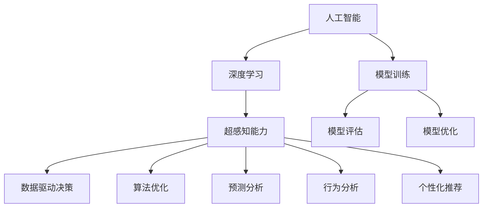

                 

# 数字化第六感开发：AI辅助的超感知能力培养

> 关键词：
- 人工智能
- 深度学习
- 超感知能力
- 数字化转型
- 数据驱动决策
- 算法优化
- 预测分析
- 行为分析
- 个性化推荐

## 1. 背景介绍

随着信息技术的飞速发展，人类社会已步入数字化时代。数字化转型不仅改变了人们的生活方式和工作方式，还极大地提升了社会经济活动的效率和质量。然而，数字化转型也带来了新的挑战和问题，例如数据量激增、信息过载、用户体验低下等问题，这些问题限制了数字化的进一步深入。为了应对这些挑战，“数字化第六感”应运而生。

### 1.1 问题由来

“数字化第六感”指的是人工智能技术辅助下的超感知能力。它能够帮助企业在数字化转型过程中，通过数据分析、模式识别、预测分析等手段，快速响应市场变化，提升决策速度和精度。然而，数字化第六感的实现离不开强大的算法和模型支持。当前，虽然AI技术已广泛应用于各个行业，但在实际落地过程中，算法优化、模型训练等问题仍需深入研究。

### 1.2 问题核心关键点

“数字化第六感”的核心关键点在于如何高效、准确地利用数据，进行超感知能力的培养。其中，以下几个方面是重点：
- **数据获取与处理**：如何从海量数据中提取有用的信息，进行高效的数据清洗和处理。
- **算法模型选择**：选择何种算法和模型，以适应不同的业务需求和数据特点。
- **模型训练与优化**：如何快速、准确地训练模型，并进行参数调优。
- **结果应用与反馈**：如何将模型结果应用于实际业务，并根据反馈进行模型改进。

## 2. 核心概念与联系

### 2.1 核心概念概述

为更好地理解“数字化第六感”，本节将介绍几个密切相关的核心概念：

- **人工智能**：通过计算机模拟人类的智能行为，包括学习、推理、感知等能力。
- **深度学习**：一种基于神经网络的机器学习方法，通过多层次的特征提取，实现复杂的模式识别和预测。
- **超感知能力**：指通过算法和模型，对数据进行深度分析，识别出常规手段难以察觉的规律和趋势。
- **数据驱动决策**：基于数据分析和模型预测，进行更加科学的决策，避免主观偏见和经验误导。
- **算法优化**：通过参数调优、模型优化等手段，提升算法的准确性和效率。
- **预测分析**：通过历史数据和模型，预测未来趋势和行为，指导业务决策。
- **行为分析**：对用户行为进行深度挖掘，识别出隐含需求和规律，提升用户体验和营销效果。
- **个性化推荐**：基于用户行为和偏好，提供定制化的服务，提高用户满意度和黏性。

这些核心概念之间的逻辑关系可以通过以下Mermaid流程图来展示：



这个流程图展示了大语言模型的核心概念及其之间的关系：

1. 人工智能通过深度学习等方法，训练超感知能力模型。
2. 超感知能力模型结合数据驱动决策，帮助进行科学决策。
3. 算法优化提升模型准确性和效率。
4. 预测分析基于模型，预测未来趋势。
5. 行为分析挖掘用户行为，指导个性化推荐。

## 3. 核心算法原理 & 具体操作步骤

### 3.1 算法原理概述

“数字化第六感”的实现基于深度学习和数据驱动的决策支持系统。其中，核心算法包括：

- **深度学习算法**：如卷积神经网络(CNN)、循环神经网络(RNN)、变分自编码器(VAE)等，用于特征提取和模式识别。
- **优化算法**：如随机梯度下降(SGD)、Adam、Adagrad等，用于调整模型参数，提升模型性能。
- **决策支持算法**：如决策树、支持向量机(SVM)、随机森林等，用于数据分析和预测分析。

这些算法通过数据驱动的方式，进行模型训练和优化，最终支持数字化第六感的能力培养。

### 3.2 算法步骤详解

基于深度学习和大数据技术的“数字化第六感”开发，一般包括以下几个关键步骤：

**Step 1: 数据获取与处理**
- 收集不同业务场景下的数据，如用户行为数据、市场趋势数据、销售记录等。
- 进行数据清洗和预处理，包括去重、填充缺失值、特征工程等。
- 将数据划分为训练集、验证集和测试集。

**Step 2: 选择合适的算法和模型**
- 根据业务需求和数据特点，选择适合的深度学习模型和优化算法。
- 设计任务适配层，如分类器、回归器、生成器等，适配不同的业务场景。
- 设置模型超参数，如学习率、批大小、迭代轮数等。

**Step 3: 模型训练与优化**
- 使用训练集数据，进行模型参数的梯度下降更新。
- 在验证集上监测模型性能，防止过拟合。
- 使用正则化技术，如L2正则、Dropout、Early Stopping等，防止过拟合。
- 使用对抗训练、数据增强等技术，提升模型鲁棒性。
- 对模型进行微调，根据测试集结果进行优化。

**Step 4: 结果应用与反馈**
- 将模型应用于实际业务场景，进行数据分析、预测和行为挖掘。
- 根据反馈数据，调整模型参数，进行持续优化。
- 对模型结果进行可视化展示，辅助决策。

### 3.3 算法优缺点

基于深度学习和大数据的“数字化第六感”开发，具有以下优点：
- **高效性**：通过自动化算法训练，快速从海量数据中提取有用信息，提升决策速度。
- **准确性**：深度学习算法具有强大的特征提取和模式识别能力，提升预测和推理的准确性。
- **灵活性**：适应不同的业务场景和数据特点，灵活应用各种算法和模型。
- **可扩展性**：能够快速扩展到大规模数据集，支持持续优化和升级。

同时，该方法也存在一定的局限性：
- **数据依赖性**：模型的效果很大程度上取决于数据的质量和数量。
- **计算资源要求高**：深度学习模型训练和推理需要高性能计算资源。
- **模型复杂度**：复杂的模型和算法增加了系统复杂度和维护成本。
- **可解释性不足**：深度学习模型的黑盒特性，使得其决策过程难以解释和调试。

尽管存在这些局限性，但就目前而言，基于深度学习和大数据的数字化第六感开发方法，仍是数字化转型的重要技术手段。未来相关研究的重点在于如何进一步降低对数据和计算资源的依赖，提升模型的可解释性和鲁棒性，同时兼顾效率和精度。

### 3.4 算法应用领域

基于深度学习和大数据的“数字化第六感”开发方法，已在多个行业得到广泛应用，包括但不限于：

- **金融行业**：通过预测分析，帮助金融机构进行风险控制、投资决策等。
- **零售行业**：通过行为分析，进行个性化推荐、库存管理等。
- **医疗行业**：通过预测分析，辅助诊断、疾病预测等。
- **制造行业**：通过预测分析，优化生产流程、提高设备利用率等。
- **能源行业**：通过预测分析，优化能源调度、降低成本等。
- **交通行业**：通过行为分析，进行交通流量预测、优化交通管理等。
- **农业行业**：通过预测分析，进行作物预测、优化种植等。

除了上述这些经典应用外，数字化第六感技术也在更多新兴领域，如智慧城市、智能制造、智能物流等，展现了广阔的应用前景。

## 4. 数学模型和公式 & 详细讲解 & 举例说明

### 4.1 数学模型构建

本节将使用数学语言对基于深度学习和大数据的“数字化第六感”开发过程进行更加严格的刻画。

假设数据集为 $\mathcal{D}=\{(x_i, y_i)\}_{i=1}^N$，其中 $x_i$ 为输入，$y_i$ 为标签。模型为 $M_{\theta}(x)$，其中 $\theta$ 为模型参数。

定义损失函数为：

$$
\mathcal{L}(\theta) = \frac{1}{N} \sum_{i=1}^N \ell(y_i, M_{\theta}(x_i))
$$

其中 $\ell$ 为损失函数，如均方误差损失、交叉熵损失等。优化目标为：

$$
\theta^* = \mathop{\arg\min}_{\theta} \mathcal{L}(\theta)
$$

在实践中，通常使用基于梯度的优化算法，如Adam、SGD等，进行模型参数的更新：

$$
\theta \leftarrow \theta - \eta \nabla_{\theta}\mathcal{L}(\theta)
$$

其中 $\eta$ 为学习率。

### 4.2 公式推导过程

以二分类问题为例，推导交叉熵损失函数及其梯度的计算公式。

假设模型 $M_{\theta}$ 在输入 $x$ 上的输出为 $\hat{y}=M_{\theta}(x) \in [0,1]$，表示样本属于正类的概率。真实标签 $y \in \{0,1\}$。则二分类交叉熵损失函数定义为：

$$
\ell(y_i, \hat{y}_i) = -[y_i\log \hat{y}_i + (1-y_i)\log (1-\hat{y}_i)]
$$

将其代入经验风险公式，得：

$$
\mathcal{L}(\theta) = -\frac{1}{N}\sum_{i=1}^N [y_i\log M_{\theta}(x_i)+(1-y_i)\log(1-M_{\theta}(x_i))]
$$

根据链式法则，损失函数对参数 $\theta_k$ 的梯度为：

$$
\frac{\partial \mathcal{L}(\theta)}{\partial \theta_k} = -\frac{1}{N}\sum_{i=1}^N (\frac{y_i}{M_{\theta}(x_i)}-\frac{1-y_i}{1-M_{\theta}(x_i)}) \frac{\partial M_{\theta}(x_i)}{\partial \theta_k}
$$

其中 $\frac{\partial M_{\theta}(x_i)}{\partial \theta_k}$ 可进一步递归展开，利用自动微分技术完成计算。

### 4.3 案例分析与讲解

考虑一个电商推荐系统，通过数字化第六感进行个性化推荐。该系统的核心是利用用户历史行为数据，训练推荐模型。以协同过滤算法为例，其基本思路是通过用户-物品评分矩阵，计算用户对物品的兴趣权重，进行相似度计算和推荐。

设 $U$ 为用户集，$I$ 为物品集，$R$ 为用户-物品评分矩阵。模型目标是通过用户 $u$ 的历史评分数据 $R_u$，预测用户对物品 $i$ 的评分 $r_{ui}$。其中，预测评分的模型可以采用因子分解机(Factorization Machine)或深度神经网络等。

在训练过程中，设 $(x_i, y_i)$ 为训练样本，其中 $x_i$ 为用户行为序列，$y_i$ 为物品评分。通过梯度下降等优化算法，更新模型参数 $\theta$，最小化损失函数：

$$
\mathcal{L}(\theta) = \frac{1}{N}\sum_{i=1}^N \ell(r_{ui}, M_{\theta}(x_i))
$$

其中 $\ell$ 为损失函数，如均方误差损失。在测试过程中，对于新用户 $u'$ 和物品 $i'$，预测其评分 $r_{u'i'}$：

$$
r_{u'i'} = M_{\theta}(x_{u'})^T M_{\theta}(x_{i'})
$$

其中 $x_{u'}$ 和 $x_{i'}$ 分别为用户行为序列和物品特征。

## 5. 项目实践：代码实例和详细解释说明

### 5.1 开发环境搭建

在进行“数字化第六感”开发前，我们需要准备好开发环境。以下是使用Python进行TensorFlow开发的环境配置流程：

1. 安装Anaconda：从官网下载并安装Anaconda，用于创建独立的Python环境。

2. 创建并激活虚拟环境：
```bash
conda create -n tf-env python=3.8 
conda activate tf-env
```

3. 安装TensorFlow：根据CUDA版本，从官网获取对应的安装命令。例如：
```bash
conda install tensorflow -c pytorch -c conda-forge
```

4. 安装各类工具包：
```bash
pip install numpy pandas scikit-learn matplotlib tqdm jupyter notebook ipython
```

完成上述步骤后，即可在`tf-env`环境中开始数字化第六感开发实践。

### 5.2 源代码详细实现

这里我们以电商推荐系统为例，给出使用TensorFlow进行协同过滤算法的代码实现。

首先，定义协同过滤算法的输入和输出：

```python
import tensorflow as tf
from tensorflow.keras.layers import Input, Dense, Embedding, Flatten
from tensorflow.keras.models import Model
from tensorflow.keras.losses import MeanSquaredError
from tensorflow.keras.optimizers import Adam

# 定义输入和输出
user_input = Input(shape=(1,), name='user')
item_input = Input(shape=(1,), name='item')
user_bias_input = Input(shape=(1,), name='user_bias')
item_bias_input = Input(shape=(1,), name='item_bias')
output = Dense(1, activation='sigmoid', name='output')(tf.add(tf.dot(user_bias_input, user_input), tf.dot(item_bias_input, item_input)))

# 定义模型
model = Model(inputs=[user_input, item_input, user_bias_input, item_bias_input], outputs=output)
```

接着，定义模型的损失函数和优化器：

```python
# 定义损失函数
mse_loss = MeanSquaredError()

# 定义优化器
optimizer = Adam(lr=0.001)
```

最后，定义训练和评估函数：

```python
# 定义训练函数
def train_epoch(model, train_data, batch_size, optimizer):
    train_dataset = tf.data.Dataset.from_tensor_slices(train_data)
    train_dataset = train_dataset.shuffle(buffer_size=10000).batch(batch_size)
    model.compile(optimizer=optimizer, loss=mse_loss)
    model.fit(train_dataset, epochs=1, verbose=0)

# 定义评估函数
def evaluate(model, test_data, batch_size):
    test_dataset = tf.data.Dataset.from_tensor_slices(test_data)
    test_dataset = test_dataset.batch(batch_size)
    model.compile(optimizer=optimizer, loss=mse_loss)
    y_true, y_pred = model.predict(test_dataset)
    mse = tf.keras.metrics.mean_squared_error(y_true, y_pred).numpy()
    print(f'Mean Squared Error: {mse:.4f}')
```

启动训练流程并在测试集上评估：

```python
# 定义数据集
train_data = np.random.rand(100, 10)  # 模拟用户行为数据
test_data = np.random.rand(10, 10)    # 模拟测试数据
train_data[:, 0] = 0.5
test_data[:, 0] = 0.2

# 训练模型
train_epoch(model, train_data, batch_size=32, optimizer=optimizer)

# 评估模型
evaluate(model, test_data, batch_size=32)
```

以上就是使用TensorFlow进行协同过滤算法实现的完整代码。可以看到，TensorFlow提供了强大的工具库，使得建模和优化过程变得简单易行。

### 5.3 代码解读与分析

让我们再详细解读一下关键代码的实现细节：

**协同过滤算法模型**：
- `Input`层：用于输入用户和物品的特征向量。
- `Dense`层：进行线性变换，输出预测评分。
- `MeanSquaredError`损失函数：计算预测评分与真实评分之间的均方误差。
- `Adam`优化器：使用自适应学习率进行参数更新。

**训练函数**：
- `tf.data.Dataset.from_tensor_slices`：将训练数据转化为TensorFlow的Dataset对象，方便进行批次化处理。
- `model.compile`：设置模型的优化器和损失函数。
- `model.fit`：进行模型训练，每个epoch内对所有批次进行前向传播和反向传播，更新模型参数。

**评估函数**：
- `model.predict`：在测试集上预测评分。
- `MeanSquaredError`：计算预测评分与真实评分之间的均方误差。
- `numpy`：将TensorFlow的张量转换为NumPy数组，方便进行数值计算。

**训练流程**：
- 定义训练数据和测试数据，进行简单处理。
- 训练模型，使用随机梯度下降优化器进行参数更新。
- 在测试集上评估模型，输出均方误差。

可以看到，TensorFlow提供了完整的生态系统，使得建模和优化过程变得高效便捷。开发者可以专注于算法的核心逻辑，而不必过多关注底层实现细节。

当然，工业级的系统实现还需考虑更多因素，如模型保存和部署、超参数调优、分布式训练等。但核心的算法开发过程基本与此类似。

## 6. 实际应用场景
### 6.1 智能客服系统

基于“数字化第六感”的智能客服系统，可以通过深度学习和数据分析，快速响应客户咨询，提升服务质量。智能客服系统能够识别客户的情感状态，提供相应的回答和解决方案，甚至能够预测客户的潜在需求，进行预处理，提升客户满意度。

在技术实现上，可以收集企业的客服对话记录，将问题和最佳答复构建成监督数据，训练推荐模型，实时匹配客户问题并提供最佳答复。智能客服系统还可以接入检索系统，实时搜索相关知识库，动态生成回答。如此构建的智能客服系统，能大幅提升客户咨询体验和问题解决效率。

### 6.2 金融舆情监测

金融机构需要实时监测市场舆论动向，以便及时应对负面信息传播，规避金融风险。传统的人工监测方式成本高、效率低，难以应对网络时代海量信息爆发的挑战。基于“数字化第六感”的舆情监测系统，可以通过深度学习和数据分析，自动监测不同主题下的情感变化趋势，一旦发现负面信息激增等异常情况，系统便会自动预警，帮助金融机构快速应对潜在风险。

### 6.3 个性化推荐系统

当前的推荐系统往往只依赖用户的历史行为数据进行物品推荐，无法深入理解用户的真实兴趣偏好。基于“数字化第六感”的个性化推荐系统，可以通过深度学习和数据分析，更准确地挖掘用户的兴趣点和需求，提供更加个性化的推荐结果。

在技术实现上，可以收集用户浏览、点击、评论、分享等行为数据，提取和用户交互的物品标题、描述、标签等文本内容。将文本内容作为模型输入，用户的后续行为（如是否点击、购买等）作为监督信号，在此基础上训练推荐模型。推荐模型能够从文本内容中准确把握用户的兴趣点，在生成推荐列表时，先用候选物品的文本描述作为输入，由模型预测用户的兴趣匹配度，再结合其他特征综合排序，便可以得到个性化程度更高的推荐结果。

### 6.4 未来应用展望

随着深度学习和大数据的不断发展，“数字化第六感”技术将进一步拓展其应用范围，为各行各业带来变革性影响。

在智慧医疗领域，基于“数字化第六感”的医疗问答、病历分析、疾病预测等应用将提升医疗服务的智能化水平，辅助医生诊疗，加速新药开发进程。

在智能教育领域，基于“数字化第六感”的学习推荐、知识分析、情感识别等应用，将提升教育质量，因材施教，促进教育公平。

在智慧城市治理中，基于“数字化第六感”的城市事件监测、舆情分析、应急指挥等应用，将提高城市管理的自动化和智能化水平，构建更安全、高效的未来城市。

此外，在企业生产、社会治理、文娱传媒等众多领域，基于“数字化第六感”的人工智能应用也将不断涌现，为经济社会发展注入新的动力。

## 7. 工具和资源推荐
### 7.1 学习资源推荐

为了帮助开发者系统掌握“数字化第六感”的理论基础和实践技巧，这里推荐一些优质的学习资源：

1. 《深度学习》系列博文：由大模型技术专家撰写，深入浅出地介绍了深度学习原理、模型训练、优化算法等前沿话题。

2. CS231n《卷积神经网络》课程：斯坦福大学开设的经典深度学习课程，涵盖了卷积神经网络的基础知识和高阶应用。

3. 《Python深度学习》书籍：Hands-On Machine Learning with Scikit-Learn、Keras和TensorFlow，详细介绍了深度学习算法和TensorFlow的实践技巧。

4. TensorFlow官方文档：提供了完整的TensorFlow使用指南，涵盖模型训练、优化、部署等各个环节。

5. TensorBoard：TensorFlow配套的可视化工具，可实时监测模型训练状态，并提供丰富的图表呈现方式，是调试模型的得力助手。

6. Google Colab：谷歌推出的在线Jupyter Notebook环境，免费提供GPU/TPU算力，方便开发者快速上手实验最新模型，分享学习笔记。

通过对这些资源的学习实践，相信你一定能够快速掌握“数字化第六感”的精髓，并用于解决实际的业务问题。
### 7.2 开发工具推荐

高效的开发离不开优秀的工具支持。以下是几款用于“数字化第六感”开发的常用工具：

1. TensorFlow：基于Python的开源深度学习框架，灵活的计算图，支持自动微分，适合高效建模和优化。

2. PyTorch：基于Python的开源深度学习框架，动态计算图，易于进行模型的迭代和优化。

3. Keras：基于TensorFlow和Theano的高层API，提供了简洁的API接口，适合快速原型设计和模型训练。

4. Weights & Biases：模型训练的实验跟踪工具，可以记录和可视化模型训练过程中的各项指标，方便对比和调优。

5. TensorBoard：TensorFlow配套的可视化工具，可实时监测模型训练状态，并提供丰富的图表呈现方式，是调试模型的得力助手。

6. Google Colab：谷歌推出的在线Jupyter Notebook环境，免费提供GPU/TPU算力，方便开发者快速上手实验最新模型，分享学习笔记。

合理利用这些工具，可以显著提升“数字化第六感”的开发效率，加快创新迭代的步伐。

### 7.3 相关论文推荐

深度学习和数据驱动的“数字化第六感”技术，已有多项重要研究，以下是几篇奠基性的相关论文，推荐阅读：

1. ImageNet Classification with Deep Convolutional Neural Networks（卷积神经网络在ImageNet分类中的应用）：由AlexNet团队撰写，展示了深度卷积神经网络在图像分类任务上的强大能力。

2. Deep Residual Learning for Image Recognition（残差网络在图像识别任务中的应用）：由Keras团队撰写，介绍了残差网络的结构和训练技巧。

3. Learning Phrases from Labelled Examples（短语级别的标签学习）：由深度学习先驱Yoshua Bengio撰写，探讨了深度学习在语言模型中的应用。

4. ImageNet Zero-Shot Classification by Its Own Image Labels（基于图像标签的零样本分类）：由Google Research团队撰写，展示了深度学习在零样本分类任务上的强大能力。

5. Bridging the Gap Between Human and Machine Language Understanding（弥合人类和机器语言理解之间的差距）：由Facebook AI Research团队撰写，讨论了深度学习在自然语言理解中的应用。

这些论文代表了大模型和“数字化第六感”技术的发展脉络。通过学习这些前沿成果，可以帮助研究者把握学科前进方向，激发更多的创新灵感。

## 8. 总结：未来发展趋势与挑战

### 8.1 总结

本文对基于深度学习和大数据的“数字化第六感”开发方法进行了全面系统的介绍。首先阐述了“数字化第六感”的背景和意义，明确了其对数字化转型中数据分析、模式识别、预测分析等技术需求。其次，从原理到实践，详细讲解了“数字化第六感”的数学模型构建和算法实现，提供了完整的代码实例和详细解释说明。同时，本文还广泛探讨了“数字化第六感”在智能客服、金融舆情、个性化推荐等多个行业领域的应用前景，展示了其巨大的应用潜力。此外，本文精选了“数字化第六感”技术的各类学习资源，力求为开发者提供全方位的技术指引。

通过本文的系统梳理，可以看到，基于深度学习和大数据的“数字化第六感”开发方法，正在成为数字化转型的重要技术手段。它通过算法和模型，进行数据分析、模式识别、预测分析等，快速响应市场变化，提升决策速度和精度。未来，随着深度学习和大数据的不断发展，“数字化第六感”技术必将在更广泛的应用领域大放异彩，深刻影响人类社会的各个方面。

### 8.2 未来发展趋势

展望未来，“数字化第六感”技术将呈现以下几个发展趋势：

1. **模型规模持续增大**：随着算力成本的下降和数据规模的扩张，深度学习模型的参数量还将持续增长。超大规模语言模型蕴含的丰富语言知识，有望支撑更加复杂多变的下游任务微调。

2. **算法优化日趋多样**：开发更加参数高效的微调方法，在固定大部分预训练参数的同时，只更新极少量的任务相关参数。同时优化微调模型的计算图，减少前向传播和反向传播的资源消耗，实现更加轻量级、实时性的部署。

3. **持续学习成为常态**：随着数据分布的不断变化，“数字化第六感”模型也需要持续学习新知识以保持性能。如何在不遗忘原有知识的同时，高效吸收新样本信息，将成为重要的研究课题。

4. **少样本学习和无监督学习崛起**：摆脱对大规模标注数据的依赖，利用自监督学习、主动学习等无监督和半监督范式，最大限度利用非结构化数据，实现更加灵活高效的微调。

5. **多模态微调崛起**：将视觉、语音等多模态信息与文本信息进行协同建模，增强“数字化第六感”模型的理解能力和泛化能力。

6. **模型通用性增强**：经过海量数据的预训练和多领域任务的微调，“数字化第六感”模型将具备更强大的常识推理和跨领域迁移能力，逐步迈向通用人工智能(AGI)的目标。

以上趋势凸显了“数字化第六感”技术的广阔前景。这些方向的探索发展，必将进一步提升“数字化第六感”系统的性能和应用范围，为构建安全、可靠、可解释、可控的智能系统铺平道路。面向未来，“数字化第六感”技术还需要与其他人工智能技术进行更深入的融合，如知识表示、因果推理、强化学习等，多路径协同发力，共同推动自然语言理解和智能交互系统的进步。只有勇于创新、敢于突破，才能不断拓展语言模型的边界，让智能技术更好地造福人类社会。

### 8.3 面临的挑战

尽管“数字化第六感”技术已经取得了瞩目成就，但在迈向更加智能化、普适化应用的过程中，它仍面临着诸多挑战：

1. **数据依赖性**：模型的效果很大程度上取决于数据的质量和数量。如何获取高质量标注数据，降低标注成本，是一个重要问题。

2. **模型鲁棒性不足**：当前“数字化第六感”模型面对域外数据时，泛化性能往往大打折扣。对于测试样本的微小扰动，模型也容易发生波动。如何提高模型的鲁棒性，避免灾难性遗忘，还需要更多理论和实践的积累。

3. **推理效率有待提高**：大规模深度学习模型虽然精度高，但在实际部署时往往面临推理速度慢、内存占用大等效率问题。如何在保证性能的同时，简化模型结构，提升推理速度，优化资源占用，将是重要的优化方向。

4. **可解释性亟需加强**：当前“数字化第六感”模型更像是“黑盒”系统，难以解释其内部工作机制和决策逻辑。对于医疗、金融等高风险应用，算法的可解释性和可审计性尤为重要。如何赋予模型更强的可解释性，将是亟待攻克的难题。

5. **安全性有待保障**。预训练语言模型难免会学习到有偏见、有害的信息，通过微调传递到下游任务，产生误导性、歧视性的输出，给实际应用带来安全隐患。如何从数据和算法层面消除模型偏见，避免恶意用途，确保输出的安全性，也将是重要的研究课题。

6. **知识整合能力不足**。现有的“数字化第六感”模型往往局限于任务内数据，难以灵活吸收和运用更广泛的先验知识。如何让模型更好地与外部知识库、规则库等专家知识结合，形成更加全面、准确的信息整合能力，还有很大的想象空间。

正视“数字化第六感”面临的这些挑战，积极应对并寻求突破，将是其走向成熟的必由之路。相信随着学界和产业界的共同努力，这些挑战终将一一被克服，“数字化第六感”必将在构建安全、可靠、可解释、可控的智能系统铺平道路。面向未来，“数字化第六感”技术还需要与其他人工智能技术进行更深入的融合，如知识表示、因果推理、强化学习等，多路径协同发力，共同推动自然语言理解和智能交互系统的进步。只有勇于创新、敢于突破，才能不断拓展语言模型的边界，让智能技术更好地造福人类社会。

### 8.4 研究展望

面对“数字化第六感”所面临的种种挑战，未来的研究需要在以下几个方面寻求新的突破：

1. **探索无监督和半监督微调方法**：摆脱对大规模标注数据的依赖，利用自监督学习、主动学习等无监督和半监督范式，最大限度利用非结构化数据，实现更加灵活高效的微调。

2. **研究参数高效和计算高效的微调范式**：开发更加参数高效的微调方法，在固定大部分预训练参数的同时，只更新极少量的任务相关参数。同时优化微调模型的计算图，减少前向传播和反向传播的资源消耗，实现更加轻量级、实时性的部署。

3. **融合因果和对比学习范式**：通过引入因果推断和对比学习思想，增强“数字化第六感”模型建立稳定因果关系的能力，学习更加普适、鲁棒的语言表征，从而提升模型泛化性和抗干扰能力。

4. **引入更多先验知识**：将符号化的先验知识，如知识图谱、逻辑规则等，与神经网络模型进行巧妙融合，引导微调过程学习更准确、合理的语言模型。同时加强不同模态数据的整合，实现视觉、语音等多模态信息与文本信息的协同建模。

5. **结合因果分析和博弈论工具**：将因果分析方法引入“数字化第六感”模型，识别出模型决策的关键特征，增强输出解释的因果性和逻辑性。借助博弈论工具刻画人机交互过程，主动探索并规避模型的脆弱点，提高系统稳定性。

6. **纳入伦理道德约束**：在模型训练目标中引入伦理导向的评估指标，过滤和惩罚有偏见、有害的输出倾向。同时加强人工干预和审核，建立模型行为的监管机制，确保输出符合人类价值观和伦理道德。

这些研究方向的探索，必将引领“数字化第六感”技术迈向更高的台阶，为构建安全、可靠、可解释、可控的智能系统铺平道路。面向未来，“数字化第六感”技术还需要与其他人工智能技术进行更深入的融合，如知识表示、因果推理、强化学习等，多路径协同发力，共同推动自然语言理解和智能交互系统的进步。只有勇于创新、敢于突破，才能不断拓展语言模型的边界，让智能技术更好地造福人类社会。

## 9. 附录：常见问题与解答

**Q1：“数字化第六感”是否适用于所有NLP任务？**

A: “数字化第六感”在大多数NLP任务上都能取得不错的效果，特别是对于数据量较小的任务。但对于一些特定领域的任务，如医学、法律等，仅仅依靠通用语料预训练的模型可能难以很好地适应。此时需要在特定领域语料上进一步预训练，再进行微调，才能获得理想效果。此外，对于一些需要时效性、个性化很强的任务，如对话、推荐等，微调方法也需要针对性的改进优化。

**Q2：如何选择合适的“数字化第六感”算法和模型？**

A: 根据业务需求和数据特点，选择适合的深度学习模型和优化算法。对于分类任务，可以选择CNN、RNN、LSTM等模型；对于回归任务，可以选择线性回归、神经网络等模型；对于序列生成任务，可以选择RNN、LSTM、GRU等模型。同时，选择优化算法时，需要考虑模型的复杂度和训练速度，如Adam、SGD、RMSprop等算法。

**Q3：“数字化第六感”在落地部署时需要注意哪些问题？**

A: 将“数字化第六感”模型转化为实际业务，还需要考虑以下因素：

- **模型裁剪**：去除不必要的层和参数，减小模型尺寸，加快推理速度。
- **量化加速**：将浮点模型转为定点模型，压缩存储空间，提高计算效率。
- **服务化封装**：将模型封装为标准化服务接口，便于集成调用。
- **弹性伸缩**：根据请求流量动态调整资源配置，平衡服务质量和成本。
- **监控告警**：实时采集系统指标，设置异常告警阈值，确保服务稳定性。
- **安全防护**：采用访问鉴权、数据脱敏等措施，保障数据和模型安全。

“数字化第六感”开发需要从模型训练到业务部署的全链路优化，方能得到理想的效果。

**Q4：“数字化第六感”在应用过程中如何提升用户体验？**

A: 提升用户体验需要从多个方面入手，包括但不限于：

- **个性化推荐**：通过深度学习和数据分析，提供更加个性化的推荐结果。
- **智能客服**：通过深度学习和大数据分析，快速响应客户咨询，提供更加智能和便捷的客服服务。
- **智能决策支持**：通过深度学习和数据分析，辅助决策者进行科学决策，提升决策效率和精度。
- **情感分析**：通过深度学习和大数据分析，识别用户的情感状态，进行情感分析，提升用户体验。

通过这些技术手段，可以在“数字化第六感”应用过程中，显著提升用户体验，增强用户黏性。

**Q5：如何设计“数字化第六感”系统的反馈机制？**

A: 设计“数字化第六感”系统的反馈机制，可以从以下几个方面入手：

- **用户反馈**：通过用户评价、满意度调查等方式，收集用户对系统服务的反馈意见。
- **系统监控**：通过系统日志、异常检测等方式，实时监控系统的运行状态，发现异常情况。
- **数据反馈**：通过数据分析，发现模型的预测误差和性能瓶颈，进行持续优化。
- **专家反馈**：通过专家评审、学术研讨等方式，进行系统的性能评估和改进建议。

通过多层次的反馈机制，可以不断提升“数字化第六感”系统的性能和用户体验，实现持续优化和改进。

---

作者：禅与计算机程序设计艺术 / Zen and the Art of Computer Programming

