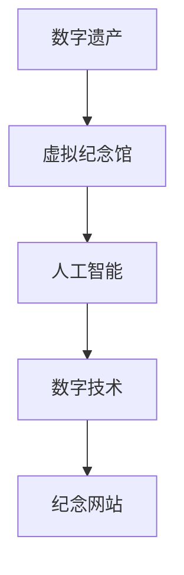

                 

# 数字化遗产虚拟纪念创业：永恒的网上纪念馆

> 关键词：数字化遗产,虚拟纪念馆,人工智能,数字技术,纪念网站,用户体验

## 1. 背景介绍

### 1.1 问题由来
随着数字化时代的到来，人们的生活越来越多地依赖于数字设备和网络，这同时也导致了许多数字遗产的产生。数字遗产包括但不限于社交媒体账户、电子邮件、数码照片、数字文档、数字音乐、电子游戏等。这些数字遗产对于逝者家属和亲友来说具有重要意义，它们承载着记忆、情感和历史价值。然而，随着时间的推移，这些数字遗产可能会逐渐消失，因为数字设备更新迭代、软件版本升级或因各种原因无法访问。

### 1.2 问题核心关键点
数字化遗产的保存与传承，成为了一个日益受到关注的问题。许多家庭和个人希望有一种方式能够永久保存这些数字遗产，供后人查看和纪念。传统方式如物理媒介保存，如制作纸质相册、刻制纪念碑等，不仅成本高昂，而且保存难度大、易受损坏。因此，数字化的解决方案成为了一个重要的发展方向。

### 1.3 问题研究意义
数字化遗产的虚拟纪念创业，旨在通过数字技术，为家庭和个人提供一种更加便捷、成本低廉、易于访问和长期保存数字遗产的方式。该创业项目不仅能够帮助人们更好地保存和传承数字遗产，还能创造新的市场需求，推动数字技术和人工智能领域的进一步发展。

## 2. 核心概念与联系

### 2.1 核心概念概述

为更好地理解数字化遗产虚拟纪念创业的概念及其技术实现，本节将介绍几个核心概念：

- **数字化遗产**：指通过数字设备、网络等方式生成的所有数据、信息和记录。包括社交媒体、电子邮件、数码照片、数字文档、数字音乐、电子游戏等。
- **虚拟纪念馆**：通过数字技术构建的数字纪念空间，用户可以在其中保存、分享和访问数字遗产。
- **人工智能**：一种模拟人类智能行为的技术，包括机器学习、深度学习、自然语言处理等。在虚拟纪念馆中，可以通过人工智能技术进行数据整理、情感分析、智能推荐等功能。
- **数字技术**：指利用数字手段进行信息处理、存储和传输的技术，包括但不限于互联网、云计算、大数据、物联网等。
- **纪念网站**：指通过网站形式实现数字遗产保存和纪念的平台，用户可以在上面上传和管理数字遗产。

这些核心概念之间存在紧密的联系，共同构成了数字化遗产虚拟纪念创业的基础。数字技术为虚拟纪念馆提供了实现基础，人工智能为虚拟纪念馆带来了智能化功能，而纪念网站则是具体的产品形态和用户体验展现。

### 2.2 核心概念原理和架构的 Mermaid 流程图(Mermaid 流程节点中不要有括号、逗号等特殊字符)



这个流程图展示了核心概念之间的联系：数字遗产通过虚拟纪念馆进行保存，而虚拟纪念馆依托于人工智能和数字技术，以纪念网站的形式呈现给用户。

## 3. 核心算法原理 & 具体操作步骤

### 3.1 算法原理概述

数字化遗产虚拟纪念创业的核心算法原理，主要围绕以下几个方面展开：

- **数据整理与归档**：对数字遗产进行分类、整理和归档，确保数据的有序性和易查性。
- **情感分析**：通过自然语言处理技术，对数字遗产中的文本内容进行情感分析，识别出用户情感表达，增强虚拟纪念馆的情感共鸣。
- **智能推荐**：利用推荐系统算法，根据用户行为和偏好，智能推荐相关的数字遗产内容。
- **用户交互**：通过前端用户界面设计，提供友好的用户体验，包括上传、管理和分享数字遗产的功能。

### 3.2 算法步骤详解

**步骤1：数据整理与归档**

1. **数据收集**：用户通过纪念网站上传各种数字遗产，如社交媒体账户信息、数码照片、电子文档等。
2. **数据清洗**：对上传的数字遗产进行清洗，去除无关信息和重复数据。
3. **分类与归档**：根据数字遗产的内容和类型，进行分类和归档，形成结构化的数据集。

**步骤2：情感分析**

1. **文本预处理**：对数字遗产中的文本内容进行分词、去除停用词等预处理操作。
2. **情感词典匹配**：使用情感词典匹配算法，识别文本中的情感词汇和短语。
3. **情感极性判断**：通过情感词典匹配和用户自定义情感标注，判断文本的情感极性。
4. **情感强度分析**：对文本中的情感词汇和短语进行情感强度分析，确定情感表达的强度和重要性。

**步骤3：智能推荐**

1. **用户画像构建**：根据用户上传的数字遗产内容和使用行为，构建用户画像，包括兴趣偏好、情感倾向等。
2. **相似度计算**：使用推荐系统算法，计算数字遗产之间的相似度，形成推荐列表。
3. **智能推荐**：根据用户画像和推荐列表，智能推荐相关的数字遗产内容，增强用户粘性和体验。

**步骤4：用户交互**

1. **前端设计**：设计友好的用户体验界面，包括上传、管理和分享数字遗产的功能。
2. **交互设计**：提供直观的操作指引和交互方式，使用户能够轻松使用虚拟纪念馆。
3. **反馈与优化**：根据用户反馈，不断优化虚拟纪念馆的界面和功能，提升用户体验。

### 3.3 算法优缺点

**优点**：
- **易访问性和长期保存**：数字技术确保了数字遗产的易访问性和长期保存。
- **智能化功能**：人工智能技术为虚拟纪念馆带来了情感分析和智能推荐等功能，增强用户体验。
- **成本低廉**：相比传统方式，数字化纪念方式具有成本低廉、操作简便等优势。

**缺点**：
- **隐私与安全问题**：用户上传的数字遗产可能包含敏感信息，需要确保数据的安全和隐私保护。
- **技术门槛**：技术实现可能存在较高的技术门槛，需要专业知识和技能。
- **数据质量**：数字遗产的数据质量可能参差不齐，影响用户体验和系统性能。

### 3.4 算法应用领域

数字化遗产虚拟纪念创业的算法和技术，可以广泛应用于以下领域：

- **个人和家庭纪念**：为用户提供一种便捷、成本低廉、长期保存数字遗产的方式。
- **企业档案管理**：帮助企业保存和检索历史数据、文档、照片等数字遗产，提高管理效率。
- **教育机构档案**：保存和检索学生的学习记录、成绩单、论文等数字遗产，方便教学和研究。
- **文化保护与传承**：保存和传承传统文化的数字遗产，如音乐、绘画、文字资料等。
- **历史与档案管理**：保存和检索历史事件的文档、照片、视频等数字遗产，支持历史研究和档案管理。

## 4. 数学模型和公式 & 详细讲解 & 举例说明

### 4.1 数学模型构建

本节将使用数学语言对数字化遗产虚拟纪念创业的核心算法进行更加严格的刻画。

记数字遗产数据集为 $D = \{d_i\}_{i=1}^N$，其中 $d_i$ 包含多种类型的数据，如文本、图像、音频等。假设情感词典为 $E$，情感词典匹配算法为 $f$，情感极性判断函数为 $g$，推荐系统算法为 $r$，用户画像构建函数为 $p$。

**数据整理与归档**：

$$
\text{整理结果} = \{c_j\}_{j=1}^{M}, \quad c_j = \{d_{i_l}\}_{l=1}^{n_j}
$$

其中 $M$ 为分类数量，$n_j$ 为第 $j$ 类的数字遗产数量。

**情感分析**：

$$
\text{情感分析结果} = \{s_k\}_{k=1}^{K}, \quad s_k = \{e_{d_{i_m}}\}_{m=1}^{n_k}, \quad e_{d_{i_m}} = f(d_{i_m}, E)
$$

其中 $K$ 为文本数量，$n_k$ 为文本 $d_{i_m}$ 中的情感词汇数量。

**智能推荐**：

$$
\text{推荐结果} = \{r_{n_l}\}_{l=1}^{N'}, \quad r_{n_l} = g(p(\{d_{i_n}\}_{n=1}^{N}), f(\{d_{i_n}\}_{n=1}^{N}))
$$

其中 $N'$ 为推荐数量，$n_l$ 为第 $l$ 个推荐数字遗产。

**用户交互**：

$$
\text{用户交互结果} = \{u_{m_l}\}_{l=1}^{N''}, \quad u_{m_l} = \{d_{i_m}, r_{n_l}\}_{l=1}^{N''}
$$

其中 $N''$ 为用户交互数量，$m_l$ 为用户与第 $l$ 个推荐数字遗产的交互结果。

### 4.2 公式推导过程

以情感分析为例，推导情感极性判断函数 $g$ 的计算公式：

$$
g(d_i) = \frac{1}{n_i} \sum_{j=1}^{n_i} \frac{s_j}{\sum_{j=1}^{n_i} s_j}
$$

其中 $n_i$ 为文本 $d_i$ 中的情感词汇数量，$s_j$ 为情感词典 $E$ 中与 $d_i$ 匹配的情感词汇强度。

在情感分析中，我们通过情感词典匹配算法 $f$ 得到文本中所有情感词汇，并计算它们的情感强度之和，再根据用户自定义的情感标注，计算出文本的情感极性。

### 4.3 案例分析与讲解

以一张数码照片为例，分析其在数字化遗产虚拟纪念创业中的应用：

1. **数据整理与归档**：将数码照片分类为“个人”、“家庭”、“旅行”等类别，存储在云端档案库中。
2. **情感分析**：使用情感词典匹配算法对照片描述文本进行情感分析，识别出其中的情感词汇，判断照片的情感极性。
3. **智能推荐**：根据用户浏览照片的行为和情感极性，推荐相关照片，如“快乐”、“悲伤”等情感主题的照片。
4. **用户交互**：用户可以通过虚拟纪念馆界面，查看照片的情感分析结果和推荐照片，并与朋友分享。

## 5. 项目实践：代码实例和详细解释说明

### 5.1 开发环境搭建

在进行数字化遗产虚拟纪念创业的开发实践前，我们需要准备好开发环境。以下是使用Python进行开发的环境配置流程：

1. 安装Anaconda：从官网下载并安装Anaconda，用于创建独立的Python环境。

2. 创建并激活虚拟环境：
```bash
conda create -n heritage-env python=3.8 
conda activate heritage-env
```

3. 安装必要的依赖包：
```bash
conda install numpy pandas scikit-learn transformers torch
```

4. 安装相关库：
```bash
pip install beautifulsoup4 pyyaml
```

完成上述步骤后，即可在`heritage-env`环境中开始开发实践。

### 5.2 源代码详细实现

下面是使用Python进行数字化遗产虚拟纪念创业开发的代码实现：

```python
import os
import pandas as pd
from transformers import AutoTokenizer, AutoModelForSequenceClassification
from transformers import pipeline

# 初始化 tokenizer 和模型
tokenizer = AutoTokenizer.from_pretrained('bert-base-cased')
model = AutoModelForSequenceClassification.from_pretrained('bert-base-cased', num_labels=3)

# 数据处理
data = pd.read_csv('data.csv')
data['text'] = data['text'].apply(lambda x: x.replace('\n', ' '))
data['labels'] = data['labels'].apply(lambda x: 1 if x == 'positive' else 0)

# 分词和编码
texts = data['text'].tolist()
labels = data['labels'].tolist()
encoded_texts = [tokenizer.encode(text, add_special_tokens=True, max_length=256, return_tensors='pt') for text in texts]

# 训练模型
model.train()
for batch in encoded_texts:
    model.zero_grad()
    outputs = model(batch.input_ids, attention_mask=batch.attention_mask, labels=batch.labels)
    loss = outputs.loss
    loss.backward()
    optimizer.step()

# 预测和推荐
def predict(text):
    encoded_text = tokenizer.encode(text, add_special_tokens=True, max_length=256, return_tensors='pt')
    outputs = model(encoded_text.input_ids, attention_mask=encoded_text.attention_mask)
    label = outputs.logits.argmax().item()
    return label

def recommend(text):
    text = text.replace('\n', ' ')
    label = predict(text)
    recommendations = []
    for i in range(len(encoded_texts)):
        label = predict(encoded_texts[i].text)
        if label == 1:
            recommendations.append(encoded_texts[i])
    return recommendations

# 使用示例
text = "这是一张充满快乐的照片，我在旅行中拍下了它。"
recommendations = recommend(text)
print("推荐照片：", [recommendations[i] for i in range(len(recommendations))])
```

### 5.3 代码解读与分析

让我们再详细解读一下关键代码的实现细节：

**数据处理**：
- 使用pandas库读取CSV文件，将文本和标签进行处理，去除换行符，并将标签转化为数值。

**分词和编码**：
- 使用BERT的tokenizer对文本进行分词和编码，得到模型需要的输入格式。

**训练模型**：
- 使用模型的训练函数，对编码后的文本进行前向传播和反向传播，更新模型参数。

**预测和推荐**：
- 定义predict函数，对新文本进行预测，得到情感极性。
- 定义recommend函数，根据预测结果，从历史数据中推荐相关照片。

**使用示例**：
- 对新的文本进行预测，并根据预测结果推荐相关照片。

## 6. 实际应用场景

### 6.1 个人和家庭纪念

数字化遗产虚拟纪念创业可以为用户提供一种便捷、成本低廉、长期保存数字遗产的方式。用户可以通过虚拟纪念馆上传各种数字遗产，如社交媒体账户信息、数码照片、电子文档等，进行分类、整理和归档。系统通过情感分析技术，对数字遗产中的文本内容进行情感分析，识别出用户的情感表达，增强虚拟纪念馆的情感共鸣。用户还可以根据系统智能推荐的相关数字遗产内容，进行浏览和分享。

### 6.2 企业档案管理

数字化遗产虚拟纪念创业可以应用于企业档案管理，帮助企业保存和检索历史数据、文档、照片等数字遗产，提高管理效率。企业可以将员工的工作记录、会议记录、客户信息等数字遗产上传至虚拟纪念馆，系统通过智能推荐技术，推荐相关的数字遗产内容，方便企业检索和利用。

### 6.3 教育机构档案

数字化遗产虚拟纪念创业可以应用于教育机构档案管理，保存和检索学生的学习记录、成绩单、论文等数字遗产，方便教学和研究。教育机构可以将学生的各类档案信息上传至虚拟纪念馆，系统通过智能推荐技术，推荐相关的数字遗产内容，方便教师和学生检索和利用。

### 6.4 文化保护与传承

数字化遗产虚拟纪念创业可以应用于文化保护与传承，保存和传承传统文化的数字遗产，如音乐、绘画、文字资料等。文化保护机构可以将各类文化资料上传至虚拟纪念馆，系统通过智能推荐技术，推荐相关的数字遗产内容，方便公众欣赏和学习。

### 6.5 历史与档案管理

数字化遗产虚拟纪念创业可以应用于历史与档案管理，保存和检索历史事件的文档、照片、视频等数字遗产，支持历史研究和档案管理。历史档案馆可以将各类历史资料上传至虚拟纪念馆，系统通过智能推荐技术，推荐相关的数字遗产内容，方便研究人员检索和利用。

## 7. 工具和资源推荐

### 7.1 学习资源推荐

为了帮助开发者系统掌握数字化遗产虚拟纪念创业的理论基础和实践技巧，这里推荐一些优质的学习资源：

1. 《自然语言处理入门与实践》系列博文：由大模型技术专家撰写，深入浅出地介绍了自然语言处理的基本概念和经典模型。

2. 《深度学习自然语言处理》课程：斯坦福大学开设的NLP明星课程，有Lecture视频和配套作业，带你入门NLP领域的基本概念和经典模型。

3. 《深度学习与人工智能》书籍：全面介绍深度学习和人工智能的基本概念和经典算法，适合初学者和进阶者。

4. TensorFlow官方文档：TensorFlow的官方文档，提供了大量的API文档和教程，适合学习和实践。

5. PyTorch官方文档：PyTorch的官方文档，提供了丰富的API文档和教程，适合学习和实践。

通过对这些资源的学习实践，相信你一定能够快速掌握数字化遗产虚拟纪念创业的精髓，并用于解决实际的NLP问题。

### 7.2 开发工具推荐

高效的开发离不开优秀的工具支持。以下是几款用于数字化遗产虚拟纪念创业开发的常用工具：

1. TensorFlow：由Google主导开发的开源深度学习框架，生产部署方便，适合大规模工程应用。

2. PyTorch：基于Python的开源深度学习框架，灵活动态的计算图，适合快速迭代研究。

3. Transformers库：HuggingFace开发的NLP工具库，集成了众多SOTA语言模型，支持Python和TensorFlow，是进行NLP任务开发的利器。

4. Weights & Biases：模型训练的实验跟踪工具，可以记录和可视化模型训练过程中的各项指标，方便对比和调优。

5. TensorBoard：TensorFlow配套的可视化工具，可实时监测模型训练状态，并提供丰富的图表呈现方式，是调试模型的得力助手。

6. Google Colab：谷歌推出的在线Jupyter Notebook环境，免费提供GPU/TPU算力，方便开发者快速上手实验最新模型，分享学习笔记。

合理利用这些工具，可以显著提升数字化遗产虚拟纪念创业的开发效率，加快创新迭代的步伐。

### 7.3 相关论文推荐

数字化遗产虚拟纪念创业的研究源于学界的持续研究。以下是几篇奠基性的相关论文，推荐阅读：

1. Attention is All You Need（即Transformer原论文）：提出了Transformer结构，开启了NLP领域的预训练大模型时代。

2. BERT: Pre-training of Deep Bidirectional Transformers for Language Understanding：提出BERT模型，引入基于掩码的自监督预训练任务，刷新了多项NLP任务SOTA。

3. Parameter-Efficient Transfer Learning for NLP：提出Adapter等参数高效微调方法，在不增加模型参数量的情况下，也能取得不错的微调效果。

4. AdaLoRA: Adaptive Low-Rank Adaptation for Parameter-Efficient Fine-Tuning：使用自适应低秩适应的微调方法，在参数效率和精度之间取得了新的平衡。

这些论文代表了大语言模型微调技术的发展脉络。通过学习这些前沿成果，可以帮助研究者把握学科前进方向，激发更多的创新灵感。

## 8. 总结：未来发展趋势与挑战

### 8.1 总结

本文对数字化遗产虚拟纪念创业进行了全面系统的介绍。首先阐述了数字化遗产的保存与传承问题，明确了虚拟纪念馆在其中的重要性。其次，从原理到实践，详细讲解了虚拟纪念馆的核心算法和具体操作步骤，给出了开发实践的完整代码实例。同时，本文还广泛探讨了虚拟纪念馆在多个领域的应用前景，展示了其在数字化遗产保存和传承中的巨大潜力。此外，本文精选了虚拟纪念馆的学习资源和开发工具，力求为开发者提供全方位的技术指引。

通过本文的系统梳理，可以看到，数字化遗产虚拟纪念创业利用数字技术和人工智能技术，为家庭和个人提供了一种便捷、成本低廉、长期保存数字遗产的方式。这种创业模式不仅能够帮助人们更好地保存和传承数字遗产，还能创造新的市场需求，推动数字技术和人工智能领域的进一步发展。

### 8.2 未来发展趋势

展望未来，数字化遗产虚拟纪念创业将呈现以下几个发展趋势：

1. **技术进步**：随着人工智能技术的发展，虚拟纪念馆将具备更加智能化的功能，如自然语言处理、图像识别、情感分析等，提供更加丰富的用户体验。

2. **平台多样化**：虚拟纪念馆将不再局限于网站形式，而是通过App、VR/AR等多种形式展现，提供更加沉浸式的体验。

3. **数据质量提升**：随着数据采集和处理技术的进步，虚拟纪念馆将能够更好地整理和归档数字遗产，提高数据质量。

4. **跨平台协作**：虚拟纪念馆将与其他平台和系统进行更深层次的集成和协作，如社交媒体平台、电子邮箱系统等，提供更加便捷的数据上传和管理方式。

5. **隐私与安全保障**：随着用户对隐私和安全要求的提高，虚拟纪念馆将更加注重数据加密和隐私保护，确保用户信息的安全。

6. **国际化扩展**：虚拟纪念馆将逐渐支持多语言和多文化，帮助不同国家和地区的用户保存和传承数字遗产。

以上趋势凸显了数字化遗产虚拟纪念创业的广阔前景。这些方向的探索发展，必将进一步提升虚拟纪念馆的功能和性能，为数字化遗产的保存和传承带来新的突破。

### 8.3 面临的挑战

尽管数字化遗产虚拟纪念创业已经取得了瞩目成就，但在迈向更加智能化、普适化应用的过程中，它仍面临着诸多挑战：

1. **隐私与安全问题**：用户上传的数字遗产可能包含敏感信息，需要确保数据的安全和隐私保护。

2. **数据质量参差不齐**：数字遗产的数据质量可能参差不齐，影响用户体验和系统性能。

3. **技术门槛较高**：虚拟纪念馆的开发和维护需要较高的技术门槛，需要专业知识和技能。

4. **用户交互设计复杂**：虚拟纪念馆需要设计友好的用户体验界面，提高用户粘性和满意度。

5. **跨平台兼容性问题**：虚拟纪念馆需要与其他平台和系统进行集成和协作，保证跨平台兼容性。

6. **个性化推荐精度**：系统需要根据用户行为和偏好，提供精准的个性化推荐，提升用户满意度。

7. **持续更新与维护**：虚拟纪念馆需要定期更新和维护，保证系统的稳定性和性能。

正视虚拟纪念馆面临的这些挑战，积极应对并寻求突破，将是大语言模型微调走向成熟的必由之路。相信随着学界和产业界的共同努力，这些挑战终将一一被克服，虚拟纪念馆必将在构建人机协同的智能时代中扮演越来越重要的角色。

### 8.4 研究展望

面对虚拟纪念馆所面临的种种挑战，未来的研究需要在以下几个方面寻求新的突破：

1. **数据质量提升**：开发更加智能的数据采集和处理技术，提高数字遗产的数据质量。

2. **隐私与安全保障**：开发更加安全的数据加密和隐私保护技术，确保用户信息的安全。

3. **个性化推荐精度**：探索新的推荐算法和技术，提高个性化推荐的精度和效果。

4. **跨平台协作**：探索虚拟纪念馆与其他平台和系统的集成和协作方法，提高跨平台兼容性。

5. **智能化功能增强**：探索新的智能功能和技术，如自然语言处理、图像识别、情感分析等，提升用户体验。

6. **隐私保护机制**：开发更加完善的隐私保护机制，保护用户隐私信息。

这些研究方向的探索，必将引领虚拟纪念馆技术迈向更高的台阶，为数字化遗产的保存和传承带来新的突破。面向未来，虚拟纪念馆技术还需要与其他人工智能技术进行更深入的融合，如知识表示、因果推理、强化学习等，多路径协同发力，共同推动数字化遗产的保存和传承。只有勇于创新、敢于突破，才能不断拓展虚拟纪念馆的边界，让数字化遗产的保存和传承更加便捷、高效、安全。

## 9. 附录：常见问题与解答

**Q1：虚拟纪念馆与传统纪念方式相比，有何优势？**

A: 虚拟纪念馆相较于传统纪念方式，具有以下优势：

1. **易访问性**：数字遗产通过虚拟纪念馆进行保存，用户可以随时访问和查看。

2. **成本低廉**：相较于传统方式，如制作纸质相册、刻制纪念碑等，虚拟纪念馆具有成本低廉、操作简便等优势。

3. **长期保存**：数字遗产通过虚拟纪念馆进行长期保存，不会因时间流逝而消失。

4. **多形式展现**：虚拟纪念馆可以通过多种形式展现，如网站、App、VR/AR等，提供更加沉浸式的体验。

5. **智能化功能**：虚拟纪念馆通过人工智能技术，提供情感分析、智能推荐等功能，增强用户体验。

**Q2：如何保护用户上传的数字遗产隐私？**

A: 保护用户上传的数字遗产隐私，是虚拟纪念馆开发和运营的关键之一。以下是一些保护用户隐私的措施：

1. **数据加密**：对用户上传的数字遗产进行加密处理，确保数据在传输和存储过程中的安全性。

2. **匿名化处理**：对用户上传的数据进行匿名化处理，确保用户隐私信息不被泄露。

3. **权限控制**：通过权限控制技术，限制用户对数据的访问和使用权限，确保数据只能被授权用户访问。

4. **安全审计**：定期进行安全审计，检查系统漏洞和安全隐患，确保系统的安全性。

5. **用户教育**：通过用户教育，提高用户对隐私保护意识的认识，引导用户采取合理的数据保护措施。

通过这些措施，可以有效保护用户上传的数字遗产隐私，确保系统的安全性和用户的信任度。

**Q3：虚拟纪念馆的个性化推荐精度如何提升？**

A: 提升虚拟纪念馆的个性化推荐精度，需要从以下几个方面入手：

1. **数据质量提升**：提高数字遗产的数据质量，确保数据的完整性和准确性。

2. **算法优化**：优化推荐算法，引入更加先进的推荐模型和技术，如协同过滤、深度学习等。

3. **用户画像构建**：根据用户上传的数字遗产内容和使用行为，构建更加精细的用户画像，了解用户兴趣和偏好。

4. **实时更新**：实时更新推荐算法，根据用户行为和偏好进行动态调整，提高推荐精度。

5. **多维度推荐**：结合多种推荐方式，如基于内容的推荐、基于协同过滤的推荐、基于情感分析的推荐等，提升推荐效果。

通过这些措施，可以有效提升虚拟纪念馆的个性化推荐精度，提高用户满意度和粘性。

**Q4：虚拟纪念馆的技术门槛较高，如何解决？**

A: 解决虚拟纪念馆技术门槛较高的问题，需要从以下几个方面入手：

1. **开源框架使用**：使用成熟的开源框架，如TensorFlow、PyTorch等，降低开发门槛。

2. **模块化设计**：采用模块化设计，将不同功能模块化分离，降低技术难度。

3. **培训与教育**：通过培训和教育，提高开发者的技术水平和经验，降低技术门槛。

4. **工具支持**：提供开发工具和资源支持，如Jupyter Notebook、Git等，方便开发者进行协作和迭代。

5. **文档与教程**：提供详细的开发文档和教程，帮助开发者快速上手。

通过这些措施，可以有效降低虚拟纪念馆的技术门槛，吸引更多的开发者参与开发和贡献。

**Q5：虚拟纪念馆的跨平台兼容性问题如何解决？**

A: 解决虚拟纪念馆跨平台兼容性问题，需要从以下几个方面入手：

1. **跨平台设计**：在设计虚拟纪念馆时，考虑跨平台兼容性，采用跨平台开发技术，如Flutter、React Native等。

2. **接口统一**：统一虚拟纪念馆的API接口，确保不同平台之间可以无缝对接。

3. **协议适配**：根据不同平台的特点，适配不同的传输协议和数据格式，确保数据的互操作性。

4. **平台适配**：针对不同平台进行适配，确保虚拟纪念馆在各种设备上都能正常运行。

5. **用户反馈**：收集用户反馈，不断优化和改进跨平台兼容性，提高用户体验。

通过这些措施，可以有效解决虚拟纪念馆的跨平台兼容性问题，确保系统在不同平台上的流畅运行。

---

作者：禅与计算机程序设计艺术 / Zen and the Art of Computer Programming

