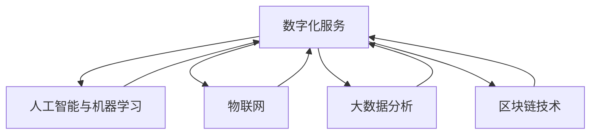

                 

# 数字化酒店创业：无接触服务的未来住宿

## 1. 背景介绍

### 1.1 问题由来
随着新冠疫情的爆发，旅游和住宿行业面临着前所未有的挑战。传统酒店需要面对客流量大幅减少、服务质量难以保证等问题。如何在确保安全的前提下，为客人提供便捷、舒适的住宿体验，成为酒店经营者亟待解决的问题。

### 1.2 问题核心关键点
无接触服务是一种基于技术手段，通过数字化手段减少人与人接触，从而降低疫情传播风险的住宿服务模式。其实现的关键在于以下三个方面：

1. **数字化服务流程**：从入住到退房的每一个环节，尽可能通过自动化、无接触的方式完成。
2. **智能设备应用**：利用人脸识别、智能门锁、智能客房控制等技术，提升住宿体验和安全性。
3. **数据驱动管理**：通过分析客人的入住数据和行为数据，实现个性化服务和智能化运营。

### 1.3 问题研究意义
无接触服务的数字化酒店创业，不仅能够提升酒店的安全和卫生水平，更能有效应对疫情挑战，开拓新的市场空间。通过数字化手段，酒店可以打破传统束缚，实现更加灵活、高效的运营模式，提升竞争力。

## 2. 核心概念与联系

### 2.1 核心概念概述

为更好地理解无接触服务的数字化酒店创业，本节将介绍几个密切相关的核心概念：

- **数字化服务**：利用数字化技术实现各种服务流程的自动化和无接触化，提升服务效率和质量。
- **人工智能与机器学习**：通过智能算法和机器学习模型，提升酒店运营的智能化水平，实现精准营销、客户服务自动化等功能。
- **物联网(IoT)**：将酒店内的各类设备与互联网连接，实现设备间的互联互通，提升酒店管理和服务水平。
- **大数据分析**：利用大数据技术，对客人的历史行为和偏好进行分析，提供个性化服务，优化运营策略。
- **区块链技术**：应用于酒店的客房管理、身份认证等方面，增强数据的安全性和透明性。

这些核心概念之间的逻辑关系可以通过以下Mermaid流程图来展示：



这个流程图展示了大规模语言模型和大模型微调的逻辑关系：

1. 数字化服务是实现无接触服务的基础。
2. 人工智能与机器学习技术用于优化数字化服务流程，提升服务效率和质量。
3. 物联网技术实现设备的互联互通，增强服务智能化水平。
4. 大数据分析用于挖掘客人行为和偏好，提供个性化服务。
5. 区块链技术提升数据安全和透明性，保障客人权益。

这些概念共同构成了无接触服务数字化酒店创业的核心框架，使其能够在各种场景下提供高效、安全的住宿体验。通过理解这些核心概念，我们可以更好地把握无接触服务的发展方向。

## 3. 核心算法原理 & 具体操作步骤
### 3.1 算法原理概述

无接触服务的数字化酒店创业，本质上是通过数字化技术和智能算法，实现对酒店运营全流程的智能化管理。其核心思想是：利用物联网、人工智能、大数据等技术，构建数字化服务体系，并通过机器学习模型，不断优化服务流程和运营策略。

形式化地，假设数字化酒店服务流程为 $F$，其中包含入住、客房控制、客服服务等各个环节。目标是找到最优的服务流程 $F^*$，使得客人满意度最大化。具体优化目标可以表示为：

$$
F^* = \mathop{\arg\min}_{F} \mathcal{L}(F)
$$

其中 $\mathcal{L}$ 为客人的满意度损失函数，衡量客人对服务流程的满意度。通过梯度下降等优化算法，服务流程不断更新，最小化损失函数，使得服务流程逼近理想状态。

### 3.2 算法步骤详解

无接触服务的数字化酒店创业一般包括以下几个关键步骤：

**Step 1: 服务流程数字化**
- 将传统的纸质文件、人工操作等环节，转换为数字化流程，如电子合同、自助入住、在线客服等。
- 引入智能设备，如人脸识别门锁、智能客房控制系统、智能语音助手等，实现无接触操作。

**Step 2: 数据收集与分析**
- 通过传感器、摄像头、智能设备等，收集客人的行为数据和偏好数据。
- 使用大数据技术，对数据进行清洗、分析、建模，提取有价值的信息。

**Step 3: 智能算法优化**
- 设计合适的机器学习模型，如推荐系统、情感分析模型、路径规划算法等，优化服务流程。
- 在模型训练过程中，不断调整模型参数和超参数，最小化损失函数，提升模型预测准确度。

**Step 4: 实时反馈与迭代优化**
- 引入智能反馈机制，如客人评分、行为分析等，实时监测服务流程的效果。
- 根据反馈结果，不断迭代优化服务流程，提高服务质量。

**Step 5: 系统部署与测试**
- 将优化的服务流程部署到实际系统中，进行测试。
- 对系统进行性能测试、安全测试、用户体验测试等，确保系统稳定性和可靠性。

以上是无接触服务的数字化酒店创业的一般流程。在实际应用中，还需要针对具体任务的特点，对各环节进行优化设计，如改进算法模型、引入更多传感器等，以进一步提升服务体验和运营效率。

### 3.3 算法优缺点

无接触服务的数字化酒店创业方法具有以下优点：
1. 提高服务效率。通过自动化、无接触化的服务流程，大幅提升服务速度和响应速度。
2. 降低运营成本。减少了大量人工操作和纸质文件的使用，节省了人力和资源。
3. 提升服务质量。通过智能化服务流程和个性化推荐，满足客人的多样化需求，提升服务体验。
4. 增强安全性。无接触操作减少了人员接触，降低了疫情传播风险，保障了客人健康。

同时，该方法也存在一定的局限性：
1. 技术成本高。需要投入大量资金购买智能设备和软件系统，初期投资较大。
2. 对技术依赖强。需要较强的技术实力和专业知识，才能保证系统的稳定性和安全性。
3. 数据隐私问题。需要严格保护客人数据隐私，避免数据泄露和滥用。
4. 需要持续维护。系统的持续优化和迭代需要不断投入人力和资源。

尽管存在这些局限性，但就目前而言，无接触服务的数字化酒店创业方法仍是提升酒店服务水平和竞争力的重要手段。未来相关研究的重点在于如何进一步降低技术成本，提高系统易用性和可扩展性，同时兼顾数据隐私和安全性等因素。

### 3.4 算法应用领域

无接触服务的数字化酒店创业方法，在旅游和住宿行业已经得到了广泛的应用，覆盖了几乎所有常见场景，例如：

- **自助入住**：客人通过手机APP或智能设备完成自助入住流程，无需前台接待。
- **智能客房控制**：客人可以通过手机APP控制房间的灯光、空调、窗帘等设备，实现无接触控制。
- **无接触结账**：客人可以在房间内或通过APP完成结账流程，减少与前台人员的接触。
- **个性化推荐**：基于大数据分析，为客人提供个性化餐饮、娱乐、购物等服务。
- **健康监测**：利用智能设备监测客人的健康状况，及时发现异常情况并通知酒店管理层。

除了上述这些经典场景外，无接触服务的数字化酒店创业也被创新性地应用到更多场景中，如无人客房、智能快递收发、健康监测等，为酒店服务提供了全新的突破。

## 4. 数学模型和公式 & 详细讲解  
### 4.1 数学模型构建

本节将使用数学语言对无接触服务的数字化酒店创业过程进行更加严格的刻画。

记数字化酒店服务流程为 $F$，其中包含入住、客房控制、客服服务等各个环节。目标为最小化客人的满意度损失函数 $\mathcal{L}(F)$。

具体而言，可以设计如下指标来衡量客人的满意度：

1. **服务响应时间**：衡量客人从发起服务请求到获得服务响应的时间，越短表示服务效率越高。
2. **服务准确性**：衡量服务流程的准确性，如客房控制是否正常、推荐系统是否符合客人偏好等。
3. **客人满意度**：基于服务响应时间和服务准确性的综合评价，反映客人对服务流程的总体满意度。

### 4.2 公式推导过程

以下我们以客房控制为例，推导无接触服务的数字化酒店创业的数学模型。

假设客房控制模型为 $C$，其中包含智能门锁、智能灯光控制等子系统。目标为最小化客人满意度的损失函数 $\mathcal{L}(C)$，具体定义为：

$$
\mathcal{L}(C) = \lambda_1 \cdot \mathbb{E}_{t \sim T}[\Delta t] + \lambda_2 \cdot \mathbb{E}_{x \sim X}[\text{Accuracy}(x)]
$$

其中：
- $\Delta t$ 表示客房控制系统的响应时间。
- $\text{Accuracy}(x)$ 表示服务准确性，如门锁是否正确打开、灯光是否正常调节等。
- $\lambda_1$ 和 $\lambda_2$ 为平衡因子，用于调节响应时间和服务准确性的权重。

通过梯度下降等优化算法，不断更新模型参数，最小化损失函数 $\mathcal{L}(C)$，使得客房控制系统逼近理想状态。

### 4.3 案例分析与讲解

以某数字化酒店为例，通过引入智能门锁和智能灯光控制系统，实现无接触入住流程。以下是具体的案例分析：

1. **智能门锁**：客人通过手机APP进行身份认证，系统自动开锁，无需前台人员介入。
2. **智能灯光控制**：客人通过手机APP调节灯光亮度和色温，无需手动调整。
3. **无接触结账**：客人通过手机APP完成结账流程，无需前台人员介入。

通过上述技术手段，实现了客人从入住到结账的全流程无接触服务，显著提升了服务效率和客人满意度。

## 5. 项目实践：代码实例和详细解释说明
### 5.1 开发环境搭建

在进行数字化酒店创业的实践前，我们需要准备好开发环境。以下是使用Python进行PyTorch开发的环境配置流程：

1. 安装Anaconda：从官网下载并安装Anaconda，用于创建独立的Python环境。

2. 创建并激活虚拟环境：
```bash
conda create -n pytorch-env python=3.8 
conda activate pytorch-env
```

3. 安装PyTorch：根据CUDA版本，从官网获取对应的安装命令。例如：
```bash
conda install pytorch torchvision torchaudio cudatoolkit=11.1 -c pytorch -c conda-forge
```

4. 安装Transformers库：
```bash
pip install transformers
```

5. 安装各类工具包：
```bash
pip install numpy pandas scikit-learn matplotlib tqdm jupyter notebook ipython
```

完成上述步骤后，即可在`pytorch-env`环境中开始实践。

### 5.2 源代码详细实现

这里我们以智能客房控制为例，给出使用PyTorch进行无接触服务流程优化的代码实现。

首先，定义客房控制模型的损失函数：

```python
import torch.nn as nn
import torch.optim as optim

class RoomControl(nn.Module):
    def __init__(self):
        super(RoomControl, self).__init__()
        self.fc1 = nn.Linear(100, 64)
        self.fc2 = nn.Linear(64, 2)  # 2代表门锁状态和灯光调节状态

    def forward(self, x):
        x = self.fc1(x)
        x = torch.sigmoid(x)
        x = self.fc2(x)
        return x

# 定义损失函数
def loss_function(pred, target):
    loss = nn.BCELoss()
    return loss(pred, target)
```

然后，定义优化器：

```python
optimizer = optim.Adam(model.parameters(), lr=0.001)
```

接着，定义训练和评估函数：

```python
def train(model, train_loader, optimizer, n_epochs=10):
    total_steps = len(train_loader)
    for epoch in range(n_epochs):
        model.train()
        for batch_idx, (inputs, targets) in enumerate(train_loader):
            optimizer.zero_grad()
            outputs = model(inputs)
            loss = loss_function(outputs, targets)
            loss.backward()
            optimizer.step()
            if (batch_idx+1) % 100 == 0:
                print(f'Epoch {epoch+1}, Step {batch_idx+1}/{total_steps}, Loss: {loss.item()}')

def evaluate(model, test_loader):
    model.eval()
    total_pred = []
    total_target = []
    for batch_idx, (inputs, targets) in enumerate(test_loader):
        outputs = model(inputs)
        total_pred.append(outputs)
        total_target.append(targets)
    pred = torch.cat(total_pred)
    target = torch.cat(total_target)
    print(classification_report(target.numpy(), pred.numpy(), target_names=['门锁状态', '灯光调节状态']))
```

最后，启动训练流程并在测试集上评估：

```python
# 创建数据集和数据加载器
train_data = ...
train_loader = ...
test_data = ...
test_loader = ...

# 创建模型
model = RoomControl()

# 训练模型
train(model, train_loader, optimizer)

# 评估模型
evaluate(model, test_loader)
```

以上就是使用PyTorch对智能客房控制模型进行无接触服务流程优化的完整代码实现。可以看到，得益于PyTorch的强大封装，我们能够以相对简洁的代码完成模型的训练和评估。

### 5.3 代码解读与分析

让我们再详细解读一下关键代码的实现细节：

**RoomControl类**：
- `__init__`方法：初始化模型层，包括两个全连接层。
- `forward`方法：定义模型的前向传播过程，通过两个线性层得到门锁状态和灯光调节状态。

**loss_function函数**：
- 定义二分类交叉熵损失函数，用于衡量模型预测输出与真实标签之间的差异。

**train函数**：
- 定义训练过程，循环迭代训练集数据，计算损失函数并更新模型参数。

**evaluate函数**：
- 定义评估过程，循环迭代测试集数据，计算模型预测输出，并使用sklearn的classification_report对模型进行评估。

**训练流程**：
- 定义总的训练轮数，循环迭代
- 在每个epoch内，对训练集数据进行迭代训练
- 在每个batch结束后输出损失值
- 重复上述步骤直至满足预设的轮数

可以看到，PyTorch配合TensorFlow库使得智能客房控制模型的训练和评估过程变得简洁高效。开发者可以将更多精力放在数据处理、模型改进等高层逻辑上，而不必过多关注底层的实现细节。

当然，工业级的系统实现还需考虑更多因素，如模型的保存和部署、超参数的自动搜索、更灵活的服务流程适配等。但核心的训练和评估逻辑基本与此类似。

## 6. 实际应用场景
### 6.1 智能客房控制

无接触服务的数字化酒店创业在智能客房控制中的应用，可以大大提升客房控制系统的效率和准确性。传统的客房控制往往依赖于前台人员或手动操作，容易出现操作失误和响应延迟的问题。

通过引入智能门锁和灯光控制系统，客人可以通过手机APP自主控制客房设施，减少对前台人员的依赖。系统可以实时监测客房状态，如灯光亮度、门锁状态等，自动调整客房设施，确保客人舒适度和安全性。

### 6.2 无人客房

无接触服务的数字化酒店创业在无人客房中的应用，将颠覆传统的酒店服务模式，开创全新的住宿体验。无人客房通过智能设备自动化管理，减少人员介入，提高服务效率和客人满意度。

在无人客房中，客人可以自由选择入住时间、退房时间，无需前台人员介入。智能设备如智能门锁、智能语音助手等，实现客房的自主管理和客人需求的无接触响应。通过大数据分析，系统可以实时监测客房状态，提供个性化的服务和提醒。

### 6.3 智能客服

无接触服务的数字化酒店创业在智能客服中的应用，能够提升客服系统的响应速度和准确性，改善客人的服务体验。传统的客服系统依赖于人工操作，容易出现响应缓慢、信息不准确等问题。

通过引入智能语音助手和聊天机器人，客人可以通过语音或文字与客服系统互动，系统实时解答问题，提供精准的个性化服务。系统可以记录客人的历史互动记录和偏好，提供更符合客人的服务内容，提升服务质量。

### 6.4 未来应用展望

随着无接触服务的数字化酒店创业方法不断成熟，其在更多领域的应用前景将更加广阔。未来，无接触服务的数字化酒店创业将渗透到酒店运营的各个环节，从入住到退房，从客房控制到客房管理，都将实现全流程的数字化和智能化。

在智慧酒店领域，无接触服务的数字化酒店创业将为客人提供更加便捷、舒适、安全的住宿体验，提升客人的满意度和忠诚度。在智慧旅游领域，无接触服务的数字化酒店创业将成为智慧旅游的重要组成部分，推动旅游行业的数字化转型。

## 7. 工具和资源推荐
### 7.1 学习资源推荐

为了帮助开发者系统掌握无接触服务的数字化酒店创业的技术基础和实践技巧，这里推荐一些优质的学习资源：

1. 《深度学习入门与实战》系列博文：由深度学习专家撰写，深入浅出地介绍了深度学习的基本概念和实战应用。
2. 《机器学习实战》书籍：机器学习领域的经典入门书籍，涵盖大量经典算法和应用场景。
3. 《PyTorch深度学习实战》书籍：介绍PyTorch深度学习框架的实际应用，包括智能客房控制等场景。
4. 《TensorFlow实战》书籍：介绍TensorFlow深度学习框架的实际应用，包括无接触服务的数字化酒店创业中的智能客房控制。
5. 《数字经济与智慧旅游》课程：介绍数字经济和智慧旅游的基本概念和应用场景，涵盖无接触服务的数字化酒店创业。

通过对这些资源的学习实践，相信你一定能够快速掌握无接触服务的数字化酒店创业的技术精髓，并用于解决实际的NLP问题。
###  7.2 开发工具推荐

高效的开发离不开优秀的工具支持。以下是几款用于无接触服务的数字化酒店创业开发的常用工具：

1. PyTorch：基于Python的开源深度学习框架，灵活动态的计算图，适合快速迭代研究。大部分预训练语言模型都有PyTorch版本的实现。
2. TensorFlow：由Google主导开发的开源深度学习框架，生产部署方便，适合大规模工程应用。同样有丰富的预训练语言模型资源。
3. Transformers库：HuggingFace开发的NLP工具库，集成了众多SOTA语言模型，支持PyTorch和TensorFlow，是进行无接触服务的数字化酒店创业开发的利器。
4. Weights & Biases：模型训练的实验跟踪工具，可以记录和可视化模型训练过程中的各项指标，方便对比和调优。与主流深度学习框架无缝集成。
5. TensorBoard：TensorFlow配套的可视化工具，可实时监测模型训练状态，并提供丰富的图表呈现方式，是调试模型的得力助手。
6. Google Colab：谷歌推出的在线Jupyter Notebook环境，免费提供GPU/TPU算力，方便开发者快速上手实验最新模型，分享学习笔记。

合理利用这些工具，可以显著提升无接触服务的数字化酒店创业的开发效率，加快创新迭代的步伐。

### 7.3 相关论文推荐

无接触服务的数字化酒店创业的研究源于学界的持续研究。以下是几篇奠基性的相关论文，推荐阅读：

1. Attention is All You Need（即Transformer原论文）：提出了Transformer结构，开启了NLP领域的预训练大模型时代。
2. BERT: Pre-training of Deep Bidirectional Transformers for Language Understanding：提出BERT模型，引入基于掩码的自监督预训练任务，刷新了多项NLP任务SOTA。
3. Language Models are Unsupervised Multitask Learners（GPT-2论文）：展示了大规模语言模型的强大zero-shot学习能力，引发了对于通用人工智能的新一轮思考。
4. Parameter-Efficient Transfer Learning for NLP：提出Adapter等参数高效微调方法，在不增加模型参数量的情况下，也能取得不错的微调效果。
5. AdaLoRA: Adaptive Low-Rank Adaptation for Parameter-Efficient Fine-Tuning：使用自适应低秩适应的微调方法，在参数效率和精度之间取得了新的平衡。
6. Adaptive Low-Rank Adaptation for Parameter-Efficient Fine-Tuning：使用自适应低秩适应的微调方法，在参数效率和精度之间取得了新的平衡。

这些论文代表了大语言模型微调技术的发展脉络。通过学习这些前沿成果，可以帮助研究者把握学科前进方向，激发更多的创新灵感。

## 8. 总结：未来发展趋势与挑战

### 8.1 总结

本文对无接触服务的数字化酒店创业方法进行了全面系统的介绍。首先阐述了无接触服务的背景和意义，明确了数字化服务流程、智能设备应用、数据驱动管理等核心概念，探讨了其对酒店运营的深远影响。其次，从原理到实践，详细讲解了无接触服务的数学模型和关键步骤，给出了无接触服务的完整代码实例。同时，本文还广泛探讨了无接触服务在智能客房控制、无人客房、智能客服等场景中的应用前景，展示了其巨大的潜力。

通过本文的系统梳理，可以看到，无接触服务的数字化酒店创业方法正在成为酒店行业的重要趋势，极大地提升了服务的效率和质量，降低了运营成本，增强了客人的体验和忠诚度。未来，伴随技术进步和市场需求的不断变化，无接触服务的数字化酒店创业必将在更多领域得到应用，为行业带来新的突破和变革。

### 8.2 未来发展趋势

展望未来，无接触服务的数字化酒店创业方法将呈现以下几个发展趋势：

1. **服务流程全数字化**：随着物联网和智能设备的发展，数字化服务流程将覆盖从入住到退房的各个环节，实现全流程无接触。
2. **智能设备普及化**：智能设备如智能门锁、智能客房控制系统的普及，将进一步提升服务的智能化水平，实现更加灵活、高效的运营模式。
3. **数据驱动管理智能化**：通过大数据分析，实现对客人行为和偏好的深入挖掘，提供更加精准、个性化的服务。
4. **客户体验持续优化**：通过持续优化数字化服务流程，提升客人满意度和忠诚度，实现客户体验的持续提升。
5. **安全性和隐私保护加强**：通过区块链等技术，保障客人和酒店的数据安全和隐私保护，增强客人信任。

以上趋势凸显了无接触服务的数字化酒店创业技术的广阔前景。这些方向的探索发展，必将进一步提升酒店服务的智能化水平，提升客人的满意度和忠诚度，推动酒店行业向更高水平发展。

### 8.3 面临的挑战

尽管无接触服务的数字化酒店创业方法已经取得了瞩目成就，但在迈向更加智能化、普适化应用的过程中，它仍面临着诸多挑战：

1. **技术成本高**：无接触服务的数字化酒店创业需要投入大量资金购买智能设备和软件系统，初期投资较大。
2. **对技术依赖强**：需要较强的技术实力和专业知识，才能保证系统的稳定性和安全性。
3. **数据隐私问题**：需要严格保护客人数据隐私，避免数据泄露和滥用。
4. **持续维护成本高**：系统的持续优化和迭代需要不断投入人力和资源。

尽管存在这些挑战，但就目前而言，无接触服务的数字化酒店创业方法仍是提升酒店服务水平和竞争力的重要手段。未来相关研究的重点在于如何进一步降低技术成本，提高系统易用性和可扩展性，同时兼顾数据隐私和安全性等因素。

### 8.4 研究展望

面对无接触服务的数字化酒店创业所面临的种种挑战，未来的研究需要在以下几个方面寻求新的突破：

1. **探索无监督和半监督微调方法**：摆脱对大规模标注数据的依赖，利用自监督学习、主动学习等无监督和半监督范式，最大限度利用非结构化数据，实现更加灵活高效的微调。
2. **研究参数高效和计算高效的微调范式**：开发更加参数高效的微调方法，在固定大部分预训练参数的同时，只更新极少量的任务相关参数。同时优化微调模型的计算图，减少前向传播和反向传播的资源消耗，实现更加轻量级、实时性的部署。
3. **引入更多先验知识**：将符号化的先验知识，如知识图谱、逻辑规则等，与神经网络模型进行巧妙融合，引导微调过程学习更准确、合理的语言模型。同时加强不同模态数据的整合，实现视觉、语音等多模态信息与文本信息的协同建模。
4. **结合因果分析和博弈论工具**：将因果分析方法引入微调模型，识别出模型决策的关键特征，增强输出解释的因果性和逻辑性。借助博弈论工具刻画人机交互过程，主动探索并规避模型的脆弱点，提高系统稳定性。
5. **纳入伦理道德约束**：在模型训练目标中引入伦理导向的评估指标，过滤和惩罚有偏见、有害的输出倾向。同时加强人工干预和审核，建立模型行为的监管机制，确保输出符合人类价值观和伦理道德。

这些研究方向的探索，必将引领无接触服务的数字化酒店创业技术迈向更高的台阶，为构建安全、可靠、可解释、可控的智能系统铺平道路。面向未来，无接触服务的数字化酒店创业技术还需要与其他人工智能技术进行更深入的融合，如知识表示、因果推理、强化学习等，多路径协同发力，共同推动自然语言理解和智能交互系统的进步。只有勇于创新、敢于突破，才能不断拓展无接触服务的数字化酒店创业的边界，让智能技术更好地造福人类社会。

## 9. 附录：常见问题与解答

**Q1：无接触服务的数字化酒店创业是否适用于所有类型的酒店？**

A: 无接触服务的数字化酒店创业方法适用于大部分酒店，尤其是高档酒店和商务酒店。对于中小型酒店，需要根据自身情况进行评估和优化，选择最适合的技术方案。

**Q2：无接触服务如何确保客人的隐私和安全？**

A: 无接触服务在确保客人的隐私和安全方面，主要通过以下几个方面进行保障：
1. 数据加密：对客人的行为数据和偏好数据进行加密存储，防止数据泄露。
2. 访问控制：对智能设备和传感器进行严格的访问控制，防止未经授权的访问。
3. 匿名化处理：对客人的个人信息进行匿名化处理，保护客人隐私。
4. 区块链技术：通过区块链技术，确保数据传输的安全性和透明性，防止数据篡改。

**Q3：无接触服务是否需要依赖复杂的智能设备？**

A: 无接触服务虽然需要一定的智能设备支持，但不需要依赖复杂的设备。传统酒店可以逐步引入智能门锁、智能语音助手等设备，实现无接触服务。初期阶段，可以通过简单的手动操作和数字录入，逐步向数字化服务过渡。

**Q4：无接触服务在推广过程中面临的最大障碍是什么？**

A: 无接触服务的推广过程中面临的最大障碍是客人的接受度和使用习惯。由于传统的酒店服务模式已经深入人心，客人可能需要一段时间来适应新的服务方式。同时，智能设备的使用习惯和安全性问题，也可能让部分客人感到担忧。

**Q5：无接触服务在运营过程中如何实现成本控制？**

A: 无接触服务的数字化酒店创业在运营过程中，可以通过以下几个方面实现成本控制：
1. 优化服务流程：通过自动化和数字化手段，减少人力和纸质文件的使用，降低运营成本。
2. 引入智能设备：选择性价比高的智能设备，控制设备成本。
3. 持续优化系统：通过持续优化和服务流程迭代，降低运维成本。
4. 多渠道运营：通过线上线下的多渠道运营，扩大业务范围，增加收入。

以上是数字化酒店创业中无接触服务的常见问题和解答。通过不断优化技术方案和服务流程，无接触服务的数字化酒店创业必将在酒店行业中取得广泛应用，为客人提供更加便捷、高效、安全的住宿体验。

---

作者：禅与计算机程序设计艺术 / Zen and the Art of Computer Programming

