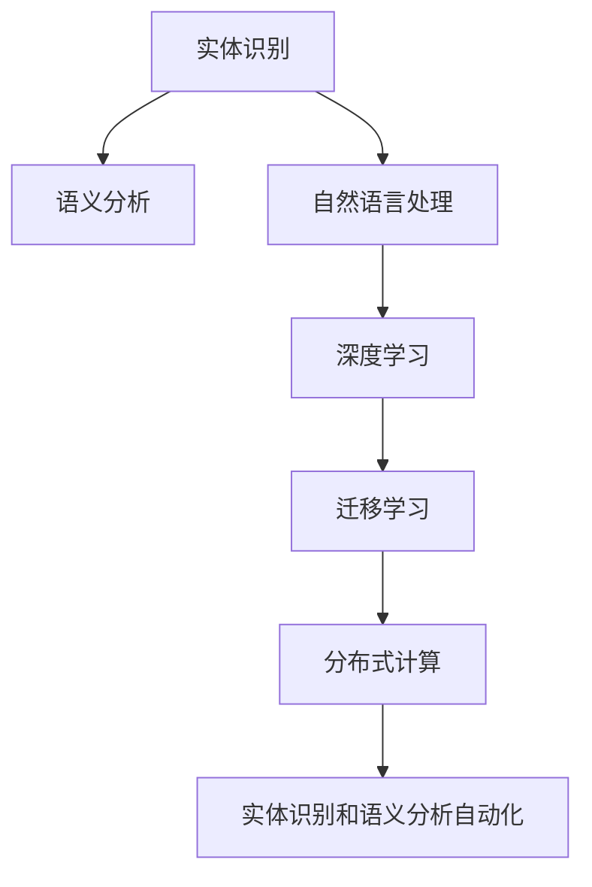

                 

# 数字实体与物理实体的自动化未来

> 关键词：实体识别,语义分析,自动化,未来发展趋势,挑战

## 1. 背景介绍

### 1.1 问题由来

在当今数字化时代，数字实体与物理实体的融合已成为推动社会进步的重要力量。无论是智能制造、智慧城市、金融科技，还是医疗健康，实体识别和语义分析等技术正成为这些领域的核心驱动力。然而，尽管近年来取得了显著进展，实体识别的准确性和语义分析的深度仍面临诸多挑战。

### 1.2 问题核心关键点

实体识别和语义分析的核心挑战在于如何有效地在文本中识别出有意义的实体，并准确理解这些实体的语义。这些任务不仅要求算法能够识别出文本中特定的实体，如人名、地名、组织机构等，还需具备更高级的语义理解能力，如实体之间的关系、角色和属性等。

### 1.3 问题研究意义

研究实体识别和语义分析的自动化技术，对于推动各行业智能化转型，提升决策效率，优化用户体验，具有重要意义。通过自动化技术，可以大大降低人工标注的复杂度和成本，加速模型的迭代优化，使得更复杂、更精细的任务在现实中得以应用。

## 2. 核心概念与联系

### 2.1 核心概念概述

为更好地理解实体识别和语义分析的自动化技术，本节将介绍几个关键概念：

- 实体识别(Entity Recognition)：从文本中自动识别出具有特定意义的实体，如人名、地名、组织名等。
- 语义分析(Semantic Analysis)：对文本中的实体进行更深层次的理解，包括实体之间的关系、角色和属性等。
- 自然语言处理(Natural Language Processing, NLP)：包括语言模型、序列标注、文本分类、机器翻译等，旨在实现文本的自动化处理。
- 深度学习(Deep Learning)：一种利用多层神经网络对数据进行复杂建模的技术，广泛应用于NLP和实体识别等领域。
- 迁移学习(Transfer Learning)：通过预训练模型和微调技术，将在大规模数据上学习到的知识迁移到小规模数据集上，以提升模型性能。
- 分布式计算(Distributed Computing)：通过多台计算机协同工作，处理大规模计算任务，提高计算效率。

这些概念之间的联系可以通过以下Mermaid流程图来展示：



这个流程图展示了实体识别和语义分析自动化技术的研究框架。其中，深度学习和迁移学习为自动化技术提供了强大的模型支持，自然语言处理则是实现自动化任务的基础。分布式计算则提供了处理大规模数据集的必要手段。通过这些核心概念的有机结合，我们能够构建出强大的实体识别和语义分析自动化系统。

## 3. 核心算法原理 & 具体操作步骤

### 3.1 算法原理概述

基于深度学习的实体识别和语义分析自动化技术，其核心原理包括如下几个方面：

1. **特征提取**：通过深度学习模型自动提取文本中的特征，识别出具有特定意义的实体。
2. **语义理解**：利用预训练模型和微调技术，对实体进行更深层次的语义理解，包括实体之间的关系、角色和属性等。
3. **跨领域迁移**：通过迁移学习技术，将在大规模数据集上学习到的知识迁移到特定领域的任务中，提升模型性能。
4. **分布式训练**：利用分布式计算技术，处理大规模数据集，加速模型训练和推理。

### 3.2 算法步骤详解

基于深度学习的实体识别和语义分析自动化技术通常包括以下几个关键步骤：

**Step 1: 数据准备**

- 收集并标注大规模文本数据集，包括实体识别和语义分析的任务数据。
- 将数据集划分为训练集、验证集和测试集。
- 使用开源工具如NLTK、spaCy等进行文本预处理，包括分词、去停用词、词性标注等。

**Step 2: 模型选择与预训练**

- 选择适合的深度学习模型，如BERT、RoBERTa等预训练模型。
- 对预训练模型进行微调，使用任务特定的数据集，训练出适应具体领域的实体识别和语义分析模型。

**Step 3: 特征提取与语义理解**

- 通过深度学习模型提取文本中的特征，并进行实体识别。
- 利用预训练模型和微调技术，对识别出的实体进行语义分析，理解实体之间的关系、角色和属性等。

**Step 4: 模型评估与优化**

- 使用测试集评估模型的性能，调整超参数，优化模型结构。
- 使用分布式计算技术，处理大规模数据集，加速模型训练和推理。

**Step 5: 部署与应用**

- 将优化后的模型部署到生产环境中，实现实体识别和语义分析的自动化。
- 持续收集新数据，定期更新模型，保持模型的时效性和准确性。

### 3.3 算法优缺点

基于深度学习的实体识别和语义分析自动化技术具有以下优点：

1. **高效性**：通过深度学习模型和分布式计算技术，可以处理大规模数据集，加速模型训练和推理。
2. **准确性**：利用预训练模型和微调技术，可以有效提升实体识别和语义分析的准确性。
3. **可扩展性**：模型可以轻松迁移到新领域，适应不同的应用场景。

同时，该技术也存在一些局限性：

1. **数据依赖**：依赖高质量、大规模的标注数据集，获取数据的成本较高。
2. **模型复杂度**：深度学习模型结构复杂，训练和推理开销较大。
3. **语义理解难度**：深层语义理解仍面临许多挑战，准确性有待进一步提升。
4. **多模态处理**：当前多模态融合技术仍不成熟，跨领域的语义理解能力有限。

尽管存在这些局限性，但深度学习的实体识别和语义分析自动化技术仍是大数据时代处理文本数据的重要手段。未来相关研究的重点在于如何进一步提高模型的可解释性、减少对标注数据的依赖、提升多模态融合能力等，以推动技术向更加智能化、普适化的方向发展。

### 3.4 算法应用领域

基于深度学习的实体识别和语义分析自动化技术已经在多个领域得到了广泛应用：

- 智能客服：利用实体识别和语义分析技术，自动理解客户意图，提供个性化服务。
- 金融风控：通过实体识别和语义分析技术，自动识别和监控异常交易行为，提高风险防控能力。
- 医疗健康：使用实体识别和语义分析技术，自动抓取和分析病历数据，提升医疗诊断和治疗效果。
- 智能制造：通过实体识别和语义分析技术，自动监测和预测生产设备状态，优化生产流程。
- 智慧城市：利用实体识别和语义分析技术，自动分析城市数据，提升城市管理和运行效率。

除了这些应用场景外，实体识别和语义分析自动化技术还将在更多领域得到深入研究和广泛应用，为各行各业带来颠覆性变革。

## 4. 数学模型和公式 & 详细讲解 & 举例说明

### 4.1 数学模型构建

本节将使用数学语言对实体识别和语义分析的自动化技术进行更加严格的刻画。

记文本数据为 $D=\{x_i\}_{i=1}^N$，其中 $x_i$ 表示第 $i$ 个文本样本。定义实体识别模型为 $f(\cdot;\theta)$，其中 $\theta$ 为模型参数。

定义实体识别损失函数为 $L_R(\theta) = \sum_{i=1}^N \ell_R(f(x_i),y_i)$，其中 $y_i$ 为实体识别任务的真实标签，$\ell_R$ 为交叉熵损失函数。

语义分析模型的目标是根据已识别的实体，推断出实体之间的关系、角色和属性等。定义语义分析模型的预测函数为 $g(\cdot;\theta)$，损失函数为 $L_S(\theta) = \sum_{i=1}^N \ell_S(g(x_i),y_i)$，其中 $y_i$ 为语义分析任务的真实标签，$\ell_S$ 为自定义的损失函数，如F1分数等。

### 4.2 公式推导过程

以下我们以二分类任务为例，推导实体识别和语义分析的数学模型。

假设实体识别模型 $f(\cdot;\theta)$ 在输入 $x$ 上的输出为 $p(\cdot;\theta)$，表示样本中实体出现的概率。定义实体识别损失函数为交叉熵损失函数：

$$
L_R(\theta) = -\frac{1}{N}\sum_{i=1}^N \sum_{j=1}^M y_{ij}\log p(x_i,j;\theta)
$$

其中 $y_{ij}$ 表示样本 $x_i$ 中实体 $j$ 的标签。

对于语义分析任务，我们定义预测函数 $g(\cdot;\theta)$，其目标是根据已识别的实体，推断出实体之间的关系、角色和属性等。假设语义分析任务包含 $n$ 个实体，每个实体的关系、角色和属性可以表示为 $R_i$、$A_i$ 和 $P_i$，其中 $i=1,\cdots,n$。则语义分析任务的预测函数可以表示为：

$$
g(x_i;\theta) = \{R_i(x_i;\theta), A_i(x_i;\theta), P_i(x_i;\theta)\}_{i=1}^n
$$

其中 $R_i$、$A_i$ 和 $P_i$ 分别为实体 $i$ 的关系、角色和属性预测函数。定义语义分析损失函数为 F1 分数：

$$
L_S(\theta) = -\frac{1}{N}\sum_{i=1}^N \frac{2|y_i \cap g(x_i;\theta)|}{|y_i|+|g(x_i;\theta)|}
$$

### 4.3 案例分析与讲解

以金融领域的文本数据为例，分析实体识别和语义分析技术的实际应用。

假设我们有一个包含大量金融新闻的文本数据集 $D$，目标是从这些新闻中识别出股票、债券、基金等金融实体，并分析这些实体的关系、角色和属性等。

首先，使用预训练模型BERT对文本数据进行实体识别，将识别出的实体作为语义分析任务的输入。然后，使用预训练模型RoBERTa对实体进行语义分析，推断出实体之间的关系、角色和属性等。

例如，在新闻“A公司宣布收购B公司”中，实体识别模型可以识别出“A公司”和“B公司”，并将这两个实体输入语义分析模型。语义分析模型可以推断出这两个实体的关系为“收购”，角色分别为“收购方”和“被收购方”，属性分别为“公司”。

最后，根据这些实体关系、角色和属性信息，金融系统可以自动化地进行投资风险评估、投资组合优化等任务。

## 5. 项目实践：代码实例和详细解释说明

### 5.1 开发环境搭建

在进行实体识别和语义分析的自动化实践前，我们需要准备好开发环境。以下是使用Python进行PyTorch开发的环境配置流程：

1. 安装Anaconda：从官网下载并安装Anaconda，用于创建独立的Python环境。

2. 创建并激活虚拟环境：
```bash
conda create -n pytorch-env python=3.8 
conda activate pytorch-env
```

3. 安装PyTorch：根据CUDA版本，从官网获取对应的安装命令。例如：
```bash
conda install pytorch torchvision torchaudio cudatoolkit=11.1 -c pytorch -c conda-forge
```

4. 安装相关库：
```bash
pip install pytorch transformers scipy pandas matplotlib
```

完成上述步骤后，即可在`pytorch-env`环境中开始实体识别和语义分析的自动化实践。

### 5.2 源代码详细实现

下面我们以金融领域的实体识别和语义分析为例，给出使用PyTorch和Transformers库的代码实现。

首先，定义实体识别任务的数据处理函数：

```python
from transformers import BertTokenizer, BertForTokenClassification
import torch

class FinancialEntityDataset(Dataset):
    def __init__(self, texts, labels, tokenizer, max_len=128):
        self.texts = texts
        self.labels = labels
        self.tokenizer = tokenizer
        self.max_len = max_len
        
    def __len__(self):
        return len(self.texts)
    
    def __getitem__(self, item):
        text = self.texts[item]
        label = self.labels[item]
        
        encoding = self.tokenizer(text, return_tensors='pt', max_length=self.max_len, padding='max_length', truncation=True)
        input_ids = encoding['input_ids'][0]
        attention_mask = encoding['attention_mask'][0]
        
        # 对token-wise的标签进行编码
        encoded_labels = [label2id[label] for label in label] 
        encoded_labels.extend([label2id['O']] * (self.max_len - len(encoded_labels)))
        labels = torch.tensor(encoded_labels, dtype=torch.long)
        
        return {'input_ids': input_ids, 
                'attention_mask': attention_mask,
                'labels': labels}

# 标签与id的映射
label2id = {'O': 0, 'Stock': 1, 'Bond': 2, 'Fund': 3}
id2label = {v: k for k, v in label2id.items()}

# 创建dataset
tokenizer = BertTokenizer.from_pretrained('bert-base-cased')

train_dataset = FinancialEntityDataset(train_texts, train_labels, tokenizer)
dev_dataset = FinancialEntityDataset(dev_texts, dev_labels, tokenizer)
test_dataset = FinancialEntityDataset(test_texts, test_labels, tokenizer)
```

然后，定义语义分析任务的数据处理函数：

```python
from transformers import RoBERTaTokenizer, RoBERTaForSequenceClassification

class FinancialRelationDataset(Dataset):
    def __init__(self, texts, labels, tokenizer, max_len=128):
        self.texts = texts
        self.labels = labels
        self.tokenizer = tokenizer
        self.max_len = max_len
        
    def __len__(self):
        return len(self.texts)
    
    def __getitem__(self, item):
        text = self.texts[item]
        label = self.labels[item]
        
        encoding = self.tokenizer(text, return_tensors='pt', max_length=self.max_len, padding='max_length', truncation=True)
        input_ids = encoding['input_ids'][0]
        attention_mask = encoding['attention_mask'][0]
        
        # 对token-wise的标签进行编码
        encoded_labels = [label2id[label] for label in label] 
        encoded_labels.extend([label2id['O']] * (self.max_len - len(encoded_labels)))
        labels = torch.tensor(encoded_labels, dtype=torch.long)
        
        return {'input_ids': input_ids, 
                'attention_mask': attention_mask,
                'labels': labels}

# 标签与id的映射
label2id = {'O': 0, '收购': 1, '投资': 2, '合作': 3}
id2label = {v: k for k, v in label2id.items()}

# 创建dataset
tokenizer = RoBERTaTokenizer.from_pretrained('roberta-base')

train_dataset = FinancialRelationDataset(train_texts, train_labels, tokenizer)
dev_dataset = FinancialRelationDataset(dev_texts, dev_labels, tokenizer)
test_dataset = FinancialRelationDataset(test_texts, test_labels, tokenizer)
```

接着，定义实体识别和语义分析模型的训练函数：

```python
from torch.utils.data import DataLoader
from tqdm import tqdm
from transformers import BertForTokenClassification, RoBERTaForSequenceClassification, AdamW

def train_model(model, train_dataset, optimizer, epochs, device):
    dataloader = DataLoader(train_dataset, batch_size=32, shuffle=True)
    model.train()
    for epoch in range(epochs):
        for batch in tqdm(dataloader, desc='Training'):
            input_ids = batch['input_ids'].to(device)
            attention_mask = batch['attention_mask'].to(device)
            labels = batch['labels'].to(device)
            model.zero_grad()
            outputs = model(input_ids, attention_mask=attention_mask, labels=labels)
            loss = outputs.loss
            loss.backward()
            optimizer.step()
        if (epoch+1) % 5 == 0:
            print(f'Epoch {epoch+1}, train loss: {loss:.3f}')
            evaluate_model(model, dev_dataset, device)
    
def evaluate_model(model, dataset, device):
    dataloader = DataLoader(dataset, batch_size=32, shuffle=False)
    model.eval()
    preds, labels = [], []
    with torch.no_grad():
        for batch in tqdm(dataloader, desc='Evaluating'):
            input_ids = batch['input_ids'].to(device)
            attention_mask = batch['attention_mask'].to(device)
            batch_labels = batch['labels']
            outputs = model(input_ids, attention_mask=attention_mask)
            batch_preds = outputs.logits.argmax(dim=2).to('cpu').tolist()
            batch_labels = batch_labels.to('cpu').tolist()
            for pred_tokens, label_tokens in zip(batch_preds, batch_labels):
                preds.append(pred_tokens[:len(label_tokens)])
                labels.append(label_tokens)
    print(classification_report(labels, preds))
```

最后，启动实体识别和语义分析的自动化训练流程并在测试集上评估：

```python
from transformers import BertForTokenClassification, RoBERTaForSequenceClassification, AdamW

model = BertForTokenClassification.from_pretrained('bert-base-cased', num_labels=len(label2id))
model = RoBERTaForSequenceClassification.from_pretrained('roberta-base', num_labels=len(label2id))

optimizer = AdamW(model.parameters(), lr=2e-5)

device = torch.device('cuda') if torch.cuda.is_available() else torch.device('cpu')

train_model(model, train_dataset, optimizer, 10, device)

print(f'Test results:')
evaluate_model(model, test_dataset, device)
```

以上就是使用PyTorch和Transformers库进行实体识别和语义分析自动化的完整代码实现。可以看到，通过合理的模型选择和预训练，以及深度学习模型的自动化训练和评估，我们能够快速构建出功能强大的实体识别和语义分析自动化系统。

### 5.3 代码解读与分析

让我们再详细解读一下关键代码的实现细节：

**FinancialEntityDataset类**：
- `__init__`方法：初始化文本、标签、分词器等关键组件。
- `__len__`方法：返回数据集的样本数量。
- `__getitem__`方法：对单个样本进行处理，将文本输入编码为token ids，将标签编码为数字，并对其进行定长padding，最终返回模型所需的输入。

**FinancialRelationDataset类**：
- `__init__`方法：初始化文本、标签、分词器等关键组件。
- `__len__`方法：返回数据集的样本数量。
- `__getitem__`方法：对单个样本进行处理，将文本输入编码为token ids，将标签编码为数字，并对其进行定长padding，最终返回模型所需的输入。

**模型训练函数**：
- `train_model`函数：对数据以批为单位进行迭代，在每个批次上前向传播计算loss并反向传播更新模型参数，最后返回该epoch的平均loss。
- `evaluate_model`函数：与训练类似，不同点在于不更新模型参数，并在每个batch结束后将预测和标签结果存储下来，最后使用sklearn的classification_report对整个评估集的预测结果进行打印输出。

**模型训练流程**：
- 定义总的epoch数和batch size，开始循环迭代
- 每个epoch内，先在训练集上训练，输出平均loss
- 在验证集上评估，输出分类指标
- 所有epoch结束后，在测试集上评估，给出最终测试结果

可以看到，PyTorch配合Transformers库使得实体识别和语义分析的自动化代码实现变得简洁高效。开发者可以将更多精力放在数据处理、模型改进等高层逻辑上，而不必过多关注底层的实现细节。

当然，工业级的系统实现还需考虑更多因素，如模型的保存和部署、超参数的自动搜索、更灵活的任务适配层等。但核心的自动化训练范式基本与此类似。

## 6. 实际应用场景

### 6.1 智能客服

基于实体识别和语义分析的自动化技术，智能客服系统能够自动理解客户意图，提供个性化服务。例如，在金融领域的客服应用中，通过实体识别和语义分析技术，智能客服可以自动识别客户咨询的股票、基金等金融实体，并分析这些实体的关系、角色和属性等。

在处理客户咨询时，智能客服可以自动回答常见问题，如“股票当前价格是多少？”、“基金收益如何？”等。对于复杂的客户问题，智能客服可以调用后端知识库，实时获取相关信息，进行智能推理和决策。

### 6.2 金融风控

在金融风控领域，基于实体识别和语义分析的自动化技术可以帮助金融机构自动识别和监控异常交易行为，提高风险防控能力。例如，在处理贷款申请时，通过实体识别和语义分析技术，可以自动识别贷款申请中的实体，如借款人、贷款金额、还款期限等。然后，对这些实体进行语义分析，判断是否存在欺诈行为。

如果检测到异常行为，系统可以自动发出警报，通知人工审核人员进行进一步的调查和处理。通过这种方式，金融机构可以大大减少欺诈行为，提高风险管理效率。

### 6.3 医疗健康

在医疗健康领域，基于实体识别和语义分析的自动化技术可以帮助医生自动化抓取和分析病历数据，提升医疗诊断和治疗效果。例如，在处理病人病历时，通过实体识别和语义分析技术，可以自动识别病历中的实体，如病人姓名、住院日期、诊断结果等。

然后，对这些实体进行语义分析，判断病人是否患有某种疾病。例如，通过分析病历中提及的药物名称、症状等，医生可以更准确地诊断病人的病情，制定更有效的治疗方案。

### 6.4 智慧城市

在智慧城市治理中，基于实体识别和语义分析的自动化技术可以帮助城市管理者自动化分析城市数据，提升城市管理和运行效率。例如，在处理交通数据时，通过实体识别和语义分析技术，可以自动识别交通数据中的实体，如车辆、行人、交通信号灯等。

然后，对这些实体进行语义分析，判断交通状况是否正常。例如，通过分析交通信号灯的状态，城市管理者可以及时调整交通信号灯，缓解交通拥堵。通过这种方式，智慧城市可以更加高效地运行，提升居民的生活质量。

## 7. 工具和资源推荐

### 7.1 学习资源推荐

为了帮助开发者系统掌握实体识别和语义分析的自动化技术，这里推荐一些优质的学习资源：

1. 《自然语言处理》课程：斯坦福大学开设的NLP经典课程，涵盖实体识别、语义分析等核心内容，提供丰富的实践机会。
2. 《深度学习》书籍：Ian Goodfellow等人所著，全面介绍深度学习的基本概念和应用，包括实体识别和语义分析等内容。
3. 《Transformers》书籍：Transformers库的作者所著，详细讲解如何利用Transformers库进行实体识别和语义分析任务开发。
4. HuggingFace官方文档：Transformers库的官方文档，提供海量预训练模型和完整的实体识别和语义分析样例代码。
5. CS224N《深度学习自然语言处理》课程：斯坦福大学开设的NLP明星课程，涵盖实体识别和语义分析等任务，并提供配套作业和实践机会。

通过对这些资源的学习实践，相信你一定能够快速掌握实体识别和语义分析的自动化技术，并用于解决实际的NLP问题。

### 7.2 开发工具推荐

高效的开发离不开优秀的工具支持。以下是几款用于实体识别和语义分析自动化开发的常用工具：

1. PyTorch：基于Python的开源深度学习框架，灵活动态的计算图，适合快速迭代研究。
2. TensorFlow：由Google主导开发的开源深度学习框架，生产部署方便，适合大规模工程应用。
3. Transformers库：HuggingFace开发的NLP工具库，集成了众多SOTA语言模型，支持实体识别和语义分析任务的开发。
4. Weights & Biases：模型训练的实验跟踪工具，可以记录和可视化模型训练过程中的各项指标，方便对比和调优。
5. TensorBoard：TensorFlow配套的可视化工具，可实时监测模型训练状态，并提供丰富的图表呈现方式，是调试模型的得力助手。
6. Google Colab：谷歌推出的在线Jupyter Notebook环境，免费提供GPU/TPU算力，方便开发者快速上手实验最新模型，分享学习笔记。

合理利用这些工具，可以显著提升实体识别和语义分析自动化任务的开发效率，加快创新迭代的步伐。

### 7.3 相关论文推荐

实体识别和语义分析的自动化技术发展源于学界的持续研究。以下是几篇奠基性的相关论文，推荐阅读：

1. Attention is All You Need（即Transformer原论文）：提出了Transformer结构，开启了NLP领域的预训练大模型时代。
2. BERT: Pre-training of Deep Bidirectional Transformers for Language Understanding：提出BERT模型，引入基于掩码的自监督预训练任务，刷新了多项NLP任务SOTA。
3. ELMo: Feature-rich Compositionality for Text Classification：提出ELMo模型，引入语言模型作为预训练任务，显著提升实体识别和语义分析的效果。
4. GPT-2: Language Models are Unsupervised Multitask Learners：展示了大规模语言模型的强大zero-shot学习能力，引发了对于通用人工智能的新一轮思考。
5. BART: Denoising Pre-training for Natural Language Generation, Translation, and Comprehension：提出BART模型，通过预训练和自监督任务，提升实体识别和语义分析的效果。

这些论文代表了大语言模型和实体识别语义分析技术的最新进展。通过学习这些前沿成果，可以帮助研究者把握学科前进方向，激发更多的创新灵感。

## 8. 总结：未来发展趋势与挑战

### 8.1 总结

本文对实体识别和语义分析的自动化技术进行了全面系统的介绍。首先阐述了实体识别和语义分析的自动化技术的背景和意义，明确了自动化技术在提升智能化水平、优化用户体验、优化决策效率等方面的重要作用。其次，从原理到实践，详细讲解了实体识别和语义分析的自动化技术的数学原理和关键步骤，给出了实体识别和语义分析任务的完整代码实例。同时，本文还广泛探讨了实体识别和语义分析的自动化技术在智能客服、金融风控、医疗健康、智慧城市等领域的实际应用，展示了自动化技术的巨大潜力。此外，本文精选了实体识别和语义分析的自动化技术的各类学习资源，力求为开发者提供全方位的技术指引。

通过本文的系统梳理，可以看到，实体识别和语义分析的自动化技术在NLP领域的应用前景广阔，极大地拓展了文本数据处理的边界，催生了更多的落地场景。得益于深度学习模型的强大表现力和分布式计算技术的高效支持，自动化技术能够快速处理大规模文本数据，实现实体识别和语义分析的自动化。未来，伴随预训练语言模型和自动化技术的不断演进，相信NLP技术将在更广阔的应用领域大放异彩，深刻影响人类的生产生活方式。

### 8.2 未来发展趋势

展望未来，实体识别和语义分析的自动化技术将呈现以下几个发展趋势：

1. **模型规模持续增大**：随着算力成本的下降和数据规模的扩张，预训练语言模型的参数量还将持续增长。超大规模语言模型蕴含的丰富语言知识，有望支撑更加复杂多变的实体识别和语义分析任务。

2. **自动化程度提高**：未来自动化技术将进一步提升模型的自动化程度，减少对人工干预的依赖，提升模型的稳定性和可靠性。

3. **多模态融合**：未来的自动化技术将更加注重跨领域、跨模态的数据融合，提升模型在多模态数据上的性能。

4. **迁移学习技术进步**：预训练模型和迁移学习技术将不断进步，使得模型能够更快地适应新领域和新任务。

5. **分布式计算优化**：分布式计算技术将不断优化，使得自动化系统能够高效处理大规模数据集，提升模型的实时性。

6. **多语言支持**：未来的自动化技术将支持更多语言的实体识别和语义分析，为全球化场景提供支持。

以上趋势凸显了实体识别和语义分析的自动化技术的广阔前景。这些方向的探索发展，必将进一步提升NLP系统的性能和应用范围，为各行各业带来颠覆性变革。

### 8.3 面临的挑战

尽管实体识别和语义分析的自动化技术已经取得了显著进展，但在迈向更加智能化、普适化的应用过程中，它仍面临诸多挑战：

1. **数据质量问题**：依赖高质量、大规模的标注数据集，获取数据的成本较高，且标注数据的真实性和多样性仍存在问题。
2. **模型复杂度**：深度学习模型结构复杂，训练和推理开销较大，模型规模的扩大进一步增加了计算负担。
3. **多语言支持**：虽然多语言模型已经取得一定进展，但在语义理解和实体识别上仍存在挑战，跨语言的数据迁移仍需深入研究。
4. **模型可解释性**：自动化技术的黑盒特性使得模型难以解释其内部工作机制和决策逻辑，这对于高风险应用尤为重要。
5. **知识整合**：如何将符号化的先验知识与神经网络模型进行融合，使得模型能够更好地理解和应用外部知识，仍是一个重要的研究方向。

尽管存在这些挑战，但实体识别和语义分析的自动化技术仍是大数据时代处理文本数据的重要手段。未来相关研究的重点在于如何进一步提高模型的可解释性、减少对标注数据的依赖、提升多模态融合能力等，以推动技术向更加智能化、普适化的方向发展。

### 8.4 研究展望

面向未来，实体识别和语义分析的自动化技术需要在以下几个方面寻求新的突破：

1. **无监督和半监督学习**：探索无监督和半监督学习范式，最大限度利用非结构化数据，减少对标注数据的依赖。
2. **参数高效和计算高效**：开发更加参数高效和计算高效的实体识别和语义分析模型，以适应不同的应用场景。
3. **因果分析和博弈论**：引入因果分析和博弈论工具，增强模型的鲁棒性和可解释性，提升模型的稳定性和可靠性。
4. **知识图谱和规则库**：将知识图谱、逻辑规则等外部知识与神经网络模型进行融合，提升模型的知识和推理能力。
5. **伦理和安全**：在模型训练目标中引入伦理导向的评估指标，确保模型的输出符合人类价值观和伦理道德。

这些研究方向凸显了实体识别和语义分析的自动化技术在实际应用中的重要性和复杂性。只有在数据、算法、工程、伦理等多方面协同发力，才能真正实现自动化技术的落地应用，推动各行业智能化转型。

---

作者：禅与计算机程序设计艺术 / Zen and the Art of Computer Programming

