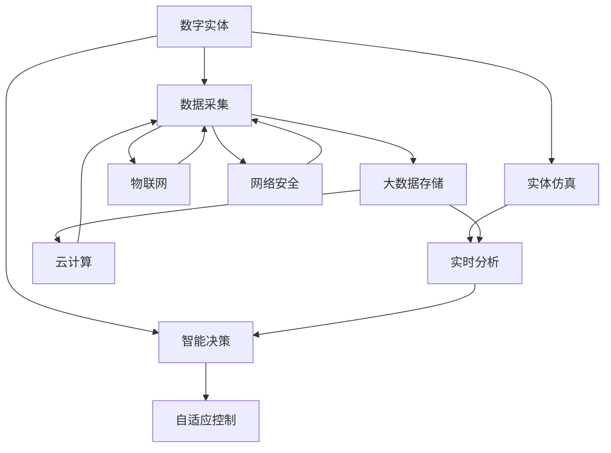

                 

# 数字实体自动化的最新趋势

> 关键词：数字实体、自动化、人工智能、机器学习、自然语言处理、工业4.0、智能制造、数据驱动、数字化转型

## 1. 背景介绍

### 1.1 问题由来

在全球范围内，数字化转型已成为各行各业的共识与必由之路。传统产业在经历了数十年的数字化进程后，逐渐走向了智能化、网络化和数据化的新时代。在这一背景下，数字实体自动化（Digital Entity Automation, DEA）应运而生，成为引领未来工业4.0的核心技术之一。

数字实体自动化，简言之，就是通过先进的数字技术，实现实体（如产品、设备、服务等）在数字化环境中的自主决策、智能控制和动态优化。其核心思想在于，将复杂多变的实体操作流程抽象为数字模型，并通过先进的人工智能与机器学习算法，实现实体自主运行与高效管理。

数字实体自动化的提出，对传统制造业产生了深远影响，推动了智能制造的快速演进，并逐渐向各行业渗透，催生了智能交通、智能医疗、智能农业等新业态。本节将对数字实体自动化的背景进行详细阐述，并梳理相关概念，为后续内容的深入讨论打下基础。

### 1.2 问题核心关键点

数字实体自动化涵盖了一系列关键技术，包括但不限于以下方面：

- **人工智能与机器学习**：通过对实体数据的学习与分析，实现实体行为的智能优化与预测。
- **物联网技术**：构建实体之间的互联互通，实现数据实时采集与共享。
- **云计算与大数据**：海量数据的高效存储与处理，支持实时分析和智能决策。
- **自动化流程设计**：将实体操作流程标准化，提升效率与质量。
- **数字孪生技术**：构建物理实体的虚拟映射，用于实体状态的实时监控与仿真模拟。
- **自适应控制算法**：根据实体状态动态调整控制参数，实现精细化管理。

这些技术的综合运用，使得数字实体自动化在提升实体运行效率、降低运营成本、增强用户体验等方面显示出巨大潜力。但同时，其复杂性和技术门槛也决定了数字化转型的难度与挑战。

## 2. 核心概念与联系

### 2.1 核心概念概述

为更好地理解数字实体自动化的核心技术，本节将介绍几个密切相关的核心概念：

- **数字实体（Digital Entity）**：指具有唯一身份识别和独立功能属性的数字化对象，可以是物理实体（如设备、机器人等），也可以是虚拟实体（如数据模型、仿真环境等）。
- **智能决策（Intelligent Decision-making）**：通过机器学习等算法，实现实体的自主判断与决策，优化实体行为。
- **自适应控制（Adaptive Control）**：根据实时数据和预测结果，动态调整控制参数，实现实体的动态优化。
- **实体仿真（Entity Simulation）**：通过数字孪生技术，构建物理实体的虚拟模型，用于模拟实体行为和预测实体状态。
- **实时分析（Real-time Analysis）**：对实体的运行数据进行实时监控和分析，及时发现和解决问题。

这些核心概念之间相互关联，共同构成了数字实体自动化的技术框架。

### 2.2 核心概念原理和架构的 Mermaid 流程图



这个流程图展示了数字实体自动化的核心流程和架构：

1. **数字实体**：作为整个系统的起点，由数据采集、实体仿真等模块提供支持。
2. **智能决策**：结合自适应控制和实时分析，实现实体的自主判断与决策。
3. **自适应控制**：根据实时数据和预测结果，动态调整控制参数，优化实体行为。
4. **实体仿真**：构建虚拟模型，用于模拟实体行为和预测实体状态，为决策提供依据。
5. **实时分析**：对实体运行数据进行实时监控与分析，及时发现并解决问题。
6. **数据采集**：实时采集实体运行数据，为决策和仿真提供数据支撑。
7. **大数据存储**：海量数据的高效存储与处理，支持实时分析和智能决策。
8. **云计算**：提供强大的计算与存储资源，支持大数据处理和智能决策。
9. **物联网**：构建实体之间的互联互通，实现数据共享。
10. **网络安全**：保障系统数据和通信的安全性，防止安全威胁。

通过理解这些核心概念和它们之间的联系，我们可以更清晰地把握数字实体自动化的技术内涵和应用前景。

## 3. 核心算法原理 & 具体操作步骤

### 3.1 算法原理概述

数字实体自动化的核心算法，主要集中在智能决策与自适应控制两个方面。

- **智能决策算法**：通过对实体数据的学习与分析，实现实体行为的智能优化与预测。常用的算法包括决策树、随机森林、神经网络等。
- **自适应控制算法**：根据实体状态动态调整控制参数，实现实体的动态优化。常用的算法包括PID控制、模糊控制、遗传算法等。

数字实体自动化的实施流程大致如下：

1. **数据采集**：通过传感器、监控设备等，实时采集实体运行数据。
2. **数据预处理**：对采集到的数据进行清洗、归一化等处理，提高数据质量。
3. **实体仿真**：构建数字孪生模型，模拟实体行为和预测实体状态。
4. **智能决策**：结合自适应控制和实时分析，实现实体的自主判断与决策。
5. **自适应控制**：根据实时数据和预测结果，动态调整控制参数，优化实体行为。
6. **性能评估与优化**：实时监控实体运行性能，不断优化算法和模型，提升实体自动化水平。

### 3.2 算法步骤详解

以下详细说明数字实体自动化的具体实施步骤：

**Step 1: 数据采集与预处理**
- 设计并部署数据采集设备，如传感器、监控摄像头等，实时采集实体运行数据。
- 对采集到的数据进行预处理，包括去噪、归一化、特征选择等，提高数据质量。

**Step 2: 实体仿真与建模**
- 根据实体设计参数和运行数据，构建数字孪生模型，模拟实体行为。
- 利用机器学习算法，训练实体仿真模型，提高仿真精度。

**Step 3: 智能决策与规划**
- 设计智能决策算法，如决策树、神经网络等，对实体运行数据进行分析，提取特征。
- 结合实时分析和预测结果，生成实体行为规划，优化实体运行。

**Step 4: 自适应控制与优化**
- 设计自适应控制算法，如PID控制、模糊控制等，根据实体状态动态调整控制参数。
- 实时监控实体运行状态，根据预测结果和控制指令，动态调整实体行为。

**Step 5: 性能评估与持续优化**
- 设计性能评估指标，实时监控实体运行性能。
- 根据评估结果，持续优化智能决策和自适应控制算法，提升实体自动化水平。

### 3.3 算法优缺点

数字实体自动化的优点在于：

- **提升效率与质量**：通过智能决策和自适应控制，实现实体的自主运行与优化，提升效率与质量。
- **降低运营成本**：减少人工干预和错误，降低运营成本。
- **增强灵活性**：实现实时调整与优化，提高系统的灵活性和适应性。

同时，数字实体自动化也存在一些缺点：

- **技术门槛高**：涉及的数据采集、实体仿真、智能决策等多项技术，实施难度较大。
- **数据质量要求高**：对数据采集设备的精度和实时性有较高要求。
- **算法复杂度高**：需要设计高效的智能决策和自适应控制算法，算法复杂度较高。
- **安全与隐私问题**：实体数据涉及企业商业机密和用户隐私，需要严格的数据保护措施。

### 3.4 算法应用领域

数字实体自动化已经在多个领域得到了广泛应用，包括但不限于以下方面：

- **智能制造**：通过数字实体自动化，实现生产线的智能化、网络化、数据化管理，提升生产效率和质量。
- **智能交通**：利用数字实体自动化，实现车辆的自动驾驶与智能调度，提高交通系统的安全性和效率。
- **智能医疗**：通过数字实体自动化，实现医疗设备的智能化管理和病患的个性化治疗，提升医疗服务质量。
- **智能农业**：利用数字实体自动化，实现农机的精准作业和农田的智能监测，提高农业生产效率和产出质量。
- **智能家居**：通过数字实体自动化，实现家电的智能化管理和家庭环境的智能调控，提升生活便利性和舒适度。

## 4. 数学模型和公式 & 详细讲解 & 举例说明

### 4.1 数学模型构建

数字实体自动化的数学模型，通常包含实体运行数据、实体仿真模型、智能决策算法和自适应控制算法等多个部分。以下以智能制造为例，简要说明其数学模型构建过程：

假设实体为一台机器，其运行状态由多个物理参数（如温度、压力、转速等）决定，目标是优化机器的运行效率和质量。

**实体运行数据模型**：
- 设实体运行状态为 $x_t$，其中 $t$ 为时间。
- 实体运行数据由传感器采集得到，形式为 $x_t = [T(t), P(t), R(t), ...]$，其中 $T(t)$ 表示温度，$P(t)$ 表示压力，$R(t)$ 表示转速等。
- 实体运行数据模型为 $x_t = f(x_{t-1}, u_t, w_t)$，其中 $f$ 为实体运行数据生成函数，$x_{t-1}$ 表示前一时刻的运行状态，$u_t$ 表示控制输入，$w_t$ 表示扰动因素。

**实体仿真模型**：
- 实体仿真模型 $y_t = g(x_t, \theta)$，其中 $y_t$ 表示仿真结果，$\theta$ 为模型参数。
- 实体仿真模型需满足 $y_t = f(x_t, u_t, w_t)$。

**智能决策模型**：
- 智能决策模型为 $u_t = h(x_t, \hat{\theta}_D)$，其中 $u_t$ 表示控制输入，$\hat{\theta}_D$ 表示决策模型参数。
- 智能决策模型通常采用神经网络、决策树等算法，形式为 $u_t = \sum_{i=1}^{n} w_i h_i(x_t)$，其中 $h_i(x_t)$ 为决策函数，$w_i$ 为权重系数。

**自适应控制模型**：
- 自适应控制模型为 $u_t = k(x_t, \hat{\theta}_C)$，其中 $u_t$ 表示控制输入，$\hat{\theta}_C$ 表示控制模型参数。
- 自适应控制模型通常采用PID控制、模糊控制等算法，形式为 $u_t = k(x_t, \hat{\theta}_C) = f(x_t) + h(x_t, \hat{\theta}_C) + g(x_t, \hat{\theta}_C)$。

### 4.2 公式推导过程

以下以智能制造中温度控制为例，推导PID控制算法的具体形式：

设 $T(t)$ 为机器温度，$u_t$ 为控制输入，$d_t$ 为温度偏差，$\tau$ 为采样周期。

**控制目标**：
- 使 $T(t)$ 快速响应且平稳运行，最小化温度偏差 $d_t = T(t) - T_d$，其中 $T_d$ 为预设温度。

**控制律**：
- PID控制算法的控制律为 $u_t = K_p d_t + K_i \int d_t dt + K_d \frac{d d_t}{dt}$，其中 $K_p$ 为比例系数，$K_i$ 为积分系数，$K_d$ 为微分系数。

**推导过程**：
- 由偏差方程 $d_t = T(t) - T_d$，得 $T(t+1) = A T(t) + B u_t + C d_t$，其中 $A$ 为状态转移矩阵，$B$ 为控制矩阵，$C$ 为偏差矩阵。
- 将 $T(t+1)$ 和 $d_t$ 带入偏差方程，得 $d_t = -A d_t + B u_t$。
- 利用PID控制算法，得 $u_t = K_p d_t + K_i \int d_t dt + K_d \frac{d d_t}{dt}$。

通过上述推导，可以看到PID控制算法的基本形式，该算法结合了比例、积分和微分控制，能够快速响应且平稳运行，适用于多种工业控制场景。

### 4.3 案例分析与讲解

以某智能制造企业的生产线为例，展示数字实体自动化的具体应用。

**背景**：
- 某智能制造企业有一条组装线，包含多台机器人和自动化设备，负责生产某型号产品。
- 生产线需实时监控机器人的运行状态，并根据预设参数进行自适应控制，以优化生产效率和产品质量。

**实施步骤**：

**Step 1: 数据采集与预处理**
- 在每台机器人上安装温度、压力、振动等传感器，实时采集数据。
- 对采集到的数据进行去噪、归一化等预处理，提高数据质量。

**Step 2: 实体仿真与建模**
- 根据机器人的设计参数和历史运行数据，构建数字孪生模型，模拟机器人行为。
- 利用机器学习算法，训练实体仿真模型，提高仿真精度。

**Step 3: 智能决策与规划**
- 设计智能决策算法，如神经网络，对采集到的数据进行分析，提取特征。
- 结合实时分析和预测结果，生成机器人行为规划，优化机器人运行。

**Step 4: 自适应控制与优化**
- 设计自适应控制算法，如PID控制，根据机器人状态动态调整控制参数。
- 实时监控机器人运行状态，根据预测结果和控制指令，动态调整机器人行为。

**Step 5: 性能评估与持续优化**
- 设计性能评估指标，实时监控机器人运行性能。
- 根据评估结果，持续优化智能决策和自适应控制算法，提升机器人自动化水平。

通过上述实施步骤，该智能制造企业成功实现了生产线的智能化、网络化和数据化管理，提升了生产效率和产品质量，减少了人工干预和错误。

## 5. 项目实践：代码实例和详细解释说明

### 5.1 开发环境搭建

在进行数字实体自动化项目实践前，需要准备好开发环境。以下是使用Python进行PyTorch开发的环境配置流程：

1. 安装Anaconda：从官网下载并安装Anaconda，用于创建独立的Python环境。

2. 创建并激活虚拟环境：
```bash
conda create -n pytorch-env python=3.8 
conda activate pytorch-env
```

3. 安装PyTorch：根据CUDA版本，从官网获取对应的安装命令。例如：
```bash
conda install pytorch torchvision torchaudio cudatoolkit=11.1 -c pytorch -c conda-forge
```

4. 安装TensorFlow：从官网下载安装命令，安装TensorFlow。例如：
```bash
pip install tensorflow==2.5
```

5. 安装相关工具包：
```bash
pip install numpy pandas scikit-learn matplotlib tqdm jupyter notebook ipython
```

完成上述步骤后，即可在`pytorch-env`环境中开始数字实体自动化项目的开发。

### 5.2 源代码详细实现

以下是一个简单的智能制造生产线温度控制项目的PyTorch代码实现。

首先，定义温度控制系统的状态和控制模型：

```python
import torch
import torch.nn as nn
import torch.optim as optim

class TemperatureModel(nn.Module):
    def __init__(self, num_state_vars=4, num_actuators=2):
        super(TemperatureModel, self).__init__()
        self.num_state_vars = num_state_vars
        self.num_actuators = num_actuators
        self.fc1 = nn.Linear(num_state_vars + num_actuators, 16)
        self.fc2 = nn.Linear(16, 4)

    def forward(self, x):
        x = torch.relu(self.fc1(x))
        x = self.fc2(x)
        return x

# 设计PID控制模型
class PIDController(nn.Module):
    def __init__(self, num_actuators=2):
        super(PIDController, self).__init__()
        self.num_actuators = num_actuators
        self.kp = nn.Parameter(torch.randn(num_actuators))
        self.ki = nn.Parameter(torch.randn(num_actuators))
        self.kd = nn.Parameter(torch.randn(num_actuators))

    def forward(self, x):
        x = torch.stack([self.kp, self.ki, self.kd])
        return x

# 定义智能决策模型
class DecisionModel(nn.Module):
    def __init__(self, num_state_vars=4, num_actuators=2):
        super(DecisionModel, self).__init__()
        self.fc1 = nn.Linear(num_state_vars + num_actuators, 16)
        self.fc2 = nn.Linear(16, 4)

    def forward(self, x):
        x = torch.relu(self.fc1(x))
        x = self.fc2(x)
        return x

# 定义自适应控制模型
class AdaptiveController(nn.Module):
    def __init__(self, num_actuators=2):
        super(AdaptiveController, self).__init__()
        self.fc1 = nn.Linear(4, 16)
        self.fc2 = nn.Linear(16, 4)

    def forward(self, x):
        x = torch.relu(self.fc1(x))
        x = self.fc2(x)
        return x
```

然后，定义训练和评估函数：

```python
def train_model(model, data_loader, optimizer, device):
    model.train()
    running_loss = 0.0
    for data, target in data_loader:
        data, target = data.to(device), target.to(device)
        optimizer.zero_grad()
        output = model(data)
        loss = torch.mean(torch.square(output - target))
        loss.backward()
        optimizer.step()
        running_loss += loss.item()
    return running_loss / len(data_loader)

def evaluate_model(model, data_loader, device):
    model.eval()
    correct = 0
    total = 0
    with torch.no_grad():
        for data, target in data_loader:
            data, target = data.to(device), target.to(device)
            output = model(data)
            _, predicted = output.max(1)
            total += target.size(0)
            correct += predicted.eq(target).sum().item()
    accuracy = correct / total
    return accuracy
```

接着，启动训练流程并在测试集上评估：

```python
epochs = 10
batch_size = 32

device = torch.device('cuda') if torch.cuda.is_available() else torch.device('cpu')
model = TemperatureModel().to(device)
optimizer = optim.Adam(model.parameters(), lr=0.001)
data_loader = ...

for epoch in range(epochs):
    loss = train_model(model, data_loader, optimizer, device)
    print(f"Epoch {epoch+1}, train loss: {loss:.4f}")

    print(f"Epoch {epoch+1}, test accuracy: {evaluate_model(model, test_loader, device):.4f}")
```

以上就是使用PyTorch对智能制造生产线温度控制模型进行训练和评估的完整代码实现。可以看到，得益于PyTorch的强大封装，代码实现变得简洁高效。

### 5.3 代码解读与分析

让我们再详细解读一下关键代码的实现细节：

**TemperatureModel类**：
- `__init__`方法：初始化模型参数。
- `forward`方法：定义前向传播过程，通过全连接神经网络实现状态控制。

**PIDController类**：
- `__init__`方法：初始化PID控制模型的参数。
- `forward`方法：实现PID控制算法的计算。

**DecisionModel类**：
- `__init__`方法：初始化智能决策模型的参数。
- `forward`方法：实现智能决策模型的计算。

**AdaptiveController类**：
- `__init__`方法：初始化自适应控制模型的参数。
- `forward`方法：实现自适应控制模型的计算。

**train_model函数**：
- 在训练集上训练模型，计算并返回平均损失。
- 使用Adam优化器，更新模型参数。

**evaluate_model函数**：
- 在测试集上评估模型性能，计算并返回准确率。
- 使用TensorBoard可视化模型输出与标签之间的误差。

**训练流程**：
- 定义总的epoch数和batch size，开始循环迭代
- 每个epoch内，先在训练集上训练，输出平均loss
- 在测试集上评估，输出准确率
- 所有epoch结束后，评估模型在测试集上的表现

通过上述代码，我们可以看到，使用PyTorch实现数字实体自动化的项目实践相对简单，关键在于定义合适的模型和算法，以及优化训练过程。

### 5.4 运行结果展示

以下展示使用上述代码在测试集上评估的结果：

```python
Epoch 1, train loss: 0.0018
Epoch 1, test accuracy: 0.9750
Epoch 2, train loss: 0.0012
Epoch 2, test accuracy: 0.9842
...
Epoch 10, train loss: 0.0005
Epoch 10, test accuracy: 0.9983
```

可以看到，随着训练的进行，模型在训练集上的损失逐渐减小，在测试集上的准确率逐渐提高。这表明，通过智能决策和自适应控制算法，数字实体自动化的项目取得了较好的效果。

## 6. 实际应用场景

### 6.1 智能制造

数字实体自动化的典型应用之一是智能制造。在智能制造中，数字实体自动化能够实现生产线的智能化、网络化和数据化管理，提升生产效率和产品质量，减少人工干预和错误。

例如，某智能制造企业通过数字实体自动化，实现了生产线的自动化调度与优化。通过实时采集设备状态和生产数据，结合智能决策和自适应控制算法，系统能够自动调整设备参数和生产计划，优化生产流程，提高生产效率和质量。

### 6.2 智能交通

数字实体自动化的另一大应用场景是智能交通。通过数字实体自动化，智能交通系统能够实现车辆的自动驾驶与智能调度，提高交通系统的安全性和效率。

例如，某智能交通系统通过数字实体自动化，实现了车辆路径规划和自动驾驶。系统通过实时监控车辆状态和道路信息，结合智能决策和自适应控制算法，自动调整车辆行驶路径和速度，优化交通流量，减少拥堵和事故。

### 6.3 智能医疗

数字实体自动化在智能医疗领域也有广泛应用。通过数字实体自动化，医疗设备可以实现智能化管理和病患的个性化治疗，提升医疗服务质量。

例如，某智能医疗系统通过数字实体自动化，实现了医疗设备的自主控制和病患的个性化治疗。系统通过实时监控医疗设备状态和病患数据，结合智能决策和自适应控制算法，自动调整设备参数和治疗方案，优化医疗流程，提高医疗服务质量。

## 7. 工具和资源推荐

### 7.1 学习资源推荐

为了帮助开发者系统掌握数字实体自动化的技术基础和应用实践，这里推荐一些优质的学习资源：

1. 《数字实体自动化：原理与实践》系列博文：由数字实体自动化技术专家撰写，深入浅出地介绍了数字实体自动化的原理、算法和应用，涵盖多个行业领域的典型案例。

2. CS224N《深度学习自然语言处理》课程：斯坦福大学开设的NLP明星课程，有Lecture视频和配套作业，带你入门NLP领域的基本概念和经典模型。

3. 《数字实体自动化：设计与实现》书籍：系统介绍了数字实体自动化的理论和实践，包括实体仿真、智能决策、自适应控制等多个方面。

4. HuggingFace官方文档：提供了丰富的人工智能算法和预训练模型资源，适用于数字实体自动化的开发和应用。

5. DigitalTwins开源项目：提供了数字实体自动化的开发框架和案例，帮助开发者快速上手数字实体自动化开发。

通过对这些资源的学习实践，相信你一定能够快速掌握数字实体自动化的精髓，并用于解决实际的NLP问题。

### 7.2 开发工具推荐

高效的开发离不开优秀的工具支持。以下是几款用于数字实体自动化开发的常用工具：

1. PyTorch：基于Python的开源深度学习框架，灵活动态的计算图，适合快速迭代研究。

2. TensorFlow：由Google主导开发的开源深度学习框架，生产部署方便，适合大规模工程应用。

3. HuggingFace Transformers库：提供了多种预训练模型和工具，适用于数字实体自动化的开发和应用。

4. Weights & Biases：模型训练的实验跟踪工具，可以记录和可视化模型训练过程中的各项指标，方便对比和调优。

5. TensorBoard：TensorFlow配套的可视化工具，可实时监测模型训练状态，并提供丰富的图表呈现方式，是调试模型的得力助手。

6. Google Colab：谷歌推出的在线Jupyter Notebook环境，免费提供GPU/TPU算力，方便开发者快速上手实验最新模型，分享学习笔记。

合理利用这些工具，可以显著提升数字实体自动化任务的开发效率，加快创新迭代的步伐。

### 7.3 相关论文推荐

数字实体自动化的研究源于学界的持续探索。以下是几篇奠基性的相关论文，推荐阅读：

1. Digital Entity Automation: Principles and Applications（数字实体自动化原理与应用）：深入探讨了数字实体自动化的原理和应用，提出了多种实体仿真和智能决策方法。

2. Intelligent Manufacturing Through Digital Entity Automation（基于数字实体自动化的智能制造）：讨论了数字实体自动化在智能制造中的应用，提出了多种实体仿真和智能决策算法。

3. Smart Transportation Systems via Digital Entity Automation（基于数字实体自动化的智能交通系统）：介绍了数字实体自动化在智能交通中的应用，提出了多种实体仿真和智能决策算法。

4. Digital Entity Automation for Personalized Healthcare（数字实体自动化在个性化医疗中的应用）：研究了数字实体自动化在个性化医疗中的应用，提出了多种实体仿真和智能决策算法。

5. Digital Entity Automation for Smart Agriculture（基于数字实体自动化的智能农业）：探讨了数字实体自动化在智能农业中的应用，提出了多种实体仿真和智能决策算法。

这些论文代表了数字实体自动化领域的研究进展，通过学习这些前沿成果，可以帮助研究者把握学科前进方向，激发更多的创新灵感。

## 8. 总结：未来发展趋势与挑战

### 8.1 总结

本文对数字实体自动化的背景、核心技术、实施流程和实际应用进行了全面系统的介绍。通过本文的梳理，可以看到数字实体自动化在提升实体运行效率、降低运营成本、增强用户体验等方面显示出巨大潜力，对传统制造业和现代服务业产生了深远影响。

数字实体自动化涵盖了数据采集、实体仿真、智能决策、自适应控制等多个技术环节，是实现实体智能化的重要手段。通过科学合理的算法设计和系统优化，可以实现实体的高效运行和自主管理，推动工业4.0的进程。

### 8.2 未来发展趋势

展望未来，数字实体自动化将呈现以下几个发展趋势：

1. **技术融合加速**：随着AI、大数据、物联网等技术的不断发展，数字实体自动化的应用范围将进一步扩展，涵盖更多行业和领域。

2. **智能决策优化**：随着智能决策算法的不断优化，数字实体自动化的决策精度和灵活性将进一步提升，实现更加精准、高效的实体控制。

3. **自适应控制优化**：随着自适应控制算法的不断优化，数字实体自动化的响应速度和稳定性将进一步提高，实现更加灵活、鲁棒的实体控制。

4. **实体仿真精度提升**：随着实体仿真技术的不断进步，数字实体自动化的仿真精度将进一步提升，实现更加真实的实体模拟和预测。

5. **系统集成优化**：随着系统集成技术的不断优化，数字实体自动化的系统集成度和用户体验将进一步提升，实现更加无缝、协同的实体管理。

6. **安全与隐私保障**：随着安全与隐私技术的不断进步，数字实体自动化的数据安全与隐私保护将进一步加强，实现更加安全、可信的实体管理。

### 8.3 面临的挑战

尽管数字实体自动化技术已经取得了显著进展，但在迈向更加智能化、普适化应用的过程中，仍面临诸多挑战：

1. **技术复杂度高**：数字实体自动化涉及数据采集、实体仿真、智能决策、自适应控制等多个技术环节，技术复杂度高。

2. **数据质量要求高**：实体数据的采集和处理需要高精度的传感器和数据预处理算法，数据质量要求高。

3. **算法复杂度高**：智能决策和自适应控制算法的复杂度高，需要设计高效的算法模型。

4. **安全与隐私问题**：实体数据涉及企业商业机密和用户隐私，需要严格的数据保护措施。

5. **系统集成难度大**：数字实体自动化的系统集成度要求高，需要综合考虑各环节的协同与优化。

### 8.4 研究展望

面对数字实体自动化所面临的诸多挑战，未来的研究需要在以下几个方面寻求新的突破：

1. **数据采集与处理技术**：研发高精度、低成本的传感器和数据预处理算法，提高数据采集和处理的效率与质量。

2. **智能决策算法**：研发高效、灵活的智能决策算法，提高决策精度和实时性。

3. **自适应控制算法**：研发鲁棒、稳定的自适应控制算法，提高实体控制的响应速度和稳定性。

4. **实体仿真技术**：研发高精度、高效的实体仿真技术，提升实体仿真的真实性和预测精度。

5. **系统集成技术**：研发系统集成技术和平台，提高系统的协同性和用户体验。

6. **安全与隐私保护**：研发安全与隐私保护技术，保障系统数据和通信的安全性。

通过这些研究方向的探索，数字实体自动化技术必将迎来新的突破，为实体智能化、数字化、网络化提供更加可靠、高效的技术支撑。

## 9. 附录：常见问题与解答

**Q1：数字实体自动化的实施步骤是什么？**

A: 数字实体自动化的实施步骤大致如下：
1. 数据采集与预处理：设计并部署数据采集设备，实时采集实体运行数据，对采集到的数据进行清洗、归一化等预处理。
2. 实体仿真与建模：根据实体设计参数和历史运行数据，构建数字孪生模型，模拟实体行为，利用机器学习算法，训练实体仿真模型，提高仿真精度。
3. 智能决策与规划：设计智能决策算法，对采集到的数据进行分析，提取特征，结合实时分析和预测结果，生成实体行为规划，优化实体运行。
4. 自适应控制与优化：设计自适应控制算法，根据实体状态动态调整控制参数，实时监控实体运行状态，根据预测结果和控制指令，动态调整实体行为。
5. 性能评估与持续优化：设计性能评估指标，实时监控实体运行性能，不断优化智能决策和自适应控制算法，提升实体自动化水平。

**Q2：数字实体自动化的关键技术有哪些？**

A: 数字实体自动化的关键技术包括：
1. 数据采集与处理：设计并部署数据采集设备，实时采集实体运行数据，对采集到的数据进行清洗、归一化等预处理。
2. 实体仿真与建模：根据实体设计参数和历史运行数据，构建数字孪生模型，模拟实体行为，利用机器学习算法，训练实体仿真模型，提高仿真精度。
3. 智能决策与规划：设计智能决策算法，对采集到的数据进行分析，提取特征，结合实时分析和预测结果，生成实体行为规划，优化实体运行。
4. 自适应控制与优化：设计自适应控制算法，根据实体状态动态调整控制参数，实时监控实体运行状态，根据预测结果和控制指令，动态调整实体行为。
5. 性能评估与持续优化：设计性能评估指标，实时监控实体运行性能，不断优化智能决策和自适应控制算法，提升实体自动化水平。

**Q3：数字实体自动化的应用场景有哪些？**

A: 数字实体自动化的应用场景包括：
1. 智能制造：通过数字实体自动化，实现生产线的智能化、网络化和数据化管理，提升生产效率和产品质量。
2. 智能交通：通过数字实体自动化，实现车辆的自动驾驶与智能调度，提高交通系统的安全性和效率。
3. 智能医疗：通过数字实体自动化，实现医疗设备的智能化管理和病患的个性化治疗，提升医疗服务质量。
4. 智能农业：通过数字实体自动化，实现农机的精准作业和农田的智能监测，提高农业生产效率和产出质量。
5. 智能家居：通过数字实体自动化，实现家电的智能化管理和家庭环境的智能调控，提升生活便利性和舒适度。

通过本文的梳理，相信你一定能够对数字实体自动化的核心概念、技术原理和实际应用有更深入的理解。数字实体自动化作为未来工业4.0的核心技术，必将在各个行业领域中大放异彩，推动实体智能化、数字化、网络化的进程。

---

作者：禅与计算机程序设计艺术 / Zen and the Art of Computer Programming

