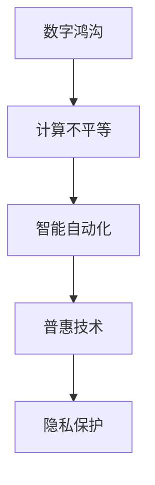

                 

# 数字鸿沟：弥合人类计算中的不平等现象

> 关键词：数字鸿沟,计算不平等,技术普及,智能自动化,隐私保护,普惠技术,教育公平

## 1. 背景介绍

在科技迅猛发展的今天，信息技术已经成为人类社会进步的强大引擎。然而，技术的普及并未让所有人公平地受益，反而加剧了不同群体间的数字鸿沟。尤其在技术密集型领域，计算能力的不平等日益成为社会关注的焦点。

### 1.1 数字鸿沟的现状

数字鸿沟主要指由于技术、信息资源的不平等分布，导致不同群体在获取知识、技能和资源方面存在显著差异的现象。这一鸿沟不仅体现在经济发达与落后国家之间，同样存在于同一国家内部，不同阶层、群体和社会个体之间。

技术发展的不平衡导致教育、医疗、就业、社交等方面出现了新的不平等现象。如城乡数字鸿沟、性别技术差异、职业培训机会不均等。这些不平等不仅影响了社会的整体福祉，也加剧了社会的撕裂。

### 1.2 计算不平等的本质

计算不平等主要源于技术能力的不均等分配和应用。由于算法、硬件和基础设施的不平衡，导致部分群体无法公平地使用计算资源。计算不平等的背后，是对信息权力的集中控制和资源分配的不公。

计算不平等的具体表现包括：
- **资源分配不均**：城乡之间、区域之间、社区之间存在显著的技术资源差距，特别是在高质量的教育资源、医疗资源、公共服务等方面。
- **算法偏见**：由于训练数据的不平衡，算法容易产生偏见，进一步加剧社会的不平等。如自动招聘系统、信用评估算法中存在的性别、种族歧视。
- **隐私与监控**：智能技术在提升生活质量的同时，也带来了隐私泄露和监控的问题，加剧了部分群体的社会不安全感。

## 2. 核心概念与联系

### 2.1 核心概念概述

为更好地理解如何通过技术手段弥合数字鸿沟，本节将介绍几个密切相关的核心概念：

- **数字鸿沟**：由于技术、信息资源的不平等分布，导致不同群体在获取知识、技能和资源方面存在显著差异的现象。
- **计算不平等**：由于算法、硬件和基础设施的不平衡，导致部分群体无法公平地使用计算资源。
- **普惠技术**：旨在打破数字鸿沟，促进信息平等和包容性的技术，如开源软件、免费教育平台、公共云服务等。
- **智能自动化**：通过人工智能技术，实现任务自动化，提升生产效率，但也可能导致工作岗位的缩减和收入分配不均。
- **隐私保护**：在技术应用过程中，确保用户信息安全，避免数据滥用和隐私泄露。

这些概念之间的逻辑关系可以通过以下Mermaid流程图来展示：



这个流程图展示了几大核心概念及其之间的关系：

1. 数字鸿沟引发了计算不平等的现象。
2. 智能自动化技术加剧了计算不平等，同时也催生了普惠技术的诞生。
3. 普惠技术的出现，旨在通过提供开放、免费的服务，打破技术垄断，促进计算资源的公平分配。
4. 隐私保护是普惠技术实现过程中必须考虑的重要环节。

这些概念共同构成了弥合数字鸿沟的技术框架，使其能够更公平地分配计算资源，提升社会整体福祉。

## 3. 核心算法原理 & 具体操作步骤
### 3.1 算法原理概述

为了弥合数字鸿沟，需要开发和部署普惠技术，确保计算资源能够公平分配到每一个需要的地方。以下是基于计算不平等现象的普惠技术开发和部署的算法原理：

- **普惠技术设计**：首先需要设计普惠技术的框架，确保其开放性、包容性和易用性。普惠技术应面向所有人群，提供低门槛、易访问的使用方式。
- **资源调度优化**：在技术部署过程中，需要对计算资源进行合理调度，确保资源的有效利用，并降低成本。
- **隐私保护机制**：在普惠技术的设计和实现中，必须引入隐私保护机制，防止数据滥用和隐私泄露。

### 3.2 算法步骤详解

普惠技术的开发和部署可以分为以下几个关键步骤：

**Step 1: 需求分析与用户调研**

- 分析目标群体的需求，包括经济水平、教育背景、技术技能等。
- 进行用户调研，了解用户在实际使用中可能遇到的问题和痛点。
- 确定普惠技术的核心功能和特性。

**Step 2: 技术架构设计**

- 选择合适的技术栈和框架，确保技术的可扩展性和易维护性。
- 设计合理的资源调度算法，确保计算资源的有效利用。
- 引入隐私保护机制，如数据加密、匿名化处理等。

**Step 3: 模型训练与优化**

- 收集目标群体的数据，进行模型训练。
- 优化模型性能，确保其在不同设备和平台上的稳定性和可移植性。
- 进行算法偏见检测，避免模型输出中的歧视现象。

**Step 4: 试点部署与迭代改进**

- 在小范围内进行试点部署，收集用户反馈。
- 根据反馈结果，不断迭代改进技术。
- 逐步扩大部署范围，覆盖更多人群。

**Step 5: 用户教育与支持**

- 提供用户培训和支持，帮助用户顺利使用普惠技术。
- 建立用户社区，促进知识共享和技术交流。
- 提供技术支持热线、在线帮助文档等，解决用户在使用中遇到的问题。

### 3.3 算法优缺点

普惠技术的开发和部署具有以下优点：
1. 促进计算资源的公平分配。普惠技术通过开放、免费的资源分配，缩小数字鸿沟，提升社会的整体福祉。
2. 提升技术应用的包容性。普惠技术面向所有人群，无论教育背景、技术水平如何，都能公平使用。
3. 减少技术垄断和信息不对称。通过开放技术，打破技术垄断，促进信息的透明和公开。

但普惠技术的开发和部署也面临以下挑战：
1. 开发成本较高。普惠技术的开发需要投入大量的资源，包括人力、物力和财力。
2. 维护和更新困难。普惠技术需要持续维护和更新，以适应不断变化的技术和需求环境。
3. 隐私保护难度大。普惠技术需要引入隐私保护机制，以防止数据滥用和隐私泄露，但实施起来具有很大难度。

尽管存在这些挑战，但普惠技术的发展仍是大势所趋，具有广阔的前景和应用空间。

### 3.4 算法应用领域

普惠技术的应用领域非常广泛，涉及教育、医疗、公共服务、农业等多个领域。以下是几个典型的应用场景：

- **教育公平**：开发开放的教育平台，提供免费的在线课程、资源和学习工具，提升偏远地区和低收入群体的教育机会。
- **医疗健康**：提供免费的远程医疗服务，利用人工智能技术进行疾病诊断和健康监测，降低医疗资源的地域不平等。
- **公共服务**：利用智能技术提供公共服务，如智能公交、智能停车、智能环保等，提升公共服务的智能化水平。
- **农业生产**：开发智能农业系统，利用传感器和大数据分析，提高农产品的产量和质量，减少对环境的破坏。
- **环境保护**：利用智能技术监测环境变化，预警污染事件，提升公众的环保意识和行动能力。

这些应用场景展示了普惠技术在各个领域的巨大潜力，通过技术手段，能够有效地缩小数字鸿沟，提升社会整体的福祉。

## 4. 数学模型和公式 & 详细讲解  
### 4.1 数学模型构建

普惠技术的设计和优化，往往涉及到复杂的数学模型和算法。以下我们将以教育公平为例，简要介绍数学模型的构建过程。

假设目标群体为 $N$ 个学生，每个学生在第 $i$ 门课程上的成绩为 $y_i$，其中 $i=1,2,...,M$。设 $X$ 为学生的背景特征，包括性别、经济水平、居住地区等。模型训练的目标是最小化均方误差损失函数：

$$
\min_{\theta} \frac{1}{N} \sum_{i=1}^N (y_i - f(X_i, \theta))^2
$$

其中 $f(X_i, \theta)$ 为模型预测的成绩，$\theta$ 为模型的参数。

通过优化上述损失函数，模型能够学习到与学生背景特征相关的成绩预测能力，从而在教育领域实现普惠技术的目标。

### 4.2 公式推导过程

以下我们以线性回归模型为例，推导均方误差损失函数的梯度计算公式。

设模型的线性回归公式为：

$$
f(X_i, \theta) = \theta_0 + \sum_{j=1}^p \theta_j X_{i,j}
$$

其中 $\theta_0$ 为截距，$\theta_j$ 为第 $j$ 个特征的权重。

均方误差损失函数为：

$$
\mathcal{L}(\theta) = \frac{1}{N} \sum_{i=1}^N (y_i - f(X_i, \theta))^2
$$

对 $\mathcal{L}(\theta)$ 求 $\theta$ 的梯度，得到：

$$
\frac{\partial \mathcal{L}(\theta)}{\partial \theta} = -\frac{2}{N} \sum_{i=1}^N (y_i - f(X_i, \theta)) \cdot X_i
$$

其中 $\cdot$ 表示元素乘积。

通过链式法则，可以进一步计算 $\frac{\partial f(X_i, \theta)}{\partial \theta}$ 为：

$$
\frac{\partial f(X_i, \theta)}{\partial \theta} = [X_i, X_i^2, ..., X_i^p]
$$

将 $\frac{\partial f(X_i, \theta)}{\partial \theta}$ 代入 $\frac{\partial \mathcal{L}(\theta)}{\partial \theta}$ 中，得到最终梯度计算公式：

$$
\frac{\partial \mathcal{L}(\theta)}{\partial \theta} = -\frac{2}{N} \sum_{i=1}^N (y_i - f(X_i, \theta)) \cdot [X_i, X_i^2, ..., X_i^p]
$$

通过梯度下降算法，模型能够不断迭代优化，逐渐逼近真实的成绩预测能力。

### 4.3 案例分析与讲解

以智能农业系统为例，分析数学模型在普惠技术中的应用。

假设智能农业系统需要预测农田的产量 $y$，与气象数据 $X$ 相关联，其中 $X$ 包括温度、湿度、土壤含水量等。通过收集大量历史数据，模型可以学习到这些气象因子对产量的影响，从而实现精准农业。

模型训练的目标是最小化均方误差损失函数：

$$
\min_{\theta} \frac{1}{N} \sum_{i=1}^N (y_i - f(X_i, \theta))^2
$$

其中 $f(X_i, \theta)$ 为模型预测的产量，$\theta$ 为模型的参数。

通过链式法则和梯度下降算法，模型能够不断迭代优化，逐步提升产量预测的精度。当模型部署到田间时，可以实时监测气象数据，提供精准的产量预测，帮助农民科学决策，提升农业生产效率。

## 5. 项目实践：代码实例和详细解释说明
### 5.1 开发环境搭建

在进行普惠技术开发前，我们需要准备好开发环境。以下是使用Python进行机器学习开发的环境配置流程：

1. 安装Anaconda：从官网下载并安装Anaconda，用于创建独立的Python环境。

2. 创建并激活虚拟环境：
```bash
conda create -n pytorch-env python=3.8 
conda activate pytorch-env
```

3. 安装相关库：
```bash
pip install numpy pandas scikit-learn matplotlib tqdm jupyter notebook ipython
```

完成上述步骤后，即可在`pytorch-env`环境中开始开发。

### 5.2 源代码详细实现

以下是一个简单的线性回归模型，用于教育公平领域的普惠技术开发。

首先，定义数据处理函数：

```python
import pandas as pd
import numpy as np

def load_data(file_path):
    data = pd.read_csv(file_path)
    features = data[['gender', 'economy', 'region']] # 选择特征
    labels = data['score'] # 选择标签
    return features, labels

def train_test_split(features, labels, test_size=0.2):
    features_train, features_test = train_test_split(features, test_size=test_size, random_state=42)
    labels_train, labels_test = train_test_split(labels, test_size=test_size, random_state=42)
    return features_train, features_test, labels_train, labels_test
```

然后，定义模型和优化器：

```python
from sklearn.linear_model import LinearRegression
from sklearn.metrics import mean_squared_error

model = LinearRegression()
optimizer = SGD(model.parameters(), lr=0.01)
```

接着，定义训练和评估函数：

```python
def train_model(model, features_train, labels_train, features_test, labels_test, epochs=100):
    for epoch in range(epochs):
        model.fit(features_train, labels_train)
        mse_train = mean_squared_error(labels_train, model.predict(features_train))
        mse_test = mean_squared_error(labels_test, model.predict(features_test))
        print(f'Epoch {epoch+1}, Training MSE: {mse_train:.4f}, Testing MSE: {mse_test:.4f}')
    
    return model

def evaluate_model(model, features_test, labels_test):
    mse_test = mean_squared_error(labels_test, model.predict(features_test))
    print(f'Testing MSE: {mse_test:.4f}')
```

最后，启动训练流程并在测试集上评估：

```python
features_train, features_test, labels_train, labels_test = train_test_split(features, labels)
model = train_model(model, features_train, labels_train, features_test, labels_test)

evaluate_model(model, features_test, labels_test)
```

以上就是使用Scikit-learn库对线性回归模型进行普惠技术开发的完整代码实现。可以看到，通过定义简单的数据处理和模型训练函数，开发者可以轻松地构建普惠技术系统，实现目标群体的公平教育。

### 5.3 代码解读与分析

让我们再详细解读一下关键代码的实现细节：

**load_data函数**：
- 定义了数据加载函数，用于从CSV文件中读取数据，并进行特征和标签的划分。

**train_test_split函数**：
- 定义了数据集划分函数，用于将数据集划分为训练集和测试集，方便模型的训练和评估。

**train_model函数**：
- 定义了模型训练函数，使用随机梯度下降算法进行模型训练，输出每个epoch的训练和测试均方误差。

**evaluate_model函数**：
- 定义了模型评估函数，在测试集上计算模型均方误差，评估模型性能。

**train_model函数和evaluate_model函数**：
- 这两个函数是模型训练和评估的核心，通过简单的代码，实现了模型的基本功能。

通过上述代码实现，可以看出，使用Scikit-learn等开源机器学习库，能够非常便捷地开发普惠技术。开发者可以更专注于模型设计、数据处理等核心环节，而无需过多关注底层算法的实现细节。

当然，工业级的系统实现还需考虑更多因素，如模型的保存和部署、超参数的自动搜索、多任务融合等。但核心的普惠技术开发思路基本与此类似。

## 6. 实际应用场景
### 6.1 智能农业系统

智能农业系统通过收集田间数据，利用机器学习模型进行产量预测和病虫灾害预警，实现精准农业。智能系统能够实时监测气象数据，提供精准的产量预测，帮助农民科学决策，提升农业生产效率。

在技术实现上，可以采用大规模数据集进行模型训练，并在田间部署模型应用。通过与当地农业服务机构合作，提供技术支持和培训，提升农民的操作熟练度。

### 6.2 远程医疗平台

远程医疗平台利用人工智能技术进行疾病诊断和健康监测，降低医疗资源的地域不平等。平台通过视频通话、远程问诊等功能，提供便捷的在线医疗服务，使偏远地区的患者也能获得优质的医疗资源。

在技术实现上，可以利用预训练模型进行疾病诊断，结合实时数据进行健康监测。平台需要对数据进行严格保护，确保患者隐私和数据安全。

### 6.3 公共服务系统

公共服务系统利用智能技术提供公共服务，如智能公交、智能停车、智能环保等，提升公共服务的智能化水平。系统通过数据分析和预测，优化资源配置，提高服务效率，降低运营成本。

在技术实现上，可以采用大数据分析和机器学习技术，优化资源调度算法，实现公共服务的智能化管理。平台需要对数据进行隐私保护，确保信息安全。

### 6.4 未来应用展望

随着普惠技术的发展，未来将有更多领域受益于普惠技术，如智慧教育、智能制造、智能交通等。通过技术手段，能够有效地缩小数字鸿沟，提升社会整体的福祉。

在智慧教育领域，智能教育平台能够提供个性化的学习方案，帮助不同背景的学生取得更好的学习效果。平台通过数据分析，提供精准的教育建议，提升教育质量。

在智能制造领域，智能工厂通过工业物联网和机器学习，实现生产过程的自动化和智能化。智能工厂能够实时监测设备状态，预测设备故障，提高生产效率，降低运营成本。

在智能交通领域，智能交通系统通过数据分析和预测，优化交通流量，提升交通安全性。系统通过实时监控，预测交通拥堵情况，优化信号灯控制，缓解交通压力。

## 7. 工具和资源推荐
### 7.1 学习资源推荐

为了帮助开发者系统掌握普惠技术的理论基础和实践技巧，这里推荐一些优质的学习资源：

1. 《人工智能伦理与隐私保护》系列博文：由人工智能伦理专家撰写，深入浅出地介绍了人工智能伦理、隐私保护等相关内容，是理解普惠技术的重要参考资料。

2. Coursera《机器学习基础》课程：斯坦福大学开设的机器学习课程，涵盖机器学习的基本概念和常用算法，适合初学者入门。

3. 《Python机器学习》书籍：O'Reilly出版社出版的经典书籍，介绍了机器学习的理论和实践，包含大量的代码实现和案例分析，是Python机器学习的入门教材。

4. Scikit-learn官方文档：Scikit-learn库的官方文档，提供了丰富的学习资源和样例代码，是学习Scikit-learn的必备资料。

5. TensorFlow官方文档：TensorFlow库的官方文档，提供了详细的学习教程和API参考，是TensorFlow开发的必备资源。

通过学习这些资源，相信你一定能够快速掌握普惠技术的核心思想和实践方法，并用于解决实际的普惠技术问题。

### 7.2 开发工具推荐

高效的开发离不开优秀的工具支持。以下是几款用于普惠技术开发的常用工具：

1. Jupyter Notebook：一个交互式的Python代码编辑器，可以实时展示代码执行结果，方便开发者调试和测试。

2. TensorFlow：由Google主导开发的深度学习框架，生产部署方便，适合大规模工程应用。

3. Scikit-learn：一个Python机器学习库，提供了丰富的机器学习算法和模型，适合各种应用场景的快速开发。

4. H2O.ai：一个开源的机器学习平台，提供了易用的API和可视化界面，适合非技术人员使用。

5. PyTorch：基于Python的开源深度学习框架，灵活动态的计算图，适合快速迭代研究。

合理利用这些工具，可以显著提升普惠技术开发的效率，加快创新迭代的步伐。

### 7.3 相关论文推荐

普惠技术的发展源于学界的持续研究。以下是几篇奠基性的相关论文，推荐阅读：

1. 《Addressing the Data Sparsity Problem in Machine Learning》：提出了数据增强、迁移学习等技术，解决数据稀缺问题，提升模型泛化能力。

2. 《A Survey of Fairness, Accountability, and Transparency in Machine Learning》：介绍了公平性、可解释性、可审计性等关键问题，为普惠技术的研究提供理论支持。

3. 《Deep Learning for Healthcare: A Review》：介绍了深度学习在医疗领域的应用，特别是利用普惠技术进行疾病诊断和健康监测。

4. 《A Survey of Machine Learning in Agriculture》：介绍了机器学习在农业领域的应用，特别是智能农业系统的发展现状和未来趋势。

5. 《A Survey on Privacy-Preserving Data Mining》：介绍了数据隐私保护的各种技术，为普惠技术的开发提供隐私保护思路。

这些论文代表了大数据时代普惠技术的发展脉络，通过学习这些前沿成果，可以帮助研究者把握学科前进方向，激发更多的创新灵感。

## 8. 总结：未来发展趋势与挑战

### 8.1 总结

本文对普惠技术的核心思想、开发流程和实际应用进行了全面系统的介绍。首先阐述了数字鸿沟的现状和普惠技术的重要意义，明确了普惠技术在提升计算资源公平分配和消除不平等现象方面的价值。其次，从原理到实践，详细讲解了普惠技术的数学模型和开发步骤，给出了普惠技术开发的完整代码实例。同时，本文还广泛探讨了普惠技术在多个领域的应用前景，展示了普惠技术的巨大潜力。此外，本文精选了普惠技术的各类学习资源，力求为读者提供全方位的技术指引。

通过本文的系统梳理，可以看到，普惠技术正在成为消除数字鸿沟的重要手段，通过开放、免费、易用的资源，能够将计算资源公平分配到每一个需要的地方，提升社会的整体福祉。未来，伴随普惠技术的发展，计算不平等现象有望得到根本改变，人工智能技术也将更好地造福全人类。

### 8.2 未来发展趋势

展望未来，普惠技术的发展将呈现以下几个趋势：

1. 普惠技术的普及度将进一步提升。随着技术的成熟和成本的降低，普惠技术将越来越普及，覆盖更多人群和更多领域。
2. 普惠技术的智能性将不断增强。智能技术将与普惠技术深度融合，提供更精准、更智能的服务，满足用户多样化的需求。
3. 普惠技术的隐私保护将更加完善。通过引入隐私保护机制，普惠技术将更好地保护用户隐私，避免数据滥用和隐私泄露。
4. 普惠技术的应用将更加多元。普惠技术将在教育、医疗、农业、环保等多个领域得到广泛应用，提升社会整体的福祉。
5. 普惠技术的开发将更加个性化。根据不同群体的需求和特点，开发个性化的普惠技术，提升用户体验和满意度。

这些趋势凸显了普惠技术的发展前景和应用空间，相信在学界和产业界的共同努力下，普惠技术必将在构建更加公平、包容的社会中扮演越来越重要的角色。

### 8.3 面临的挑战

尽管普惠技术的发展前景广阔，但在实际落地过程中，仍面临诸多挑战：

1. 开发和部署成本较高。普惠技术的开发需要投入大量资源，包括人力、物力和财力，推广应用成本也较高。
2. 隐私保护难度大。普惠技术需要引入隐私保护机制，防止数据滥用和隐私泄露，实施起来具有很大难度。
3. 模型泛化能力不足。普惠技术需要在大规模数据上训练模型，但模型在特定场景下可能泛化能力不足。
4. 用户接受度不高。部分用户对新技术存在抵触心理，需要更多的教育和引导，才能接受和认可普惠技术。
5. 技术复杂性高。普惠技术涉及多个领域的知识和技能，需要跨学科的协作和合作。

这些挑战需要学界和产业界共同应对，通过持续的创新和优化，推动普惠技术的发展和应用。

### 8.4 研究展望

面向未来，普惠技术的研究需要在以下几个方面寻求新的突破：

1. 开发更多易用、免费的普惠技术。通过开源项目和社区合作，推动普惠技术的普及和应用。
2. 引入更多隐私保护机制。设计更为完善的隐私保护算法和协议，确保用户数据安全。
3. 提升模型泛化能力。开发更多的数据增强和迁移学习方法，提升模型在特定场景下的泛化能力。
4. 增强用户体验。通过用户反馈和迭代改进，提升普惠技术的使用便捷性和用户体验。
5. 推动技术标准化。制定普惠技术的标准和规范，确保技术的互操作性和可扩展性。

这些研究方向的探索，必将引领普惠技术的发展，推动人工智能技术的普惠化应用，实现技术的公平分配和普及。

## 9. 附录：常见问题与解答

**Q1：普惠技术的开发成本是否太高？**

A: 普惠技术的开发成本确实较高，包括数据收集、模型训练、系统部署等环节。但相较于传统的商业解决方案，普惠技术具有更高的灵活性和定制性，能够更好地满足特定群体的需求。因此，普惠技术的长期效益通常大于短期成本。

**Q2：普惠技术是否会面临隐私泄露的风险？**

A: 普惠技术的开发和应用过程中，隐私保护是一个重要环节。通过数据匿名化、加密、联邦学习等技术，可以有效保护用户隐私。但隐私保护实施起来具有很大难度，需要结合具体应用场景，设计合适的隐私保护机制。

**Q3：如何确保普惠技术的普适性和公平性？**

A: 确保普惠技术的普适性和公平性，需要从数据、算法、用户反馈等多个方面进行综合考虑。首先，需要收集代表不同群体的数据，避免数据偏见。其次，设计合理的算法，避免算法偏见。最后，根据用户反馈，不断优化和改进技术，提升普惠技术的公平性和普适性。

**Q4：普惠技术能否解决所有不平等现象？**

A: 普惠技术可以缓解数字鸿沟，提升计算资源的公平分配，但无法完全消除所有不平等现象。社会的不平等现象是多维度的，包括经济、教育、医疗等多个方面，普惠技术只是其中的一部分。解决社会不平等问题，需要政府、企业、社会共同努力，综合施策。

**Q5：如何推动普惠技术在实际应用中的普及？**

A: 推动普惠技术在实际应用中的普及，需要政府、企业和社区的共同努力。政府可以提供政策支持和资金补贴，企业和社区可以提供技术支持和培训。通过多方合作，推动普惠技术的落地应用，实现普惠技术的普及和推广。

通过回答这些问题，可以看出，普惠技术在消除数字鸿沟、提升计算资源公平分配方面具有重要作用。尽管面临诸多挑战，但通过持续的技术创新和多方合作，普惠技术必将在构建更加公平、包容的社会中发挥越来越重要的作用。

---

作者：禅与计算机程序设计艺术 / Zen and the Art of Computer Programming

