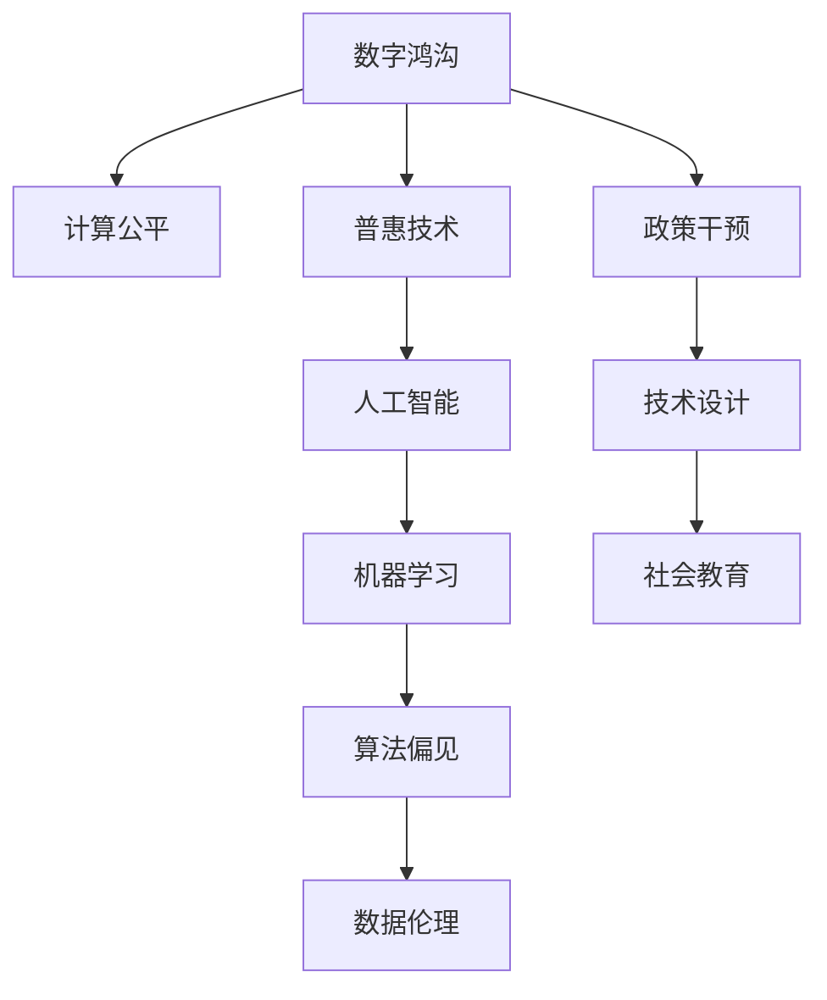

                 

# 数字鸿沟：弥合人类计算中的不平等现象

> 关键词：数字鸿沟,计算公平,普惠技术,人工智能,机器学习,算法偏见,数据伦理

## 1. 背景介绍

### 1.1 问题由来

在全球信息化时代，计算技术的普及极大地推动了社会的进步和经济的发展，但同时也造成了显著的“数字鸿沟”现象。即不同地区、不同群体在获得计算资源、技术技能和信息服务方面存在显著差异，形成了一个由信息弱势群体组成的数字鸿沟。这一现象不仅影响了社会公平，也制约了技术的广泛应用。

数字鸿沟现象的根本原因在于计算资源和技术的分布不均。一方面，经济发达地区和企业拥有更多的计算资源和先进技术，而欠发达地区和企业则难以获取这些资源。另一方面，教育背景、职业技能等因素也影响着个体获取计算技术的能力和机会。这种不平等不仅体现在物质层面，还反映在精神和文化的层面上，如教育资源的匮乏、职业发展机会的不均等。

### 1.2 问题核心关键点

数字鸿沟的核心在于人类计算资源的不平等分配，这种不平等不仅体现在物质层面，还反映在精神和文化的层面上。它引发了一系列的社会问题，包括教育机会的不平等、职业发展的不公平、社会服务的差异等。为了弥合这一鸿沟，必须从多个层面进行综合治理，包括政策干预、技术创新、社会教育等。

解决数字鸿沟问题，关键在于如何公平地分配计算资源，使更多人能够享受到技术的红利。这需要从政策制定、技术设计和社会教育三个层面协同发力，实现人类计算的普惠性发展。

## 2. 核心概念与联系

### 2.1 核心概念概述

为更好地理解数字鸿沟问题，我们首先介绍几个核心概念：

- **数字鸿沟（Digital Divide）**：指在获取计算资源、技术技能和信息服务方面存在的显著差异，导致不同群体在数字化进程中处于不同的发展水平。
- **计算公平（Computational Fairness）**：指在计算资源的分配和使用中，确保每个个体或群体都能公平地获取和使用计算资源，避免因技术偏见和算法歧视导致的计算不公。
- **普惠技术（Inclusive Technology）**：指能够为所有群体提供平等计算机会，同时注重提升社会整体福祉的技术。
- **人工智能（AI）**：利用数据、算法和计算资源进行智能决策的技术，旨在模拟人的认知和行为，提升信息处理和决策能力。
- **机器学习（ML）**：通过数据和算法实现自主学习和决策的技术，广泛应用于各个领域，包括自然语言处理、计算机视觉、推荐系统等。
- **算法偏见（Algorithm Bias）**：指在算法设计、训练和应用过程中，由于数据偏差或设计缺陷导致的算法输出偏向某个特定群体或特征的现象。
- **数据伦理（Data Ethics）**：指在数据采集、存储、处理和应用过程中，确保数据处理和算法应用符合道德和法律规范，保护个人隐私和权益。

这些核心概念之间的逻辑关系可以通过以下Mermaid流程图来展示：



这个流程图展示了大语言模型的核心概念及其之间的关系：

1. 数字鸿沟现象的存在导致计算公平问题。
2. 计算公平需要普惠技术来实现，即技术设计要注重公平性。
3. 普惠技术涵盖了人工智能和机器学习，是实现计算公平的核心技术。
4. 机器学习过程中可能存在算法偏见问题，需要通过数据伦理和政策干预来避免。
5. 技术设计和社会教育是解决数字鸿沟问题的两个关键措施。

## 3. 核心算法原理 & 具体操作步骤
### 3.1 算法原理概述

数字鸿沟问题的解决需要从多个维度进行技术创新和政策设计。本节将详细介绍几个关键算法和具体操作步骤，以期在计算公平和普惠技术方面取得突破。

### 3.2 算法步骤详解

#### 3.2.1 数据清洗与预处理

数据清洗与预处理是计算公平和普惠技术的重要基础。为确保数据的代表性和多样性，需进行以下步骤：

1. **数据收集**：收集多样化的数据源，确保数据能够覆盖不同背景和群体的特征。
2. **数据清洗**：去除数据中的噪声和冗余，确保数据质量。
3. **数据增强**：使用数据增强技术，如合成样本、回译等，增加数据多样性。
4. **数据标准化**：对数据进行标准化处理，消除数据的不一致性。

#### 3.2.2 算法选择与设计

选择合适的算法和技术是实现计算公平和普惠技术的关键。在算法选择和设计过程中，需考虑以下几个方面：

1. **公平性指标**：设计公平性指标，如平等机会、误差均衡等，以评估算法的公平性。
2. **算法偏见检测**：使用偏见检测工具，如Fairness Indicators，识别算法中的偏见。
3. **算法优化**：通过优化算法和参数，减少偏见和不公。

#### 3.2.3 模型训练与评估

模型训练与评估是计算公平和普惠技术的具体实施环节。需进行以下步骤：

1. **模型训练**：使用清洗和预处理后的数据集进行模型训练，确保模型能够适应不同背景和群体的特征。
2. **公平性评估**：在训练过程中，定期评估模型的公平性，确保模型不偏向某个群体。
3. **模型优化**：根据评估结果，优化模型和算法，进一步提升公平性。

#### 3.2.4 模型部署与监控

模型部署与监控是计算公平和普惠技术的实际应用环节。需进行以下步骤：

1. **模型部署**：将训练好的模型部署到生产环境中，确保模型能够高效运行。
2. **监控与反馈**：在实际应用中，持续监控模型的输出和性能，收集反馈信息。
3. **模型更新**：根据反馈信息，定期更新模型，确保模型持续优化。

### 3.3 算法优缺点

计算公平和普惠技术的算法具有以下优点：

1. **公平性提升**：通过算法设计和技术创新，提升模型的公平性，减少偏见和不公。
2. **普惠性增强**：利用普惠技术，使更多人能够享受到计算资源和技术服务。
3. **社会效益显著**：通过改善计算公平和普惠技术，提升社会整体福祉。

但同时，也存在以下局限：

1. **算法复杂度较高**：需要设计和优化复杂的算法，增加了实现难度。
2. **数据需求较大**：需要大量多样化的数据来训练和评估模型，数据获取成本高。
3. **技术门槛较高**：需要具备一定的技术背景和技能，推广难度大。

### 3.4 算法应用领域

计算公平和普惠技术已在多个领域得到应用，如教育、医疗、金融等，具体如下：

- **教育**：使用普惠技术，如智能教育平台、虚拟实验室等，提升教育资源的公平性和可及性。
- **医疗**：利用普惠技术，如远程诊疗、智能诊断等，提升医疗服务的公平性和可及性。
- **金融**：通过普惠技术，如智能理财、信用评估等，提升金融服务的公平性和可及性。

此外，计算公平和普惠技术在政府治理、环境保护等领域也有广泛应用，为提升社会整体福祉提供了新的路径。

## 4. 数学模型和公式 & 详细讲解 & 举例说明

### 4.1 数学模型构建

本节将使用数学语言对计算公平和普惠技术进行更加严格的刻画。

设有一组数据集 $D=\{(x_i,y_i)\}_{i=1}^N$，其中 $x_i$ 为特征向量，$y_i$ 为目标变量。我们的目标是设计一个公平且普惠的模型 $f(x)$，使得模型在所有群体上的预测结果尽可能接近真实标签。

定义模型的公平性指标为：

$$
F(D) = \frac{1}{K}\sum_{k=1}^K \left(\frac{1}{n_k}\sum_{i=1}^{n_k}(y_i-f(x_i))^2\right)
$$

其中 $K$ 为群体数量，$n_k$ 为第 $k$ 个群体的样本数量。

通过最小化公平性指标，可以设计出一个公平的模型。

### 4.2 公式推导过程

以下我们以二分类任务为例，推导公平性指标的计算公式。

设模型 $f(x)$ 在输入 $x$ 上的输出为 $\hat{y}=f(x) \in [0,1]$，表示样本属于正类的概率。真实标签 $y \in \{0,1\}$。

则公平性指标为：

$$
F(D) = \frac{1}{2}\sum_{k=1}^K \frac{1}{n_k}\sum_{i=1}^{n_k}(y_i-f(x_i))^2
$$

在实际应用中，通常使用更易于优化的形式来计算公平性指标。例如，可以定义一个“平等机会”指标：

$$
F_{\text{equal}}(D) = \frac{1}{K}\sum_{k=1}^K \frac{1}{n_k}\sum_{i=1}^{n_k}|f(x_i)-y_i|
$$

通过最小化平等机会指标，可以确保模型对所有群体的预测机会均等。

### 4.3 案例分析与讲解

以金融信用评估为例，分析计算公平和普惠技术在实际应用中的具体实现。

假设有一组数据集 $D=\{(x_i,y_i)\}_{i=1}^N$，其中 $x_i$ 为贷款申请人的个人和财务信息，$y_i$ 为是否批准贷款。我们的目标是设计一个公平且普惠的信用评估模型。

首先，需对数据进行清洗和预处理，确保数据集的多样性和代表性。然后，选择合适的算法和模型，如线性回归、随机森林等，进行模型训练和评估。最后，通过公平性指标和偏见检测工具，确保模型公平且普惠。

例如，使用随机森林模型进行信用评估，可以设计如下步骤：

1. **数据清洗与预处理**：去除数据中的噪声和冗余，对数据进行标准化处理。
2. **算法选择与设计**：选择随机森林模型，并设计平等机会公平性指标。
3. **模型训练与评估**：使用清洗和预处理后的数据集进行模型训练，定期评估模型的公平性。
4. **模型优化与部署**：根据评估结果，优化模型和算法，并将训练好的模型部署到生产环境中。

## 5. 项目实践：代码实例和详细解释说明

### 5.1 开发环境搭建

在进行计算公平和普惠技术项目实践前，我们需要准备好开发环境。以下是使用Python进行Pandas和Scikit-learn开发的环境配置流程：

1. 安装Anaconda：从官网下载并安装Anaconda，用于创建独立的Python环境。

2. 创建并激活虚拟环境：
```bash
conda create -n fairness-env python=3.8 
conda activate fairness-env
```

3. 安装Pandas和Scikit-learn：
```bash
conda install pandas scikit-learn
```

4. 安装相关工具包：
```bash
pip install numpy matplotlib tqdm jupyter notebook ipython
```

完成上述步骤后，即可在`fairness-env`环境中开始项目实践。

### 5.2 源代码详细实现

下面我们以信用评估任务为例，给出使用Pandas和Scikit-learn进行计算公平和普惠技术开发的Python代码实现。

首先，定义数据集：

```python
import pandas as pd

# 读取数据集
data = pd.read_csv('credit_loan.csv')

# 数据清洗和预处理
# 去除缺失值
data = data.dropna()

# 标准化处理
data = (data - data.mean()) / data.std()

# 数据分割
train_data = data.sample(frac=0.8, random_state=0)
test_data = data.drop(train_data.index)
```

然后，定义模型和公平性评估指标：

```python
from sklearn.ensemble import RandomForestClassifier
from sklearn.metrics import accuracy_score, f1_score, precision_score, recall_score

# 定义模型
model = RandomForestClassifier(n_estimators=100, random_state=0)

# 定义公平性指标
def fairness_metric(y_true, y_pred):
    return (1 - f1_score(y_true, y_pred, average='macro'))

# 训练模型
model.fit(train_data.drop('loan', axis=1), train_data['loan'])

# 评估模型
acc = accuracy_score(test_data['loan'], model.predict(test_data.drop('loan', axis=1)))
print(f"Accuracy: {acc:.3f}")

# 公平性评估
y_true = test_data['loan']
y_pred = model.predict(test_data.drop('loan', axis=1))
print(fairness_metric(y_true, y_pred))
```

最后，启动公平性评估流程：

```python
from sklearn.metrics import confusion_matrix

# 定义公平性评估函数
def fairness_analysis(y_true, y_pred):
    cm = confusion_matrix(y_true, y_pred)
    tp, fp, fn, tn = cm.ravel()
    return (tp, fp, fn, tn)

# 公平性分析
tp, fp, fn, tn = fairness_analysis(test_data['loan'], model.predict(test_data.drop('loan', axis=1)))
print(f"True Positives: {tp}, False Positives: {fp}, False Negatives: {fn}, True Negatives: {tn}")

# 输出公平性指标
print(f"Fairness Metric: {fairness_metric(test_data['loan'], model.predict(test_data.drop('loan', axis=1))}")
```

以上就是使用Pandas和Scikit-learn对信用评估任务进行公平性评估的完整代码实现。可以看到，通过简单的数据清洗和预处理，选择合适的模型和公平性指标，即可实现计算公平和普惠技术的实践。

### 5.3 代码解读与分析

让我们再详细解读一下关键代码的实现细节：

**数据集定义**：
- 使用Pandas读取CSV格式的数据集，并进行初步的数据清洗和预处理，包括去除缺失值和标准化处理。

**模型选择与训练**：
- 选择随机森林模型作为公平性评估的基准模型，使用训练集进行模型训练。

**公平性评估指标**：
- 定义公平性指标函数，计算模型在不同群体上的公平性，并输出准确率和公平性评估结果。

**公平性分析**：
- 使用混淆矩阵分析模型在不同群体上的表现，输出TP、FP、FN、TN等指标，进一步评估模型的公平性。

通过上述代码实现，我们可以看到计算公平和普惠技术的核心步骤。开发者可以将更多精力放在数据处理、模型选择和公平性评估上，而不必过多关注底层的实现细节。

当然，工业级的系统实现还需考虑更多因素，如模型的保存和部署、超参数的自动搜索、更灵活的公平性指标等。但核心的公平性评估逻辑基本与此类似。

## 6. 实际应用场景

### 6.1 金融信用评估

在金融领域，计算公平和普惠技术可应用于信用评估，确保贷款审批过程的公平性和普惠性。通过公平性评估和偏见检测，金融机构可以避免因数据偏见导致的贷款不公现象，提升服务质量和客户满意度。

在技术实现上，可以收集用户的个人和财务信息，并对其进行清洗和预处理。在此基础上，设计公平性指标和模型评估函数，通过随机森林等模型进行训练和评估。最终得到公平且普惠的信用评估模型，应用于实际贷款审批流程。

### 6.2 医疗诊断

在医疗领域，计算公平和普惠技术可应用于疾病诊断和治疗，确保医疗服务的公平性和普惠性。通过公平性评估和偏见检测，医疗机构可以避免因数据偏见导致的诊断不公现象，提升医疗服务质量和患者满意度。

在技术实现上，可以收集患者的生理和病史信息，并对其进行清洗和预处理。在此基础上，设计公平性指标和模型评估函数，通过支持向量机等模型进行训练和评估。最终得到公平且普惠的诊断和治疗模型，应用于实际医疗诊断和治疗流程。

### 6.3 教育评估

在教育领域，计算公平和普惠技术可应用于学生评估，确保评估过程的公平性和普惠性。通过公平性评估和偏见检测，教育机构可以避免因数据偏见导致的评估不公现象，提升教育公平性和教学质量。

在技术实现上，可以收集学生的学习记录和考试数据，并对其进行清洗和预处理。在此基础上，设计公平性指标和模型评估函数，通过逻辑回归等模型进行训练和评估。最终得到公平且普惠的学生评估模型，应用于实际学生评估流程。

### 6.4 未来应用展望

随着计算公平和普惠技术的发展，其在更多领域得到应用，为社会公平和普惠提供了新的可能性。

在智慧城市治理中，计算公平和普惠技术可应用于城市事件监测、舆情分析、应急指挥等环节，提高城市管理的自动化和智能化水平，构建更安全、高效的未来城市。

在农业生产中，计算公平和普惠技术可应用于农业知识普及、病虫害防治、智能灌溉等环节，提升农业生产的智能化和精准化水平，保障食品安全和农民收益。

此外，在能源环保、交通运输、工业制造等众多领域，计算公平和普惠技术也有广泛应用，为社会公平和普惠提供了新的路径。相信随着技术的不断进步，计算公平和普惠技术必将在更广阔的应用领域发挥更大的作用，为人类社会的可持续发展做出贡献。

## 7. 工具和资源推荐
### 7.1 学习资源推荐

为了帮助开发者系统掌握计算公平和普惠技术的理论基础和实践技巧，这里推荐一些优质的学习资源：

1. **《公平与普惠计算》系列博文**：由大模型技术专家撰写，深入浅出地介绍了公平与普惠计算的原理、技术和实践，涵盖了数据清洗、算法选择、公平性评估等多个方面。

2. **《数据伦理与公平性》课程**：斯坦福大学开设的伦理课程，介绍了数据伦理的基本原则和计算公平的重要性，并提供了丰富的案例和讨论。

3. **《公平机器学习》书籍**：由国际知名的AI伦理专家撰写，系统介绍了公平机器学习的理论和方法，涵盖公平性指标、偏见检测、算法优化等多个方面。

4. **Kaggle竞赛平台**：Kaggle是全球最大的数据科学竞赛平台，提供大量的数据集和模型，可以帮助开发者实践计算公平和普惠技术，并在竞赛中学习前沿算法和公平性评估方法。

5. **TensorFlow公平性插件**：TensorFlow官方提供的公平性插件，可以方便地在TensorFlow模型中进行公平性评估和优化，是实现计算公平和普惠技术的利器。

通过对这些资源的学习实践，相信你一定能够快速掌握计算公平和普惠技术的精髓，并用于解决实际的计算不公问题。

### 7.2 开发工具推荐

高效的开发离不开优秀的工具支持。以下是几款用于计算公平和普惠技术开发的常用工具：

1. **Pandas**：用于数据处理和分析的Python库，支持多种数据格式和数据清洗功能。
2. **Scikit-learn**：用于机器学习和数据挖掘的Python库，支持多种模型和公平性评估方法。
3. **TensorFlow**：由Google主导开发的深度学习框架，生产部署方便，支持公平性插件。
4. **PyTorch**：由Facebook主导开发的深度学习框架，灵活易用，支持多种模型和公平性评估方法。
5. **Jupyter Notebook**：交互式编程环境，支持多种语言和库，方便开发者进行实验和交流。

合理利用这些工具，可以显著提升计算公平和普惠技术的开发效率，加快创新迭代的步伐。

### 7.3 相关论文推荐

计算公平和普惠技术的发展源于学界的持续研究。以下是几篇奠基性的相关论文，推荐阅读：

1. **《计算公平性：一种公平性指标》**：提出计算公平性的定义和度量方法，奠定了计算公平性研究的基础。
2. **《公平机器学习：挑战与机遇》**：系统介绍了公平机器学习的理论和方法，探讨了如何通过技术手段实现计算公平。
3. **《算法偏见检测与消除》**：介绍了算法偏见的概念、检测方法和消除技术，为计算公平提供了重要指导。
4. **《公平性评估：理论与实践》**：介绍了公平性评估的基本原理和方法，为计算公平的实现提供了可靠工具。
5. **《普惠计算：未来趋势》**：探讨了普惠计算的理论和实践，提出了未来普惠计算的发展方向。

这些论文代表了大语言模型微调技术的发展脉络。通过学习这些前沿成果，可以帮助研究者把握学科前进方向，激发更多的创新灵感。

## 8. 总结：未来发展趋势与挑战

### 8.1 研究成果总结

本文对计算公平和普惠技术的背景、核心概念和具体操作步骤进行了全面系统的介绍。首先阐述了数字鸿沟现象及其影响，明确了计算公平和普惠技术在解决这一问题中的独特价值。其次，从原理到实践，详细讲解了公平性指标和算法设计的数学原理，并给出了完整的代码实现示例。同时，本文还广泛探讨了计算公平和普惠技术在金融、医疗、教育等诸多领域的应用前景，展示了其广阔的潜力。此外，本文精选了计算公平和普惠技术的各类学习资源，力求为读者提供全方位的技术指引。

通过本文的系统梳理，可以看到，计算公平和普惠技术正在成为解决数字鸿沟问题的有力工具，极大地提升了计算资源和技术的公平性和普惠性。未来，伴随技术的不断进步和政策的支持，计算公平和普惠技术必将进一步提升社会的整体福祉，促进社会公平和普惠。

### 8.2 未来发展趋势

展望未来，计算公平和普惠技术将呈现以下几个发展趋势：

1. **技术进步加速**：随着深度学习、自然语言处理等技术的不断发展，计算公平和普惠技术将越来越成熟和高效。
2. **应用领域拓展**：计算公平和普惠技术将在更多领域得到应用，如智慧城市、农业生产、能源环保等，为社会公平和普惠提供新的路径。
3. **政策支持加强**：各国政府将进一步加强对计算公平和普惠技术的支持和监管，确保技术应用符合社会公平原则。
4. **社会认知提升**：公众将逐渐认识到计算公平和普惠技术的重要性，更多企业和组织将主动采用相关技术，提升社会公平和普惠。
5. **技术创新涌现**：新的计算公平和普惠技术将不断涌现，如分布式计算、边缘计算等，为公平性和普惠性提供新的技术支撑。

以上趋势凸显了计算公平和普惠技术的前景广阔，相信在政策、技术、社会等多方面协同推进下，这一领域必将迎来新的突破和发展。

### 8.3 面临的挑战

尽管计算公平和普惠技术已经取得了显著成果，但在迈向更加智能化、普惠化应用的过程中，仍面临诸多挑战：

1. **数据获取困难**：计算公平和普惠技术需要大量多样化的数据，但获取高质量数据成本较高。如何高效获取和处理数据，是一个重要的挑战。
2. **算法复杂度较高**：设计公平性和普惠性算法需要考虑多方面因素，增加了实现难度。如何简化算法，提升可操作性，是一个重要的问题。
3. **技术门槛较高**：计算公平和普惠技术需要具备一定的技术背景和技能，推广难度大。如何降低技术门槛，让更多人能够参与其中，是一个重要的问题。
4. **偏见检测困难**：在数据和算法中消除偏见，避免算法的歧视性输出，是一个重要的挑战。如何识别和消除算法偏见，是一个重要的问题。
5. **伦理规范缺失**：计算公平和普惠技术涉及大量个人隐私和数据安全问题，如何制定伦理规范，保护个人隐私，是一个重要的问题。

这些挑战需要技术、政策、社会等多方面协同解决，才能推动计算公平和普惠技术的全面应用。

### 8.4 研究展望

面对计算公平和普惠技术面临的挑战，未来的研究需要在以下几个方面寻求新的突破：

1. **数据获取与处理**：开发高效的数据获取和处理技术，确保数据的代表性和多样性。
2. **算法简化与优化**：设计更加简单、高效的算法，降低技术门槛，提升可操作性。
3. **偏见检测与消除**：引入先进的偏见检测和消除技术，减少算法偏见，提升公平性。
4. **伦理规范制定**：制定合理的伦理规范，保护个人隐私和数据安全，确保技术应用的公平性和普惠性。
5. **多模态融合**：将不同模态的数据进行融合，提升模型的普适性和泛化能力。

这些研究方向的探索，必将引领计算公平和普惠技术迈向更高的台阶，为构建公平、普惠的计算社会提供新的路径。面向未来，计算公平和普惠技术还需要与其他人工智能技术进行更深入的融合，如知识表示、因果推理、强化学习等，多路径协同发力，共同推动社会公平和普惠的发展。只有勇于创新、敢于突破，才能不断拓展计算公平和普惠技术的边界，让智能技术更好地造福人类社会。

## 9. 附录：常见问题与解答

**Q1：计算公平和普惠技术是否适用于所有应用场景？**

A: 计算公平和普惠技术在大多数应用场景中都能取得较好的效果，但不同场景对数据和算法的依赖程度不同。对于数据丰富、算法成熟的应用场景，如金融信用评估、医疗诊断等，效果尤为显著。而对于数据稀疏、算法复杂的场景，如农业生产、智慧城市治理等，需要更多创新和改进。

**Q2：计算公平和普惠技术如何处理数据偏差问题？**

A: 数据偏差是导致算法偏见的主要原因，处理数据偏差需要从数据清洗、预处理和模型训练等多个环节入手。具体措施包括：
1. 数据清洗：去除数据中的噪声和冗余，确保数据质量。
2. 数据增强：使用数据增强技术，如合成样本、回译等，增加数据多样性。
3. 公平性指标：设计公平性指标，如平等机会、误差均衡等，以评估算法的公平性。
4. 偏见检测：使用偏见检测工具，如Fairness Indicators，识别算法中的偏见。
5. 模型优化：通过优化算法和参数，减少偏见和不公。

**Q3：计算公平和普惠技术在实际应用中需要注意哪些问题？**

A: 将计算公平和普惠技术转化为实际应用，还需要考虑以下问题：
1. 数据隐私保护：确保数据处理和算法应用符合隐私保护要求，保护用户隐私。
2. 模型可解释性：提升模型的可解释性，确保算法决策的透明性和公平性。
3. 系统安全性：确保系统安全可靠，避免数据泄露和算法攻击。
4. 技术普及性：降低技术门槛，提升技术的可操作性和普及性。
5. 政策合规性：确保技术应用符合法律法规和伦理规范，避免法律风险。

通过综合考虑以上因素，可以最大限度地发挥计算公平和普惠技术的作用，推动社会公平和普惠的发展。

---

作者：禅与计算机程序设计艺术 / Zen and the Art of Computer Programming

