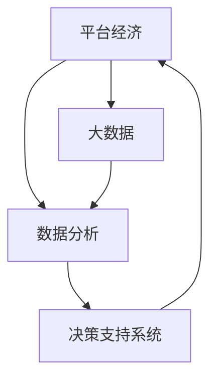

                 

## 1. 背景介绍

在快速发展的数字经济时代，平台经济成为推动经济发展的重要引擎。平台企业通过构建连接消费者和生产者的生态系统，提供了丰富的产品和服务，满足了各类市场主体的需求。平台经济的发展不仅带来了巨大的经济效益，还催生了各种新的商业模式和技术应用。然而，平台经济的复杂性和多样性，也使得数据在其中扮演了不可或缺的角色。数据分析作为平台企业决策的基础，不仅帮助企业洞察市场趋势，优化产品策略，提升用户体验，还为平台经济的健康发展提供了有力支持。

### 1.1 数据驱动的决策

在平台经济中，数据驱动的决策方式已经逐渐成为主流。平台企业通过收集和分析用户行为数据，可以更好地理解市场动态，优化产品推荐，提升用户体验，甚至在激烈的市场竞争中占据优势。例如，电商平台通过分析用户购买行为，能够预测未来消费趋势，进行精准营销，提升销售额。旅游平台则通过分析用户搜索和预订行为，优化行程推荐，提高用户满意度。这些成功的案例都充分展示了数据分析在平台经济中的重要性。

### 1.2 数据驱动的创新

平台经济的发展也促进了数据驱动的创新。通过数据挖掘和分析，平台企业能够发现新的商业机会，推动业务创新和转型。例如，共享经济平台通过分析用户位置和出行需求，优化资源配置，提升了车辆利用率，减少了出行成本。在线教育平台则通过分析学习行为和反馈，优化课程内容和推荐系统，提升了教学效果和学习体验。这些案例展示了数据驱动的创新，不仅优化了现有业务，还催生了新的商业模式和市场机会。

### 1.3 数据驱动的竞争优势

在激烈的市场竞争中，数据驱动的决策和创新成为了企业竞争的重要手段。平台企业通过数据分析，能够更准确地把握市场变化，优化资源配置，提升效率和竞争力。例如，外卖平台通过数据分析优化配送路线，提高配送效率，提升用户体验，从而在竞争中保持领先地位。社交平台通过数据分析优化内容推荐算法，提升用户黏性，保持平台活跃度。这些案例展示了数据驱动的竞争优势，数据成为了企业竞争的重要资源和手段。

## 2. 核心概念与联系

### 2.1 核心概念概述

为了更好地理解数据分析在平台经济中的应用，本节将介绍几个密切相关的核心概念：

- **平台经济**：指通过互联网平台连接供需双方的商业模式，如电商、共享经济、在线教育等。
- **大数据**：指数据量庞大、数据类型多样、数据来源广泛的海量数据集合，是数据分析的基础。
- **数据分析**：指对大规模数据进行收集、清洗、处理、分析和可视化的过程，目的是提取有价值的信息和知识。
- **决策支持系统**（Decision Support System, DSS）：指基于数据分析和人工智能技术，辅助企业进行决策的智能系统。
- **数据驱动**：指企业决策和创新基于数据的分析和应用，而非仅仅依赖经验或直觉。

这些核心概念之间的逻辑关系可以通过以下Mermaid流程图来展示：



这个流程图展示了大数据分析在平台经济中的应用框架：平台企业通过收集大数据，进行数据分析，最终通过决策支持系统进行决策和创新，驱动平台经济的发展。

## 3. 核心算法原理 & 具体操作步骤

### 3.1 算法原理概述

在平台经济中，数据分析的主要目标是发现数据中的模式和趋势，为决策提供依据。数据分析可以分为描述性分析、诊断性分析和预测性分析三类。描述性分析用于描述数据的基本特征和分布情况；诊断性分析用于探究数据背后的原因和关系；预测性分析用于预测未来的趋势和变化。

数据分析的核心算法包括数据挖掘、统计分析、机器学习和深度学习等。数据挖掘算法用于发现数据中的隐藏关系和模式；统计分析算法用于检验数据之间的统计关系；机器学习算法用于构建预测模型；深度学习算法用于处理复杂的数据结构和关系。

### 3.2 算法步骤详解

数据分析在平台经济中的应用通常包括以下几个关键步骤：

**Step 1: 数据收集和处理**

- **数据来源**：平台企业可以从内部业务系统、第三方数据提供商、社交媒体等多个渠道收集数据。
- **数据清洗**：对收集到的数据进行去重、去噪、处理缺失值和异常值等预处理操作，确保数据质量。

**Step 2: 数据分析和建模**

- **特征工程**：从原始数据中提取有用的特征，构建特征空间，用于后续的模型训练。
- **模型选择和训练**：选择合适的算法模型，如回归模型、分类模型、聚类模型等，在训练集上训练模型，得到模型参数。
- **模型评估**：使用验证集或测试集评估模型性能，选择最优模型。

**Step 3: 结果可视化和应用**

- **数据可视化**：通过图表、仪表盘等方式展示分析结果，直观展示数据趋势和模式。
- **决策支持**：将分析结果应用到业务决策中，如优化产品推荐、调整价格策略、提升用户体验等。

**Step 4: 持续监控和优化**

- **实时监控**：对业务数据进行实时监控，及时发现异常情况。
- **模型更新**：根据新的业务数据和市场变化，定期更新模型，保持分析结果的准确性。

### 3.3 算法优缺点

数据分析在平台经济中的应用具有以下优点：

1. **提升决策效率**：数据驱动的决策方式能够更快速、更准确地做出决策。
2. **优化业务流程**：通过数据分析，可以发现业务流程中的瓶颈和问题，进行优化。
3. **提升用户体验**：数据分析能够更好地理解用户需求和行为，提升产品和服务质量。
4. **预测市场趋势**：通过预测性分析，可以提前发现市场变化，优化业务策略。

然而，数据分析在平台经济中也有以下局限：

1. **数据质量问题**：平台企业的业务数据质量往往参差不齐，数据不一致性等问题可能导致分析结果不准确。
2. **隐私和安全问题**：平台企业需要处理大量敏感数据，数据隐私和安全问题需要引起重视。
3. **技术门槛较高**：数据分析需要专业知识和技术支持，对平台的IT团队提出了较高的要求。
4. **数据量巨大**：平台企业的数据量往往非常庞大，处理和存储都面临挑战。

### 3.4 算法应用领域

数据分析在平台经济中的应用非常广泛，涵盖了以下几个领域：

- **电子商务**：分析用户购买行为，优化商品推荐，提升销售额。
- **金融服务**：分析用户金融数据，进行信用评估和风险控制，提升金融服务质量。
- **健康医疗**：分析用户健康数据，进行疾病预测和个性化医疗方案推荐，提升医疗服务水平。
- **交通出行**：分析用户出行数据，优化路线和资源配置，提升出行效率。
- **教育培训**：分析学习行为数据，优化课程推荐和教学效果，提升教育质量。

这些应用领域展示了数据分析在平台经济中的广泛应用，不同领域的数据分析方法和应用场景也有所不同。

## 4. 数学模型和公式 & 详细讲解 & 举例说明

### 4.1 数学模型构建

在平台经济中，数据分析的主要数学模型包括回归模型、分类模型、聚类模型和神经网络模型等。以下以回归模型为例，介绍其数学模型构建过程。

假设平台企业收集到了历史销售数据 $(x_1, x_2, \ldots, x_n)$，其中 $x_i$ 为第 $i$ 个样本的特征向量，$y_i$ 为对应的销售量。回归模型的目标是建立一个函数 $f(x)$，使得预测值 $\hat{y} = f(x)$ 尽可能接近真实值 $y$。回归模型的目标函数为：

$$
\min_{\theta} \sum_{i=1}^n (y_i - f(x_i))^2
$$

其中 $\theta$ 为模型参数。

### 4.2 公式推导过程

回归模型可以采用最小二乘法进行求解。最小二乘法的公式为：

$$
\hat{\theta} = (\frac{1}{n} \sum_{i=1}^n x_ix_i^T)^{-1} \sum_{i=1}^n x_iy_i
$$

其中 $\hat{\theta}$ 为最优参数，$n$ 为样本数量。

假设平台企业有 $n=1000$ 个历史销售数据，构建线性回归模型，则最优参数 $\hat{\theta}$ 可以通过以下步骤计算得到：

1. 计算 $x_i$ 的平方和 $\sum_{i=1}^n x_i^2$。
2. 计算 $x_ix_j$ 的累乘积和 $\sum_{i=1}^n \sum_{j=1}^n x_ix_j$。
3. 计算 $x_iy_i$ 的累加和 $\sum_{i=1}^n x_iy_i$。
4. 计算最优参数 $\hat{\theta}$：

$$
\hat{\theta} = (\frac{1}{n} \sum_{i=1}^n x_ix_i^T)^{-1} \sum_{i=1}^n x_iy_i
$$

### 4.3 案例分析与讲解

假设平台企业收集到了用户的购买行为数据，包括用户的年龄、性别、地理位置、历史购买记录等。平台企业希望通过数据分析，预测用户的购买意向和购买量，优化商品推荐系统。

**Step 1: 数据收集和处理**

平台企业从电商平台收集用户数据，并进行数据清洗，处理缺失值和异常值，构建特征空间。

**Step 2: 数据分析和建模**

平台企业选择线性回归模型，构建回归模型 $f(x) = \hat{\theta}x^T$，其中 $x$ 为特征向量，$\hat{\theta}$ 为最优参数。通过最小二乘法求解最优参数 $\hat{\theta}$。

**Step 3: 结果可视化和应用**

平台企业使用可视化的仪表盘展示预测结果，并将预测结果应用到商品推荐系统中，优化推荐算法，提升用户体验。

**Step 4: 持续监控和优化**

平台企业实时监控用户购买数据，发现异常情况，及时调整模型参数，保持预测结果的准确性。

## 5. 项目实践：代码实例和详细解释说明

### 5.1 开发环境搭建

在进行数据分析项目实践前，我们需要准备好开发环境。以下是使用Python进行数据分析的开发环境配置流程：

1. 安装Anaconda：从官网下载并安装Anaconda，用于创建独立的Python环境。

2. 创建并激活虚拟环境：
```bash
conda create -n analysis_env python=3.8 
conda activate analysis_env
```

3. 安装Python核心库和第三方库：
```bash
pip install pandas numpy matplotlib scikit-learn seaborn jupyter notebook ipython
```

4. 安装可视化工具：
```bash
pip install plotly dash
```

5. 安装数据处理库：
```bash
pip install pyspark sqlalchemy
```

完成上述步骤后，即可在`analysis_env`环境中开始数据分析实践。

### 5.2 源代码详细实现

这里我们以电商平台的销售数据分析为例，给出使用Python进行回归分析的代码实现。

首先，定义数据集和特征：

```python
import pandas as pd
import numpy as np

# 读取数据集
df = pd.read_csv('sales_data.csv')

# 定义特征和标签
features = df[['age', 'gender', 'location', 'historical_sales']]
target = df['sales']
```

接着，进行数据处理和预处理：

```python
# 数据清洗
features.dropna(inplace=True)
target.dropna(inplace=True)

# 特征工程
features = pd.get_dummies(features, drop_first=True)
features = pd.concat([features, target], axis=1)
```

然后，构建并训练回归模型：

```python
from sklearn.linear_model import LinearRegression
from sklearn.model_selection import train_test_split
from sklearn.metrics import mean_squared_error, r2_score

# 分割训练集和测试集
X_train, X_test, y_train, y_test = train_test_split(features.drop(target, axis=1), target, test_size=0.2, random_state=42)

# 构建回归模型
model = LinearRegression()

# 训练模型
model.fit(X_train, y_train)

# 评估模型
y_pred = model.predict(X_test)
mse = mean_squared_error(y_test, y_pred)
r2 = r2_score(y_test, y_pred)
print(f'Mean Squared Error: {mse:.3f}')
print(f'R2 Score: {r2:.3f}')
```

最后，展示结果：

```python
import plotly.express as px

# 绘制散点图
fig = px.scatter(features, x=target, y=features.columns)
fig.show()
```

### 5.3 代码解读与分析

让我们再详细解读一下关键代码的实现细节：

**数据集和特征定义**：
- 使用pandas库读取数据集，并定义特征和标签。

**数据处理和预处理**：
- 使用dropna方法删除缺失值。
- 使用get_dummies方法进行特征编码，避免多重共线性。
- 使用concat方法将特征和标签拼接成新的数据集。

**模型构建和训练**：
- 使用sklearn库构建线性回归模型。
- 使用train_test_split方法将数据集分割为训练集和测试集。
- 使用fit方法训练模型，得到最优参数。
- 使用mean_squared_error和r2_score方法评估模型性能。

**结果展示**：
- 使用plotly库绘制散点图，展示数据分布情况。

数据分析的代码实现相对简洁，但需要注意数据的清洗和处理、模型的选择和训练、结果的可视化和应用等关键步骤。在实际应用中，还需要根据具体问题进行优化和调整。

## 6. 实际应用场景

### 6.1 智能推荐系统

在平台经济中，智能推荐系统是数据分析的重要应用之一。通过分析用户行为数据，推荐系统能够发现用户兴趣和偏好，进行个性化推荐，提升用户体验和满意度。例如，电商平台通过分析用户的浏览、购买历史，推荐用户可能感兴趣的商品，提高了用户的购买转化率。

### 6.2 客户服务系统

平台企业的客户服务系统也离不开数据分析的支持。通过分析用户反馈和历史记录，系统能够识别出常见的客户问题和投诉，优化服务流程，提高客户满意度。例如，电信运营商通过分析用户的投诉数据，识别出常见的问题类型和原因，优化服务流程，提升客户服务质量。

### 6.3 金融风控系统

金融服务是平台经济的重要组成部分。通过分析用户金融数据，平台企业能够进行风险评估和控制，提升金融服务的安全性和可靠性。例如，保险公司通过分析用户的健康数据和历史理赔记录，进行风险评估，制定合理的保费策略，减少理赔风险。

### 6.4 未来应用展望

随着数据技术和算法的不断进步，数据分析在平台经济中的应用将更加广泛和深入。未来，数据分析将在以下几个方面继续拓展：

- **数据智能处理**：大数据处理技术的进步，使得平台企业能够更高效地处理和分析海量数据。
- **多模态数据分析**：平台企业将利用多模态数据（如文本、图像、音频等）进行更全面的数据分析。
- **实时数据分析**：通过实时数据分析，平台企业能够更快速地响应市场变化，优化业务决策。
- **自动化数据分析**：利用人工智能技术，平台企业可以实现自动化数据分析，提高数据处理效率。

这些趋势展示了数据分析在平台经济中的广阔前景，未来将为平台企业带来更大的价值。

## 7. 工具和资源推荐

### 7.1 学习资源推荐

为了帮助平台企业更好地掌握数据分析技能，这里推荐一些优质的学习资源：

1. **《Python数据分析与可视化》**：介绍Python数据分析的基本方法和工具，涵盖数据清洗、特征工程、模型训练等多个方面。
2. **《机器学习实战》**：结合实际案例，介绍机器学习的基本概念和算法，帮助读者深入理解数据分析的核心技术。
3. **Coursera《数据科学导论》**：斯坦福大学开设的课程，系统介绍数据分析的基本流程和应用，适合初学者和进阶者。
4. **Kaggle平台**：提供丰富的数据分析竞赛和项目，帮助读者实践和应用数据分析技能。
5. **Python Data Science Handbook**：介绍Python数据科学的基本工具和库，包括NumPy、Pandas、Matplotlib、Scikit-learn等。

### 7.2 开发工具推荐

高效的开发离不开优秀的工具支持。以下是几款用于数据分析开发的常用工具：

1. **Jupyter Notebook**：基于Web的交互式编程环境，支持多种编程语言和库，适合数据分析项目的开发和协作。
2. **RStudio**：R语言的集成开发环境，支持R语言的交互式编程、数据分析和可视化。
3. **Tableau**：商业智能和数据可视化工具，支持数据连接、可视化设计和报告发布。
4. **Power BI**：微软推出的商业智能和数据可视化工具，支持多种数据源的连接和可视化。
5. **Python IDEs**：如PyCharm、VSCode、Spyder等，支持Python语言的开发和数据分析。

### 7.3 相关论文推荐

数据分析在平台经济中的应用源于学界的持续研究。以下是几篇奠基性的相关论文，推荐阅读：

1. **"Data Mining and Statistical Learning" by Trevor Hastie, Robert Tibshirani, Jerome Friedman**：介绍数据挖掘和统计学习的基本概念和算法，适用于数据分析的入门学习。
2. **"Pattern Recognition and Machine Learning" by Christopher Bishop**：系统介绍机器学习的基本概念和算法，涵盖分类、回归、聚类等多个方面。
3. **"Big Data: Principles and Best Practices of Scalable Real-time Data Systems" by Nathan Marz, James Warren**：介绍大数据处理和实时数据分析的基本方法和工具，适用于大数据项目的开发和实践。
4. **"Deep Learning for Healthcare" by Laurence D. H. Burns**：介绍深度学习在医疗数据分析中的应用，适用于医疗数据分析的实践和研究。

## 8. 总结：未来发展趋势与挑战

### 8.1 总结

本文对数据分析在平台经济中的应用进行了全面系统的介绍。首先阐述了数据分析在平台经济中的重要性，展示了数据分析在智能推荐、客户服务、金融风控等多个领域的应用。其次，从原理到实践，详细讲解了数据分析的数学模型和算法步骤，给出了数据分析项目开发的完整代码实例。最后，本文还探讨了数据分析的实际应用场景和未来发展趋势，展示了数据分析在平台经济中的广阔前景。

通过本文的系统梳理，可以看到，数据分析在平台经济中的重要性及其在各个领域的应用前景。数据分析不仅提升了平台企业的业务效率和用户体验，还推动了平台经济的健康发展和创新。未来，伴随数据技术和算法的不断进步，数据分析在平台经济中的应用将更加广泛和深入，成为平台企业竞争优势的重要手段。

### 8.2 未来发展趋势

展望未来，数据分析在平台经济中的应用将呈现以下几个发展趋势：

- **数据智能处理**：大数据处理技术的进步，使得平台企业能够更高效地处理和分析海量数据。
- **多模态数据分析**：平台企业将利用多模态数据（如文本、图像、音频等）进行更全面的数据分析。
- **实时数据分析**：通过实时数据分析，平台企业能够更快速地响应市场变化，优化业务决策。
- **自动化数据分析**：利用人工智能技术，平台企业可以实现自动化数据分析，提高数据处理效率。

这些趋势展示了数据分析在平台经济中的广阔前景，未来将为平台企业带来更大的价值。

### 8.3 面临的挑战

尽管数据分析在平台经济中已经取得了一定的成效，但在迈向更加智能化、普适化应用的过程中，它仍面临以下几个挑战：

- **数据质量问题**：平台企业的业务数据质量往往参差不齐，数据不一致性等问题可能导致分析结果不准确。
- **隐私和安全问题**：平台企业需要处理大量敏感数据，数据隐私和安全问题需要引起重视。
- **技术门槛较高**：数据分析需要专业知识和技术支持，对平台的IT团队提出了较高的要求。
- **数据量巨大**：平台企业的数据量往往非常庞大，处理和存储都面临挑战。

### 8.4 研究展望

未来的研究需要在以下几个方面寻求新的突破：

- **数据智能处理**：研究高效的大数据处理算法，提升数据处理速度和准确性。
- **多模态数据分析**：研究多模态数据融合方法，提升数据的多样性和全面性。
- **实时数据分析**：研究实时数据流处理技术，提升数据分析的时效性。
- **自动化数据分析**：研究自动化数据分析技术，提升数据处理效率和准确性。

这些研究方向的探索，将进一步提升数据分析在平台经济中的应用水平，为平台企业提供更强大的数据支持和决策辅助。

## 9. 附录：常见问题与解答

**Q1：平台企业如何选择合适的数据分析工具？**

A: 平台企业需要根据业务需求和技术特点选择合适的数据分析工具。一般来说，以下几个工具比较常用：
1. **Python和R语言**：适合数据分析的开发和编程。
2. **Tableau和Power BI**：适合数据可视化和报告生成。
3. **Jupyter Notebook和RStudio**：适合交互式数据分析和协作开发。

**Q2：数据分析在平台经济中需要注意哪些关键点？**

A: 数据分析在平台经济中需要注意以下关键点：
1. **数据质量**：确保数据的一致性、完整性和准确性。
2. **数据隐私和安全**：保护用户隐私和数据安全。
3. **模型选择和训练**：选择合适的模型和算法，训练出最优模型。
4. **结果可视化和应用**：将分析结果可视化，应用于业务决策。
5. **持续监控和优化**：实时监控数据变化，定期更新模型。

**Q3：平台企业如何进行数据清洗和预处理？**

A: 平台企业可以从以下几个方面进行数据清洗和预处理：
1. **去重和去噪**：删除重复和异常数据。
2. **处理缺失值**：填补缺失值或删除缺失样本。
3. **特征工程**：提取有用的特征，构建特征空间。
4. **归一化和标准化**：将数据进行归一化和标准化处理。
5. **数据融合**：将不同来源的数据进行融合。

**Q4：数据分析在平台经济中如何提高决策效率？**

A: 数据分析可以通过以下几个方面提高决策效率：
1. **数据可视化和仪表盘**：直观展示数据趋势和模式。
2. **自动化分析和报告**：减少人工分析和报告的时间。
3. **实时数据流处理**：实时响应市场变化，优化决策。
4. **机器学习和深度学习**：自动化模型训练，提高决策速度和准确性。

通过本文的系统梳理，可以看到，数据分析在平台经济中的重要性及其在各个领域的应用前景。数据分析不仅提升了平台企业的业务效率和用户体验，还推动了平台经济的健康发展和创新。未来，伴随数据技术和算法的不断进步，数据分析在平台经济中的应用将更加广泛和深入，成为平台企业竞争优势的重要手段。

