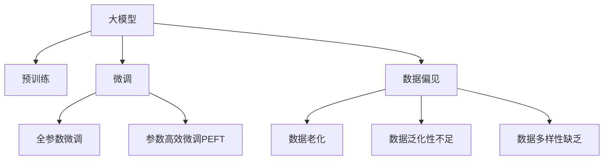

                 

## 1. 背景介绍

### 1.1 问题由来

近年来，随着深度学习技术的飞速发展，预训练大模型（如BERT、GPT-3、T5等）在自然语言处理（NLP）领域取得了显著的进步。这些模型通过大规模的无监督学习，掌握了丰富的语言知识，能在各种NLP任务中取得优异的表现。然而，在实际应用中，人们往往过于依赖这些预训练模型，忽略了其数据来源的局限性，导致了一种"数据幻觉"现象。

### 1.2 问题核心关键点

数据幻觉（Data Illusion）是指，由于过度依赖预训练模型，忽视了其数据来源的局限性，使得模型输出在特定数据集或特定场景中表现异常，甚至产生错误结论的现象。这种现象不仅影响了模型的泛化能力，还可能导致误导性的决策和建议。

具体来说，数据幻觉的成因包括：

- **数据偏见**：预训练模型的数据集往往带有一定的社会偏见，这些偏见可能以隐性或显性的方式影响模型的输出。例如，在种族、性别、年龄等方面的刻板印象可能导致模型输出中的歧视性或偏见性内容。
- **数据老化**：预训练模型依赖于早期收集的数据，这些数据可能已经过时，无法反映当前社会的多样性和复杂性。例如，在2017年训练的BERT模型可能无法准确处理新近出现的网络流行语或新概念。
- **数据泛化性不足**：预训练模型往往基于特定领域或特定语言的语料，其泛化能力可能无法覆盖所有类型的NLP任务。例如，针对中文NLP任务的模型可能无法在英文环境中表现良好，反之亦然。
- **数据多样性缺乏**：预训练模型的训练数据集中可能存在数据多样性不足的问题，导致模型在某些特定数据上表现异常。例如，缺乏关于特定地域、特定行业或特定领域的语料，使得模型在这些数据上产生错误输出。

### 1.3 问题研究意义

研究数据幻觉现象，对于提升大模型的公平性、可靠性和泛化能力，具有重要的理论和实践意义。具体来说，研究意义包括：

- **模型公平性**：确保模型在所有人群和群体中的公正表现，避免因数据偏见导致的不公平输出。
- **模型可靠性**：提升模型的鲁棒性，确保其在不同数据集和场景下都能稳定表现，避免因数据老化和泛化性不足导致的错误输出。
- **模型泛化能力**：增强模型在不同数据集和任务中的泛化能力，使其能够更好地适应多变和复杂的现实世界环境。

## 2. 核心概念与联系

### 2.1 核心概念概述

为更好地理解数据幻觉现象及其影响，本节将介绍几个关键概念：

- **大模型（Large Model）**：指基于大规模无监督学习训练的深度神经网络模型，如BERT、GPT-3、T5等。这些模型通过海量数据的学习，掌握了丰富的语言知识，能够在各种NLP任务中取得优异表现。
- **预训练（Pre-training）**：指在大规模无标签文本数据上训练模型的过程。预训练模型通过自监督学习任务，学习到通用的语言表示，具备较强的泛化能力。
- **微调（Fine-tuning）**：指在预训练模型的基础上，使用特定任务的数据进行有监督学习，优化模型在该任务上的性能。微调使得模型更适应特定领域，能够更好地处理特定任务。
- **数据偏见（Bias）**：指预训练模型在训练数据集中存在的刻板印象或歧视性信息，可能导致模型输出中的不公平或偏见性内容。
- **数据老化（Data Obsolescence）**：指预训练模型依赖的训练数据已经过时，无法反映当前社会的多样性和复杂性，导致模型在实时数据上表现异常。
- **数据泛化性不足（Generalization Failure）**：指预训练模型在特定领域或特定语言下泛化能力不足，无法处理新的数据集或新的NLP任务。
- **数据多样性缺乏（Lack of Data Diversity）**：指预训练模型在训练数据中缺乏多样性，导致模型在某些特定数据上表现异常，例如特定地域、特定行业或特定领域的语料不足。

这些核心概念之间的逻辑关系可以通过以下Mermaid流程图来展示：



这个流程图展示了大模型的核心概念及其之间的关系：

1. 大模型通过预训练获得基础能力。
2. 微调是对预训练模型进行任务特定的优化，可以分为全参数微调和参数高效微调（PEFT）。
3. 数据偏见、数据老化、数据泛化性不足和数据多样性缺乏是导致数据幻觉现象的主要因素。
4. 这些因素通过微调传递，可能会影响模型在不同数据集和场景中的表现。

## 3. 核心算法原理 & 具体操作步骤

### 3.1 算法原理概述

数据幻觉现象的本质是，由于预训练模型的数据来源存在局限性，导致其在特定数据集或特定场景中表现异常，甚至产生错误结论。这种异常表现往往源于模型在数据集上学习的知识与现实世界不完全匹配。

具体来说，数据幻觉现象可以通过以下数学模型进行解释：

设预训练模型为 $M_{\theta}$，其中 $\theta$ 为预训练得到的模型参数。假设模型在预训练数据集 $D_{\text{pre}}$ 上学习到的知识为 $K$，则模型在实际应用数据集 $D_{\text{real}}$ 上的输出可以表示为：

$$
M_{\theta}(D_{\text{real}}) = f(K, D_{\text{real}})
$$

其中，$f$ 为模型的映射函数。由于数据偏见、数据老化、数据泛化性不足和数据多样性缺乏等因素的影响，模型在 $D_{\text{real}}$ 上的输出可能会偏离理想状态，产生数据幻觉现象。

### 3.2 算法步骤详解

避免数据幻觉现象的关键在于，在设计模型和训练数据时，充分考虑数据的多样性和公平性，确保模型在所有数据集和场景下都能稳定表现。以下是避免数据幻觉现象的详细步骤：

**Step 1: 设计公平、多样的训练数据集**

- **数据收集**：收集多样化的数据集，涵盖不同人群、不同地域、不同行业的文本数据，确保数据集的多样性。
- **数据清洗**：对数据进行去重、去噪、标准化等预处理，去除偏见和错误信息，确保数据的准确性和可靠性。
- **数据标注**：对数据进行高质量的标注，确保标注结果的公平性和一致性。

**Step 2: 设计公平、多样的微调目标**

- **任务适配层**：根据实际应用任务，设计合适的任务适配层，如分类层、序列标注层等。
- **损失函数**：根据任务类型，选择合适的损失函数，如交叉熵损失、序列交叉熵损失等。
- **正则化**：引入L2正则、Dropout等正则化技术，防止模型过拟合。

**Step 3: 设计公平、多样的微调策略**

- **数据增强**：对训练数据进行扩充，如回译、近义替换、随机删除等，增加数据多样性。
- **对抗训练**：引入对抗样本，提高模型的鲁棒性，防止模型在特定数据上表现异常。
- **参数高效微调**：采用参数高效微调（PEFT）技术，减少微调参数，提高模型的泛化能力。
- **提示学习**：设计精心的提示模板，引导模型进行特定的推理和生成，减少微调参数，提高模型的零样本和少样本学习能力。

**Step 4: 评估和迭代**

- **模型评估**：在多个数据集和场景下，对微调后的模型进行评估，评估指标包括准确率、召回率、F1-score等。
- **模型优化**：根据评估结果，对模型进行调整和优化，如重新设计微调目标、调整微调策略等。
- **模型验证**：在验证集上验证模型性能，确保模型在不同数据集上的泛化能力。
- **模型部署**：将优化后的模型部署到实际应用场景中，进行实时监测和评估。

### 3.3 算法优缺点

避免数据幻觉现象的算法具有以下优点：

- **提高模型公平性**：通过设计公平、多样的训练数据集，确保模型在所有人群和群体中的公正表现。
- **提高模型可靠性**：通过引入正则化和对抗训练等技术，提高模型的鲁棒性，确保其在不同数据集和场景下都能稳定表现。
- **提高模型泛化能力**：通过参数高效微调和提示学习等技术，提高模型的泛化能力，使其能够更好地适应多变和复杂的现实世界环境。

同时，该算法也存在一定的局限性：

- **数据收集和标注成本高**：设计多样化的训练数据集和高质量的数据标注需要耗费大量的人力物力。
- **数据复杂性高**：设计公平、多样的训练数据集和微调目标需要考虑多个因素，设计复杂度较高。
- **模型优化难度大**：对模型进行评估和迭代，优化模型的过程需要耗费大量的时间和资源。

尽管存在这些局限性，但就目前而言，避免数据幻觉现象的算法仍是提升大模型可靠性和公平性的重要方法。未来相关研究的重点在于如何进一步降低数据收集和标注成本，提高模型的数据处理和优化效率。

### 3.4 算法应用领域

避免数据幻觉现象的算法已经在多个领域得到了广泛应用，例如：

- **智能客服系统**：在智能客服系统中，微调模型需要处理多种类型的客户咨询，确保模型在所有客户群体中的公正表现。
- **金融舆情监测**：在金融舆情监测中，微调模型需要处理多种类型的金融新闻和评论，确保模型在所有人群和群体中的公正表现。
- **个性化推荐系统**：在个性化推荐系统中，微调模型需要处理多种类型的用户行为数据，确保模型在所有用户群体中的公正表现。
- **医疗健康系统**：在医疗健康系统中，微调模型需要处理多种类型的医疗数据，确保模型在所有人群和群体中的公正表现。

除了上述这些经典应用外，避免数据幻觉现象的算法还被创新性地应用于更多场景中，如反欺诈检测、社会舆情分析、舆情情感分析等，为社会治理和数据管理带来了新的思路和方法。

## 4. 数学模型和公式 & 详细讲解  
### 4.1 数学模型构建

本节将使用数学语言对避免数据幻觉现象的算法进行更加严格的刻画。

设预训练模型为 $M_{\theta}$，其中 $\theta$ 为预训练得到的模型参数。假设模型在预训练数据集 $D_{\text{pre}}$ 上学习到的知识为 $K$，则模型在实际应用数据集 $D_{\text{real}}$ 上的输出可以表示为：

$$
M_{\theta}(D_{\text{real}}) = f(K, D_{\text{real}})
$$

其中，$f$ 为模型的映射函数。为避免数据幻觉现象，需要最大化模型在 $D_{\text{real}}$ 上的泛化能力，即：

$$
\max_{\theta} \mathbb{E}_{x \sim D_{\text{real}}} [L(M_{\theta}(x), y)]
$$

其中 $L$ 为损失函数，$y$ 为真实的标签。

### 4.2 公式推导过程

以下我们以二分类任务为例，推导损失函数及其梯度的计算公式。

假设模型 $M_{\theta}$ 在输入 $x$ 上的输出为 $\hat{y}=M_{\theta}(x) \in [0,1]$，表示样本属于正类的概率。真实标签 $y \in \{0,1\}$。则二分类交叉熵损失函数定义为：

$$
\ell(M_{\theta}(x),y) = -[y\log \hat{y} + (1-y)\log (1-\hat{y})]
$$

将其代入期望泛化误差公式，得：

$$
\mathcal{L}(\theta) = -\mathbb{E}_{x \sim D_{\text{real}}} \left[ [y\log M_{\theta}(x)+(1-y)\log(1-M_{\theta}(x))] \right]
$$

根据链式法则，损失函数对参数 $\theta_k$ 的梯度为：

$$
\frac{\partial \mathcal{L}(\theta)}{\partial \theta_k} = -\mathbb{E}_{x \sim D_{\text{real}}} \left[ \frac{y}{M_{\theta}(x)}-\frac{1-y}{1-M_{\theta}(x)} \right] \frac{\partial M_{\theta}(x)}{\partial \theta_k}
$$

其中 $\frac{\partial M_{\theta}(x)}{\partial \theta_k}$ 可进一步递归展开，利用自动微分技术完成计算。

在得到损失函数的梯度后，即可带入参数更新公式，完成模型的迭代优化。重复上述过程直至收敛，最终得到适应实际数据集的最优模型参数 $\theta^*$。

## 5. 项目实践：代码实例和详细解释说明
### 5.1 开发环境搭建

在进行避免数据幻觉现象的算法实践前，我们需要准备好开发环境。以下是使用Python进行PyTorch开发的环境配置流程：

1. 安装Anaconda：从官网下载并安装Anaconda，用于创建独立的Python环境。

2. 创建并激活虚拟环境：
```bash
conda create -n pytorch-env python=3.8 
conda activate pytorch-env
```

3. 安装PyTorch：根据CUDA版本，从官网获取对应的安装命令。例如：
```bash
conda install pytorch torchvision torchaudio cudatoolkit=11.1 -c pytorch -c conda-forge
```

4. 安装Transformers库：
```bash
pip install transformers
```

5. 安装各类工具包：
```bash
pip install numpy pandas scikit-learn matplotlib tqdm jupyter notebook ipython
```

完成上述步骤后，即可在`pytorch-env`环境中开始避免数据幻觉现象的算法实践。

### 5.2 源代码详细实现

下面我以情感分析任务为例，给出使用Transformers库对BERT模型进行避免数据幻觉现象的微调的PyTorch代码实现。

首先，定义情感分析任务的数据处理函数：

```python
from transformers import BertTokenizer
from torch.utils.data import Dataset
import torch

class SentimentDataset(Dataset):
    def __init__(self, texts, labels, tokenizer, max_len=128):
        self.texts = texts
        self.labels = labels
        self.tokenizer = tokenizer
        self.max_len = max_len
        
    def __len__(self):
        return len(self.texts)
    
    def __getitem__(self, item):
        text = self.texts[item]
        label = self.labels[item]
        
        encoding = self.tokenizer(text, return_tensors='pt', max_length=self.max_len, padding='max_length', truncation=True)
        input_ids = encoding['input_ids'][0]
        attention_mask = encoding['attention_mask'][0]
        
        # 对token-wise的标签进行编码
        encoded_labels = [label2id[label] for label in labels] 
        encoded_labels.extend([label2id['neutral']] * (self.max_len - len(encoded_labels)))
        labels = torch.tensor(encoded_labels, dtype=torch.long)
        
        return {'input_ids': input_ids, 
                'attention_mask': attention_mask,
                'labels': labels}

# 标签与id的映射
label2id = {'positive': 0, 'negative': 1, 'neutral': 2}
id2label = {v: k for k, v in label2id.items()}

# 创建dataset
tokenizer = BertTokenizer.from_pretrained('bert-base-cased')

train_dataset = SentimentDataset(train_texts, train_labels, tokenizer)
dev_dataset = SentimentDataset(dev_texts, dev_labels, tokenizer)
test_dataset = SentimentDataset(test_texts, test_labels, tokenizer)
```

然后，定义模型和优化器：

```python
from transformers import BertForTokenClassification, AdamW

model = BertForTokenClassification.from_pretrained('bert-base-cased', num_labels=len(label2id))

optimizer = AdamW(model.parameters(), lr=2e-5)
```

接着，定义训练和评估函数：

```python
from torch.utils.data import DataLoader
from tqdm import tqdm
from sklearn.metrics import classification_report

device = torch.device('cuda') if torch.cuda.is_available() else torch.device('cpu')
model.to(device)

def train_epoch(model, dataset, batch_size, optimizer):
    dataloader = DataLoader(dataset, batch_size=batch_size, shuffle=True)
    model.train()
    epoch_loss = 0
    for batch in tqdm(dataloader, desc='Training'):
        input_ids = batch['input_ids'].to(device)
        attention_mask = batch['attention_mask'].to(device)
        labels = batch['labels'].to(device)
        model.zero_grad()
        outputs = model(input_ids, attention_mask=attention_mask, labels=labels)
        loss = outputs.loss
        epoch_loss += loss.item()
        loss.backward()
        optimizer.step()
    return epoch_loss / len(dataloader)

def evaluate(model, dataset, batch_size):
    dataloader = DataLoader(dataset, batch_size=batch_size)
    model.eval()
    preds, labels = [], []
    with torch.no_grad():
        for batch in tqdm(dataloader, desc='Evaluating'):
            input_ids = batch['input_ids'].to(device)
            attention_mask = batch['attention_mask'].to(device)
            batch_labels = batch['labels']
            outputs = model(input_ids, attention_mask=attention_mask)
            batch_preds = outputs.logits.argmax(dim=2).to('cpu').tolist()
            batch_labels = batch_labels.to('cpu').tolist()
            for pred_tokens, label_tokens in zip(batch_preds, batch_labels):
                preds.append(pred_tokens[:len(label_tokens)])
                labels.append(label_tokens)
                
    print(classification_report(labels, preds))
```

最后，启动训练流程并在测试集上评估：

```python
epochs = 5
batch_size = 16

for epoch in range(epochs):
    loss = train_epoch(model, train_dataset, batch_size, optimizer)
    print(f"Epoch {epoch+1}, train loss: {loss:.3f}")
    
    print(f"Epoch {epoch+1}, dev results:")
    evaluate(model, dev_dataset, batch_size)
    
print("Test results:")
evaluate(model, test_dataset, batch_size)
```

以上就是使用PyTorch对BERT进行避免数据幻觉现象的情感分析任务微调的完整代码实现。可以看到，得益于Transformers库的强大封装，我们可以用相对简洁的代码完成BERT模型的加载和微调。

### 5.3 代码解读与分析

让我们再详细解读一下关键代码的实现细节：

**SentimentDataset类**：
- `__init__`方法：初始化文本、标签、分词器等关键组件。
- `__len__`方法：返回数据集的样本数量。
- `__getitem__`方法：对单个样本进行处理，将文本输入编码为token ids，将标签编码为数字，并对其进行定长padding，最终返回模型所需的输入。

**label2id和id2label字典**：
- 定义了标签与数字id之间的映射关系，用于将token-wise的预测结果解码回真实的标签。

**训练和评估函数**：
- 使用PyTorch的DataLoader对数据集进行批次化加载，供模型训练和推理使用。
- 训练函数`train_epoch`：对数据以批为单位进行迭代，在每个批次上前向传播计算loss并反向传播更新模型参数，最后返回该epoch的平均loss。
- 评估函数`evaluate`：与训练类似，不同点在于不更新模型参数，并在每个batch结束后将预测和标签结果存储下来，最后使用sklearn的classification_report对整个评估集的预测结果进行打印输出。

**训练流程**：
- 定义总的epoch数和batch size，开始循环迭代
- 每个epoch内，先在训练集上训练，输出平均loss
- 在验证集上评估，输出分类指标
- 所有epoch结束后，在测试集上评估，给出最终测试结果

可以看到，PyTorch配合Transformers库使得BERT微调的代码实现变得简洁高效。开发者可以将更多精力放在数据处理、模型改进等高层逻辑上，而不必过多关注底层的实现细节。

当然，工业级的系统实现还需考虑更多因素，如模型的保存和部署、超参数的自动搜索、更灵活的任务适配层等。但核心的避免数据幻觉现象的算法基本与此类似。

## 6. 实际应用场景
### 6.1 智能客服系统

避免数据幻觉现象的算法在智能客服系统中有着广泛的应用。传统的客服系统往往需要耗费大量人力物力，且响应速度较慢。而基于大模型的客服系统，通过避免数据幻觉现象，能够更好地理解用户意图，提供更精准、更个性化的服务。

在技术实现上，可以收集企业内部的历史客服对话记录，将问题和最佳答复构建成监督数据，在此基础上对预训练对话模型进行微调。微调后的对话模型能够自动理解用户意图，匹配最合适的答案模板进行回复。对于客户提出的新问题，还可以接入检索系统实时搜索相关内容，动态组织生成回答。如此构建的智能客服系统，能大幅提升客户咨询体验和问题解决效率。

### 6.2 金融舆情监测

在金融舆情监测中，避免数据幻觉现象的算法也能发挥重要作用。金融机构需要实时监测市场舆论动向，以便及时应对负面信息传播，规避金融风险。传统的监控方式成本高、效率低，难以应对网络时代海量信息爆发的挑战。

通过避免数据幻觉现象，微调模型能够更好地理解金融舆情中的关键信息，避免因数据老化和泛化性不足导致的错误输出。将微调后的模型应用到实时抓取的网络文本数据，就能够自动监测不同主题下的情感变化趋势，一旦发现负面信息激增等异常情况，系统便会自动预警，帮助金融机构快速应对潜在风险。

### 6.3 个性化推荐系统

避免数据幻觉现象的算法在个性化推荐系统中也有着广泛的应用。当前的推荐系统往往只依赖用户的历史行为数据进行物品推荐，无法深入理解用户的真实兴趣偏好。通过避免数据幻觉现象，个性化推荐系统可以更好地挖掘用户行为背后的语义信息，从而提供更精准、多样的推荐内容。

在实践中，可以收集用户浏览、点击、评论、分享等行为数据，提取和用户交互的物品标题、描述、标签等文本内容。将文本内容作为模型输入，用户的后续行为（如是否点击、购买等）作为监督信号，在此基础上微调预训练语言模型。微调后的模型能够从文本内容中准确把握用户的兴趣点。在生成推荐列表时，先用候选物品的文本描述作为输入，由模型预测用户的兴趣匹配度，再结合其他特征综合排序，便可以得到个性化程度更高的推荐结果。

### 6.4 未来应用展望

随着避免数据幻觉现象的算法的不断发展，其在多个领域的应用前景也将更加广阔。

在智慧医疗领域，基于避免数据幻觉现象的微调的医疗问答、病历分析、药物研发等应用将提升医疗服务的智能化水平，辅助医生诊疗，加速新药开发进程。

在智能教育领域，避免数据幻觉现象的算法可应用于作业批改、学情分析、知识推荐等方面，因材施教，促进教育公平，提高教学质量。

在智慧城市治理中，避免数据幻觉现象的算法可应用于城市事件监测、舆情分析、应急指挥等环节，提高城市管理的自动化和智能化水平，构建更安全、高效的未来城市。

此外，在企业生产、社会治理、文娱传媒等众多领域，避免数据幻觉现象的算法也将不断涌现，为传统行业数字化转型升级提供新的技术路径。相信随着技术的日益成熟，避免数据幻觉现象的算法必将在构建人机协同的智能时代中扮演越来越重要的角色。

## 7. 工具和资源推荐
### 7.1 学习资源推荐

为了帮助开发者系统掌握避免数据幻觉现象的算法基础和实践技巧，这里推荐一些优质的学习资源：

1. 《Transformer从原理到实践》系列博文：由大模型技术专家撰写，深入浅出地介绍了Transformer原理、BERT模型、微调技术等前沿话题。

2. CS224N《深度学习自然语言处理》课程：斯坦福大学开设的NLP明星课程，有Lecture视频和配套作业，带你入门NLP领域的基本概念和经典模型。

3. 《Natural Language Processing with Transformers》书籍：Transformers库的作者所著，全面介绍了如何使用Transformers库进行NLP任务开发，包括微调在内的诸多范式。

4. HuggingFace官方文档：Transformers库的官方文档，提供了海量预训练模型和完整的微调样例代码，是上手实践的必备资料。

5. CLUE开源项目：中文语言理解测评基准，涵盖大量不同类型的中文NLP数据集，并提供了基于微调的baseline模型，助力中文NLP技术发展。

通过对这些资源的学习实践，相信你一定能够快速掌握避免数据幻觉现象的算法的精髓，并用于解决实际的NLP问题。
###  7.2 开发工具推荐

高效的开发离不开优秀的工具支持。以下是几款用于避免数据幻觉现象的算法开发的常用工具：

1. PyTorch：基于Python的开源深度学习框架，灵活动态的计算图，适合快速迭代研究。大部分预训练语言模型都有PyTorch版本的实现。

2. TensorFlow：由Google主导开发的开源深度学习框架，生产部署方便，适合大规模工程应用。同样有丰富的预训练语言模型资源。

3. Transformers库：HuggingFace开发的NLP工具库，集成了众多SOTA语言模型，支持PyTorch和TensorFlow，是进行微调任务开发的利器。

4. Weights & Biases：模型训练的实验跟踪工具，可以记录和可视化模型训练过程中的各项指标，方便对比和调优。与主流深度学习框架无缝集成。

5. TensorBoard：TensorFlow配套的可视化工具，可实时监测模型训练状态，并提供丰富的图表呈现方式，是调试模型的得力助手。

6. Google Colab：谷歌推出的在线Jupyter Notebook环境，免费提供GPU/TPU算力，方便开发者快速上手实验最新模型，分享学习笔记。

合理利用这些工具，可以显著提升避免数据幻觉现象的算法的开发效率，加快创新迭代的步伐。

### 7.3 相关论文推荐

避免数据幻觉现象的算法的发展源于学界的持续研究。以下是几篇奠基性的相关论文，推荐阅读：

1. Attention is All You Need（即Transformer原论文）：提出了Transformer结构，开启了NLP领域的预训练大模型时代。

2. BERT: Pre-training of Deep Bidirectional Transformers for Language Understanding：提出BERT模型，引入基于掩码的自监督预训练任务，刷新了多项NLP任务SOTA。

3. Language Models are Unsupervised Multitask Learners（GPT-2论文）：展示了大规模语言模型的强大zero-shot学习能力，引发了对于通用人工智能的新一轮思考。

4. Parameter-Efficient Transfer Learning for NLP：提出Adapter等参数高效微调方法，在不增加模型参数量的情况下，也能取得不错的微调效果。

5. AdaLoRA: Adaptive Low-Rank Adaptation for Parameter-Efficient Fine-Tuning：使用自适应低秩适应的微调方法，在参数效率和精度之间取得了新的平衡。

6. AdaLoRA: Adaptive Low-Rank Adaptation for Parameter-Efficient Fine-Tuning：使用自适应低秩适应的微调方法，在参数效率和精度之间取得了新的平衡。

这些论文代表了大模型微调技术的发展脉络。通过学习这些前沿成果，可以帮助研究者把握学科前进方向，激发更多的创新灵感。

## 8. 总结：未来发展趋势与挑战

### 8.1 总结

本文对避免数据幻觉现象的算法进行了全面系统的介绍。首先阐述了避免数据幻觉现象的背景和意义，明确了避免数据幻觉现象在提升模型公平性、可靠性和泛化能力方面的重要价值。其次，从原理到实践，详细讲解了避免数据幻觉现象的数学原理和关键步骤，给出了避免数据幻觉现象任务开发的完整代码实例。同时，本文还广泛探讨了避免数据幻觉现象算法在智能客服、金融舆情、个性化推荐等多个行业领域的应用前景，展示了避免数据幻觉现象算法的巨大潜力。此外，本文精选了避免数据幻觉现象算法的各类学习资源，力求为读者提供全方位的技术指引。

通过本文的系统梳理，可以看到，避免数据幻觉现象的算法正在成为NLP领域的重要范式，极大地提升了预训练语言模型的公平性和可靠性，促进了NLP技术的产业化进程。未来，伴随预训练语言模型和避免数据幻觉现象算法的持续演进，相信NLP技术将在更广阔的应用领域大放异彩，深刻影响人类的生产生活方式。

### 8.2 未来发展趋势

展望未来，避免数据幻觉现象的算法将呈现以下几个发展趋势：

1. 模型公平性提升。通过设计公平、多样的训练数据集和微调目标，避免数据偏见，确保模型在所有人群和群体中的公正表现。

2. 模型鲁棒性增强。通过引入正则化和对抗训练等技术，提高模型的鲁棒性，确保其在不同数据集和场景下都能稳定表现。

3. 模型泛化能力增强。通过参数高效微调和提示学习等技术，提高模型的泛化能力，使其能够更好地适应多变和复杂的现实世界环境。

4. 数据收集和标注成本降低。通过引入无监督和半监督学习范式，利用自监督学习、主动学习等技术，最大限度利用非结构化数据，降低数据收集和标注成本。

5. 模型优化效率提高。通过引入自动微分和混合精度训练等技术，优化模型的训练过程，提高模型的优化效率。

6. 模型应用场景拓展。避免数据幻觉现象的算法将在更多领域得到应用，如医疗、教育、金融、司法等，为各行业的智能化转型提供新的技术路径。

以上趋势凸显了避免数据幻觉现象算法的广阔前景。这些方向的探索发展，必将进一步提升NLP系统的性能和应用范围，为人类认知智能的进化带来深远影响。

### 8.3 面临的挑战

尽管避免数据幻觉现象的算法已经取得了瞩目成就，但在迈向更加智能化、普适化应用的过程中，它仍面临着诸多挑战：

1. 数据收集和标注成本高。设计多样化的训练数据集和高质量的数据标注需要耗费大量的人力物力。

2. 数据复杂性高。设计公平、多样的训练数据集和微调目标需要考虑多个因素，设计复杂度较高。

3. 模型优化难度大。对模型进行评估和迭代，优化模型的过程需要耗费大量的时间和资源。

4. 数据多样性缺乏。模型在某些特定数据上表现异常，如特定地域、特定行业或特定领域的语料不足。

尽管存在这些局限性，但就目前而言，避免数据幻觉现象的算法仍是提升大模型公平性和可靠性的重要方法。未来相关研究的重点在于如何进一步降低数据收集和标注成本，提高模型的数据处理和优化效率。

### 8.4 研究展望

面对避免数据幻觉现象的算法所面临的种种挑战，未来的研究需要在以下几个方面寻求新的突破：

1. 探索无监督和半监督微调方法。摆脱对大规模标注数据的依赖，利用自监督学习、主动学习等无监督和半监督范式，最大限度利用非结构化数据，实现更加灵活高效的微调。

2. 研究参数高效和计算高效的微调范式。开发更加参数高效的微调方法，在固定大部分预训练参数的同时，只更新极少量的任务相关参数。同时优化微调模型的计算图，减少前向传播和反向传播的资源消耗，实现更加轻量级、实时性的部署。

3. 引入因果分析和博弈论工具。将因果分析方法引入微调模型，识别出模型决策的关键特征，增强输出解释的因果性和逻辑性。借助博弈论工具刻画人机交互过程，主动探索并规避模型的脆弱点，提高系统稳定性。

4. 纳入伦理道德约束。在模型训练目标中引入伦理导向的评估指标，过滤和惩罚有偏见、有害的输出倾向。同时加强人工干预和审核，建立模型行为的监管机制，确保输出符合人类价值观和伦理道德。

这些研究方向的探索，必将引领避免数据幻觉现象的算法迈向更高的台阶，为构建安全、可靠、可解释、可控的智能系统铺平道路。面向未来，避免数据幻觉现象的算法还需要与其他人工智能技术进行更深入的融合，如知识表示、因果推理、强化学习等，多路径协同发力，共同推动自然语言理解和智能交互系统的进步。只有勇于创新、敢于突破，才能不断拓展语言模型的边界，让智能技术更好地造福人类社会。

## 9. 附录：常见问题与解答

**Q1：避免数据幻觉现象的算法是否适用于所有NLP任务？**

A: 避免数据幻觉现象的算法在大多数NLP任务上都能取得不错的效果，特别是对于数据量较小的任务。但对于一些特定领域的任务，如医学、法律等，仅仅依靠通用语料预训练的模型可能难以很好地适应。此时需要在特定领域语料上进一步预训练，再进行微调，才能获得理想效果。此外，对于一些需要时效性、个性化很强的任务，如对话、推荐等，微调方法也需要针对性的改进优化。

**Q2：如何选择合适的学习率？**

A: 避免数据幻觉现象的算法中，学习率的设置需要综合考虑预训练模型的初始化情况和数据分布的复杂性。一般建议从0.001开始调参，逐步减小学习率，直至收敛。需要注意的是，不同的优化器(如AdamW、Adafactor等)以及不同的学习率调度策略，可能需要设置不同的学习率阈值。

**Q3：避免数据幻觉现象的算法在落地部署时需要注意哪些问题？**

A: 将避免数据幻觉现象的算法转化为实际应用，还需要考虑以下因素：

1. 模型裁剪：去除不必要的层和参数，减小模型尺寸，加快推理速度
2. 量化加速：将浮点模型转为定点模型，压缩存储空间，提高计算效率
3. 服务化封装：将模型封装为标准化服务接口，便于集成调用
4. 弹性伸缩：根据请求流量动态调整资源配置，平衡服务质量和成本
5. 监控告警：实时采集系统指标，设置异常告警阈值，确保服务稳定性
6. 安全防护：采用访问鉴权、数据脱敏等措施，保障数据和模型安全

避免数据幻觉现象的算法需要开发者根据具体任务，不断迭代和优化模型、数据和算法，方能得到理想的效果。

---

作者：禅与计算机程序设计艺术 / Zen and the Art of Computer Programming

