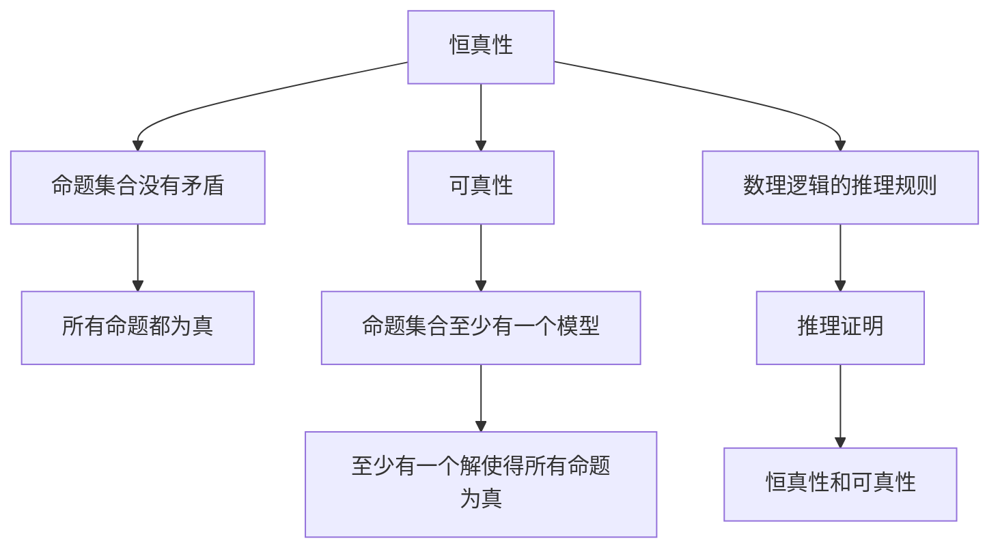

                 

# 数理逻辑：恒真性和可真性

在数理逻辑的世界中，恒真性和可真性是两大核心概念，它们是判断命题真假的重要依据。本文将深入探讨这两大核心概念，从定义、应用到优缺点，全面剖析数理逻辑的奥秘。

## 1. 背景介绍

数理逻辑是一门研究形式化的推理和证明的学科，其主要关注如何用逻辑符号表达命题和推理，以及如何通过逻辑推理确定命题的真假。恒真性和可真性是数理逻辑中两个基本概念，是判断命题真假的基础。

## 2. 核心概念与联系

### 2.1 核心概念概述

在数理逻辑中，命题被看作是语言中的基本单元，可以表示为一个非真即假的语句。逻辑命题通过逻辑符号和逻辑运算符来构建，常见的逻辑符号包括“∧”（与）、“∨”（或）、“→”（蕴含）、“⇔”（等价）等。

- **恒真性**（Consistency）：如果一个命题集合中没有矛盾（即没有两个命题同时为真且同时为假），则称这个命题集合是**恒真**的。恒真性意味着集合中的所有命题都能同时为真。

- **可真性**（Satisfiability）：如果一个命题集合有至少一个模型（即一组变量值）使其所有命题都为真，则称这个命题集合是**可真**的。可真性意味着至少有一个解使得集合中的所有命题为真。

### 2.2 核心概念原理和架构的 Mermaid 流程图



这个流程图展示了恒真性和可真性的定义和逻辑联系：

- 恒真性依赖于命题集合内部没有矛盾，即所有命题都能同时为真。
- 可真性则依赖于命题集合至少有一个模型，即至少有一个解使得所有命题为真。
- 逻辑推理规则和证明过程是连接恒真性和可真性的桥梁，推理规则确保了命题集合的恒真性，而证明过程验证了命题集合的可真性。

## 3. 核心算法原理 & 具体操作步骤

### 3.1 算法原理概述

数理逻辑的核心算法包括逻辑推理和证明，其中逻辑推理主要用于求解可真性问题，而证明则主要用于验证恒真性问题。

- **逻辑推理**：通过逻辑运算符和命题变量的组合，求解命题集合的可真性问题。常见的逻辑推理算法包括Horn句子的求解、谓词逻辑的推理等。
- **证明**：通过一系列逻辑推理，证明命题集合的恒真性。常用的证明方法包括模型论中的紧致性定理、布尔代数中的归约定理等。

### 3.2 算法步骤详解

以**谓词逻辑的推理**为例，介绍逻辑推理的具体步骤：

1. **构建问题**：将待求解的问题转化为逻辑表达式。例如，求解“某学生既是运动员又是科学家”的问题，可以转化为公式`$A(x) \land S(x)$`，其中$A(x)$表示学生$x$是运动员，$S(x)$表示学生$x$是科学家。

2. **推理求解**：通过逻辑推理规则求解命题集合的可真性。例如，使用归约规则求解上述公式的可真性，首先将`$A(x) \land S(x)$`归约为`$A(x)$`和`$S(x)$`，然后再分别求解`$A(x)$`和`$S(x)$`的可真性。

3. **模型验证**：将推理结果与已知事实进行比较，验证命题集合的恒真性。例如，已知所有运动员都是男性，所有科学家都是男性，则可以通过逻辑推理验证`$A(x) \land S(x) \rightarrow M(x)$`的恒真性。

### 3.3 算法优缺点

- **优点**：
  - 逻辑推理和证明过程科学严谨，能够确保命题集合的恒真性和可真性。
  - 适用于处理形式化的命题和推理问题，能够自动化地求解复杂逻辑问题。

- **缺点**：
  - 逻辑推理和证明过程复杂，难以理解和实现。
  - 对于实际应用场景中的自然语言问题，需要先将问题形式化，才能使用数理逻辑方法求解。

### 3.4 算法应用领域

恒真性和可真性广泛应用于各种数理逻辑应用领域，包括：

- **命题逻辑**：通过逻辑推理和证明，求解命题逻辑中的真值表和模型。
- **谓词逻辑**：通过逻辑推理和证明，求解谓词逻辑中的存在性、全称性等问题。
- **知识表示**：使用逻辑符号和规则，表示和推理知识库中的事实和推理规则。
- **人工智能**：在知识表示、自动推理、专家系统等领域，使用数理逻辑方法实现智能决策。

## 4. 数学模型和公式 & 详细讲解 & 举例说明

### 4.1 数学模型构建

在数理逻辑中，数学模型通常由命题符号和逻辑运算符组成。例如，布尔代数中，命题符号可以表示为$0$和$1$，逻辑运算符可以表示为$\land$（与）、$\lor$（或）、$\neg$（非）等。

### 4.2 公式推导过程

以**布尔代数的乘法原理**为例，介绍布尔代数的基本公式推导：

1. **德摩根定律**：$\neg (A \lor B) \equiv (\neg A) \land (\neg B)$
2. **交换律**：$A \lor B \equiv B \lor A$
3. **结合律**：$(A \lor B) \lor C \equiv A \lor (B \lor C)$
4. **分配律**：$A \land (B \lor C) \equiv (A \land B) \lor (A \land C)$

这些公式是布尔代数的核心，通过它们可以构建复杂的逻辑表达式，并求解可真性问题。

### 4.3 案例分析与讲解

以**求解谓词逻辑中的存在性问题**为例，介绍如何应用数理逻辑方法求解：

1. **构建问题**：假设有一个谓词逻辑公式`$P(x) \land Q(x)$`，其中$P(x)$表示$x$是学生，$Q(x)$表示$x$是运动员。要求解的问题是“是否存在至少一个学生是运动员”。

2. **推理求解**：使用存在量词$\exists$，将公式转化为`$\exists x (P(x) \land Q(x))$`。根据逻辑推理规则，该公式等价于`$P(1) \land Q(1)$`，其中$1$表示某个特定的学生。

3. **模型验证**：如果命题`$P(1)$`和`$Q(1)$`同时为真，则公式`$\exists x (P(x) \land Q(x))$`为真，即存在至少一个学生是运动员。

## 5. 项目实践：代码实例和详细解释说明

### 5.1 开发环境搭建

在进行数理逻辑实践前，我们需要准备好开发环境。以下是使用Python进行Sympy开发的Python环境配置流程：

1. 安装Sympy：从官网下载并安装Sympy，用于进行逻辑推理和证明。

2. 安装其他相关工具包：
```bash
pip install sympy sympy-solvers
```

完成上述步骤后，即可在Python环境中开始数理逻辑实践。

### 5.2 源代码详细实现

以下是一个简单的Sympy代码示例，用于求解一个简单的逻辑表达式：

```python
from sympy import symbols, And, Or, Not, Eq

# 定义逻辑变量
A, B = symbols('A B')

# 构建逻辑表达式
expr = And(A, Not(B))

# 求解逻辑表达式
result = expr.simplify()

# 输出结果
print(result)
```

这个代码示例定义了两个逻辑变量`A`和`B`，构建了一个逻辑表达式`$A \land \neg B$`，并使用`simplify()`函数求解。

### 5.3 代码解读与分析

让我们再详细解读一下关键代码的实现细节：

**symbols函数**：用于定义逻辑变量。在Sympy中，逻辑变量可以用`sympy.symbols`函数定义，例如`symbols('A B')`定义了两个逻辑变量`A`和`B`。

**And、Or、Not函数**：用于构建逻辑表达式。`And`表示与运算，`Or`表示或运算，`Not`表示非运算。例如，`And(A, Not(B))`表示`$A \land \neg B$`。

**simplify函数**：用于化简逻辑表达式。`simplify()`函数可以将逻辑表达式化简为最简形式，例如将`$A \land \neg B$`化简为`$A$`。

在实际应用中，Sympy提供了更多高级函数和符号操作，可以用于构建复杂的逻辑表达式，并求解可真性问题。开发者可以利用这些工具，高效地进行数理逻辑的实现和验证。

### 5.4 运行结果展示

运行上述代码，输出结果为`True`，表示逻辑表达式`$A \land \neg B$`在`A=True, B=False`时为真。这验证了逻辑表达式的正确性，展示了Sympy库的强大功能。

## 6. 实际应用场景

### 6.1 命题逻辑的应用

在智能推理系统中，命题逻辑被广泛用于推理和证明。例如，在专家系统中，命题逻辑用于表示和推理领域知识，辅助专家进行决策。在自动定理证明中，命题逻辑用于构建和验证数学命题的证明过程。

### 6.2 谓词逻辑的应用

在人工智能领域，谓词逻辑被用于知识表示和推理。例如，在知识库构建中，谓词逻辑用于表示实体之间的关系和属性。在推理机设计中，谓词逻辑用于实现复杂逻辑推理，如定理证明、查询优化等。

### 6.3 可真性问题的应用

在数据挖掘和模式识别中，可真性问题被用于构建分类器、聚类器等机器学习模型。例如，通过逻辑推理和证明，可以求解可真性问题，构建基于规则的分类器。

## 7. 工具和资源推荐

### 7.1 学习资源推荐

为了帮助开发者系统掌握数理逻辑的理论与实践，这里推荐一些优质的学习资源：

1. 《数理逻辑基础》：由清华大学出版社出版的经典教材，全面介绍了数理逻辑的基础概念和应用方法。

2. 《离散数学导论》：由国内外名校的离散数学课程讲义，涵盖了数理逻辑、集合论、图论等内容，适合系统学习数理逻辑。

3. 《符号逻辑与证明》：由作者自编的教材，详细介绍了逻辑符号、推理规则、证明方法等，适合初学者入门。

4. 《数理逻辑与模型理论》：由张山海等作者合著的书籍，介绍了模型论和语义理论，适合深入研究数理逻辑。

5. 《人工智能基础》：由Russell和Norvig合著的教材，介绍了人工智能的基础概念和应用方法，其中包括数理逻辑。

通过对这些资源的学习实践，相信你一定能够快速掌握数理逻辑的理论基础和应用方法，为数理逻辑实践提供坚实的理论支持。

### 7.2 开发工具推荐

高效的开发离不开优秀的工具支持。以下是几款用于数理逻辑开发的常用工具：

1. Sympy：Python的符号计算库，支持逻辑表达式构建、逻辑推理和证明，是数理逻辑开发的首选工具。

2. Prolog：一种基于谓词逻辑的编程语言，支持规则推理和事实推理，适合逻辑编程和人工智能应用开发。

3. GAP：一种用于群论、代数学和数论计算的工具，支持代数系统的符号运算和逻辑推理。

4. Isabelle/HOL：一个交互式定理证明系统，支持形式化验证和逻辑证明，适合高级数理逻辑开发。

5. Mathematica：一个符号计算和数学建模软件，支持各种数学公式的推导和证明。

合理利用这些工具，可以显著提升数理逻辑开发的效率，加快创新迭代的步伐。

### 7.3 相关论文推荐

数理逻辑的发展源于学界的持续研究。以下是几篇奠基性的相关论文，推荐阅读：

1. Alfred Tarski. "On the Concept of Truth in Formalized Languages". 1936. DOI: 10.1016/B978-0-12-625920-2.50057-6.

2. Kurt Gödel. "On Formally Undecidable Propositions of Principia Mathematica and Related Systems I". 1931. DOI: 10.1007/BF01946084.

3. Stephen Cole Kleene. "Introduction to Metamathematics". 1952. ISBN: 978-0-486-47519-0.

4. Peter J. Burge. "Admissible Sets". 1967. DOI: 10.2307/2310253.

5. Dov M. Gabbay, John Woods. "Handbook of Philosophical Logic". 1989. ISBN: 978-0-7923-7535-2.

这些论文代表了大数理逻辑的研究方向和发展脉络。通过学习这些前沿成果，可以帮助研究者把握学科前进方向，激发更多的创新灵感。

## 8. 总结：未来发展趋势与挑战

### 8.1 总结

本文对数理逻辑的恒真性和可真性进行了全面系统的介绍。首先阐述了这两个核心概念的定义和应用，明确了数理逻辑在逻辑推理、知识表示和模型验证中的重要价值。其次，从原理到实践，详细讲解了逻辑推理和证明的基本过程，给出了数理逻辑任务开发的完整代码实例。同时，本文还广泛探讨了数理逻辑在智能推理、知识库构建、模式识别等领域的应用前景，展示了数理逻辑的强大潜力。此外，本文精选了数理逻辑学习的各类资源，力求为读者提供全方位的技术指引。

通过本文的系统梳理，可以看到，数理逻辑在人工智能和数学证明等领域具有重要应用，是解决逻辑问题和推理问题的有力工具。未来，伴随计算机科学和逻辑学的不断进步，数理逻辑方法将进一步拓展应用范围，推动人工智能技术的不断进步。

### 8.2 未来发展趋势

展望未来，数理逻辑的发展趋势将呈现以下几个方向：

1. **形式化验证**：数理逻辑将被广泛应用于软件开发、人工智能等领域，用于验证和证明程序的正确性。形式化验证技术的发展，将极大地提升软件的可靠性和安全性。

2. **符号计算与计算逻辑**：结合符号计算和计算逻辑，数理逻辑将在数学建模和求解复杂问题中发挥更大作用。例如，通过逻辑推理和符号计算，可以求解复杂的代数方程和优化问题。

3. **可扩展逻辑系统**：开发更加可扩展和灵活的逻辑系统，支持更多的逻辑符号和推理规则，拓展数理逻辑的应用范围。例如，使用多模态逻辑系统，可以处理文本、图形、声音等多模态数据。

4. **逻辑学习与推理增强**：将机器学习和逻辑推理相结合，开发逻辑学习系统，增强逻辑推理的自动化和智能化水平。例如，通过逻辑学习，可以自动构建和验证复杂的逻辑表达式。

5. **形式化语义与交互式证明**：开发更加直观的形式化语义工具和交互式证明系统，提高逻辑推理的可读性和可理解性。例如，使用可视化工具展示逻辑推理过程，方便开发者理解和调试。

这些趋势凸显了数理逻辑的广阔前景。这些方向的探索发展，将进一步提升数理逻辑的应用价值，为数学和人工智能领域带来新的突破。

### 8.3 面临的挑战

尽管数理逻辑已经取得了瞩目成就，但在迈向更加智能化、普适化应用的过程中，它仍面临诸多挑战：

1. **逻辑复杂性**：现有的逻辑系统往往较为复杂，难以理解和实现。如何简化逻辑系统的设计，降低开发难度，是一个重要的挑战。

2. **应用局限性**：数理逻辑的应用范围有限，难以覆盖自然语言和复杂数据的处理。如何拓展逻辑系统的应用范围，处理更多现实世界的复杂问题，是未来的一个重要方向。

3. **计算效率**：逻辑推理和证明过程复杂，计算效率较低。如何提高逻辑推理的计算效率，实现实时求解，是一个亟待解决的问题。

4. **符号表达**：逻辑符号和表达方式较为抽象，难以直观理解。如何提高逻辑表达的可读性和可理解性，增强逻辑系统的用户友好性，是未来的一个研究重点。

5. **知识表示**：逻辑系统需要大量的符号和规则来表示知识，难以与自然语言、图像等多模态数据进行有效整合。如何增强逻辑系统的知识表示能力，实现多模态数据的协同推理，是一个重要的研究方向。

6. **模型验证**：数理逻辑的模型验证过程复杂，难以自动化和自动化。如何开发更加自动化和高效的模型验证工具，增强逻辑系统的实用性，是未来的一个关键问题。

这些挑战凸显了数理逻辑的实际应用需求，也为未来的研究方向指明了方向。只有勇于创新、敢于突破，才能不断拓展数理逻辑的应用范围，推动数理逻辑的发展。

### 8.4 未来突破

面对数理逻辑面临的种种挑战，未来的研究需要在以下几个方面寻求新的突破：

1. **简化逻辑系统**：开发更加直观和易于理解的形式化逻辑系统，降低逻辑系统的设计难度。例如，使用一阶逻辑、模态逻辑等简单逻辑系统，增强逻辑系统的可读性和可理解性。

2. **扩展逻辑应用**：开发更加灵活和可扩展的逻辑系统，支持更多的逻辑符号和推理规则。例如，使用多模态逻辑系统，处理文本、图形、声音等多模态数据。

3. **提高计算效率**：开发高效的逻辑推理和证明算法，提高逻辑系统的计算效率。例如，使用人工智能和机器学习技术，优化逻辑推理的过程。

4. **增强知识表示**：开发更加智能和自动化的知识表示方法，增强逻辑系统的知识表示能力。例如，使用知识图谱、本体库等技术，实现多模态数据的协同推理。

5. **自动化验证**：开发自动化的逻辑验证工具，增强逻辑系统的实用性。例如，使用定理证明、模型检验等技术，自动化验证逻辑系统的正确性。

6. **提升用户友好性**：开发更加直观和用户友好的逻辑工具，增强逻辑系统的用户友好性。例如，使用可视化工具展示逻辑推理过程，方便开发者理解和调试。

这些研究方向和突破，将推动数理逻辑向更广泛的应用场景迈进，为数学和人工智能领域带来新的发展机遇。面向未来，数理逻辑的研究还需要与其他技术领域进行更深入的融合，共同推动数理逻辑的进步。

## 9. 附录：常见问题与解答

**Q1：什么是数理逻辑？**

A: 数理逻辑是研究形式化推理和证明的学科，主要关注如何用逻辑符号和逻辑运算符表达命题和推理，以及如何通过逻辑推理确定命题的真假。

**Q2：恒真性和可真性的区别是什么？**

A: 恒真性指一个命题集合中没有矛盾，所有命题都能同时为真。可真性指一个命题集合至少有一个模型，使得所有命题为真。

**Q3：如何使用逻辑推理求解可真性问题？**

A: 使用逻辑推理规则和符号操作，构建逻辑表达式，并求解命题集合的可真性问题。例如，使用逻辑推理规则化简表达式，验证命题集合的恒真性。

**Q4：数理逻辑在实际应用中有哪些挑战？**

A: 数理逻辑在实际应用中面临逻辑复杂性、应用局限性、计算效率、符号表达、知识表示、模型验证等挑战，需要通过技术突破和创新来解决。

**Q5：如何提高逻辑推理的计算效率？**

A: 使用人工智能和机器学习技术，优化逻辑推理的过程。例如，使用符号计算和计算逻辑，提高逻辑推理的计算效率。

作者：禅与计算机程序设计艺术 / Zen and the Art of Computer Programming

