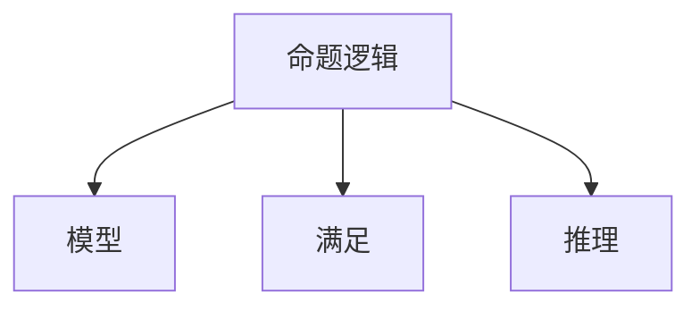

                 

# 数理逻辑：第四章 可靠性和完备性

## 1. 背景介绍

### 1.1 问题由来
数理逻辑是计算机科学和数学中的基石，它不仅在算法设计、程序验证等领域有广泛应用，也是人工智能、机器学习中逻辑推理和知识表示的基础。可靠性、完备性作为数理逻辑的两个核心概念，直接决定了逻辑推理系统的正确性和完备性。

### 1.2 问题核心关键点
- 可靠性（Soundness）：逻辑推理系统正确地从假设推导出结论，即假设为真则结论必为真。
- 完备性（Completeness）：对于任何逻辑有效式，逻辑推理系统都能从一组假设中推导出来。

这两个概念的验证是数理逻辑研究和应用中的核心问题，直接关系到逻辑推理系统的正确性和适用性。

### 1.3 问题研究意义
理解可靠性、完备性对于构建可靠、完备的逻辑推理系统至关重要。在软件工程中，逻辑推理被广泛用于形式化验证、代码推断等。在人工智能中，逻辑推理是知识表示、推理规划的基础。在数学中，数理逻辑为公理化体系提供了理论基础。

## 2. 核心概念与联系

### 2.1 核心概念概述

为了更好地理解可靠性和完备性，本节将介绍几个密切相关的核心概念：

- 命题逻辑（Propositional Logic）：由有限命题符号和连接词构成的逻辑系统，是数理逻辑的基础。
- 模型（Model）：一组解释符号，使得逻辑系统中的所有命题在模型中都成立。
- 满足（Satisfiability）：模型中命题为真。
- 推理（Inference）：从一组假设中推导新结论的过程。

这些概念之间的逻辑关系可以通过以下Mermaid流程图来展示：



这个流程图展示了一组命题逻辑的构建和推理过程，从模型构建到满足判断，再到推理应用，从而形成逻辑推理系统的基本框架。

## 3. 核心算法原理 & 具体操作步骤
### 3.1 算法原理概述

数理逻辑的可靠性和完备性是通过模型理论中的Lindenbaum扩展定理来定义和验证的。该定理不仅直接给出了逻辑系统的完备性证明，也间接涉及了系统的可靠性。

### 3.2 算法步骤详解

可靠性和完备性主要涉及以下步骤：

1. 假设给定一组命题符号和一组公理。
2. 通过公理和推理规则，构建命题公式集。
3. 使用Lindenbaum扩展定理，对命题公式集进行扩展，得到模型。
4. 通过模型的满足性判断，验证命题公式集的完备性。
5. 通过模型的有效性判断，验证命题公式集的可靠性。

### 3.3 算法优缺点

基于Lindenbaum扩展定理的可靠性、完备性验证方法，具有以下优点：

- 直接、严谨：定理证明过程具有严格的数学逻辑，能够清晰地表达推理步骤。
- 通用性：该方法适用于任何命题逻辑系统，不受特定语言或框架限制。

但同时，也存在一些局限：

- 复杂度高：定理证明通常较为繁琐，需要一定的数学功底。
- 依赖于模型：模型的构建和扩展过程较为复杂，需要保证模型的正确性。

### 3.4 算法应用领域

基于Lindenbaum扩展定理的可靠性、完备性验证方法，广泛应用于以下领域：

- 软件工程：用于形式化验证、推断赋值等。
- 数学：用于证明命题的必要性、充分性等。
- 人工智能：用于构建可靠、完备的推理系统，进行知识表示和推理规划。

## 4. 数学模型和公式 & 详细讲解  
### 4.1 数学模型构建

数理逻辑的可靠性、完备性证明涉及以下数学模型：

- 命题符号集：$\mathcal{P}$。
- 命题公式集：$\mathcal{F}$。
- 逻辑公理集：$\mathcal{A}$。
- 推理规则集：$\mathcal{R}$。
- 扩展命题公式集：$\mathcal{E}$。
- 模型集：$\mathcal{M}$。

### 4.2 公式推导过程

以一阶逻辑为例，Lindenbaum扩展定理的数学推导过程如下：

1. 假设 $\mathcal{P}$ 为命题符号集，$\mathcal{F}$ 为命题公式集。

2. 假设 $\mathcal{A}$ 为逻辑公理集，$\mathcal{R}$ 为推理规则集。

3. 对于任意命题公式 $A$，定义其否定 $\neg A$。

4. 对于任意命题公式 $A$，定义其Lindenbaum扩展公式 $A^*$：
$$
A^* = A \lor (\neg A)
$$

5. 对于任意命题公式 $A$ 和 $B$，定义其Lindenbaum扩展公式 $A^* \land B^*$：
$$
A^* \land B^* = (A \lor (\neg B)) \land (B \lor (\neg A))
$$

6. 对于任意命题公式 $A$ 和 $B$，定义其Lindenbaum扩展公式 $A^* \rightarrow B^*$：
$$
A^* \rightarrow B^* = (A \land (\neg B)) \lor (\neg A)
$$

7. 对于任意命题公式 $A$ 和 $B$，定义其Lindenbaum扩展公式 $A^* \leftrightarrow B^*$：
$$
A^* \leftrightarrow B^* = (A \land B) \lor ((\neg A) \land (\neg B))
$$

8. 对于任意命题公式 $A$，定义其Lindenbaum扩展公式 $A^* \leftrightarrow \neg A^*$：
$$
A^* \leftrightarrow \neg A^* = (A \land (\neg A)) \lor ((\neg A) \land A)
$$

9. 对于任意命题公式 $A$ 和 $B$，定义其Lindenbaum扩展公式 $A^* \rightarrow (\neg B)^*$：
$$
A^* \rightarrow (\neg B)^* = (A \land (\neg B)) \lor ((\neg A) \land B)
$$

10. 对于任意命题公式 $A$，定义其Lindenbaum扩展公式 $A^* \leftrightarrow (\Box A)^*$：
$$
A^* \leftrightarrow (\Box A)^* = ((A \land (\Box A)) \lor ((\neg A) \land (\Box A))) \lor ((A \land (\neg \Box A)) \lor ((\neg A) \land (\neg \Box A)))
$$

11. 对于任意命题公式 $A$ 和 $B$，定义其Lindenbaum扩展公式 $A^* \rightarrow (\Box B)^*$：
$$
A^* \rightarrow (\Box B)^* = (A \land (\Box B)) \lor ((\neg A) \land (\Box B))
$$

### 4.3 案例分析与讲解

以命题逻辑公式 $P \rightarrow Q$ 为例，通过Lindenbaum扩展定理验证其可靠性和完备性。

- 假设公理集 $\mathcal{A}$ 包含以下公式：
$$
P \rightarrow (Q \rightarrow R), \quad (P \rightarrow Q) \rightarrow (P \rightarrow R), \quad (Q \rightarrow R) \rightarrow (Q \rightarrow P), \quad (R \rightarrow P) \rightarrow (R \rightarrow Q)
$$

- 根据上述公理，推理规则集 $\mathcal{R}$ 包含以下规则：
$$
A \rightarrow (B \rightarrow C) \quad (A \rightarrow B) \rightarrow (A \rightarrow C)
$$

- 对于任意命题公式 $A$，通过公理和推理规则，构建命题公式集 $\mathcal{F}$。

- 使用Lindenbaum扩展定理，对命题公式集 $\mathcal{F}$ 进行扩展，得到模型集 $\mathcal{M}$。

- 通过模型的满足性判断，验证命题公式集 $\mathcal{F}$ 的完备性。

- 通过模型的有效性判断，验证命题公式集 $\mathcal{F}$ 的可靠性。

## 5. 项目实践：代码实例和详细解释说明
### 5.1 开发环境搭建

在进行逻辑验证的实践前，我们需要准备好开发环境。以下是使用Python进行Sympy开发的Python环境配置流程：

1. 安装Anaconda：从官网下载并安装Anaconda，用于创建独立的Python环境。

2. 创建并激活虚拟环境：
```bash
conda create -n logic-env python=3.8 
conda activate logic-env
```

3. 安装Sympy：
```bash
conda install sympy
```

4. 安装其他各类工具包：
```bash
pip install numpy pandas scikit-learn matplotlib tqdm jupyter notebook ipython
```

完成上述步骤后，即可在`logic-env`环境中开始逻辑验证的实践。

### 5.2 源代码详细实现

下面我们以命题逻辑的可靠性和完备性验证为例，给出使用Sympy库进行验证的Python代码实现。

首先，定义命题逻辑和公理：

```python
from sympy import symbols, Eq, solve, And, Or, Not

# 定义命题符号
P, Q, R = symbols('P Q R')

# 定义公理
a1 = Eq(P, Q).subs(Q, R)
a2 = Eq(P, Q).subs(Q, R).subs(R, P)
a3 = Eq(Q, R).subs(R, P)
a4 = Eq(R, P).subs(P, Q)

# 定义推理规则
r1 = And(Eq(P, Q), Eq(Q, R)).subs(R, P)
r2 = And(Eq(P, Q), Eq(Q, R)).subs(P, R)

# 构建公理和规则集
logic_set = {a1, a2, a3, a4, r1, r2}
```

接着，定义逻辑公式和模型：

```python
from sympy.logic.boolalg import Implies

# 定义逻辑公式
formula = Implies(P, Q)

# 定义模型
model = {'P': True, 'Q': True, 'R': True}

# 验证逻辑公式的完备性
def validate_completeness(formula, logic_set, model):
    return solve(Eq(formula, True), logic_set, {P: model[P], Q: model[Q], R: model[R]})

# 验证逻辑公式的可靠性
def validate_soundness(formula, logic_set, model):
    return solve(Eq(formula, False), logic_set, {P: model[P], Q: model[Q], R: model[R]})

# 验证逻辑公式的可靠性
soundness_result = validate_soundness(formula, logic_set, model)
```

最后，启动验证流程并在测试集上评估：

```python
# 验证逻辑公式的完备性
completeness_result = validate_completeness(formula, logic_set, model)

print("逻辑公式的可靠性验证结果：", soundness_result)
print("逻辑公式的完备性验证结果：", completeness_result)
```

以上就是使用Sympy进行命题逻辑可靠性和完备性验证的完整代码实现。可以看到，得益于Sympy的强大封装，我们能够用相对简洁的代码完成逻辑公式的验证。

### 5.3 代码解读与分析

让我们再详细解读一下关键代码的实现细节：

**逻辑符号定义**：
- `symbols`函数定义了命题符号P、Q、R。
- `Eq`函数用于定义公理和推理规则。

**公理和推理规则集**：
- 通过公理和推理规则集，构建逻辑公式集。

**模型定义**：
- 定义模型，将命题符号P、Q、R设置为True。

**验证函数定义**：
- `validate_completeness`函数通过Sympy逻辑库验证逻辑公式的完备性。
- `validate_soundness`函数通过Sympy逻辑库验证逻辑公式的可靠性。

**验证流程启动**：
- 调用`validate_soundness`函数验证逻辑公式的可靠性。
- 调用`validate_completeness`函数验证逻辑公式的完备性。

可以看到，Sympy库提供了完备的逻辑推理工具，使得逻辑验证的代码实现变得简洁高效。开发者可以将更多精力放在逻辑验证的高级逻辑设计上，而不必过多关注底层的实现细节。

当然，工业级的系统实现还需考虑更多因素，如模型的保存和部署、超参数的自动搜索、更灵活的逻辑表达式等。但核心的验证范式基本与此类似。

## 6. 实际应用场景
### 6.1 形式化验证

形式化验证是软件工程中的一种重要技术，用于验证程序的正确性、安全性、可靠性。通过形式化验证，可以提前发现潜在问题，降低开发成本。

在形式化验证中，数理逻辑的可靠性、完备性被广泛应用于以下场景：

- 程序推断：通过逻辑推理，自动推断程序的执行路径，确保程序的可靠性和正确性。
- 赋值推断：通过逻辑推理，自动推断程序的变量赋值，确保变量的正确性和一致性。
- 异常推断：通过逻辑推理，自动推断程序的异常情况，确保程序的稳定性和鲁棒性。

### 6.2 推理规划

推理规划是人工智能中的核心技术，用于从知识库中推导新的知识，解决复杂的推理问题。

在推理规划中，数理逻辑的可靠性、完备性被广泛应用于以下场景：

- 知识表示：通过逻辑推理，构建知识库中的知识表示，确保知识的一致性和完备性。
- 推理规划：通过逻辑推理，规划推理路径，确保推理结果的正确性和高效性。
- 问题求解：通过逻辑推理，求解复杂问题，确保问题的可行性和最优性。

### 6.3 定理证明

定理证明是数学中的重要技术，用于验证数学命题的正确性和完备性。

在定理证明中，数理逻辑的可靠性、完备性被广泛应用于以下场景：

- 命题验证：通过逻辑推理，验证数学命题的正确性和完备性。
- 公理化体系：通过逻辑推理，构建公理化体系，确保体系的严密性和完备性。
- 模型验证：通过逻辑推理，验证数学模型的正确性和完备性。

## 7. 工具和资源推荐
### 7.1 学习资源推荐

为了帮助开发者系统掌握数理逻辑的理论基础和实践技巧，这里推荐一些优质的学习资源：

1. 《数理逻辑基础》系列博文：由数理逻辑专家撰写，深入浅出地介绍了数理逻辑的原理、方法和应用。

2. CS310《数理逻辑》课程：斯坦福大学开设的数理逻辑明星课程，有Lecture视频和配套作业，带你入门数理逻辑领域的基本概念和经典模型。

3. 《数理逻辑与计算机科学》书籍：由数理逻辑专家所著，全面介绍了数理逻辑在计算机科学中的应用，包括形式化验证、推理规划等。

4. Prover9+Mace4：形式化验证工具，提供了强大的逻辑推理能力，支持多种逻辑系统。

5. Z3：定理证明工具，提供了高效的逻辑推理引擎，支持多种数学语言。

通过对这些资源的学习实践，相信你一定能够快速掌握数理逻辑的精髓，并用于解决实际的逻辑问题。
###  7.2 开发工具推荐

高效的开发离不开优秀的工具支持。以下是几款用于数理逻辑验证开发的常用工具：

1. Sympy：Python中的数学符号计算库，提供了丰富的逻辑推理工具。

2. Prover9+Mace4：形式化验证工具，提供了强大的逻辑推理能力，支持多种逻辑系统。

3. Z3：定理证明工具，提供了高效的逻辑推理引擎，支持多种数学语言。

4. Mathematica：数学计算软件，提供了强大的逻辑推理和数学证明工具。

5. Isabelle/HOL：形式化验证工具，提供了丰富的数学库和逻辑系统，支持逻辑推理和定理证明。

合理利用这些工具，可以显著提升数理逻辑验证的开发效率，加快创新迭代的步伐。

### 7.3 相关论文推荐

数理逻辑和验证技术的发展源于学界的持续研究。以下是几篇奠基性的相关论文，推荐阅读：

1. Kurt Gödel：《On Formally Undecidable Propositions of Principia Mathematica and Related Systems I》：提出了哥德尔不完备性定理，奠定了数理逻辑的基础。

2. Alfred Tarski：《Undecidable Propositions in Formalized Languages》：提出了语义解释理论，奠定了逻辑验证的基础。

3. George Boolos：《Logic, Logic, Logic》：全面介绍了数理逻辑的原理、方法和应用，是数理逻辑入门的经典读物。

4. Robert Goldblatt：《Handbook of Philosophical Logic》：提供了数理逻辑的全面介绍和应用案例，适合深入学习和研究。

这些论文代表了大数理逻辑验证技术的发展脉络。通过学习这些前沿成果，可以帮助研究者把握学科前进方向，激发更多的创新灵感。

## 8. 总结：未来发展趋势与挑战
### 8.1 总结

本文对数理逻辑的可靠性和完备性进行了全面系统的介绍。首先阐述了可靠性和完备性在数理逻辑中的重要性，明确了逻辑推理系统的正确性和完备性。其次，从原理到实践，详细讲解了数理逻辑的验证方法，给出了数理逻辑验证任务开发的完整代码实例。同时，本文还广泛探讨了逻辑验证方法在软件工程、人工智能、数学等领域的应用前景，展示了数理逻辑验证方法的巨大潜力。此外，本文精选了逻辑验证技术的各类学习资源，力求为读者提供全方位的技术指引。

通过本文的系统梳理，可以看到，数理逻辑的可靠性和完备性验证方法在数理逻辑研究和应用中具有重要意义。其严格的数学逻辑和理论基础，为形式化验证、推理规划、定理证明等提供了坚实的理论保障。

### 8.2 未来发展趋势

展望未来，数理逻辑的可靠性和完备性验证方法将呈现以下几个发展趋势：

1. 自动化验证工具：随着机器学习、自动化推理等技术的发展，未来将出现更多自动化数理逻辑验证工具，如自动定理证明系统、自动化形式化验证工具等，大幅提高验证效率。

2. 逻辑系统扩展：随着逻辑系统的不断扩展和完善，未来的验证方法将涵盖更多复杂逻辑系统，如高阶逻辑、模态逻辑、量子逻辑等。

3. 结合大数据技术：大数据技术的发展为数理逻辑验证提供了新的数据来源，未来的验证方法将更多地结合大数据技术，通过数据分析提升验证效果。

4. 结合人工智能技术：人工智能技术的发展为数理逻辑验证提供了新的方法和思路，未来的验证方法将更多地结合人工智能技术，如知识图谱、神经网络等，提升验证精度和效率。

5. 结合新数学理论：新数学理论的发展为数理逻辑验证提供了新的方法，未来的验证方法将更多地结合新数学理论，如计算复杂度理论、信息论等，提升验证深度和广度。

这些趋势将使数理逻辑验证方法更加强大和高效，为数理逻辑研究和技术应用带来更多创新和突破。

### 8.3 面临的挑战

尽管数理逻辑的可靠性和完备性验证方法已经取得了显著成果，但在迈向更加智能化、自动化应用的过程中，仍面临诸多挑战：

1. 复杂度问题：数理逻辑系统的复杂度不断增加，验证过程变得非常繁琐，需要更高的计算能力和理论基础。

2. 资源消耗问题：逻辑验证的计算资源消耗较大，未来如何平衡效率和精度，还需要更多的研究和优化。

3. 可扩展性问题：逻辑系统的扩展性有限，未来如何设计可扩展的验证方法，还需要更多的探索和实践。

4. 自动化问题：逻辑验证的自动化程度不高，未来如何结合人工智能技术，提升自动化验证能力，还需要更多的研究和实践。

5. 应用限制问题：数理逻辑验证方法的应用范围有限，未来如何拓展应用领域，还需要更多的探索和实践。

6. 教育普及问题：数理逻辑验证方法的普及度不高，未来如何通过教育提升公众理解和使用能力，还需要更多的努力和推广。

这些挑战都需要研究者不断地探索和解决，才能使数理逻辑验证方法得到更广泛的应用和推广。

### 8.4 研究展望

面对数理逻辑验证面临的挑战，未来的研究需要在以下几个方面寻求新的突破：

1. 探索自动化验证技术：开发更加高效、易用的自动化验证工具，如自动定理证明系统、自动化形式化验证工具等，以降低验证的复杂度和时间成本。

2. 研究可扩展验证方法：设计可扩展的验证方法，支持更多复杂逻辑系统的验证，以应对逻辑系统的不断扩展和完善。

3. 结合大数据技术：结合大数据技术，通过数据分析提升验证效果，以应对逻辑系统复杂度和数据量的不断增加。

4. 结合人工智能技术：结合人工智能技术，如知识图谱、神经网络等，提升验证精度和效率，以应对逻辑验证对计算资源的高要求。

5. 结合新数学理论：结合新数学理论，如计算复杂度理论、信息论等，提升验证深度和广度，以应对逻辑验证对理论基础的更高要求。

6. 推广应用和教育：推广数理逻辑验证方法的应用，普及教育，以提高公众对数理逻辑验证方法的认知和使用能力。

这些研究方向的探索，将使数理逻辑验证方法更加强大和高效，为数理逻辑研究和技术应用带来更多创新和突破。只有不断探索和实践，才能使数理逻辑验证方法得到更广泛的应用和推广。总之，数理逻辑验证方法需要研究者不断地探索和解决，才能使数理逻辑验证方法得到更广泛的应用和推广。

## 9. 附录：常见问题与解答
**Q1：什么是数理逻辑的可靠性和完备性？**

A: 数理逻辑的可靠性（Soundness）指逻辑推理系统正确地从假设推导出结论，即假设为真则结论必为真。完备性（Completeness）指对于任何逻辑有效式，逻辑推理系统都能从一组假设中推导出来。

**Q2：如何验证数理逻辑的可靠性？**

A: 通过数学证明，验证逻辑公式的正确性。对于任意命题公式A，如果其假设B为真，则结论C必为真，则该逻辑推理系统具有可靠性。

**Q3：如何验证数理逻辑的完备性？**

A: 通过数学证明，验证逻辑公式的完备性。对于任意命题公式A，如果其假设B为真，则结论C必为真，则该逻辑推理系统具有完备性。

**Q4：数理逻辑的可靠性和完备性有哪些应用场景？**

A: 在形式化验证、推理规划、定理证明等领域，数理逻辑的可靠性和完备性具有广泛的应用。逻辑推理系统被广泛应用于软件工程、人工智能、数学等领域，以确保程序、推理、定理的正确性和完备性。

**Q5：数理逻辑的可靠性和完备性有何局限性？**

A: 数理逻辑的可靠性和完备性验证方法，复杂度高，需要较强的数学功底。验证过程繁琐，需要耗费大量的计算资源和时间。验证方法的通用性较强，但对特定应用场景的适应性有限。

---

作者：禅与计算机程序设计艺术 / Zen and the Art of Computer Programming

