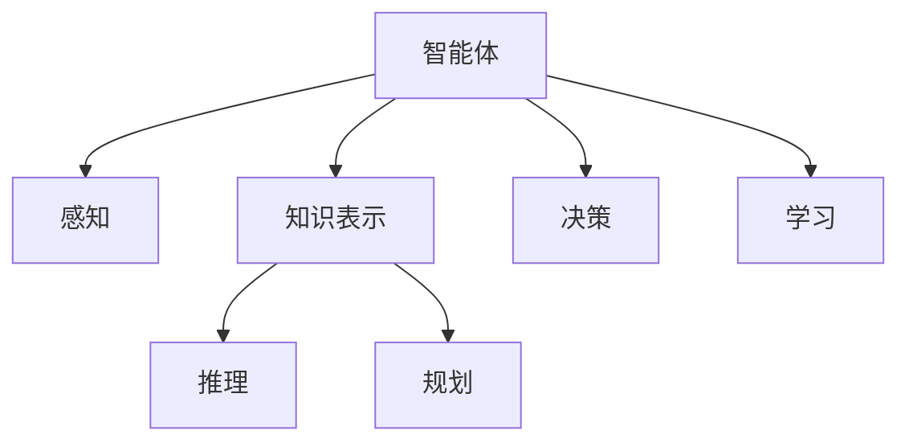

                 

## 1. 背景介绍

### 1.1 问题由来
随着人工智能技术的飞速发展，智能体的概念逐渐成为了一个热门话题。智能体（Agent）在计算机科学、人工智能、认知科学、社会学等多个领域都有广泛的应用。特别是在多智能体系统中，智能体作为一种具有自主行为和决策能力的实体，扮演着越来越重要的角色。智能体通过感知环境、理解规则和目标，进行自主决策和行动，是实现复杂系统协同工作的关键组件。

智能体技术的兴起可以追溯到上个世纪70年代的符号主义AI时代，当时的AI研究集中于基于规则和知识库的推理和决策系统。随着机器学习、深度学习等技术的兴起，智能体研究逐渐转向基于数据驱动的方法，使得智能体能够更好地适应复杂、动态的环境。

智能体在自动驾驶、机器人控制、虚拟助手、推荐系统等领域都有重要的应用。以自动驾驶为例，自动驾驶汽车通过感知周围环境、理解交通规则，进行决策和控制，最终完成自动驾驶任务。智能体技术的发展，使得自动驾驶从最初的感知、决策分离的模式，逐渐向统一的决策体系转变，提升了驾驶的安全性和舒适性。

### 1.2 问题核心关键点
智能体的核心在于其自主决策和行为能力。智能体通过感知环境、处理信息、制定策略和执行行动，最终实现目标。智能体与环境之间不断交互，不断优化决策过程，是复杂系统自动化的关键所在。

智能体研究的核心关键点包括：
1. 感知和感知建模：智能体需要能够感知环境的状态，通过传感器或数据源获取相关信息。感知建模指的是将传感器数据转换为智能体可以理解的形式。
2. 知识表示和推理：智能体需要能够存储和处理知识，进行推理和决策。知识表示指的是如何将知识结构化和形式化，推理指的是如何利用知识进行判断和预测。
3. 行为规划和决策：智能体需要制定策略和规划行为，决策指的是如何根据当前状态和目标，选择最合适的行动。
4. 学习和适应：智能体需要能够根据新数据和新环境，不断更新和优化自己的模型和策略。

## 2. 核心概念与联系

### 2.1 核心概念概述

为了更好地理解智能体，本节将介绍几个密切相关的核心概念：

- 智能体（Agent）：具有自主行为和决策能力的实体，能够在环境中感知、推理和行动。
- 感知（Perception）：智能体通过传感器或数据源获取环境信息的过程。
- 知识表示（Knowledge Representation）：将知识结构化和形式化的过程，包括符号表示、逻辑表示、向量表示等。
- 推理（Reasoning）：利用知识进行判断和预测的过程，包括演绎推理、归纳推理、因果推理等。
- 规划（Planning）：制定策略和规划行为的过程，包括动作规划、路径规划、资源分配等。
- 决策（Decision-making）：根据当前状态和目标，选择最合适的行动的过程，包括最大化效用、最小化代价等。
- 学习（Learning）：智能体根据新数据和新环境，不断更新和优化自己的模型和策略的过程。

这些核心概念之间的逻辑关系可以通过以下Mermaid流程图来展示：



这个流程图展示智能体的核心概念及其之间的关系：

1. 智能体通过感知获取环境信息。
2. 利用知识表示存储和处理知识，进行推理和决策。
3. 制定策略和规划行为。
4. 根据环境反馈，不断优化模型和策略。

## 3. 核心算法原理 & 具体操作步骤

### 3.1 算法原理概述

智能体的核心算法原理是通过感知-推理-决策-行动的闭环，实现环境与智能体之间的互动。智能体通过感知环境获取状态，利用知识表示和推理，制定策略和规划行动，最终执行行动并获取反馈，再次进入下一轮循环。

### 3.2 算法步骤详解

智能体的核心操作步骤包括感知、推理、决策和行动，具体步骤如下：

**Step 1: 感知（Perception）**
- 通过传感器或数据源获取环境信息，如摄像头图像、激光雷达数据、GPS定位等。
- 将感知数据转换为智能体可以理解的形式，如将摄像头图像转换为特征向量。

**Step 2: 推理（Reasoning）**
- 利用知识表示结构化处理感知数据，进行推理和判断。
- 常用的推理方法包括规则推理、贝叶斯网络、符号推理等。

**Step 3: 决策（Decision-making）**
- 根据当前状态和目标，制定策略和规划行动。
- 常用的决策方法包括强化学习、博弈论、价值函数等。

**Step 4: 行动（Action）**
- 执行制定好的行动，对环境产生影响。
- 根据行动的执行结果，获取环境反馈，进入下一轮循环。

### 3.3 算法优缺点

智能体的优点包括：
1. 自主决策：智能体具有自主决策和行为能力，能够适应复杂、动态的环境。
2. 可扩展性：智能体可以动态调整模型和策略，适应不同的任务和场景。
3. 鲁棒性：智能体能够通过不断的学习，提升模型的鲁棒性和泛化能力。

智能体的缺点包括：
1. 复杂性：智能体的设计和实现相对复杂，需要丰富的领域知识和算法支持。
2. 数据需求：智能体需要大量的感知数据和标注数据，数据获取成本较高。
3. 可解释性：智能体的决策过程往往缺乏可解释性，难以进行调试和优化。

### 3.4 算法应用领域

智能体在多个领域都有广泛的应用，包括：

- 自动驾驶：自动驾驶汽车通过感知道路、车辆、行人等信息，进行决策和控制。
- 机器人控制：工业机器人、服务机器人等通过感知环境，进行路径规划和动作执行。
- 虚拟助手：如Siri、Alexa等通过感知语音和文本输入，进行自然语言理解并回答用户问题。
- 推荐系统：如电商推荐、新闻推荐等通过感知用户行为和偏好，进行推荐策略优化。
- 金融预测：金融分析师通过感知市场数据，进行投资决策和风险评估。
- 医疗诊断：医疗系统通过感知患者数据，进行疾病诊断和治疗方案制定。

智能体的应用领域不断扩展，未来有望在更多领域发挥重要作用。

## 4. 数学模型和公式 & 详细讲解 & 举例说明

### 4.1 数学模型构建

本节将使用数学语言对智能体的感知、推理、决策和行动过程进行更加严格的刻画。

假设智能体感知到的环境状态为 $s_t$，通过传感器获取的感知数据为 $x_t$。智能体的知识表示为 $k$，推理过程为 $r$，决策过程为 $d$，行动过程为 $a$，环境反馈为 $f$。智能体的决策目标为最大化某种效用函数 $U$。

智能体的核心数学模型包括：

- 感知模型：$x_t = f_s(s_t)$
- 推理模型：$k = r(x_t)$
- 决策模型：$a = d(k, s_t)$
- 行动模型：$s_{t+1} = f_a(s_t, a)$
- 效用模型：$U = U(s_t, a, k)$

其中，$s_t$ 表示智能体在时间 $t$ 的状态，$a$ 表示智能体在时间 $t$ 的动作，$s_{t+1}$ 表示智能体在时间 $t+1$ 的状态，$f_s$ 表示感知模型，$f_a$ 表示行动模型，$r$ 表示推理模型，$d$ 表示决策模型，$f$ 表示环境反馈模型，$U$ 表示效用函数。

### 4.2 公式推导过程

以最简单的强化学习（Reinforcement Learning）算法为例，推导智能体的核心决策过程。

强化学习是一种常用的智能体决策算法，其目标是在最大化长期奖励的基础上，进行策略优化。强化学习的核心公式为贝尔曼方程（Bellman Equation）：

$$
V(s) = \max_a \sum_{s'} P(s'|s,a) [R(s,a,s') + \gamma V(s')]
$$

其中，$V(s)$ 表示状态 $s$ 的长期期望奖励，$R(s,a,s')$ 表示在状态 $s$ 下执行动作 $a$ 到状态 $s'$ 的即时奖励，$P(s'|s,a)$ 表示在状态 $s$ 下执行动作 $a$ 到达状态 $s'$ 的概率，$\gamma$ 表示折扣因子，用于计算未来奖励的权重。

通过迭代求解贝尔曼方程，可以求出最优策略 $a^*$：

$$
a^*(s) = \arg\max_a \sum_{s'} P(s'|s,a) [R(s,a,s') + \gamma V^*(s')]
$$

其中，$V^*$ 表示最优策略下的状态价值函数。

### 4.3 案例分析与讲解

以自动驾驶为例，分析智能体的决策过程。

自动驾驶汽车通过感知周围环境、理解交通规则，进行决策和控制。假设智能体的感知模型为摄像头、激光雷达和GPS，推理模型为计算机视觉和地图匹配，决策模型为强化学习，行动模型为转向和加速控制。

智能体的核心决策过程包括：

1. 感知：通过摄像头、激光雷达和GPS获取周围环境信息，包括道路、车辆、行人等信息。
2. 推理：利用计算机视觉和地图匹配技术，将感知数据转换为结构化信息，进行路线规划和路径选择。
3. 决策：通过强化学习算法，制定最优驾驶策略，包括速度控制、车道选择等。
4. 行动：根据决策结果，执行转向和加速控制，对车辆进行精确控制。

## 5. 项目实践：代码实例和详细解释说明

### 5.1 开发环境搭建

在进行智能体开发前，我们需要准备好开发环境。以下是使用Python进行强化学习开发的环境配置流程：

1. 安装Anaconda：从官网下载并安装Anaconda，用于创建独立的Python环境。

2. 创建并激活虚拟环境：
```bash
conda create -n reinforcement-env python=3.8 
conda activate reinforcement-env
```

3. 安装PyTorch：基于Python的开源深度学习框架，用于计算和优化神经网络模型。
```bash
conda install pytorch torchvision torchaudio cudatoolkit=11.1 -c pytorch -c conda-forge
```

4. 安装Gym：Gym是一个通用的环境模拟库，用于测试和调试强化学习算法。
```bash
pip install gym
```

5. 安装PyTorch的Reinforcement Learning模块：
```bash
pip install torch
```

完成上述步骤后，即可在`reinforcement-env`环境中开始智能体开发。

### 5.2 源代码详细实现

下面以Q-learning算法为例，给出使用PyTorch实现智能体的代码实现。

首先，定义智能体的状态、动作、奖励和环境：

```python
import torch
import gym

class Agent:
    def __init__(self, env):
        self.env = env
        self.state_size = self.env.observation_space.shape[0]
        self.action_size = self.env.action_space.n
        self.learning_rate = 0.01
        self.memory = []
        self.gamma = 0.95
        self.epsilon = 0.1
        self.epsilon_decay = 0.995
        self.epsilon_min = 0.01
        self.model = self._build_model()

    def _build_model(self):
        model = torch.nn.Sequential(
            torch.nn.Linear(self.state_size, 128),
            torch.nn.ReLU(),
            torch.nn.Linear(128, self.action_size)
        )
        return model

    def act(self, state):
        if np.random.rand() <= self.epsilon:
            return self.env.action_space.sample()
        else:
            state = torch.from_numpy(state).float()
            with torch.no_grad():
                action_values = self.model(state)
            return torch.argmax(action_values).item()

    def step(self, state, action, reward, next_state, done):
        self.memory.append((state, action, reward, next_state, done))
        if len(self.memory) > 2000:
            self.memory.pop(0)
        self.learn()

    def learn(self):
        if len(self.memory) < 1:
            return
        memories = random.sample(self.memory, min(64, len(self.memory)))
        for memory in memories:
            state, action, reward, next_state, done = memory
            if not done:
                target = reward + self.gamma * self.model(torch.from_numpy(next_state)).max().item()
            else:
                target = reward
            target_f = self.model(torch.from_numpy(state)).max().item()
            self.model(torch.from_numpy(state)).zero_()
            self.model(torch.from_numpy(state)).backward(target - target_f)
            self.model(torch.from_numpy(state)).zero_()
```

然后，定义训练和评估函数：

```python
import numpy as np
from collections import deque

def train(env, agent, episodes=200):
    for i in range(episodes):
        state = env.reset()
        state = np.reshape(state, [1, state_size])
        done = False
        i = 0
        while not done:
            action = agent.act(state)
            next_state, reward, done, _ = env.step(action)
            next_state = np.reshape(next_state, [1, state_size])
            agent.step(state, action, reward, next_state, done)
            state = next_state
            i += 1

def evaluate(env, agent, episodes=1000):
    state = env.reset()
    state = np.reshape(state, [1, state_size])
    done = False
    total_reward = 0
    for i in range(episodes):
        action = agent.act(state)
        next_state, reward, done, _ = env.step(action)
        next_state = np.reshape(next_state, [1, state_size])
        total_reward += reward
        state = next_state
        if done:
            env.render()
            print(f"Episode {i+1} reward: {total_reward}")
            total_reward = 0
    env.close()
```

最后，启动训练流程并在测试集上评估：

```python
env = gym.make('CartPole-v0')
agent = Agent(env)
for i in range(1000):
    train(env, agent)
    evaluate(env, agent)
```

以上就是使用PyTorch实现智能体的完整代码实现。可以看到，利用Gym和PyTorch的Reinforcement Learning模块，可以轻松实现强化学习算法。

### 5.3 代码解读与分析

让我们再详细解读一下关键代码的实现细节：

**Agent类**：
- `__init__`方法：初始化智能体的状态、动作、奖励、环境等参数，并构建神经网络模型。
- `_build_model`方法：构建一个简单的神经网络模型，用于预测动作值。
- `act`方法：在当前状态下，选择动作。根据epsilon-greedy策略，随机选择动作或选择Q值最大的动作。
- `step`方法：记录当前状态、动作、奖励、下一状态和done标记。
- `learn`方法：从记忆中随机抽取样本，进行Q值更新。

**train和evaluate函数**：
- `train`函数：在给定的环境中，训练智能体。每次迭代中，随机选择一个动作，执行环境操作，记录状态、动作、奖励和下一状态。
- `evaluate`函数：在给定的环境中，评估智能体的性能。每次迭代中，选择动作，执行环境操作，记录总奖励。

通过以上代码，我们可以看到，利用深度学习框架和模拟环境，可以高效地训练和评估智能体的行为策略。

## 6. 实际应用场景

### 6.1 智能交通系统

智能体技术在智能交通系统中有着广泛的应用，如交通信号灯控制、智能停车、自动驾驶等。智能交通系统通过感知交通环境，利用智能体算法进行决策和控制，提升交通效率和安全性。

以自动驾驶为例，智能体算法能够实时感知周围车辆、行人、道路等环境信息，进行路径规划和行为决策，避免交通事故，提升驾驶安全性和舒适性。智能交通系统通过集成多个智能体，实现交通流动态优化，提升整个交通系统的效率和可靠性。

### 6.2 医疗诊断系统

医疗诊断系统通过感知患者的症状、病历等数据，利用智能体算法进行诊断和治疗方案制定。智能体算法能够处理海量医疗数据，发现潜在的疾病模式和关联，辅助医生进行诊断和治疗决策。

以肿瘤诊断为例，智能体算法能够根据患者的基因数据、临床数据、影像数据等，进行肿瘤分类和分期，制定个体化的治疗方案。智能体算法能够不断学习新的医疗数据，更新和优化诊断模型，提高诊断的准确性和个性化程度。

### 6.3 金融交易系统

金融交易系统通过感知市场数据，利用智能体算法进行投资决策和风险评估。智能体算法能够处理海量金融数据，识别市场趋势和风险信号，进行动态调整投资组合。

以股票交易为例，智能体算法能够根据股票价格、成交量、市场情绪等数据，进行股票买卖决策。智能体算法能够不断学习新的市场数据，更新和优化交易策略，提高交易的盈利能力和风险控制。

### 6.4 未来应用展望

随着智能体技术的不断发展，未来将在更多领域得到应用，为社会带来深刻变革：

- 智慧城市治理：智能体技术能够在智慧城市治理中发挥重要作用，实现智能交通、智能电网、智能安防等功能，提升城市管理的自动化和智能化水平。
- 智能制造系统：智能体技术能够在智能制造系统中发挥重要作用，实现生产调度、设备维护、质量控制等功能，提升制造业的智能化和柔性化水平。
- 虚拟助手：智能体技术能够构建更加智能、自然的虚拟助手，提供更加丰富、高效的用户服务，提升用户体验和满意度。
- 自动驾驶：智能体技术能够推动自动驾驶技术的发展，提升驾驶的安全性和舒适性，加速自动驾驶的商业化进程。
- 金融预测：智能体技术能够提升金融预测的准确性和实时性，优化投资组合，降低金融风险。

智能体技术具有广阔的应用前景，将在更多领域带来创新和变革。相信随着智能体技术的不断发展，智能体将在各个领域发挥更加重要的作用，推动社会的智能化和自动化进程。

## 7. 工具和资源推荐

### 7.1 学习资源推荐

为了帮助开发者系统掌握智能体的理论基础和实践技巧，这里推荐一些优质的学习资源：

1. 《强化学习》（Reinforcement Learning）书籍：由DQN算法的发明者Reinforcement Learning书籍：《Reinforcement Learning》，介绍强化学习的原理和应用，是学习智能体的必读书籍。
2. CS294-TB3《强化学习》课程：UC Berkeley开设的强化学习课程，详细讲解强化学习的理论基础和实际应用，是学习智能体的经典课程。
3. OpenAI Gym：一个通用的环境模拟库，用于测试和调试强化学习算法，是智能体开发的常用工具。
4. PyTorch Reinforcement Learning：PyTorch的Reinforcement Learning模块，提供了丰富的智能体开发工具和算法，是智能体开发的强力支持。
5. Gym Environment Design：一个开源项目，提供了多种智能体开发环境，包括小游戏、物理模拟等，是智能体开发的环境选择参考。

通过对这些资源的学习实践，相信你一定能够快速掌握智能体的精髓，并用于解决实际的NLP问题。

### 7.2 开发工具推荐

高效的开发离不开优秀的工具支持。以下是几款用于智能体开发常用的工具：

1. PyTorch：基于Python的开源深度学习框架，灵活的计算图设计，适合快速迭代研究。大部分智能体算法都有PyTorch版本的实现。
2. TensorFlow：由Google主导开发的开源深度学习框架，生产部署方便，适合大规模工程应用。同样有丰富的智能体算法资源。
3. Gym：一个通用的环境模拟库，用于测试和调试智能体算法。
4. Weights & Biases：模型训练的实验跟踪工具，可以记录和可视化模型训练过程中的各项指标，方便对比和调优。与主流深度学习框架无缝集成。
5. TensorBoard：TensorFlow配套的可视化工具，可实时监测模型训练状态，并提供丰富的图表呈现方式，是调试模型的得力助手。

合理利用这些工具，可以显著提升智能体开发的效率，加快创新迭代的步伐。

### 7.3 相关论文推荐

智能体研究源于学界的持续研究。以下是几篇奠基性的相关论文，推荐阅读：

1. Q-learning：由Watkins和Powell在1989年提出的强化学习算法，通过环境反馈优化动作选择。
2. Deep Q-learning：由Silver等在2015年提出的深度强化学习算法，利用神经网络优化Q值计算。
3. AlphaGo：由DeepMind在2016年提出的智能体算法，通过卷积神经网络和强化学习，在围棋比赛中战胜人类。
4. Multi-Agent Systems：由Isaak等在2019年提出的多智能体系统算法，通过多个智能体协同工作，实现更高效的环境控制。
5. Evolutionary Computation：由Eberhart和Smith在1991年提出的进化计算算法，通过模拟自然选择过程优化智能体算法。

这些论文代表智能体研究的发展脉络。通过学习这些前沿成果，可以帮助研究者把握学科前进方向，激发更多的创新灵感。

## 8. 总结：未来发展趋势与挑战

### 8.1 总结

本文对智能体的核心算法原理和操作步骤进行了全面系统的介绍。首先阐述了智能体的概念和应用背景，明确了智能体在自动化系统中的重要地位。其次，从感知、推理、决策和行动等角度，详细讲解了智能体的核心步骤，给出了智能体开发的完整代码实例。同时，本文还广泛探讨了智能体在智能交通、医疗诊断、金融交易等多个行业领域的应用前景，展示了智能体技术的巨大潜力。此外，本文精选了智能体研究的各类学习资源，力求为读者提供全方位的技术指引。

通过本文的系统梳理，可以看到，智能体技术正在成为自动化系统的重要范式，极大地拓展了系统自主决策和行为能力的边界。智能体技术的不断演进，将带来更多智能化和自动化的应用场景，提升人类社会的生产效率和生活质量。

### 8.2 未来发展趋势

展望未来，智能体的发展将呈现以下几个趋势：

1. 自主性增强：智能体将具备更强的自主决策和行为能力，能够应对更加复杂、动态的环境。
2. 泛化能力提升：智能体将具备更强的泛化能力，能够从单一任务扩展到多任务，适应不同的环境和目标。
3. 交互性加强：智能体将具备更强的交互性，能够与人类进行更自然的交流和协作。
4. 多智能体协同：智能体将通过多智能体协同，实现更高效的决策和行为控制。
5. 跨领域应用：智能体技术将拓展到更多领域，如医疗、制造、金融、教育等，带来更多创新和变革。
6. 伦理和安全问题：智能体技术将引入更多的伦理和安全问题，需要更多的技术和社会研究。

这些趋势凸显了智能体技术的广阔前景。智能体技术的发展，必将推动自动化系统的智能化和自动化进程，带来更多创新和变革。

### 8.3 面临的挑战

尽管智能体技术已经取得了瞩目成就，但在迈向更加智能化、普适化应用的过程中，它仍面临着诸多挑战：

1. 复杂性增加：智能体的设计和实现相对复杂，需要更多的领域知识和算法支持。
2. 数据需求高：智能体需要大量的感知数据和标注数据，数据获取成本较高。
3. 鲁棒性不足：智能体在面对噪声和异常数据时，容易产生错误的决策和行为。
4. 可解释性不足：智能体的决策过程往往缺乏可解释性，难以进行调试和优化。
5. 安全性问题：智能体的行为可能存在安全隐患，如对隐私数据的不当处理、对伦理道德的忽视等。
6. 公平性问题：智能体可能存在偏见和歧视，影响系统的公平性和公正性。

正视智能体面临的这些挑战，积极应对并寻求突破，将是大规模智能体落地应用的重要前提。相信随着学界和产业界的共同努力，这些挑战终将一一被克服，智能体技术必将在构建智能社会中扮演越来越重要的角色。

### 8.4 研究展望

面向未来，智能体的研究需要在以下几个方面寻求新的突破：

1. 多模态智能体：将视觉、听觉、语言等不同模态的数据进行融合，提升智能体的感知和推理能力。
2. 认知智能体：引入认知科学的知识，构建更接近人类认知过程的智能体。
3. 联邦学习：通过分布式数据计算，实现智能体模型的协同优化，提升数据隐私和安全。
4. 博弈论：将博弈论应用于智能体决策过程，提升智能体的策略和博弈能力。
5. 伦理和法律：引入伦理和法律研究，确保智能体的行为符合人类价值观和法律法规。

这些研究方向的探索，必将引领智能体技术迈向更高的台阶，为构建智能社会奠定坚实基础。面向未来，智能体技术需要与其他人工智能技术进行更深入的融合，如认知推理、强化学习、深度学习等，多路径协同发力，共同推动智能体技术的发展和应用。只有勇于创新、敢于突破，才能不断拓展智能体的边界，让人工智能更好地造福人类社会。

## 9. 附录：常见问题与解答

**Q1：智能体与机器人有什么区别？**

A: 智能体和机器人是两个不同的概念。智能体是一种具有自主决策和行为能力的实体，能够感知环境、处理信息、制定策略和执行行动，是实现复杂系统协同工作的关键组件。而机器人则是一种实体系统，通过硬件实现自主行为，如移动、操作等。机器人通常有明确的物理形态和动作执行器，而智能体可以是虚拟的或实体的，不局限于物理形态。

**Q2：如何选择合适的智能体算法？**

A: 智能体算法的选取应根据具体应用场景和需求来确定。常见的智能体算法包括强化学习、符号推理、进化计算等。强化学习适用于动态环境下的决策问题，符号推理适用于需要精确推理的问题，进化计算适用于优化问题。在实际应用中，可以根据数据特点、任务复杂度等因素，选择最适合的智能体算法。

**Q3：智能体的可解释性如何实现？**

A: 智能体的可解释性可以通过多种方式实现，如规则推理、可视化、可解释性模型等。规则推理可以通过将智能体决策过程形式化为规则库，提升可解释性。可视化可以通过展示智能体决策过程的中间结果，帮助用户理解决策依据。可解释性模型可以通过训练可解释性模型，提升模型的可解释性。

**Q4：智能体的安全性如何保障？**

A: 智能体的安全性可以通过多种方式保障，如数据加密、访问控制、异常检测等。数据加密可以通过对关键数据进行加密处理，保护数据隐私。访问控制可以通过身份验证、权限管理等方式，限制用户对系统的访问。异常检测可以通过监控智能体行为，及时发现和应对异常行为。

通过以上解答，相信你对智能体的核心概念和应用有了更清晰的理解。智能体技术作为自动化系统的重要组件，将在未来的智能化和自动化进程中发挥越来越重要的作用，推动社会的进步和发展。

---

作者：禅与计算机程序设计艺术 / Zen and the Art of Computer Programming

