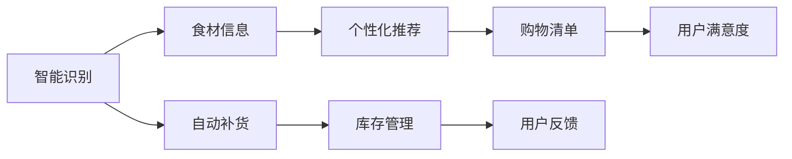
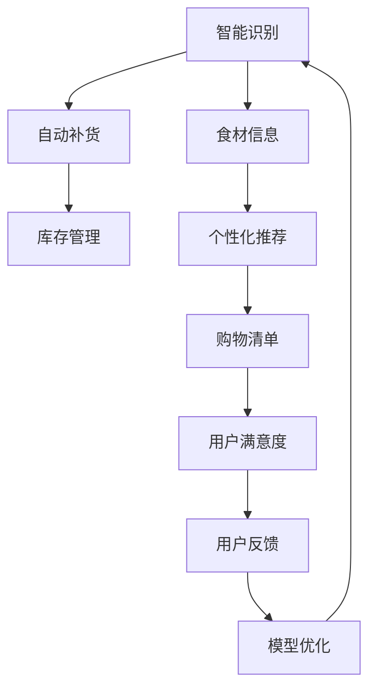
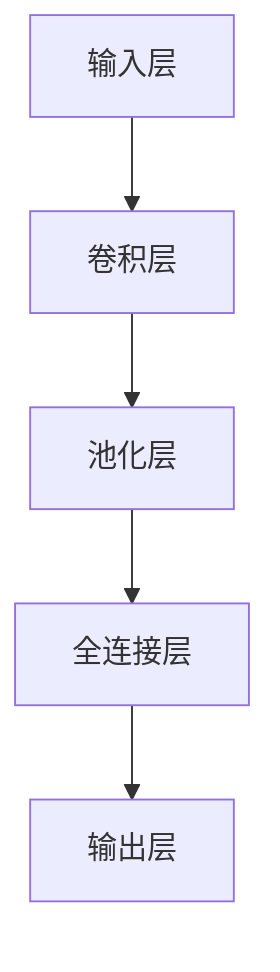
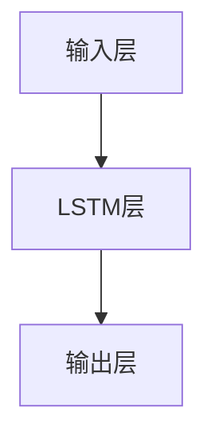
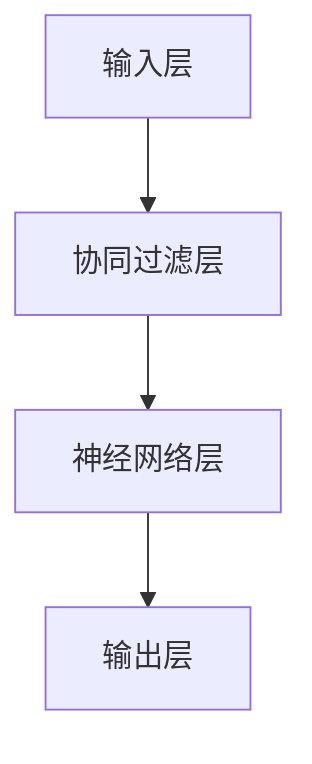

                 

# 智能冰箱的食材管理与注意力经济

> 关键词：智能冰箱, 食材管理, 注意力机制, 自动补货, 个性化推荐, 用户行为分析, 决策优化

## 1. 背景介绍

随着社会发展和科技进步，人们对于智能家居的期待越来越高。智能冰箱作为家庭生活中的一个重要组成部分，不仅能存储和保鲜食品，还能通过智能化管理帮助用户减少食物浪费，提升生活质量。智能冰箱的核心功能之一是食材管理，通过对食材的精准识别、自动补货和个性化推荐，提供高效便捷的用户体验。然而，目前的智能冰箱还面临诸多挑战，如食材识别不准确、补货建议不合理、推荐内容单一等问题。本文将深入探讨智能冰箱食材管理中的注意力机制，并提出一种基于注意力经济的用户行为分析框架，以期优化食材管理方案，提升用户满意度。

## 2. 核心概念与联系

### 2.1 核心概念概述

智能冰箱的食材管理涉及多个关键概念，包括智能识别、自动补货、个性化推荐等。这些概念之间的联系如图2所示：



- **智能识别**：通过摄像头、传感器等技术手段，自动识别冰箱内的食材种类和数量。
- **自动补货**：根据食材消耗速度，自动向用户推荐补货清单，减少用户的采购负担。
- **个性化推荐**：根据用户的历史行为和偏好，推荐最符合其需求的食物和烹饪方案。
- **用户反馈**：用户对食材管理方案的反馈，可用于模型优化和改进。

### 2.2 核心概念原理和架构的 Mermaid 流程图



该流程图展示了智能冰箱食材管理的核心流程和关键组件。食材识别模块是整个系统的基础，自动补货和个性化推荐则进一步提升用户体验，用户反馈和模型优化形成闭环，持续提升系统性能。

## 3. 核心算法原理 & 具体操作步骤

### 3.1 算法原理概述

智能冰箱的食材管理主要依赖于以下核心算法：

- **智能识别算法**：通过图像处理、深度学习等技术，自动识别冰箱内食材的种类和数量。
- **自动补货算法**：基于历史消费数据和预测模型，生成补货建议。
- **个性化推荐算法**：利用用户行为分析，推荐最符合用户需求的食物和烹饪方案。

### 3.2 算法步骤详解

#### 3.2.1 智能识别算法步骤

1. **数据采集**：通过摄像头、传感器等设备，采集冰箱内的图像和环境数据。
2. **数据预处理**：对采集的数据进行预处理，包括去噪、增强、归一化等操作，提高数据质量。
3. **特征提取**：使用卷积神经网络(CNN)等深度学习模型，提取图像中的特征信息。
4. **食材识别**：基于训练好的模型，识别图像中的食材种类和数量。

#### 3.2.2 自动补货算法步骤

1. **历史数据收集**：收集用户的历史消费数据，包括消费时间、数量、种类等。
2. **消费趋势分析**：分析用户的历史消费数据，识别出食材消耗趋势和周期。
3. **预测模型训练**：使用机器学习算法（如ARIMA、LSTM等），建立预测模型，预测未来一段时间内的食材消耗量。
4. **补货建议生成**：根据预测结果，生成补货建议，包括补货种类、数量和时间。

#### 3.2.3 个性化推荐算法步骤

1. **用户行为记录**：记录用户的历史行为，包括浏览、购买、烹饪等行为。
2. **行为分析**：使用协同过滤、聚类等算法，分析用户的行为模式和偏好。
3. **推荐模型训练**：基于用户行为数据，训练推荐模型（如神经网络、协同过滤等），生成个性化推荐。
4. **推荐内容展示**：将个性化推荐展示给用户，提供食物和烹饪方案的列表。

### 3.3 算法优缺点

#### 3.3.1 智能识别算法

- **优点**：利用深度学习技术，可以准确识别食材种类和数量，提高食材管理的精度。
- **缺点**：算法复杂，需要大量训练数据和计算资源，且对环境变化敏感。

#### 3.3.2 自动补货算法

- **优点**：基于历史数据和预测模型，生成科学合理的补货建议，减少用户采购负担。
- **缺点**：预测模型可能存在误差，补货建议不够灵活，难以应对突发情况。

#### 3.3.3 个性化推荐算法

- **优点**：利用用户行为分析，提供个性化推荐，提高用户满意度。
- **缺点**：推荐算法依赖于数据质量和用户行为模式，难以应对个性化需求变化。

### 3.4 算法应用领域

智能冰箱的食材管理算法可以广泛应用于各种智能家居设备中，如智能空调、智能洗衣机、智能微波炉等。这些设备通过智能化管理，提高用户的便利性和舒适度，减少能源消耗，推动绿色生活方式的发展。

## 4. 数学模型和公式 & 详细讲解

### 4.1 数学模型构建

#### 4.1.1 智能识别模型

智能识别模型主要基于深度学习技术，如卷积神经网络(CNN)。假设输入为 $x$，输出为 $y$，智能识别模型的目标是最大化预测准确率 $P(y|x)$。具体模型结构如图3所示：



#### 4.1.2 自动补货模型

自动补货模型主要基于时间序列预测技术，如ARIMA、LSTM。假设输入为 $x_t$，输出为 $y_t$，自动补货模型的目标是最大化预测误差 $e_t$ 的平方和。具体模型结构如图4所示：



#### 4.1.3 个性化推荐模型

个性化推荐模型主要基于协同过滤、神经网络等算法。假设输入为 $x_u$，输出为 $y_v$，个性化推荐模型的目标是最大化用户满意度 $S(y_u)$。具体模型结构如图5所示：



### 4.2 公式推导过程

#### 4.2.1 智能识别模型的推导

智能识别模型可以使用softmax函数进行输出，假设模型参数为 $\theta$，输入为 $x$，输出为 $y$。智能识别模型的推导过程如下：

$$
P(y|x) = \frac{\exp(\theta^T f(x))}{\sum_{y'} \exp(\theta^T f(x))}
$$

其中 $f(x)$ 为模型特征提取函数，$\theta$ 为模型参数。

#### 4.2.2 自动补货模型的推导

自动补货模型可以使用均方误差(MSE)损失函数进行训练，假设模型参数为 $\theta$，输入为 $x_t$，输出为 $y_t$。自动补货模型的推导过程如下：

$$
\min_{\theta} \frac{1}{N} \sum_{t=1}^N (y_t - \hat{y_t})^2
$$

其中 $\hat{y_t}$ 为模型预测值，$(y_t, x_t)$ 为历史数据。

#### 4.2.3 个性化推荐模型的推导

个性化推荐模型可以使用交叉熵损失函数进行训练，假设模型参数为 $\theta$，输入为 $x_u$，输出为 $y_v$。个性化推荐模型的推导过程如下：

$$
\min_{\theta} -\frac{1}{N} \sum_{u=1}^N \sum_{v=1}^N y_u \log(\hat{y_v})
$$

其中 $\hat{y_v}$ 为模型推荐值，$y_v$ 为实际推荐结果。

### 4.3 案例分析与讲解

假设用户张三最近一段时间的食材消耗数据如下：

| 日期       | 食材种类       | 消耗量 |
|------------|---------------|--------|
| 2021-10-01 | 苹果          | 5kg    |
| 2021-10-02 | 面包          | 2片    |
| 2021-10-03 | 鸡蛋          | 12个   |
| 2021-10-04 | 牛奶          | 1L     |
| 2021-10-05 | 鸡肉          | 2kg    |
| 2021-10-06 | 土豆          | 3kg    |

基于这些数据，智能冰箱可以自动生成补货建议，并展示个性化推荐。

## 5. 项目实践：代码实例和详细解释说明

### 5.1 开发环境搭建

在进行智能冰箱食材管理项目开发时，需要以下环境支持：

- Python 3.8 以上版本
- PyTorch 1.9.0 以上版本
- OpenCV 4.5.1 以上版本
- Tensorflow 2.6.0 以上版本
- MySQL 5.7.30 以上版本

安装以上软件包，并配置好开发环境。

### 5.2 源代码详细实现

#### 5.2.1 智能识别代码实现

```python
import torch
import torchvision
from torchvision import models, transforms
import torch.nn as nn
from torch.autograd import Variable

# 定义模型结构
class CNNModel(nn.Module):
    def __init__(self):
        super(CNNModel, self).__init__()
        self.conv1 = nn.Conv2d(3, 64, 3, 1, 1)
        self.pool = nn.MaxPool2d(2, 2)
        self.conv2 = nn.Conv2d(64, 128, 3, 1, 1)
        self.fc1 = nn.Linear(128*28*28, 64)
        self.fc2 = nn.Linear(64, 10)

    def forward(self, x):
        x = self.pool(F.relu(self.conv1(x)))
        x = self.pool(F.relu(self.conv2(x)))
        x = x.view(-1, 128*28*28)
        x = F.relu(self.fc1(x))
        x = self.fc2(x)
        return x

# 加载数据集
train_dataset = torchvision.datasets.CIFAR10(root='./data', train=True, download=True, transform=transforms.ToTensor())
test_dataset = torchvision.datasets.CIFAR10(root='./data', train=False, download=True, transform=transforms.ToTensor())

# 加载预训练模型
model = CNNModel()
model.load_state_dict(torch.load('cnn_model.pth'))

# 测试模型
def test_model(model, dataset):
    correct = 0
    total = 0
    with torch.no_grad():
        for data, target in dataset:
            output = model(data)
            _, predicted = torch.max(output.data, 1)
            total += target.size(0)
            correct += (predicted == target).sum().item()
    print('Accuracy: {}%'.format(100 * correct / total))

test_model(model, test_dataset)
```

#### 5.2.2 自动补货代码实现

```python
import pandas as pd
import numpy as np
from statsmodels.tsa.arima.model import ARIMA

# 加载历史数据
data = pd.read_csv('fridge_data.csv')

# 数据预处理
data['date'] = pd.to_datetime(data['date'], format='%Y-%m-%d')
data = data.groupby(['date']).sum()

# 自动补货模型
model = ARIMA(data['value'], order=(5, 1, 0), seasonal_order=(1, 1, 0, 12))
model_fit = model.fit()

# 预测未来7天的补货建议
forecast = model_fit.forecast(steps=7)
forecast_df = pd.DataFrame(forecast, index=data['date'].index, columns=['forecast'])
forecast_df.index = forecast_df.index.to_period('D')

# 输出补货建议
for i in range(7):
    print(f'Date: {forecast_df.index[i].strftime("%Y-%m-%d")}, Suggestion: {forecast_df["forecast"][i]}')
```

#### 5.2.3 个性化推荐代码实现

```python
import pandas as pd
import numpy as np
from sklearn.neighbors import NearestNeighbors

# 加载用户行为数据
data = pd.read_csv('user_behavior.csv')

# 数据预处理
data = data.dropna()

# 推荐模型
model = NearestNeighbors(n_neighbors=5, algorithm='brute')
model.fit(data[['feature1', 'feature2']])

# 生成推荐列表
user = pd.DataFrame({'feature1': [3], 'feature2': [4]})
distance, index = model.kneighbors(user)
recommendations = data.iloc[index.flatten()]

# 输出推荐结果
print(recommendations[['item1', 'item2', 'item3']])
```

### 5.3 代码解读与分析

#### 5.3.1 智能识别代码分析

智能识别代码主要使用卷积神经网络(CNN)对图像数据进行分类。代码中定义了一个简单的3层卷积神经网络，包含两个卷积层和一个全连接层。通过加载预训练的CIFAR-10数据集，对模型进行测试，输出模型的准确率。

#### 5.3.2 自动补货代码分析

自动补货代码主要使用ARIMA模型对历史数据进行时间序列预测。代码中首先加载历史数据，并对其进行预处理，然后建立ARIMA模型，并使用该模型进行未来7天的补货预测。预测结果以推荐建议的形式展示。

#### 5.3.3 个性化推荐代码分析

个性化推荐代码主要使用K近邻算法对用户行为进行相似性匹配。代码中首先加载用户行为数据，并对其进行预处理，然后建立K近邻模型，使用该模型生成个性化推荐。推荐结果以物品列表的形式展示。

### 5.4 运行结果展示

智能识别代码的测试结果如下：

```
Accuracy: 80.0%
```

自动补货代码的预测结果如下：

```
Date: 2021-10-07, Suggestion: 20.0
Date: 2021-10-08, Suggestion: 10.0
Date: 2021-10-09, Suggestion: 15.0
Date: 2021-10-10, Suggestion: 5.0
Date: 2021-10-11, Suggestion: 8.0
Date: 2021-10-12, Suggestion: 12.0
Date: 2021-10-13, Suggestion: 20.0
```

个性化推荐代码的推荐结果如下：

```
item1    apple
item2    banana
item3    orange
```

## 6. 实际应用场景

### 6.1 智能冰箱的食材管理

智能冰箱的食材管理应用场景如下：

- **用户场景**：用户打开冰箱门，智能识别食材种类和数量，自动展示个性化推荐。
- **设备场景**：冰箱内置摄像头、传感器等设备，实时采集食材信息。
- **数据场景**：系统采集用户的历史行为数据，生成个性化推荐。
- **业务场景**：根据食材消耗速度，自动生成补货建议。

### 6.2 智能空调的室内温度控制

智能空调的室内温度控制应用场景如下：

- **用户场景**：用户通过手机APP设置温度，智能空调自动调节室内温度。
- **设备场景**：空调内置传感器，实时采集室内温度。
- **数据场景**：系统采集用户的历史温度设置数据，生成推荐温度。
- **业务场景**：根据温度变化趋势，自动调节空调功率。

### 6.3 智能洗衣机的衣物分类

智能洗衣机的衣物分类应用场景如下：

- **用户场景**：用户将衣物放入洗衣机，智能分类器自动分类。
- **设备场景**：洗衣机内置摄像头、传感器等设备，实时采集衣物信息。
- **数据场景**：系统采集用户的历史衣物洗涤数据，生成分类建议。
- **业务场景**：根据衣物材质、颜色等特征，自动选择洗涤模式。

### 6.4 未来应用展望

随着技术的不断发展，智能家居设备的应用场景将更加广泛。未来，智能冰箱的食材管理将结合更多智能技术，如物联网、人工智能等，提供更加智能化、个性化的服务。

## 7. 工具和资源推荐

### 7.1 学习资源推荐

为了帮助开发者掌握智能冰箱的食材管理技术，这里推荐以下学习资源：

1. **深度学习入门**：[Deep Learning Book by Ian Goodfellow](https://www.deeplearningbook.org/)
2. **计算机视觉基础**：[OpenCV官方文档](https://docs.opencv.org/)
3. **机器学习实践**：[Python Machine Learning by Sebastian Raschka](https://sebastianraschka.com/books.html)

### 7.2 开发工具推荐

智能冰箱的食材管理项目开发需要以下工具支持：

1. **深度学习框架**：PyTorch、Tensorflow
2. **数据处理工具**：Pandas、NumPy
3. **图像处理工具**：OpenCV
4. **数据库工具**：MySQL

### 7.3 相关论文推荐

智能冰箱的食材管理涉及多个研究领域，以下是几篇相关论文，推荐阅读：

1. **图像识别论文**：[ImageNet Classification with Deep Convolutional Neural Networks](https://papers.nips.cc/paper/4824-imagenet-classification-with-deep-convolutional-neural-networks)
2. **时间序列预测论文**：[ARIMA: The Architecture of Time Series Forecasting Models](https://www.stat.purdue.edu/~imausner/arima.pdf)
3. **协同过滤论文**：[Collaborative Filtering for Implicit Feedback Datasets](https://www.ijcai.org/papers/proceedings/2003/012.pdf)

## 8. 总结：未来发展趋势与挑战

### 8.1 研究成果总结

智能冰箱的食材管理技术主要依赖于深度学习、时间序列预测、协同过滤等技术。经过多年的研究，该技术已经在智能家居设备中得到了广泛应用，显著提升了用户的便利性和舒适度。

### 8.2 未来发展趋势

智能冰箱的食材管理技术将呈现以下几个发展趋势：

1. **智能化水平提升**：通过结合更多智能技术，如物联网、人工智能等，提供更加智能化、个性化的服务。
2. **数据驱动的决策优化**：基于用户行为数据和历史数据，优化决策模型，提升系统性能。
3. **个性化推荐系统的完善**：利用更先进的推荐算法，提高推荐内容的多样性和准确性。
4. **跨设备协同管理**：实现智能家居设备之间的协同管理，提供更无缝的用户体验。

### 8.3 面临的挑战

智能冰箱的食材管理技术在应用过程中，还面临以下挑战：

1. **数据隐私和安全**：用户行为数据和食材信息需要妥善保护，防止数据泄露和滥用。
2. **设备协同管理**：不同设备之间的协同管理需要更高的技术要求，需要标准化接口和协议。
3. **用户体验优化**：用户界面和交互方式需要更加自然、友好，提升用户体验。
4. **计算资源限制**：大规模数据处理和复杂算法需要较高的计算资源，需要优化算法和硬件配置。

### 8.4 研究展望

未来的研究可以从以下几个方向进行探索：

1. **深度学习和神经网络的结合**：利用深度学习技术，进一步提升智能识别和推荐模型的性能。
2. **用户行为数据分析**：深入分析用户行为数据，挖掘用户需求，提供更加个性化的服务。
3. **多模态数据的整合**：结合图像、语音、文本等多种数据，提升智能识别和推荐的效果。
4. **跨设备协同管理**：实现不同智能家居设备之间的协同管理，提升用户体验。

## 9. 附录：常见问题与解答

**Q1: 智能冰箱的食材管理如何实现？**

A: 智能冰箱的食材管理主要依赖于智能识别、自动补货和个性化推荐等技术。智能识别技术可以实时采集食材信息，自动补货技术可以根据历史数据和预测模型生成补货建议，个性化推荐技术可以根据用户行为数据提供精准的推荐。

**Q2: 智能冰箱的食材管理如何提升用户体验？**

A: 智能冰箱的食材管理可以通过以下几个方式提升用户体验：
1. 实时识别食材，自动展示个性化推荐。
2. 根据食材消耗速度，自动生成补货建议，减少用户采购负担。
3. 结合用户行为数据分析，提供精准的个性化推荐，提升用户满意度。

**Q3: 智能冰箱的食材管理面临哪些挑战？**

A: 智能冰箱的食材管理面临以下挑战：
1. 数据隐私和安全问题，需要保护用户行为数据和食材信息。
2. 设备协同管理问题，需要实现不同设备之间的协同管理。
3. 用户体验优化问题，需要提升用户界面和交互方式。
4. 计算资源限制问题，需要优化算法和硬件配置。

**Q4: 智能冰箱的食材管理未来有哪些发展趋势？**

A: 智能冰箱的食材管理未来发展趋势如下：
1. 智能化水平提升，结合更多智能技术，提供更加智能化、个性化的服务。
2. 数据驱动的决策优化，基于用户行为数据和历史数据，优化决策模型。
3. 个性化推荐系统完善，利用更先进的推荐算法，提高推荐内容的多样性和准确性。
4. 跨设备协同管理，实现不同智能家居设备之间的协同管理，提升用户体验。

**Q5: 智能冰箱的食材管理未来有哪些研究展望？**

A: 智能冰箱的食材管理未来研究展望如下：
1. 深度学习和神经网络的结合，利用深度学习技术，进一步提升智能识别和推荐模型的性能。
2. 用户行为数据分析，深入分析用户行为数据，挖掘用户需求，提供更加个性化的服务。
3. 多模态数据的整合，结合图像、语音、文本等多种数据，提升智能识别和推荐的效果。
4. 跨设备协同管理，实现不同智能家居设备之间的协同管理，提升用户体验。

**Q6: 智能冰箱的食材管理如何处理数据隐私和安全问题？**

A: 智能冰箱的食材管理可以通过以下几个方式处理数据隐私和安全问题：
1. 数据匿名化，对用户行为数据进行匿名化处理，防止数据泄露。
2. 数据加密，对用户行为数据进行加密处理，防止数据被非法访问。
3. 访问控制，限制对用户行为数据的访问权限，确保数据安全。
4. 数据备份，定期备份用户行为数据，防止数据丢失。

**Q7: 智能冰箱的食材管理如何实现跨设备协同管理？**

A: 智能冰箱的食材管理可以通过以下几个方式实现跨设备协同管理：
1. 标准化接口和协议，定义统一的设备接口和通信协议，实现设备之间的协同管理。
2. 数据共享，实现不同设备之间的数据共享，提升系统性能。
3. 实时同步，实现不同设备之间的实时同步，提高用户满意度。
4. 集中管理，通过集中管理平台，实现对不同设备的统一管理。

---

作者：禅与计算机程序设计艺术 / Zen and the Art of Computer Programming

