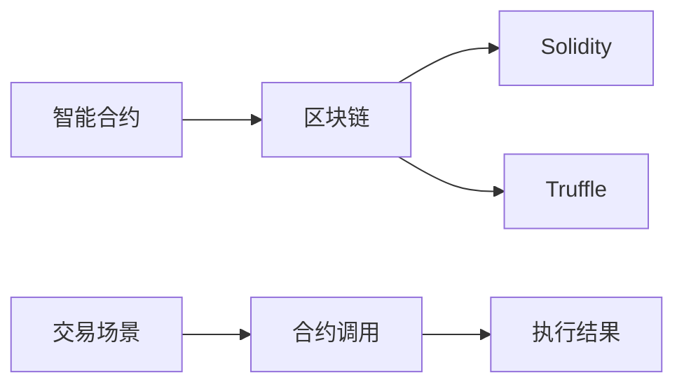

                 

## 1. 背景介绍

在当今快速发展的金融市场中，自动化交易已经成为一个热门话题。通过智能合约，我们可以实现各种复杂交易场景的自动化和智能化，大幅降低交易成本，提高交易效率。智能合约创业，旨在通过区块链技术和智能合约技术，实现交易的自动化和智能化，成为金融领域一个前景广阔的新兴方向。

本文将从智能合约的基础知识、核心概念、算法原理、项目实践、实际应用场景等多个维度，深入探讨智能合约创业的相关内容，为有意进入这一领域的创业者提供全面的技术指引和实践参考。

## 2. 核心概念与联系

### 2.1 核心概念概述

智能合约是一种基于区块链技术的自动化合约，能够自动执行约定的条款，实现金融市场的自动化交易。其主要特性包括：

- **自动执行**：一旦触发智能合约，合约条款将自动执行，无需人工干预。
- **去中心化**：智能合约在区块链上运行，具有高度的去中心化和透明性。
- **不可篡改**：智能合约一旦部署，代码和执行结果不可篡改，确保交易的可靠性和安全性。
- **自主性**：智能合约能够自主判断条件，实现复杂的自动化逻辑。

智能合约的核心技术包括区块链、Solidity、Truffle等，这些技术共同构建了智能合约的底层框架和开发环境。

### 2.2 核心概念原理和架构的 Mermaid 流程图



这个图表展示了一个基于智能合约的自动化交易流程。首先，在区块链上部署智能合约，使用Solidity编写智能合约代码，并通过Truffle进行开发和测试。当交易场景发生时，智能合约被调用，执行预设的交易逻辑，并返回执行结果。

## 3. 核心算法原理 & 具体操作步骤

### 3.1 算法原理概述

智能合约的算法原理基于区块链和分布式账本技术。智能合约代码在区块链上部署后，一旦满足预设条件，即会被自动执行。智能合约的核心在于如何编写可执行的合约代码，确保代码的安全性、可靠性和高效性。

### 3.2 算法步骤详解

智能合约的编写和部署主要包括以下几个步骤：

**Step 1: 编写合约代码**

智能合约的编写主要使用Solidity语言。Solidity是一种专门为区块链智能合约设计的编程语言，具有类型安全、面向对象、状态机等特性。编写智能合约时，需要注意以下几点：

- 使用类型声明：确保代码的可读性和可维护性。
- 避免状态改变：尽量使用事件和状态更新函数，避免在函数内部改变合约状态。
- 遵循安全最佳实践：避免使用不安全的函数，如Reentrancy、溢出、分叉攻击等。

**Step 2: 测试合约代码**

编写完成后，需要对合约进行测试。可以使用Truffle提供的开发环境，编写测试用例，对合约进行自动化测试，确保合约的正确性和稳定性。

**Step 3: 部署合约代码**

测试通过后，将合约代码部署到区块链上。可以使用MyEtherWallet或Infura等工具，将合约部署到区块链网络中，等待部署成功后，合约即可被调用执行。

### 3.3 算法优缺点

智能合约的优势在于其自动化、去中心化、不可篡改的特性，能够大幅降低交易成本，提高交易效率。但同时也存在以下缺点：

- **安全性问题**：智能合约的代码一旦部署，就不可更改，一旦出现漏洞，可能会造成重大损失。
- **执行效率问题**：由于区块链的分布式特性，智能合约的执行速度可能较慢，难以适应高频交易场景。
- **法律合规问题**：智能合约的法律地位尚未明确，可能存在法律风险和合规性问题。

### 3.4 算法应用领域

智能合约可以应用于多种金融场景，如自动化借贷、自动对冲、自动执行保险合同等。其适用范围非常广泛，未来有望在更多领域实现应用，提升交易的自动化和智能化水平。

## 4. 数学模型和公式 & 详细讲解 & 举例说明

### 4.1 数学模型构建

智能合约的核心是可执行的代码，其数学模型可以通过形式化描述合约的状态和行为。假设智能合约的状态为S，触发条件为T，执行结果为R。则智能合约的数学模型可以表示为：

$$
S \rightarrow T \rightarrow R
$$

其中：

- S表示合约状态，可以是初始状态、已触发状态、已执行状态等。
- T表示触发条件，可以是事件触发、时间触发、状态触发等。
- R表示执行结果，可以是资产转移、状态更新、事件记录等。

### 4.2 公式推导过程

以一个简单的自动化借贷合约为例，推导其数学模型：

假设甲方需要借款N美元，乙方提供资金X美元，利率为r。在智能合约中，约定当甲方还款后，将资金X转移到乙方账户。则合约代码可以表示为：

```solidity
// 智能合约代码
pragma solidity ^0.4.18;

contract AutoLoan {
    uint public amountLent;
    uint public rate;
    address payable public borrower;
    
    function approveLoan(uint _amountLent, uint _rate, address payable _borrower) public {
        amountLent = _amountLent;
        rate = _rate;
        borrower = _borrower;
    }
    
    function repayLoan() public payable {
        uint debt = amountLent * 10 * rate; // 年利率10%
        uint paid = address(this).balance;
        require(paid >= debt);
        borrower.send(debt);
        self.balance -= debt;
    }
}
```

根据上述合约代码，其数学模型可以表示为：

$$
S \rightarrow T_1 \rightarrow R_1 \rightarrow T_2 \rightarrow R_2
$$

其中：

- $S$表示初始状态，$T_1$表示借款状态，$R_1$表示借款操作。
- $T_2$表示还款状态，$R_2$表示还款操作。

### 4.3 案例分析与讲解

以一个自动化对冲合约为例，说明智能合约的实际应用。假设某公司需要对冲其股票价格波动风险，可以在智能合约中约定：当股票价格波动超过一定阈值时，自动执行对冲操作。合约代码可以表示为：

```solidity
// 智能合约代码
pragma solidity ^0.4.18;

contract AutoHedge {
    uint public thresholdPrice;
    address payable public hedger;
    
    function approveHedge(uint _thresholdPrice, address payable _hedger) public {
        thresholdPrice = _thresholdPrice;
        hedger = _hedger;
    }
    
    function executeHedge() public payable {
        uint price = address(this).balance;
        require(price > thresholdPrice);
        uint hedgeAmount = price - thresholdPrice;
        hedger.send(hedgeAmount);
        self.balance -= hedgeAmount;
    }
}
```

根据上述合约代码，其数学模型可以表示为：

$$
S \rightarrow T_1 \rightarrow R_1 \rightarrow T_2 \rightarrow R_2
$$

其中：

- $S$表示初始状态，$T_1$表示价格波动状态，$R_1$表示对冲操作。
- $T_2$表示对冲完成状态，$R_2$表示对冲完成操作。

通过上述合约，可以实现对冲风险的自动化管理，大幅降低人工操作成本，提高风险管理的效率和准确性。

## 5. 项目实践：代码实例和详细解释说明

### 5.1 开发环境搭建

在智能合约开发前，需要先搭建好开发环境。以下是使用Truffle搭建开发环境的详细步骤：

1. 安装Node.js和npm。
2. 安装Truffle和Solidity。
3. 创建Truffle项目目录，并初始化项目。
4. 创建智能合约文件，编写合约代码。
5. 编写测试用例，进行合约测试。
6. 部署合约到区块链网络。

### 5.2 源代码详细实现

下面以一个简单的自动化借贷合约为例，展示智能合约的编写和测试过程：

```solidity
// 智能合约代码
pragma solidity ^0.4.18;

contract AutoLoan {
    uint public amountLent;
    uint public rate;
    address payable public borrower;
    
    function approveLoan(uint _amountLent, uint _rate, address payable _borrower) public {
        amountLent = _amountLent;
        rate = _rate;
        borrower = _borrower;
    }
    
    function repayLoan() public payable {
        uint debt = amountLent * 10 * rate; // 年利率10%
        uint paid = address(this).balance;
        require(paid >= debt);
        borrower.send(debt);
        self.balance -= debt;
    }
}
```

### 5.3 代码解读与分析

在上述代码中，`AutoLoan`合约实现了自动化借贷功能。通过`approveLoan`函数，设置借款金额、利率和借款人，一旦借款人还款，`repayLoan`函数将自动执行，将借款人支付的金额转移给借款人。

在测试用例中，可以使用Truffle提供的`truffle test`命令，编写测试用例，对合约进行自动化测试。例如：

```solidity
// 测试用例
pragma solidity ^0.4.18;

import './AutoLoan.sol";

contract TestAutoLoan {
    AutoLoan public autoLoan;
    uint public amountLent;
    uint public rate;
    address payable public borrower;
    
    function setup() public {
        amountLent = 1000;
        rate = 10;
        borrower = address(0x1234567890);
        AutoLoan autoLoanInstance = AutoLoan.deploy(amountLent, rate, borrower);
        autoLoan = autoLoanInstance;
    }
    
    function testApproveLoan() public {
        require(autoLoan.approveLoan(amountLent, rate, borrower));
        require(autoLoan.amountLent == amountLent);
        require(autoLoan.rate == rate);
        require(autoLoan.borrower == borrower);
    }
    
    function testRepayLoan() public {
        require(borrower.balance == 0);
        borrower.send(amountLent);
        require(autoLoan.balance == 0);
        require(borrower.balance == amountLent);
        require(autoLoan.repayLoan());
        require(autoLoan.balance == 0);
        require(borrower.balance == 0);
    }
}
```

在上述代码中，`TestAutoLoan`合约实现了对`AutoLoan`合约的测试。通过`setup`函数，初始化借款金额、利率和借款人地址，并通过`deploy`函数部署`AutoLoan`合约。然后，通过`testApproveLoan`函数测试`approveLoan`函数的正确性，通过`testRepayLoan`函数测试`repayLoan`函数的正确性。

### 5.4 运行结果展示

在Truffle环境下，可以通过`truffle run`命令，运行测试用例，查看测试结果。例如：

```bash
truffle test
```

运行后，Truffle将执行测试用例，并输出测试结果。

## 6. 实际应用场景

### 6.1 智能合约在金融交易中的应用

智能合约在金融交易中的应用非常广泛，如自动化对冲、自动执行合同、自动借贷等。以自动化借贷为例，假设某公司需要借款100万美元，利率为10%，借款期限为一年，则可以使用智能合约自动管理借款和还款流程。

### 6.2 智能合约在供应链管理中的应用

智能合约还可以应用于供应链管理，实现自动化库存管理、自动支付等。例如，某公司可以与供应商签订智能合约，当供应商发货后，智能合约自动检查订单状态和库存情况，并触发支付操作。

### 6.3 智能合约在保险合同中的应用

智能合约还可以应用于保险合同，实现自动理赔和索赔。例如，当某公司发生交通事故后，智能合约自动检查事故情况，并触发理赔操作，将保险金支付给保险公司。

### 6.4 未来应用展望

未来，智能合约的应用场景将进一步扩大，覆盖更多领域。例如，智能合约可以应用于房地产交易、股票交易、跨境支付等，实现高效、透明、安全的自动化交易。

## 7. 工具和资源推荐

### 7.1 学习资源推荐

- 《Solidity官方文档》：Solidity官方文档，详细介绍了Solidity语言和智能合约开发的基础知识。
- 《Truffle官方文档》：Truffle官方文档，提供了Truffle开发环境和智能合约开发的最佳实践。
- 《区块链应用开发指南》：一本系统介绍区块链和智能合约开发的书籍，涵盖Solidity、Truffle等工具的使用。

### 7.2 开发工具推荐

- Visual Studio Code：一款流行的IDE，支持Solidity代码编辑和调试。
- Solidity IDE：一款专为Solidity编写的IDE，提供了强大的代码编辑和测试功能。
- Remix：一款在线IDE，支持Solidity代码编辑和测试，适合初学者使用。

### 7.3 相关论文推荐

- "Smart Contracts: A Survey"：一篇系统介绍智能合约的论文，涵盖智能合约的基本概念、应用场景和实现技术。
- "Blockchain and Smart Contracts for Business: Bridging the Gap Between IT and Business"：一本介绍区块链和智能合约的书籍，涵盖智能合约在金融、供应链、保险等场景的应用。
- "Blockchain and Solidity Development for Smart Contracts"：一本介绍区块链和Solidity开发的书籍，详细介绍了智能合约的开发、测试和部署流程。

## 8. 总结：未来发展趋势与挑战

### 8.1 研究成果总结

智能合约作为一种基于区块链技术的自动化合约，具有自动执行、去中心化、不可篡改的特性，广泛应用于金融交易、供应链管理、保险合同等场景。其核心在于编写可执行的智能合约代码，确保代码的安全性、可靠性和高效性。

### 8.2 未来发展趋势

未来，智能合约的发展趋势包括：

- **自动化程度提升**：智能合约将更加自动化、智能化，实现复杂的自动化逻辑和业务场景。
- **去中心化程度提升**：智能合约的去中心化程度将进一步提升，降低中心化机构的运营成本和风险。
- **跨链互操作性提升**：智能合约将支持跨链互操作，实现不同区块链网络之间的互联互通。

### 8.3 面临的挑战

智能合约在发展过程中面临以下挑战：

- **安全性问题**：智能合约的安全性问题仍然存在，一旦出现漏洞，可能造成重大损失。
- **执行效率问题**：智能合约的执行速度较慢，难以适应高频交易场景。
- **法律合规问题**：智能合约的法律地位尚未明确，可能存在法律风险和合规性问题。

### 8.4 研究展望

未来的研究应在以下几个方向上寻求突破：

- **安全性提升**：开发更加安全可靠的智能合约开发工具和方法，减少智能合约的安全漏洞。
- **执行效率优化**：优化智能合约的执行速度和资源消耗，实现高频交易场景的支持。
- **法律合规研究**：研究智能合约的法律地位和合规性问题，制定智能合约的法律标准和规范。

## 9. 附录：常见问题与解答

**Q1: 什么是智能合约？**

A: 智能合约是一种基于区块链技术的自动化合约，能够自动执行约定的条款，实现金融市场的自动化交易。

**Q2: 智能合约有哪些优势？**

A: 智能合约具有自动执行、去中心化、不可篡改的特性，能够大幅降低交易成本，提高交易效率。

**Q3: 如何编写智能合约代码？**

A: 智能合约代码通常使用Solidity语言编写。编写时需要注意类型声明、状态改变、安全性等问题，确保合约的可靠性和安全性。

**Q4: 如何测试智能合约代码？**

A: 可以使用Truffle提供的测试框架，编写测试用例，对合约进行自动化测试，确保合约的正确性和稳定性。

**Q5: 智能合约在实际应用中需要注意哪些问题？**

A: 智能合约在实际应用中需要注意安全性、执行效率和法律合规性问题。开发和部署智能合约时，需要全面考虑这些问题，确保合约的可靠性和安全性。

---

作者：禅与计算机程序设计艺术 / Zen and the Art of Computer Programming

