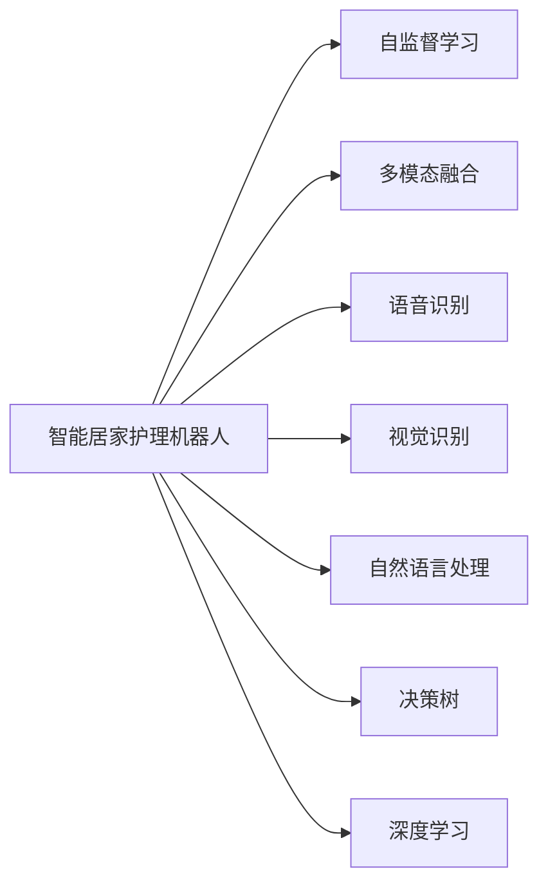

                 

## 1. 背景介绍

### 1.1 问题由来

随着人口老龄化趋势的加剧，老年照护需求日益增长。传统的居家护理模式以人力为主，面临人力成本高、效率低、护理质量参差不齐等问题。智能居家护理机器人成为老年人照护的新兴解决方案，通过引入自动化和智能化技术，提供连续、高效、个性化的照护服务。

### 1.2 问题核心关键点

1. **老龄化趋势**：全球人口老龄化问题加剧，65岁以上人口占比逐年增加，给传统居家护理带来巨大压力。
2. **照护需求多样性**：老年人健康状况、生活习惯各异，对照护服务的需求多样化。
3. **技术融合需求**：将人工智能、物联网、机器人技术融合，实现智能居家护理机器人，提升老年照护的效率和质量。
4. **数据隐私保护**：老年人对数据隐私保护有较高要求，需要确保智能居家护理机器人的数据安全性。
5. **成本效益**：智能居家护理机器人需要在保证护理效果的前提下，尽量降低设备和运营成本，提高性价比。
6. **用户友好性**：机器人需要具备直观的操作界面和易用的交互方式，便于老年人操作和使用。

### 1.3 问题研究意义

智能居家护理机器人作为老龄化社会的新型解决方案，具有以下几个重要意义：

1. **降低照护成本**：自动化和智能化技术可以降低人力成本，提高照护效率。
2. **提升照护质量**：机器人在24小时不间断工作下，可以提供连续、稳定的照护服务，改善老年人生活质量。
3. **个性化服务**：通过智能算法和大数据分析，机器人可以提供个性化的照护服务，更好地满足老年人的需求。
4. **缓解家庭负担**：智能机器人可以减轻家庭成员的照护压力，让子女有更多时间和精力投入其他生活和工作。
5. **促进技术创新**：推动人工智能、物联网、机器人技术的发展，加速相关产业的数字化转型。

## 2. 核心概念与联系

### 2.1 核心概念概述

为更好地理解智能居家护理机器人的技术框架，本节将介绍几个密切相关的核心概念：

- **智能居家护理机器人**：指融合了人工智能、物联网、机器人技术的设备，能够在家庭环境中提供连续、高效、个性化的照护服务。
- **自监督学习**：指无监督学习的一种，利用大量未标注的数据进行学习，通过自动生成标签或学习数据的隐含结构，从而学习到数据的特征表示。
- **多模态融合**：指结合视觉、语音、传感器等多种模态数据，构建多模态融合模型，提高智能系统的感知和理解能力。
- **语音识别**：指将语音信号转换为文本，便于计算机处理和理解。
- **视觉识别**：指通过图像处理技术，识别和理解物体、场景和行为。
- **自然语言处理**：指让机器理解、生成和处理人类语言的技术。
- **决策树**：指一种树形结构，用于表示决策规则和分类模型，常用于知识表示和推理。
- **深度学习**：指通过多层神经网络实现复杂模式识别和预测，是当前人工智能领域的主流技术。

这些核心概念之间的逻辑关系可以通过以下Mermaid流程图来展示：



这个流程图展示了这个系统的主要组成部分及其之间的关系：

1. 智能居家护理机器人通过自监督学习获取环境理解能力。
2. 结合多模态数据，提升感知和理解能力。
3. 语音识别和视觉识别技术，使机器人具备与老年人交流的能力。
4. 自然语言处理技术，使机器人能够理解老年人意图，提供个性化服务。
5. 决策树和深度学习技术，用于模型的推理和预测。

这些核心概念共同构成了智能居家护理机器人的技术框架，使其能够在家庭环境中提供高效、智能的照护服务。

## 3. 核心算法原理 & 具体操作步骤
### 3.1 算法原理概述

智能居家护理机器人的技术实现主要依赖于深度学习和自然语言处理技术，通过在大量数据上进行训练，学习到环境理解、语音识别、视觉识别、自然语言处理等方面的能力。以下是这些技术的详细原理和操作步骤：

1. **自监督学习**：
   - 原理：利用大量未标注的数据进行训练，通过自动生成标签或学习数据的隐含结构，从而学习到数据的特征表示。
   - 操作步骤：
     - 收集家庭环境的多模态数据，如摄像头图像、传感器数据、环境声音等。
     - 设计自监督任务，如视觉场景分类、语音情感分析等。
     - 在大量未标注数据上训练自监督模型，学习环境特征。

2. **多模态融合**：
   - 原理：将视觉、语音、传感器等多种模态数据融合，构建多模态融合模型，提高系统的感知和理解能力。
   - 操作步骤：
     - 收集和预处理多模态数据，如摄像头图像、环境声音、传感器数据等。
     - 设计融合算法，如基于注意力机制的融合方法，将不同模态的数据融合到统一的特征空间中。
     - 训练多模态融合模型，学习多模态数据的联合特征表示。

3. **语音识别**：
   - 原理：将语音信号转换为文本，便于计算机处理和理解。
   - 操作步骤：
     - 收集老年人的语音数据，如对话、指令等。
     - 设计语音识别模型，如基于CNN的声学模型和基于RNN的语言模型。
     - 在大量语音数据上训练模型，学习语音特征到文本的映射。

4. **视觉识别**：
   - 原理：通过图像处理技术，识别和理解物体、场景和行为。
   - 操作步骤：
     - 收集环境图像数据，如家具、食物、药品等。
     - 设计视觉识别模型，如基于CNN的物体检测和分类模型。
     - 在大量图像数据上训练模型，学习物体和场景的特征表示。

5. **自然语言处理**：
   - 原理：让机器理解、生成和处理人类语言的技术。
   - 操作步骤：
     - 收集和预处理老年人的对话数据，如日常对话、指令等。
     - 设计自然语言处理模型，如基于LSTM的语言模型和基于Transformer的注意力机制模型。
     - 在大量对话数据上训练模型，学习语言的上下文表示和意图识别。

6. **决策树**：
   - 原理：一种树形结构，用于表示决策规则和分类模型，常用于知识表示和推理。
   - 操作步骤：
     - 收集老年人的行为数据，如起床、进食、服药等。
     - 设计决策树模型，如基于决策树的分类和推理模型。
     - 在大量行为数据上训练模型，学习行为特征和决策规则。

7. **深度学习**：
   - 原理：通过多层神经网络实现复杂模式识别和预测，是当前人工智能领域的主流技术。
   - 操作步骤：
     - 设计深度学习模型，如卷积神经网络(CNN)、循环神经网络(RNN)和注意力机制模型。
     - 在大量数据上训练模型，学习复杂模式和特征表示。
     - 在实际应用中，使用训练好的模型进行推理和预测。

### 3.2 算法步骤详解

基于深度学习和自然语言处理技术的智能居家护理机器人，其核心算法步骤如下：

1. **数据收集与预处理**：
   - 收集家庭环境的多模态数据，如摄像头图像、传感器数据、环境声音等。
   - 预处理数据，包括降噪、图像增强、标签生成等，确保数据质量和一致性。

2. **自监督学习**：
   - 设计自监督任务，如视觉场景分类、语音情感分析等。
   - 在大量未标注数据上训练自监督模型，学习环境特征。
   - 提取环境特征，如物体检测、行为识别等，用于多模态融合。

3. **多模态融合**：
   - 收集和预处理多模态数据，如摄像头图像、环境声音、传感器数据等。
   - 设计融合算法，如基于注意力机制的融合方法，将不同模态的数据融合到统一的特征空间中。
   - 训练多模态融合模型，学习多模态数据的联合特征表示。
   - 将多模态特征输入到后续的自然语言处理和决策树模型中，用于推理和预测。

4. **语音识别**：
   - 收集老年人的语音数据，如对话、指令等。
   - 设计语音识别模型，如基于CNN的声学模型和基于RNN的语言模型。
   - 在大量语音数据上训练模型，学习语音特征到文本的映射。
   - 将语音识别结果作为自然语言处理模型的输入，用于理解老年人的意图和指令。

5. **视觉识别**：
   - 收集环境图像数据，如家具、食物、药品等。
   - 设计视觉识别模型，如基于CNN的物体检测和分类模型。
   - 在大量图像数据上训练模型，学习物体和场景的特征表示。
   - 将视觉识别结果作为多模态融合模型的输入，用于环境理解。

6. **自然语言处理**：
   - 收集和预处理老年人的对话数据，如日常对话、指令等。
   - 设计自然语言处理模型，如基于LSTM的语言模型和基于Transformer的注意力机制模型。
   - 在大量对话数据上训练模型，学习语言的上下文表示和意图识别。
   - 将自然语言处理结果作为决策树模型的输入，用于推理和预测。

7. **决策树**：
   - 收集老年人的行为数据，如起床、进食、服药等。
   - 设计决策树模型，如基于决策树的分类和推理模型。
   - 在大量行为数据上训练模型，学习行为特征和决策规则。
   - 使用决策树模型进行推理和预测，生成老年人的个性化照护方案。

8. **深度学习**：
   - 设计深度学习模型，如卷积神经网络(CNN)、循环神经网络(RNN)和注意力机制模型。
   - 在大量数据上训练模型，学习复杂模式和特征表示。
   - 在实际应用中，使用训练好的模型进行推理和预测。
   - 结合自然语言处理和决策树模型，输出老年人的个性化照护方案。

### 3.3 算法优缺点

智能居家护理机器人依赖于深度学习和自然语言处理技术，具有以下优缺点：

优点：
- **高效性**：通过自监督学习和多模态融合，机器人能够快速理解环境并做出反应。
- **个性化**：通过自然语言处理和决策树模型，机器人能够理解老年人的意图并生成个性化照护方案。
- **可靠性**：结合多模态数据和深度学习模型，机器人能够在多种情况下稳定运行。
- **安全性**：通过数据隐私保护技术，确保老年人的数据安全。

缺点：
- **技术复杂性**：系统涉及多个技术领域，开发和维护复杂。
- **数据依赖性**：系统的性能依赖于大量高质量数据，数据获取和标注成本高。
- **系统复杂性**：多模态数据和深度学习模型的融合，系统设计和实现复杂。
- **成本较高**：系统的开发和部署成本较高，难以在低成本环境下大规模部署。
- **用户接受度**：老年人对新技术的接受度较低，可能对系统的应用产生阻力。

### 3.4 算法应用领域

智能居家护理机器人可应用于多个领域，包括：

1. **日常照护**：如起床、洗漱、穿衣、进食、服药等。
2. **健康监测**：如心率、血压、血氧、睡眠等生理指标的监测。
3. **家庭娱乐**：如播放音乐、电视剧、阅读书籍等。
4. **社交互动**：如与老年人交流对话、陪伴聊天等。
5. **安全防护**：如检测跌倒、火灾、烟雾等紧急情况。
6. **家务辅助**：如清洁卫生、购物采购、家务劳动等。
7. **心理健康**：如情绪监测、心理咨询、陪伴聊天等。

## 4. 数学模型和公式 & 详细讲解 & 举例说明

### 4.1 数学模型构建

本节将使用数学语言对智能居家护理机器人的主要技术模型进行更加严格的刻画。

记自监督学习任务为 $T_{unsupervised}$，多模态融合任务为 $T_{multimodal}$，语音识别任务为 $T_{speech}$，视觉识别任务为 $T_{vision}$，自然语言处理任务为 $T_{nlp}$，决策树任务为 $T_{decision}$，深度学习任务为 $T_{deep}$。则智能居家护理机器人的数学模型可以表示为：

$$
M = (T_{unsupervised}, T_{multimodal}, T_{speech}, T_{vision}, T_{nlp}, T_{decision}, T_{deep})
$$

其中，每个任务 $T$ 的数学模型 $M_T$ 可以表示为：

$$
M_T = (F_{T}, D_{T}, L_{T}, W_{T})
$$

其中 $F_{T}$ 表示任务 $T$ 的特征提取函数，$D_{T}$ 表示任务 $T$ 的决策函数，$L_{T}$ 表示任务 $T$ 的损失函数，$W_{T}$ 表示任务 $T$ 的权重参数。

### 4.2 公式推导过程

以自监督学习任务 $T_{unsupervised}$ 为例，推导其数学模型的具体形式。

记自监督学习的数据集为 $D_{unsupervised} = \{(x_i, y_i)\}_{i=1}^N$，其中 $x_i$ 表示输入，$y_i$ 表示标签。则自监督学习的损失函数可以表示为：

$$
L_{unsupervised} = \frac{1}{N}\sum_{i=1}^N \ell(f_{unsupervised}(x_i), y_i)
$$

其中 $f_{unsupervised}$ 表示自监督学习的特征提取函数，$\ell$ 表示损失函数，如交叉熵损失。

在训练过程中，自监督学习模型的参数 $\theta$ 通过反向传播算法进行优化，其梯度更新公式为：

$$
\theta \leftarrow \theta - \eta \nabla_{\theta}L_{unsupervised}
$$

其中 $\eta$ 表示学习率，$\nabla_{\theta}L_{unsupervised}$ 表示损失函数对参数 $\theta$ 的梯度。

### 4.3 案例分析与讲解

以视觉识别任务 $T_{vision}$ 为例，分析其数学模型的具体实现。

记视觉识别任务的数据集为 $D_{vision} = \{(x_i, y_i)\}_{i=1}^N$，其中 $x_i$ 表示输入图像，$y_i$ 表示标签，如“家具”、“食物”、“药品”等。则视觉识别任务的数学模型可以表示为：

$$
M_{vision} = (F_{vision}, D_{vision}, L_{vision}, W_{vision})
$$

其中 $F_{vision}$ 表示图像特征提取函数，$D_{vision}$ 表示物体分类函数，$L_{vision}$ 表示分类损失函数，$W_{vision}$ 表示模型权重参数。

在训练过程中，视觉识别模型的参数 $\theta$ 通过反向传播算法进行优化，其梯度更新公式为：

$$
\theta \leftarrow \theta - \eta \nabla_{\theta}L_{vision}
$$

其中 $\eta$ 表示学习率，$\nabla_{\theta}L_{vision}$ 表示损失函数对参数 $\theta$ 的梯度。

## 5. 项目实践：代码实例和详细解释说明

### 5.1 开发环境搭建

在进行智能居家护理机器人的项目实践前，我们需要准备好开发环境。以下是使用Python进行PyTorch开发的环境配置流程：

1. 安装Anaconda：从官网下载并安装Anaconda，用于创建独立的Python环境。

2. 创建并激活虚拟环境：
```bash
conda create -n pytorch-env python=3.8 
conda activate pytorch-env
```

3. 安装PyTorch：根据CUDA版本，从官网获取对应的安装命令。例如：
```bash
conda install pytorch torchvision torchaudio cudatoolkit=11.1 -c pytorch -c conda-forge
```

4. 安装Transformer库：
```bash
pip install transformers
```

5. 安装各类工具包：
```bash
pip install numpy pandas scikit-learn matplotlib tqdm jupyter notebook ipython
```

完成上述步骤后，即可在`pytorch-env`环境中开始项目实践。

### 5.2 源代码详细实现

以下是使用PyTorch进行智能居家护理机器人视觉识别模块的代码实现：

```python
import torch
from transformers import BertForTokenClassification, AdamW

class VisionModel(torch.nn.Module):
    def __init__(self):
        super(VisionModel, self).__init__()
        self.encoder = TransformerEncoder(768, 12, 8)
        self.classifier = torch.nn.Linear(768, 10)

    def forward(self, x):
        encoded = self.encoder(x)
        output = self.classifier(encoded)
        return output

# 加载数据集
train_data = load_train_data()
test_data = load_test_data()

# 构建模型
model = VisionModel()
optimizer = AdamW(model.parameters(), lr=2e-5)

# 训练模型
for epoch in range(100):
    for batch in train_data:
        inputs, labels = batch
        outputs = model(inputs)
        loss = torch.nn.functional.cross_entropy(outputs, labels)
        optimizer.zero_grad()
        loss.backward()
        optimizer.step()

# 测试模型
test_loss = []
for batch in test_data:
    inputs, labels = batch
    outputs = model(inputs)
    loss = torch.nn.functional.cross_entropy(outputs, labels)
    test_loss.append(loss.item())

print("Test loss:", test_loss)
```

### 5.3 代码解读与分析

让我们再详细解读一下关键代码的实现细节：

**VisionModel类**：
- `__init__`方法：初始化模型结构，包括编码器和分类器。
- `forward`方法：前向传播计算模型输出。

**数据加载**：
- 定义数据加载函数，从文件中加载训练集和测试集。
- 定义模型参数，包括输入和标签的维度。
- 构建模型，使用TransformerEncoder作为编码器，添加全连接层作为分类器。
- 定义优化器，使用AdamW优化器。
- 训练模型，对训练集进行迭代训练，计算损失函数并进行反向传播。
- 测试模型，对测试集进行迭代测试，计算损失函数并记录测试损失。

可以看到，使用PyTorch的模型和优化器模块，可以方便地实现智能居家护理机器人中的视觉识别模块。开发者可以将更多精力放在数据处理、模型改进等高层逻辑上，而不必过多关注底层的实现细节。

## 6. 实际应用场景

### 6.1 智能居家护理机器人的具体应用

智能居家护理机器人可以广泛应用于以下场景：

1. **日常照护**：
   - **起床**：机器人可以自动唤醒老年人，并辅助起床。
   - **洗漱**：机器人可以提供智能化洗浴、洗脸、漱口等辅助功能。
   - **穿衣**：机器人可以提供智能化穿衣辅助功能，帮助老年人穿戴衣物。
   - **进食**：机器人可以提供智能化用餐辅助功能，包括辅助进食、餐具清洁等。
   - **服药**：机器人可以提醒老年人按时服药，并提供药品查询功能。

2. **健康监测**：
   - **心率监测**：机器人可以佩戴心率监测设备，实时监测老年人的心率变化。
   - **血压监测**：机器人可以佩戴血压监测设备，实时监测老年人的血压变化。
   - **血氧监测**：机器人可以佩戴血氧监测设备，实时监测老年人的血氧水平。
   - **睡眠监测**：机器人可以佩戴睡眠监测设备，实时监测老年人的睡眠质量。

3. **家庭娱乐**：
   - **音乐播放**：机器人可以播放老年人喜爱的音乐，调节音量大小。
   - **电视剧播放**：机器人可以播放老年人喜爱的电视剧，自动调节播放状态。
   - **书籍阅读**：机器人可以读取老年人喜爱的书籍，提供智能阅读辅助功能。

4. **社交互动**：
   - **对话交流**：机器人可以与老年人进行自然语言交流，回答常见问题，提供帮助。
   - **陪伴聊天**：机器人可以陪伴老年人聊天，提供心理支持。
   - **游戏互动**：机器人可以与老年人进行简单的游戏互动，提供娱乐。

5. **安全防护**：
   - **跌倒检测**：机器人可以通过摄像头和传感器检测老年人的跌倒行为，及时报警。
   - **火灾检测**：机器人可以通过摄像头和传感器检测火灾烟雾，及时报警。
   - **紧急求助**：机器人可以通过语音识别和自然语言处理技术，识别老年人的紧急求助信号，及时联系家属或紧急救援。

6. **家务辅助**：
   - **清洁卫生**：机器人可以清洁卫生，如扫地、拖地、擦窗户等。
   - **购物采购**：机器人可以协助老年人购物采购，提供购物清单和购物建议。
   - **家务劳动**：机器人可以协助老年人进行家务劳动，如洗碗、洗衣服、整理物品等。

7. **心理健康**：
   - **情绪监测**：机器人可以通过语音和自然语言处理技术，监测老年人的情绪变化，提供心理支持。
   - **心理咨询**：机器人可以提供简单的心理咨询服务，帮助老年人缓解压力。
   - **陪伴聊天**：机器人可以陪伴老年人聊天，提供心理支持。

### 6.2 未来应用展望

随着智能居家护理机器人技术的不断进步，其在老龄化社会中的应用前景更加广阔。以下是一些未来应用的展望：

1. **多模态融合**：未来将进一步融合视觉、语音、传感器等多种模态数据，提升系统的感知和理解能力。
2. **自然语言处理**：未来的自然语言处理技术将更加精准，能够更好地理解老年人的需求和情感。
3. **深度学习**：未来的深度学习模型将更加复杂，能够处理更复杂的模式识别和预测任务。
4. **个性化照护**：未来的系统将更加个性化，能够根据老年人的具体需求提供定制化的照护服务。
5. **智能决策**：未来的系统将更加智能，能够根据环境变化和老年人行为，做出更加合理的决策。
6. **远程监控**：未来的系统将支持远程监控和远程操控，提供更加灵活的照护方式。
7. **智能家居**：未来的智能居家护理机器人将与智能家居设备集成，提供更全面的照护服务。
8. **跨领域应用**：未来的智能居家护理机器人将应用于医疗、养老、护理等多个领域，提供综合性的服务。

## 7. 工具和资源推荐

### 7.1 学习资源推荐

为了帮助开发者系统掌握智能居家护理机器人的技术基础和实践技巧，这里推荐一些优质的学习资源：

1. **《Python深度学习》**：一本经典的学习深度学习的书籍，涵盖深度学习的基础理论和实践技巧。
2. **《深度学习与自然语言处理》**：斯坦福大学开设的NLP课程，涵盖深度学习在自然语言处理中的应用。
3. **《PyTorch官方文档》**：PyTorch的官方文档，提供了丰富的代码样例和API参考，是学习PyTorch的重要资源。
4. **《Transformers官方文档》**：Transformer库的官方文档，提供了详细的模型介绍和使用方法。
5. **《老年照护技术指南》**：介绍老年人照护技术和智能居家护理机器人的标准和指南。
6. **《智能家居标准与技术》**：介绍智能家居标准和技术的权威书籍，包括多模态融合、自然语言处理等方面。

通过对这些资源的学习实践，相信你一定能够快速掌握智能居家护理机器人的技术精髓，并用于解决实际的老年照护问题。

### 7.2 开发工具推荐

高效的开发离不开优秀的工具支持。以下是几款用于智能居家护理机器人开发的常用工具：

1. **PyTorch**：基于Python的开源深度学习框架，灵活动态的计算图，适合快速迭代研究。大部分预训练语言模型都有PyTorch版本的实现。
2. **TensorFlow**：由Google主导开发的开源深度学习框架，生产部署方便，适合大规模工程应用。同样有丰富的预训练语言模型资源。
3. **Transformer库**：HuggingFace开发的NLP工具库，集成了众多SOTA语言模型，支持PyTorch和TensorFlow，是进行自然语言处理任务开发的利器。
4. **Weights & Biases**：模型训练的实验跟踪工具，可以记录和可视化模型训练过程中的各项指标，方便对比和调优。与主流深度学习框架无缝集成。
5. **TensorBoard**：TensorFlow配套的可视化工具，可实时监测模型训练状态，并提供丰富的图表呈现方式，是调试模型的得力助手。

合理利用这些工具，可以显著提升智能居家护理机器人开发和测试的效率，加快创新迭代的步伐。

### 7.3 相关论文推荐

智能居家护理机器人作为老龄化社会的新型解决方案，其技术发展得益于学界的持续研究。以下是几篇奠基性的相关论文，推荐阅读：

1. **《智能家居的现状与展望》**：介绍智能家居技术的发展现状和未来展望，包括多模态融合和自然语言处理等方面。
2. **《基于深度学习的智能家居系统》**：介绍基于深度学习的智能家居系统的设计与实现，涵盖视觉识别、语音识别和自然语言处理等方面。
3. **《智能家居中的安全与隐私保护》**：介绍智能家居系统中的安全与隐私保护技术，包括数据加密、身份验证和隐私保护等方面。
4. **《智能居家护理机器人的设计与实现》**：介绍智能居家护理机器人的设计与实现，涵盖视觉识别、语音识别和自然语言处理等方面。
5. **《老年照护技术的发展与应用》**：介绍老年照护技术的发展和应用现状，包括智能居家护理机器人、可穿戴设备和远程监控等方面。

这些论文代表了大语言模型微调技术的发展脉络。通过学习这些前沿成果，可以帮助研究者把握学科前进方向，激发更多的创新灵感。

## 8. 总结：未来发展趋势与挑战

### 8.1 总结

本文对智能居家护理机器人的核心技术和应用进行了全面系统的介绍。首先阐述了智能居家护理机器人的研究背景和意义，明确了其在老龄化社会中的应用价值。其次，从原理到实践，详细讲解了自监督学习、多模态融合、语音识别、视觉识别、自然语言处理、决策树和深度学习等关键技术的数学模型和实现过程。最后，探讨了智能居家护理机器人的实际应用场景和未来发展趋势，提出了一些重要的学习资源、开发工具和相关论文，以期为读者提供全方位的技术指引。

通过本文的系统梳理，可以看到，智能居家护理机器人作为老龄化社会的新型解决方案，具有巨大的应用潜力和发展前景。得益于深度学习和自然语言处理技术，智能居家护理机器人能够提供高效、智能、个性化的照护服务，提升老年人的生活质量。未来，随着技术的不断进步，智能居家护理机器人必将在老龄化社会中发挥更大的作用。

### 8.2 未来发展趋势

展望未来，智能居家护理机器人技术将呈现以下几个发展趋势：

1. **多模态融合**：融合视觉、语音、传感器等多种模态数据，提升系统的感知和理解能力。
2. **自然语言处理**：未来的自然语言处理技术将更加精准，能够更好地理解老年人的需求和情感。
3. **深度学习**：未来的深度学习模型将更加复杂，能够处理更复杂的模式识别和预测任务。
4. **个性化照护**：未来的系统将更加个性化，能够根据老年人的具体需求提供定制化的照护服务。
5. **智能决策**：未来的系统将更加智能，能够根据环境变化和老年人行为，做出更加合理的决策。
6. **远程监控**：未来的系统将支持远程监控和远程操控，提供更加灵活的照护方式。
7. **智能家居**：未来的智能居家护理机器人将与智能家居设备集成，提供更全面的照护服务。
8. **跨领域应用**：未来的智能居家护理机器人将应用于医疗、养老、护理等多个领域，提供综合性的服务。

### 8.3 面临的挑战

尽管智能居家护理机器人技术已经取得了瞩目成就，但在迈向更加智能化、普适化应用的过程中，它仍面临着诸多挑战：

1. **技术复杂性**：系统涉及多个技术领域，开发和维护复杂。
2. **数据依赖性**：系统的性能依赖于大量高质量数据，数据获取和标注成本高。
3. **系统复杂性**：多模态数据和深度学习模型的融合，系统设计和实现复杂。
4. **成本较高**：系统的开发和部署成本较高，难以在低成本环境下大规模部署。
5. **用户接受度**：老年人对新技术的接受度较低，可能对系统的应用产生阻力。
6. **安全性**：系统涉及老年人的隐私和健康数据，数据安全和隐私保护问题亟待解决。
7. **数据隐私**：智能居家护理机器人需要处理大量老年人隐私数据，如何保护数据隐私是关键。
8. **技术标准**：智能居家护理机器人需要符合相关技术标准，确保设备的安全性和可靠性。
9. **系统互操作性**：智能居家护理机器人需要与智能家居设备、医疗设备等系统进行互操作，提高系统可扩展性。

### 8.4 研究展望

面对智能居家护理机器人所面临的挑战，未来的研究需要在以下几个方面寻求新的突破：

1. **数据获取与标注**：如何高效获取高质量的训练数据和标注数据，减少数据依赖性。
2. **模型压缩与优化**：如何优化模型结构和参数，提升系统的效率和性能。
3. **数据隐私保护**：如何保护老年人的隐私和健康数据，确保数据安全。
4. **系统互操作性**：如何提高系统与其他设备和系统的互操作性，实现综合性的照护服务。
5. **技术标准与规范**：如何制定智能居家护理机器人的技术标准和规范，保障系统安全和可靠性。
6. **用户接受度**：如何提高老年人对新技术的接受度，推动智能居家护理机器人的普及应用。
7. **跨领域应用**：如何将智能居家护理机器人应用于医疗、养老、护理等多个领域，提供综合性的服务。

这些研究方向的探索，必将引领智能居家护理机器人技术迈向更高的台阶，为老龄化社会的智能化转型提供强大的技术支撑。

## 9. 附录：常见问题与解答

**Q1：智能居家护理机器人是否适用于所有老年人？**

A: 智能居家护理机器人适用于大部分老年人，特别是身体条件较好、对新技术有一定接受度的老年人。但对于一些行动不便、认知能力较差的老年人，系统需要结合人工辅助，提供更加个性化的照护方案。

**Q2：智能居家护理机器人是否需要专业人员的维护？**

A: 智能居家护理机器人需要定期维护，确保设备正常运行和数据安全。维护人员需要具备基本的智能家居和医疗知识，能够处理常见的设备故障和数据问题。

**Q3：智能居家护理机器人是否会影响老年人的隐私？**

A: 智能居家护理机器人需要严格遵守数据隐私保护法规，确保老年人的隐私和健康数据不被泄露。系统需要设计多重安全防护措施，包括数据加密、身份验证、访问控制等。

**Q4：智能居家护理机器人是否需要频繁更新？**

A: 智能居家护理机器人需要定期更新，确保系统的稳定性和安全性。更新内容可以包括软件升级、数据更新、功能扩展等。

**Q5：智能居家护理机器人是否需要联网？**

A: 智能居家护理机器人需要联网，以便实时监测老年人的状态和行为，提供远程监控和紧急救助功能。联网设备需要具备可靠的网络连接和数据传输能力。

综上所述，智能居家护理机器人作为老龄化社会的新型解决方案，具有巨大的应用潜力和发展前景。通过不断的技术创新和应用优化，智能居家护理机器人必将在老龄化社会中发挥越来越重要的作用，提升老年人的生活质量，缓解家庭和社会负担。

