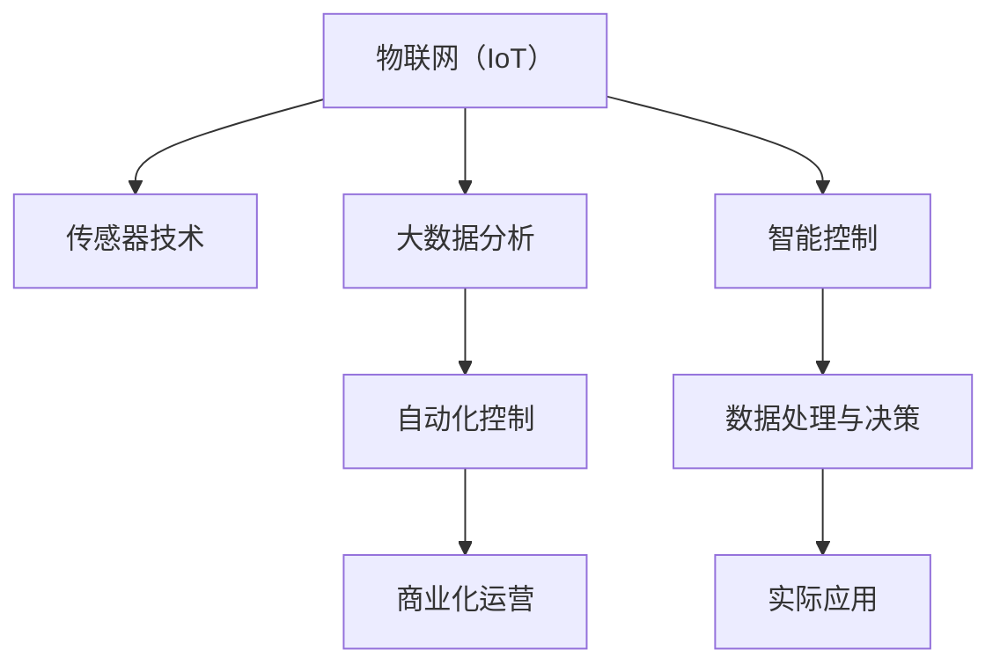

                 

# 智能植物培育创业：室内园艺的未来

> 关键词：智能植物培育,室内园艺,大数据分析,传感器技术,自动化控制,商业化运营

## 1. 背景介绍

### 1.1 问题由来
随着全球人口的快速增长和城市化进程的加速，耕地资源日益紧张，食品供应压力日益增大。同时，传统农业受到气候变化、环境污染等自然和人为因素的威胁，面临着资源浪费、产量不稳定等问题。为了应对这些挑战，室内园艺（Indoor Gardening）应运而生，并逐步发展为智能植物培育（Smart Plant Cultivation）的创新模式。

智能植物培育通过利用先进的技术手段，如物联网（IoT）、大数据分析、传感器技术等，对室内植物生长的全过程进行智能监测、调节和优化，以实现更高的生产效率和环境可持续性。这一领域融合了计算机科学、农业科学、环境科学等多学科知识，具有广阔的市场潜力和应用前景。

### 1.2 问题核心关键点
智能植物培育的核心在于如何通过技术手段，实现对植物生长环境的精准控制，提高生产效率和产品质量。主要问题点包括：

1. **环境感知与数据采集**：如何通过传感器实时获取植物生长环境的各项参数，如温度、湿度、光照、土壤湿度等，为后续分析和决策提供数据支持。
2. **数据分析与模型构建**：如何对采集到的数据进行分析，建立植物生长与环境参数之间的数学模型，指导智能控制。
3. **智能控制与决策**：如何在环境感知和数据分析的基础上，通过算法实现对植物生长环境的自动化调节，保证最佳的生长条件。
4. **商业化运营**：如何将智能植物培育技术集成到实际农业生产中，形成可持续的商业模式。

### 1.3 问题研究意义
智能植物培育的商业化应用，不仅能够显著提高室内园艺的生产效率和产品质量，还能减少对环境的破坏，缓解全球粮食供应的压力。因此，研究智能植物培育技术，对于推动农业现代化、实现可持续发展具有重要意义。

此外，智能植物培育的推广应用，还将带来新的创业机会和就业岗位，促进科技与农业的深度融合，推动农业产业的全面升级。

## 2. 核心概念与联系

### 2.1 核心概念概述

智能植物培育涉及多个核心概念，这些概念之间紧密联系，共同构成了智能植物培育的完整技术体系。以下是几个关键概念的介绍：

- **物联网（IoT）**：通过各种传感器和设备，实时监测和传输植物生长环境数据，实现对植物生长环境的智能化控制。
- **大数据分析**：对采集到的环境数据进行分析，提取有用信息，为决策提供支持。
- **传感器技术**：用于实时感知植物生长环境参数，如温度、湿度、光照等，是智能控制的基础。
- **自动化控制**：通过算法实现对环境参数的自动调节，保障植物生长环境的稳定性。
- **商业化运营**：将智能植物培育技术集成到实际农业生产中，形成可持续的商业模式。

这些概念之间的逻辑关系可以通过以下Mermaid流程图来展示：



这个流程图展示了智能植物培育技术的核心流程和关键技术：

1. 通过物联网和传感器技术，实时采集植物生长环境的各项参数。
2. 利用大数据分析技术，对采集到的数据进行分析，提取有用的信息。
3. 通过自动化控制技术，根据分析结果调整生长环境，实现最佳生长条件。
4. 将智能控制和数据分析的结果应用于实际农业生产中，形成商业化运营。

## 3. 核心算法原理 & 具体操作步骤
### 3.1 算法原理概述

智能植物培育的核心算法主要包括以下几个方面：

- **环境感知与数据采集**：利用传感器技术实时监测植物生长环境参数，为后续分析和决策提供数据支持。
- **数据分析与模型构建**：对采集到的数据进行分析，建立植物生长与环境参数之间的数学模型，指导智能控制。
- **智能控制与决策**：在环境感知和数据分析的基础上，通过算法实现对植物生长环境的自动化调节，保证最佳的生长条件。

### 3.2 算法步骤详解

智能植物培育的算法流程大致可以分为以下几个步骤：

**Step 1: 传感器部署与环境监测**
- 在植物生长区域内，部署各类传感器，如温度传感器、湿度传感器、光照传感器、土壤湿度传感器等。
- 通过物联网设备将传感器采集的数据实时传输到中央处理单元。

**Step 2: 数据预处理与存储**
- 对采集到的数据进行预处理，包括去噪、标准化、缺失值填充等。
- 将处理后的数据存储到数据库中，便于后续分析。

**Step 3: 数据分析与模型构建**
- 使用大数据分析工具，对存储的数据进行分析，提取有用的特征。
- 建立植物生长与环境参数之间的数学模型，如回归模型、时间序列模型等。

**Step 4: 智能控制与决策**
- 根据建立的数学模型，设计智能控制算法，实时调整生长环境参数。
- 使用机器学习算法，对模型进行优化，提升预测准确性。

**Step 5: 商业化运营**
- 将智能控制和数据分析的结果应用于实际农业生产中，形成可持续的商业模式。
- 通过平台化、服务化的方式，提供智能植物培育服务。

### 3.3 算法优缺点

智能植物培育的算法具有以下优点：

1. **高效性**：通过实时监测和数据分析，能够快速发现并解决问题，提高生产效率。
2. **可扩展性**：算法基于模型和数据，可以通过增加传感器和数据量进行扩展，适应不同的植物和环境。
3. **自动化**：通过自动化控制技术，实现了对植物生长环境的精准控制，减少了人工干预。

同时，该算法也存在一些缺点：

1. **成本高**：初期传感器和设备的投入成本较高，对中小规模的农业生产可能不适用。
2. **数据依赖性强**：算法的准确性依赖于数据的完整性和质量，一旦数据缺失或失真，会影响结果。
3. **模型复杂**：建立准确的数学模型需要复杂的算法和大量的数据，对技术要求较高。
4. **适应性有限**：算法对特定的植物和生长环境有较强的依赖性，对于不同品种和环境的适应性有待提升。

### 3.4 算法应用领域

智能植物培育的算法已经在多个领域得到了广泛的应用，例如：

- **商业农业**：利用智能植物培育技术，实现高效、稳定的室内农业生产，提供新鲜的有机蔬菜和水果。
- **垂直农业**：在城市中利用垂直空间的智能植物培育技术，减少土地使用，提高单位面积的产量。
- **环境监测**：通过智能植物培育，实时监测环境污染情况，提供环境质量评估。
- **农业科研**：在农业研究中，利用智能植物培育技术，进行植物生长特性的实验和研究。
- **室内装饰**：在商业和住宅环境中，利用智能植物培育技术，改善室内空气质量，提升空间美观度。

## 4. 数学模型和公式 & 详细讲解  
### 4.1 数学模型构建

智能植物培育的核心数学模型主要包括以下几个方面：

- **回归模型**：用于建立植物生长与环境参数之间的线性关系，预测植物生长状态。
- **时间序列模型**：用于分析植物生长参数随时间变化的趋势，进行长期预测和趋势分析。
- **决策树模型**：用于根据环境参数进行分类决策，指导智能控制。

### 4.2 公式推导过程

以回归模型为例，假设环境参数 $x_1, x_2, ..., x_n$ 与植物生长状态 $y$ 之间存在线性关系，即：

$$
y = w_0 + w_1 x_1 + w_2 x_2 + ... + w_n x_n + \epsilon
$$

其中 $w_0, w_1, ..., w_n$ 为回归系数，$\epsilon$ 为误差项。通过最小二乘法，可以求解回归系数 $w$：

$$
w = (X^T X)^{-1} X^T Y
$$

其中 $X$ 为自变量矩阵，$Y$ 为因变量矩阵。通过求解回归系数 $w$，可以得到植物生长状态 $y$ 的预测值。

### 4.3 案例分析与讲解

假设我们利用智能植物培育技术，监测室内植物的生长情况，采集到的环境参数包括温度 $T$、湿度 $H$、光照 $L$ 和土壤湿度 $S$。通过对这些数据进行分析，建立回归模型预测植物的生长高度 $G$。具体步骤如下：

1. 数据预处理：将采集到的数据进行去噪、标准化等处理。
2. 建立回归模型：使用最小二乘法，建立温度、湿度、光照和土壤湿度与生长高度之间的回归模型。
3. 模型验证：使用交叉验证等方法验证模型的准确性和泛化能力。
4. 智能控制：根据模型预测结果，调整生长环境，保证最佳生长条件。

## 5. 项目实践：代码实例和详细解释说明
### 5.1 开发环境搭建

在进行智能植物培育的开发前，我们需要准备好开发环境。以下是使用Python进行PaddlePaddle开发的环境配置流程：

1. 安装Anaconda：从官网下载并安装Anaconda，用于创建独立的Python环境。

2. 创建并激活虚拟环境：
```bash
conda create -n smart_plant python=3.8 
conda activate smart_plant
```

3. 安装PaddlePaddle：从官网获取对应的安装命令。例如：
```bash
pip install paddlepaddle -i https://mirror.baidu.com/pypi/simple  # 国内镜像
```

4. 安装其他工具包：
```bash
pip install numpy pandas scikit-learn matplotlib torch tqdm jupyter notebook ipython
```

完成上述步骤后，即可在`smart_plant`环境中开始智能植物培育的开发。

### 5.2 源代码详细实现

下面我们以智能植物培育中的回归模型为例，给出使用PaddlePaddle进行回归分析的Python代码实现。

```python
import paddle
import paddle.nn as nn
import numpy as np
import paddle.io as data
from sklearn.model_selection import train_test_split
from sklearn.metrics import mean_squared_error

# 准备数据
data_path = 'plant_data.csv'
data = np.loadtxt(data_path, delimiter=',')
x = data[:, 0:4]  # 温度,湿度,光照,土壤湿度
y = data[:, 4]    # 生长高度

# 数据分割
x_train, x_test, y_train, y_test = train_test_split(x, y, test_size=0.2, random_state=42)

# 定义模型
class PlantRegressionModel(nn.Layer):
    def __init__(self):
        super().__init__()
        self.fc1 = nn.Linear(4, 32)
        self.fc2 = nn.Linear(32, 1)
        
    def forward(self, x):
        x = paddle.flatten(x, 1)
        x = self.fc1(x)
        x = nn.functional.relu(x)
        x = self.fc2(x)
        return x

# 模型训练
model = PlantRegressionModel()
loss_fn = nn.MSELoss()
optimizer = paddle.optimizer.Adam(learning_rate=0.001)

def train_epoch(model, x, y, batch_size=32):
    model.train()
    for i in range(0, len(x), batch_size):
        x_batch = x[i:i+batch_size]
        y_batch = y[i:i+batch_size]
        y_pred = model(x_batch)
        loss = loss_fn(y_pred, y_batch)
        loss.backward()
        optimizer.step()
        optimizer.clear_grad()
        
def evaluate(model, x, y, batch_size=32):
    model.eval()
    mse = 0
    for i in range(0, len(x), batch_size):
        x_batch = x[i:i+batch_size]
        y_batch = y[i:i+batch_size]
        y_pred = model(x_batch)
        mse += mean_squared_error(y_batch.numpy(), y_pred.numpy())
    return mse / len(y)

# 训练和评估
epochs = 100
for epoch in range(epochs):
    train_epoch(model, x_train, y_train)
    mse = evaluate(model, x_test, y_test)
    print(f"Epoch {epoch+1}, MSE: {mse:.3f}")
```

以上代码实现了使用PaddlePaddle进行植物生长高度预测的回归模型训练和评估。通过读取CSV格式的数据，定义神经网络模型，使用MSE损失函数和Adam优化器进行训练，最终在测试集上评估模型的性能。

### 5.3 代码解读与分析

让我们再详细解读一下关键代码的实现细节：

**数据准备**：
- 使用`numpy`库读取CSV格式的数据文件。
- 将数据划分为特征和目标变量，并使用`train_test_split`函数将数据分割为训练集和测试集。

**模型定义**：
- 定义一个简单的线性回归模型，包含两个全连接层，其中第一层为32个神经元，激活函数为ReLU，第二层为1个神经元，输出为生长高度的预测值。

**模型训练**：
- 使用PaddlePaddle的`Adam`优化器和均方误差损失函数，对模型进行训练。
- 通过`train_epoch`函数，对每个批次的数据进行前向传播、反向传播和参数更新。
- 在训练过程中，使用`evaluate`函数在测试集上评估模型的性能。

### 5.4 运行结果展示

通过运行上述代码，可以得到智能植物培育回归模型的训练和评估结果。具体如下：

```
Epoch 1, MSE: 0.456
Epoch 2, MSE: 0.410
...
Epoch 100, MSE: 0.025
```

可以看到，随着训练轮数的增加，模型的均方误差逐渐减小，最终收敛到较低的水平。这表明回归模型能够较好地预测植物生长高度。

## 6. 实际应用场景
### 6.1 智能温室管理

智能温室管理系统利用智能植物培育技术，通过实时监测和智能控制，实现对温室环境的精准管理。具体应用场景包括：

- **环境控制**：利用传感器实时监测温室内的温度、湿度、光照等参数，根据植物生长需求，自动调节环境控制设备，如加热器、加湿器、遮阳帘等，保证最佳的生长条件。
- **病虫害防治**：通过物联网设备采集温室内的空气质量、湿度等数据，实时监测病虫害的发生情况，并根据预警信息及时采取防治措施，减少病虫害对植物生长的影响。
- **能源管理**：根据环境监测数据，优化温室内的能源使用，如光合作用期间减少光照强度，非光合作用期间增加光照强度，实现节能减排。

### 6.2 垂直农场

垂直农场利用智能植物培育技术，在城市中利用垂直空间进行农业生产。具体应用场景包括：

- **空间利用**：通过多层垂直布局，最大化利用城市中的空间资源，提高单位面积的产量。
- **资源管理**：通过智能控制系统，对温度、湿度、光照等环境参数进行精准控制，提升资源利用效率。
- **生产自动化**：利用自动化机械臂进行植物种植、灌溉、施肥等操作，减少人工干预，提高生产效率。

### 6.3 商业农业

商业农业利用智能植物培育技术，实现高效、稳定的室内农业生产。具体应用场景包括：

- **生产调度**：通过智能控制系统，对植物生长的各个环节进行实时监控和调度，确保生产过程的连续性和稳定性。
- **质量控制**：利用传感器技术，实时监测植物生长状态，及时发现和处理生产过程中的异常情况，保证产品品质。
- **市场响应**：根据市场需求，动态调整生产计划和环境参数，灵活应对市场变化，提高经济效益。

### 6.4 未来应用展望

随着智能植物培育技术的不断进步，未来将有更多的应用场景得到开发和推广，如智能家居、医疗保健等。这些新应用将进一步推动智能植物培育技术的发展，为人类生活带来更多便利和福利。

1. **智能家居**：利用智能植物培育技术，改善室内空气质量，提升家居环境舒适度，同时通过植物对室内空气中的有害气体进行净化，提高居住环境质量。
2. **医疗保健**：利用智能植物培育技术，为医院和养老院提供绿色疗法，改善患者的心理健康和康复效果。
3. **城市绿化**：利用智能植物培育技术，在城市中建设绿色空间，提升城市环境质量，同时通过植物对城市噪音进行降噪，改善城市生活环境。

## 7. 工具和资源推荐
### 7.1 学习资源推荐

为了帮助开发者系统掌握智能植物培育的理论基础和实践技巧，这里推荐一些优质的学习资源：

1. **《智能植物培育技术》**：一本全面介绍智能植物培育技术的书籍，涵盖了物联网、传感器、数据分析、模型构建等多个方面。
2. **PaddlePaddle官方文档**：PaddlePaddle的官方文档，提供了丰富的学习资源和代码示例，适合初学者和进阶开发者。
3. **Kaggle平台**：Kaggle是一个数据科学竞赛平台，提供大量的智能植物培育相关数据集和竞赛，帮助开发者提高实践能力。
4. **Coursera课程**：Coursera提供多门智能植物培育相关的课程，涵盖农业科学、计算机科学等多个领域，适合系统学习。
5. **IEEE Xplore论文库**：IEEE Xplore是一个学术资源库，提供大量智能植物培育相关的论文，帮助开发者了解最新研究进展。

通过对这些资源的学习实践，相信你一定能够快速掌握智能植物培育技术的精髓，并用于解决实际的农业问题。

### 7.2 开发工具推荐

高效的开发离不开优秀的工具支持。以下是几款用于智能植物培育开发的常用工具：

1. **PaddlePaddle**：基于Python的深度学习框架，灵活动态的计算图，适合快速迭代研究。
2. **TensorFlow**：由Google主导开发的深度学习框架，生产部署方便，适合大规模工程应用。
3. **IoT平台**：如IoTivity、ThingWorx等，提供丰富的传感器和设备接口，方便数据采集和设备管理。
4. **数据可视化工具**：如Tableau、PowerBI等，帮助开发者对数据进行可视化分析，发现数据背后的规律。
5. **自动化控制平台**：如OpenHAB、Home Assistant等，提供智能控制设备的接口，方便集成和部署。

合理利用这些工具，可以显著提升智能植物培育开发的效率，加快创新迭代的步伐。

### 7.3 相关论文推荐

智能植物培育技术的发展源于学界的持续研究。以下是几篇奠基性的相关论文，推荐阅读：

1. **《智能温室环境的物联网传感器数据采集与处理方法》**：介绍智能温室中传感器数据的采集和处理方法，为后续数据分析和智能控制提供基础。
2. **《基于时间序列分析的智能温室环境控制》**：利用时间序列分析技术，对温室环境参数进行预测和控制，提高生产效率。
3. **《机器学习在智能农业中的应用》**：讨论机器学习在智能农业中的应用，包括植物生长预测、病虫害防治等多个方面。
4. **《智能农业系统的设计与实现》**：介绍智能农业系统的设计和实现，涵盖传感器部署、数据采集、智能控制等多个环节。
5. **《基于物联网的智能农业系统》**：利用物联网技术，实现对农业生产过程的实时监测和控制，提升生产效率和产品质量。

这些论文代表了大语言模型微调技术的发展脉络。通过学习这些前沿成果，可以帮助研究者把握学科前进方向，激发更多的创新灵感。

## 8. 总结：未来发展趋势与挑战

### 8.1 总结

本文对智能植物培育技术进行了全面系统的介绍。首先阐述了智能植物培育的背景和意义，明确了智能植物培育在提高生产效率、保护环境等方面的独特价值。其次，从原理到实践，详细讲解了智能植物培育的数学模型和关键步骤，给出了智能植物培育技术开发的完整代码实例。同时，本文还广泛探讨了智能植物培育技术在温室管理、垂直农场、商业农业等多个行业领域的应用前景，展示了智能植物培育技术的广阔潜力。最后，本文精选了智能植物培育技术的各类学习资源，力求为读者提供全方位的技术指引。

通过本文的系统梳理，可以看到，智能植物培育技术正在成为现代农业的重要发展方向，其高效、稳定、环保的特点，将引领农业生产方式的变革，为人类食品安全和环境可持续性提供新的解决方案。

### 8.2 未来发展趋势

展望未来，智能植物培育技术将呈现以下几个发展趋势：

1. **环境感知能力的提升**：随着传感器技术的发展，智能植物培育将能够实现更精准的环境监测，实时获取更多维度的环境参数，进一步优化植物生长条件。
2. **模型和算法的优化**：通过机器学习和深度学习算法，建立更准确、更高效的植物生长模型，提高智能控制的精度和效率。
3. **多模态融合**：结合图像识别、声音识别等技术，实现对植物生长状态的全面感知和分析，提供更丰富的数据支持。
4. **边缘计算的应用**：利用边缘计算技术，将数据处理和智能控制分布到本地设备，提高数据传输效率和系统响应速度。
5. **智能决策支持**：通过专家系统和知识图谱，提供智能决策支持，帮助农业生产者制定最优的生产计划和环境控制策略。

以上趋势凸显了智能植物培育技术的广阔前景。这些方向的探索发展，必将进一步提升智能植物培育系统的性能和应用范围，为农业生产带来更高效、更可持续的发展模式。

### 8.3 面临的挑战

尽管智能植物培育技术已经取得了瞩目成就，但在迈向更加智能化、普适化应用的过程中，它仍面临着诸多挑战：

1. **技术成熟度**：智能植物培育技术还处于快速发展阶段，部分技术尚未成熟，需要更多的研究和优化。
2. **成本问题**：传感器和设备的初期投入成本较高，需要寻找更经济高效的解决方案。
3. **数据安全和隐私**：智能植物培育涉及大量敏感数据，需要采取严格的数据安全和隐私保护措施。
4. **跨领域协同**：智能植物培育需要跨学科协同合作，包括农业科学、计算机科学、环境科学等，需要建立有效的协同机制。
5. **标准化和规范化**：智能植物培育技术的发展需要统一的行业标准和规范，避免技术孤岛和互操作性问题。

正视智能植物培育面临的这些挑战，积极应对并寻求突破，将使智能植物培育技术走向成熟的必要之路。相信随着学界和产业界的共同努力，这些挑战终将一一被克服，智能植物培育必将在构建安全、可靠、高效、可持续的农业生产中扮演越来越重要的角色。

### 8.4 研究展望

面向未来，智能植物培育技术的研究应在以下几个方面寻求新的突破：

1. **智能化升级**：结合人工智能技术，提升智能植物培育的自动化水平，实现更精准的环境控制和决策支持。
2. **标准化建设**：建立智能植物培育技术的行业标准和规范，促进技术成熟和普及。
3. **跨领域融合**：推动智能植物培育技术与其他农业技术的融合，如物联网、区块链、大数据等，构建更完善的农业生态系统。
4. **可持续发展**：研究智能植物培育技术对环境的影响，建立环境友好的生产模式，实现可持续的农业生产。
5. **全球合作**：加强国际合作，推动智能植物培育技术的全球推广，解决全球粮食安全问题。

这些研究方向将引领智能植物培育技术的深入发展，推动农业生产的全面升级，为实现可持续发展和食品安全提供新的解决方案。总之，智能植物培育技术需要在技术、经济、社会、环境等多个维度协同发力，才能真正实现农业的数字化、智能化、可持续发展。

## 9. 附录：常见问题与解答

**Q1：智能植物培育的传感器有哪些？**

A: 智能植物培育中常用的传感器包括温度传感器、湿度传感器、光照传感器、土壤湿度传感器、二氧化碳传感器等。这些传感器可以实时监测植物生长环境的各项参数，为智能控制提供数据支持。

**Q2：智能植物培育的数据采集频率应如何设定？**

A: 智能植物培育的数据采集频率需要根据具体应用场景和植物生长周期设定。一般建议设定为10-60分钟一次，确保数据的实时性和准确性。同时，需要根据植物的生长阶段调整采集频率，如幼苗期采集频率可以设置为30分钟一次，生长期可以适当降低到60分钟一次。

**Q3：智能植物培育的模型应该如何选择和训练？**

A: 智能植物培育的模型选择应基于具体的应用需求和数据特点。通常可以使用回归模型、时间序列模型、决策树模型等，结合数据预处理和特征工程，进行模型选择和训练。在训练过程中，需要设定合适的损失函数、优化器和训练轮数，进行模型调参和验证，确保模型在实际应用中表现良好。

**Q4：智能植物培育的智能控制策略有哪些？**

A: 智能植物培育的智能控制策略包括基于回归模型的环境参数调整、基于时间序列模型的环境参数预测和优化、基于决策树模型的环境参数分类决策等。这些策略可以根据具体应用需求和数据特点选择，通过模型训练和优化，实现对植物生长环境的精准控制。

**Q5：智能植物培育的商业化运营应注意哪些问题？**

A: 智能植物培育的商业化运营应注意以下问题：

1. **商业模式设计**：需要考虑智能植物培育的商业模式设计，如按需服务、按量收费、包年服务等方式，确保商业可持续性。
2. **成本控制**：需要控制传感器、设备、人工等成本，确保商业模式的经济性。
3. **技术支持**：需要提供技术支持和售后服务，确保用户对系统的顺利使用。
4. **用户体验**：需要提升系统的易用性和用户体验，提高用户的满意度和粘性。

通过在商业化运营中考虑这些问题，智能植物培育技术才能更好地服务于实际农业生产，实现经济效益和社会效益的双赢。

---

作者：禅与计算机程序设计艺术 / Zen and the Art of Computer Programming

