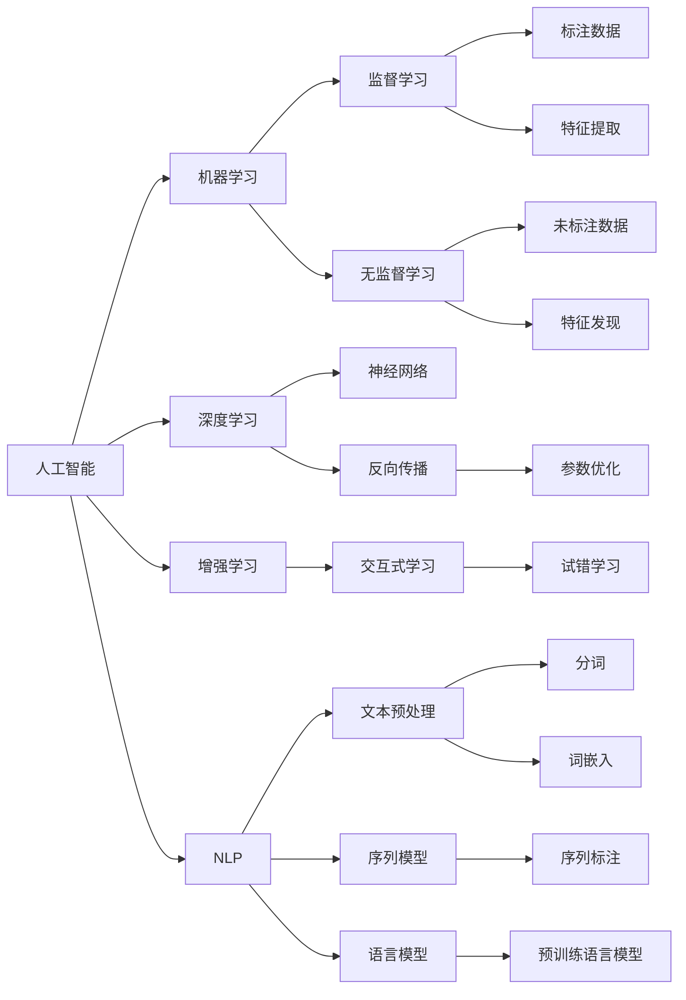

                 

## 1. 背景介绍

在过去的几十年里，人工智能（AI）技术取得了显著的进步，并在多个领域得到广泛应用，从自动驾驶到医疗诊断，再到金融分析，AI技术正逐步改变我们的工作和生活方式。然而，这些技术带来的变化同时也引发了关于未来工作形态的深刻思考。本文将探讨AI技术如何塑造未来的工作环境，并分析与之共存的趋势。

## 2. 核心概念与联系

### 2.1 核心概念概述

在探讨未来工作形态与AI共存的趋势之前，我们需要先了解几个核心概念：

- **人工智能**：指的是使计算机系统能够执行通常需要人类智能的任务，如感知、学习、推理、规划、自然语言理解和视觉识别。

- **机器学习**：是一种通过数据和算法让机器自主学习并改进性能的技术，是实现AI的核心方法之一。

- **深度学习**：是机器学习的一个分支，基于神经网络结构，能够处理复杂的非线性关系，适用于大规模数据分析和模式识别任务。

- **增强学习**：通过与环境互动，让机器自主学习如何做出最优决策。

- **自然语言处理（NLP）**：是AI的一个重要分支，专注于使计算机能够理解、解析和生成人类语言。

这些核心概念通过相互协作，推动了AI技术的不断进步，并在实际应用中呈现出多样化的趋势。

### 2.2 核心概念原理和架构的 Mermaid 流程图



### 2.3 核心概念之间的联系

从上述流程图可以看出，各个核心概念之间存在着紧密的联系。深度学习作为机器学习的一个重要分支，利用神经网络结构处理复杂非线性关系，是实现AI的关键技术之一。NLP是AI的一个重要应用领域，通过自然语言处理技术，使得机器能够理解和生成人类语言。增强学习通过与环境的互动，让机器自主学习最优决策。机器学习和深度学习技术为这些应用提供了坚实的理论基础和算法支撑。

## 3. 核心算法原理 & 具体操作步骤

### 3.1 算法原理概述

AI技术在未来的工作形态中将发挥重要作用。通过自动化和智能化的手段，AI可以大大提升工作效率，优化工作流程，甚至改变某些行业的作业方式。以下是几种核心算法原理：

#### 3.1.1 深度学习算法

深度学习通过多层神经网络，能够自动从数据中提取特征，并进行复杂分类和预测。在实际应用中，深度学习模型通常需要大量的标注数据进行训练，以确保其泛化能力和准确性。

#### 3.1.2 增强学习算法

增强学习通过试错学习，让机器在与环境的互动中不断优化决策策略。例如，在自动驾驶领域，增强学习算法可以帮助车辆在复杂道路环境中做出最优驾驶决策。

#### 3.1.3 NLP算法

NLP算法使机器能够理解和生成人类语言。通过预训练语言模型，如BERT、GPT等，NLP技术可以实现自动文本摘要、情感分析、机器翻译等任务。

### 3.2 算法步骤详解

#### 3.2.1 深度学习算法步骤

1. **数据准备**：收集和预处理数据集，包括数据清洗、标注等步骤。

2. **模型构建**：设计神经网络结构，选择合适的损失函数和优化算法。

3. **模型训练**：使用标注数据对模型进行训练，并通过反向传播算法更新模型参数。

4. **模型评估**：在测试集上评估模型性能，根据指标进行调优。

5. **模型应用**：将训练好的模型应用于实际问题中，进行预测和分类。

#### 3.2.2 增强学习算法步骤

1. **环境定义**：定义环境状态和动作空间，以及奖励函数。

2. **模型选择**：选择适合的增强学习算法，如Q-learning、SARSA等。

3. **策略学习**：通过与环境的交互，让机器自主学习最优策略。

4. **策略评估**：评估学习到的策略在实际环境中的表现。

5. **策略优化**：通过迭代优化，提升策略的性能。

#### 3.2.3 NLP算法步骤

1. **数据预处理**：包括文本清洗、分词、词性标注等步骤。

2. **特征提取**：将文本转换为数值向量，用于模型输入。

3. **模型训练**：使用预训练语言模型，对文本进行微调，以适应特定任务。

4. **模型评估**：在测试集上评估模型性能，如F1-score、BLEU等指标。

5. **模型应用**：将训练好的模型应用于实际任务中，如自动摘要、问答系统等。

### 3.3 算法优缺点

#### 3.3.1 深度学习算法的优缺点

**优点**：
- 能够处理复杂非线性关系，适用于大规模数据分析。
- 自动提取特征，减少了人工特征工程的工作量。
- 在图像、语音等复杂领域表现优异。

**缺点**：
- 需要大量标注数据进行训练，数据准备成本高。
- 模型复杂，训练和推理速度较慢。
- 存在过拟合风险，需要精心调参。

#### 3.3.2 增强学习算法的优缺点

**优点**：
- 通过试错学习，能够适应复杂环境，灵活性高。
- 自主决策能力强，适用于需要实时响应的场景。
- 能够不断优化策略，提升性能。

**缺点**：
- 需要大量试错次数，训练时间长。
- 模型稳定性和鲁棒性较差，容易受到环境干扰。
- 需要精心设计奖励函数，影响算法效果。

#### 3.3.3 NLP算法的优缺点

**优点**：
- 能够理解和生成自然语言，适用于文本处理任务。
- 预训练语言模型在大规模数据上表现优异，效果好。
- 能够处理多语言文本，具有普适性。

**缺点**：
- 数据准备和预处理工作量大。
- 模型复杂，训练和推理开销高。
- 存在语言歧义，理解难度高。

### 3.4 算法应用领域

AI技术已经广泛应用于多个领域，包括：

- **医疗**：通过AI辅助诊断、药物研发等，提高医疗服务的效率和准确性。
- **金融**：通过AI进行风险评估、投资策略优化等，提升金融机构的决策能力。
- **制造**：通过AI进行质量检测、流程优化等，提升制造业的自动化水平。
- **物流**：通过AI进行路线规划、配送优化等，提升物流效率。
- **教育**：通过AI进行个性化教学、学习效果评估等，提升教育质量。
- **娱乐**：通过AI进行内容推荐、智能交互等，提升用户体验。

## 4. 数学模型和公式 & 详细讲解 & 举例说明

### 4.1 数学模型构建

#### 4.1.1 深度学习数学模型

深度学习模型通常基于多层神经网络，其数学模型可以表示为：

$$
y = f(x; \theta)
$$

其中，$x$ 为输入，$y$ 为输出，$\theta$ 为模型参数。

#### 4.1.2 增强学习数学模型

增强学习通常采用马尔可夫决策过程（MDP）模型，其数学模型可以表示为：

$$
\pi(a_t|s_t) = \sum_{s_{t+1},r_{t+1}}\pi(s_{t+1}|s_t,a_t)P(r_{t+1}|s_t,a_t)\pi(a_t|s_t)
$$

其中，$s_t$ 为环境状态，$a_t$ 为动作，$r_{t+1}$ 为奖励，$\pi$ 为策略。

#### 4.1.3 NLP数学模型

在NLP中，预训练语言模型通常使用自回归模型，其数学模型可以表示为：

$$
p(w|w_{<t}) = \prod_{i=1}^T p(w_i|w_{<i},w_{>i})
$$

其中，$w$ 为输入序列，$w_{<t}$ 为左上下文，$w_{>i}$ 为右上下文，$p$ 为概率分布。

### 4.2 公式推导过程

#### 4.2.1 深度学习公式推导

在深度学习中，通常使用反向传播算法更新模型参数，其公式为：

$$
\frac{\partial L}{\partial \theta} = \frac{\partial L}{\partial y} \cdot \frac{\partial y}{\partial \theta}
$$

其中，$L$ 为损失函数，$y$ 为模型输出。

#### 4.2.2 增强学习公式推导

在增强学习中，通常使用Q-learning算法更新模型参数，其公式为：

$$
Q(s,a) \leftarrow Q(s,a) + \alpha [r + \gamma \max Q(s',a') - Q(s,a)]
$$

其中，$Q(s,a)$ 为状态-动作价值函数，$r$ 为奖励，$\alpha$ 为学习率，$\gamma$ 为折扣因子，$s'$ 和$a'$ 为下一个状态和动作。

#### 4.2.3 NLP公式推导

在NLP中，通常使用序列标注模型进行分类，其公式为：

$$
L = -\sum_{i=1}^N \log p(y_i|x_i)
$$

其中，$L$ 为损失函数，$y_i$ 为标签，$x_i$ 为输入，$p$ 为条件概率。

### 4.3 案例分析与讲解

#### 4.3.1 深度学习案例

假设我们要训练一个图像分类模型，用于识别猫和狗的图像。我们可以使用一个简单的卷积神经网络（CNN）作为模型，其架构如下：

```
[卷积层-ReLU-池化层] x 3
[全连接层-ReLU] x 2
[输出层-softmax]
```

在训练过程中，我们可以使用交叉熵损失函数，其公式为：

$$
L = -\frac{1}{N}\sum_{i=1}^N \sum_{j=1}^C y_{ij}\log p_{ij}
$$

其中，$N$ 为样本数，$C$ 为类别数，$y_{ij}$ 为标签，$p_{ij}$ 为预测概率。

#### 4.3.2 增强学习案例

假设我们要训练一个自动驾驶模型，让车辆在复杂道路上行驶。我们可以使用深度强化学习算法，如Deep Q-Network（DQN）。在训练过程中，我们可以定义状态空间为车辆的位置、速度、方向等信息，动作空间为加速、减速、转向等操作。我们设计一个奖励函数，奖励车辆在安全、高效地完成任务，并使用Q-learning算法更新模型参数。

#### 4.3.3 NLP案例

假设我们要训练一个情感分析模型，用于分析用户评论的情绪。我们可以使用预训练语言模型BERT作为基础模型，并将其用于情感分类任务。在微调过程中，我们可以使用交叉熵损失函数，其公式为：

$$
L = -\frac{1}{N}\sum_{i=1}^N \sum_{j=1}^K y_{ij}\log p_{ij}
$$

其中，$N$ 为样本数，$K$ 为情感类别数，$y_{ij}$ 为标签，$p_{ij}$ 为预测概率。

## 5. 项目实践：代码实例和详细解释说明

### 5.1 开发环境搭建

在进行AI技术应用开发前，我们需要准备开发环境。以下是Python环境下使用PyTorch进行深度学习和增强学习的开发环境配置流程：

1. 安装Anaconda：从官网下载并安装Anaconda，用于创建独立的Python环境。

2. 创建并激活虚拟环境：
```bash
conda create -n pytorch-env python=3.8 
conda activate pytorch-env
```

3. 安装PyTorch：根据CUDA版本，从官网获取对应的安装命令。例如：
```bash
conda install pytorch torchvision torchaudio cudatoolkit=11.1 -c pytorch -c conda-forge
```

4. 安装TensorFlow：下载并安装TensorFlow，以支持增强学习算法的实现。

5. 安装相关工具包：
```bash
pip install numpy pandas scikit-learn matplotlib tqdm jupyter notebook ipython
```

完成上述步骤后，即可在`pytorch-env`环境中开始AI开发实践。

### 5.2 源代码详细实现

#### 5.2.1 深度学习代码实现

首先，定义一个简单的CNN模型：

```python
import torch
import torch.nn as nn

class CNN(nn.Module):
    def __init__(self):
        super(CNN, self).__init__()
        self.conv1 = nn.Conv2d(3, 32, 3, 1)
        self.pool = nn.MaxPool2d(2, 2)
        self.fc1 = nn.Linear(32*8*8, 128)
        self.fc2 = nn.Linear(128, 2)
        
    def forward(self, x):
        x = self.pool(torch.relu(self.conv1(x)))
        x = x.view(-1, 32*8*8)
        x = torch.relu(self.fc1(x))
        x = self.fc2(x)
        return x
```

然后，定义数据集和数据加载器：

```python
from torch.utils.data import Dataset, DataLoader

class ImageDataset(Dataset):
    def __init__(self, data, labels):
        self.data = data
        self.labels = labels
        
    def __len__(self):
        return len(self.data)
    
    def __getitem__(self, index):
        return self.data[index], self.labels[index]

train_dataset = ImageDataset(train_data, train_labels)
test_dataset = ImageDataset(test_data, test_labels)
train_loader = DataLoader(train_dataset, batch_size=32, shuffle=True)
test_loader = DataLoader(test_dataset, batch_size=32, shuffle=False)
```

接下来，定义训练和评估函数：

```python
import torch.optim as optim
from torch.autograd import Variable

def train_epoch(model, data_loader, optimizer, criterion):
    model.train()
    epoch_loss = 0
    for batch in data_loader:
        inputs, labels = batch
        inputs = Variable(inputs)
        labels = Variable(labels)
        optimizer.zero_grad()
        outputs = model(inputs)
        loss = criterion(outputs, labels)
        loss.backward()
        optimizer.step()
        epoch_loss += loss.data[0]
    return epoch_loss / len(data_loader)

def evaluate(model, data_loader, criterion):
    model.eval()
    epoch_loss = 0
    for batch in data_loader:
        inputs, labels = batch
        inputs = Variable(inputs, volatile=True)
        labels = Variable(labels, volatile=True)
        outputs = model(inputs)
        loss = criterion(outputs, labels)
        epoch_loss += loss.data[0]
    return epoch_loss / len(data_loader)
```

最后，启动训练流程：

```python
epochs = 10
learning_rate = 0.01
criterion = nn.CrossEntropyLoss()
optimizer = optim.SGD(model.parameters(), lr=learning_rate)

for epoch in range(epochs):
    train_loss = train_epoch(model, train_loader, optimizer, criterion)
    print('Epoch %d, train loss: %.4f' % (epoch+1, train_loss))
    
    test_loss = evaluate(model, test_loader, criterion)
    print('Epoch %d, test loss: %.4f' % (epoch+1, test_loss))
```

### 5.3 代码解读与分析

让我们再详细解读一下关键代码的实现细节：

**CNN模型**：
- 定义了卷积层、池化层和全连接层，用于处理图像数据。

**数据集和数据加载器**：
- 定义了一个自定义的ImageDataset类，用于加载图像数据和标签。
- 使用PyTorch的数据加载器，对数据进行批处理和打乱，提高训练效率。

**训练和评估函数**：
- 定义了训练和评估函数，对模型进行前向传播、计算损失、反向传播和参数更新。
- 使用SGD优化算法，学习率为0.01，交叉熵损失函数，评估训练集和测试集的损失。

**训练流程**：
- 定义总的epoch数和学习率，启动循环迭代。
- 在每个epoch内，先在训练集上训练，输出平均损失。
- 在验证集上评估，输出测试集损失。
- 记录训练和测试损失，帮助监控模型性能。

### 5.4 运行结果展示

在训练完成后，我们可以使用测试集对模型进行评估，计算准确率、召回率和F1-score等指标：

```python
from sklearn.metrics import accuracy_score, recall_score, f1_score

model.eval()
test_pred = model(test_data)
test_pred = torch.max(test_pred, 1)[1]
test_labels = test_labels.numpy()
test_acc = accuracy_score(test_labels, test_pred)
test_recall = recall_score(test_labels, test_pred)
test_f1 = f1_score(test_labels, test_pred)
print('Test Accuracy: %.4f' % test_acc)
print('Test Recall: %.4f' % test_recall)
print('Test F1-score: %.4f' % test_f1)
```

## 6. 实际应用场景

### 6.1 智能制造

AI技术在智能制造中的应用已经相当广泛，从自动化生产线到预测性维护，AI技术正在逐步改变制造业的面貌。例如，使用深度学习算法进行质量检测、异常检测，可以大大提高产品的质量和生产效率。增强学习算法可以用于优化生产计划和调度，提高生产线的灵活性和响应速度。

### 6.2 智能交通

在智能交通领域，AI技术主要用于自动驾驶、智能交通管理和路况预测。自动驾驶技术通过增强学习算法，训练车辆在复杂交通环境中做出最优决策。智能交通管理通过深度学习算法，分析交通流量数据，优化交通信号控制。路况预测则通过NLP技术，对实时交通数据进行分析和预测，提供实时路况信息。

### 6.3 智慧医疗

AI技术在智慧医疗中的应用包括疾病诊断、医疗影像分析、个性化治疗等。深度学习算法可以用于分析医学影像，提高诊断准确性和速度。增强学习算法可以用于优化治疗方案，根据患者的历史数据和实时监测数据，动态调整治疗策略。NLP技术可以用于分析医学文献，提取有用的知识。

### 6.4 未来应用展望

随着AI技术的不断进步，未来AI技术将在更多领域得到应用。例如：

- **智能家居**：通过NLP技术，实现语音助手、智能控制等。
- **智能客服**：通过NLP技术，实现自动化客服，提高客户体验。
- **智能金融**：通过AI技术，进行风险评估、投资策略优化等。
- **智能教育**：通过AI技术，实现个性化教学、学习效果评估等。
- **智能医疗**：通过AI技术，进行疾病诊断、治疗方案优化等。

## 7. 工具和资源推荐

### 7.1 学习资源推荐

为了帮助开发者系统掌握AI技术的应用，这里推荐一些优质的学习资源：

1. **深度学习课程**：斯坦福大学的《CS231n: Convolutional Neural Networks for Visual Recognition》课程，涵盖了深度学习在图像识别中的应用。
2. **增强学习课程**：加州大学伯克利分校的《CS294: Advanced Topics in Reinforcement Learning》课程，涵盖了增强学习的基本理论和算法。
3. **自然语言处理课程**：斯坦福大学的《CS224N: Natural Language Processing with Deep Learning》课程，涵盖了NLP的基本概念和算法。
4. **AI大牛博客**：OpenAI、Google AI等知名AI公司的博客，分享最新的AI研究成果和技术进展。
5. **在线学习平台**：Coursera、edX等在线学习平台，提供系统化学习AI技术的机会。

### 7.2 开发工具推荐

高效的开发离不开优秀的工具支持。以下是几款用于AI技术应用的常用工具：

1. **PyTorch**：基于Python的开源深度学习框架，灵活动态的计算图，适合快速迭代研究。
2. **TensorFlow**：由Google主导开发的开源深度学习框架，生产部署方便，适合大规模工程应用。
3. **Keras**：高层次的神经网络API，提供了简单易用的接口，适合快速原型开发。
4. **Jupyter Notebook**：交互式编程环境，支持多种编程语言，适合科研和教学。
5. **TensorBoard**：TensorFlow配套的可视化工具，可实时监测模型训练状态，并提供丰富的图表呈现方式。

### 7.3 相关论文推荐

AI技术的发展离不开学界的持续研究。以下是几篇奠基性的相关论文，推荐阅读：

1. **ImageNet Classification with Deep Convolutional Neural Networks**：AlexNet论文，提出了卷积神经网络（CNN），奠定了深度学习在计算机视觉领域的基础。
2. **Playing Atari with Deep Reinforcement Learning**：Deep Q-learning论文，展示了深度学习在强化学习中的应用，开创了深度强化学习的先河。
3. **Attention Is All You Need**：Transformer论文，提出了自注意力机制，推动了自然语言处理领域的技术发展。
4. **BERT: Pre-training of Deep Bidirectional Transformers for Language Understanding**：BERT论文，展示了预训练语言模型在自然语言处理中的巨大潜力。
5. **AlphaGo Zero: Mastering the Game of Go without Human Knowledge**：AlphaGo论文，展示了深度学习在复杂决策问题中的应用，推动了人工智能技术的不断进步。

## 8. 总结：未来发展趋势与挑战

### 8.1 研究成果总结

本文对AI技术在未来的应用进行了系统总结，包括深度学习、增强学习、自然语言处理等核心算法。通过理论推导和实际案例分析，我们展示了AI技术在智能制造、智能交通、智慧医疗等领域的广泛应用。

### 8.2 未来发展趋势

未来，AI技术将在更多领域得到应用，其发展趋势包括：

- **技术融合**：AI技术将与其他技术进行更深入的融合，如知识表示、因果推理、强化学习等，推动技术进步。
- **模型融合**：不同模型的融合将带来更强大的计算能力和泛化能力，提高系统性能。
- **跨领域应用**：AI技术将在更多领域得到应用，推动产业升级和创新。
- **普适化发展**：AI技术将向普适化方向发展，实现智能化、自动化的服务。
- **伦理道德**：AI技术的伦理道德问题将受到更多关注，确保技术应用的安全性和公平性。

### 8.3 面临的挑战

尽管AI技术取得了显著进展，但仍面临诸多挑战：

- **数据隐私**：AI技术需要大量数据进行训练，如何保护用户隐私，是一个重要问题。
- **模型透明性**：AI模型的决策过程复杂，如何提高模型的透明性和可解释性，是另一个关键问题。
- **技术伦理**：AI技术的应用过程中，如何避免技术偏见和歧视，确保技术应用的公平性和公正性。
- **计算资源**：AI技术需要大量的计算资源进行训练和推理，如何优化计算资源的使用，提高效率。
- **技术安全**：AI技术的应用过程中，如何防止恶意攻击，保护系统的安全性和稳定性。

### 8.4 研究展望

未来的研究需要在以下几个方面寻求新的突破：

- **数据隐私保护**：研究如何保护用户隐私，同时获取高质量的数据进行模型训练。
- **模型透明性**：研究如何提高AI模型的透明性和可解释性，增强模型的可信度。
- **技术伦理**：研究如何避免技术偏见和歧视，确保技术应用的公平性和公正性。
- **计算资源优化**：研究如何优化计算资源的使用，提高模型的训练和推理效率。
- **技术安全**：研究如何防止恶意攻击，保护系统的安全性和稳定性。

## 9. 附录：常见问题与解答

**Q1: AI技术在实际应用中是否会取代人类工作？**

A: AI技术在许多领域都能够提升工作效率和质量，但它不会完全取代人类工作。AI技术更多是辅助人类工作，特别是在需要大量重复性工作和数据分析的领域。人类仍然会在需要创造性、判断性和人际交往的领域中发挥重要作用。

**Q2: 使用AI技术需要哪些基础技能？**

A: 使用AI技术需要具备编程能力、数据分析能力、机器学习算法知识等基础技能。同时，还需要了解AI技术的最新进展和应用案例，不断学习和实践。

**Q3: AI技术的应用场景有哪些？**

A: AI技术在智能制造、智能交通、智慧医疗、智能客服、智能金融等领域都有广泛应用。未来，AI技术将进一步拓展到更多领域，推动社会进步。

**Q4: 如何提高AI模型的准确性？**

A: 提高AI模型的准确性需要从多个方面入手，包括数据准备、模型选择、算法优化、超参数调优等。同时，还需要持续监控模型性能，及时进行调整和优化。

**Q5: AI技术的应用前景如何？**

A: AI技术的应用前景非常广阔，随着技术的不断进步，AI技术将在更多领域得到应用，推动社会进步和产业升级。

---

作者：禅与计算机程序设计艺术 / Zen and the Art of Computer Programming

