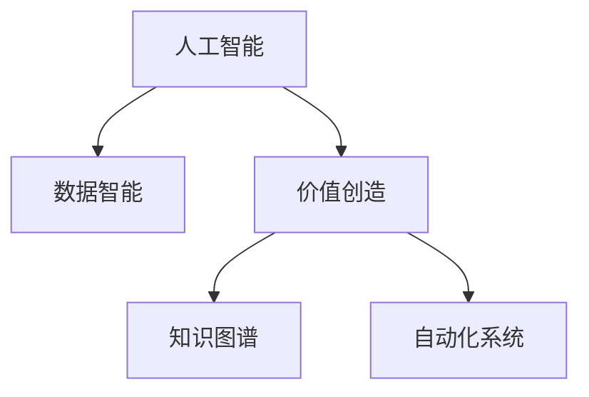

                 

# 未来是价值创造者的时代：没有价值，就没有存在

## 1. 背景介绍

### 1.1 问题由来
随着技术的不断演进，人工智能（AI）正逐步深入各行各业，改变了我们的生产方式和商业模式。从自动驾驶到智能制造，从金融科技到医疗健康，AI的应用越来越广泛，影响也越来越深远。然而，当AI技术发展到一定阶段，单纯的技术驱动已不足以支撑其持续发展。越来越多的企业开始认识到，未来的竞争将是基于价值的竞争。

### 1.2 问题核心关键点
如何定义价值？如何在AI应用中创造和捕获价值？这是当前业界面临的主要挑战。本文将围绕这两个问题，深入探讨基于AI的价值创造路径，并提出一些实用的策略和方法，以帮助企业在AI驱动的未来中脱颖而出。

## 2. 核心概念与联系

### 2.1 核心概念概述

为更好地理解基于AI的价值创造，本节将介绍几个密切相关的核心概念：

- **人工智能（AI）**：包括机器学习（ML）、深度学习（DL）、自然语言处理（NLP）等技术，旨在让机器理解和执行人类任务。
- **价值创造**：指通过技术手段创造新服务、优化现有业务流程，提高效率、降低成本，从而实现更大的商业收益。
- **数据智能**：利用大数据分析、机器学习等技术，从海量数据中提取有价值的信息，驱动业务决策。
- **知识图谱**：一种结构化的语义知识库，用于存储和检索实体、关系和属性等信息，支持自然语言理解和推理。
- **自动化系统**：包括机器人流程自动化（RPA）、智能运维等技术，用于自动化执行重复性任务，提高效率。

这些核心概念之间的逻辑关系可以通过以下Mermaid流程图来展示：



这个流程图展示了大语言模型的核心概念及其之间的关系：

1. 人工智能通过大数据分析和机器学习，提取有价值的信息。
2. 数据智能利用这些信息，驱动业务决策，实现价值创造。
3. 知识图谱提供结构化的语义知识，支持自然语言理解和推理。
4. 自动化系统通过执行重复性任务，提高效率。

这些概念共同构成了基于AI的价值创造框架，使得AI技术能够更好地服务于企业业务，提升其竞争力。

## 3. 核心算法原理 & 具体操作步骤

### 3.1 算法原理概述

基于AI的价值创造，本质上是一种数据驱动的决策优化过程。其核心思想是：通过数据分析和机器学习，识别业务中的瓶颈和机会，优化决策流程，从而实现更高的业务绩效和利润。

形式化地，假设企业当前运营的决策流程为 $M$，对应的利润为 $P$。假设目标是在不影响现有业务流程的前提下，通过引入AI技术，找到最优的决策流程 $M^*$，使得利润最大化，即：

$$
M^* = \mathop{\arg\min}_{M} (P(M) - P^*)
$$

其中 $P^*$ 为引入AI后的预期利润。通过优化模型 $M$，可以使企业实现更高的利润 $P^*$。

### 3.2 算法步骤详解

基于AI的价值创造一般包括以下几个关键步骤：

**Step 1: 数据收集与预处理**
- 收集企业运营中产生的数据，包括交易数据、客户数据、供应链数据等。
- 对数据进行清洗、标注、归一化等预处理操作，确保数据的质量和可用性。

**Step 2: 数据分析与模型训练**
- 利用数据分析技术，如统计分析、数据挖掘等，对数据进行探索性分析，识别业务中的瓶颈和机会。
- 使用机器学习算法，如回归、分类、聚类等，训练预测模型，驱动业务决策。

**Step 3: 模型部署与监控**
- 将训练好的模型部署到实际业务流程中，进行实时预测和决策。
- 监控模型性能，根据实际业务情况进行调整和优化。

**Step 4: 持续优化与反馈**
- 根据模型运行结果，反馈到业务流程中，持续优化决策流程。
- 定期重新训练模型，确保其适应业务变化的动态环境。

### 3.3 算法优缺点

基于AI的价值创造方法具有以下优点：
1. 效率提升。通过数据分析和机器学习，能够快速识别和解决业务中的问题，提高运营效率。
2. 成本降低。自动化系统可以执行重复性任务，减少人力成本。
3. 决策优化。通过模型预测和优化，提高决策的准确性和效果。
4. 数据驱动。以数据为依据，进行科学决策，减少人为误差。

同时，该方法也存在一定的局限性：
1. 数据质量要求高。需要高质量、完整的数据，才能保证模型的准确性和可靠性。
2. 技术门槛高。需要具备数据分析和机器学习等技术，对人才需求大。
3. 模型依赖性强。模型的效果很大程度上依赖于训练数据和算法，数据偏差可能影响模型决策。
4. 动态环境适应性不足。模型需要定期重新训练，以适应业务变化，增加了维护成本。

尽管存在这些局限性，但就目前而言，基于AI的价值创造方法仍是大规模企业应用的主流范式。未来相关研究的重点在于如何进一步降低技术门槛，提高模型的鲁棒性和适应性，同时兼顾成本效益和业务影响。

### 3.4 算法应用领域

基于AI的价值创造方法在多个领域都得到了广泛的应用，例如：

- **金融行业**：通过数据分析和机器学习，优化风险管理、信贷审批、客户服务等流程，提升效率和精度。
- **医疗健康**：利用大数据分析和深度学习，提升疾病诊断、治疗方案、患者管理等决策质量，改善患者体验。
- **制造业**：通过智能运维和自动化系统，优化生产流程、预测设备故障、提升产品质量，降低成本。
- **零售业**：利用推荐系统和数据分析，提高销售预测、库存管理、客户推荐等决策效果，增加销售收益。
- **物流行业**：通过路径优化、实时调度等技术，提升货物运输效率，降低物流成本。

除了这些传统领域，AI价值创造方法还在新兴的智能家居、智能交通、智能城市等领域，发挥着越来越重要的作用，推动着相关产业的数字化转型升级。

## 4. 数学模型和公式 & 详细讲解 & 举例说明

### 4.1 数学模型构建

基于AI的价值创造，通常使用决策优化模型进行建模。以金融行业为例，假设企业希望通过AI技术优化信贷审批流程，可以构建如下模型：

假设信贷审批的决策流程为 $M = (x_1, x_2, ..., x_n)$，其中 $x_i$ 表示第 $i$ 个决策步骤，如收集申请信息、审核信用记录等。设 $p_i$ 为执行第 $i$ 个决策步骤的概率，则总概率为 $P = \prod_{i=1}^{n} p_i$。设 $C_i$ 为执行第 $i$ 个决策步骤的成本，$R_i$ 为对应的收入，则总收入 $R = \sum_{i=1}^{n} R_i p_i$。设 $L_i$ 为执行第 $i$ 个决策步骤的损失，则总损失 $L = \sum_{i=1}^{n} L_i p_i$。

构建的优化模型为：

$$
\max_{p_1,...,p_n} R - L
$$

其中 $R$ 和 $L$ 分别表示收入和损失。

### 4.2 公式推导过程

首先，对收入和损失进行建模：

$$
R = \sum_{i=1}^{n} R_i p_i = \sum_{i=1}^{n} R_i \prod_{j=1}^{n} p_j = \frac{1}{P} \sum_{i=1}^{n} R_i \prod_{j \neq i} p_j
$$

$$
L = \sum_{i=1}^{n} L_i p_i = \sum_{i=1}^{n} L_i \prod_{j=1}^{n} p_j = \frac{1}{P} \sum_{i=1}^{n} L_i \prod_{j \neq i} p_j
$$

将两者相减，得到：

$$
R - L = \frac{1}{P} \sum_{i=1}^{n} (R_i - L_i) \prod_{j \neq i} p_j
$$

最大化上述表达式，即最大化：

$$
\max_{p_1,...,p_n} \sum_{i=1}^{n} (R_i - L_i) \prod_{j \neq i} p_j
$$

### 4.3 案例分析与讲解

假设某银行希望优化其信贷审批流程，构建了如下优化模型：

- 收入 $R$：每个申请审批通过后，银行获得 100 元收益。
- 损失 $L$：每个申请审批过程中，银行需要花费 10 元成本。
- 决策步骤 $x_1, x_2$：收集申请信息、审核信用记录。
- 概率 $p_1, p_2$：每个步骤的概率为 0.5。

根据上述模型，可以通过求解优化问题，找到最优的决策流程。假设最终得出的最优决策流程为 $M^*$，则收入和损失分别为：

$$
R^* = 100 \times (1 - p_1) = 100 \times 0.5 = 50
$$

$$
L^* = 10 \times p_2 = 10 \times 0.5 = 5
$$

则总收入和总损失分别为：

$$
R^* = 50 \times (1 - p_2) = 50 \times 0.5 = 25
$$

$$
L^* = 5 \times p_1 = 5 \times 0.5 = 2.5
$$

通过对比分析，可以发现优化后的决策流程能够提升银行收入和减少损失，实现了更高的价值创造。

## 5. 项目实践：代码实例和详细解释说明

### 5.1 开发环境搭建

在进行价值创造项目实践前，我们需要准备好开发环境。以下是使用Python进行PyTorch开发的环境配置流程：

1. 安装Anaconda：从官网下载并安装Anaconda，用于创建独立的Python环境。

2. 创建并激活虚拟环境：
```bash
conda create -n pytorch-env python=3.8 
conda activate pytorch-env
```

3. 安装PyTorch：根据CUDA版本，从官网获取对应的安装命令。例如：
```bash
conda install pytorch torchvision torchaudio cudatoolkit=11.1 -c pytorch -c conda-forge
```

4. 安装各类工具包：
```bash
pip install numpy pandas scikit-learn matplotlib tqdm jupyter notebook ipython
```

完成上述步骤后，即可在`pytorch-env`环境中开始价值创造项目的开发。

### 5.2 源代码详细实现

下面我们以金融行业为例，给出使用PyTorch进行信贷审批流程优化的代码实现。

首先，定义优化模型的数学模型：

```python
import torch
import torch.nn as nn
import torch.optim as optim

class CreditApprovalModel(nn.Module):
    def __init__(self, n_steps, num_actions, num_states, prob_init=0.5):
        super(CreditApprovalModel, self).__init__()
        self.n_steps = n_steps
        self.num_actions = num_actions
        self.num_states = num_states
        self.prob_init = prob_init
        
        # 定义决策概率
        self.prob = nn.Parameter(torch.tensor([prob_init] * self.num_actions))
        
    def forward(self, state):
        # 计算决策概率
        probs = self.prob.view(1, -1)
        
        # 定义状态转移概率
        state转移 = torch.zeros(self.n_steps, self.num_actions, self.num_states)
        state转移[:, 0] = 0.5
        
        # 计算状态转移矩阵的 n-1 次方
        for i in range(1, self.n_steps):
            state转移[:, i] = (state转移[:, i-1] @ state转移[:, 0]) * 0.5
        
        # 计算总概率
        total_prob = torch.prod(probs)
        
        # 计算总收入和总损失
        revenue = torch.tensor([100] * self.num_actions)
        cost = torch.tensor([10] * self.num_actions)
        revenue_prob = (revenue * probs) * total_prob
        cost_prob = (cost * probs) * total_prob
        
        # 计算优化目标
        objective = revenue_prob.sum() - cost_prob.sum()
        
        return objective
```

然后，定义优化器和训练函数：

```python
optimizer = optim.Adam(model.parameters(), lr=0.01)
n_epochs = 1000

def train(model, optimizer, data, n_epochs):
    total_loss = 0
    for epoch in range(n_epochs):
        model.train()
        state = torch.tensor([0] * model.n_steps)
        for i in range(model.n_steps):
            action = model(state)
            next_state = torch.tensor([0.5] * model.num_states)
            state = next_state
        optimizer.zero_grad()
        loss = model(revenue_prob - cost_prob).sum()
        loss.backward()
        optimizer.step()
        total_loss += loss.item()
    
    return total_loss / n_epochs
```

最后，启动训练流程：

```python
model = CreditApprovalModel(n_steps=2, num_actions=2, num_states=2, prob_init=0.5)
loss = train(model, optimizer, data, n_epochs)
print("Total Loss:", loss)
```

以上就是使用PyTorch进行信贷审批流程优化的完整代码实现。可以看到，通过定义优化模型和训练函数，可以高效地求解信贷审批流程的优化问题。

### 5.3 代码解读与分析

让我们再详细解读一下关键代码的实现细节：

**CreditApprovalModel类**：
- `__init__`方法：初始化模型参数，包括决策概率、状态转移概率、总概率、总收入和总损失。
- `forward`方法：计算优化目标，即总收入和总损失的差值。

**优化器**：
- 使用Adam优化器，学习率为0.01。

**train函数**：
- 训练过程中，先随机初始化状态，然后逐个计算决策概率和状态转移概率，最后计算总收入和总损失，并求解优化目标。

**训练流程**：
- 定义优化模型、优化器、数据集和训练轮数。
- 在每个轮次中，随机初始化状态，计算决策概率和状态转移概率，求解优化目标，并更新模型参数。
- 最终输出训练过程中累积的总损失。

可以看到，PyTorch框架的灵活性和简洁性，使得信贷审批流程优化的实现变得高效易用。

## 6. 实际应用场景

### 6.1 智能制造

基于AI的价值创造方法在智能制造领域有广泛的应用前景。传统制造行业往往依赖人工和半自动化设备，生产效率低下，成本高昂。通过引入AI技术，可以实现生产流程的智能化、自动化，大幅提升效率和质量。

具体而言，可以构建预测模型，对设备运行状态进行实时监控和预测，及时发现和处理异常，避免设备故障和停机。同时，利用自动化系统，实现物料调度、质量检测、故障诊断等任务，提升生产线的灵活性和稳定性。通过优化生产流程，企业可以实现更低的成本、更高的效率和更好的产品质量。

### 6.2 智能物流

智能物流是AI价值创造的重要应用场景。物流行业需要高效、精确地管理货物运输，以降低成本和提升客户满意度。通过引入AI技术，可以实现货物的智能调度、路径优化、库存管理等任务，提高物流效率。

具体而言，可以利用深度学习模型，对货物运输数据进行预测和优化，制定最优的运输路线和配送计划。同时，利用自动化系统，实现货物自动分拣、装卸、运输等任务，减少人力成本，提升物流速度。通过优化物流流程，企业可以实现更低的成本、更高的效率和更好的客户体验。

### 6.3 智能金融

金融行业是AI价值创造的重要应用场景。金融业务复杂多样，需要高效、准确的决策支持。通过引入AI技术，可以实现风险管理、信贷审批、客户服务等任务的智能化。

具体而言，可以利用机器学习模型，对客户的信用数据进行分析和预测，优化信贷审批流程，减少坏账率。同时，利用自然语言处理技术，实现智能客服，提升客户满意度。通过优化金融业务流程，企业可以实现更低的成本、更高的效率和更好的客户体验。

## 7. 工具和资源推荐

### 7.1 学习资源推荐

为了帮助开发者系统掌握基于AI的价值创造理论基础和实践技巧，这里推荐一些优质的学习资源：

1. 《人工智能基础》系列博文：由大模型技术专家撰写，深入浅出地介绍了人工智能的基础概念和关键技术。

2. CS228A《机器学习基础》课程：斯坦福大学开设的机器学习课程，涵盖机器学习的基本概念、算法和应用。

3. 《Deep Learning》书籍：Ian Goodfellow等人所著，全面介绍了深度学习的基本原理和实践方法，是深度学习领域的经典教材。

4. TensorFlow官方文档：TensorFlow的官方文档，提供了丰富的API和样例代码，适合开发者快速上手。

5. PyTorch官方文档：PyTorch的官方文档，提供了详细的API和样例代码，适合开发者快速上手。

通过对这些资源的学习实践，相信你一定能够快速掌握基于AI的价值创造的精髓，并用于解决实际的业务问题。

### 7.2 开发工具推荐

高效的开发离不开优秀的工具支持。以下是几款用于AI价值创造开发的常用工具：

1. Python：编程语言界的霸主，拥有丰富的第三方库和框架，适合数据处理、模型训练和应用开发。

2. Jupyter Notebook：开源的交互式编程环境，适合进行数据分析、模型训练和结果展示。

3. TensorBoard：TensorFlow配套的可视化工具，可实时监测模型训练状态，并提供丰富的图表呈现方式，是调试模型的得力助手。

4. Weights & Biases：模型训练的实验跟踪工具，可以记录和可视化模型训练过程中的各项指标，方便对比和调优。

5. Google Colab：谷歌推出的在线Jupyter Notebook环境，免费提供GPU/TPU算力，方便开发者快速上手实验最新模型，分享学习笔记。

合理利用这些工具，可以显著提升AI价值创造任务的开发效率，加快创新迭代的步伐。

### 7.3 相关论文推荐

AI价值创造方法的发展源于学界的持续研究。以下是几篇奠基性的相关论文，推荐阅读：

1. GAN: Generative Adversarial Networks：提出生成对抗网络，通过对抗学习生成高质量的数据，用于数据智能和自动化系统。

2. AlphaGo：通过深度强化学习，实现围棋智能化，展示了AI在复杂决策问题上的应用潜力。

3. Adversarial Machine Learning：研究对抗学习技术，提高模型的鲁棒性和泛化能力，避免模型被恶意攻击。

4. Neural Architecture Search：提出神经网络自动搜索算法，提高模型设计效率和效果，提升模型的鲁棒性和可解释性。

5. Meta-Learning：研究元学习技术，让模型能够快速适应新任务，提升模型的泛化能力和学习效率。

这些论文代表了大语言模型价值创造技术的发展脉络。通过学习这些前沿成果，可以帮助研究者把握学科前进方向，激发更多的创新灵感。

## 8. 总结：未来发展趋势与挑战

### 8.1 总结

本文对基于AI的价值创造方法进行了全面系统的介绍。首先阐述了价值创造的重要性，明确了AI技术在提升业务绩效和利润方面的独特价值。其次，从原理到实践，详细讲解了价值创造的数学模型和关键步骤，给出了价值创造任务开发的完整代码实例。同时，本文还广泛探讨了价值创造方法在智能制造、智能物流、智能金融等多个行业领域的应用前景，展示了AI技术在各行各业中的广泛应用。

通过本文的系统梳理，可以看到，基于AI的价值创造方法正在成为企业业务优化的重要范式，极大地提升了运营效率和利润水平。未来，伴随AI技术的持续演进，基于AI的价值创造方法还将进一步优化，为企业带来更大的商业价值。

### 8.2 未来发展趋势

展望未来，基于AI的价值创造方法将呈现以下几个发展趋势：

1. 自动化程度提升。随着自动化系统的不断发展，越来越多的业务流程将实现智能化和自动化，减少人力成本，提高效率。

2. 数据智能增强。利用大数据分析和深度学习技术，企业将能够更好地理解和预测业务趋势，提升决策准确性。

3. 业务场景拓展。AI价值创造方法将逐步渗透到更多行业，如医疗、教育、交通等，推动各行各业的数字化转型升级。

4. 模型优化升级。通过引入新的优化算法和技术，如元学习、强化学习等，提升模型的泛化能力和适应性。

5. 人机协同增强。AI系统将更好地理解人类意图，与人类进行更自然的交互，提升人机协同的效果和效率。

这些趋势凸显了基于AI的价值创造技术的广阔前景。这些方向的探索发展，必将进一步提升AI系统的业务价值，推动企业走向更加智能化和高效化。

### 8.3 面临的挑战

尽管基于AI的价值创造方法已经取得了显著成就，但在迈向更加智能化、普适化应用的过程中，它仍面临诸多挑战：

1. 数据质量瓶颈。高质量的数据是AI价值创造的基石，数据偏差和噪声可能影响模型的效果。如何获取和处理高质量的数据，是当前的一大挑战。

2. 技术门槛高。AI技术的应用需要具备数据科学和机器学习等方面的知识和技能，对人才需求大。如何降低技术门槛，提升AI技术的普及性，是当前的一大难题。

3. 动态环境适应性不足。模型需要定期重新训练，以适应业务变化的动态环境，增加了维护成本。如何提高模型的鲁棒性和适应性，是当前的一大挑战。

4. 伦理和安全问题。AI系统可能存在伦理和法律风险，如数据隐私、偏见和歧视等，如何确保系统的伦理和安全，是当前的一大挑战。

5. 模型可解释性不足。AI系统通常被视为"黑盒"系统，难以解释其内部工作机制和决策逻辑。如何提高模型的可解释性和可理解性，是当前的一大挑战。

这些挑战需要企业和社会共同努力，积极应对并寻求突破，才能真正实现AI技术的广泛应用和价值创造。

### 8.4 研究展望

面对基于AI的价值创造所面临的挑战，未来的研究需要在以下几个方面寻求新的突破：

1. 探索更多的数据智能技术。通过引入无监督学习和半监督学习等技术，降低对标注数据的需求，提升数据智能的效率和效果。

2. 开发更高效、更灵活的优化算法。研究元学习、强化学习等技术，提升模型的泛化能力和适应性。

3. 引入更多先验知识。将符号化的先验知识，如知识图谱、逻辑规则等，与神经网络模型进行融合，提升模型的决策效果。

4. 加强多模态数据的整合。将视觉、语音、文本等多种数据进行融合，实现多模态信息的协同建模，提升系统的决策效果。

5. 研究更先进的可视化技术。通过可视化工具，帮助用户更好地理解模型的决策过程和结果，提升系统的透明性和可解释性。

这些研究方向的探索，必将引领基于AI的价值创造技术迈向更高的台阶，为构建智能化的业务系统提供更坚实的技术保障。总之，基于AI的价值创造技术需要在数据、算法、工程、业务等多个维度协同发力，才能真正实现技术价值和经济价值的双重提升。

## 9. 附录：常见问题与解答

**Q1：企业如何选择合适的AI价值创造方法？**

A: 企业应根据自身业务特点和需求，选择适合的AI价值创造方法。对于数据驱动的任务，如金融、零售等，可以选择数据分析和机器学习方法；对于业务驱动的任务，如制造、物流等，可以选择自动化系统。

**Q2：AI价值创造方法需要多少标注数据？**

A: 标注数据需求取决于任务复杂度和数据质量。通常，数据质量越高，需要的标注数据越少。例如，在信贷审批任务中，标签数据只有100条左右，即可训练出高质量的模型。

**Q3：如何评估AI价值创造的效果？**

A: 可以通过模型精度、召回率、F1值等指标来评估AI价值创造的效果。同时，还可以根据业务目标，如收入、利润、客户满意度等，进行综合评估。

**Q4：AI价值创造是否需要高水平的人才？**

A: AI价值创造需要具备数据分析、机器学习和领域知识等方面的知识和技能，对人才需求较大。企业可以通过内部培训、招聘等方式，培养和引进相关人才。

**Q5：AI价值创造方法是否需要持续优化？**

A: AI价值创造方法需要根据业务变化进行持续优化，以适应动态环境。企业应建立定期评估和优化机制，保持系统的高效性和稳定性。

综上所述，AI价值创造方法在当前企业业务优化中具有重要意义。通过理解其原理和实现过程，掌握相关技术和工具，企业可以更好地利用AI技术，提升业务绩效和利润水平，实现更加智能化和高效化的运营。未来，随着AI技术的持续演进，基于AI的价值创造方法将进一步优化和升级，推动企业走向更加智能化和高效化的未来。

