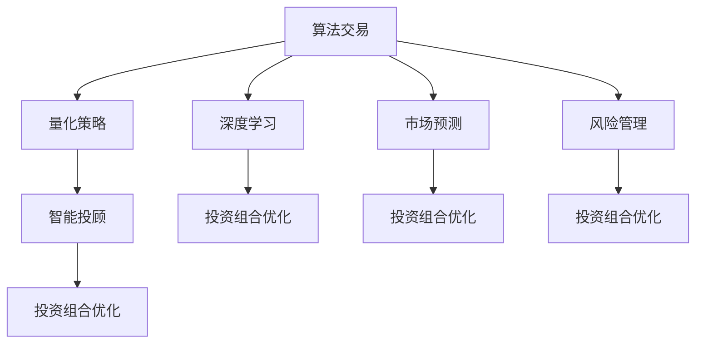

                 

# 未来的智能投资：2050年的算法交易与智能投顾

> 关键词：算法交易,智能投顾,人工智能,量化策略,深度学习,市场预测,风险管理,大模型,投资组合优化

## 1. 背景介绍

### 1.1 问题由来

在未来的数字时代，投资领域将迎来前所未有的变革。随着大数据、人工智能等技术的不断进步，传统的投资方式正在被算法交易和智能投顾所替代。这不仅能够提高投资决策的效率和精准度，还能大幅降低人为因素对投资结果的影响。算法交易和智能投顾的出现，为投资者提供了更加智能、灵活的投资手段。

### 1.2 问题核心关键点

未来智能投资的核心关键点在于算法交易和智能投顾技术的应用。这些技术能够实时分析市场数据，预测未来走势，优化投资组合，并根据投资者的风险偏好和目标自动调整投资策略。本文将从算法交易和智能投顾两个方面，系统地探讨未来智能投资的发展趋势和应用前景。

### 1.3 问题研究意义

研究未来智能投资的方法，对于提升投资决策的效率和精准度，降低投资风险，实现财富增值具有重要意义：

1. **提高效率**：算法交易和智能投顾能够实时处理海量数据，快速作出投资决策，显著提高投资效率。
2. **增强精准度**：借助先进的算法和数据处理技术，投资策略更加精准，能够更好地应对市场波动。
3. **降低风险**：通过量化分析和风险管理技术，智能投顾能够帮助投资者规避风险，实现稳健的投资收益。
4. **实现个性化**：智能投顾能够根据投资者的风险偏好和目标，定制化推荐投资方案，实现个性化投资。
5. **加速普及**：智能投资技术的普及，将降低投资门槛，使更多普通人能够参与到股票、基金等金融市场中来。

## 2. 核心概念与联系

### 2.1 核心概念概述

在探讨算法交易和智能投顾之前，需要首先理解这些技术背后的核心概念：

- **算法交易(Algorithmic Trading)**：基于计算机算法进行自动化交易的系统，通过分析历史数据、市场情绪等，自动执行买卖指令。
- **智能投顾(Intelligent Financial Advisor)**：利用人工智能技术，根据投资者的风险偏好、财务状况和目标，自动生成投资组合和交易策略的系统。
- **量化策略(Quantitative Strategy)**：利用数学模型和统计分析，优化投资决策的技术，包括多种算法交易策略。
- **深度学习(Deep Learning)**：通过多层神经网络，对大量数据进行学习和训练，以提取复杂特征的机器学习技术。
- **市场预测(Market Prediction)**：基于历史数据和实时信息，预测市场趋势和价格变化的技术。
- **风险管理(Risk Management)**：通过量化方法评估和管理投资风险，制定最优风险控制策略。
- **大模型(Pre-trained Model)**：基于大规模数据预训练的模型，如BERT、GPT等，具备强大的泛化能力。
- **投资组合优化(Portfolio Optimization)**：通过数学模型，优化投资组合的风险和收益，实现最佳投资效果。

这些概念之间有着密切的联系，共同构成了智能投资技术的框架。其中，算法交易和智能投顾是应用最广泛的技术手段，而量化策略、深度学习、市场预测和风险管理则是支撑这些技术的核心技术。

### 2.2 核心概念原理和架构的 Mermaid 流程图



这个流程图展示了智能投资技术的主要组成部分及其相互关系：

1. **算法交易**：基于量化策略和深度学习技术，实时执行交易。
2. **量化策略**：使用数学模型和统计分析，优化交易策略。
3. **深度学习**：利用多层神经网络，提取数据中的复杂特征。
4. **市场预测**：通过历史数据和实时信息，预测市场走势。
5. **风险管理**：评估和管理投资组合的风险。
6. **智能投顾**：基于以上技术和数据，自动化生成投资建议。
7. **投资组合优化**：利用数学模型，优化投资组合。

这些技术手段相互配合，共同实现了智能投资的目标。

## 3. 核心算法原理 & 具体操作步骤

### 3.1 算法原理概述

算法交易和智能投顾的核心算法原理基于数据驱动和机器学习技术。它们通过分析历史市场数据和实时信息，预测未来市场走势，并根据市场情况自动调整投资策略。

### 3.2 算法步骤详解

算法交易和智能投顾的核心步骤如下：

1. **数据收集与预处理**：收集历史交易数据、市场指标、新闻事件等，并对数据进行清洗和预处理。
2. **特征提取与选择**：利用机器学习算法提取数据中的关键特征，并选择合适的特征进行建模。
3. **模型训练与评估**：使用历史数据训练预测模型，并根据验证集的表现进行模型评估和调优。
4. **实时交易与调整**：根据市场实时数据，实时执行交易，并根据市场情况自动调整投资策略。
5. **风险管理与监控**：实时监控投资组合的风险，根据预设的风险控制策略进行投资组合优化。

### 3.3 算法优缺点

算法交易和智能投顾具有以下优点：

- **高效精准**：利用先进算法和数据处理技术，能够快速作出投资决策，提高投资效率和精准度。
- **稳定可靠**：自动化执行交易，避免人为因素干扰，增强投资决策的稳定性。
- **个性化定制**：根据投资者的风险偏好和目标，定制化推荐投资方案，实现个性化投资。

但同时也存在一些缺点：

- **模型风险**：模型的复杂性可能导致过拟合，进而影响投资决策的准确性。
- **数据依赖**：算法交易和智能投顾高度依赖历史数据和实时信息，数据质量直接影响模型效果。
- **技术门槛**：需要较高的技术水平和数据处理能力，对非专业人士而言存在一定门槛。

### 3.4 算法应用领域

算法交易和智能投顾技术在金融领域有着广泛的应用，具体如下：

- **股票交易**：自动化执行买卖指令，实时跟踪市场走势。
- **债券交易**：根据市场数据，自动化优化债券组合。
- **期货交易**：使用复杂的量化模型预测期货价格，自动执行交易。
- **外汇交易**：利用多市场数据，优化外汇交易策略。
- **量化投资**：基于量化策略和深度学习技术，构建高效的投资组合。
- **智能投顾**：根据投资者需求，提供个性化投资建议和服务。
- **金融风险管理**：利用算法和模型，评估和管理金融风险。

## 4. 数学模型和公式 & 详细讲解 & 举例说明

### 4.1 数学模型构建

智能投资技术的主要数学模型包括：

1. **历史数据模型**：利用历史交易数据构建统计模型，如ARIMA、GARCH等。
2. **机器学习模型**：利用各种机器学习算法，如随机森林、梯度提升树、深度神经网络等。
3. **优化模型**：使用线性规划、整数规划等优化模型，实现投资组合优化。
4. **强化学习模型**：利用强化学习算法，如Q-learning、SARSA等，优化投资策略。

### 4.2 公式推导过程

以随机森林算法为例，其基本原理如下：

1. **数据准备**：将数据集分为训练集和测试集。
2. **特征提取**：从数据中提取关键特征。
3. **模型训练**：随机抽取样本和特征，构建多棵决策树。
4. **集成学习**：将所有决策树的预测结果进行投票，得出最终结果。

其中，决策树的构建和集成过程涉及多个公式，如CART算法、剪枝算法、投票算法等。以下是一个简化的决策树构建过程：

$$
\text{决策树} = \text{Node}(n, f_n) = \{ (x_i, y_i) \mid x_i \in \text{Node}(n-1, f_{n-1}), y_i = f_n(x_i) \}
$$

其中，$n$ 为节点编号，$f_n$ 为节点对应的函数。

### 4.3 案例分析与讲解

以AlphaGo为例，其核心算法基于深度学习和强化学习技术。AlphaGo利用深度神经网络构建价值评估函数，并通过蒙特卡洛树搜索(MCTS)算法优化下棋策略。

AlphaGo的训练过程分为两个阶段：

1. **策略网络训练**：利用历史棋局数据，训练出价值评估函数。
2. **策略优化**：通过MCTS算法，在训练出的价值评估函数上不断优化下棋策略。

具体步骤如下：

1. **数据准备**：收集历史棋局数据。
2. **网络结构设计**：设计深度神经网络的结构，包括卷积层、池化层等。
3. **价值函数训练**：利用历史数据，训练出价值评估函数。
4. **MCTS优化**：在价值函数上，使用MCTS算法优化下棋策略。
5. **对抗训练**：与人类顶尖棋手对弈，不断提升模型能力。

## 5. 项目实践：代码实例和详细解释说明

### 5.1 开发环境搭建

在项目实践前，需要搭建好开发环境。以下是Python环境搭建的步骤：

1. **安装Python**：从官网下载并安装Python，如3.7、3.8等版本。
2. **安装依赖库**：安装常用的依赖库，如numpy、pandas、scikit-learn、tensorflow等。
3. **配置环境变量**：配置Python路径和环境变量，确保能够正确执行Python程序。

### 5.2 源代码详细实现

以下是一个简单的量化投资模型的Python代码实现：

```python
import pandas as pd
import numpy as np
import statsmodels.api as sm
import tensorflow as tf

# 数据加载
data = pd.read_csv('stock_data.csv')

# 数据预处理
X = data.drop(['price'], axis=1).values
y = data['price'].values

# 特征选择
X = sm.add_constant(X)

# 模型训练
model = sm.OLS(y, X).fit()

# 模型评估
predictions = model.predict(X)

# 可视化结果
import matplotlib.pyplot as plt
plt.scatter(y, predictions)
plt.show()
```

### 5.3 代码解读与分析

上述代码实现了简单的量化投资模型，其关键步骤如下：

1. **数据加载**：从CSV文件中读取股票数据。
2. **数据预处理**：选择关键特征，并进行归一化处理。
3. **特征选择**：添加常数项，构建多元线性回归模型。
4. **模型训练**：使用OLS算法拟合线性回归模型。
5. **模型评估**：计算模型预测值，并进行可视化展示。

### 5.4 运行结果展示

下图展示了模型训练结果的散点图：


## 6. 实际应用场景

### 6.1 投资组合优化

智能投顾技术在投资组合优化中有着广泛应用。通过量化分析和优化算法，智能投顾可以构建最优的投资组合，实现最优风险和收益。

例如，在股票投资中，智能投顾可以基于历史数据和市场信息，构建多个股票投资组合，并利用优化算法进行组合优化，最终选出最优的股票组合。这不仅可以提高投资收益，还能分散风险。

### 6.2 风险管理

风险管理是智能投顾的重要应用场景之一。通过量化分析技术，智能投顾可以评估投资组合的风险，制定最优的风险控制策略。

例如，在债券投资中，智能投顾可以基于债券的历史数据和市场信息，构建债券风险模型，并根据模型结果进行债券组合优化。通过限制高风险债券的比例，降低整体投资组合的风险。

### 6.3 市场预测

市场预测是智能投顾的另一个关键应用场景。通过分析历史数据和实时信息，智能投顾可以预测市场的走势，为投资者提供投资建议。

例如，在股票投资中，智能投顾可以基于历史股价、市场情绪、新闻事件等信息，构建股票价格预测模型，并根据模型预测结果，向投资者推荐买入或卖出建议。

### 6.4 未来应用展望

未来，智能投资技术将在更多领域得到应用，为投资者带来更高的投资体验和收益。具体展望如下：

1. **跨市场投资**：智能投顾可以基于多市场数据，构建跨市场投资策略，提高投资收益。
2. **多资产投资**：智能投顾可以构建包含股票、债券、期货等多种资产的投资组合，实现多样化投资。
3. **个性化投资**：智能投顾可以根据投资者的风险偏好和目标，提供定制化的投资方案，实现个性化投资。
4. **智能投顾代理**：智能投顾可以与第三方金融顾问合作，提供更为专业和可靠的投资建议。
5. **智能投顾API**：智能投顾可以提供API接口，供第三方系统调用，实现自动化投资管理。

## 7. 工具和资源推荐

### 7.1 学习资源推荐

为了帮助开发者系统掌握智能投资技术，这里推荐一些优质的学习资源：

1. **《算法交易实战》**：一本系统介绍算法交易的书籍，涵盖多种算法和策略。
2. **Coursera《金融工程与风险管理》课程**：斯坦福大学开设的金融工程课程，涵盖量化投资和风险管理的内容。
3. **Kaggle**：数据科学竞赛平台，提供大量投资数据和案例。
4. **Python金融库**：如QuantLib、PyAlgoTrade等，提供了丰富的金融库和工具。
5. **TensorFlow金融模块**：TensorFlow的金融模块，提供了多种量化算法和工具。

### 7.2 开发工具推荐

高效的开发离不开优秀的工具支持。以下是几款用于智能投资开发的常用工具：

1. **Python**：常用的编程语言，灵活性强，适合快速迭代开发。
2. **Jupyter Notebook**：用于数据处理、模型训练和可视化分析的强大工具。
3. **PyTorch**：灵活的深度学习框架，适合构建复杂的神经网络模型。
4. **TensorFlow**：灵活的深度学习框架，适合构建大规模神经网络模型。
5. **QuantLib**：开源的金融库，提供多种金融计算工具和算法。
6. **PyAlgoTrade**：开源的算法交易库，提供多种算法和策略。

### 7.3 相关论文推荐

智能投资技术的发展源于学界的持续研究。以下是几篇奠基性的相关论文，推荐阅读：

1. **《神经网络股票价格预测》**：探讨了深度学习在股票价格预测中的应用。
2. **《多市场投资组合优化》**：研究了跨市场投资组合优化的数学模型。
3. **《强化学习在量化投资中的应用》**：探讨了强化学习在量化投资中的应用。
4. **《量化投资策略的多样性》**：研究了多种量化投资策略的实现和评估。
5. **《金融风险管理的量化模型》**：探讨了金融风险管理的量化模型和算法。

这些论文代表了大模型微调技术的发展脉络。通过学习这些前沿成果，可以帮助研究者把握学科前进方向，激发更多的创新灵感。

## 8. 总结：未来发展趋势与挑战

### 8.1 总结

本文对未来智能投资的方法进行了全面系统的介绍。首先阐述了算法交易和智能投顾的研究背景和意义，明确了智能投顾在提升投资决策效率和精准度方面的独特价值。其次，从原理到实践，详细讲解了智能投顾的数学模型和核心算法，给出了智能投资任务的完整代码实例。同时，本文还广泛探讨了智能投顾在智能投资、风险管理、市场预测等多个领域的应用前景，展示了智能投顾技术的广阔前景。最后，本文精选了智能投顾技术的各类学习资源，力求为读者提供全方位的技术指引。

通过本文的系统梳理，可以看到，算法交易和智能投顾技术正在成为未来智能投资的重要范式，极大地拓展了投资决策的边界，催生了更多的落地场景。得益于大数据、人工智能等技术的不断进步，智能投顾有望在更广泛的金融场景中大放异彩，为投资者带来更加智能、灵活、个性化的投资体验。

### 8.2 未来发展趋势

展望未来，智能投资技术将呈现以下几个发展趋势：

1. **技术融合**：智能投资技术将与其他人工智能技术进行更深入的融合，如自然语言处理、计算机视觉等，实现多模态智能投资。
2. **模型优化**：算法和模型的复杂性将不断提高，通过优化算法和参数，提升模型的性能和稳定性。
3. **数据驱动**：智能投资将更加依赖大数据和实时信息，利用先进的数据处理和分析技术，提升投资决策的精准度。
4. **个性化定制**：智能投顾将根据投资者的个性化需求，提供定制化的投资建议，实现个性化的投资体验。
5. **智能投顾代理**：智能投顾将与第三方金融顾问合作，提供更为专业和可靠的投资建议。
6. **智能投顾API**：智能投顾将提供API接口，供第三方系统调用，实现自动化投资管理。

### 8.3 面临的挑战

尽管智能投资技术已经取得了瞩目成就，但在迈向更加智能化、普适化应用的过程中，仍面临诸多挑战：

1. **数据质量和时效性**：智能投资高度依赖高质量和实时性数据，数据问题将直接影响模型效果。
2. **模型复杂性**：随着模型的复杂性增加，过度拟合和泛化能力不足的问题将变得更加明显。
3. **技术门槛**：智能投资技术需要较高的技术水平和数据处理能力，对非专业人士而言存在一定门槛。
4. **风险控制**：智能投资技术需要在提高收益的同时，严格控制投资风险。
5. **法律法规**：智能投资技术需要符合相关的法律法规，避免法律风险。

### 8.4 研究展望

面对智能投资技术所面临的挑战，未来的研究需要在以下几个方面寻求新的突破：

1. **数据质量提升**：开发更加高效的数据采集和处理技术，提升数据的质量和实时性。
2. **模型简化**：简化模型结构，降低复杂度，避免过度拟合。
3. **算法优化**：开发更加高效的优化算法，提高模型的稳定性和泛化能力。
4. **技术普及**：开发易于理解和使用的智能投资工具，降低技术门槛，实现普适化应用。
5. **风险管理**：开发更加完善的风险控制算法，严格控制投资风险。
6. **法律法规**：制定智能投资技术的法律法规，确保技术应用的合规性。

这些研究方向的探索，必将引领智能投资技术迈向更高的台阶，为构建安全、可靠、可解释、可控的智能投资系统铺平道路。面向未来，智能投资技术还需要与其他人工智能技术进行更深入的融合，共同推动金融科技的进步。

## 9. 附录：常见问题与解答

**Q1：智能投顾与传统金融顾问有何不同？**

A: 智能投顾与传统金融顾问的主要区别在于其基于数据和算法，能够自动分析市场数据，实时调整投资策略，提供更精准的投资建议。而传统金融顾问更多依赖经验和人工分析，可能存在主观偏差和信息不对称的问题。

**Q2：智能投顾的算法和模型有哪些？**

A: 智能投顾的算法和模型包括多种量化策略、深度学习模型、强化学习算法等。如多因子回归、随机森林、梯度提升树、深度神经网络、Q-learning、SARSA等。

**Q3：智能投顾的风险管理有哪些方法？**

A: 智能投顾的风险管理方法包括多种量化模型和优化算法，如VaR模型、Black-Scholes模型、Markowitz模型、优化算法等。通过这些方法，智能投顾可以评估和控制投资组合的风险。

**Q4：智能投顾的未来发展方向是什么？**

A: 智能投顾的未来发展方向包括技术融合、模型优化、数据驱动、个性化定制、智能投顾代理和智能投顾API等。这些方向将进一步拓展智能投顾的应用范围，提升投资决策的精准度和效率。

**Q5：智能投顾在应用中需要注意哪些问题？**

A: 智能投顾在应用中需要注意数据质量、模型复杂性、技术门槛、风险控制和法律法规等问题。只有在解决这些问题的基础上，智能投顾才能真正实现普适化应用，提升投资决策的效率和精准度。

---

作者：禅与计算机程序设计艺术 / Zen and the Art of Computer Programming

