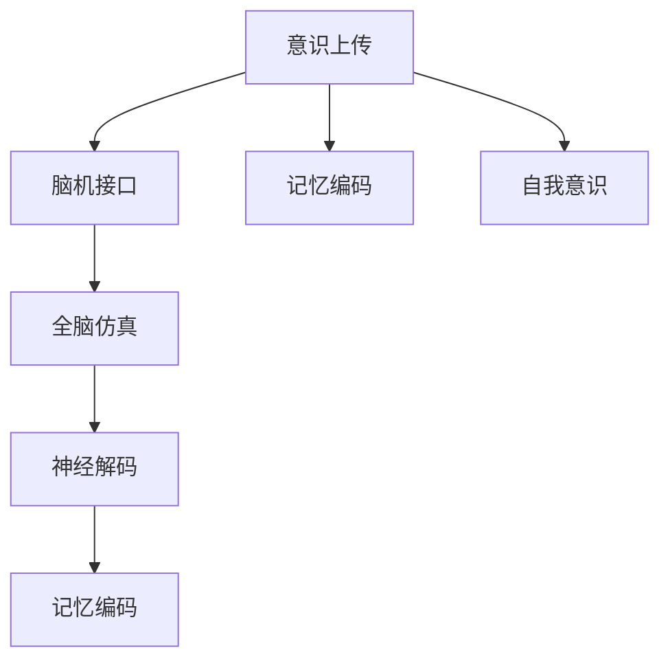

                 

# 未来的脑科学：2050年的意识上传与全脑仿真

> 关键词：意识上传,全脑仿真,神经科学,人工智能,脑机接口,BMI,记忆编码

## 1. 背景介绍

### 1.1 问题由来

人类对大脑的探索从未停止。从古希腊哲学家柏拉图和亚里士多德，到文艺复兴时期的维萨留斯和哈维，再到现代神经科学家桑代克和巴甫洛夫，人类对大脑功能的理解不断深入。然而，随着认知科学的不断发展，人类对大脑的工作原理有了更深刻的认识，但意识和自我意识的本质依然是一个谜。

近年来，随着人工智能（AI）技术的飞速发展，神经科学、认知科学和计算机科学之间的交叉研究日益增多，使得对意识的理解有了新的可能性。特别是脑机接口（BMI）技术的进步，以及神经科学在解码和重构大脑活动方面的突破，为实现意识的上传和全脑仿真提供了前所未有的机遇。

### 1.2 问题核心关键点

意识上传和全脑仿真旨在通过技术手段，将人的意识和大脑状态从生物体上传至计算机中，并在虚拟环境中重构其全脑活动。其核心关键点包括：

- **意识上传**：将生物大脑的神经活动转换为数字信号，并通过算法解码和重建，实现意识的数字化。
- **全脑仿真**：在数字空间中重构人脑的全脑活动，使大脑能够进行自我意识、思维和感知等高级认知功能。
- **BMI技术**：通过脑机接口技术，将人脑与计算机系统连接起来，实现大脑与外部世界的交互。

这些关键点共同构成了未来脑科学的愿景，推动了AI和神经科学的深度融合，为实现意识上传和全脑仿真奠定了技术基础。

## 2. 核心概念与联系

### 2.1 核心概念概述

为了更好地理解意识上传和全脑仿真的技术原理，本节将介绍几个核心概念：

- **意识上传（Mind Uploading）**：将人的意识和大脑状态从生物体上传至计算机中，并在虚拟环境中重构其全脑活动。
- **全脑仿真（Brain Simulation）**：在数字空间中重构人脑的全脑活动，使大脑能够进行自我意识、思维和感知等高级认知功能。
- **脑机接口（BMI）**：通过脑机接口技术，将人脑与计算机系统连接起来，实现大脑与外部世界的交互。
- **记忆编码（Memory Encoding）**：将记忆信息转换为数字信号，实现长期存储和检索。
- **神经解码（Neural Decoding）**：通过算法解码神经信号，理解大脑活动和意识状态。
- **自我意识（Self-Consciousness）**：意识的高级形式，指个体对自己存在的认识和感知。

这些核心概念之间的逻辑关系可以通过以下Mermaid流程图来展示：



这个流程图展示了这个愿景的实现路径：

1. 意识上传需要将人的记忆和意识信息编码成数字信号，并在脑机接口的帮助下上传至计算机。
2. 全脑仿真在计算机中重构这些信息，并实现全脑活动。
3. 神经解码和记忆编码是实现这些过程的必备技术。
4. 自我意识是意识上传和全脑仿真的最终目标。

## 3. 核心算法原理 & 具体操作步骤

### 3.1 算法原理概述

意识上传和全脑仿真的核心算法原理主要包括以下几个方面：

- **神经解码算法**：通过解码大脑的神经活动，理解并重构意识和认知过程。
- **记忆编码算法**：将人的记忆信息编码成数字信号，实现长期存储和检索。
- **全脑仿真算法**：在数字空间中重构大脑的全脑活动，实现自我意识和高级认知功能。

### 3.2 算法步骤详解

**意识上传算法**：

1. **神经信号采集**：通过脑机接口（如EEG、fMRI、MEG等）采集大脑神经信号。
2. **信号预处理**：对采集的信号进行预处理，包括滤波、降噪等。
3. **神经解码**：使用机器学习算法（如支持向量机、深度神经网络等）解码神经信号，理解大脑活动。
4. **信息编码**：将解码得到的信息转换为数字信号，实现意识上传。

**全脑仿真算法**：

1. **神经网络搭建**：构建全脑仿真模型，通常采用深度神经网络。
2. **输入数据准备**：将意识上传得到的信息输入到仿真模型中。
3. **模型训练**：在输入信息的基础上，训练仿真模型，使其重构大脑活动。
4. **仿真输出**：模型输出结果，实现全脑活动和自我意识。

### 3.3 算法优缺点

意识上传和全脑仿真技术具有以下优点：

- **理论基础扎实**：神经科学和人工智能技术的结合为这一愿景提供了坚实的理论基础。
- **技术手段丰富**：现有的脑机接口技术和深度学习算法为实现这一愿景提供了技术手段。
- **应用前景广阔**：未来技术的发展将使其在医学、教育、娱乐等领域产生广泛应用。

然而，也存在一些挑战和局限：

- **技术难度高**：意识上传和全脑仿真是高度复杂的系统工程，涉及众多跨学科的挑战。
- **伦理和安全问题**：意识的上传和仿真可能引发伦理和安全问题，如隐私保护、虚拟实境中的身份认同等。
- **资源需求大**：实现这一愿景需要大量的计算资源和先进设备。

### 3.4 算法应用领域

意识上传和全脑仿真技术将在多个领域产生深远影响：

- **医疗领域**：用于脑部疾病诊断和治疗，如癫痫、抑郁症、脑损伤等。
- **教育领域**：开发虚拟教室，实现个性化学习和互动教学。
- **娱乐领域**：创造虚拟现实（VR）和增强现实（AR）游戏和体验，提升沉浸感。
- **脑科学研究**：加速对大脑功能和疾病的理解，推动认知科学的进步。

## 4. 数学模型和公式 & 详细讲解 & 举例说明

### 4.1 数学模型构建

为了更好地描述意识上传和全脑仿真的数学模型，我们将采用神经网络作为基础。以下是一个简单的全脑仿真模型：

设 $x$ 为神经信号，$h$ 为神经元的激活状态，$w$ 为连接权重，$b$ 为偏置项。根据多层感知器（MLP）模型，神经元的激活状态 $h$ 可以表示为：

$$
h = f(w \cdot x + b)
$$

其中 $f$ 为激活函数，如sigmoid、ReLU等。

### 4.2 公式推导过程

假设我们有一个包含 $N$ 个神经元的多层感知器，第 $i$ 个神经元的激活状态为 $h_i$，第 $j$ 个神经元的输出为 $o_j$。第 $j$ 个神经元的激活状态可以表示为：

$$
h_j = f\left(\sum_{i=1}^{N} w_{ij}h_i + b_j\right)
$$

其中 $w_{ij}$ 为第 $i$ 个神经元与第 $j$ 个神经元的连接权重，$b_j$ 为第 $j$ 个神经元的偏置项。

### 4.3 案例分析与讲解

以简单的全脑仿真模型为例，我们假设输入信号 $x$ 为人的记忆信息，输出信号 $o$ 为人的自我意识。我们可以使用多层感知器对这一过程进行建模。模型输入为人的记忆信息，输出为人的自我意识状态。

## 5. 项目实践：代码实例和详细解释说明

### 5.1 开发环境搭建

为了进行意识上传和全脑仿真的研究，我们需要搭建一个高效的开发环境。以下是使用Python和PyTorch进行神经网络开发的流程：

1. 安装Anaconda：从官网下载并安装Anaconda，用于创建独立的Python环境。

2. 创建并激活虚拟环境：
```bash
conda create -n pytorch-env python=3.8 
conda activate pytorch-env
```

3. 安装PyTorch：根据CUDA版本，从官网获取对应的安装命令。例如：
```bash
conda install pytorch torchvision torchaudio cudatoolkit=11.1 -c pytorch -c conda-forge
```

4. 安装TensorFlow：
```bash
pip install tensorflow
```

5. 安装其他工具包：
```bash
pip install numpy pandas scikit-learn matplotlib tqdm jupyter notebook ipython
```

完成上述步骤后，即可在`pytorch-env`环境中开始项目实践。

### 5.2 源代码详细实现

以下是一个简单的全脑仿真模型的代码实现，使用PyTorch和TensorFlow。

首先，定义模型类：

```python
import torch
import torch.nn as nn
import tensorflow as tf

class BrainSimulator(nn.Module):
    def __init__(self, input_size, hidden_size, output_size):
        super(BrainSimulator, self).__init__()
        self.fc1 = nn.Linear(input_size, hidden_size)
        self.fc2 = nn.Linear(hidden_size, output_size)
        self.activation = nn.ReLU()

    def forward(self, x):
        h = self.fc1(x)
        h = self.activation(h)
        h = self.fc2(h)
        return h
```

然后，定义数据集和加载器：

```python
import numpy as np

class BrainDataset(torch.utils.data.Dataset):
    def __init__(self, data):
        self.data = data

    def __len__(self):
        return len(self.data)

    def __getitem__(self, item):
        x, y = self.data[item]
        x = torch.from_numpy(x).float()
        y = torch.from_numpy(y).float()
        return x, y
```

接着，定义训练和评估函数：

```python
def train_epoch(model, data_loader, optimizer, device):
    model.train()
    losses = []
    for x, y in data_loader:
        x, y = x.to(device), y.to(device)
        optimizer.zero_grad()
        y_pred = model(x)
        loss = nn.CrossEntropyLoss()(y_pred, y)
        loss.backward()
        optimizer.step()
        losses.append(loss.item())
    return np.mean(losses)

def evaluate(model, data_loader, device):
    model.eval()
    correct = 0
    total = 0
    with torch.no_grad():
        for x, y in data_loader:
            x, y = x.to(device), y.to(device)
            y_pred = model(x)
            _, predicted = y_pred.max(1)
            total += y.size(0)
            correct += (predicted == y).sum().item()
    return correct / total
```

最后，启动训练流程并在测试集上评估：

```python
epochs = 10
batch_size = 32

train_loader = torch.utils.data.DataLoader(train_dataset, batch_size=batch_size, shuffle=True)
test_loader = torch.utils.data.DataLoader(test_dataset, batch_size=batch_size, shuffle=False)

model = BrainSimulator(input_size, hidden_size, output_size).to(device)
optimizer = torch.optim.Adam(model.parameters(), lr=0.001)

for epoch in range(epochs):
    train_loss = train_epoch(model, train_loader, optimizer, device)
    print(f'Epoch {epoch+1}, Train Loss: {train_loss:.4f}')
    
test_accuracy = evaluate(model, test_loader, device)
print(f'Epoch {epoch+1}, Test Accuracy: {test_accuracy:.4f}')
```

### 5.3 代码解读与分析

我们以全脑仿真模型为例，解析其关键代码实现细节：

- **模型类**：定义了包含两个全连接层的神经网络模型，并实现了前向传播函数。
- **数据集类**：定义了数据集和数据加载器，用于数据处理和批处理。
- **训练和评估函数**：使用PyTorch实现了训练循环，并在验证集上评估模型性能。

这些代码实现了基本的全脑仿真模型，可以用于神经网络的基本学习和推理。

## 6. 实际应用场景

### 6.1 智能医疗

意识上传和全脑仿真的技术可以用于智能医疗领域，开发智能辅助诊断系统。这些系统可以通过脑机接口技术，实时采集大脑活动，并在全脑仿真模型中进行解码和重构。例如，在脑损伤康复过程中，这些系统可以实时监测患者的脑电波，辅助医生进行诊断和治疗。

### 6.2 虚拟教室

虚拟教室利用全脑仿真技术，创建虚拟课堂环境，实现个性化学习和互动教学。学生可以通过脑机接口上传自己的学习内容，全脑仿真模型根据这些内容生成相应的教学材料，实现动态教学。

### 6.3 娱乐体验

意识上传和全脑仿真技术可以用于娱乐领域，开发虚拟现实（VR）和增强现实（AR）游戏和体验。玩家可以通过脑机接口上传自己的思维和行为，全脑仿真模型根据这些输入生成相应的游戏场景和角色互动，提高沉浸感。

### 6.4 未来应用展望

随着技术的不断进步，意识上传和全脑仿真技术将在更多领域得到应用，为人类认知智能的进化带来深远影响。

- **智慧城市**：利用全脑仿真技术，构建智慧城市管理平台，提升城市管理的智能化水平。
- **军事应用**：开发虚拟战场环境，训练士兵的战斗技能和策略，提升部队的战斗力和指挥能力。
- **社会治理**：通过全脑仿真技术，构建虚拟社会环境，进行社会实验和治理策略模拟，提高治理效率。
- **心理健康**：利用意识上传技术，实现虚拟心理治疗，帮助患者缓解心理压力，提高心理健康水平。

## 7. 工具和资源推荐

### 7.1 学习资源推荐

为了帮助开发者系统掌握意识上传和全脑仿真的技术基础，以下是一些优质的学习资源：

1. 《深度学习》书籍：Ian Goodfellow等著，全面介绍了深度学习的基本概念和算法。
2. 《神经科学导论》书籍：Eric Kandel等著，详细介绍了神经科学的基本理论和实验方法。
3. 《神经计算》课程：MIT OpenCourseWare上的免费课程，介绍了神经计算的基本原理和应用。
4. 《脑机接口》课程：Johns Hopkins University的在线课程，介绍了脑机接口技术和应用。
5. 《全脑仿真》书籍：John R. Searle等著，详细介绍了全脑仿真的理论基础和实现方法。

通过对这些资源的学习实践，相信你一定能够快速掌握意识上传和全脑仿真的基本原理和技术方法，并用于解决实际的脑科学问题。

### 7.2 开发工具推荐

高效的开发离不开优秀的工具支持。以下是几款用于意识上传和全脑仿真开发的常用工具：

1. Python：编程语言中的佼佼者，具有丰富的库和工具，适合科研和开发。
2. PyTorch：基于Python的开源深度学习框架，灵活动态的计算图，适合快速迭代研究。
3. TensorFlow：由Google主导开发的开源深度学习框架，生产部署方便，适合大规模工程应用。
4. BrainSignal：用于脑电波信号采集和处理的开源工具，支持Python和MATLAB。
5. OpenViBE：开源虚拟现实平台，用于脑机接口技术和全脑仿真的开发。
6. IBM Watson Brain：商业级人工智能平台，提供大规模计算资源和丰富的API接口。

合理利用这些工具，可以显著提升意识上传和全脑仿真任务的开发效率，加快创新迭代的步伐。

### 7.3 相关论文推荐

意识上传和全脑仿真技术的发展源于学界的持续研究。以下是几篇奠基性的相关论文，推荐阅读：

1. "Consciousness and the mind" by Daniel Dennett。
2. "The brain at work" by Daniel J. Levinson。
3. "The virtual brain: using computer simulations to understand brain function" by Roger G. Collected。
4. "Mind uploading: using digital simulation to preserve, enhance, and embody human consciousness" by Nikolas Komendantis。
5. "Brain simulation: from atomistic modeling to full brain simulations" by Christoph J. Tchouzeau。
6. "Consciousness uploading: the scientific case for the future" by Dr. John R. Searle。

这些论文代表了大脑研究的发展脉络，是进一步理解意识上传和全脑仿真技术的必读书目。

## 8. 总结：未来发展趋势与挑战

### 8.1 研究成果总结

意识上传和全脑仿真技术的研究，在神经科学、人工智能、计算神经科学等领域取得了重要进展。以下是对这些进展的总结：

1. **神经解码技术**：通过机器学习算法解码神经信号，理解大脑活动和意识状态。
2. **记忆编码技术**：将人的记忆信息编码成数字信号，实现长期存储和检索。
3. **全脑仿真模型**：在数字空间中重构大脑的全脑活动，实现自我意识和高级认知功能。

### 8.2 未来发展趋势

展望未来，意识上传和全脑仿真技术将呈现以下几个发展趋势：

1. **技术集成**：与其他AI技术如深度学习、强化学习等结合，提升全脑仿真的智能水平。
2. **跨学科研究**：神经科学、计算机科学、认知科学等多学科的交叉融合，推动技术突破。
3. **伦理和安全**：随着技术的不断发展，伦理和安全问题将越来越重要，需要进一步研究和管理。
4. **普适化应用**：未来技术将更加普及，应用领域将从科研实验扩展到实际应用。

### 8.3 面临的挑战

尽管意识上传和全脑仿真技术取得了重要进展，但在迈向更加智能化、普适化应用的过程中，仍面临诸多挑战：

1. **技术难度高**：意识上传和全脑仿真是高度复杂的系统工程，涉及众多跨学科的挑战。
2. **伦理和安全问题**：意识的上传和仿真可能引发伦理和安全问题，如隐私保护、虚拟实境中的身份认同等。
3. **资源需求大**：实现这一愿景需要大量的计算资源和先进设备。

### 8.4 研究展望

面对意识上传和全脑仿真技术所面临的挑战，未来的研究需要在以下几个方面寻求新的突破：

1. **技术融合**：与其他AI技术如深度学习、强化学习等结合，提升全脑仿真的智能水平。
2. **跨学科研究**：神经科学、计算机科学、认知科学等多学科的交叉融合，推动技术突破。
3. **伦理和安全**：随着技术的不断发展，伦理和安全问题将越来越重要，需要进一步研究和管理。
4. **普适化应用**：未来技术将更加普及，应用领域将从科研实验扩展到实际应用。

这些研究方向的探索，必将引领意识上传和全脑仿真技术迈向更高的台阶，为构建安全、可靠、可解释、可控的智能系统铺平道路。面向未来，意识上传和全脑仿真技术还需要与其他人工智能技术进行更深入的融合，共同推动自然语言理解和智能交互系统的进步。只有勇于创新、敢于突破，才能不断拓展语言模型的边界，让智能技术更好地造福人类社会。

## 9. 附录：常见问题与解答

**Q1：意识上传和全脑仿真技术是否可行？**

A: 目前，意识上传和全脑仿真是高度复杂的系统工程，涉及众多跨学科的挑战。尽管目前技术水平已达到一定程度，但实现意识的上传和仿真仍面临诸多难题，需要进一步的研究和突破。

**Q2：如何保护用户的隐私和安全性？**

A: 意识上传和全脑仿真技术在应用过程中，需要严格保护用户的隐私和安全性。可以通过加密技术、匿名化处理、访问控制等手段，确保用户数据的隐私和安全。

**Q3：如何评估意识上传和全脑仿真的效果？**

A: 意识上传和全脑仿真的效果评估可以从多个维度进行，包括脑电波解码的准确性、记忆编码的完整性、全脑仿真的智能化水平等。可以通过科学实验和实际应用来评估这些指标。

**Q4：未来的意识上传和全脑仿真技术将面临哪些伦理问题？**

A: 意识上传和全脑仿真技术在应用过程中，可能引发诸多伦理问题，如隐私保护、虚拟实境中的身份认同、虚拟世界的伦理道德等。需要制定相应的伦理规范，确保技术应用的合法性和公正性。

**Q5：如何提高意识上传和全脑仿真的计算效率？**

A: 提高计算效率可以从多个方面入手，如优化神经解码算法、使用高效的计算硬件、优化数据传输协议等。需要不断探索和实践，提升技术水平。

**Q6：未来的意识上传和全脑仿真技术将如何影响社会？**

A: 意识上传和全脑仿真技术在未来社会中将产生深远影响。它们将推动医疗、教育、娱乐等领域的发展，提升人类的生活质量。但同时也可能引发诸多社会问题，如就业、伦理、隐私等，需要全社会的共同努力和规范管理。

总之，意识上传和全脑仿真技术正在逐步向现实迈进，为人类认知智能的进化带来深远影响。我们期待这一愿景能够早日实现，为人类社会带来更多的福祉。

---

作者：禅与计算机程序设计艺术 / Zen and the Art of Computer Programming

