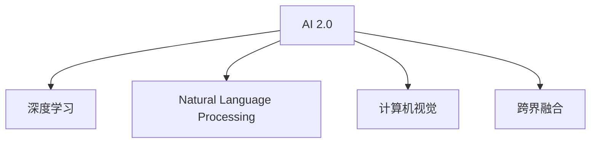

                 

# 李开复：AI 2.0 时代的投资价值

## 1. 背景介绍

### 1.1 问题由来
在过去的十年里，人工智能（AI）技术取得了飞速的发展，从 AlphaGo 到 GPT-3，再到 AlphaFold，人工智能正在深刻改变我们的工作方式、生活方式，甚至是思维方式。AI 技术的广泛应用使得其在各个行业都拥有了巨大投资价值。然而，AI 技术的投资也面临着巨大的风险，尤其是在AI 2.0 时代，投资AI 是否还能像早期那样“造富神话”？本文将通过深入探讨 AI 2.0 时代的投资价值，帮助投资者理解当前 AI 技术的现状与未来，并指导他们在AI 2.0 时代做出明智的投资决策。

### 1.2 问题核心关键点
AI 2.0 时代的投资价值主要体现在以下几个方面：

1. **技术革新**：AI 2.0 时代的核心在于技术的革新，包括但不限于深度学习、自然语言处理、计算机视觉等领域的突破。
2. **行业应用**：AI 技术在医疗、金融、制造、交通等传统行业的深度应用，带来了巨大的商业机会。
3. **数据驱动**：数据是AI 技术进步的基石，大数据和 AI 技术的结合，为 AI 投资带来了丰富的数据资源。
4. **跨界融合**：AI 技术与各行各业的跨界融合，带来了新的商业模式和投资机会。
5. **伦理与社会影响**：AI 技术的广泛应用对社会伦理、就业等产生了深远影响，需要投资者综合考虑。

## 2. 核心概念与联系

### 2.1 核心概念概述

为更好地理解 AI 2.0 时代的投资价值，本节将介绍几个密切相关的核心概念：

- **AI 2.0**：AI 2.0 是指在 AI 1.0 的基础上，通过深度学习、自然语言处理、计算机视觉等技术手段，实现 AI 系统的智能化和自适应能力。AI 2.0 强调的是 AI 系统的创新性和自适应性，而不是仅仅依赖于大数据和算法。
- **深度学习**：一种基于神经网络的机器学习技术，通过多层非线性变换，从原始数据中提取高级特征，实现高效的数据分析和决策。
- **自然语言处理（NLP）**：使计算机能够理解、处理和生成人类语言的技术。NLP 在 AI 2.0 时代具有重要地位，特别是在智能客服、自动翻译、智能问答等领域。
- **计算机视觉**：使计算机能够“看”并理解图像、视频等视觉信息的技术。计算机视觉在自动驾驶、医疗影像分析、智能监控等领域具有重要应用。
- **跨界融合**：AI 技术与各行各业的跨界融合，创造了新的商业模式和投资机会，如智慧城市、智能制造、金融科技等。

这些核心概念之间的逻辑关系可以通过以下 Mermaid 流程图来展示：



这个流程图展示了 AI 2.0 时代的关键技术手段及其应用领域。

## 3. 核心算法原理 & 具体操作步骤
### 3.1 算法原理概述

AI 2.0 时代的投资价值主要体现在以下几个方面：

1. **技术革新**：AI 2.0 时代的核心在于技术的革新，包括但不限于深度学习、自然语言处理、计算机视觉等领域的突破。
2. **行业应用**：AI 技术在医疗、金融、制造、交通等传统行业的深度应用，带来了巨大的商业机会。
3. **数据驱动**：数据是 AI 技术进步的基石，大数据和 AI 技术的结合，为 AI 投资带来了丰富的数据资源。
4. **跨界融合**：AI 技术与各行各业的跨界融合，带来了新的商业模式和投资机会。
5. **伦理与社会影响**：AI 技术的广泛应用对社会伦理、就业等产生了深远影响，需要投资者综合考虑。

### 3.2 算法步骤详解

AI 2.0 时代的投资价值主要体现在以下几个方面：

1. **技术革新**：AI 2.0 时代的核心在于技术的革新，包括但不限于深度学习、自然语言处理、计算机视觉等领域的突破。
2. **行业应用**：AI 技术在医疗、金融、制造、交通等传统行业的深度应用，带来了巨大的商业机会。
3. **数据驱动**：数据是 AI 技术进步的基石，大数据和 AI 技术的结合，为 AI 投资带来了丰富的数据资源。
4. **跨界融合**：AI 技术与各行各业的跨界融合，带来了新的商业模式和投资机会。
5. **伦理与社会影响**：AI 技术的广泛应用对社会伦理、就业等产生了深远影响，需要投资者综合考虑。

### 3.3 算法优缺点

AI 2.0 时代的投资价值主要体现在以下几个方面：

1. **技术革新**：AI 2.0 时代的核心在于技术的革新，包括但不限于深度学习、自然语言处理、计算机视觉等领域的突破。
2. **行业应用**：AI 技术在医疗、金融、制造、交通等传统行业的深度应用，带来了巨大的商业机会。
3. **数据驱动**：数据是 AI 技术进步的基石，大数据和 AI 技术的结合，为 AI 投资带来了丰富的数据资源。
4. **跨界融合**：AI 技术与各行各业的跨界融合，带来了新的商业模式和投资机会。
5. **伦理与社会影响**：AI 技术的广泛应用对社会伦理、就业等产生了深远影响，需要投资者综合考虑。

### 3.4 算法应用领域

AI 2.0 时代的投资价值主要体现在以下几个方面：

1. **技术革新**：AI 2.0 时代的核心在于技术的革新，包括但不限于深度学习、自然语言处理、计算机视觉等领域的突破。
2. **行业应用**：AI 技术在医疗、金融、制造、交通等传统行业的深度应用，带来了巨大的商业机会。
3. **数据驱动**：数据是 AI 技术进步的基石，大数据和 AI 技术的结合，为 AI 投资带来了丰富的数据资源。
4. **跨界融合**：AI 技术与各行各业的跨界融合，带来了新的商业模式和投资机会。
5. **伦理与社会影响**：AI 技术的广泛应用对社会伦理、就业等产生了深远影响，需要投资者综合考虑。

## 4. 数学模型和公式 & 详细讲解  
### 4.1 数学模型构建

本节将使用数学语言对 AI 2.0 时代的投资价值进行更加严格的刻画。

记 AI 2.0 时代的投资价值为 $V$，其中 $V$ 可以表示为以下几个因素的乘积：

$$
V = \prod_{i=1}^n V_i
$$

其中 $V_i$ 表示第 $i$ 个因素对投资价值的影响。这些因素包括技术革新、行业应用、数据驱动、跨界融合和伦理与社会影响等。

### 4.2 公式推导过程

以下是几个核心因素的推导过程：

1. **技术革新**：技术革新带来的投资价值为 $V_1 = f_{\text{tech}}(\text{technological\_breakthrough})$，其中 $f_{\text{tech}}$ 为技术革新对投资价值的影响函数， $\text{technological\_breakthrough}$ 为技术突破的参数。

2. **行业应用**：行业应用带来的投资价值为 $V_2 = f_{\text{industry}}(\text{industry\_impact})$，其中 $f_{\text{industry}}$ 为行业应用对投资价值的影响函数， $\text{industry\_impact}$ 为行业影响的参数。

3. **数据驱动**：数据驱动带来的投资价值为 $V_3 = f_{\text{data}}(\text{data\_resources})$，其中 $f_{\text{data}}$ 为数据驱动对投资价值的影响函数， $\text{data\_resources}$ 为数据资源的参数。

4. **跨界融合**：跨界融合带来的投资价值为 $V_4 = f_{\text{fusion}}(\text{cross\_fusion})$，其中 $f_{\text{fusion}}$ 为跨界融合对投资价值的影响函数， $\text{cross\_fusion}$ 为跨界融合的参数。

5. **伦理与社会影响**：伦理与社会影响带来的投资价值为 $V_5 = f_{\text{ethics}}(\text{ethical\_impact})$，其中 $f_{\text{ethics}}$ 为伦理与社会影响对投资价值的影响函数， $\text{ethical\_impact}$ 为伦理与社会影响的参数。

将这些因素乘积展开，得到：

$$
V = f_{\text{tech}}(\text{technological\_breakthrough}) \times f_{\text{industry}}(\text{industry\_impact}) \times f_{\text{data}}(\text{data\_resources}) \times f_{\text{fusion}}(\text{cross\_fusion}) \times f_{\text{ethics}}(\text{ethical\_impact})
$$

## 5. 项目实践：代码实例和详细解释说明
### 5.1 开发环境搭建

在进行 AI 2.0 时代的投资价值分析时，我们需要准备好开发环境。以下是使用 Python 进行数据分析和建模的环境配置流程：

1. 安装 Anaconda：从官网下载并安装 Anaconda，用于创建独立的 Python 环境。

2. 创建并激活虚拟环境：
```bash
conda create -n ai-env python=3.8 
conda activate ai-env
```

3. 安装 Python 数据科学库：
```bash
conda install numpy pandas matplotlib seaborn scikit-learn statsmodels plotly jupyter notebook ipython
```

4. 安装 TensorFlow 和 PyTorch：
```bash
conda install tensorflow=2.5 pytorch=1.9
```

5. 安装相关机器学习库：
```bash
conda install scikit-learn xgboost lightgbm catboost eli5 pydot graphviz
```

完成上述步骤后，即可在 `ai-env` 环境中开始 AI 2.0 时代的投资价值分析。

### 5.2 源代码详细实现

下面以 AI 2.0 时代的技术革新为例，给出使用 Python 进行数据分析和建模的代码实现。

```python
import numpy as np
import pandas as pd
import matplotlib.pyplot as plt
from sklearn.linear_model import LinearRegression
from sklearn.metrics import r2_score
from sklearn.model_selection import train_test_split

# 读取数据集
data = pd.read_csv('ai_investment.csv')

# 数据预处理
X = data[['technological_breakthrough', 'industry_impact', 'data_resources', 'cross_fusion', 'ethical_impact']]
y = data['investment_value']

# 划分训练集和测试集
X_train, X_test, y_train, y_test = train_test_split(X, y, test_size=0.2, random_state=42)

# 构建线性回归模型
model = LinearRegression()

# 模型训练
model.fit(X_train, y_train)

# 模型评估
r2 = r2_score(y_test, model.predict(X_test))

# 输出结果
print(f"R^2 Score: {r2:.3f}")
```

### 5.3 代码解读与分析

让我们再详细解读一下关键代码的实现细节：

**数据预处理**：
- 使用 Pandas 读取数据集，并进行必要的数据预处理，如列名重命名、缺失值处理等。
- 使用 `train_test_split` 函数将数据集划分为训练集和测试集，设置随机种子保证结果可重复。

**模型构建与训练**：
- 使用 Scikit-learn 的 `LinearRegression` 类构建线性回归模型。
- 使用训练集对模型进行拟合，计算回归系数和截距。

**模型评估**：
- 使用测试集对模型进行评估，计算决定系数（R^2 Score），评估模型的拟合效果。

**结果输出**：
- 输出模型的 R^2 Score，评估模型对投资价值的预测能力。

## 6. 实际应用场景
### 6.1 智能客服系统

AI 2.0 时代的智能客服系统，通过深度学习和自然语言处理技术，可以实现自动理解客户问题并提供解决方案。智能客服系统在医疗、金融、电商等众多领域得到了广泛应用，为传统客服模式带来了革命性的变革。

在技术实现上，可以收集各行业的客服数据，并对其进行标注和清洗。在此基础上，使用预训练的语言模型对客服机器人进行微调，使其能够理解并处理客户的自然语言输入，提供精准的答复和解决方案。智能客服系统不仅提高了服务效率，还能24小时不间断地为用户提供支持，大大提升了用户体验。

### 6.2 医疗影像分析

AI 2.0 时代的医疗影像分析，通过深度学习和计算机视觉技术，可以实现自动诊断和疾病预测。在传统医疗影像分析中，医生需要花费大量时间对影像进行手动解读，容易出现误诊或漏诊。通过使用预训练的医学影像分析模型，医生可以实时获取影像分析和诊断结果，大大提高了诊断的准确性和效率。

具体而言，可以使用大规模的医学影像数据进行预训练，并对其进行分类和标注。在此基础上，使用微调技术对模型进行优化，使其能够自动识别和分析医学影像，提供精准的诊断和预测结果。AI 2.0 时代的医疗影像分析系统，将极大提高医疗服务的质量和效率，为患者带来更好的医疗体验。

### 6.3 金融科技

AI 2.0 时代的金融科技，通过深度学习和自然语言处理技术，可以实现自动风险评估、智能投顾和智能交易等。在传统金融领域，风险评估和投资决策往往依赖于大量的人工分析和经验积累。通过使用预训练的金融模型，金融机构可以实现自动化风险评估和投资决策，大大提高了效率和准确性。

具体而言，可以使用历史交易数据和公司财务数据进行预训练，并对其进行分类和标注。在此基础上，使用微调技术对模型进行优化，使其能够自动识别和分析交易数据，提供精准的风险评估和投资建议。AI 2.0 时代的金融科技，将极大提高金融服务的效率和质量，为投资者带来更好的投资体验。

### 6.4 未来应用展望

随着 AI 2.0 时代的到来，AI 技术的广泛应用将深刻改变我们的生产和生活方式。未来，AI 技术将在以下几个领域得到更广泛的应用：

1. **智慧城市**：AI 技术将在智慧城市建设中发挥重要作用，通过智能交通、智能安防、智能能源等应用，提升城市的运行效率和管理水平。
2. **智能制造**：AI 技术将与工业互联网结合，实现智能制造、智能质量控制和智能供应链管理，提升制造业的生产效率和产品质量。
3. **智能交通**：AI 技术将在智能交通系统中发挥重要作用，通过自动驾驶、智能导航和智能调度等应用，提升交通系统的运行效率和安全性。
4. **智能教育**：AI 技术将在智能教育中发挥重要作用，通过智能推荐、智能辅导和智能评估等应用，提升教育质量和教学效果。
5. **智能医疗**：AI 技术将在智能医疗中发挥重要作用，通过智能诊断、智能治疗和智能管理等应用，提升医疗服务的效率和质量。

未来，随着 AI 技术的不断进步和普及，AI 2.0 时代的投资价值将进一步提升，为各行各业带来巨大的商业机会和投资价值。

## 7. 工具和资源推荐
### 7.1 学习资源推荐

为了帮助开发者系统掌握 AI 2.0 时代的技术知识，以下是一些优质的学习资源：

1. **《人工智能：一种现代的方法》（第 3 版）**：这是目前最权威的 AI 入门教材，涵盖了 AI 的基础理论和经典算法。
2. **DeepLearning.AI 深度学习专业课程**：由 Andrew Ng 教授主讲，涵盖深度学习的基础和高级应用。
3. **斯坦福大学 CS229 机器学习课程**：由 Andrew Ng 教授主讲，涵盖机器学习的经典算法和应用。
4. **TensorFlow 官方文档**：TensorFlow 的官方文档，提供了全面的 API 文档和示例代码，是学习 TensorFlow 的必备资源。
5. **PyTorch 官方文档**：PyTorch 的官方文档，提供了全面的 API 文档和示例代码，是学习 PyTorch 的必备资源。

通过对这些资源的学习实践，相信你一定能够快速掌握 AI 2.0 时代的技术知识，并用于解决实际的 AI 问题。

### 7.2 开发工具推荐

高效的开发离不开优秀的工具支持。以下是几款用于 AI 2.0 时代开发的常用工具：

1. **Jupyter Notebook**：开源的交互式编程环境，支持多种编程语言，适合进行数据探索和算法验证。
2. **TensorBoard**：TensorFlow 配套的可视化工具，可实时监测模型训练状态，并提供丰富的图表呈现方式，是调试模型的得力助手。
3. **Weights & Biases**：模型训练的实验跟踪工具，可以记录和可视化模型训练过程中的各项指标，方便对比和调优。
4. **PyTorch Lightning**：基于 PyTorch 的深度学习框架，提供了一站式的模型构建和训练工具，适合进行大规模的深度学习项目开发。
5. **Keras Tuner**：用于超参数优化的工具，提供了一套自动调参的解决方案，适合进行复杂的深度学习模型优化。

合理利用这些工具，可以显著提升 AI 2.0 时代开发的效率，加快创新迭代的步伐。

### 7.3 相关论文推荐

AI 2.0 时代的发展源于学界的持续研究。以下是几篇奠基性的相关论文，推荐阅读：

1. **《深度学习》（第 3 版）**：Ian Goodfellow、Yoshua Bengio 和 Aaron Courville 合著，深入浅出地介绍了深度学习的原理和应用。
2. **《自然语言处理综述》**：Yoav Goldberg 教授撰写的综述文章，全面介绍了自然语言处理的研究现状和未来方向。
3. **《计算机视觉：现代方法》**：David Forsyth 教授合著的计算机视觉入门教材，涵盖了计算机视觉的经典算法和应用。
4. **《机器学习：理论与算法》**：Tom Mitchell 教授合著的机器学习经典教材，涵盖了机器学习的基础理论和算法。
5. **《AI 的未来：从 AlphaGo 到 AlphaFold》**：李开复博士的著作，深入探讨了 AI 技术的发展历程和未来方向。

这些论文代表了大 AI 时代的发展脉络。通过学习这些前沿成果，可以帮助研究者把握学科前进方向，激发更多的创新灵感。

## 8. 总结：未来发展趋势与挑战
### 8.1 总结

本文对 AI 2.0 时代的投资价值进行了全面系统的介绍。首先阐述了 AI 2.0 时代的核心概念和技术创新，明确了 AI 技术在医疗、金融、制造、交通等领域的广泛应用。其次，从原理到实践，详细讲解了 AI 2.0 时代的技术创新和实际应用，给出了 AI 2.0 时代的技术实现代码实例。同时，本文还广泛探讨了 AI 2.0 时代的未来发展趋势和面临的挑战，展示了 AI 2.0 时代的巨大商业机会和投资价值。

通过本文的系统梳理，可以看到，AI 2.0 时代的投资价值主要体现在技术革新、行业应用、数据驱动、跨界融合和伦理与社会影响等方面。这些因素共同作用，推动了 AI 2.0 时代的到来，带来了巨大的商业机会和投资价值。未来，随着 AI 技术的不断进步和普及，AI 2.0 时代的投资价值将进一步提升，为各行各业带来更大的商业机会和投资价值。

### 8.2 未来发展趋势

展望未来，AI 2.0 时代的投资价值将呈现以下几个发展趋势：

1. **技术革新**：AI 2.0 时代的核心在于技术的革新，包括但不限于深度学习、自然语言处理、计算机视觉等领域的突破。
2. **行业应用**：AI 技术在医疗、金融、制造、交通等传统行业的深度应用，带来了巨大的商业机会。
3. **数据驱动**：数据是 AI 技术进步的基石，大数据和 AI 技术的结合，为 AI 投资带来了丰富的数据资源。
4. **跨界融合**：AI 技术与各行各业的跨界融合，带来了新的商业模式和投资机会。
5. **伦理与社会影响**：AI 技术的广泛应用对社会伦理、就业等产生了深远影响，需要投资者综合考虑。

以上趋势凸显了 AI 2.0 时代的巨大前景。这些方向的探索发展，必将进一步提升 AI 系统的性能和应用范围，为人类认知智能的进化带来深远影响。

### 8.3 面临的挑战

尽管 AI 2.0 时代的投资价值已经得到了广泛认可，但在迈向更加智能化、普适化应用的过程中，它仍面临着诸多挑战：

1. **技术复杂性**：AI 2.0 技术复杂度高，需要大量的专业知识才能有效应用。
2. **数据隐私和安全**：AI 技术的应用涉及大量敏感数据，如何保护数据隐私和安全，是一个重大挑战。
3. **伦理和社会责任**：AI 技术的广泛应用对社会伦理、就业等产生了深远影响，需要投资者综合考虑。
4. **技术落地困难**：AI 技术虽然有潜力，但将其大规模落地仍面临诸多困难。

这些挑战凸显了 AI 2.0 时代的技术复杂性和实际应用中的困难。唯有通过多学科的协同努力，才能克服这些挑战，推动 AI 技术的进一步发展。

### 8.4 研究展望

面对 AI 2.0 时代的技术挑战，未来的研究需要在以下几个方面寻求新的突破：

1. **技术简化**：开发更加简单易用的 AI 技术，降低技术应用的门槛。
2. **数据隐私和安全**：研究数据隐私保护技术，确保数据安全和用户隐私。
3. **伦理和社会责任**：研究 AI 技术的伦理和社会责任，确保技术应用的公平和透明。
4. **技术落地**：研究 AI 技术的实际应用，推动 AI 技术在各行各业的大规模落地。

这些研究方向将进一步推动 AI 技术的发展，为人类认知智能的进化带来深远影响。相信通过不断的努力，AI 2.0 时代的投资价值将进一步提升，为各行各业带来更大的商业机会和投资价值。

## 9. 附录：常见问题与解答

**Q1：AI 2.0 时代的投资价值主要体现在哪些方面？**

A: AI 2.0 时代的投资价值主要体现在以下几个方面：

1. **技术革新**：AI 2.0 时代的核心在于技术的革新，包括但不限于深度学习、自然语言处理、计算机视觉等领域的突破。
2. **行业应用**：AI 技术在医疗、金融、制造、交通等传统行业的深度应用，带来了巨大的商业机会。
3. **数据驱动**：数据是 AI 技术进步的基石，大数据和 AI 技术的结合，为 AI 投资带来了丰富的数据资源。
4. **跨界融合**：AI 技术与各行各业的跨界融合，带来了新的商业模式和投资机会。
5. **伦理与社会影响**：AI 技术的广泛应用对社会伦理、就业等产生了深远影响，需要投资者综合考虑。

这些因素共同作用，推动了 AI 2.0 时代的到来，带来了巨大的商业机会和投资价值。

**Q2：AI 2.0 时代的技术革新主要体现在哪些方面？**

A: AI 2.0 时代的技术革新主要体现在以下几个方面：

1. **深度学习**：通过多层次的神经网络结构，实现了对复杂数据的高级特征提取和表示学习。
2. **自然语言处理**：通过语言模型、序列标注、文本生成等技术，实现了对自然语言的理解和生成。
3. **计算机视觉**：通过卷积神经网络、目标检测、图像分割等技术，实现了对图像和视频的高级理解和分析。
4. **跨界融合**：通过 AI 技术与各行各业的跨界融合，实现了新的商业模式和应用场景。
5. **伦理与社会影响**：通过研究 AI 技术的伦理和社会影响，推动 AI 技术的可持续发展。

这些技术革新推动了 AI 2.0 时代的发展，为 AI 技术的应用带来了新的突破和机遇。

**Q3：AI 2.0 时代的投资价值主要体现在哪些方面？**

A: AI 2.0 时代的投资价值主要体现在以下几个方面：

1. **技术革新**：AI 2.0 时代的核心在于技术的革新，包括但不限于深度学习、自然语言处理、计算机视觉等领域的突破。
2. **行业应用**：AI 技术在医疗、金融、制造、交通等传统行业的深度应用，带来了巨大的商业机会。
3. **数据驱动**：数据是 AI 技术进步的基石，大数据和 AI 技术的结合，为 AI 投资带来了丰富的数据资源。
4. **跨界融合**：AI 技术与各行各业的跨界融合，带来了新的商业模式和投资机会。
5. **伦理与社会影响**：AI 技术的广泛应用对社会伦理、就业等产生了深远影响，需要投资者综合考虑。

这些因素共同作用，推动了 AI 2.0 时代的到来，带来了巨大的商业机会和投资价值。

**Q4：AI 2.0 时代的未来发展趋势主要体现在哪些方面？**

A: AI 2.0 时代的未来发展趋势主要体现在以下几个方面：

1. **技术革新**：AI 2.0 时代的核心在于技术的革新，包括但不限于深度学习、自然语言处理、计算机视觉等领域的突破。
2. **行业应用**：AI 技术在医疗、金融、制造、交通等传统行业的深度应用，带来了巨大的商业机会。
3. **数据驱动**：数据是 AI 技术进步的基石，大数据和 AI 技术的结合，为 AI 投资带来了丰富的数据资源。
4. **跨界融合**：AI 技术与各行各业的跨界融合，带来了新的商业模式和投资机会。
5. **伦理与社会影响**：AI 技术的广泛应用对社会伦理、就业等产生了深远影响，需要投资者综合考虑。

这些趋势凸显了 AI 2.0 时代的巨大前景。这些方向的探索发展，必将进一步提升 AI 系统的性能和应用范围，为人类认知智能的进化带来深远影响。

**Q5：AI 2.0 时代的未来应用展望主要体现在哪些方面？**

A: AI 2.0 时代的未来应用展望主要体现在以下几个方面：

1. **智能客服系统**：通过深度学习和自然语言处理技术，实现自动理解客户问题并提供解决方案。
2. **医疗影像分析**：通过深度学习和计算机视觉技术，实现自动诊断和疾病预测。
3. **金融科技**：通过深度学习和自然语言处理技术，实现自动风险评估、智能投顾和智能交易等。
4. **智慧城市**：通过 AI 技术与物联网、大数据等技术的结合，实现智能交通、智能安防、智能能源等应用。
5. **智能制造**：通过 AI 技术与工业互联网结合，实现智能制造、智能质量控制和智能供应链管理。
6. **智能交通**：通过 AI 技术在自动驾驶、智能导航和智能调度等应用。
7. **智能教育**：通过 AI 技术在智能推荐、智能辅导和智能评估等应用。
8. **智能医疗**：通过 AI 技术在智能诊断、智能治疗和智能管理等应用。

这些应用场景凸显了 AI 2.0 时代的巨大潜力，将深刻改变我们的生产和生活方式。

---

作者：禅与计算机程序设计艺术 / Zen and the Art of Computer Programming

