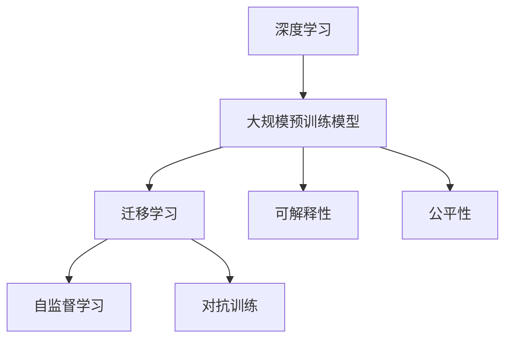

                 

## 1. 背景介绍

人工智能（AI）作为一项颠覆性技术，正在迅速改变世界。自从1950年代初计算机科学的诞生以来，人类已经经历了从AI 1.0到AI 2.0的转变，这一变革不仅在技术层面产生重大影响，也深刻改变了各个行业的商业模式和社会结构。AI 2.0时代，以数据驱动的深度学习为主导，其对技术和社会的广泛影响正逐步显现，同时也面临诸多挑战。

### 1.1 问题由来
近年来，随着深度学习、大数据和计算能力的大幅提升，AI 2.0 技术得到了快速发展。深度神经网络、大规模预训练模型、迁移学习、自监督学习等技术手段，使得AI 2.0 在视觉、语言、自然语言处理、机器人等领域取得了突破性的进展。然而，AI 2.0 时代也伴随着一些重大的技术、伦理和社会挑战，需要学术界、工业界和政策制定者共同应对。

### 1.2 问题核心关键点
AI 2.0 时代的主要挑战集中在以下几个方面：
1. **数据质量和多样性**：深度学习依赖大量高质量数据进行训练，数据的准确性和多样性直接影响AI 2.0 模型的性能。
2. **算力需求**：大规模模型训练和推理需要高性能计算资源，算力成本成为制约AI 2.0 发展的瓶颈。
3. **模型可解释性**：深度学习模型往往被视为“黑盒”，难以解释其内部决策过程，这在某些应用领域可能带来严重的法律和伦理问题。
4. **公平性和偏见**：AI 2.0 模型可能学习并放大数据中的偏见，导致决策不公。
5. **伦理和社会影响**：AI 2.0 技术的广泛应用可能导致失业、隐私侵害、决策透明性等问题，需要社会各界的关注和引导。

## 2. 核心概念与联系

### 2.1 核心概念概述

在AI 2.0 时代，以下几个核心概念尤为重要：

- **深度学习（Deep Learning）**：通过多层神经网络模型，自动学习并提取数据中的复杂特征，是AI 2.0 技术的基础。
- **大规模预训练模型（Large Pre-trained Models）**：如BERT、GPT等模型，通过在大规模语料上进行预训练，获得了丰富的语言和知识表示能力。
- **迁移学习（Transfer Learning）**：利用预训练模型在特定任务上进行微调，提高模型性能，降低训练成本。
- **自监督学习（Self-Supervised Learning）**：通过在无标签数据上学习，减少对标注数据的需求。
- **对抗训练（Adversarial Training）**：训练模型对输入数据中的噪声和对抗样本具有鲁棒性。
- **可解释性（Explainability）**：提高模型决策的可解释性，增加其透明性和可信度。
- **公平性（Fairness）**：确保模型在处理不同群体数据时保持一致的性能和偏见。

这些概念之间相互关联，构成了AI 2.0 技术的核心框架。深度学习作为基础技术，预训练模型提供了丰富的知识表示，迁移学习和自监督学习扩大了模型的应用范围，对抗训练提高了模型的鲁棒性，可解释性和公平性则确保了模型在实际应用中的可靠性和公正性。

### 2.2 核心概念原理和架构的 Mermaid 流程图



## 3. 核心算法原理 & 具体操作步骤

### 3.1 算法原理概述

AI 2.0 技术中常用的深度学习算法，通常包括以下几个步骤：

1. **数据预处理**：收集、清洗、标注数据，并将其转换为模型可以处理的格式。
2. **模型选择与初始化**：选择合适的深度学习模型架构，并初始化模型参数。
3. **模型训练**：使用训练数据集，通过反向传播算法更新模型参数，最小化损失函数。
4. **模型评估与调整**：使用验证数据集评估模型性能，并根据需要调整模型架构和超参数。
5. **模型微调与优化**：在预训练模型上，针对特定任务进行微调，提升模型在该任务上的性能。
6. **模型部署与监控**：将训练好的模型部署到实际应用中，并持续监控模型性能和稳定性。

### 3.2 算法步骤详解

#### 3.2.1 数据预处理

数据预处理是深度学习模型训练的基础。预处理流程通常包括以下几个步骤：

1. **数据收集**：从公开数据集或自有数据源收集相关数据。
2. **数据清洗**：去除噪声、缺失值、重复记录等，确保数据质量。
3. **数据标注**：为数据集中的每个样本标注正确的标签，或使用半监督学习、自监督学习等技术进行无标签训练。
4. **数据转换**：将原始数据转换为模型可以处理的格式，如图像数据转化为张量形式，文本数据转化为词汇表或嵌入向量。

#### 3.2.2 模型选择与初始化

选择合适的模型架构是AI 2.0 技术的关键。常用的模型包括卷积神经网络（CNN）、循环神经网络（RNN）、长短时记忆网络（LSTM）和Transformer等。在模型初始化阶段，通常使用预训练的权重作为初始值，或使用随机初始化方法。

#### 3.2.3 模型训练

模型训练是深度学习算法中最核心的部分。通常使用反向传播算法更新模型参数，最小化损失函数。训练过程中，采用梯度下降法或其变体（如Adam、SGD等）来更新模型参数。为了提高训练效率，可以采用批量梯度下降、正则化技术（如L2正则、Dropout等），以及早停法（Early Stopping）等策略。

#### 3.2.4 模型评估与调整

模型评估与调整是确保模型性能稳定的重要步骤。通过在验证集上评估模型性能，可以发现模型过拟合或欠拟合的问题，并根据需要调整模型架构或超参数。常用的评估指标包括准确率、精确率、召回率、F1值等。

#### 3.2.5 模型微调与优化

模型微调是指在预训练模型上，针对特定任务进行微调，以提升模型在该任务上的性能。微调过程中，通常使用较小的学习率，并结合正则化技术、早停法等策略，以避免过拟合。微调后，模型的整体性能会得到显著提升。

#### 3.2.6 模型部署与监控

模型部署是将训练好的模型应用于实际场景的过程。在部署过程中，需要考虑模型的可解释性、公平性、鲁棒性等因素。模型监控是确保模型在实际应用中性能稳定的重要手段，通常使用日志记录、性能指标监控等技术。

### 3.3 算法优缺点

AI 2.0 技术的深度学习算法具有以下优点：

- **泛化能力强**：通过大规模数据训练，深度学习模型能够自动学习复杂的特征，具有良好的泛化能力。
- **灵活性强**：深度学习算法可以适应多种任务，包括图像识别、自然语言处理、语音识别等。
- **可扩展性好**：通过增加模型层数和节点数，可以显著提高模型的性能。

同时，深度学习算法也存在一些缺点：

- **训练成本高**：深度学习模型通常需要大量计算资源和时间进行训练。
- **模型复杂**：深度学习模型的内部结构复杂，难以解释其决策过程。
- **对数据质量敏感**：深度学习模型对训练数据的质量和数量要求较高。

### 3.4 算法应用领域

AI 2.0 技术的深度学习算法在多个领域得到了广泛应用：

- **计算机视觉**：如目标检测、图像分类、图像生成等。
- **自然语言处理**：如机器翻译、文本生成、情感分析等。
- **语音识别**：如语音转文本、语音合成等。
- **机器人**：如行为控制、路径规划等。
- **医疗**：如疾病诊断、基因组分析等。

## 4. 数学模型和公式 & 详细讲解 & 举例说明

### 4.1 数学模型构建

AI 2.0 技术中的深度学习算法通常使用以下数学模型进行建模：

1. **输入层**：表示原始数据，如图像的像素值、文本的词向量等。
2. **隐藏层**：通过多个非线性变换，提取数据中的特征。
3. **输出层**：根据任务类型，输出相应的结果，如分类任务的标签、回归任务的数值等。

### 4.2 公式推导过程

以卷积神经网络（CNN）为例，其基本结构如下：

$$
f_\theta(x) = \mathbb{E}_{h\sim f_{\theta}(x)}[y|h]
$$

其中，$x$ 为输入，$y$ 为输出，$f_\theta(x)$ 为模型参数为 $\theta$ 的函数。

在训练过程中，使用交叉熵损失函数：

$$
L = -\frac{1}{N}\sum_{i=1}^N \sum_{j=1}^C y_j \log f_\theta(x_i)
$$

其中，$N$ 为样本数量，$C$ 为类别数量。

### 4.3 案例分析与讲解

以图像分类任务为例，CNN模型通常包括卷积层、池化层、全连接层等。卷积层通过滑动卷积核提取图像特征，池化层减少特征图尺寸，全连接层将特征映射到类别空间。

## 5. 项目实践：代码实例和详细解释说明

### 5.1 开发环境搭建

1. 安装Python和相关依赖包，如TensorFlow、Keras等。
2. 准备训练数据集和验证数据集。
3. 搭建深度学习模型，如卷积神经网络（CNN）或卷积循环神经网络（CRNN）。
4. 定义训练超参数，如学习率、批大小等。

### 5.2 源代码详细实现

以下是一个简单的Keras代码实现：

```python
import keras
from keras.datasets import mnist
from keras.models import Sequential
from keras.layers import Dense, Conv2D, MaxPooling2D, Flatten

# 数据加载
(x_train, y_train), (x_test, y_test) = mnist.load_data()

# 数据预处理
x_train = x_train.reshape(x_train.shape[0], 28, 28, 1)
x_test = x_test.reshape(x_test.shape[0], 28, 28, 1)
x_train = x_train.astype('float32') / 255
x_test = x_test.astype('float32') / 255
y_train = keras.utils.to_categorical(y_train, 10)
y_test = keras.utils.to_categorical(y_test, 10)

# 模型定义
model = Sequential()
model.add(Conv2D(32, kernel_size=(3, 3), activation='relu', input_shape=(28, 28, 1)))
model.add(MaxPooling2D(pool_size=(2, 2)))
model.add(Flatten())
model.add(Dense(128, activation='relu'))
model.add(Dense(10, activation='softmax'))

# 模型编译
model.compile(loss='categorical_crossentropy',
              optimizer='adam',
              metrics=['accuracy'])

# 模型训练
model.fit(x_train, y_train,
          batch_size=128,
          epochs=10,
          verbose=1,
          validation_data=(x_test, y_test))

# 模型评估
score = model.evaluate(x_test, y_test, verbose=0)
print('Test loss:', score[0])
print('Test accuracy:', score[1])
```

### 5.3 代码解读与分析

上述代码中，首先加载MNIST手写数字数据集，并对数据进行预处理。接着定义了一个包含卷积层、池化层和全连接层的CNN模型，并使用交叉熵损失函数进行训练。最后评估模型性能，并输出测试集上的准确率。

### 5.4 运行结果展示

训练过程中，可以通过TensorBoard等工具查看模型训练的详细日志和性能指标。训练完成后，模型会在测试集上取得较高的准确率。

## 6. 实际应用场景

### 6.1 智能客服系统

智能客服系统是AI 2.0 技术的重要应用场景之一。通过使用深度学习算法，智能客服系统可以理解用户意图，自动生成回复，并提供24/7的服务。

### 6.2 金融舆情监测

在金融领域，舆情监测是风险管理的重要手段。AI 2.0 技术可以通过分析社交媒体、新闻等公开数据，自动监测舆情变化，及时发现潜在风险。

### 6.3 个性化推荐系统

个性化推荐系统是电商、视频等行业的核心应用。AI 2.0 技术通过深度学习算法，分析用户行为和偏好，提供个性化的商品或内容推荐。

## 7. 工具和资源推荐

### 7.1 学习资源推荐

- **Coursera**：提供深度学习、自然语言处理等课程，适合初学者和进阶者。
- **Udacity**：提供AI纳米学位课程，覆盖深度学习、计算机视觉、自然语言处理等领域。
- **DeepLearning.AI**：李开复创办的深度学习课程，包括基础课程和高级课程。

### 7.2 开发工具推荐

- **TensorFlow**：由Google开发的深度学习框架，支持多种模型和算法。
- **Keras**：高层次的深度学习API，简单易用，适合快速原型开发。
- **PyTorch**：由Facebook开发的深度学习框架，支持动态计算图，灵活性高。

### 7.3 相关论文推荐

- **ImageNet Classification with Deep Convolutional Neural Networks**：AlexNet论文，展示了卷积神经网络在图像分类任务上的性能。
- **Attention is All You Need**：Transformer论文，引入了自注意力机制，改变了自然语言处理的方向。
- **BERT: Pre-training of Deep Bidirectional Transformers for Language Understanding**：BERT论文，提出预训练语言模型，提升了NLP任务的性能。

## 8. 总结：未来发展趋势与挑战

### 8.1 研究成果总结

AI 2.0 技术在深度学习、自然语言处理、计算机视觉等领域取得了显著进展。这些技术的广泛应用，推动了产业的数字化转型，提高了工作效率和决策质量。

### 8.2 未来发展趋势

未来，AI 2.0 技术将朝着以下几个方向发展：

- **自监督学习**：通过在无标签数据上学习，减少对标注数据的依赖。
- **模型压缩**：通过剪枝、量化等技术，提高模型的计算效率和部署速度。
- **联邦学习**：在分布式环境中训练模型，保护数据隐私。
- **跨模态学习**：结合视觉、语音、文本等多种模态数据，提升模型的感知能力。
- **可解释性**：提高模型决策的可解释性，增加其透明性和可信度。

### 8.3 面临的挑战

AI 2.0 技术在发展过程中也面临一些挑战：

- **数据隐私和安全**：大规模数据集的使用可能带来隐私泄露和数据安全问题。
- **模型可解释性**：深度学习模型通常被视为“黑盒”，难以解释其内部决策过程。
- **公平性和偏见**：AI 2.0 模型可能学习并放大数据中的偏见，导致决策不公。
- **计算资源**：深度学习模型需要大量计算资源进行训练和推理，算力成本高昂。

### 8.4 研究展望

未来的研究需要在以下几个方面取得突破：

- **数据隐私保护**：开发隐私保护技术，保护数据隐私和安全。
- **可解释性增强**：提高模型的可解释性，增加其透明性和可信度。
- **公平性优化**：确保模型在处理不同群体数据时保持一致的性能和偏见。
- **计算效率提升**：通过模型压缩、量化等技术，提高模型的计算效率和部署速度。

## 9. 附录：常见问题与解答

**Q1：如何选择合适的深度学习模型？**

A: 选择合适的深度学习模型需要考虑以下几个因素：
1. **任务类型**：不同的任务类型适合不同的模型架构。例如，图像分类适合卷积神经网络（CNN），自然语言处理适合循环神经网络（RNN）或Transformer。
2. **数据规模**：大规模数据集适合深度神经网络，而小规模数据集则适合简单模型。
3. **计算资源**：计算资源有限的场景下，应选择轻量级模型。

**Q2：深度学习模型如何避免过拟合？**

A: 避免深度学习模型过拟合的方法包括：
1. **数据增强**：通过旋转、裁剪、翻转等方法扩充训练集。
2. **正则化**：使用L2正则、Dropout等技术限制模型的复杂度。
3. **早停法**：根据验证集性能决定停止训练的时机。
4. **模型集成**：通过组合多个模型，减少过拟合风险。

**Q3：如何提高深度学习模型的可解释性？**

A: 提高深度学习模型的可解释性可以采用以下方法：
1. **特征可视化**：使用t-SNE等技术可视化特征分布。
2. **模型解释工具**：使用LIME、SHAP等工具分析模型输出。
3. **因果解释**：引入因果推断方法，解释模型的决策逻辑。

**Q4：深度学习模型如何保证公平性？**

A: 保证深度学习模型的公平性可以采用以下方法：
1. **数据平衡**：确保训练数据集中各类别样本数量均衡。
2. **对抗训练**：通过对抗样本训练模型，减少偏见。
3. **公平性约束**：在模型训练目标中加入公平性约束。

**Q5：如何部署深度学习模型？**

A: 深度学习模型的部署通常包括以下几个步骤：
1. **模型训练**：使用训练集训练模型，并在验证集上评估性能。
2. **模型保存**：将训练好的模型保存为文件，方便后续部署。
3. **模型加载**：在生产环境中部署模型，使用API接口提供服务。
4. **模型监控**：实时监控模型性能和稳定性，确保服务质量。

**Q6：如何保护深度学习模型的隐私？**

A: 保护深度学习模型的隐私可以采用以下方法：
1. **数据匿名化**：对训练数据进行匿名处理，保护用户隐私。
2. **联邦学习**：在分布式环境中训练模型，保护数据隐私。
3. **差分隐私**：使用差分隐私技术，限制模型对数据的敏感性。

---

作者：禅与计算机程序设计艺术 / Zen and the Art of Computer Programming

