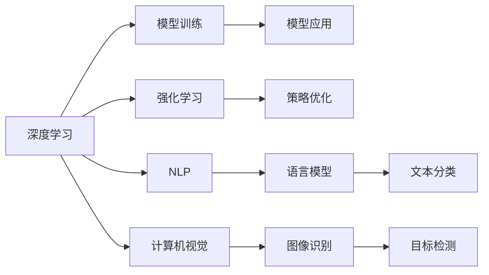

                 

# 李开复：AI 2.0 时代的挑战

## 1. 背景介绍

### 1.1 问题由来
随着人工智能(AI)技术的飞速发展，AI 2.0时代的到来成为必然趋势。AI 2.0不仅是算法的进步，更是对数据、计算能力、云计算、自动化的全面革新，推动着全球各行业进入智能化转型新阶段。在这样一个变革性的时代背景下，AI 2.0技术如何应对当下挑战，开辟未来之路，成为了时代赋予每一个AI从业者的问题。

### 1.2 问题核心关键点
李开复，作为世界级的人工智能专家、程序员、软件架构师、CTO以及计算机图灵奖获得者，他在AI 2.0时代的挑战方面有深刻的见解和独到见解。以下是他提出的一些关键问题：

- **技术演进：**AI 2.0时代的技术演进路径是什么？它如何重塑现有的技术框架和标准？
- **数据与隐私：**数据隐私和安全性如何得到保障？如何在保护隐私的同时获取有价值的数据？
- **道德与伦理：**AI系统的决策过程是否透明？如何确保AI的公平、公正性？
- **社会影响：**AI技术如何影响社会结构、就业模式和人类生活？我们应如何应对AI带来的社会变革？
- **创新驱动：**如何激励AI领域的创新，鼓励跨学科、跨领域合作，打造可持续发展的AI生态？

这些问题不仅关乎AI技术本身，也涉及到了AI与其他社会元素如法律、伦理、经济、教育等领域的交互和影响。

## 2. 核心概念与联系

### 2.1 核心概念概述

AI 2.0时代，人工智能技术在各个领域都得到了广泛应用，包括但不限于医疗、金融、交通、教育、制造等。其中，深度学习、强化学习、自然语言处理(NLP)、计算机视觉(CV)等技术是AI 2.0时代的核心驱动力。

#### 2.1.1 深度学习
深度学习是模拟人类神经网络的工作原理，通过多层次的神经网络模型进行数据处理和学习。它利用大量的数据和计算资源，通过反向传播算法更新网络参数，使得模型能够学习和提取数据的高级特征，从而实现对复杂问题的解决。

#### 2.1.2 强化学习
强化学习通过智能体与环境的交互，通过试错来学习最优策略。它不需要显式的标注数据，适合于解决复杂的控制和优化问题。

#### 2.1.3 自然语言处理
自然语言处理主要涉及语言模型、文本分类、机器翻译、问答系统等任务，是实现人机交互和信息提取的关键技术。

#### 2.1.4 计算机视觉
计算机视觉主要涉及图像识别、目标检测、图像分割等任务，广泛应用于自动驾驶、安防监控、医学影像分析等领域。

### 2.2 核心概念原理和架构的 Mermaid 流程图



### 2.3 核心概念之间的关系

这些核心概念相互关联，构成了AI 2.0时代技术的基础架构：

- 深度学习和强化学习是技术驱动的核心。
- NLP和CV提供了数据的处理和理解能力。
- 各技术领域的应用场景则通过具体问题驱动模型训练和应用。

这些核心概念之间的相互作用，共同推动了AI技术的不断进步和应用扩展。

## 3. 核心算法原理 & 具体操作步骤

### 3.1 算法原理概述
AI 2.0时代的核心算法原理包括但不限于深度学习中的反向传播算法、强化学习中的策略梯度算法、NLP中的语言模型、以及CV中的卷积神经网络。

### 3.2 算法步骤详解
以深度学习为例，其训练和应用步骤包括以下几个关键环节：

1. **数据准备**：收集和清洗数据，确保数据质量。
2. **模型选择**：选择合适的深度学习模型，如卷积神经网络(CNN)、循环神经网络(RNN)、Transformer等。
3. **模型训练**：通过反向传播算法更新模型参数，最小化损失函数。
4. **模型验证**：在验证集上评估模型性能，避免过拟合。
5. **模型应用**：将训练好的模型应用于实际问题中，进行预测、分类、生成等任务。

### 3.3 算法优缺点
深度学习模型的优点在于其强大的泛化能力，能够处理复杂的非线性关系。但其缺点包括：

- **计算资源需求高**：训练深度学习模型需要大量的计算资源。
- **模型复杂度高**：深度学习模型结构复杂，难以解释和调试。
- **数据依赖性强**：深度学习模型对数据质量有较高要求，数据标注成本高。

### 3.4 算法应用领域
深度学习在医疗影像分析、自然语言处理、计算机视觉等领域有广泛的应用。强化学习则广泛应用于自动驾驶、机器人控制、游戏策略等领域。

## 4. 数学模型和公式 & 详细讲解 & 举例说明

### 4.1 数学模型构建

以深度学习中的卷积神经网络(CNN)为例，其数学模型构建如下：

$$
\text{Conv}(x, w, b) = \text{ReLU}(\text{Conv}(x, w) + b)
$$

其中，$x$ 为输入数据，$w$ 为卷积核权重，$b$ 为偏置项，$\text{ReLU}$ 为激活函数。

### 4.2 公式推导过程
在CNN中，卷积操作可以表示为：

$$
\text{Conv}(x, w) = \sum_{i,j,k} w_{k}x_{i,j,k}
$$

其中，$w$ 和 $x$ 分别表示卷积核和输入数据，$k$ 表示卷积核的特征映射。

### 4.3 案例分析与讲解
假设我们需要对一张28x28的灰度图像进行卷积操作，使用3x3的卷积核 $w$，特征映射数为32。具体过程如下：

1. 将输入图像展开为一维向量 $x$。
2. 使用公式 $\text{Conv}(x, w)$ 计算卷积操作。
3. 将结果通过 $\text{ReLU}$ 激活函数进行非线性变换。

通过这种方式，CNN能够提取图像的高级特征，用于分类、识别等任务。

## 5. 项目实践：代码实例和详细解释说明

### 5.1 开发环境搭建

在进行AI项目实践时，首先需要准备好开发环境。以下是使用Python进行TensorFlow开发的流程：

1. 安装Anaconda：从官网下载并安装Anaconda，用于创建独立的Python环境。
2. 创建并激活虚拟环境：
```bash
conda create -n tf-env python=3.8 
conda activate tf-env
```

3. 安装TensorFlow：根据CUDA版本，从官网获取对应的安装命令。例如：
```bash
conda install tensorflow -c tensorflow -c conda-forge
```

4. 安装各类工具包：
```bash
pip install numpy pandas scikit-learn matplotlib tqdm jupyter notebook ipython
```

完成上述步骤后，即可在`tf-env`环境中开始AI项目开发。

### 5.2 源代码详细实现

这里我们以图像分类任务为例，给出使用TensorFlow进行卷积神经网络(CNN)开发的PyTorch代码实现。

```python
import tensorflow as tf
from tensorflow.keras import layers, models

# 定义CNN模型
model = models.Sequential([
    layers.Conv2D(32, (3, 3), activation='relu', input_shape=(28, 28, 1)),
    layers.MaxPooling2D((2, 2)),
    layers.Conv2D(64, (3, 3), activation='relu'),
    layers.MaxPooling2D((2, 2)),
    layers.Conv2D(64, (3, 3), activation='relu'),
    layers.Flatten(),
    layers.Dense(64, activation='relu'),
    layers.Dense(10, activation='softmax')
])

# 编译模型
model.compile(optimizer='adam', loss='sparse_categorical_crossentropy', metrics=['accuracy'])

# 训练模型
model.fit(train_images, train_labels, epochs=5, validation_data=(test_images, test_labels))
```

### 5.3 代码解读与分析

让我们再详细解读一下关键代码的实现细节：

- `Sequential`模型：使用Sequential模型定义了一个顺序的神经网络。
- `Conv2D`层：定义了卷积层，用于特征提取。
- `MaxPooling2D`层：定义了池化层，用于下采样。
- `Flatten`层：将二维特征图转换为一维向量。
- `Dense`层：定义了全连接层，用于分类。
- `compile`方法：编译模型，指定优化器、损失函数和评估指标。
- `fit`方法：训练模型，指定训练集、验证集和训练轮数。

在实际应用中，开发者可以进一步优化模型结构、调整超参数、使用数据增强等方法，提升模型性能。

### 5.4 运行结果展示

```python
# 加载测试集数据
test_loss, test_acc = model.evaluate(test_images, test_labels)

# 打印结果
print('Test accuracy:', test_acc)
```

以上代码展示了模型在测试集上的准确率，可用于评估模型的性能和泛化能力。

## 6. 实际应用场景

### 6.1 医疗影像分析
AI在医疗影像分析领域具有广泛的应用前景。通过深度学习模型对医学影像进行分类、分割、识别等任务，能够显著提升诊断速度和准确性。例如，使用卷积神经网络对CT、MRI等影像进行自动解读，帮助医生快速诊断疾病。

### 6.2 自动驾驶
自动驾驶技术是AI 2.0时代的重要应用之一。通过计算机视觉、深度学习等技术，车辆能够自动感知环境、识别交通标志、进行路径规划，实现无人驾驶。此外，强化学习还被应用于自动驾驶中的决策制定，使车辆能够在复杂环境中做出最优决策。

### 6.3 金融风控
金融领域面临的风险和挑战越来越多，AI技术在其中扮演了重要角色。通过自然语言处理和机器学习，金融机构能够快速分析海量数据，进行信用评分、欺诈检测、风险评估等任务。此外，深度学习和强化学习还被应用于量化交易、高频交易等领域，提升了交易效率和收益。

### 6.4 未来应用展望

未来，AI 2.0技术将在更多领域得到应用，为人类生活带来深远影响：

- **智慧城市**：通过AI技术提升城市管理效率，优化交通流量、环境监测、公共安全等方面。
- **教育**：利用AI技术进行个性化学习、智能辅导、智能评价等，提升教育质量和学习效果。
- **农业**：通过AI技术进行智能灌溉、病虫害监测、农作物识别等，提高农业生产效率和产量。
- **能源**：利用AI技术进行能源需求预测、智能调度、能源消耗优化等，提升能源利用效率和环保水平。

## 7. 工具和资源推荐

### 7.1 学习资源推荐

为了帮助开发者系统掌握AI 2.0技术，以下是一些优质的学习资源：

1. **《深度学习》书籍**：由李开复等人合著，详细介绍了深度学习的原理、算法和应用。
2. **Coursera《深度学习专项课程》**：由李开复主讲，覆盖了深度学习的基本概念、框架和实践。
3. **Udacity《人工智能纳米学位》**：提供深度学习、机器学习、计算机视觉等多个领域的课程。
4. **Kaggle《机器学习竞赛平台》**：通过实际数据集训练模型，提升动手能力。
5. **arXiv**：收录了大量AI领域的最新研究成果，是前沿科技的源泉。

### 7.2 开发工具推荐

AI 2.0技术的开发需要借助多种工具，以下是一些常用的开发工具：

1. **TensorFlow**：由Google开发的开源深度学习框架，支持分布式计算和模型部署。
2. **PyTorch**：由Facebook开发的开源深度学习框架，灵活性强，适合研究和原型开发。
3. **Scikit-learn**：Python数据科学库，提供了大量的机器学习算法和工具。
4. **Jupyter Notebook**：用于编写和分享Python代码的交互式环境。
5. **Git**：版本控制工具，便于协作开发和代码管理。

### 7.3 相关论文推荐

AI 2.0技术的快速发展离不开学术界的持续研究，以下是几篇具有代表性的论文：

1. **《深度学习》**：由Ian Goodfellow等人合著，系统介绍了深度学习的理论基础和应用实践。
2. **《Google Brain Research》**：由Google Brain团队发表的深度学习研究论文集，涵盖了最新的研究成果和技术进展。
3. **《强化学习：一种机器学习的新方法》**：由Richard S. Sutton和Andrew G. Barto合著，详细介绍了强化学习的原理和应用。

## 8. 总结：未来发展趋势与挑战

### 8.1 总结

本文系统介绍了AI 2.0时代的技术演进、核心算法原理、操作步骤、具体实现，以及其在医疗影像分析、自动驾驶、金融风控等领域的实际应用。通过本文的梳理，读者可以更全面地理解AI 2.0时代的核心技术和应用场景。

### 8.2 未来发展趋势

AI 2.0技术的未来发展趋势包括但不限于以下几个方面：

1. **跨领域融合**：AI技术将在更多领域得到应用，如智慧城市、智能农业、能源管理等。
2. **技术创新**：深度学习、强化学习、NLP等技术将不断创新，提升AI系统的性能和应用范围。
3. **伦理与隐私**：随着AI技术的普及，伦理和隐私问题将受到更多关注，相关法律法规和标准将逐步完善。
4. **社会影响**：AI技术将对社会结构、就业模式、教育等领域产生深远影响，需要制定相应的政策和管理措施。
5. **可持续性**：AI技术的发展需要考虑资源利用、环境影响等可持续性问题，推动绿色AI技术的发展。

### 8.3 面临的挑战

尽管AI 2.0技术取得了显著进展，但在推广应用过程中，仍面临诸多挑战：

1. **数据隐私和安全**：AI系统需要大量的数据进行训练和优化，如何保护数据隐私和安全是一个重要问题。
2. **伦理和公平性**：AI系统的决策过程是否透明、公正，如何避免歧视和偏见，是一个需要深入探讨的课题。
3. **技术瓶颈**：AI技术的计算资源需求高、模型复杂度高，如何降低计算成本、提高模型效率，是一个亟待解决的难题。
4. **社会适应性**：AI技术对社会结构、就业模式的影响，如何制定相应的政策和管理措施，是一个需要多方协作的问题。
5. **可持续性**：AI技术的发展需要考虑资源利用、环境影响等可持续性问题，推动绿色AI技术的发展。

### 8.4 研究展望

未来的AI 2.0研究将需要从以下几个方向进行探索：

1. **多模态学习**：将视觉、语音、文本等多种模态数据融合，提升AI系统的综合感知能力。
2. **自监督学习**：利用无标签数据进行预训练，降低对标注数据的依赖，提升模型的泛化能力。
3. **因果推断**：引入因果推断方法，增强AI系统的解释性和可控性，提升决策的可靠性。
4. **跨学科合作**：促进AI技术与社会科学、工程学、生物学的交叉融合，推动AI技术的全面发展。
5. **伦理和法规**：制定相关伦理和法规，确保AI技术的公平、公正和安全。

## 9. 附录：常见问题与解答

**Q1: 深度学习模型中的反向传播算法如何工作？**

A: 反向传播算法是深度学习模型的训练核心。其基本思想是通过前向传播计算损失函数，再通过反向传播计算损失函数对模型参数的梯度，最终使用梯度下降等优化算法更新模型参数。具体过程包括：
1. 前向传播：将输入数据传递到模型，通过多层神经网络计算输出。
2. 损失函数：计算输出与真实标签之间的差异，得到损失函数。
3. 反向传播：通过链式法则计算损失函数对每个参数的梯度。
4. 优化算法：使用梯度下降等优化算法更新模型参数，最小化损失函数。

**Q2: 强化学习中的策略梯度算法如何优化策略？**

A: 策略梯度算法是一种基于梯度的优化方法，用于优化强化学习中的策略。其基本思想是通过策略梯度计算当前策略的梯度，并使用梯度上升或下降更新策略。具体过程包括：
1. 环境交互：智能体在环境中进行多步决策，记录状态、动作和奖励。
2. 策略梯度：计算当前策略的梯度，即智能体在当前策略下，每个状态的行动概率的偏导数。
3. 优化算法：使用梯度上升或下降算法更新策略，提升智能体的决策能力。

**Q3: 自然语言处理中的语言模型如何实现？**

A: 语言模型是自然语言处理中的重要工具，用于计算一个序列的概率。其基本思想是通过大量文本数据训练模型，学习文本的概率分布。具体过程包括：
1. 数据准备：收集大量的文本数据，进行预处理和清洗。
2. 模型训练：使用神经网络模型对文本数据进行训练，学习文本的概率分布。
3. 预测和生成：使用训练好的模型，对新的文本序列进行概率预测，或生成新的文本序列。

**Q4: 计算机视觉中的卷积神经网络如何提取特征？**

A: 卷积神经网络是计算机视觉中的重要工具，用于提取图像的高级特征。其基本思想是通过卷积层、池化层等组件，对图像进行多层次特征提取。具体过程包括：
1. 卷积层：通过卷积操作提取图像的局部特征，并使用激活函数进行非线性变换。
2. 池化层：通过下采样操作，减少特征图的空间大小，提取更高级的特征。
3. 全连接层：将提取的特征映射转换为分类结果。

**Q5: AI 2.0技术在医疗影像分析中的应用前景如何？**

A: AI 2.0技术在医疗影像分析领域具有广泛的应用前景。通过深度学习模型对医学影像进行分类、分割、识别等任务，能够显著提升诊断速度和准确性。例如，使用卷积神经网络对CT、MRI等影像进行自动解读，帮助医生快速诊断疾病。此外，AI技术还可以用于病历分析、医疗咨询、健康管理等领域，提升医疗服务的智能化水平。

---

作者：禅与计算机程序设计艺术 / Zen and the Art of Computer Programming

