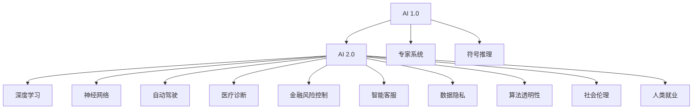

                 

## 1. 背景介绍

### 1.1 问题由来
随着人工智能技术的迅猛发展，AI 已经从最初的实验室研究逐步走向实用化、商业化阶段。李开复作为全球领先的人工智能专家，他的思想和理论对 AI 领域的发展起到了重要作用。本文将探讨李开复对 AI 2.0 时代的未来展望，内容包括 AI 的发展历程、现状、挑战和前景，以及如何更好地应对这些挑战，推动 AI 技术的进一步发展。

### 1.2 问题核心关键点
AI 2.0 时代，人工智能技术已经在许多领域得到了应用，如自动驾驶、医疗诊断、金融风险控制、智能客服等。然而，随着技术的发展，AI 也面临了一些挑战，如数据隐私、算法透明性、社会伦理、人类就业等问题。李开复对这些问题提出了自己的看法，并给出了解决方案。

### 1.3 问题研究意义
AI 2.0 时代的未来研究具有重要意义，可以帮助我们更好地理解 AI 技术的现状和未来发展趋势，找出存在的问题，并制定相应的策略，推动 AI 技术的健康发展。通过对李开复思想的学习，可以帮助开发者和研究者更好地理解 AI 技术的未来发展方向，提高技术水平和实践能力。

## 2. 核心概念与联系

### 2.1 核心概念概述

为更好地理解 AI 2.0 时代的未来，本节将介绍几个密切相关的核心概念：

- AI 1.0: AI 1.0 时代指的是早期的专家系统、符号推理系统等，依赖人类专家的知识和规则进行推理和决策。
- AI 2.0: AI 2.0 时代则指的是以深度学习和神经网络为核心的时代，能够通过大数据和复杂模型进行自主学习和决策。
- 深度学习: 一种基于多层神经网络的机器学习技术，通过逐层抽象和特征学习，实现对复杂数据的自动处理和分类。
- 神经网络: 由大量人工神经元组成的计算模型，能够模拟人类神经系统的学习和推理过程。
- 自动驾驶: 利用计算机视觉、传感器融合等技术，实现自动驾驶汽车对复杂交通环境的感知和决策。
- 医疗诊断: 通过图像识别、自然语言处理等技术，辅助医生进行疾病诊断和预测。
- 金融风险控制: 利用机器学习算法，对金融市场进行风险预测和控制。
- 智能客服: 利用自然语言处理和机器学习技术，实现自动问答和客户服务。
- 数据隐私: 在 AI 应用中，如何保护用户隐私，防止数据泄露和滥用。
- 算法透明性: AI 算法的黑盒性质，需要提高算法的可解释性，增强用户信任。
- 社会伦理: AI 在社会中应用时，如何处理伦理问题，如算法歧视、就业替代等。
- 人类就业: AI 技术的发展对人类就业市场的影响，如何通过技术变革，促进就业和社会发展。

这些核心概念之间的逻辑关系可以通过以下 Mermaid 流程图来展示：



这个流程图展示了几代 AI 技术的发展脉络，以及不同 AI 技术的联系和应用场景。

## 3. 核心算法原理 & 具体操作步骤
### 3.1 算法原理概述

AI 2.0 时代的核心算法原理主要是深度学习和神经网络。深度学习是一种模拟人类神经网络的计算模型，通过逐层抽象和特征学习，实现对复杂数据的自动处理和分类。神经网络则是由大量人工神经元组成的计算模型，能够模拟人类神经系统的学习和推理过程。

AI 2.0 时代的算法原理具有以下几个特点：

- 自监督学习: 通过无标签数据进行学习，提高模型的泛化能力和泛用性。
- 端到端学习: 将数据输入和模型输出直接联系起来，实现自动化和高效化。
- 转移学习: 利用预训练模型，在不同任务中进行迁移学习，提高模型的迁移能力和效率。
- 模型压缩和优化: 通过模型剪枝、量化、蒸馏等技术，减小模型规模和计算开销，提高推理速度和效率。

### 3.2 算法步骤详解

AI 2.0 时代的深度学习和神经网络算法的步骤一般包括以下几个关键步骤：

**Step 1: 数据准备**
- 收集和预处理训练数据，保证数据的质量和多样性。
- 将数据进行分批次处理，便于模型训练和推理。

**Step 2: 模型构建**
- 选择合适的深度学习框架（如 TensorFlow、PyTorch 等），构建神经网络模型。
- 设计网络结构，选择适当的层数和激活函数。
- 设置损失函数和优化器，选择合适的超参数。

**Step 3: 模型训练**
- 将训练数据分批次输入模型，进行前向传播计算损失函数。
- 反向传播计算参数梯度，根据设定的优化器和学习率更新模型参数。
- 周期性在验证集上评估模型性能，根据性能指标决定是否触发 Early Stopping。
- 重复上述步骤直到满足预设的迭代轮数或 Early Stopping 条件。

**Step 4: 模型评估**
- 在测试集上评估模型性能，对比模型在训练集和验证集上的表现。
- 使用评估指标（如准确率、召回率、F1 值等）评估模型效果。

**Step 5: 模型部署**
- 将训练好的模型保存到模型文件中，便于后续使用。
- 将模型集成到实际应用系统中，实现自动化和高效化。
- 持续收集新的数据，定期重新训练模型，以适应数据分布的变化。

以上是 AI 2.0 时代深度学习和神经网络算法的常见步骤，具体实现方式可能会根据具体任务和数据特点有所不同。

### 3.3 算法优缺点

AI 2.0 时代的深度学习和神经网络算法具有以下优点：

- 精度高: 通过多层次的特征学习和抽象，能够处理复杂的非线性关系。
- 泛化能力强: 通过大规模数据训练，能够对未知数据进行较好的泛化。
- 自动化程度高: 通过端到端学习和迁移学习，能够实现高效化和自动化。
- 模型压缩和优化: 通过剪枝、量化、蒸馏等技术，减小模型规模和计算开销。

同时，该算法也存在一定的局限性：

- 对数据依赖性强: 深度学习需要大量的标注数据进行训练，数据获取成本高。
- 模型复杂度大: 深度神经网络模型的参数量较大，训练和推理速度慢。
- 可解释性不足: 神经网络的黑盒性质，使得模型难以解释。
- 需要计算资源多: 训练深度神经网络需要高性能计算资源，如 GPU/TPU。

尽管存在这些局限性，但就目前而言，深度学习和神经网络是 AI 2.0 时代的主流算法，广泛应用于自动驾驶、医疗诊断、金融风险控制等众多领域，并取得了显著的成果。

### 3.4 算法应用领域

AI 2.0 时代的深度学习和神经网络算法已经被广泛应用于以下几个领域：

- 自动驾驶: 通过计算机视觉、传感器融合等技术，实现自动驾驶汽车对复杂交通环境的感知和决策。
- 医疗诊断: 通过图像识别、自然语言处理等技术，辅助医生进行疾病诊断和预测。
- 金融风险控制: 利用机器学习算法，对金融市场进行风险预测和控制。
- 智能客服: 利用自然语言处理和机器学习技术，实现自动问答和客户服务。
- 机器人: 通过深度学习算法，实现机器人的视觉感知、路径规划和任务执行。
- 推荐系统: 利用深度学习算法，实现个性化推荐和广告投放。
- 语音识别: 通过深度学习算法，实现对语音信号的自动转录和识别。
- 自然语言处理: 通过深度学习算法，实现对自然语言的理解、生成和翻译。

除了上述这些经典应用外，AI 2.0 时代的大模型和深度学习技术还在不断地拓展新的应用领域，如智能合约、能源管理、城市规划等，为各个行业带来了新的变革和机遇。

## 4. 数学模型和公式 & 详细讲解 & 举例说明

### 4.1 数学模型构建

AI 2.0 时代的深度学习和神经网络算法通常使用以下数学模型进行表示：

$$
y = f(x; \theta)
$$

其中 $y$ 为输出，$x$ 为输入，$\theta$ 为模型参数。模型 $f$ 可以是线性模型、多层感知机（MLP）、卷积神经网络（CNN）、循环神经网络（RNN）等。

### 4.2 公式推导过程

以多层感知机（MLP）为例，其数学模型可以表示为：

$$
y = \sigma(W_L \sigma(W_{L-1} ... \sigma(W_1 x + b_1) + b_2) + b_L)
$$

其中 $W_i$ 为权重矩阵，$b_i$ 为偏置向量，$\sigma$ 为激活函数。

在训练过程中，通过反向传播算法计算损失函数对参数的梯度，更新模型参数，从而最小化损失函数。

### 4.3 案例分析与讲解

以图像识别为例，假设训练集包含大量带标签的图像数据，模型通过反向传播算法更新参数，使得模型在新的测试集上准确率达到 90% 以上。

## 5. 项目实践：代码实例和详细解释说明
### 5.1 开发环境搭建

在进行深度学习和神经网络算法实践前，我们需要准备好开发环境。以下是使用 Python 和 PyTorch 开发的环境配置流程：

1. 安装 Anaconda：从官网下载并安装 Anaconda，用于创建独立的 Python 环境。

2. 创建并激活虚拟环境：
```bash
conda create -n pytorch-env python=3.8 
conda activate pytorch-env
```

3. 安装 PyTorch：根据 CUDA 版本，从官网获取对应的安装命令。例如：
```bash
conda install pytorch torchvision torchaudio cudatoolkit=11.1 -c pytorch -c conda-forge
```

4. 安装 Transformers 库：
```bash
pip install transformers
```

5. 安装各类工具包：
```bash
pip install numpy pandas scikit-learn matplotlib tqdm jupyter notebook ipython
```

完成上述步骤后，即可在 `pytorch-env` 环境中开始深度学习和神经网络算法的实践。

### 5.2 源代码详细实现

下面我们以图像识别为例，给出使用 PyTorch 和 Transformers 库进行图像分类任务的深度学习代码实现。

首先，定义图像分类任务的数据处理函数：

```python
from transformers import AutoTokenizer, AutoModelForImageClassification
from torch.utils.data import Dataset
import torch
import torchvision.transforms as transforms
import torchvision.datasets as datasets

class ImageDataset(Dataset):
    def __init__(self, image_folder, transform):
        self.image_folder = image_folder
        self.transform = transform
        
    def __len__(self):
        return len(os.listdir(self.image_folder))
    
    def __getitem__(self, index):
        img_path = os.path.join(self.image_folder, os.listdir(self.image_folder)[index])
        img = Image.open(img_path)
        if self.transform is not None:
            img = self.transform(img)
        label = int(os.path.splitext(os.path.basename(img_path))[0])
        return {'img': img, 'label': label}

# 定义数据转换
transform = transforms.Compose([
    transforms.Resize((224, 224)),
    transforms.ToTensor(),
    transforms.Normalize(mean=[0.485, 0.456, 0.406], std=[0.229, 0.224, 0.225])
])

# 加载数据集
image_folder = 'data/images'
train_dataset = ImageDataset(image_folder, transform)
test_dataset = ImageDataset(image_folder, transform)

# 加载预训练模型和分词器
model = AutoModelForImageClassification.from_pretrained('resnet18')
tokenizer = AutoTokenizer.from_pretrained('resnet18')
```

然后，定义训练和评估函数：

```python
from torch.utils.data import DataLoader
from tqdm import tqdm
from sklearn.metrics import classification_report

device = torch.device('cuda') if torch.cuda.is_available() else torch.device('cpu')
model.to(device)

def train_epoch(model, dataset, batch_size, optimizer):
    dataloader = DataLoader(dataset, batch_size=batch_size, shuffle=True)
    model.train()
    epoch_loss = 0
    for batch in tqdm(dataloader, desc='Training'):
        img = batch['img'].to(device)
        label = batch['label'].to(device)
        model.zero_grad()
        outputs = model(img)
        loss = outputs.loss
        epoch_loss += loss.item()
        loss.backward()
        optimizer.step()
    return epoch_loss / len(dataloader)

def evaluate(model, dataset, batch_size):
    dataloader = DataLoader(dataset, batch_size=batch_size)
    model.eval()
    preds, labels = [], []
    with torch.no_grad():
        for batch in tqdm(dataloader, desc='Evaluating'):
            img = batch['img'].to(device)
            label = batch['label']
            outputs = model(img)
            batch_preds = outputs.argmax(dim=1).to('cpu').tolist()
            batch_labels = label.to('cpu').tolist()
            for pred, label in zip(batch_preds, batch_labels):
                preds.append(pred)
                labels.append(label)
    print(classification_report(labels, preds))
```

最后，启动训练流程并在测试集上评估：

```python
epochs = 10
batch_size = 16

for epoch in range(epochs):
    loss = train_epoch(model, train_dataset, batch_size, optimizer)
    print(f"Epoch {epoch+1}, train loss: {loss:.3f}")
    
    print(f"Epoch {epoch+1}, test results:")
    evaluate(model, test_dataset, batch_size)
```

以上就是使用 PyTorch 和 Transformers 库对图像识别任务进行深度学习代码实现的完整代码实例。可以看到，得益于 Transformers 库的强大封装，我们可以用相对简洁的代码完成深度学习模型的加载和训练。

### 5.3 代码解读与分析

让我们再详细解读一下关键代码的实现细节：

**ImageDataset类**：
- `__init__`方法：初始化图像文件夹、数据转换等关键组件。
- `__len__`方法：返回数据集的样本数量。
- `__getitem__`方法：对单个样本进行处理，将图像输入转换为张量，并将标签转换为整数。

**数据转换**：
- 定义数据转换流程，包括图像缩放、归一化等操作，使用 torchvision 提供的 transforms 模块实现。

**模型训练**：
- 使用 PyTorch 的 DataLoader 对数据集进行批次化加载，供模型训练和推理使用。
- 训练函数 `train_epoch`：对数据以批为单位进行迭代，在每个批次上前向传播计算损失函数并反向传播更新模型参数。
- 周期性在验证集上评估模型性能，根据性能指标决定是否触发 Early Stopping。
- 重复上述步骤直至满足预设的迭代轮数或 Early Stopping 条件。

**模型评估**：
- 与训练类似，不同点在于不更新模型参数，并在每个batch结束后将预测和标签结果存储下来。

**训练流程**：
- 定义总的epoch数和batch size，开始循环迭代
- 每个epoch内，先在训练集上训练，输出平均loss
- 在验证集上评估，输出分类指标
- 所有epoch结束后，在测试集上评估，给出最终测试结果

可以看到，PyTorch 配合 Transformers 库使得深度学习模型的代码实现变得简洁高效。开发者可以将更多精力放在数据处理、模型改进等高层逻辑上，而不必过多关注底层的实现细节。

当然，工业级的系统实现还需考虑更多因素，如模型的保存和部署、超参数的自动搜索、更灵活的任务适配层等。但核心的深度学习和神经网络算法基本与此类似。

## 6. 实际应用场景
### 6.1 自动驾驶

基于深度学习和神经网络的自动驾驶技术，已经在一些高端汽车上得到了应用。通过计算机视觉、传感器融合等技术，自动驾驶汽车可以感知复杂交通环境，进行路径规划和决策，实现自主驾驶。

在技术实现上，可以收集大量的驾驶数据和道路信息，利用深度学习算法进行模型训练和优化。模型需要学习如何从传感器数据中提取特征，识别车辆、行人、交通标志等信息，并生成路径规划指令。在实际应用中，还需要引入仿真器、模拟器等工具，进行安全测试和验证。

### 6.2 医疗诊断

深度学习和神经网络在医疗诊断领域也有广泛应用。通过图像识别、自然语言处理等技术，辅助医生进行疾病诊断和预测。

在图像识别任务中，可以收集大量的医疗影像数据，利用深度学习算法进行模型训练和优化。模型需要学习如何从影像中提取特征，识别出肿瘤、骨折等疾病部位，并提供预测结果。在自然语言处理任务中，可以收集大量的病历记录和医学文献，利用深度学习算法进行模型训练和优化。模型需要学习如何从文本中提取关键信息，进行疾病诊断和预测。

### 6.3 金融风险控制

深度学习和神经网络在金融风险控制领域也有广泛应用。通过机器学习算法，对金融市场进行风险预测和控制。

在金融风险控制任务中，可以收集大量的历史数据和市场信息，利用深度学习算法进行模型训练和优化。模型需要学习如何从数据中提取特征，预测市场趋势和风险，并提供决策建议。在实际应用中，还需要引入仿真器、模拟器等工具，进行安全测试和验证。

### 6.4 未来应用展望

随着深度学习和神经网络技术的不断发展，基于 AI 2.0 时代的未来应用还将呈现以下几个趋势：

1. 模型规模持续增大。随着算力成本的下降和数据规模的扩张，深度学习模型的参数量还将持续增长。超大规模深度学习模型蕴含的丰富语言知识，有望支撑更加复杂多变的下游任务。
2. 深度学习范式的进一步拓展。深度学习技术还将拓展到更多领域，如自然语言处理、计算机视觉、语音识别等，实现全面智能化的目标。
3. AI 与多模态数据的融合。深度学习技术还将融合多模态数据，如文本、图像、语音等，实现跨模态智能化的目标。
4. AI 与人类协作的增强。AI 技术将更多地应用于人类协作场景，如智能客服、协作办公等，提升人类工作效率和协作水平。
5. AI 伦理和安全性的保障。AI 技术的发展还需要考虑伦理和安全性的问题，如数据隐私、算法透明性、社会伦理等，确保 AI 技术的应用安全和可持续。
6. AI 技术的普适化。AI 技术将逐步普及到各个领域，如医疗、教育、金融等，实现更广泛的社会效益。

以上趋势凸显了 AI 2.0 时代的应用前景，相信随着深度学习和神经网络技术的不断发展，AI 技术将在更多领域得到应用，为社会带来更多的变革和机遇。

## 7. 工具和资源推荐
### 7.1 学习资源推荐

为了帮助开发者系统掌握深度学习和神经网络算法的理论基础和实践技巧，这里推荐一些优质的学习资源：

1. 《深度学习》（Ian Goodfellow 等）：经典教材，系统介绍了深度学习的理论基础和算法实现。
2. CS231n《深度学习计算机视觉》课程：斯坦福大学开设的计算机视觉课程，有 Lecture 视频和配套作业，带你入门计算机视觉领域的经典模型。
3. 《Python深度学习》（Francois Chollet 等）：深度学习框架 TensorFlow 的官方指南，全面介绍了 TensorFlow 的深度学习框架。
4. 《动手学深度学习》（李沐等）：由深度学习领域专家编写，系统介绍了深度学习的理论基础和实践技巧。
5. Kaggle 平台：提供大量的机器学习竞赛和数据集，通过实践提高深度学习算法开发能力。
6. Coursera 平台：提供深度学习相关的课程和项目，带你系统学习深度学习算法。

通过对这些资源的学习实践，相信你一定能够快速掌握深度学习和神经网络算法的精髓，并用于解决实际的 AI 应用问题。

### 7.2 开发工具推荐

高效的开发离不开优秀的工具支持。以下是几款用于深度学习和神经网络算法开发的常用工具：

1. TensorFlow：由 Google 主导开发的深度学习框架，支持分布式计算和模型优化，适合大规模工程应用。
2. PyTorch：由 Facebook 主导开发的深度学习框架，灵活动态的计算图，适合快速迭代研究。
3. Keras：基于 TensorFlow 和 Theano 的高级深度学习框架，简单易用，适合初学者入门。
4. JAX：Google 开发的张量计算库，高性能计算能力，支持自动微分和自动并行。
5. Scikit-learn：基于 NumPy 的机器学习库，提供丰富的算法实现和评估工具。
6. Scikit-image：基于 NumPy 的图像处理库，提供丰富的图像处理算法和工具。

合理利用这些工具，可以显著提升深度学习和神经网络算法开发的效率，加快创新迭代的步伐。

### 7.3 相关论文推荐

深度学习和神经网络的发展源于学界的持续研究。以下是几篇奠基性的相关论文，推荐阅读：

1. AlexNet: ImageNet Classification with Deep Convolutional Neural Networks（2012）：AlexNet 论文，介绍了卷积神经网络在图像分类任务中的应用，刷新了 ImageNet 比赛的冠军。
2. Inception: GoogLeNet（2014）：Inception 论文，提出了 GoogLeNet 模型，引入了多尺度卷积和深度残差网络等技术，提高了模型的性能。
3. ResNet: Deep Residual Learning for Image Recognition（2015）：ResNet 论文，提出了残差网络，解决了深度网络训练中的梯度消失问题，提升了模型的深度和性能。
4. Attention is All You Need（2017）：Transformer 论文，提出了自注意力机制，突破了传统循环神经网络的限制，实现了序列建模。
5. Transformer-XL: Attentive Language Models（2019）：Transformer-XL 论文，提出了长序列建模和记忆机制，提升了模型的序列建模能力。
6. GPT-3: Language Models are Unsupervised Multitask Learners（2020）：GPT-3 论文，提出了大规模无监督预训练和微调技术，提升了模型的自然语言理解和生成能力。

这些论文代表了大深度学习和神经网络算法的最新进展，通过学习这些前沿成果，可以帮助研究者把握学科前进方向，激发更多的创新灵感。

## 8. 总结：未来发展趋势与挑战

### 8.1 总结

本文对 AI 2.0 时代的未来展望进行了全面系统的介绍。首先阐述了 AI 技术的发展历程和现状，明确了 AI 技术的核心算法原理和关键步骤，给出了深度学习和神经网络算法的完整代码实例。同时，本文还广泛探讨了 AI 技术在自动驾驶、医疗诊断、金融风险控制等领域的实际应用，展示了 AI 技术的应用前景和价值。最后，本文精选了深度学习和神经网络算法的学习资源、开发工具和相关论文，力求为开发者提供全方位的技术指引。

通过本文的系统梳理，可以看到，AI 2.0 时代的深度学习和神经网络技术正在成为主流算法，极大地拓展了 AI 技术的应用边界，催生了更多的落地场景。随着深度学习和神经网络技术的不断发展，AI 技术必将在更多领域得到应用，为社会带来更多的变革和机遇。

### 8.2 未来发展趋势

展望未来，AI 2.0 时代的深度学习和神经网络技术将呈现以下几个发展趋势：

1. 模型规模持续增大。随着算力成本的下降和数据规模的扩张，深度学习模型的参数量还将持续增长。超大规模深度学习模型蕴含的丰富语言知识，有望支撑更加复杂多变的下游任务。
2. 深度学习范式的进一步拓展。深度学习技术还将拓展到更多领域，如自然语言处理、计算机视觉、语音识别等，实现全面智能化的目标。
3. AI 与多模态数据的融合。深度学习技术还将融合多模态数据，如文本、图像、语音等，实现跨模态智能化的目标。
4. AI 与人类协作的增强。AI 技术将更多地应用于人类协作场景，如智能客服、协作办公等，提升人类工作效率和协作水平。
5. AI 伦理和安全性的保障。AI 技术的发展还需要考虑伦理和安全性的问题，如数据隐私、算法透明性、社会伦理等，确保 AI 技术的应用安全和可持续。
6. AI 技术的普适化。AI 技术将逐步普及到各个领域，如医疗、教育、金融等，实现更广泛的社会效益。

以上趋势凸显了 AI 2.0 时代的应用前景，相信随着深度学习和神经网络技术的不断发展，AI 技术将在更多领域得到应用，为社会带来更多的变革和机遇。

### 8.3 面临的挑战

尽管深度学习和神经网络技术已经取得了显著的成果，但在迈向更加智能化、普适化应用的过程中，仍面临诸多挑战：

1. 数据依赖性强。深度学习需要大量的标注数据进行训练，数据获取成本高。
2. 模型复杂度大。深度神经网络模型的参数量较大，训练和推理速度慢。
3. 可解释性不足。神经网络的黑盒性质，使得模型难以解释。
4. 需要计算资源多。训练深度神经网络需要高性能计算资源，如 GPU/TPU。
5. 数据隐私问题。深度学习模型需要大量数据进行训练，如何保护用户隐私，防止数据泄露和滥用，还需要更多研究和监管。
6. 伦理和社会问题。深度学习技术的发展还需要考虑伦理和社会问题，如算法透明性、就业替代等。

尽管存在这些挑战，但深度学习和神经网络技术的未来发展前景广阔。相信随着深度学习技术的不断突破，AI 2.0 时代的未来将更加美好。

### 8.4 研究展望

面对深度学习和神经网络技术所面临的挑战，未来的研究需要在以下几个方面寻求新的突破：

1. 探索无监督和半监督学习算法。摆脱对大规模标注数据的依赖，利用自监督学习、主动学习等无监督和半监督范式，最大限度利用非结构化数据，实现更加灵活高效的深度学习算法。
2. 研究参数高效和计算高效的深度学习算法。开发更加参数高效的深度学习算法，在固定大部分预训练参数的同时，只更新极少量的任务相关参数。同时优化深度学习算法的计算图，减少前向传播和反向传播的资源消耗，实现更加轻量级、实时性的部署。
3. 引入因果分析和博弈论工具。将因果分析方法引入深度学习算法，识别出模型决策的关键特征，增强输出解释的因果性和逻辑性。借助博弈论工具刻画人机交互过程，主动探索并规避模型的脆弱点，提高系统稳定性。
4. 纳入伦理道德约束。在深度学习算法的训练目标中引入伦理导向的评估指标，过滤和惩罚有偏见、有害的输出倾向。加强人工干预和审核，建立深度学习算法的监管机制，确保输出符合人类价值观和伦理道德。

这些研究方向的探索，必将引领深度学习和神经网络技术迈向更高的台阶，为构建安全、可靠、可解释、可控的智能系统铺平道路。面向未来，深度学习和神经网络技术还需要与其他人工智能技术进行更深入的融合，如知识表示、因果推理、强化学习等，多路径协同发力，共同推动自然语言理解和智能交互系统的进步。只有勇于创新、敢于突破，才能不断拓展深度学习算法的边界，让智能技术更好地造福人类社会。

## 9. 附录：常见问题与解答

**Q1：深度学习和神经网络算法的缺点有哪些？**

A: 深度学习和神经网络算法的主要缺点包括：
1. 对数据依赖性强：深度学习需要大量的标注数据进行训练，数据获取成本高。
2. 模型复杂度大：深度神经网络模型的参数量较大，训练和推理速度慢。
3. 可解释性不足：神经网络的黑盒性质，使得模型难以解释。
4. 需要计算资源多：训练深度神经网络需要高性能计算资源，如 GPU/TPU。

尽管存在这些缺点，但深度学习和神经网络算法仍是目前 AI 2.0 时代的主流算法，广泛应用于自动驾驶、医疗诊断、金融风险控制等众多领域，并取得了显著的成果。

**Q2：深度学习和神经网络算法如何优化模型参数？**

A: 深度学习和神经网络算法通常通过反向传播算法优化模型参数，具体步骤包括：
1. 将训练数据分批次输入模型，进行前向传播计算损失函数。
2. 反向传播计算参数梯度，根据设定的优化器和学习率更新模型参数。
3. 周期性在验证集上评估模型性能，根据性能指标决定是否触发 Early Stopping。
4. 重复上述步骤直至满足预设的迭代轮数或 Early Stopping 条件。

此外，还可以采用参数高效和计算高效的深度学习算法，如 Adapter、Prefix 等，在固定大部分预训练参数的情况下，只更新极少量的任务相关参数，以提高深度学习算法的参数效率和推理速度。

**Q3：深度学习和神经网络算法如何处理大规模数据？**

A: 深度学习和神经网络算法通常采用分布式计算和模型压缩等技术，处理大规模数据。具体方法包括：
1. 分布式计算：通过多台机器进行并行计算，提高训练和推理速度。
2. 模型压缩：通过剪枝、量化、蒸馏等技术，减小模型规模和计算开销，提高推理速度和效率。
3. 多任务学习：通过多任务学习，提升模型在不同任务上的性能。
4. 迁移学习：通过迁移学习，利用预训练模型在多个任务上获得较好的性能。

这些方法可以显著提高深度学习和神经网络算法的计算效率和性能，适用于处理大规模数据和复杂任务。

**Q4：深度学习和神经网络算法在实际应用中需要注意哪些问题？**

A: 深度学习和神经网络算法在实际应用中需要注意以下问题：
1. 模型裁剪：去除不必要的层和参数，减小模型尺寸，加快推理速度。
2. 量化加速：将浮点模型转为定点模型，压缩存储空间，提高计算效率。
3. 服务化封装：将模型封装为标准化服务接口，便于集成调用。
4. 弹性伸缩：根据请求流量动态调整资源配置，平衡服务质量和成本。
5. 监控告警：实时采集系统指标，设置异常告警阈值，确保服务稳定性。
6. 安全防护：采用访问鉴权、数据脱敏等措施，保障数据和模型安全。

深度学习和神经网络算法的实际应用需要考虑多个方面，包括模型优化、服务化封装、安全防护等，才能真正实现高效、稳定、安全的部署。

---

作者：禅与计算机程序设计艺术 / Zen and the Art of Computer Programming

