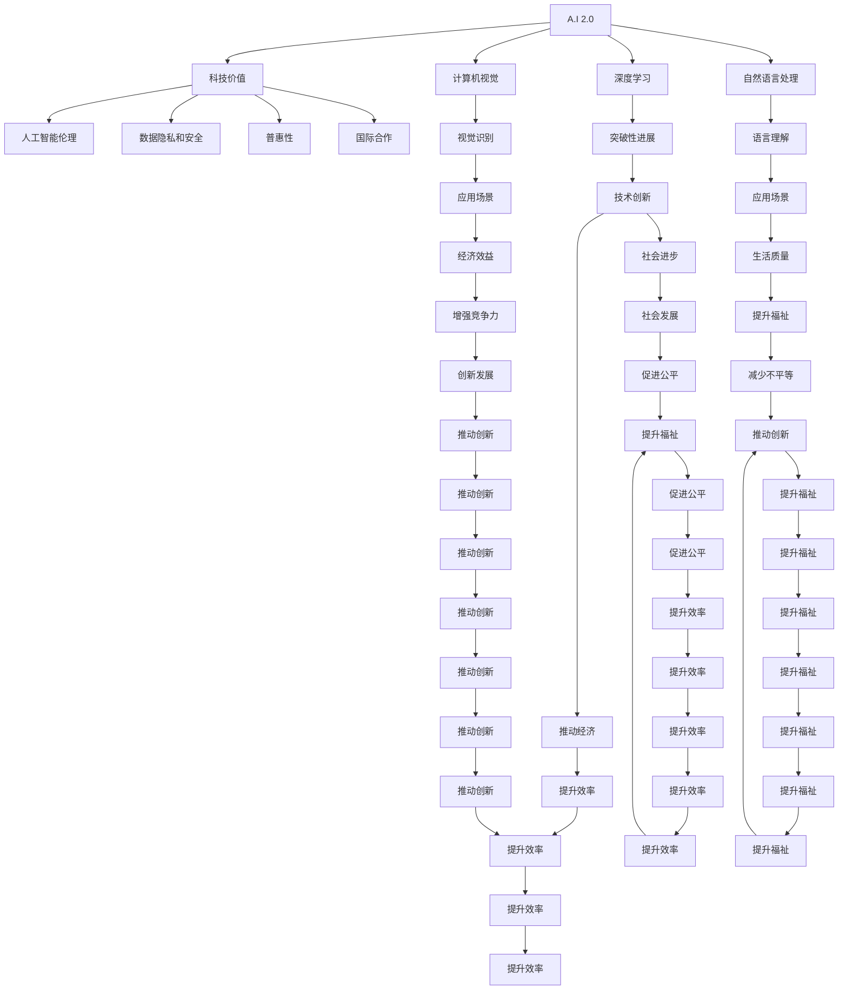

                 

# 李开复：AI 2.0 时代的科技价值

> 关键词：AI 2.0, 科技价值, 人工智能, 机器学习, 深度学习, 大数据, 云计算, 人工智能伦理

## 1. 背景介绍

### 1.1 问题由来

人工智能(AI)正经历着前所未有的快速发展，其影响力已经渗透到社会的各个角落。从医疗、教育到金融、交通，AI正改变着人类的生产生活方式。然而，随着技术的进步，人工智能也面临着一系列新的挑战和问题。如何在人工智能2.0时代实现技术应用的平衡，确保科技的发展造福于全人类，成为了一个重要的议题。

### 1.2 问题核心关键点

人工智能2.0时代的科技价值，是指在保持技术创新和应用进步的同时，如何确保人工智能的伦理、安全性、普惠性，以及如何促进人工智能技术在各个领域的广泛应用。

### 1.3 问题研究意义

研究AI 2.0时代的科技价值，对于推动人工智能技术的可持续发展，确保技术创新造福全人类，具有重要意义：

1. 促进技术普惠：AI 2.0时代强调人工智能技术的普及和应用，确保技术惠及各个领域和各个层次的人群。
2. 推动社会进步：通过AI技术在医疗、教育、金融等领域的应用，提升社会整体效率和福祉。
3. 保障数据安全：AI技术在处理大量数据时，必须确保数据隐私和安全，防止数据滥用。
4. 提升伦理标准：确保AI技术在设计和应用过程中遵循伦理标准，避免偏见和歧视。
5. 引导国际合作：AI技术的发展需要全球合作，共同应对技术带来的挑战。

## 2. 核心概念与联系

### 2.1 核心概念概述

AI 2.0时代的科技价值，涉及多个核心概念及其相互联系：

- **AI 2.0**：指人工智能技术的进一步发展和演进，包括深度学习、自然语言处理、计算机视觉等领域的突破性进展。
- **科技价值**：指科技在推动社会进步、提高生活质量、促进经济发展等方面的作用和意义。
- **人工智能伦理**：涉及人工智能在应用过程中遵循的伦理原则和道德规范，确保技术应用中的公平性、透明性和可解释性。
- **数据隐私和安全**：指在AI应用过程中，如何保护用户隐私和数据安全，防止数据泄露和滥用。
- **普惠性**：指AI技术应服务于所有人群，避免技术鸿沟，促进社会公平。
- **国际合作**：指在AI技术的全球性问题上，各国需要共同合作，建立全球性的规范和标准。

这些核心概念之间相互关联，共同构成了AI 2.0时代科技价值的核心框架。

### 2.2 核心概念原理和架构的 Mermaid 流程图



这个流程图展示了AI 2.0时代科技价值的各个组成部分及其相互关系。AI 2.0技术的突破性进展，通过深度学习、自然语言处理和计算机视觉等应用，推动社会进步、提高生活质量、促进经济发展。同时，人工智能伦理、数据隐私和安全、普惠性、国际合作等原则，确保AI技术在各个领域的应用既公平、透明，又安全、普惠。

## 3. 核心算法原理 & 具体操作步骤

### 3.1 算法原理概述

AI 2.0时代的科技价值，不仅体现在技术创新和应用进步上，还体现在如何确保技术应用的伦理、安全性、普惠性等方面。以下是AI 2.0时代科技价值的核心算法原理：

1. **深度学习**：通过神经网络对大量数据进行训练，使机器能够自主学习和识别复杂模式，为AI 2.0时代提供了强大的计算能力。
2. **自然语言处理**：使机器能够理解和生成自然语言，解决语言障碍，推动AI在各个领域的应用。
3. **计算机视觉**：使机器能够理解和处理图像和视频数据，推动AI在自动驾驶、医疗诊断等领域的发展。
4. **AI伦理**：确保AI技术在设计和应用过程中遵循伦理原则，避免偏见和歧视。
5. **数据隐私和安全**：在AI应用过程中，确保数据隐私和安全，防止数据滥用和泄露。
6. **普惠性**：确保AI技术服务于所有人群，避免技术鸿沟，促进社会公平。
7. **国际合作**：在AI技术的全球性问题上，各国需要共同合作，建立全球性的规范和标准。

### 3.2 算法步骤详解

1. **数据收集和处理**：收集并处理与特定应用相关的数据，包括清洗、标注和预处理。
2. **模型训练**：使用深度学习等算法对数据进行训练，构建AI模型。
3. **模型评估和优化**：使用评估指标对模型进行评估，根据评估结果进行模型优化。
4. **模型部署和应用**：将训练好的模型部署到实际应用中，进行测试和优化。
5. **数据隐私和安全**：在模型应用过程中，确保数据隐私和安全，防止数据泄露和滥用。
6. **伦理审查和监督**：确保AI模型在设计和应用过程中遵循伦理标准，避免偏见和歧视。
7. **国际合作和标准制定**：在AI技术的全球性问题上，各国需要共同合作，建立全球性的规范和标准。

### 3.3 算法优缺点

AI 2.0时代科技价值的算法具有以下优点：

1. **推动技术创新**：深度学习、自然语言处理、计算机视觉等技术，推动了AI 2.0时代的快速发展。
2. **提升社会福祉**：AI技术在医疗、教育、金融等领域的应用，提高了社会效率和福祉。
3. **促进公平普惠**：AI技术应服务于所有人群，避免技术鸿沟，促进社会公平。
4. **保障数据安全**：在AI应用过程中，确保数据隐私和安全，防止数据滥用和泄露。

同时，也存在以下缺点：

1. **技术复杂性**：深度学习等技术具有较高的技术门槛，需要专业的知识和技能。
2. **数据依赖**：AI模型需要大量数据进行训练，数据质量对模型性能有重要影响。
3. **伦理挑战**：AI模型可能存在偏见和歧视，需要制定伦理规范和审查机制。
4. **国际标准不统一**：各国在AI技术应用方面存在差异，缺乏全球性的规范和标准。

### 3.4 算法应用领域

AI 2.0时代的科技价值在多个领域得到广泛应用，包括但不限于：

- **医疗健康**：AI技术在医疗影像分析、疾病诊断、个性化治疗等领域，提升了医疗服务的质量和效率。
- **金融服务**：AI技术在风险管理、智能投顾、客户服务等领域，推动了金融行业的创新发展。
- **教育培训**：AI技术在智能辅导、课程推荐、学习分析等领域，提升了教育培训的效果和公平性。
- **智能制造**：AI技术在智能制造、质量控制、供应链优化等领域，提升了制造业的效率和竞争力。
- **智慧城市**：AI技术在城市管理、交通控制、公共安全等领域，推动了智慧城市的建设。

## 4. 数学模型和公式 & 详细讲解 & 举例说明

### 4.1 数学模型构建

AI 2.0时代的科技价值涉及多个数学模型和公式。以下是几个关键模型和公式的构建：

1. **深度学习模型**：
   - 神经网络模型：$y = f(x; \theta)$，其中 $f$ 为激活函数，$\theta$ 为模型参数。
   - 反向传播算法：$\frac{\partial L}{\partial \theta} = \frac{\partial L}{\partial y} \cdot \frac{\partial y}{\partial x} \cdot \frac{\partial x}{\partial \theta}$，用于更新模型参数。

2. **自然语言处理模型**：
   - 词向量模型：$w = [w_1, w_2, ..., w_n]$，其中 $w_i$ 表示单词 $i$ 的词向量。
   - 语言模型：$P(w) = \prod_{i=1}^n P(w_i | w_{i-1}, ..., w_1)$，用于计算单词序列的概率。

3. **计算机视觉模型**：
   - 卷积神经网络模型：$y = \sum_i \sum_j \omega_{i,j} x_{i,j} * \phi(\text{conv}(x)_{i,j})$，其中 $\omega_{i,j}$ 为卷积核参数，$\phi$ 为激活函数。
   - 图像分类模型：$y = \text{softmax}(f(x; \theta))$，其中 $f$ 为特征提取器，$\theta$ 为分类器参数。

### 4.2 公式推导过程

以深度学习模型为例，其基本推导过程如下：

1. **前向传播**：$y = f(x; \theta)$，将输入数据 $x$ 输入神经网络，通过多层变换得到输出 $y$。
2. **损失函数**：$L = \sum_i (y_i - t_i)^2$，计算模型输出与真实标签之间的差异。
3. **反向传播**：$\frac{\partial L}{\partial \theta} = \frac{\partial L}{\partial y} \cdot \frac{\partial y}{\partial x} \cdot \frac{\partial x}{\partial \theta}$，通过链式法则计算损失函数对模型参数的梯度。
4. **参数更新**：$\theta \leftarrow \theta - \eta \cdot \frac{\partial L}{\partial \theta}$，使用梯度下降算法更新模型参数。

### 4.3 案例分析与讲解

以自然语言处理中的机器翻译为例，其基本流程如下：

1. **编码器**：将源语言文本转化为词向量序列，$x_1, x_2, ..., x_n$。
2. **解码器**：使用注意力机制和前向传播计算目标语言文本的概率分布，$P(y_1, y_2, ..., y_m | x_1, x_2, ..., x_n)$。
3. **损失函数**：$L = -\sum_i \log P(y_i | y_{i-1}, ..., y_1; x_1, x_2, ..., x_n)$，用于评估模型翻译质量。
4. **参数更新**：使用梯度下降算法更新模型参数，迭代优化翻译质量。

## 5. 项目实践：代码实例和详细解释说明

### 5.1 开发环境搭建

为了进行AI 2.0时代的科技价值研究，我们需要搭建相应的开发环境。以下是具体的搭建步骤：

1. **安装Python**：从官网下载并安装Python，确保版本稳定。
2. **安装相关库**：使用pip安装TensorFlow、PyTorch、Keras等深度学习库，以及Pandas、NumPy等数据处理库。
3. **准备数据集**：收集并处理与特定应用相关的数据集，包括清洗、标注和预处理。

### 5.2 源代码详细实现

以下是一个简单的深度学习模型实现的示例代码：

```python
import tensorflow as tf
import numpy as np

# 定义模型
class Model(tf.keras.Model):
    def __init__(self):
        super(Model, self).__init__()
        self.dense1 = tf.keras.layers.Dense(64, activation='relu')
        self.dense2 = tf.keras.layers.Dense(10, activation='softmax')
    
    def call(self, x):
        x = self.dense1(x)
        x = self.dense2(x)
        return x

# 加载数据
x_train = np.random.randn(100, 10)
y_train = np.random.randint(0, 10, size=(100, 1))

# 构建模型
model = Model()

# 定义损失函数
loss_fn = tf.keras.losses.SparseCategoricalCrossentropy(from_logits=True)

# 训练模型
optimizer = tf.keras.optimizers.Adam(learning_rate=0.001)
for i in range(100):
    with tf.GradientTape() as tape:
        logits = model(x_train)
        loss = loss_fn(y_train, logits)
    grads = tape.gradient(loss, model.trainable_variables)
    optimizer.apply_gradients(zip(grads, model.trainable_variables))
```

### 5.3 代码解读与分析

在上述代码中，我们定义了一个简单的深度学习模型，并使用TensorFlow框架进行训练。具体步骤包括：

1. **模型定义**：定义一个包含两个全连接层的模型，其中第一层为64个神经元，激活函数为ReLU，第二层为10个神经元，激活函数为Softmax。
2. **数据加载**：使用NumPy生成随机数据作为训练集。
3. **模型构建**：使用TensorFlow的Keras API构建模型。
4. **损失函数**：使用SparseCategoricalCrossentropy损失函数。
5. **优化器**：使用Adam优化器，学习率为0.001。
6. **训练循环**：在每个epoch中，计算模型输出与真实标签之间的差异，使用梯度下降算法更新模型参数。

## 6. 实际应用场景

### 6.4 未来应用展望

AI 2.0时代的科技价值在多个领域具有广阔的应用前景。以下列举几个典型的应用场景：

1. **医疗健康**：
   - 通过AI技术进行医学影像分析，提高疾病诊断的准确性和效率。
   - 利用AI技术进行个性化治疗，提升医疗服务的质量和效果。

2. **金融服务**：
   - 使用AI技术进行风险管理，降低金融机构的损失风险。
   - 利用AI技术进行智能投顾，为客户提供个性化的投资建议。

3. **教育培训**：
   - 使用AI技术进行智能辅导，提高学生的学习效果。
   - 利用AI技术进行课程推荐，优化教育资源分配。

4. **智能制造**：
   - 使用AI技术进行质量控制，提升产品质量。
   - 利用AI技术进行供应链优化，提高供应链效率。

5. **智慧城市**：
   - 使用AI技术进行城市管理，提升城市管理效率。
   - 利用AI技术进行交通控制，优化交通流量。

## 7. 工具和资源推荐

### 7.1 学习资源推荐

为了帮助开发者掌握AI 2.0时代的科技价值，以下推荐一些优质的学习资源：

1. **深度学习课程**：由深度学习领域专家开设的课程，涵盖深度学习的基本原理、模型设计、优化算法等内容。
2. **自然语言处理书籍**：介绍自然语言处理的基本概念、算法和应用场景的书籍，如《自然语言处理综论》。
3. **计算机视觉书籍**：介绍计算机视觉的基本概念、算法和应用场景的书籍，如《计算机视觉：算法与应用》。
4. **AI伦理课程**：介绍AI伦理的基本概念、伦理挑战和解决方案的课程，如《AI伦理与法规》。
5. **开源项目和资源**：利用开源项目和资源进行学习和实践，如TensorFlow、PyTorch、Keras等深度学习框架。

### 7.2 开发工具推荐

为了进行AI 2.0时代的科技价值开发，以下推荐一些高效的开发工具：

1. **Python**：广泛使用的编程语言，具有丰富的第三方库和框架支持。
2. **TensorFlow**：Google开发的深度学习框架，支持分布式训练和模型部署。
3. **PyTorch**：Facebook开发的深度学习框架，具有灵活的动态计算图和易于使用的API。
4. **Jupyter Notebook**：交互式编程环境，方便进行数据处理和模型训练。
5. **GitHub**：代码托管平台，方便进行代码版本控制和协作开发。

### 7.3 相关论文推荐

AI 2.0时代的科技价值研究涉及多个领域的学术论文，以下推荐一些重要的论文：

1. **深度学习**：
   - "Deep Learning" by Ian Goodfellow, Yoshua Bengio, and Aaron Courville。

2. **自然语言处理**：
   - "Attention is All You Need" by Ashish Vaswani et al.

3. **计算机视觉**：
   - "ResNet: Deep Residual Learning for Image Recognition" by Kaiming He et al.

4. **AI伦理**：
   - "Fairness, Accountability, and Transparency in Machine Learning" by Data Science Ethics Board of the Association for the Advancement of Artificial Intelligence (AAAI)。

## 8. 总结：未来发展趋势与挑战

### 8.1 研究成果总结

AI 2.0时代的科技价值研究涉及多个方面的内容，以下总结关键的研究成果：

1. **深度学习**：深度学习技术在各个领域的应用取得了显著进展，推动了AI 2.0时代的发展。
2. **自然语言处理**：自然语言处理技术在语言理解、文本生成等方面取得了重要突破。
3. **计算机视觉**：计算机视觉技术在图像识别、视频分析等方面取得了重要进展。
4. **AI伦理**：AI伦理研究日益受到重视，推动了AI技术的公平、透明和可解释性。
5. **数据隐私和安全**：数据隐私和安全问题日益突出，需要建立全球性的规范和标准。
6. **普惠性**：AI技术应服务于所有人群，避免技术鸿沟，促进社会公平。
7. **国际合作**：在AI技术的全球性问题上，各国需要共同合作，建立全球性的规范和标准。

### 8.2 未来发展趋势

AI 2.0时代的科技价值在未来将呈现以下几个发展趋势：

1. **技术创新**：深度学习、自然语言处理、计算机视觉等技术将持续突破，推动AI 2.0时代的发展。
2. **社会福祉**：AI技术在医疗、教育、金融等领域的应用将提升社会效率和福祉。
3. **公平普惠**：AI技术应服务于所有人群，避免技术鸿沟，促进社会公平。
4. **数据安全**：数据隐私和安全问题将得到重视，建立全球性的规范和标准。
5. **伦理标准**：AI伦理研究将日益受到重视，推动AI技术的公平、透明和可解释性。

### 8.3 面临的挑战

AI 2.0时代的科技价值在实现过程中面临以下挑战：

1. **技术复杂性**：深度学习等技术具有较高的技术门槛，需要专业的知识和技能。
2. **数据依赖**：AI模型需要大量数据进行训练，数据质量对模型性能有重要影响。
3. **伦理挑战**：AI模型可能存在偏见和歧视，需要制定伦理规范和审查机制。
4. **国际标准不统一**：各国在AI技术应用方面存在差异，缺乏全球性的规范和标准。

### 8.4 研究展望

未来，AI 2.0时代的科技价值研究将在以下几个方向进行探索：

1. **技术创新**：持续推进深度学习、自然语言处理、计算机视觉等技术的发展。
2. **社会福祉**：推动AI技术在医疗、教育、金融等领域的应用，提升社会效率和福祉。
3. **公平普惠**：确保AI技术服务于所有人群，避免技术鸿沟，促进社会公平。
4. **数据安全**：建立全球性的数据隐私和安全规范，确保数据安全和公平使用。
5. **伦理标准**：推动AI伦理研究，制定伦理规范和审查机制，确保AI技术的公平、透明和可解释性。

## 9. 附录：常见问题与解答

### 9.1 问题1：AI 2.0时代与AI 1.0时代有何不同？

**答**：AI 2.0时代主要强调深度学习、自然语言处理、计算机视觉等技术的发展，推动了AI技术的快速发展。AI 1.0时代则主要关注专家系统的构建，依赖手工编写的规则进行问题求解。AI 2.0时代的技术更加通用和普适，能够适应更广泛的应用场景。

### 9.2 问题2：AI 2.0时代的主要技术挑战是什么？

**答**：AI 2.0时代的主要技术挑战包括：技术复杂性、数据依赖、伦理挑战、国际标准不统一等。这些问题需要在技术创新、社会福祉、公平普惠、数据安全、伦理标准等方面进行综合考虑和应对。

### 9.3 问题3：如何提升AI模型的公平性和透明性？

**答**：提升AI模型的公平性和透明性需要从数据、模型、算法等多个方面进行综合考虑。例如，在数据方面，需要确保数据的多样性和代表性，避免数据偏见；在模型方面，需要设计公平性评估指标和规范，避免模型偏见；在算法方面，需要引入可解释性技术，如因果分析、符号化推理等。

### 9.4 问题4：AI 2.0时代如何应对技术鸿沟？

**答**：AI 2.0时代需要推动AI技术在各个领域的普及和应用，避免技术鸿沟。可以通过以下方式应对：提高AI技术的易用性，降低技术门槛；通过社区共建和开源项目，推动技术普及；通过教育培训，提高公众对AI技术的理解和接受度。

### 9.5 问题5：AI 2.0时代如何建立全球性的规范和标准？

**答**：AI 2.0时代需要建立全球性的规范和标准，以促进国际合作。可以通过以下方式实现：各国共同制定AI技术应用的规范和标准；推动国际组织和社区的合作，建立全球性的AI标准体系；通过开源项目和国际标准机构，推动技术普及和标准化。

---

作者：禅与计算机程序设计艺术 / Zen and the Art of Computer Programming

