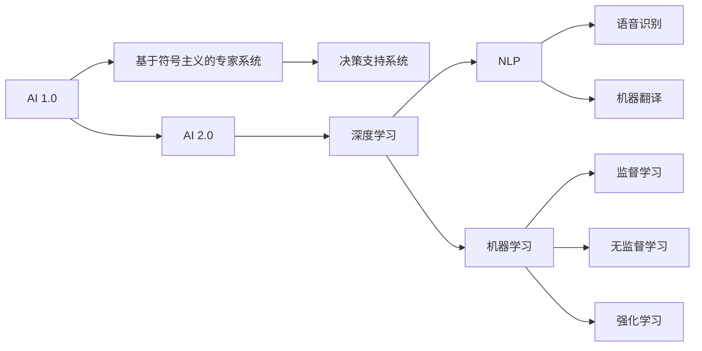

                 

# 李开复：AI 2.0 时代的领军者

> 关键词：人工智能, AI 2.0, 创新, 技术领袖, 行业影响, 未来趋势, 研究导向, 实践应用

## 1. 背景介绍

### 1.1 问题由来
自20世纪中叶以来，人工智能(AI)已经经历了多次起伏，从第一次人工智能热潮到深度学习革命的爆发，再到AI 2.0时代的来临，人工智能技术在短短几十年间实现了从科学幻想到现实应用的飞跃。在这一过程中，李开复博士作为AI领域的杰出代表，以其前瞻性的视野和卓越的实践经验，始终站在技术发展的最前沿，引领AI 2.0时代的到来。

李开复博士在人工智能领域的贡献不仅限于学术研究，更在于其在产业界的深远影响。他曾多次担任世界顶级科技公司如微软、谷歌的高级领导职务，推动了AI技术在实际应用中的广泛落地，并在AI 2.0时代中提出了许多颠覆性的观点和策略。

### 1.2 问题核心关键点
李开复博士对AI 2.0时代的理解和见解，涵盖了从基础理论到实际应用的各个层面，具体包括：

- **技术演进**：深入分析了AI技术从基于符号主义到深度学习的演变过程，指出了深度学习在图像识别、自然语言处理等领域的突破性进展。
- **产业应用**：详细探讨了AI技术在各行业（如医疗、金融、教育等）的实际应用，展示了AI技术在提升效率、优化决策、个性化服务等方面的巨大潜力。
- **伦理与社会影响**：强调了AI技术的伦理挑战和潜在的社会影响，提出了负责任的AI发展和应用策略。
- **人才培养与合作**：主张通过教育改革和国际合作，培养更多的AI人才，推动AI技术的全球化发展。

这些关键点构成了李开复博士在AI领域的核心观点，其影响力和前瞻性已经深入人心，为AI 2.0时代的发展奠定了坚实的基础。

## 2. 核心概念与联系

### 2.1 核心概念概述

为了更好地理解李开复博士对AI 2.0时代的深刻见解，本节将介绍几个核心概念及其相互联系：

- **AI 1.0**：早期基于符号主义的人工智能系统，依赖于预定义的规则和知识库，适用于解决特定问题，如专家系统和决策支持系统。
- **AI 2.0**：基于深度学习和大数据技术的人工智能系统，能够自主学习、处理自然语言、图像等复杂数据，并实现跨领域应用，具有广泛的市场需求。
- **深度学习**：一种通过多层神经网络进行复杂模式识别和数据处理的机器学习技术，广泛应用于图像识别、自然语言处理等领域。
- **自然语言处理(NLP)**：研究如何让计算机理解、处理和生成人类语言的技术，包括语音识别、机器翻译、情感分析等。
- **机器学习**：使计算机通过数据学习，自动改进算法，提高性能的技术，包括监督学习、无监督学习和强化学习等。

这些核心概念构成了AI 2.0时代的技术基础，它们之间的联系和相互作用，共同推动了AI技术的发展和应用。

### 2.2 核心概念原理和架构的 Mermaid 流程图



该图展示了AI 1.0和AI 2.0两个时代的核心概念以及它们之间的相互关系。从基于符号主义的专家系统和决策支持系统，到基于深度学习和大数据技术的AI 2.0时代，每一个技术进步都为AI的应用带来了革命性的变化。

## 3. 核心算法原理 & 具体操作步骤

### 3.1 算法原理概述

李开复博士在其著作和演讲中多次强调，AI 2.0时代的核心在于深度学习和大数据的应用。深度学习通过多层神经网络模拟人脑的神经元结构，可以从大量数据中学习到复杂的模式和关系，从而实现高精度的分类、识别和生成任务。

AI 2.0时代的算法原理主要包括以下几个方面：

- **多层神经网络**：通过多层感知器(MLP)、卷积神经网络(CNN)、循环神经网络(RNN)等模型，实现对复杂数据的处理。
- **反向传播算法**：用于训练多层神经网络，通过梯度下降等优化算法调整网络参数，最小化预测误差。
- **数据增强**：通过增加数据的多样性，提升模型的泛化能力，包括数据扩增、回译等技术。
- **迁移学习**：将在大规模数据集上预训练的模型迁移到特定任务上进行微调，提高模型性能。

### 3.2 算法步骤详解

李开复博士提出，AI 2.0时代的算法步骤主要包括以下几个关键环节：

1. **数据准备**：收集和清洗数据，将数据划分为训练集、验证集和测试集。
2. **模型选择**：根据任务特点选择合适的深度学习模型，如卷积神经网络、循环神经网络等。
3. **模型训练**：使用反向传播算法和优化器训练模型，调整网络参数，最小化预测误差。
4. **模型评估**：在验证集上评估模型性能，调整超参数和模型结构。
5. **模型应用**：将训练好的模型应用于实际任务，进行推理和预测。

这些步骤通常通过Python、TensorFlow、PyTorch等工具来实现，李开复博士也多次强调了工具对AI研究和应用的重要性。

### 3.3 算法优缺点

AI 2.0时代的深度学习算法具有以下优点：

- **高精度**：通过多层神经网络，可以处理复杂的数据，实现高精度的分类、识别和生成任务。
- **灵活性**：可以应用于各种领域和任务，如图像识别、自然语言处理、语音识别等。
- **可扩展性**：随着计算资源和数据量的增加，深度学习模型的性能可以持续提升。

然而，深度学习算法也存在一些缺点：

- **计算资源需求高**：需要大量的计算资源和存储空间，对硬件要求较高。
- **黑箱特性**：深度学习模型通常是“黑箱”，难以解释其内部工作机制和决策逻辑。
- **过拟合风险**：在数据量不足的情况下，深度学习模型容易过拟合，泛化能力有限。

### 3.4 算法应用领域

AI 2.0时代的深度学习算法已经在各个领域得到了广泛应用，具体包括：

- **医疗**：利用深度学习进行医学图像分析、疾病诊断等，提高了医疗诊断的准确性和效率。
- **金融**：在风险控制、信用评估、投资策略等方面，深度学习模型能够提供更加精准和科学的决策支持。
- **教育**：通过智能辅导系统、个性化推荐等应用，深度学习模型能够提供更加个性化和高效的教育服务。
- **智能制造**：在工业生产、质量控制、设备维护等方面，深度学习模型能够提升制造效率和质量。

## 4. 数学模型和公式 & 详细讲解 & 举例说明

### 4.1 数学模型构建

李开复博士在其著作中详细介绍了深度学习模型的数学模型构建过程。以卷积神经网络为例，其数学模型构建过程如下：

1. **输入层**：输入数据的特征表示。
2. **卷积层**：通过卷积操作提取输入数据的局部特征。
3. **池化层**：通过池化操作减小特征图尺寸，提高模型泛化能力。
4. **全连接层**：将池化后的特征图转化为向量表示，用于分类或回归等任务。
5. **输出层**：根据任务类型设计相应的输出函数，如softmax、sigmoid等。

### 4.2 公式推导过程

以卷积神经网络的卷积层为例，其数学公式推导过程如下：

$$
\mathbf{y} = \mathbf{W} * \mathbf{x} + \mathbf{b}
$$

其中，$\mathbf{x}$ 表示输入特征图，$\mathbf{W}$ 表示卷积核，$\mathbf{y}$ 表示输出特征图，$\mathbf{b}$ 表示偏置项。卷积操作可以看作是特征提取的过程，通过调整卷积核的大小、数量和步长等参数，可以控制特征提取的粒度和复杂度。

### 4.3 案例分析与讲解

李开复博士在其演讲中提到，深度学习在图像识别任务中取得了显著的成果。以ImageNet为例，利用深度学习模型在ImageNet数据集上进行了大规模的图像分类任务，取得了超过人类的表现。这一突破性的进展，得益于深度学习模型强大的特征提取能力和泛化能力。

## 5. 项目实践：代码实例和详细解释说明

### 5.1 开发环境搭建

李开复博士多次强调，AI 2.0时代的深度学习开发需要强大的硬件支持和专业的开发环境。以下是一个简单的开发环境搭建流程：

1. **安装Anaconda**：从官网下载并安装Anaconda，创建Python环境。
2. **安装PyTorch和TensorFlow**：使用pip安装深度学习框架，如PyTorch和TensorFlow。
3. **配置GPU资源**：使用CUDA和cuDNN等工具，配置GPU资源，提高计算效率。
4. **使用Jupyter Notebook**：使用Jupyter Notebook进行交互式编程和实验，方便调试和验证代码。

### 5.2 源代码详细实现

以下是一个简单的卷积神经网络代码实现，用于图像分类任务：

```python
import torch
import torch.nn as nn
import torch.optim as optim
import torchvision.transforms as transforms
import torchvision.datasets as datasets

class CNN(nn.Module):
    def __init__(self):
        super(CNN, self).__init__()
        self.conv1 = nn.Conv2d(3, 16, kernel_size=3, stride=1, padding=1)
        self.pool = nn.MaxPool2d(kernel_size=2, stride=2)
        self.conv2 = nn.Conv2d(16, 32, kernel_size=3, stride=1, padding=1)
        self.fc1 = nn.Linear(32 * 4 * 4, 10)
        
    def forward(self, x):
        x = self.pool(torch.relu(self.conv1(x)))
        x = self.pool(torch.relu(self.conv2(x)))
        x = x.view(-1, 32 * 4 * 4)
        x = torch.relu(self.fc1(x))
        return x

# 加载数据集
train_dataset = datasets.CIFAR10(root='data', train=True, download=True, transform=transforms.ToTensor())
test_dataset = datasets.CIFAR10(root='data', train=False, download=True, transform=transforms.ToTensor())
train_loader = torch.utils.data.DataLoader(train_dataset, batch_size=64, shuffle=True)
test_loader = torch.utils.data.DataLoader(test_dataset, batch_size=64, shuffle=False)

# 定义模型
model = CNN()

# 定义损失函数和优化器
criterion = nn.CrossEntropyLoss()
optimizer = optim.Adam(model.parameters(), lr=0.001)

# 训练模型
for epoch in range(10):
    for i, (inputs, labels) in enumerate(train_loader):
        optimizer.zero_grad()
        outputs = model(inputs)
        loss = criterion(outputs, labels)
        loss.backward()
        optimizer.step()

# 评估模型
correct = 0
total = 0
with torch.no_grad():
    for inputs, labels in test_loader:
        outputs = model(inputs)
        _, predicted = torch.max(outputs.data, 1)
        total += labels.size(0)
        correct += (predicted == labels).sum().item()

print('Accuracy: %d %%' % (100 * correct / total))
```

### 5.3 代码解读与分析

以上代码实现了卷积神经网络的基本结构，用于CIFAR-10图像分类任务。具体步骤如下：

1. **定义模型**：使用nn.Module定义卷积神经网络，包括卷积层、池化层、全连接层等。
2. **加载数据集**：使用torchvision库加载CIFAR-10数据集，并使用ToTensor转换为Tensor类型。
3. **定义损失函数和优化器**：使用交叉熵损失函数和Adam优化器进行模型训练。
4. **训练模型**：通过for循环进行模型训练，每个epoch遍历整个训练集，前向传播和反向传播更新模型参数。
5. **评估模型**：在测试集上评估模型性能，计算准确率。

## 6. 实际应用场景

### 6.1 医疗领域

深度学习在医疗领域的应用主要体现在医学影像分析和疾病诊断等方面。例如，利用卷积神经网络进行医学影像的自动分析，能够快速、准确地识别病变区域，辅助医生进行诊断和治疗决策。

### 6.2 金融领域

深度学习在金融领域的应用主要体现在风险控制和信用评估等方面。例如，利用循环神经网络进行时间序列分析，能够预测股票价格走势和市场风险，为金融决策提供科学依据。

### 6.3 教育领域

深度学习在教育领域的应用主要体现在智能辅导系统和个性化推荐等方面。例如，利用递归神经网络进行自然语言处理，能够分析学生的学习行为和反馈，提供个性化的学习建议和资源推荐。

### 6.4 未来应用展望

未来，深度学习在各领域的应用将更加广泛和深入。以下是一些未来应用展望：

1. **智能制造**：利用深度学习进行设备故障预测和维护调度，提高生产效率和设备利用率。
2. **智能交通**：利用深度学习进行交通流量分析和交通信号优化，改善城市交通状况。
3. **智慧城市**：利用深度学习进行城市事件监测和公共安全管理，提高城市治理效率。

## 7. 工具和资源推荐

### 7.1 学习资源推荐

为了帮助开发者系统掌握深度学习技术，以下是一些优质的学习资源：

1. **《深度学习》书籍**：由Ian Goodfellow等人编写，系统介绍了深度学习的基本原理和算法。
2. **DeepLearning.ai在线课程**：由Andrew Ng等人授课，提供了系统化的深度学习课程和实战项目。
3. **PyTorch官方文档**：提供了PyTorch框架的详细介绍和代码示例，是深度学习开发的重要参考资料。
4. **Kaggle竞赛平台**：提供了丰富的深度学习竞赛和数据集，供开发者实践和展示。

### 7.2 开发工具推荐

深度学习开发离不开优秀的工具支持。以下是几款常用的开发工具：

1. **PyTorch**：由Facebook开发的深度学习框架，支持动态计算图，适合研究和原型开发。
2. **TensorFlow**：由Google开发的深度学习框架，支持静态计算图，适合大规模工程应用。
3. **Jupyter Notebook**：交互式编程环境，方便调试和验证代码。
4. **Weights & Biases**：实验跟踪工具，记录和可视化模型训练过程。

### 7.3 相关论文推荐

深度学习技术的发展离不开学术界的不断探索和创新。以下是几篇具有代表性的相关论文：

1. **ImageNet大规模视觉识别挑战赛**：提出了大规模视觉识别任务，推动了深度学习在图像分类领域的发展。
2. **卷积神经网络在视觉识别中的应用**：展示了卷积神经网络在图像识别和分类任务中的卓越表现。
3. **生成对抗网络**：提出了一种生成式学习方法，能够生成逼真的图像和视频，具有广阔的应用前景。

## 8. 总结：未来发展趋势与挑战

### 8.1 研究成果总结

李开复博士对AI 2.0时代的理解和见解，涵盖了从基础理论到实际应用的各个层面，具体包括：

- **技术演进**：深入分析了AI技术从基于符号主义到深度学习的演变过程，指出了深度学习在图像识别、自然语言处理等领域的突破性进展。
- **产业应用**：详细探讨了AI技术在各行业（如医疗、金融、教育等）的实际应用，展示了AI技术在提升效率、优化决策、个性化服务等方面的巨大潜力。
- **伦理与社会影响**：强调了AI技术的伦理挑战和潜在的社会影响，提出了负责任的AI发展和应用策略。
- **人才培养与合作**：主张通过教育改革和国际合作，培养更多的AI人才，推动AI技术的全球化发展。

### 8.2 未来发展趋势

未来，AI 2.0时代的深度学习技术将呈现以下几个发展趋势：

1. **多模态融合**：深度学习模型将融合视觉、语音、文本等多种模态信息，提升模型的全面性和泛化能力。
2. **自监督学习**：利用无标签数据进行预训练，提升模型在低资源环境下的性能。
3. **联邦学习**：通过分布式训练，保护数据隐私的同时提升模型的泛化能力。
4. **个性化推荐**：利用深度学习模型进行个性化推荐，提升用户体验和满意度。
5. **认知计算**：结合心理学和认知科学，提升深度学习模型的解释性和可控性。

### 8.3 面临的挑战

尽管深度学习技术取得了显著进展，但在迈向更加智能化、普适化应用的过程中，仍面临诸多挑战：

1. **计算资源瓶颈**：深度学习模型的计算资源需求高，需要强大的硬件支持和优化。
2. **数据隐私和安全**：深度学习模型需要大量数据进行训练，如何保护数据隐私和安全性，是一个重要问题。
3. **可解释性和透明性**：深度学习模型通常是“黑箱”，难以解释其内部工作机制和决策逻辑。
4. **伦理和社会影响**：深度学习模型的应用可能带来伦理和社会问题，如偏见、歧视等。
5. **人才短缺**：深度学习技术需要大量高水平人才，如何培养和吸引人才，是一个重要课题。

### 8.4 研究展望

面对深度学习技术面临的挑战，未来的研究需要在以下几个方面寻求新的突破：

1. **数据隐私和安全**：开发隐私保护技术，如差分隐私、联邦学习等，保护数据隐私和安全。
2. **可解释性和透明性**：结合认知计算和心理学，提升深度学习模型的可解释性和透明性。
3. **公平性和伦理**：建立公平性和伦理导向的评估指标，优化深度学习模型的决策过程。
4. **跨领域应用**：将深度学习技术与多个领域相结合，如医疗、金融、教育等，提升其应用范围和效果。
5. **多模态融合**：融合视觉、语音、文本等多种模态信息，提升深度学习模型的全面性和泛化能力。

总之，深度学习技术在AI 2.0时代具有广阔的应用前景，但也面临着诸多挑战。只有通过不断的技术创新和实践探索，才能推动深度学习技术的持续发展，实现其在各领域的广泛应用。

## 9. 附录：常见问题与解答

### Q1：深度学习在实际应用中存在哪些问题？

A: 深度学习在实际应用中存在以下问题：

1. **计算资源需求高**：深度学习模型需要大量的计算资源和存储空间，对硬件要求较高。
2. **过拟合风险**：在数据量不足的情况下，深度学习模型容易过拟合，泛化能力有限。
3. **黑箱特性**：深度学习模型通常是“黑箱”，难以解释其内部工作机制和决策逻辑。
4. **数据隐私和安全**：深度学习模型需要大量数据进行训练，如何保护数据隐私和安全性，是一个重要问题。

### Q2：如何优化深度学习模型的计算效率？

A: 优化深度学习模型的计算效率，可以从以下几个方面入手：

1. **模型裁剪**：去除不必要的层和参数，减小模型尺寸，加快推理速度。
2. **量化加速**：将浮点模型转为定点模型，压缩存储空间，提高计算效率。
3. **模型并行**：利用多GPU、分布式计算等技术，加速模型的训练和推理过程。
4. **数据增强**：通过增加数据的多样性，提升模型的泛化能力，减小计算量。

### Q3：如何保护深度学习模型的数据隐私？

A: 保护深度学习模型的数据隐私，可以从以下几个方面入手：

1. **差分隐私**：在数据训练过程中，引入噪声干扰，保护个体隐私。
2. **联邦学习**：在分布式环境中，利用多端数据进行模型训练，保护数据隐私。
3. **数据匿名化**：对数据进行去标识化处理，减少数据泄露的风险。
4. **访问控制**：对模型的训练和推理过程进行访问控制，保护数据隐私。

### Q4：如何提高深度学习模型的可解释性？

A: 提高深度学习模型的可解释性，可以从以下几个方面入手：

1. **特征可视化**：通过特征可视化技术，展示模型在每个特征上的重要性，提升模型的可解释性。
2. **模型简化**：通过剪枝、压缩等技术，简化模型结构，提高可解释性。
3. **解释模型**：使用LIME、SHAP等工具，生成模型解释，提供决策依据。
4. **认知计算**：结合心理学和认知科学，提升模型的可解释性和透明性。

### Q5：如何优化深度学习模型的伦理和社会影响？

A: 优化深度学习模型的伦理和社会影响，可以从以下几个方面入手：

1. **公平性评估**：建立公平性和伦理导向的评估指标，优化模型决策过程。
2. **数据偏见**：使用数据去偏见技术，如重采样、数据清洗等，减少模型偏见。
3. **透明性**：通过透明性评估工具，监控模型行为，减少伦理风险。
4. **多方协作**：加强与政府、企业、学术界等机构的合作，推动模型应用的社会责任。

通过不断优化和改进深度学习模型，可以更好地应对其面临的挑战，推动其在各领域的广泛应用，造福社会。

---

作者：禅与计算机程序设计艺术 / Zen and the Art of Computer Programming

