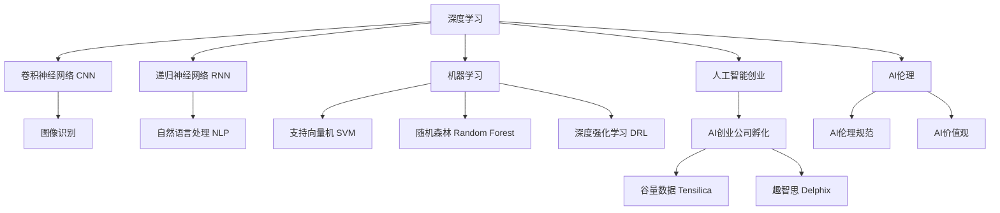

                 

# 李开复：AI创业者，最兴奋的是探索和创新

## 1. 背景介绍

在人工智能(AI)领域，李开复是一位极具影响力的思想家与实践者。作为一名AI创业者，他不仅在理论研究上取得了丰硕成果，而且在商业应用上也取得了显著成绩。从早期对模式识别和机器学习的贡献，到近年的深度学习和大规模数据分析，李开复始终站在技术前沿，探索AI的潜力与局限。

### 1.1 李开复的学术生涯

李开复在卡内基梅隆大学获得计算机科学博士学位，并师从人工智能先驱Tom Mitchell教授。他的博士论文主题是“Pattern Recognition and Machine Learning in Multilingual Spatial Text Images”，专注于图像模式识别和机器学习在多语言空间文本图像中的应用。这篇论文奠定了他在计算机视觉和模式识别领域的学术基础。

李开复博士毕业后，先后在苹果公司、微软亚洲研究院和谷歌担任关键技术职位，并在此期间推动了机器学习、计算机视觉和语音识别等技术的发展。在微软，他领导了MSR的语音识别、计算机视觉和交互式媒体部门，发表了大量影响深远的学术论文，推动了机器学习领域的发展。

2009年，李开复创立了创新工场（Innovation Works），专注于AI创业公司的孵化。此后，他带领团队在AI领域探索前沿技术，成功孵化出多个AI创业公司，包括人工智能技术提供商创新工场（Innovation Works）、人工智能咨询公司Plug and Play等。

### 1.2 李开复的商业探索

在商业领域，李开复同样展现了强大的洞察力和创新能力。他参与创办了多个成功的AI创业公司，包括谷量数据（Tensilica）、人工智能驱动的语音识别公司趣智思（Delphix）等。这些公司不仅推动了AI技术在商业中的应用，也为人工智能领域的创新提供了重要推动力。

李开复还在教育领域做出了重要贡献，他联合创办了人工智能教育平台DeepLearning.AI，通过线上课程和认证项目，推广人工智能知识，培养了大批AI人才。

## 2. 核心概念与联系

### 2.1 核心概念概述

李开复在AI领域的贡献主要集中在以下几个核心概念：

- **深度学习**：李开复在深度学习领域的贡献主要集中在卷积神经网络（CNN）和递归神经网络（RNN）的应用，推动了图像识别、语音识别和自然语言处理等领域的进步。
- **机器学习**：从早期的支持向量机（SVM）、随机森林（Random Forest）到深度强化学习（Deep Reinforcement Learning），李开复在机器学习领域进行了广泛研究。
- **人工智能创业**：李开复通过创办和孵化多个AI创业公司，推动了AI技术在实际应用中的落地和产业化。
- **AI伦理**：李开复在AI伦理和道德方面也有深入研究，强调AI应用中的人类价值观和伦理规范。

### 2.2 核心概念原理和架构的 Mermaid 流程图



这个流程图展示了李开复在AI领域的研究和工作覆盖范围，从深度学习和机器学习的基础技术，到AI创业和伦理规范的应用领域，涵盖了AI发展的多个维度。

## 3. 核心算法原理 & 具体操作步骤

### 3.1 算法原理概述

深度学习和机器学习是大规模数据分析和模式识别的基础，是李开复在学术研究中的核心工作。深度学习通过多层神经网络对数据进行自动特征提取和分类，实现了在图像、语音、自然语言处理等领域的高性能模型。机器学习则通过训练模型来预测新数据，广泛应用于各种场景，如推荐系统、金融风险评估、医疗诊断等。

### 3.2 算法步骤详解

深度学习的训练过程大致包括以下步骤：

1. **数据预处理**：将原始数据转换为模型可以处理的格式，如图像归一化、文本分词等。
2. **模型构建**：设计多层神经网络结构，包括卷积层、池化层、全连接层等。
3. **损失函数选择**：根据任务需求选择合适的损失函数，如交叉熵损失、均方误差损失等。
4. **反向传播训练**：使用反向传播算法计算梯度，更新模型参数，最小化损失函数。
5. **验证与优化**：在验证集上评估模型性能，调整模型参数，防止过拟合。

机器学习的训练过程包括：

1. **数据收集**：收集有标签的数据集。
2. **模型选择**：选择合适的机器学习模型，如SVM、决策树、神经网络等。
3. **特征工程**：提取和构建有效的特征。
4. **模型训练**：使用训练集数据训练模型。
5. **模型评估**：在测试集上评估模型性能。
6. **模型优化**：调整模型参数，提高模型精度和泛化能力。

### 3.3 算法优缺点

深度学习的主要优点包括：

- **自适应能力**：能够自动提取和利用数据中的复杂特征，适用于大规模数据集。
- **高精度**：在图像、语音等复杂任务上取得了卓越表现。
- **可扩展性**：模型可以通过增加层数和参数进行扩展，以适应更复杂的任务。

但深度学习也存在一些缺点：

- **计算资源需求高**：训练深度神经网络需要大量的计算资源，特别是GPU等高性能硬件。
- **训练时间长**：深度模型通常需要较长时间进行训练。
- **可解释性差**：深度模型的决策过程往往难以解释，增加了应用风险。

机器学习的优点包括：

- **解释性强**：决策过程透明，易于理解和调试。
- **可解释性强**：模型参数和决策路径清晰，易于解释和优化。
- **适用于小数据集**：能够在数据量有限的情况下进行有效训练。

机器学习的缺点包括：

- **特征工程复杂**：需要手工提取和选择特征，增加了工作量。
- **泛化能力有限**：模型可能会过拟合训练数据，泛化能力不足。
- **处理复杂度低**：难以处理复杂的非线性关系和数据特征。

### 3.4 算法应用领域

深度学习和机器学习在多个领域得到了广泛应用：

- **计算机视觉**：如人脸识别、图像分类、目标检测等。
- **自然语言处理**：如机器翻译、情感分析、文本生成等。
- **语音识别**：如语音转文本、语音合成等。
- **推荐系统**：如电商推荐、内容推荐等。
- **金融风控**：如信用评估、风险预测等。
- **医疗诊断**：如医学影像分析、疾病预测等。

## 4. 数学模型和公式 & 详细讲解 & 举例说明

### 4.1 数学模型构建

深度学习模型通常包括多个卷积层、池化层和全连接层。以卷积神经网络（CNN）为例，其基本结构包括卷积层、池化层和全连接层。

数学模型为：

$$
f(x)=\sum_{i=1}^n w_ix_i+b
$$

其中，$x$ 为输入，$w_i$ 为卷积核权重，$b$ 为偏置。

### 4.2 公式推导过程

卷积神经网络中，卷积层和池化层的推导过程如下：

卷积层的公式推导：

$$
f(x)=\sum_{i=1}^n w_ix_i+b
$$

池化层的公式推导：

$$
f(x)=\frac{1}{N}\sum_{i=1}^N x_i
$$

### 4.3 案例分析与讲解

以图像分类任务为例，使用卷积神经网络进行模型训练。

假设输入图像为 $x$，卷积层输出的特征图为 $f(x)$，池化层输出的特征图为 $g(x)$，全连接层输出的分类结果为 $h(x)$。

在训练过程中，使用反向传播算法计算梯度，更新卷积核权重 $w_i$ 和偏置 $b$。

## 5. 项目实践：代码实例和详细解释说明

### 5.1 开发环境搭建

在深度学习项目中，需要搭建GPU环境以支持深度模型的训练。以下是在Ubuntu系统上搭建GPU环境的步骤：

1. 安装CUDA和cuDNN：
   ```bash
   curl -s https://developer.download.nvidia.com/compute/cuda/repos/ubuntu1804/x86_64/cuda-repo-ubuntu1804_11.6.1.111-1_amd64.deb | sudo dpkg -i -
   ```
2. 安装CUDA工具包：
   ```bash
   sudo apt-get install cuda
   ```
3. 安装cuDNN库：
   ```bash
   wget https://developer.download.nvidia.com/compute/cudnn/8.9/cudnn-8.9-linux-x64-v8.9.tgz
   tar -xzvf cudnn-8.9-linux-x64-v8.9.tgz
   sudo cp -v /usr/local/cuda/include/cudnn.h /usr/include/x86_64-linux-gnu/
   sudo cp -v /usr/local/cuda/lib64/libcudnn* /usr/lib/x86_64-linux-gnu/
   ```

### 5.2 源代码详细实现

以下是使用PyTorch框架构建卷积神经网络（CNN）模型的代码：

```python
import torch
import torch.nn as nn
import torch.optim as optim

class CNN(nn.Module):
    def __init__(self):
        super(CNN, self).__init__()
        self.conv1 = nn.Conv2d(3, 6, 5)
        self.pool = nn.MaxPool2d(2, 2)
        self.conv2 = nn.Conv2d(6, 16, 5)
        self.fc1 = nn.Linear(16 * 5 * 5, 120)
        self.fc2 = nn.Linear(120, 84)
        self.fc3 = nn.Linear(84, 10)

    def forward(self, x):
        x = self.pool(F.relu(self.conv1(x)))
        x = self.pool(F.relu(self.conv2(x)))
        x = x.view(-1, 16 * 5 * 5)
        x = F.relu(self.fc1(x))
        x = F.relu(self.fc2(x))
        x = self.fc3(x)
        return x

model = CNN()
criterion = nn.CrossEntropyLoss()
optimizer = optim.SGD(model.parameters(), lr=0.001, momentum=0.9)
```

### 5.3 代码解读与分析

该代码实现了基本的卷积神经网络结构，包括两个卷积层、池化层和三个全连接层。其中：

- `nn.Conv2d`：定义卷积层。
- `nn.MaxPool2d`：定义池化层。
- `nn.Linear`：定义全连接层。
- `nn.ReLU`：定义激活函数。
- `nn.CrossEntropyLoss`：定义交叉熵损失函数。
- `optim.SGD`：定义随机梯度下降优化器。

## 6. 实际应用场景

### 6.1 自动驾驶

自动驾驶是深度学习和机器学习在实际应用中的典型案例。通过安装多个摄像头、雷达和激光雷达，收集车辆周围的环境数据，然后使用深度学习模型对数据进行处理和分析，实现车辆自主导航。

### 6.2 医疗影像诊断

在医疗领域，深度学习被广泛用于影像分析和疾病预测。通过训练深度神经网络，可以对CT、MRI等医学影像进行自动标注，提高诊断的准确性和效率。

### 6.3 智能推荐系统

推荐系统是电子商务和媒体行业的核心应用之一。通过深度学习模型对用户行为和历史数据进行分析，可以预测用户兴趣，推荐符合用户偏好的商品或内容。

### 6.4 金融风险管理

金融行业可以利用深度学习模型进行信用评估、风险预测和欺诈检测。通过分析历史交易数据和市场趋势，模型可以预测未来金融市场的变化，帮助金融机构做出更加明智的决策。

## 7. 工具和资源推荐

### 7.1 学习资源推荐

- 《深度学习》（Ian Goodfellow等著）：深度学习的经典教材，涵盖了深度学习的基本概念和算法。
- 《Python深度学习》（Francois Chollet著）：由深度学习框架Keras的创始人撰写，介绍了深度学习在实际应用中的使用方法。
- Coursera和Udacity：提供深度学习和机器学习相关的在线课程，包括Coursera的“Deep Learning Specialization”和Udacity的“Deep Learning Nanodegree”。

### 7.2 开发工具推荐

- TensorFlow和PyTorch：两个主要的深度学习框架，提供了丰富的工具和库，支持深度模型的构建和训练。
- Keras：一个简单易用的深度学习框架，适合初学者快速上手。
- Jupyter Notebook：一个交互式编程环境，方便进行深度学习实验和数据可视化。

### 7.3 相关论文推荐

- Yann LeCun的《Convolutional Networks for Images, Speech and Time Series》：介绍了卷积神经网络的基本结构和应用。
- Ian Goodfellow的《Generative Adversarial Nets》：提出了生成对抗网络（GAN）的概念，推动了深度生成模型的发展。
- Fei-Fei Li的《Understanding Deep Learning: From Representation to Generalization》：介绍了深度学习在计算机视觉和自然语言处理中的应用。

## 8. 总结：未来发展趋势与挑战

### 8.1 研究成果总结

李开复在AI领域的贡献涵盖了深度学习、机器学习和AI创业等多个方面。他的研究和实践不仅推动了技术的发展，也促进了AI技术的商业化和应用落地。

### 8.2 未来发展趋势

未来AI技术的发展趋势包括：

- **深度学习**：深度神经网络的性能将进一步提升，模型将变得更加复杂和强大。
- **可解释性**：随着AI在决策系统中的应用增加，对模型的可解释性和透明度的需求将日益增加。
- **跨领域融合**：AI将与其他技术如物联网、大数据、区块链等深度融合，推动更广泛的应用。
- **伦理规范**：随着AI技术的广泛应用，对其伦理规范和法律框架的需求将增加。

### 8.3 面临的挑战

AI技术的发展面临以下挑战：

- **计算资源**：大规模深度学习的训练需要大量计算资源，对硬件提出了高要求。
- **数据隐私**：AI应用涉及大量个人数据，隐私保护和数据安全问题需要解决。
- **算法公平性**：AI模型可能会反映数据中的偏见，需要确保算法的公平性和无偏性。
- **社会接受度**：AI技术的广泛应用可能引发公众的担忧和抵触，需要加强公众教育和技术透明。

### 8.4 研究展望

未来AI技术的研究方向包括：

- **可解释性AI**：研究如何增强AI模型的可解释性，提高其透明度和可信度。
- **公平和公正的AI**：开发公平和无偏的AI算法，确保算法的社会公正性。
- **跨学科融合**：将AI与其他学科如心理学、社会学、伦理学等融合，推动AI技术的发展。
- **多模态AI**：研究如何结合视觉、语音、文本等多种模态的数据，提高AI系统的全面性和适应性。

## 9. 附录：常见问题与解答

**Q1: 深度学习与机器学习有什么区别？**

A: 深度学习是机器学习的一个分支，主要用于处理复杂非线性关系和大量数据。深度学习通过多层神经网络自动提取特征，而机器学习则需要手动选择和提取特征。

**Q2: 如何训练一个深度神经网络？**

A: 深度神经网络的训练过程包括数据预处理、模型构建、损失函数选择、反向传播训练、验证与优化等步骤。

**Q3: 深度学习在医疗领域有哪些应用？**

A: 深度学习在医疗领域可以用于医学影像分析、疾病预测、药物发现等。通过训练深度神经网络，可以自动识别和标注影像中的病变区域，提高诊断的准确性和效率。

**Q4: 深度学习在自动驾驶中有哪些应用？**

A: 深度学习在自动驾驶中可以用于环境感知、路径规划、决策制定等。通过训练深度神经网络，可以实现对车辆周围环境的自动感知和分析，帮助车辆自主导航。

**Q5: 如何提高深度学习模型的泛化能力？**

A: 提高深度学习模型的泛化能力需要从数据、模型和算法等多个方面进行优化。包括使用更多样化的数据、正则化技术、更好的网络结构设计等。

---

作者：禅与计算机程序设计艺术 / Zen and the Art of Computer Programming

