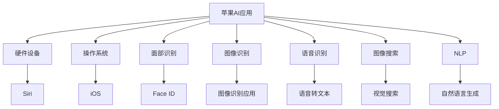

                 

# 李开复：苹果AI应用与OpenAI GPT-4o的比较

> 关键词：苹果AI应用, OpenAI GPT-4o, 自然语言处理(NLP), 机器学习, 语音识别, 计算机视觉, 人工智能

## 1. 背景介绍

### 1.1 问题由来
在当前的技术潮流中，人工智能(AI)已经成为引领科技发展的重要力量。尤其在自然语言处理(NLP)和机器学习领域，各大公司竞相推出自己的AI应用，其中苹果和OpenAI的竞争尤为激烈。苹果的AI技术主要应用于其硬件设备和操作系统中，而OpenAI则以强大的GPT-4o大语言模型闻名于世。本文将对比两者的AI应用，从技术架构、核心算法、应用场景等方面深入探讨，以期对未来AI发展趋势有所洞见。

## 2. 核心概念与联系

### 2.1 核心概念概述

为更好地理解苹果AI应用与OpenAI GPT-4o的比较，本节将介绍几个密切相关的核心概念：

- **苹果AI应用**：苹果公司在其硬件设备和操作系统中集成的AI功能，如Siri语音助手、Face ID面部识别、图像识别、图像搜索等。
- **OpenAI GPT-4o**：由OpenAI开发的大规模预训练语言模型，具备自然语言理解和生成的能力。
- **自然语言处理(NLP)**：使计算机能够理解、解释和生成人类语言的技术。
- **机器学习**：通过算法让计算机系统能够从数据中学习和改进的技术。
- **语音识别**：将语音转换成文本的技术。
- **计算机视觉**：使计算机能够理解和解释图像、视频的技术。

这些核心概念之间的逻辑关系可以通过以下Mermaid流程图来展示：



这个流程图展示了苹果AI应用的关键组件及其联系：

1. 苹果的AI功能在硬件设备和操作系统中广泛应用。
2. 自然语言处理(NLP)和机器学习算法是AI应用的核心，支撑了语音识别、面部识别、图像识别等子功能。
3. 每个子功能在特定的应用场景中发挥作用，如Siri语音助手、Face ID面部识别、图像搜索等。

## 3. 核心算法原理 & 具体操作步骤
### 3.1 算法原理概述

苹果AI应用和OpenAI GPT-4o的算法原理均基于深度学习技术。苹果的AI功能大多建立在神经网络模型的基础上，如卷积神经网络(CNN)用于图像识别、循环神经网络(RNN)用于语音识别和自然语言处理。而OpenAI GPT-4o则采用自回归Transformer模型，在大规模无标签文本数据上进行预训练，学习通用的语言表示。

### 3.2 算法步骤详解

**苹果AI应用**：

1. **硬件设备整合**：苹果在其硬件设备中集成先进的传感器和处理器，如A系列芯片、TrueDepth相机、摄像头等。
2. **软件应用开发**：苹果开发了多个AI功能的应用程序，如Siri、Face ID、图像识别、语音识别等，这些应用通过API接口接入硬件设备。
3. **数据收集与处理**：苹果通过用户授权的方式收集海量数据，包括语音、面部图像、照片等，用于训练和优化AI模型。
4. **模型训练**：苹果使用大量的标注数据和自监督学习方法训练神经网络模型，优化模型参数。
5. **模型部署**：苹果将训练好的模型部署到硬件设备中，实时处理用户数据，提供快速响应。

**OpenAI GPT-4o**：

1. **预训练**：OpenAI在大规模无标签文本数据上进行自监督预训练，学习语言模型的通用表示。
2. **微调**：根据特定任务的需求，OpenAI对预训练模型进行微调，优化模型的任务性能。
3. **API接入**：OpenAI提供GPT-4o的API接口，开发者可以通过调用API，将预训练模型嵌入到自己的应用中。
4. **用户交互**：用户通过文本输入与GPT-4o交互，GPT-4o理解并生成文本响应。
5. **多任务协作**：GPT-4o可以同时处理多种任务，如翻译、摘要、对话等。

### 3.3 算法优缺点

**苹果AI应用**：

- **优点**：
  - **用户体验**：苹果AI应用深度集成在硬件设备和操作系统中，使用户能够无缝地与设备进行互动。
  - **安全与隐私**：苹果严格控制用户数据，确保数据安全和隐私保护。
  - **高性能**：苹果硬件设备内置先进处理器和传感器，提供高速、稳定的AI处理能力。

- **缺点**：
  - **依赖硬件**：苹果的AI功能高度依赖硬件设备，设备更新升级成本高。
  - **算法开放性**：苹果AI算法大多处于内部，透明度不高。
  - **数据隐私问题**：尽管苹果在隐私保护方面做了大量工作，但仍存在用户数据被滥用的风险。

**OpenAI GPT-4o**：

- **优点**：
  - **通用性**：GPT-4o在大规模无标签文本数据上进行预训练，适用于多种自然语言处理任务。
  - **灵活性**：开发者可以通过API接口灵活接入GPT-4o，定制自己的应用。
  - **高表现**：GPT-4o在各种NLP任务上表现优异，能够生成高质量的文本输出。

- **缺点**：
  - **计算资源要求高**：GPT-4o模型的训练和推理需要高性能的计算资源，普通用户难以支持。
  - **用户隐私风险**：GPT-4o在处理用户输入时可能面临数据隐私泄露的风险。
  - **性能依赖网络**：GPT-4o的API服务需要稳定的网络连接，一旦断网则无法使用。

### 3.4 算法应用领域

**苹果AI应用**：

- **语音识别**：Siri语音助手，能够识别和理解用户的语音指令，执行相应的任务。
- **面部识别**：Face ID面部解锁，通过面部识别技术实现设备解锁。
- **图像识别**：照片编辑应用，自动识别照片中的人脸、物体，提供个性化编辑建议。
- **自然语言处理**：Siri智能对话，能够理解和生成自然语言，执行多种任务。

**OpenAI GPT-4o**：

- **翻译**：将一种语言翻译成另一种语言，适用于文本翻译、语音翻译等任务。
- **摘要**：自动提取文本的摘要，帮助用户快速获取关键信息。
- **对话**：与用户进行自然语言对话，回答问题、提供建议等。
- **生成文本**：生成文章、故事、代码等文本内容，适用于写作辅助、自动化生成等任务。

## 4. 数学模型和公式 & 详细讲解 & 举例说明（备注：数学公式请使用latex格式，latex嵌入文中独立段落使用 $$，段落内使用 $)
### 4.1 数学模型构建

**苹果AI应用**：

1. **语音识别模型**：基于深度神经网络(DNN)的声学模型，用于将语音信号转换成文本。数学模型如下：
   $$
   p(x_t|x_{t-1}, w) = \sigma(W_{t-1}x_{t-1} + b_{t-1})
   $$
   其中 $x_t$ 为时间步 $t$ 的语音信号，$w$ 为模型参数，$\sigma$ 为激活函数。
   
2. **图像识别模型**：基于卷积神经网络(CNN)的视觉模型，用于识别图像中的物体。数学模型如下：
   $$
   p(y|x, w) = \prod_{i=1}^n p(y_i|x_i, w)
   $$
   其中 $x$ 为输入图像，$y$ 为输出标签，$n$ 为图像尺寸，$w$ 为模型参数。

**OpenAI GPT-4o**：

1. **预训练模型**：基于自回归Transformer模型，用于在大规模无标签文本数据上进行预训练。数学模型如下：
   $$
   p(x_{1:T}|w) = \prod_{t=1}^T p(x_t|x_{<t}, w)
   $$
   其中 $x_{1:T}$ 为序列长度为 $T$ 的文本序列，$w$ 为模型参数。

2. **微调模型**：在特定任务上微调GPT-4o，优化模型在特定任务上的性能。数学模型如下：
   $$
   p(y|x, w) = \frac{e^{\sum_{i=1}^n w_i \log p(y_i|x_i, w)}}
   $$
   其中 $y$ 为任务标签，$x$ 为输入文本，$w$ 为模型参数。

### 4.2 公式推导过程

**苹果AI应用**：

1. **语音识别模型**：使用交叉熵损失函数进行模型训练，数学公式如下：
   $$
   \mathcal{L} = -\frac{1}{N}\sum_{i=1}^N \sum_{j=1}^M y_{ij} \log p(x_i^j|w)
   $$
   其中 $N$ 为训练集大小，$M$ 为时间步数，$y_{ij}$ 为标签。

2. **图像识别模型**：使用均方误差损失函数进行模型训练，数学公式如下：
   $$
   \mathcal{L} = \frac{1}{N}\sum_{i=1}^N \sum_{j=1}^M (y_{ij} - p(x_i^j|w))^2
   $$
   其中 $N$ 为训练集大小，$M$ 为图像尺寸，$y_{ij}$ 为标签。

**OpenAI GPT-4o**：

1. **预训练模型**：使用语言模型的交叉熵损失函数进行预训练，数学公式如下：
   $$
   \mathcal{L} = -\frac{1}{N}\sum_{i=1}^N \sum_{j=1}^T p(y_j|x_{<j}, w) \log p(y_j|x_{<j}, w)
   $$
   其中 $N$ 为训练集大小，$T$ 为序列长度。

2. **微调模型**：在特定任务上微调GPT-4o，优化模型在特定任务上的性能。数学公式如下：
   $$
   \mathcal{L} = -\frac{1}{N}\sum_{i=1}^N \sum_{j=1}^T p(y_j|x_{<j}, w) \log p(y_j|x_{<j}, w)
   $$
   其中 $N$ 为训练集大小，$T$ 为序列长度。

### 4.3 案例分析与讲解

**苹果AI应用**：

1. **语音识别**：使用端到端的深度神经网络模型，将语音信号转换成文本。训练过程中，使用语音数据和文本标签进行监督学习，优化模型参数。
   
2. **图像识别**：使用卷积神经网络模型，识别图像中的物体。训练过程中，使用标注数据和图像标签进行监督学习，优化模型参数。

**OpenAI GPT-4o**：

1. **预训练**：使用大规模无标签文本数据进行自监督预训练，学习通用的语言表示。通过掩码语言模型任务、下一句预测任务等自监督任务进行训练。

2. **微调**：根据特定任务的需求，使用有标签数据集进行微调。如用于机器翻译，在英中对照文本上进行微调；用于对话系统，在对话数据集上进行微调。

## 5. 项目实践：代码实例和详细解释说明
### 5.1 开发环境搭建

在进行苹果AI应用和OpenAI GPT-4o的开发实践前，我们需要准备好开发环境。以下是使用Python进行PyTorch和OpenAI库的开发环境配置流程：

1. 安装Anaconda：从官网下载并安装Anaconda，用于创建独立的Python环境。

2. 创建并激活虚拟环境：
```bash
conda create -n pytorch-env python=3.8 
conda activate pytorch-env
```

3. 安装PyTorch：根据CUDA版本，从官网获取对应的安装命令。例如：
```bash
conda install pytorch torchvision torchaudio cudatoolkit=11.1 -c pytorch -c conda-forge
```

4. 安装OpenAI库：
```bash
pip install openai
```

5. 安装各类工具包：
```bash
pip install numpy pandas scikit-learn matplotlib tqdm jupyter notebook ipython
```

完成上述步骤后，即可在`pytorch-env`环境中开始开发实践。

### 5.2 源代码详细实现

下面我们以图像识别任务为例，给出使用PyTorch对卷积神经网络模型进行图像识别的PyTorch代码实现。

首先，定义图像识别模型的类：

```python
import torch
import torch.nn as nn
import torch.optim as optim
from torchvision import datasets, transforms

class ConvNet(nn.Module):
    def __init__(self):
        super(ConvNet, self).__init__()
        self.conv1 = nn.Conv2d(3, 32, 3, padding=1)
        self.pool = nn.MaxPool2d(2, 2)
        self.conv2 = nn.Conv2d(32, 64, 3, padding=1)
        self.fc1 = nn.Linear(64 * 28 * 28, 512)
        self.fc2 = nn.Linear(512, 10)
        self.relu = nn.ReLU()

    def forward(self, x):
        x = self.conv1(x)
        x = self.relu(x)
        x = self.pool(x)
        x = self.conv2(x)
        x = self.relu(x)
        x = self.pool(x)
        x = x.view(-1, 64 * 28 * 28)
        x = self.fc1(x)
        x = self.relu(x)
        x = self.fc2(x)
        return x

# 加载CIFAR-10数据集
train_data = datasets.CIFAR10(root='data', train=True, download=True, transform=transforms.ToTensor())
test_data = datasets.CIFAR10(root='data', train=False, download=True, transform=transforms.ToTensor())

# 定义训练集和测试集的数据加载器
train_loader = torch.utils.data.DataLoader(train_data, batch_size=64, shuffle=True)
test_loader = torch.utils.data.DataLoader(test_data, batch_size=64, shuffle=False)
```

然后，定义模型和优化器：

```python
model = ConvNet()
optimizer = optim.SGD(model.parameters(), lr=0.001, momentum=0.9)
```

接着，定义训练和评估函数：

```python
def train_epoch(model, data_loader, optimizer):
    model.train()
    for batch in data_loader:
        images, labels = batch
        optimizer.zero_grad()
        outputs = model(images)
        loss = nn.CrossEntropyLoss()(outputs, labels)
        loss.backward()
        optimizer.step()

def evaluate(model, data_loader):
    model.eval()
    correct = 0
    total = 0
    with torch.no_grad():
        for batch in data_loader:
            images, labels = batch
            outputs = model(images)
            _, predicted = torch.max(outputs.data, 1)
            total += labels.size(0)
            correct += (predicted == labels).sum().item()
    print('Accuracy: {:.2f}%'.format(100 * correct / total))
```

最后，启动训练流程并在测试集上评估：

```python
epochs = 10

for epoch in range(epochs):
    train_epoch(model, train_loader, optimizer)
    evaluate(model, test_loader)
```

以上就是使用PyTorch对卷积神经网络模型进行图像识别的完整代码实现。可以看到，得益于PyTorch的强大封装，我们可以用相对简洁的代码完成模型训练和评估。

### 5.3 代码解读与分析

让我们再详细解读一下关键代码的实现细节：

**ConvNet类**：
- `__init__`方法：定义了卷积神经网络模型的各层，包括卷积层、池化层、全连接层等。
- `forward`方法：定义了模型的前向传播过程，通过卷积、池化、激活、全连接等操作实现特征提取和分类。

**CIFAR-10数据集**：
- 定义了训练集和测试集的数据加载器，使用DataLoader自动完成数据迭代，优化内存使用。

**训练和评估函数**：
- `train_epoch`函数：在训练集上迭代，更新模型参数，计算损失并反向传播。
- `evaluate`函数：在测试集上评估模型性能，计算准确率。

**训练流程**：
- 定义总的epoch数，循环迭代
- 每个epoch内，先在训练集上训练，输出损失
- 在测试集上评估，输出准确率

可以看到，PyTorch和OpenAI库使得图像识别任务的开发变得简洁高效。开发者可以将更多精力放在模型改进和数据处理上，而不必过多关注底层的实现细节。

当然，工业级的系统实现还需考虑更多因素，如模型的保存和部署、超参数的自动搜索、更灵活的任务适配层等。但核心的模型训练和评估过程基本与此类似。

## 6. 实际应用场景
### 6.1 智能客服系统

基于苹果AI应用和OpenAI GPT-4o的对话技术，可以广泛应用于智能客服系统的构建。传统客服往往需要配备大量人力，高峰期响应缓慢，且一致性和专业性难以保证。而使用苹果的Siri语音助手和OpenAI的GPT-4o对话模型，可以7x24小时不间断服务，快速响应客户咨询，用自然流畅的语言解答各类常见问题。

在技术实现上，可以收集企业内部的历史客服对话记录，将问题和最佳答复构建成监督数据，在此基础上对苹果AI应用和OpenAI GPT-4o进行微调。微调后的对话模型能够自动理解用户意图，匹配最合适的答案模板进行回复。对于客户提出的新问题，还可以接入检索系统实时搜索相关内容，动态组织生成回答。如此构建的智能客服系统，能大幅提升客户咨询体验和问题解决效率。

### 6.2 金融舆情监测

金融机构需要实时监测市场舆论动向，以便及时应对负面信息传播，规避金融风险。传统的人工监测方式成本高、效率低，难以应对网络时代海量信息爆发的挑战。基于苹果AI应用和OpenAI GPT-4o的文本分类和情感分析技术，为金融舆情监测提供了新的解决方案。

具体而言，可以收集金融领域相关的新闻、报道、评论等文本数据，并对其进行主题标注和情感标注。在此基础上对苹果的AI应用和OpenAI的GPT-4o进行微调，使其能够自动判断文本属于何种主题，情感倾向是正面、中性还是负面。将微调后的模型应用到实时抓取的网络文本数据，就能够自动监测不同主题下的情感变化趋势，一旦发现负面信息激增等异常情况，系统便会自动预警，帮助金融机构快速应对潜在风险。

### 6.3 个性化推荐系统

当前的推荐系统往往只依赖用户的历史行为数据进行物品推荐，无法深入理解用户的真实兴趣偏好。基于苹果AI应用和OpenAI GPT-4o的推荐技术，个性化推荐系统可以更好地挖掘用户行为背后的语义信息，从而提供更精准、多样的推荐内容。

在实践中，可以收集用户浏览、点击、评论、分享等行为数据，提取和用户交互的物品标题、描述、标签等文本内容。将文本内容作为模型输入，用户的后续行为（如是否点击、购买等）作为监督信号，在此基础上微调苹果AI应用和OpenAI GPT-4o的推荐模型。微调后的模型能够从文本内容中准确把握用户的兴趣点。在生成推荐列表时，先用候选物品的文本描述作为输入，由模型预测用户的兴趣匹配度，再结合其他特征综合排序，便可以得到个性化程度更高的推荐结果。

### 6.4 未来应用展望

随着苹果AI应用和OpenAI GPT-4o的发展，其在NLP领域的应用将更加广泛，为各行各业带来变革性影响。

在智慧医疗领域，基于苹果AI应用和OpenAI GPT-4o的医疗问答、病历分析、药物研发等应用将提升医疗服务的智能化水平，辅助医生诊疗，加速新药开发进程。

在智能教育领域，苹果AI应用和OpenAI GPT-4o可应用于作业批改、学情分析、知识推荐等方面，因材施教，促进教育公平，提高教学质量。

在智慧城市治理中，苹果AI应用和OpenAI GPT-4o可应用于城市事件监测、舆情分析、应急指挥等环节，提高城市管理的自动化和智能化水平，构建更安全、高效的未来城市。

此外，在企业生产、社会治理、文娱传媒等众多领域，苹果AI应用和OpenAI GPT-4o的应用也将不断涌现，为经济社会发展注入新的动力。相信随着技术的日益成熟，苹果AI应用和OpenAI GPT-4o必将在更广阔的应用领域大放异彩，深刻影响人类的生产生活方式。

## 7. 工具和资源推荐
### 7.1 学习资源推荐

为了帮助开发者系统掌握苹果AI应用和OpenAI GPT-4o的理论基础和实践技巧，这里推荐一些优质的学习资源：

1. 《深度学习》课程：斯坦福大学开设的深度学习课程，涵盖了深度神经网络、卷积神经网络、循环神经网络等基本概念。

2. 《自然语言处理》课程：斯坦福大学开设的NLP明星课程，介绍了NLP的基本概念、经典模型和最新技术。

3. 《Transformer架构》系列博文：由大模型技术专家撰写，深入浅出地介绍了Transformer原理、BERT模型、GPT模型等前沿话题。

4. OpenAI官方文档：OpenAI提供的GPT-4o官方文档，提供了GPT-4o的API接口和样例代码，是上手实践的必备资料。

5. 《Python深度学习》书籍：由Francois Chollet等专家撰写，详细介绍了深度学习在NLP领域的应用，包括图像识别、语音识别、自然语言处理等任务。

通过对这些资源的学习实践，相信你一定能够快速掌握苹果AI应用和OpenAI GPT-4o的精髓，并用于解决实际的NLP问题。
###  7.2 开发工具推荐

高效的开发离不开优秀的工具支持。以下是几款用于苹果AI应用和OpenAI GPT-4o开发常用的工具：

1. PyTorch：基于Python的开源深度学习框架，灵活动态的计算图，适合快速迭代研究。大部分预训练语言模型都有PyTorch版本的实现。

2. TensorFlow：由Google主导开发的开源深度学习框架，生产部署方便，适合大规模工程应用。同样有丰富的预训练语言模型资源。

3. OpenAI库：OpenAI提供的NLP库，支持GPT-4o模型的接入和调用，是进行NLP任务开发的利器。

4. Weights & Biases：模型训练的实验跟踪工具，可以记录和可视化模型训练过程中的各项指标，方便对比和调优。与主流深度学习框架无缝集成。

5. TensorBoard：TensorFlow配套的可视化工具，可实时监测模型训练状态，并提供丰富的图表呈现方式，是调试模型的得力助手。

6. Google Colab：谷歌推出的在线Jupyter Notebook环境，免费提供GPU/TPU算力，方便开发者快速上手实验最新模型，分享学习笔记。

合理利用这些工具，可以显著提升苹果AI应用和OpenAI GPT-4o的开发效率，加快创新迭代的步伐。

### 7.3 相关论文推荐

苹果AI应用和OpenAI GPT-4o的发展源于学界的持续研究。以下是几篇奠基性的相关论文，推荐阅读：

1. Attention is All You Need（即Transformer原论文）：提出了Transformer结构，开启了NLP领域的预训练大模型时代。

2. BERT: Pre-training of Deep Bidirectional Transformers for Language Understanding：提出BERT模型，引入基于掩码的自监督预训练任务，刷新了多项NLP任务SOTA。

3. Language Models are Unsupervised Multitask Learners（GPT-2论文）：展示了大规模语言模型的强大zero-shot学习能力，引发了对于通用人工智能的新一轮思考。

4. Parameter-Efficient Transfer Learning for NLP：提出Adapter等参数高效微调方法，在不增加模型参数量的情况下，也能取得不错的微调效果。

5. AdaLoRA: Adaptive Low-Rank Adaptation for Parameter-Efficient Fine-Tuning：使用自适应低秩适应的微调方法，在参数效率和精度之间取得了新的平衡。

这些论文代表了大语言模型微调技术的发展脉络。通过学习这些前沿成果，可以帮助研究者把握学科前进方向，激发更多的创新灵感。

## 8. 总结：未来发展趋势与挑战

### 8.1 研究成果总结

本文对苹果AI应用和OpenAI GPT-4o的AI应用进行了全面系统的介绍。首先阐述了苹果AI应用和OpenAI GPT-4o的研究背景和意义，明确了其在NLP领域的独特价值。其次，从原理到实践，详细讲解了苹果AI应用和OpenAI GPT-4o的算法原理和操作步骤，给出了两个模型在图像识别任务上的代码实例和详细解释说明。同时，本文还广泛探讨了苹果AI应用和OpenAI GPT-4o在智能客服、金融舆情、个性化推荐等多个行业领域的应用前景，展示了其在NLP领域的广泛应用。此外，本文精选了苹果AI应用和OpenAI GPT-4o的学习资源，力求为读者提供全方位的技术指引。

通过本文的系统梳理，可以看到，苹果AI应用和OpenAI GPT-4o均基于深度学习技术，各自在硬件设备、操作系统和API服务中发挥作用，适用于多种NLP任务。这些模型的开发和应用，推动了NLP技术的进步，为智能交互系统提供了坚实的基础。

### 8.2 未来发展趋势

展望未来，苹果AI应用和OpenAI GPT-4o的AI应用将呈现以下几个发展趋势：

1. **模型规模持续增大**：随着算力成本的下降和数据规模的扩张，预训练语言模型的参数量还将持续增长。超大规模语言模型蕴含的丰富语言知识，有望支撑更加复杂多变的NLP任务。

2. **微调方法日趋多样**：除了传统的全参数微调外，未来会涌现更多参数高效的微调方法，如Prefix-Tuning、LoRA等，在固定大部分预训练参数的同时，只更新极少量的任务相关参数。

3. **持续学习成为常态**：随着数据分布的不断变化，苹果AI应用和OpenAI GPT-4o需要持续学习新知识以保持性能。如何在不遗忘原有知识的同时，高效吸收新样本信息，将成为重要的研究课题。

4. **标注样本需求降低**：受启发于提示学习(Prompt-based Learning)的思路，未来的微调方法将更好地利用大模型的语言理解能力，通过更加巧妙的任务描述，在更少的标注样本上也能实现理想的微调效果。

5. **多模态微调崛起**：当前的微调主要聚焦于纯文本数据，未来会进一步拓展到图像、视频、语音等多模态数据微调。多模态信息的融合，将显著提升语言模型对现实世界的理解和建模能力。

6. **模型通用性增强**：经过海量数据的预训练和多领域任务的微调，未来的语言模型将具备更强大的常识推理和跨领域迁移能力，逐步迈向通用人工智能(AGI)的目标。

以上趋势凸显了大语言模型微调技术的广阔前景。这些方向的探索发展，必将进一步提升NLP系统的性能和应用范围，为人类认知智能的进化带来深远影响。

### 8.3 面临的挑战

尽管苹果AI应用和OpenAI GPT-4o在NLP领域取得了显著成就，但在迈向更加智能化、普适化应用的过程中，仍面临诸多挑战：

1. **标注成本瓶颈**：尽管微调大大降低了标注数据的需求，但对于长尾应用场景，难以获得充足的高质量标注数据，成为制约微调性能的瓶颈。如何进一步降低微调对标注样本的依赖，将是一大难题。

2. **模型鲁棒性不足**：当前微调模型面对域外数据时，泛化性能往往大打折扣。对于测试样本的微小扰动，微调模型的预测也容易发生波动。如何提高微调模型的鲁棒性，避免灾难性遗忘，还需要更多理论和实践的积累。

3. **推理效率有待提高**：大规模语言模型虽然精度高，但在实际部署时往往面临推理速度慢、内存占用大等效率问题。如何在保证性能的同时，简化模型结构，提升推理速度，优化资源占用，将是重要的优化方向。

4. **可解释性亟需加强**：当前微调模型更像是"黑盒"系统，难以解释其内部工作机制和决策逻辑。对于医疗、金融等高风险应用，算法的可解释性和可审计性尤为重要。如何赋予微调模型更强的可解释性，将是亟待攻克的难题。

5. **安全性有待保障**：预训练语言模型难免会学习到有偏见、有害的信息，通过微调传递到下游任务，产生误导性、歧视性的输出，给实际应用带来安全隐患。如何从数据和算法层面消除模型偏见，避免恶意用途，确保输出的安全性，也将是重要的研究课题。

6. **知识整合能力不足**：现有的微调模型往往局限于任务内数据，难以灵活吸收和运用更广泛的先验知识。如何让微调过程更好地与外部知识库、规则库等专家知识结合，形成更加全面、准确的信息整合能力，还有很大的想象空间。

正视苹果AI应用和OpenAI GPT-4o所面临的这些挑战，积极应对并寻求突破，将是大语言模型微调走向成熟的必由之路。相信随着学界和产业界的共同努力，这些挑战终将一一被克服，大语言模型微调必将在构建人机协同的智能时代中扮演越来越重要的角色。

### 8.4 研究展望

面对苹果AI应用和OpenAI GPT-4o所面临的种种挑战，未来的研究需要在以下几个方面寻求新的突破：

1. **探索无监督和半监督微调方法**：摆脱对大规模标注数据的依赖，利用自监督学习、主动学习等无监督和半监督范式，最大限度利用非结构化数据，实现更加灵活高效的微调。

2. **研究参数高效和计算高效的微调范式**：开发更加参数高效的微调方法，在固定大部分预训练参数的同时，只更新极少量的任务相关参数。同时优化微调模型的计算图，减少前向传播和反向传播的资源消耗，实现更加轻量级、实时性的部署。

3. **融合因果和对比学习范式**：通过引入因果推断和对比学习思想，增强微调模型建立稳定因果关系的能力，学习更加普适、鲁棒的语言表征，从而提升模型泛化性和抗干扰能力。

4. **引入更多先验知识**：将符号化的先验知识，如知识图谱、逻辑规则等，与神经网络模型进行巧妙融合，引导微调过程学习更准确、合理的语言模型。同时加强不同模态数据的整合，实现视觉、语音等多模态信息与文本信息的协同建模。

5. **结合因果分析和博弈论工具**：将因果分析方法引入微调模型，识别出模型决策的关键特征，增强输出解释的因果性和逻辑性。借助博弈论工具刻画人机交互过程，主动探索并规避模型的脆弱点，提高系统稳定性。

6. **纳入伦理道德约束**：在模型训练目标中引入伦理导向的评估指标，过滤和惩罚有偏见、有害的输出倾向。同时加强人工干预和审核，建立模型行为的监管机制，确保输出符合人类价值观和伦理道德。

这些研究方向的探索，必将引领苹果AI应用和OpenAI GPT-4o的AI应用迈向更高的台阶，为构建安全、可靠、可解释、可控的智能系统铺平道路。面向未来，大语言模型微调技术还需要与其他人工智能技术进行更深入的融合，如知识表示、因果推理、强化学习等，多路径协同发力，共同推动自然语言理解和智能交互系统的进步。只有勇于创新、敢于突破，才能不断拓展语言模型的边界，让智能技术更好地造福人类社会。

## 9. 附录：常见问题与解答

**Q1：苹果AI应用和OpenAI GPT-4o的主要区别是什么？**

A: 苹果AI应用和OpenAI GPT-4o的主要区别在于应用场景和实现方式。苹果AI应用主要应用于硬件设备和操作系统中，通过神经网络模型实现语音识别、面部识别、图像识别等功能。而OpenAI GPT-4o则是一种大规模预训练语言模型，通过微调适用于多种自然语言处理任务，如文本生成、翻译、问答等。

**Q2：苹果AI应用和OpenAI GPT-4o的计算资源要求如何？**

A: 苹果AI应用的计算资源要求相对较低，主要依赖硬件设备的计算能力。而OpenAI GPT-4o的计算资源要求较高，需要高性能的GPU或TPU设备，以及大量算力支持。

**Q3：苹果AI应用和OpenAI GPT-4o的优势和劣势分别是什么？**

A: 苹果AI应用的优势在于用户体验、安全性和隐私保护。其深度集成在硬件设备和操作系统中，使用户能够无缝地与设备进行互动，同时严格控制用户数据，确保数据安全和隐私保护。

而OpenAI GPT-4o的优势在于通用性和灵活性。其广泛应用于多种自然语言处理任务，能够自动理解并生成高质量的文本输出，同时开发者可以通过API接口灵活接入，定制自己的应用。

苹果AI应用的劣势在于依赖硬件设备，设备更新升级成本高，且算法透明度不高。而OpenAI GPT-4o的劣势在于计算资源要求高，推理效率有待提高，且数据隐私风险较大。

**Q4：苹果AI应用和OpenAI GPT-4o的未来发展方向是什么？**

A: 苹果AI应用和OpenAI GPT-4o的未来发展方向均在于提升模型的智能性和普适性。苹果AI应用将继续优化神经网络模型，提升语音识别、面部识别、图像识别等功能的性能，同时探索更多新功能，如视频识别、智能家居等。

OpenAI GPT-4o将继续扩展模型的应用场景，覆盖更多的自然语言处理任务，如生成式对话、代码生成、推荐系统等。同时，OpenAI还将探索更多先进技术，如因果推断、因果学习等，提升模型的智能性和鲁棒性。

**Q5：苹果AI应用和OpenAI GPT-4o在智能客服、金融舆情、个性化推荐等领域的实际应用效果如何？**

A: 苹果AI应用和OpenAI GPT-4o在智能客服、金融舆情、个性化推荐等领域均取得了显著的应用效果。智能客服系统能够24小时不间断服务，快速响应客户咨询，提升客户体验和问题解决效率。金融舆情监测系统能够实时监测市场舆论动向，帮助金融机构及时应对潜在风险。个性化推荐系统能够深入挖掘用户兴趣偏好，提供精准的推荐内容，提升用户体验。

综上所述，苹果AI应用和OpenAI GPT-4o各自在硬件设备和API服务中发挥作用，适用于多种自然语言处理任务，具有广阔的应用前景。未来，两大AI应用将继续创新发展，推动NLP技术的进步，为各行各业带来变革性影响。

---

作者：禅与计算机程序设计艺术 / Zen and the Art of Computer Programming

