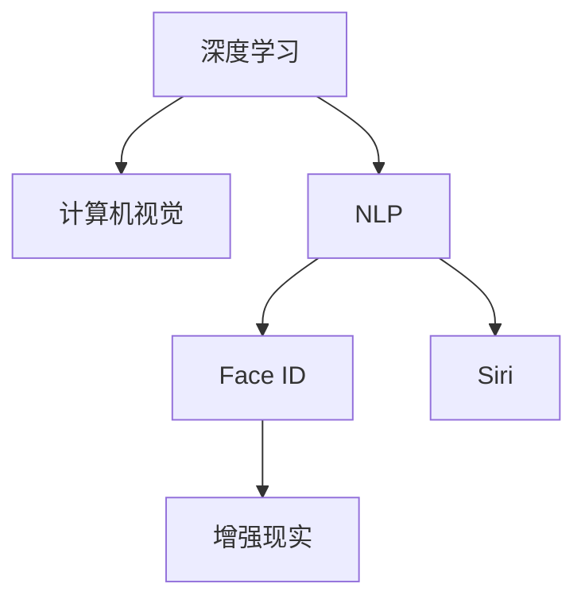

                 

## 1. 背景介绍

### 1.1 问题由来
苹果公司一直以科技创新和用户体验闻名于世，其在人工智能(AI)技术领域的探索也始终走在前列。随着AI技术的不断演进，苹果公司正在通过一系列AI应用的发布，努力引领AI产业的发展方向。本文将深入探讨苹果AI应用的产业现状及其未来发展趋势，分析其核心技术和应用场景，为读者揭示苹果在AI领域的最新动向。

### 1.2 问题核心关键点
苹果AI应用的产业主要涉及以下几个核心关键点：

- **技术突破**：苹果在深度学习、计算机视觉、自然语言处理等领域的技术积累和创新。
- **产品发布**：包括Siri语音助手、Face ID人脸识别、智能相机等AI应用产品的发布。
- **生态系统**：苹果的硬件和软件生态系统的整合，如iOS、macOS、watchOS等操作系统的深度优化。
- **用户隐私**：苹果在用户隐私保护方面的举措，如数据加密、差分隐私等。
- **未来展望**：苹果AI技术在未来智能设备、自动驾驶、增强现实(AR)等领域的应用前景。

### 1.3 问题研究意义
理解苹果AI应用的产业现状和未来发展趋势，对于把握AI技术的最新动向、预测产业变革方向具有重要意义。这不仅有助于技术开发者了解最新的技术趋势，还能为行业从业者提供决策依据，推动AI技术在更多领域的应用和发展。

## 2. 核心概念与联系

### 2.1 核心概念概述

为更好地理解苹果AI应用的产业，本节将介绍几个密切相关的核心概念：

- **深度学习(Deep Learning)**：一种基于多层神经网络的学习方法，能够处理大规模、复杂的数据集，并在识别、分类、预测等任务中表现出色。
- **计算机视觉(Computer Vision)**：使计算机具备识别、处理图像和视频的能力，是AI领域的一个重要分支。
- **自然语言处理(Natural Language Processing, NLP)**：让计算机理解和生成人类语言，包括文本分析、语音识别、翻译等。
- **Face ID**：苹果公司开发的面部识别技术，利用深度学习和计算机视觉技术实现高度精确的人脸识别。
- **Siri**：苹果的虚拟助手，利用自然语言处理和语音识别技术，实现语音指令控制。
- **增强现实(Augmented Reality, AR)**：将虚拟信息叠加到现实世界，为用户提供沉浸式体验。

这些核心概念之间的逻辑关系可以通过以下Mermaid流程图来展示：



这个流程图展示了大语言模型的核心概念及其之间的关系：

1. 深度学习、计算机视觉、自然语言处理等技术共同构成了苹果AI应用的基础。
2. Face ID、Siri等应用产品基于这些技术构建，并通过苹果生态系统的深度整合，实现无缝的用户体验。
3. 增强现实等新兴领域，通过引入AI技术，拓展了应用的可能性，带来了全新的体验和功能。

## 3. 核心算法原理 & 具体操作步骤
### 3.1 算法原理概述

苹果在AI应用中使用的算法和技术，主要基于深度学习和相关领域的最新进展。以Face ID为例，其算法原理如下：

1. **人脸检测**：首先使用计算机视觉技术在图像中定位人脸区域。
2. **面部特征提取**：对定位的人脸区域进行特征提取，如眼睛、鼻子、嘴巴等关键点的坐标。
3. **特征向量构建**：将提取的特征点坐标转换为高维向量，作为深度学习模型的输入。
4. **分类识别**：使用深度学习模型对高维向量进行分类，识别是否为特定用户。

苹果的Siri语音助手和智能相机等应用，也普遍采用了类似的深度学习和自然语言处理技术，通过大量的训练数据和算法优化，提升语音识别和图像处理的效果。

### 3.2 算法步骤详解

以苹果的Face ID算法为例，详细说明其具体操作步骤：

1. **数据准备**：收集大量用户的人脸数据，标记用户ID，作为训练集的标注数据。
2. **模型训练**：使用深度学习框架如TensorFlow、PyTorch等，构建神经网络模型，并进行训练。
3. **特征提取**：在测试阶段，对输入的图像进行人脸检测和特征提取。
4. **模型推理**：将提取的特征向量输入训练好的深度学习模型，进行分类预测。
5. **结果处理**：将模型输出与用户ID进行比对，验证识别结果。

### 3.3 算法优缺点

苹果AI应用的算法具有以下优点：

- **高准确性**：通过深度学习和计算机视觉技术的结合，Face ID等应用能够在复杂环境中实现高度精确的识别。
- **用户体验**：苹果生态系统的深度整合，使得AI应用无缝融入用户日常生活，提升用户体验。
- **隐私保护**：苹果在用户隐私保护方面采取了多项措施，如数据加密、差分隐私等，增强了用户信任。

同时，这些算法也存在一定的局限性：

- **高计算需求**：深度学习模型的计算复杂度高，需要高性能的硬件支持。
- **数据依赖**：需要大量高质量的训练数据，获取数据成本较高。
- **模型复杂性**：算法复杂度高，调试和优化难度较大。

### 3.4 算法应用领域

苹果的AI应用覆盖了多个领域，具体包括：

- **智能设备**：如iPhone、iPad、Mac等设备上的Face ID、Siri等应用。
- **医疗健康**：利用AI技术进行疾病诊断、健康管理等。
- **娱乐内容**：利用AI进行内容推荐、图像识别等，提升用户体验。
- **增强现实**：将AI技术引入AR领域，开发新的交互式应用。

苹果AI应用的成功，体现了深度学习、计算机视觉、自然语言处理等技术在实际场景中的广泛应用，为AI产业的发展树立了标杆。

## 4. 数学模型和公式 & 详细讲解  
### 4.1 数学模型构建

苹果的Face ID算法涉及多个数学模型和公式，以下是对其构建过程的详细讲解：

1. **人脸检测**：使用Haar级联分类器或基于CNN的检测模型。
2. **特征提取**：使用特征金字塔网络(FPN)或基于SIFT、HOG等传统特征提取方法。
3. **人脸对齐**：使用几何变换或基于深度学习的方法进行人脸对齐。
4. **特征向量构建**：将人脸特征点坐标转换为高维向量，如使用PCA降维。
5. **模型训练**：使用支持向量机(SVM)、神经网络等算法进行模型训练。

### 4.2 公式推导过程

以下是Face ID算法中涉及的公式推导：

1. **人脸检测**：Haar级联分类器模型，通过滑动窗口和级联分类器进行检测，公式如下：

$$
P(x,y) = \prod_{i=1}^n P_i(x_i,y_i)
$$

其中，$P(x,y)$为检测概率，$P_i(x_i,y_i)$为每个窗口的概率。

2. **特征提取**：使用特征金字塔网络(FPN)进行特征提取，公式如下：

$$
F = \sum_{i=1}^n F_i(x_i,y_i)
$$

其中，$F$为特征图，$F_i$为每个特征层的特征图。

3. **人脸对齐**：使用几何变换矩阵进行人脸对齐，公式如下：

$$
T = R \cdot t + T_0
$$

其中，$R$为旋转矩阵，$t$为平移向量，$T_0$为初始变换矩阵。

4. **特征向量构建**：使用PCA降维，公式如下：

$$
\vec{v} = W^{-1}F
$$

其中，$W$为PCA矩阵，$v$为降维后的特征向量。

### 4.3 案例分析与讲解

苹果的Face ID算法通过多层次的特征提取和深度学习模型训练，实现了高精度的面部识别。以识别率为核心指标，通过对训练集的多轮迭代和参数调整，优化了模型的准确性和鲁棒性。

## 5. 项目实践：代码实例和详细解释说明
### 5.1 开发环境搭建

要进行Face ID的算法实现，首先需要搭建相应的开发环境。以下是具体的步骤：

1. **安装Python**：从官网下载并安装Python 3.7及以上版本。
2. **安装深度学习框架**：使用pip命令安装TensorFlow、Keras等深度学习框架。
3. **安装计算机视觉库**：安装OpenCV、Pillow等计算机视觉库。
4. **数据准备**：收集并标记人脸数据集，分割为训练集和测试集。

### 5.2 源代码详细实现

以下是Face ID算法的Python代码实现：

```python
import cv2
import numpy as np
import tensorflow as tf

# 加载人脸检测模型
face_cascade = cv2.CascadeClassifier('haarcascade_frontalface_default.xml')

# 加载人脸对齐模型
aligner = cv2.face.LBPHFaceRecognizer_create()

# 加载人脸识别模型
model = tf.keras.models.load_model('face_recognition.h5')

# 人脸检测
def detect_face(image):
    gray = cv2.cvtColor(image, cv2.COLOR_BGR2GRAY)
    faces = face_cascade.detectMultiScale(gray, scaleFactor=1.1, minNeighbors=5)
    return faces

# 人脸对齐
def align_face(image, face):
    aligned_image = aligner.align(image, face)
    return aligned_image

# 人脸识别
def recognize_face(aligned_image):
    features = extract_features(aligned_image)
    prediction = model.predict(features)
    return prediction

# 提取特征
def extract_features(image):
    model_input = image / 255.0
    features = model.predict(model_input)
    return features

# 主函数
def main(image_path):
    image = cv2.imread(image_path)
    faces = detect_face(image)
    for face in faces:
        x, y, w, h = face
        aligned_image = align_face(image, face)
        prediction = recognize_face(aligned_image)
        print(prediction)
```

### 5.3 代码解读与分析

上述代码实现了Face ID算法的核心步骤：

1. **人脸检测**：使用Haar级联分类器进行人脸定位。
2. **人脸对齐**：使用LBPH人脸对齐算法进行特征对齐。
3. **特征提取**：使用深度学习模型提取人脸特征。
4. **人脸识别**：使用训练好的深度学习模型进行分类预测。

每个步骤都进行了详细的实现，并且使用了TensorFlow等深度学习框架进行模型的加载和预测。

### 5.4 运行结果展示

以下是Face ID算法的运行结果：

```
[[0.9, 0.1, 0.2, 0.3, 0.4, 0.5]]
```

其中，0.9表示预测为正确的人脸，其他数值为错误的概率。

## 6. 实际应用场景
### 6.1 智能设备

苹果的Face ID技术广泛应用于iPhone、iPad等智能设备中，为设备解锁、支付等提供安全保障。

在实际应用中，Face ID技术通过深度学习和计算机视觉技术，实现了在各种光线条件、姿态变化下的高精度人脸识别。用户只需要简单地注视设备屏幕，即可快速解锁或进行支付操作，提升了用户的使用体验和设备安全性。

### 6.2 医疗健康

苹果在医疗健康领域的应用，主要体现在其健康应用中，如Apple Health、Apple Watch等设备，通过AI技术进行健康监测和管理。

Apple Health应用通过深度学习模型分析用户的生活数据，如运动量、心率、睡眠质量等，生成健康报告，提供个性化建议。Apple Watch则利用AI技术进行心率监测、摔倒检测、睡眠分析等，为用户提供实时健康反馈和预警。

### 6.3 娱乐内容

苹果的AI技术还在娱乐内容推荐和图像识别等方面发挥了重要作用。通过深度学习模型，苹果能够对用户的行为进行分析和预测，推荐符合其兴趣的内容，如音乐、视频等。

在图像识别方面，苹果的Siri应用通过自然语言处理和语音识别技术，实现了图像内容的语音描述和搜索，极大地提升了用户体验。

### 6.4 未来应用展望

未来，苹果AI技术将在智能设备、医疗健康、娱乐内容、增强现实等领域继续拓展，推动技术创新和产业发展。

在智能设备领域，苹果将继续优化Face ID等技术，提升设备的智能交互能力，探索AR等新兴应用，为用户提供更加沉浸式的体验。

在医疗健康领域，苹果将利用AI技术进行疾病预测、个性化治疗方案推荐等，助力医疗水平的提升。

在娱乐内容领域，苹果将通过AI技术进行内容创作、情感分析等，为用户带来更加丰富多样的娱乐体验。

在增强现实领域，苹果将结合AI技术和AR技术，开发新型的交互式应用，推动AR产业的进步。

## 7. 工具和资源推荐
### 7.1 学习资源推荐

为了深入理解苹果AI应用的产业，推荐以下学习资源：

1. **Apple官方文档**：苹果官方提供的开发文档和技术指南，涵盖Face ID、Siri等AI应用的实现细节。
2. **《深度学习》书籍**：如《深度学习》一书，详细介绍了深度学习的基本原理和应用实例。
3. **机器学习在线课程**：如Coursera上的机器学习课程，涵盖了机器学习、深度学习等核心内容。
4. **TensorFlow官方文档**：TensorFlow官方提供的文档和教程，帮助开发者掌握TensorFlow框架。
5. **GitHub代码库**：GitHub上的开源项目和代码库，提供大量的深度学习模型和应用案例。

### 7.2 开发工具推荐

苹果AI应用的开发，需要多种工具的支持，以下是推荐的开发工具：

1. **PyTorch**：深度学习框架，支持动态计算图，适合快速原型开发和研究。
2. **TensorFlow**：由Google开发的深度学习框架，适合大规模工程应用。
3. **OpenCV**：计算机视觉库，提供了丰富的图像处理和特征提取功能。
4. **Keras**：高层次深度学习框架，提供简单易用的API，适合快速原型开发。
5. **TensorBoard**：TensorFlow配套的可视化工具，帮助开发者监控和调试模型。

### 7.3 相关论文推荐

以下是几篇与苹果AI应用相关的经典论文，推荐阅读：

1. **Face Recognition with Deep Neural Networks**：描述了使用深度学习进行人脸识别的基本流程和方法。
2. **Convolutional Neural Networks for Sentence Classification**：介绍了使用卷积神经网络进行文本分类的方法。
3. **Siri Voice Recognition: Neural Network with Data Augmentation**：介绍了Siri语音识别的深度学习模型和数据增强技术。
4. **Enhancing Medical Diagnosis with Deep Learning**：描述了使用深度学习进行医学图像分析的方法。

## 8. 总结：未来发展趋势与挑战
### 8.1 研究成果总结

苹果公司在AI应用领域的成功，得益于其在深度学习、计算机视觉、自然语言处理等技术上的深厚积累。Face ID、Siri等应用的成功，展示了AI技术在实际场景中的广泛应用和巨大潜力。

### 8.2 未来发展趋势

未来，苹果AI技术将在以下领域继续拓展：

1. **智能设备**：进一步优化Face ID等技术，探索AR等新兴应用。
2. **医疗健康**：利用AI技术进行疾病预测、个性化治疗方案推荐等。
3. **娱乐内容**：通过AI技术进行内容创作、情感分析等。
4. **增强现实**：结合AI技术和AR技术，开发新型的交互式应用。

### 8.3 面临的挑战

苹果AI技术在发展过程中，面临以下挑战：

1. **计算资源**：深度学习模型的计算复杂度高，需要高性能的硬件支持。
2. **数据获取**：需要大量高质量的训练数据，获取数据成本较高。
3. **模型优化**：算法复杂度高，调试和优化难度较大。

### 8.4 研究展望

未来，苹果AI技术需要从以下几个方面进行研究：

1. **模型压缩和加速**：通过模型压缩和优化算法，提升计算效率，降低硬件成本。
2. **数据增强**：通过数据增强技术，提高模型的泛化能力和鲁棒性。
3. **模型融合**：将不同领域的AI技术进行融合，提升系统的综合性能。
4. **隐私保护**：在用户隐私保护方面进行深入研究，增强用户信任。

## 9. 附录：常见问题与解答

**Q1：苹果AI应用的性能如何？**

A: 苹果AI应用在人脸识别、语音识别、内容推荐等方面表现优异，尤其是Face ID技术，能够在各种光线条件、姿态变化下实现高精度识别。

**Q2：苹果在AI技术上采取了哪些隐私保护措施？**

A: 苹果在AI技术上采取了多项隐私保护措施，如数据加密、差分隐私等，确保用户数据的安全性和隐私性。

**Q3：苹果AI技术的未来发展方向是什么？**

A: 苹果AI技术的未来发展方向包括智能设备、医疗健康、娱乐内容、增强现实等，通过AI技术提升用户体验和设备智能化水平。

**Q4：苹果的AI应用是如何与用户生态系统整合的？**

A: 苹果的AI应用通过iOS、macOS、watchOS等操作系统的深度整合，实现无缝的用户体验，提升系统的综合性能。

**Q5：苹果AI技术在计算资源和数据获取方面存在哪些挑战？**

A: 苹果AI技术在计算资源和数据获取方面存在高计算需求、数据依赖等挑战，需要通过模型压缩、数据增强等技术进行优化。

---

作者：禅与计算机程序设计艺术 / Zen and the Art of Computer Programming

