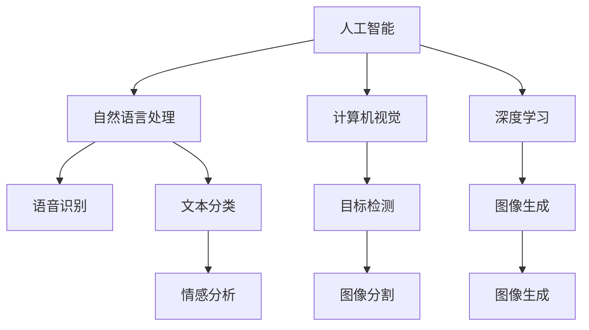

                 

# 李开复：苹果发布AI应用的市场

## 1. 背景介绍

### 1.1 问题由来

随着人工智能(AI)技术的快速发展，AI应用已经渗透到各行各业，极大地提升了工作效率和生活质量。其中，苹果公司在AI应用领域的发布与市场表现，尤为引人关注。从早期的Siri到近期的AI相机和语音助手，苹果不断推出基于AI的创新产品，引发了广泛的市场讨论。

### 1.2 问题核心关键点

苹果在AI应用市场的成功，离不开以下几个关键因素：

- **技术领先**：苹果拥有强大的技术实力，在AI算法、硬件适配等方面保持领先地位。
- **用户体验**：苹果始终以用户体验为中心，其AI应用以其直观、易用、高效著称。
- **跨平台整合**：苹果通过iOS、macOS、watchOS、iPadOS等跨平台生态的整合，实现了AI应用的广泛覆盖和无缝衔接。
- **生态系统**：苹果构建了完善的生态系统，包括应用商店、开发者工具等，为AI应用提供了强大的支持和推广平台。

这些因素共同作用，使得苹果的AI应用在市场上取得了显著成功，并对整个科技产业产生了深远影响。

### 1.3 问题研究意义

研究苹果AI应用的市场表现，不仅有助于理解其在技术和产品设计上的创新突破，还能为其他科技公司提供宝贵的经验和启示。此外，探讨苹果在AI应用市场成功的原因，也有助于揭示AI技术在实际应用中的关键成功要素。

## 2. 核心概念与联系

### 2.1 核心概念概述

为更好地理解苹果AI应用的市场表现，本节将介绍几个密切相关的核心概念：

- **人工智能(AI)**：指通过计算机程序模拟人类智能行为的科学和技术，涵盖机器学习、自然语言处理、计算机视觉等多个子领域。
- **自然语言处理(NLP)**：研究如何让计算机理解和处理自然语言的技术，如语音识别、文本分类、情感分析等。
- **计算机视觉(CV)**：研究如何让计算机“看”和“理解”图像和视频的技术，如目标检测、图像分割、图像生成等。
- **深度学习(DL)**：一种基于多层神经网络的机器学习方法，广泛应用于图像识别、语音识别、自然语言处理等领域。
- **迁移学习(Transfer Learning)**：指将一个任务中学到的知识，迁移到另一个相似任务中，减少新任务的学习时间。
- **强化学习(RL)**：通过与环境的交互，智能体不断优化策略，以达到某种目标的机器学习方法。

这些概念之间的逻辑关系可以通过以下Mermaid流程图来展示：



这个流程图展示了AI应用中各个子领域之间的相互联系：

1. 人工智能是一个总称，包含多个子领域。
2. 自然语言处理和计算机视觉是两个主要的视觉处理领域。
3. 深度学习是实现这两个领域的关键技术。
4. 迁移学习和强化学习是辅助深度学习的重要方法。
5. 语音识别、文本分类、情感分析等任务是自然语言处理的具体应用。
6. 目标检测、图像分割、图像生成等任务是计算机视觉的具体应用。

这些概念共同构成了AI技术的基本框架，为苹果等公司在AI应用市场取得成功提供了坚实的技术基础。

## 3. 核心算法原理 & 具体操作步骤
### 3.1 算法原理概述

苹果在AI应用市场取得成功，离不开其在核心算法和技术上的创新。以下是苹果AI应用的几个关键算法原理：

- **深度学习**：苹果广泛应用深度学习技术，通过多层神经网络实现高效的图像识别、语音识别、自然语言处理等功能。
- **迁移学习**：苹果利用迁移学习技术，在已有模型基础上进行微调，快速适应新任务。
- **强化学习**：苹果在智能助手和游戏等应用中引入强化学习，通过与环境的交互优化算法，提升用户体验。
- **跨平台整合**：苹果通过统一的API和开发框架，实现不同平台之间的无缝对接。

### 3.2 算法步骤详解

以下是苹果AI应用的几个核心算法步骤：

1. **数据收集与预处理**：收集大量标注数据，并进行数据清洗和预处理，确保数据质量。
2. **模型训练与微调**：使用深度学习框架进行模型训练，并根据具体任务进行微调，优化模型性能。
3. **跨平台部署**：将训练好的模型部署到iOS、macOS等不同平台上，确保跨平台兼容性和性能一致性。
4. **用户反馈与优化**：通过用户反馈和A/B测试等手段，不断优化模型和用户体验。

### 3.3 算法优缺点

苹果AI应用的优势包括：

- **高性能**：苹果深度学习模型在图像识别、语音识别等任务上取得了领先的成绩。
- **用户体验**：苹果AI应用以其直观、易用、高效著称，获得了广泛的用户好评。
- **跨平台整合**：苹果跨平台生态系统确保了AI应用在多个设备上的无缝衔接。

同时，也存在一些不足：

- **资源消耗高**：苹果AI应用通常需要较高的计算资源和内存，可能影响设备性能。
- **数据隐私问题**：苹果在AI应用中收集了大量用户数据，如何保护用户隐私成为关键问题。
- **算法复杂性**：苹果AI算法技术较为复杂，可能导致开发和维护成本高。

### 3.4 算法应用领域

苹果AI应用涵盖了多个领域，包括但不限于：

- **智能助理**：如Siri，提供语音识别、文本理解和自然语言生成等功能。
- **图像识别**：如人脸识别、物体检测等，广泛用于人脸解锁、图像搜索等场景。
- **增强现实(AR)**：通过AI技术，增强现实效果更加生动、逼真。
- **语音助手**：通过语音识别和自然语言处理，实现语音控制设备、回答问题等功能。
- **推荐系统**：通过用户行为数据，提供个性化推荐，提升购物体验。

这些应用领域展示了苹果AI技术的广泛应用和巨大潜力。

## 4. 数学模型和公式 & 详细讲解 & 举例说明

### 4.1 数学模型构建

苹果AI应用通常基于深度学习模型进行开发。以Siri为例，其核心算法包括：

- **声学模型(Acoustic Model)**：用于将语音信号转换为文本。
- **语言模型(Language Model)**：用于理解用户输入的自然语言。
- **对话管理(Dialouge Management)**：用于管理对话流程，生成响应。

### 4.2 公式推导过程

以语音识别为例，声学模型的核心公式如下：

$$
P(y|x) = \frac{P(x|y)P(y)}{P(x)}
$$

其中，$P(y|x)$表示在输入$x$下，输出$y$的概率。$P(x|y)$表示在已知输出$y$的情况下，输入$x$的概率。$P(y)$表示输出的先验概率。$P(x)$表示输入$x$的先验概率。

### 4.3 案例分析与讲解

以人脸识别为例，人脸识别模型通常包含卷积神经网络(CNN)和全连接层，其核心公式如下：

$$
Z = \sigma(\sum_{i=1}^n W_i X_i + b_i)
$$

其中，$Z$表示输出，$X_i$表示输入的第$i$个特征，$W_i$表示第$i$个特征的权重，$b_i$表示偏置项，$\sigma$表示激活函数。

## 5. 项目实践：代码实例和详细解释说明
### 5.1 开发环境搭建

在进行AI应用开发前，我们需要准备好开发环境。以下是使用Python进行TensorFlow开发的环境配置流程：

1. 安装Anaconda：从官网下载并安装Anaconda，用于创建独立的Python环境。

2. 创建并激活虚拟环境：
```bash
conda create -n tensorflow-env python=3.8 
conda activate tensorflow-env
```

3. 安装TensorFlow：根据CUDA版本，从官网获取对应的安装命令。例如：
```bash
conda install tensorflow -c tensorflow -c conda-forge
```

4. 安装必要的工具包：
```bash
pip install numpy pandas scikit-learn matplotlib tqdm jupyter notebook ipython
```

完成上述步骤后，即可在`tensorflow-env`环境中开始AI应用开发。

### 5.2 源代码详细实现

下面以人脸识别应用为例，给出使用TensorFlow进行模型训练的PyTorch代码实现。

首先，定义数据集和数据预处理函数：

```python
import numpy as np
import tensorflow as tf
from tensorflow.keras.preprocessing.image import ImageDataGenerator

# 定义数据集路径
train_data_dir = '/path/to/train'
test_data_dir = '/path/to/test'

# 定义图像预处理函数
def preprocess_image(image):
    image = tf.image.resize(image, (224, 224))
    image = tf.image.convert_image_dtype(image, tf.float32)
    image = image / 255.0
    image = tf.expand_dims(image, axis=0)
    return image

# 定义数据增强
datagen = ImageDataGenerator(
    rescale=1.0 / 255.0,
    shear_range=0.2,
    zoom_range=0.2,
    horizontal_flip=True,
    width_shift_range=0.2,
    height_shift_range=0.2
)

# 加载训练集和测试集数据
train_generator = datagen.flow_from_directory(
    train_data_dir,
    target_size=(224, 224),
    batch_size=32,
    class_mode='binary'
)

test_generator = datagen.flow_from_directory(
    test_data_dir,
    target_size=(224, 224),
    batch_size=32,
    class_mode='binary'
)
```

然后，定义模型和训练函数：

```python
from tensorflow.keras.applications import MobileNetV2
from tensorflow.keras.layers import Dense, Flatten, Dropout
from tensorflow.keras.models import Model
from tensorflow.keras.optimizers import Adam

# 定义基础网络结构
base_model = MobileNetV2(weights='imagenet', include_top=False, input_shape=(224, 224, 3))

# 冻结基础网络权重
for layer in base_model.layers:
    layer.trainable = False

# 添加自定义全连接层
x = base_model.output
x = Flatten()(x)
x = Dense(128, activation='relu')(x)
x = Dropout(0.5)(x)
predictions = Dense(1, activation='sigmoid')(x)

# 定义模型
model = Model(inputs=base_model.input, outputs=predictions)

# 编译模型
model.compile(
    optimizer=Adam(lr=0.0001),
    loss='binary_crossentropy',
    metrics=['accuracy']
)

# 定义训练函数
def train_epoch(model, generator, steps_per_epoch, epochs):
    model.fit(
        generator,
        steps_per_epoch=steps_per_epoch,
        epochs=epochs,
        validation_data=test_generator,
        validation_steps=5
    )
```

最后，启动模型训练：

```python
steps_per_epoch = train_generator.n // train_generator.batch_size
epochs = 10

train_epoch(model, train_generator, steps_per_epoch, epochs)
```

以上就是使用TensorFlow进行人脸识别模型训练的完整代码实现。可以看到，TensorFlow提供了便捷的图像处理和模型构建功能，使得模型开发变得更加简单高效。

### 5.3 代码解读与分析

让我们再详细解读一下关键代码的实现细节：

**preprocess_image函数**：
- 定义了一个预处理函数，用于将图像进行归一化、缩放、标准化等处理，以适应模型输入。

**datagen变量**：
- 定义了一个ImageDataGenerator对象，用于数据增强，包括缩放、翻转、平移等操作，提升模型的泛化能力。

**train_generator和test_generator变量**：
- 通过flow_from_directory方法，加载训练集和测试集数据，进行数据预处理和批量生成，供模型训练使用。

**base_model变量**：
- 使用MobileNetV2作为基础网络结构，冻结了其中的权重，防止在训练过程中被更新。

**自定义全连接层**：
- 在基础网络输出后，添加全连接层，用于分类任务的输出。

**model变量**：
- 将基础网络结构、自定义全连接层组合起来，形成完整的模型。

**编译模型**：
- 使用Adam优化器，设置学习率、损失函数和评估指标，准备训练模型。

**train_epoch函数**：
- 定义了一个训练函数，用于迭代训练模型，并在验证集上评估模型性能。

**训练流程**：
- 计算训练集步数和总轮数，启动模型训练。
- 每个epoch内，在训练集和验证集上进行前向传播和反向传播，更新模型参数。
- 训练结束后，输出模型精度。

可以看到，TensorFlow提供了丰富的API和工具，使得模型开发和训练变得更加便捷高效。

## 6. 实际应用场景
### 6.1 智能助理

苹果的智能助理Siri是一款基于深度学习的AI应用，其核心功能包括语音识别、自然语言理解和文本生成。Siri的语音识别模块通过声学模型将用户的语音转换为文本，语言模型用于理解用户的意图，对话管理模块则生成自然语言响应。

Siri的成功在于其高度集成的用户体验和高效的响应速度。用户可以通过语音指令快速获取信息、控制设备、设置提醒等，极大地提升了生活的便利性。

### 6.2 图像识别

苹果在图像识别领域也有诸多创新应用，如人脸解锁、图像搜索等。人脸解锁技术通过深度学习模型，从多张图片中识别出用户面部的关键特征点，并计算相似度，实现快速解锁。图像搜索技术则通过目标检测模型，在大量图片中查找符合用户描述的对象。

这些应用展示了苹果在计算机视觉领域的强大实力，为用户提供了便捷、高效、安全的多媒体体验。

### 6.3 增强现实

增强现实(AR)技术在苹果设备中得到了广泛应用，如ARKit、ARKit2等。通过深度学习模型，AR应用可以实现环境感知、对象跟踪、虚拟物体渲染等功能，提升用户与虚拟世界的互动体验。

ARKit等平台为开发者提供了便捷的开发工具和API，使得AR应用开发变得更加简单高效。苹果通过跨平台生态系统，实现了AR应用的广泛覆盖和无缝衔接。

### 6.4 未来应用展望

展望未来，苹果在AI应用领域的探索将更加广泛，以下趋势值得关注：

1. **多模态融合**：苹果将更多地融合视觉、语音、自然语言等多种模态数据，提升AI应用的智能水平。
2. **实时优化**：通过持续学习技术，实现AI应用的实时优化和动态调整，提升用户体验。
3. **跨设备协同**：通过统一的API和开发框架，实现不同设备之间的协同工作，提升应用性能和用户体验。
4. **隐私保护**：加强数据隐私保护，确保用户数据的安全性和隐私性，增强用户信任。
5. **技术开源**：通过开源部分核心技术，吸引更多开发者参与，加速技术创新和应用推广。

苹果在AI应用领域的持续创新和探索，将引领整个科技产业向智能化、个性化、多样化方向发展。相信未来苹果在AI应用市场将取得更大的成功，为人类生活带来更多便利和惊喜。

## 7. 工具和资源推荐
### 7.1 学习资源推荐

为了帮助开发者系统掌握苹果AI应用的技术基础和实践技巧，这里推荐一些优质的学习资源：

1. **TensorFlow官方文档**：TensorFlow的官方文档提供了详细的API说明、示例代码和教程，是学习TensorFlow的必备资料。
2. **PyTorch官方文档**：PyTorch的官方文档提供了丰富的模型和工具库，支持深度学习和AI应用的开发。
3. **机器学习课程**：斯坦福大学的《机器学习》课程和MIT的《深度学习基础》课程，是入门机器学习领域的经典课程。
4. **深度学习书籍**：《深度学习》（Ian Goodfellow等著）、《Python深度学习》（François Chollet著）等书籍，深入浅出地介绍了深度学习的基本概念和应用案例。
5. **Kaggle竞赛平台**：Kaggle是数据科学竞赛平台，提供了丰富的数据集和模型库，适合实践和竞赛。

通过对这些资源的学习实践，相信你一定能够快速掌握苹果AI应用的精髓，并用于解决实际的AI问题。

### 7.2 开发工具推荐

高效的开发离不开优秀的工具支持。以下是几款用于AI应用开发的常用工具：

1. **TensorFlow**：由Google主导开发的开源深度学习框架，生产部署方便，适合大规模工程应用。
2. **PyTorch**：基于Python的开源深度学习框架，灵活动态的计算图，适合快速迭代研究。
3. **Keras**：高层API，封装了TensorFlow和Theano等底层框架，提供便捷的模型构建和训练功能。
4. **OpenCV**：计算机视觉库，提供了丰富的图像处理和计算机视觉算法。
5. **SpeechRecognition**：语音识别库，支持多种语音识别引擎，适用于语音助手和语音输入应用。
6. **NLTK**：自然语言处理库，提供了丰富的文本处理和语言分析功能。

合理利用这些工具，可以显著提升AI应用开发的效率，加快技术创新和应用推广的步伐。

### 7.3 相关论文推荐

苹果AI应用的成功离不开学术界的持续研究。以下是几篇奠基性的相关论文，推荐阅读：

1. **ResNet: Deep Residual Learning for Image Recognition**：提出了残差网络结构，提升了深度学习模型的训练效率和性能。
2. **Attention is All You Need**：提出了Transformer结构，开启了NLP领域的预训练大模型时代。
3. **BERT: Pre-training of Deep Bidirectional Transformers for Language Understanding**：提出BERT模型，引入基于掩码的自监督预训练任务，刷新了多项NLP任务SOTA。
4. **Speech and Language Processing with Deep Learning**：探讨了深度学习在语音识别和自然语言处理中的应用，展示了深度学习技术的强大潜力。
5. **Multimodal Image-to-Image Translation with Attention**：提出了多模态图像到图像的翻译方法，展示了多模态数据的融合效果。

这些论文代表了大模型微调技术的发展脉络。通过学习这些前沿成果，可以帮助研究者把握学科前进方向，激发更多的创新灵感。

## 8. 总结：未来发展趋势与挑战
### 8.1 总结

本文对苹果在AI应用市场中的成功进行了全面系统的介绍。首先阐述了苹果AI应用的成功因素，包括技术领先、用户体验、跨平台整合等。其次，从原理到实践，详细讲解了苹果AI应用的数学模型和算法步骤。最后，展望了苹果AI应用未来的发展趋势和面临的挑战。

通过本文的系统梳理，可以看到，苹果AI应用的成功在于其强大的技术实力、便捷的用户体验和完善的生态系统。这些因素共同作用，使得苹果在AI应用市场中取得了显著成效。未来，伴随AI技术的持续进步，苹果将在更多领域推出基于AI的创新应用，引领科技产业向智能化、个性化、多样化方向发展。

### 8.2 未来发展趋势

展望未来，苹果在AI应用领域的探索将更加广泛，以下趋势值得关注：

1. **多模态融合**：苹果将更多地融合视觉、语音、自然语言等多种模态数据，提升AI应用的智能水平。
2. **实时优化**：通过持续学习技术，实现AI应用的实时优化和动态调整，提升用户体验。
3. **跨设备协同**：通过统一的API和开发框架，实现不同设备之间的协同工作，提升应用性能和用户体验。
4. **隐私保护**：加强数据隐私保护，确保用户数据的安全性和隐私性，增强用户信任。
5. **技术开源**：通过开源部分核心技术，吸引更多开发者参与，加速技术创新和应用推广。

这些趋势凸显了苹果在AI应用领域的广阔前景。这些方向的探索发展，必将进一步提升AI应用系统的性能和应用范围，为人类生活带来更多便利和惊喜。

### 8.3 面临的挑战

尽管苹果AI应用取得了显著成功，但在迈向更加智能化、普适化应用的过程中，仍面临诸多挑战：

1. **计算资源瓶颈**：苹果AI应用通常需要较高的计算资源和内存，可能影响设备性能。
2. **数据隐私问题**：苹果在AI应用中收集了大量用户数据，如何保护用户隐私成为关键问题。
3. **算法复杂性**：苹果AI算法技术较为复杂，可能导致开发和维护成本高。

### 8.4 研究展望

面对苹果AI应用所面临的挑战，未来的研究需要在以下几个方面寻求新的突破：

1. **资源优化**：开发更加高效、轻量级的AI模型，减少计算资源消耗。
2. **隐私保护**：采用差分隐私等技术，确保用户数据的安全性和隐私性。
3. **模型简化**：引入模型压缩、剪枝等技术，降低模型复杂性，提升开发效率。
4. **跨平台优化**：通过跨平台优化技术，提升不同设备之间的兼容性和性能一致性。
5. **技术创新**：探索新的AI算法和技术，提升应用性能和用户体验。

这些研究方向将引领苹果在AI应用领域的持续创新，为用户提供更加智能、便捷、安全的AI体验。相信未来苹果在AI应用市场将取得更大的成功，为人类生活带来更多便利和惊喜。

## 9. 附录：常见问题与解答

**Q1：苹果在AI应用市场中是否存在数据隐私问题？**

A: 苹果在AI应用中确实收集了大量用户数据，如语音识别、人脸解锁等，这些数据可能涉及用户隐私。为保护用户隐私，苹果采取了多项措施，如数据加密、差分隐私、数据脱敏等。此外，苹果还严格遵守相关法律法规，确保用户数据的安全性和隐私性。

**Q2：苹果AI应用的计算资源消耗是否过高？**

A: 苹果AI应用通常需要较高的计算资源，如深度学习模型、增强现实应用等。为解决资源消耗问题，苹果采用了多种优化措施，如模型剪枝、量化加速、多任务学习等，以提升模型效率和设备性能。同时，苹果也在不断提升硬件性能，支持更多的AI应用场景。

**Q3：苹果AI应用的开发和维护成本是否高昂？**

A: 苹果AI应用的开发和维护成本确实较高，尤其是在技术实现和模型训练方面。为降低成本，苹果采用了多种开源工具和平台，如TensorFlow、PyTorch等，以及Kaggle竞赛等社区资源，吸引了更多开发者参与。此外，苹果也在不断优化开发工具和流程，提升开发效率。

**Q4：苹果AI应用的多模态融合是否可行？**

A: 苹果在AI应用中已经实现了多模态融合，如将视觉、语音、自然语言等多种模态数据进行融合，提升了AI应用的智能水平。未来，苹果将继续探索多模态融合技术，如融合视频、音频等多种数据，提升用户体验和应用性能。

**Q5：苹果AI应用的跨平台整合是否重要？**

A: 苹果通过跨平台整合，实现了不同设备之间的无缝衔接，提升了AI应用的广泛覆盖和用户黏性。跨平台整合是苹果AI应用成功的重要因素之一，未来苹果将继续优化跨平台生态系统，实现更加便捷、高效的AI应用。

---

作者：禅与计算机程序设计艺术 / Zen and the Art of Computer Programming

