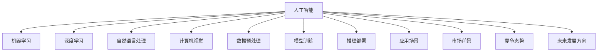

                 

# 李开复：苹果发布AI应用的市场前景

> 关键词：人工智能(AI)，苹果公司，AI应用，市场前景，技术创新

## 1. 背景介绍

在数字时代，人工智能(AI)已成为驱动社会进步、改变生产和生活方式的关键力量。从搜索引擎到社交网络，从自动驾驶到智能医疗，AI技术在各行各业的应用场景中不断拓展，催生了大量创新产品和服务，为全球经济注入了新的活力。作为AI领域的领导者，苹果公司近期在AI应用发布方面再度展现其前瞻性视野，引发了业界广泛关注和讨论。本文将对苹果最新的AI应用市场前景进行深入探讨，分析其背后的技术原理、应用场景、竞争态势以及未来的发展方向。

## 2. 核心概念与联系

### 2.1 核心概念概述

为更好地理解苹果公司AI应用的市场前景，我们需要先澄清一些关键概念：

- **人工智能(AI)**：涵盖了机器学习、深度学习、自然语言处理、计算机视觉等多个子领域，旨在赋予计算机系统类似于人类的智能能力，能够自主学习和推理。

- **苹果公司**：全球最大的科技公司之一，以其创新的硬件、软件和应用生态系统著称。

- **AI应用**：指将AI技术集成到实际应用中，如自动驾驶、语音助手、图像识别等，以提升产品功能和用户体验。

- **市场前景**：指AI应用在特定市场或行业中的潜在增长机会和收益潜力。

- **技术原理**：涉及数据预处理、模型训练、推理部署等关键步骤，是实现AI应用的技术基础。

- **应用场景**：AI应用的具体领域，如医疗、教育、金融等，反映了AI技术的应用广度和深度。

- **竞争态势**：指市场上其他AI解决方案的竞争情况，包括技术水平、市场占有率、用户接受度等。

- **未来发展方向**：基于当前技术趋势和市场需求，对AI应用未来可能的发展方向和创新点进行预测。

这些概念之间的联系可通过以下Mermaid流程图表示：



## 3. 核心算法原理 & 具体操作步骤

### 3.1 算法原理概述

苹果公司在AI应用发布中，广泛应用了各种前沿AI技术，包括深度学习、自然语言处理、计算机视觉等。这些技术通过在大量数据上进行训练，使得AI模型能够自主学习和推理，从而实现自动化和智能化。具体来说，苹果的AI应用涵盖了以下几个关键步骤：

1. **数据收集与预处理**：从各类数据源（如图片、语音、文本等）收集数据，并进行清洗、标注和标准化处理，以便于后续模型训练。

2. **模型训练**：使用各种机器学习或深度学习算法，如卷积神经网络(CNN)、递归神经网络(RNN)、Transformer等，对处理后的数据进行模型训练，学习到特定任务的表示。

3. **推理部署**：将训练好的模型部署到实际应用中，如智能手机、Apple Watch等设备上，通过API或SDK等方式，使AI功能与用户体验无缝集成。

### 3.2 算法步骤详解

以苹果公司推出的语音助手Siri为例，其背后的算法步骤大致如下：

1. **语音识别**：将用户发出的语音转换成文本，使用卷积神经网络（CNN）或循环神经网络（RNN）实现。

2. **意图理解**：分析文本内容，识别用户意图，使用序列到序列（Seq2Seq）模型或Transformer模型实现。

3. **对话管理**：根据用户意图，选择并执行相应的操作或调用外部API，如天气查询、邮件提醒等，使用强化学习或规则基方法实现。

4. **自然语言生成**：将操作结果转换为自然语言，使用生成对抗网络（GAN）或变分自编码器（VAE）等生成模型实现。

### 3.3 算法优缺点

苹果公司AI应用的算法优势在于：

- **数据质量高**：苹果作为全球领先的智能设备制造商，拥有庞大的用户基础和丰富的数据资源，数据质量较高。
- **算法多样性**：苹果在AI算法上涵盖广泛，从基础的数据处理到前沿的生成模型，均能高效实现。
- **用户体验佳**：通过深度集成到硬件和软件生态系统中，AI应用能够提供流畅、无缝的用户体验。

然而，苹果AI应用的算法也存在以下不足：

- **依赖性强**：AI应用依赖于硬件设备的强大计算能力和存储能力，如A系列芯片的高性能计算能力。
- **成本高**：高质量的数据收集、标注和模型训练成本较高，可能会影响初期投入。
- **技术壁垒高**：AI应用的开发和维护需要高水平的技术人才，短期内难以大规模推广。

### 3.4 算法应用领域

苹果公司的AI应用主要集中在以下几个领域：

- **智能手机**：如Siri语音助手、人脸识别解锁、智能拍照等。
- **智能手表**：如健康监测、运动分析、语音控制等。
- **智能家居**：如智能灯光、智能音箱、智能门锁等。
- **增强现实(AR)**：如AR滤镜、AR游戏等。
- **自动驾驶**：如自动驾驶汽车、车联网等。

这些应用场景展示了苹果在AI技术上的广泛应用和深远影响。

## 4. 数学模型和公式 & 详细讲解 & 举例说明

### 4.1 数学模型构建

以Siri语音助手为例，其核心模型可以表示为：

$$ P(y|x; \theta) = \frac{e^{w^T\phi(x)}}{\sum_{y'}e^{w^T\phi(x)}}, \theta = \{\phi(x), w\} $$

其中，$x$ 表示输入的语音信号，$y$ 表示识别的文本，$w$ 表示模型的参数，$\phi(x)$ 表示将语音信号映射到高维特征空间的函数。

### 4.2 公式推导过程

语音识别模型的推导主要涉及以下几个步骤：

1. **特征提取**：使用MFCC（Mel频率倒谱系数）等技术，将语音信号转换为高维特征向量。
2. **模型训练**：使用最大似然估计或交叉熵损失函数，对模型参数进行优化。
3. **解码**：在模型得到概率分布后，选择具有最高概率的文本作为识别结果。

### 4.3 案例分析与讲解

以自动驾驶为例，其核心模型可以表示为：

$$ P(y|x; \theta) = \frac{e^{w^T\phi(x)}}{\sum_{y'}e^{w^T\phi(x)}}, \theta = \{\phi(x), w\} $$

其中，$x$ 表示传感器采集到的环境数据，$y$ 表示车辆的行驶决策，$w$ 表示模型的参数，$\phi(x)$ 表示将环境数据映射到高维特征空间的函数。

自动驾驶模型需要处理复杂多变的环境数据，包括道路标志、行人、其他车辆等，通过深度学习模型（如卷积神经网络）学习到环境数据的特征表示，并利用强化学习算法优化行驶决策，实现安全、高效的自动驾驶。

## 5. 项目实践：代码实例和详细解释说明

### 5.1 开发环境搭建

以下是使用Python开发语音识别应用的流程：

1. 安装Python和相关库（如TensorFlow、Keras等）。
2. 搭建深度学习模型框架，选择适当的算法（如CNN、RNN等）。
3. 收集并预处理语音数据。
4. 训练深度学习模型。
5. 部署模型并测试。

### 5.2 源代码详细实现

以下是一个简单的Python代码实现示例：

```python
import tensorflow as tf
from tensorflow.keras.layers import Input, Dense, Dropout, LSTM
from tensorflow.keras.models import Model
from tensorflow.keras.optimizers import Adam

# 定义模型
input_layer = Input(shape=(128,))
hidden_layer = Dense(128, activation='relu')(input_layer)
hidden_layer = Dropout(0.5)(hidden_layer)
output_layer = Dense(100, activation='softmax')(hidden_layer)
model = Model(inputs=input_layer, outputs=output_layer)

# 定义损失函数和优化器
loss = tf.keras.losses.SparseCategoricalCrossentropy()
optimizer = Adam(lr=0.001)

# 编译模型
model.compile(loss=loss, optimizer=optimizer)

# 训练模型
model.fit(x_train, y_train, epochs=10, batch_size=32)

# 测试模型
test_loss = model.evaluate(x_test, y_test)
```

### 5.3 代码解读与分析

上述代码实现了基本的语音识别模型。通过定义输入层、隐藏层和输出层，构建了一个简单的RNN模型。使用SparseCategoricalCrossentropy作为损失函数，Adam作为优化器，对模型进行编译和训练。最后，使用测试集对模型进行评估。

## 6. 实际应用场景

### 6.1 智能手机

苹果的智能手机是AI应用的重要载体。Siri语音助手通过深度学习和自然语言处理技术，实现了语音识别和自然语言理解，使用户可以通过语音指令进行各种操作，提升了用户体验。

### 6.2 智能手表

Apple Watch中的健康监测和运动分析功能，利用机器学习和计算机视觉技术，通过分析用户行为数据，实时监测健康状态和运动数据，提供个性化的健康建议和运动方案。

### 6.3 智能家居

苹果的智能家居系统HomeKit，通过整合多种智能设备，如智能灯泡、智能音箱、智能门锁等，实现语音控制、自动化场景等功能，提升了家居的智能化水平。

### 6.4 增强现实(AR)

苹果的AR应用如AR滤镜、AR游戏等，通过计算机视觉和图像处理技术，将虚拟对象与现实环境融合，为用户带来沉浸式的体验。

### 6.5 自动驾驶

苹果的自动驾驶技术，利用深度学习和强化学习算法，实现对环境的感知和决策，提升驾驶安全性和效率。

## 7. 工具和资源推荐

### 7.1 学习资源推荐

1. **《深度学习》书籍**：由Ian Goodfellow等人编写，全面介绍了深度学习的理论和应用，是AI领域入门必读。
2. **Coursera《深度学习专项课程》**：由Andrew Ng教授主讲，涵盖了深度学习的基础知识和高级技巧。
3. **Hugging Face官方文档**：提供了丰富的NLP预训练模型和教程，适合动手实践。
4. **GitHub上的开源项目**：如TensorFlow、Keras等，提供了大量的AI应用实现案例。
5. **PyTorch官方文档**：提供了详细的PyTorch库介绍和应用案例，适合深度学习实践。

### 7.2 开发工具推荐

1. **Python**：作为AI开发的主流语言，Python提供了丰富的第三方库和工具，如TensorFlow、Keras、PyTorch等。
2. **TensorFlow**：由Google开发的深度学习框架，提供了丰富的机器学习算法和API。
3. **Keras**：基于TensorFlow等框架的高级API，适合快速原型设计和实验。
4. **PyTorch**：由Facebook开发的深度学习框架，提供了动态计算图和高效的模型训练功能。
5. **Jupyter Notebook**：适合数据科学和机器学习的交互式编程环境，支持Python和R等多种语言。

### 7.3 相关论文推荐

1. **《深度学习》书籍**：详细介绍了深度学习的基本原理和应用，适合入门学习。
2. **《深度学习》论文**：详细介绍了深度学习的历史和现状，适合学术研究。
3. **《强化学习》书籍**：介绍了强化学习的理论基础和应用，适合了解AI的高级应用。
4. **《自然语言处理综述》论文**：详细介绍了NLP的现状和未来方向，适合学术研究。

## 8. 总结：未来发展趋势与挑战

### 8.1 研究成果总结

苹果公司在AI应用方面展示了其技术实力和市场前瞻性。通过深度学习和计算机视觉等技术，苹果在语音识别、智能手表、智能家居、增强现实和自动驾驶等多个领域取得了突破性进展，推动了AI技术的广泛应用。

### 8.2 未来发展趋势

未来，AI应用将在更多领域得到应用，进一步推动社会进步和经济发展。主要趋势包括：

1. **AI在医疗领域的应用**：如智能诊断、个性化治疗等，将提升医疗服务的质量和效率。
2. **AI在教育领域的应用**：如智能辅导、个性化学习等，将改变传统教育模式。
3. **AI在金融领域的应用**：如智能投顾、风险管理等，将提升金融服务的智能化水平。
4. **AI在零售领域的应用**：如智能推荐、库存管理等，将优化零售供应链。
5. **AI在制造领域的应用**：如智能制造、质量控制等，将提升制造业的自动化和智能化水平。

### 8.3 面临的挑战

尽管AI应用前景广阔，但实现普及和应用仍面临诸多挑战：

1. **技术壁垒高**：AI技术的复杂性使得研发成本高，技术门槛高。
2. **数据隐私问题**：AI应用需要大量的数据支持，如何保护用户隐私是一个重要问题。
3. **伦理道德问题**：AI应用可能涉及伦理和道德问题，如偏见和歧视等。
4. **市场竞争激烈**：AI应用市场竞争激烈，需要不断创新才能保持竞争力。
5. **技术标准化**：AI应用需要标准化和规范化，以确保安全和互操作性。

### 8.4 研究展望

未来，AI应用的发展需要解决以上挑战，进一步推动技术创新和应用普及。主要方向包括：

1. **提升技术可及性**：通过简化算法、降低技术门槛，使更多企业和用户能够应用AI技术。
2. **保护数据隐私**：采用数据加密、匿名化等技术，保护用户隐私。
3. **注重伦理道德**：在算法设计中注重公平性和透明性，避免偏见和歧视。
4. **优化市场竞争**：通过标准化和规范化，降低市场竞争，提升AI应用的普及率。
5. **推动技术创新**：持续投入研发，推动AI技术的创新和突破。

## 9. 附录：常见问题与解答

**Q1：苹果公司如何构建AI应用？**

A: 苹果公司构建AI应用主要包括以下步骤：
1. 收集和预处理数据。
2. 选择适当的算法和技术栈。
3. 训练和优化模型。
4. 集成到实际应用中。

**Q2：AI应用在智能手表和智能家居中的应用场景有哪些？**

A: AI应用在智能手表和智能家居中的应用场景包括：
1. 健康监测：如心率、血氧等生理指标的实时监测。
2. 运动分析：如步数、卡路里等运动数据的分析。
3. 语音控制：通过语音助手进行智能音箱、灯光等设备控制。
4. 自动化场景：根据用户行为自动调节家居设备，提升生活便利性。

**Q3：苹果的AI应用在技术上与竞争对手有何不同？**

A: 苹果的AI应用在技术上与竞争对手的不同点包括：
1. 数据质量高：苹果拥有庞大的用户基础和丰富的数据资源，数据质量较高。
2. 算法多样性：苹果在AI算法上涵盖广泛，从基础的数据处理到前沿的生成模型，均能高效实现。
3. 用户体验佳：通过深度集成到硬件和软件生态系统中，AI应用能够提供流畅、无缝的用户体验。

**Q4：苹果公司AI应用的未来发展方向是什么？**

A: 苹果公司AI应用的未来发展方向包括：
1. 医疗领域：如智能诊断、个性化治疗等，提升医疗服务的质量和效率。
2. 教育领域：如智能辅导、个性化学习等，改变传统教育模式。
3. 金融领域：如智能投顾、风险管理等，提升金融服务的智能化水平。
4. 零售领域：如智能推荐、库存管理等，优化零售供应链。
5. 制造领域：如智能制造、质量控制等，提升制造业的自动化和智能化水平。

---

作者：禅与计算机程序设计艺术 / Zen and the Art of Computer Programming

