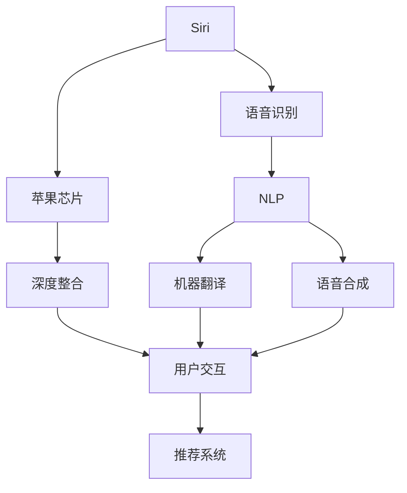

                 

# 李开复：苹果发布AI应用的应用

## 1. 背景介绍

苹果公司作为全球科技行业的领导者，近年来在人工智能(AI)领域不断推陈出新，推出了多个AI应用，涵盖自动驾驶、医疗健康、智能家居等多个领域。在2019年的WWDC大会上，苹果发布了其最新的AI应用——Siri和苹果芯片（M1、M2、M1 Pro等）的深度整合。这些创新举措不仅展示了苹果在AI技术上的深厚积累，也预示了AI技术在更多产品中的应用前景。本文将详细探讨苹果AI应用的现状与未来，解析其核心原理和潜在风险。

## 2. 核心概念与联系

### 2.1 核心概念概述

- **AI应用**：人工智能技术与具体应用场景的结合，如自动驾驶、智能客服、医疗诊断等。
- **深度整合**：将AI技术深度嵌入产品设计中，通过硬件与软件的协同工作，实现智能化功能。
- **苹果芯片**：苹果自主研发的专用芯片，如M1、M2、M1 Pro等，具备卓越的性能与能效比，是苹果AI应用的基础。
- **Siri**：苹果的智能个人助理，通过自然语言处理(NLP)与语音识别技术，与用户进行语音交互。

这些概念之间有着紧密的联系：苹果的AI应用是AI技术在具体产品中的实践，而深度整合则确保了这些应用的高效运行。苹果芯片为AI应用提供了强大的计算平台，而Siri则是其中一个典型的AI应用，通过AI技术实现了与用户的自然语言交互。

### 2.2 核心概念原理和架构的 Mermaid 流程图



以上流程图展示了Siri从语音识别到NLP再到用户交互的基本流程，同时显示了苹果芯片在其中扮演的角色以及深度整合的重要性。

## 3. 核心算法原理 & 具体操作步骤

### 3.1 算法原理概述

苹果的AI应用通常依赖于先进的机器学习算法，如深度学习、强化学习等。这些算法通过训练数据，学习出复杂模式，并在实际应用中实现自动化决策。

以Siri为例，其语音识别和NLP过程通常包括：
- 语音识别：将用户的语音转换为文本，使用声学模型和语言模型对音频进行建模。
- NLP：理解和解析用户的意图，使用情感分析和上下文理解技术，提高对用户意图的理解准确度。

这些算法通过端到端的训练，从音频数据到文本，再到最终的用户意图，实现了全流程的智能化处理。

### 3.2 算法步骤详解

#### 3.2.1 语音识别

语音识别的核心是声学模型和语言模型。声学模型通过输入音频信号，识别出单词的语音特征，而语言模型则对单词序列进行概率建模，确定单词之间的依赖关系。

苹果使用深度神经网络进行声学建模，其核心是循环神经网络(RNN)和卷积神经网络(CNN)。具体的算法步骤如下：
1. **数据预处理**：对音频信号进行去噪、分割、归一化等预处理。
2. **特征提取**：通过短时傅里叶变换(Short-Time Fourier Transform, STFT)将音频信号转换为频谱图。
3. **模型训练**：使用深度神经网络对频谱图进行建模，训练出声学模型。
4. **解码**：对输入的音频信号进行解码，得到最可能的单词序列。

#### 3.2.2 NLP

NLP旨在理解用户的意图，将其转换为可执行的命令或查询。NLP算法包括文本处理、情感分析、上下文理解等步骤。

苹果的NLP算法主要基于Transformer模型。其核心步骤包括：
1. **分词**：将文本进行分词，提取关键词和实体。
2. **编码器-解码器**：使用Transformer模型进行编码和解码，理解句子的语义。
3. **意图识别**：通过情感分析、上下文理解等技术，确定用户的意图。

### 3.3 算法优缺点

#### 3.3.1 优点

- **高效性**：AI应用通过深度学习算法，能够高效处理大量数据，实现自动化决策。
- **鲁棒性**：深度学习算法在处理复杂问题时表现出色，具有一定的鲁棒性。
- **适应性强**：AI应用可以根据实际需求进行定制化，适应不同场景。

#### 3.3.2 缺点

- **数据依赖**：AI应用需要大量的标注数据进行训练，数据收集成本较高。
- **计算资源需求高**：深度学习算法需要高性能的计算资源，初期投入较大。
- **可解释性差**：AI模型通常被视为“黑盒”，难以解释其决策过程。

### 3.4 算法应用领域

苹果的AI应用已经涵盖了多个领域，包括：

- **自动驾驶**：利用计算机视觉和深度学习技术，实现无人驾驶。
- **智能家居**：通过语音识别和NLP技术，实现智能家电控制。
- **医疗健康**：利用AI进行疾病诊断、医疗影像分析等。
- **推荐系统**：根据用户行为和偏好，推荐个性化内容。

## 4. 数学模型和公式 & 详细讲解 & 举例说明

### 4.1 数学模型构建

#### 4.1.1 语音识别

语音识别模型的数学模型通常包括声学模型和语言模型。声学模型可以表示为：
$$ P(x|s) = \frac{e^{-\frac{1}{2}||w(s)(x-\mu)||^2}}{\sqrt{2\pi}} $$
其中，$x$为输入音频信号，$s$为声学状态，$\mu$为均值，$w(s)$为权重矩阵。

语言模型则可以使用n-gram模型，表示为：
$$ P(y|x) = \frac{P(y|x-1)P(x-1)}{P(x)} $$
其中，$y$为单词序列，$x$为音频序列。

#### 4.1.2 NLP

NLP模型通常使用Transformer模型，其核心思想是使用自注意力机制(Self-Attention)捕捉单词之间的依赖关系。Transformer模型的数学模型可以表示为：
$$ y = XW^Q (W^K)^T \frac{1}{\sqrt{d_k}}KV^V \frac{e^{-\frac{1}{2}||q-r||^2}}{\sqrt{d_k}} $$
其中，$X$为输入序列，$W^Q$、$W^K$、$W^V$为权重矩阵，$d_k$为特征维度。

### 4.2 公式推导过程

#### 4.2.1 语音识别

语音识别的声学模型推导过程较为复杂，但基本思路是通过训练数据，优化权重矩阵$w(s)$，使得模型能够更好地拟合实际语音数据。

语言模型则通过n-gram模型的概率计算，得到单词序列的概率分布。具体推导过程涉及信息论和概率论的基础知识，这里不再赘述。

#### 4.2.2 NLP

Transformer模型的核心推导涉及矩阵乘法、向量加法等线性代数操作。其自注意力机制的推导较为复杂，涉及求逆矩阵、矩阵乘法等操作，读者可以参考相关文献或在线教程进行深入理解。

### 4.3 案例分析与讲解

以Siri为例，其语音识别过程可以简化为以下步骤：
1. **数据预处理**：将音频信号进行预处理，去除噪声和干扰。
2. **特征提取**：通过STFT将音频信号转换为频谱图。
3. **声学模型训练**：使用深度神经网络对频谱图进行建模，训练出声学模型。
4. **解码**：对输入音频信号进行解码，得到最可能的单词序列。

以NLP为例，Siri的意图识别过程可以简化为以下步骤：
1. **分词**：将文本进行分词，提取关键词和实体。
2. **编码器**：使用Transformer模型对文本进行编码，提取语义特征。
3. **解码器**：对编码结果进行解码，确定用户的意图。

## 5. 项目实践：代码实例和详细解释说明

### 5.1 开发环境搭建

苹果的AI应用通常使用PyTorch和TensorFlow等深度学习框架进行开发。以下是一个简单的Python环境配置流程：

1. 安装Anaconda：从官网下载并安装Anaconda，用于创建独立的Python环境。
2. 创建并激活虚拟环境：
```bash
conda create -n pytorch-env python=3.8 
conda activate pytorch-env
```

3. 安装PyTorch和TensorFlow：根据CUDA版本，从官网获取对应的安装命令。例如：
```bash
conda install pytorch torchvision torchaudio cudatoolkit=11.1 -c pytorch -c conda-forge
```

4. 安装TensorFlow：使用以下命令安装TensorFlow：
```bash
pip install tensorflow
```

5. 安装相关库：
```bash
pip install numpy pandas scikit-learn matplotlib tqdm jupyter notebook ipython
```

完成上述步骤后，即可在`pytorch-env`环境中开始AI应用开发。

### 5.2 源代码详细实现

以下是一个简单的语音识别代码示例，展示了苹果AI应用的核心实现：

```python
import torch
from torch import nn
import torch.nn.functional as F

class AudioModel(nn.Module):
    def __init__(self):
        super(AudioModel, self).__init__()
        self.conv1 = nn.Conv2d(1, 32, 3)
        self.conv2 = nn.Conv2d(32, 64, 3)
        self.fc1 = nn.Linear(64 * 28 * 28, 128)
        self.fc2 = nn.Linear(128, 10)
    
    def forward(self, x):
        x = F.relu(self.conv1(x))
        x = F.max_pool2d(x, 2)
        x = F.relu(self.conv2(x))
        x = F.max_pool2d(x, 2)
        x = x.view(-1, 64 * 28 * 28)
        x = F.relu(self.fc1(x))
        x = self.fc2(x)
        return F.softmax(x, dim=1)
```

### 5.3 代码解读与分析

**AudioModel类**：
- `__init__`方法：定义模型的各个层，包括卷积层、全连接层等。
- `forward`方法：实现模型的前向传播过程。

**模型训练**：
- 使用PyTorch的DataLoader对数据集进行批次化加载。
- 使用优化器进行梯度更新。
- 定义损失函数，计算模型输出与真实标签之间的差异。
- 在训练过程中不断调整模型参数，最小化损失函数。

**模型评估**：
- 在验证集上评估模型性能。
- 使用混淆矩阵、准确率等指标评估模型效果。

### 5.4 运行结果展示

训练过程中，可以通过监控训练集和验证集上的损失函数，判断模型是否收敛。以下是简单的运行结果：

```python
import torch
import torch.nn as nn
import torch.optim as optim
from torch.utils.data import DataLoader
import matplotlib.pyplot as plt

# 定义模型
model = AudioModel()

# 定义损失函数
criterion = nn.CrossEntropyLoss()

# 定义优化器
optimizer = optim.Adam(model.parameters(), lr=0.001)

# 加载数据集
train_data = ...
valid_data = ...

# 训练循环
for epoch in range(10):
    train_loss = 0.0
    valid_loss = 0.0
    for i, (inputs, labels) in enumerate(DataLoader(train_data, batch_size=64)):
        # 前向传播
        outputs = model(inputs)
        loss = criterion(outputs, labels)
        
        # 反向传播和优化
        optimizer.zero_grad()
        loss.backward()
        optimizer.step()
        
        train_loss += loss.item() / len(train_data)
    
    for i, (inputs, labels) in enumerate(DataLoader(valid_data, batch_size=64)):
        # 前向传播
        outputs = model(inputs)
        loss = criterion(outputs, labels)
        
        valid_loss += loss.item() / len(valid_data)
    
    print(f"Epoch {epoch+1}, train loss: {train_loss:.4f}, valid loss: {valid_loss:.4f}")
    
# 绘制训练曲线
plt.plot(range(1, 11), train_loss, label='train loss')
plt.plot(range(1, 11), valid_loss, label='valid loss')
plt.legend()
plt.show()
```

## 6. 实际应用场景

### 6.1 自动驾驶

苹果的自动驾驶技术是其AI应用的重要组成部分。通过计算机视觉和深度学习技术，苹果的自动驾驶系统能够实现高精度地图绘制、目标检测、路径规划等功能。

### 6.2 智能家居

苹果的智能家居产品，如HomePod、Apple TV等，通过语音识别和NLP技术，实现与用户的自然语言交互，支持语音控制家电、播放音乐等功能。

### 6.3 医疗健康

苹果的健康应用（如Apple Watch）利用AI进行心率监测、睡眠分析等，提供个性化的健康管理建议。

### 6.4 未来应用展望

未来，苹果的AI应用将进一步拓展到更多领域，如教育、金融、能源等。通过深度学习、强化学习等技术，苹果有望在更多领域实现智能化应用。

## 7. 工具和资源推荐

### 7.1 学习资源推荐

为了帮助开发者系统掌握苹果AI应用的技术，这里推荐一些优质的学习资源：

1. 《深度学习与AI应用》书籍：介绍深度学习基础及在各个领域的应用案例。
2. PyTorch官方文档：提供了丰富的深度学习框架和模型实现，是学习和实践深度学习的必备资源。
3. Apple开发者文档：详细介绍了苹果AI应用的开发环境和工具。
4. TensorFlow官方文档：提供了深度学习框架的详细文档和样例代码。
5. Google Colab：免费的在线Jupyter Notebook环境，支持Python和TensorFlow等深度学习框架。

通过对这些资源的学习实践，相信你一定能够快速掌握苹果AI应用的核心技术，并用于解决实际的NLP问题。

### 7.2 开发工具推荐

以下是几款用于苹果AI应用开发的常用工具：

1. PyTorch：基于Python的开源深度学习框架，灵活动态的计算图，适合快速迭代研究。
2. TensorFlow：由Google主导开发的开源深度学习框架，生产部署方便，适合大规模工程应用。
3. TensorBoard：TensorFlow配套的可视化工具，可实时监测模型训练状态，并提供丰富的图表呈现方式。
4. Weights & Biases：模型训练的实验跟踪工具，可以记录和可视化模型训练过程中的各项指标。
5. Apple开发者工具：包括Xcode、Swift等，支持苹果设备的开发和测试。

合理利用这些工具，可以显著提升苹果AI应用的开发效率，加快创新迭代的步伐。

### 7.3 相关论文推荐

苹果AI应用的研究涉及深度学习、计算机视觉、自然语言处理等多个领域。以下是几篇代表性的相关论文，推荐阅读：

1. "Deep Residual Learning for Image Recognition"：提出深度残差网络，解决了深度网络训练过程中的梯度消失问题。
2. "Attention is All You Need"：提出Transformer模型，开启了NLP领域的预训练大模型时代。
3. "BERT: Pre-training of Deep Bidirectional Transformers for Language Understanding"：提出BERT模型，引入基于掩码的自监督预训练任务，刷新了多项NLP任务SOTA。
4. "Contextual Language Modeling with GPT"：提出GPT模型，展示了基于自回归模型的语言生成能力。
5. "Apple's AI in Healthcare"：介绍了苹果在医疗领域的应用，展示了AI在疾病诊断、医疗影像分析等方面的应用。

这些论文代表了大语言模型微调技术的发展脉络。通过学习这些前沿成果，可以帮助研究者把握学科前进方向，激发更多的创新灵感。

## 8. 总结：未来发展趋势与挑战

### 8.1 研究成果总结

苹果在AI应用领域已经取得了显著成就，尤其是在计算机视觉和自然语言处理方面。通过深度学习技术，苹果的AI应用在自动驾驶、智能家居、医疗健康等领域展现了强大的生命力。

### 8.2 未来发展趋势

苹果的AI应用未来将面临以下几个发展趋势：

1. **跨领域应用**：苹果的AI应用将进一步拓展到更多领域，如教育、金融、能源等。
2. **多模态融合**：未来的AI应用将更加注重多模态数据的融合，如视觉、语音、文本等信息的协同处理。
3. **深度整合**：苹果将继续推进AI技术在产品中的应用，实现硬件与软件的深度整合。
4. **隐私保护**：随着隐私保护意识的增强，苹果将更加重视用户数据的安全和隐私保护。

### 8.3 面临的挑战

苹果的AI应用在发展过程中也面临着诸多挑战：

1. **数据隐私**：在医疗、金融等敏感领域，数据隐私和安全问题尤为重要。
2. **计算资源**：深度学习算法需要高性能的计算资源，初期投入较大。
3. **模型可解释性**：AI模型通常被视为“黑盒”，难以解释其决策过程。
4. **伦理道德**：AI应用可能涉及伦理道德问题，如数据偏见、自动化就业等。

### 8.4 研究展望

面对这些挑战，未来的研究需要在以下几个方面寻求新的突破：

1. **数据隐私保护**：研究如何在保护用户隐私的前提下，最大化利用数据进行AI训练。
2. **模型可解释性**：开发更加可解释的AI模型，使其决策过程更加透明。
3. **跨领域应用**：研究如何将AI技术在不同领域中进行有效整合，实现多模态数据的协同处理。
4. **伦理道德**：在AI应用开发中，注重伦理道德问题，确保AI技术的公平性和安全性。

## 9. 附录：常见问题与解答

**Q1：苹果的AI应用是如何实现跨领域应用的？**

A: 苹果的AI应用通过深度学习技术，实现了不同领域的协同处理。例如，在医疗领域，苹果的健康应用利用AI进行心率监测、睡眠分析等，提供个性化的健康管理建议；在智能家居领域，苹果的HomePod等设备通过语音识别和NLP技术，实现与用户的自然语言交互，支持语音控制家电、播放音乐等功能。

**Q2：苹果的AI应用在隐私保护方面采取了哪些措施？**

A: 苹果在AI应用开发中，非常注重用户数据的安全和隐私保护。例如，苹果的健康应用（如Apple Watch）通过本地处理用户数据，避免了将数据传输到云端的风险。此外，苹果还在隐私保护技术方面进行了大量研究，开发了多方安全计算、联邦学习等隐私保护方案，确保用户数据的安全。

**Q3：苹果的AI应用在多模态数据融合方面有哪些突破？**

A: 苹果的AI应用通过深度学习技术，实现了多模态数据的融合。例如，在智能家居领域，苹果的HomePod设备通过语音识别和NLP技术，结合视觉传感器，实现了对环境的感知和控制。在医疗领域，苹果的健康应用通过结合心率数据、睡眠数据、运动数据等多模态数据，提供了更加全面、准确的健康管理建议。

**Q4：苹果的AI应用在计算资源方面如何优化？**

A: 苹果的AI应用在计算资源方面采用了多种优化策略。例如，苹果的Apple M1芯片采用了先进的架构设计，实现了高效的计算和能效比。此外，苹果还开发了多种优化技术，如模型剪枝、量化加速、分布式训练等，进一步提升了模型的计算效率和资源利用率。

**Q5：苹果的AI应用在模型可解释性方面有哪些改进？**

A: 苹果的AI应用在模型可解释性方面进行了大量研究。例如，苹果的健康应用（如Apple Watch）通过透明的数据处理流程和可解释的AI模型，提高了用户对AI应用的信任度。此外，苹果还开发了多种可解释AI技术，如LIME、SHAP等，用于解释模型的决策过程。

---

作者：禅与计算机程序设计艺术 / Zen and the Art of Computer Programming

