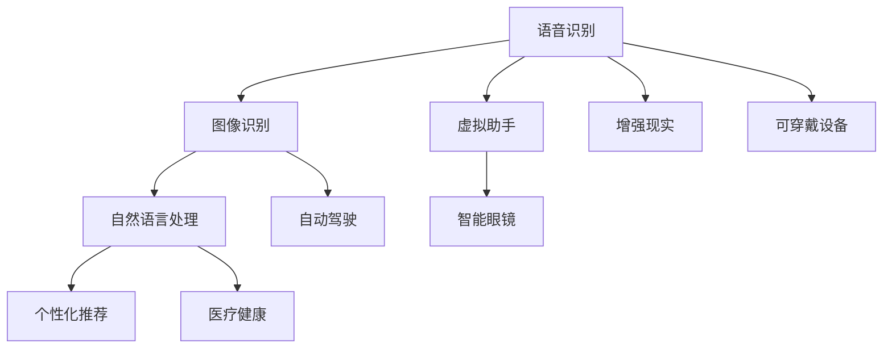

                 

## 1. 背景介绍

近年来，人工智能（AI）技术的快速发展，特别是机器学习和深度学习的突破，使得AI应用逐渐渗透到我们日常生活的各个方面。科技巨头苹果公司作为全球顶尖的科技公司，也在不断探索和应用AI技术，为消费者提供更好的产品和服务。本文将探讨苹果公司在AI应用领域的技术突破及其对未来发展的启示。

## 2. 核心概念与联系

### 2.1 核心概念概述

苹果公司是全球知名的科技公司，以创新著称。AI作为苹果产品的重要组成部分，涵盖了语音识别、图像识别、自然语言处理等多个领域。本文将详细阐述苹果在AI应用中的技术突破及其应用领域，并探讨其未来发展的潜力。

### 2.2 核心概念原理和架构的 Mermaid 流程图



这个流程图展示了苹果AI应用的核心概念及其相互关系：

- 语音识别（Speech Recognition）：苹果设备如Siri，利用深度学习模型实现语音转文本功能。
- 图像识别（Image Recognition）：在设备如iPhone的人脸解锁、拍照应用中使用。
- 自然语言处理（Natural Language Processing）：用于Siri的自然语言理解和生成。
- 个性化推荐（Personalized Recommendations）：在Apple Music、Apple News等应用中使用，提升用户体验。
- 虚拟助手（Virtual Assistant）：Siri的核心功能，通过自然语言处理实现人机交互。
- 增强现实（Augmented Reality）：在ARKit中实现，为用户提供沉浸式体验。
- 智能眼镜（Smart Glass）：如Apple Glass，结合AI技术提供个性化信息和增强现实功能。
- 医疗健康（Healthcare）：利用AI进行疾病预测和健康管理。
- 自动驾驶（Autonomous Driving）：Apple Car等产品中的关键技术。
- 可穿戴设备（Wearable Devices）：如Apple Watch，利用AI进行健康监测和智能提醒。

## 3. 核心算法原理 & 具体操作步骤

### 3.1 算法原理概述

苹果在AI应用中的技术突破主要集中在以下几个方面：

- 深度学习模型：苹果采用了多种深度学习模型，如卷积神经网络（CNN）、循环神经网络（RNN）、变换器（Transformer）等。
- 数据增强：苹果利用数据增强技术，扩充训练集，提高模型的泛化能力。
- 迁移学习：苹果通过迁移学习，利用已有模型在新任务上进行微调，提高模型性能。
- 模型压缩：苹果通过模型压缩技术，减少模型大小，提高推理速度和计算效率。

### 3.2 算法步骤详解

1. **数据准备**：收集和标注大量数据，分为训练集、验证集和测试集。
2. **模型选择**：选择适合任务的深度学习模型。
3. **模型训练**：使用训练集进行模型训练，调整超参数，使用数据增强和迁移学习等技术。
4. **模型评估**：在验证集上评估模型性能，调整模型。
5. **模型部署**：将模型部署到目标设备上，进行实时推理。

### 3.3 算法优缺点

#### 优点

- 提升用户体验：AI技术在苹果产品中的应用，显著提升了用户体验。
- 增强产品竞争力：AI技术的突破使苹果产品在市场上更具竞争力。
- 推动创新发展：AI技术的应用促进了苹果产品的创新和发展。

#### 缺点

- 数据隐私问题：大规模数据收集和处理带来了数据隐私问题。
- 模型复杂度高：深度学习模型的复杂度较高，需要大量计算资源。
- 依赖硬件支持：AI应用需要高性能硬件支持，增加了设备成本。

### 3.4 算法应用领域

苹果的AI技术应用广泛，涵盖了以下领域：

- 智能手机：如人脸解锁、语音助手等。
- 可穿戴设备：如Apple Watch的健康监测、智能提醒。
- 智能家居：如HomePod的语音控制和音乐推荐。
- 增强现实：如ARKit的应用，提供沉浸式体验。
- 自动驾驶：Apple Car中的关键技术。
- 医疗健康：利用AI进行疾病预测和健康管理。

## 4. 数学模型和公式 & 详细讲解 & 举例说明

### 4.1 数学模型构建

苹果的AI模型通常采用深度学习框架，如TensorFlow或PyTorch，构建多层次的神经网络模型。以自然语言处理模型为例，常见的架构包括：

- 嵌入层（Embedding Layer）：将单词或字符映射到高维向量空间。
- 卷积层（Convolutional Layer）：提取局部特征。
- 池化层（Pooling Layer）：降低特征维度。
- 全连接层（Fully Connected Layer）：进行分类或回归。

### 4.2 公式推导过程

以自然语言处理模型为例，假设输入序列为 $X = \{x_1, x_2, \cdots, x_n\}$，目标序列为 $Y = \{y_1, y_2, \cdots, y_n\}$。常用的模型包括序列到序列模型（Seq2Seq）和变换器模型（Transformer）。

- 序列到序列模型：
$$
\begin{aligned}
\text{Encoder: } & h_i = f(h_{i-1}, x_i) \\
\text{Decoder: } & y_i = g(h_i, y_{i-1})
\end{aligned}
$$

- 变换器模型：
$$
\begin{aligned}
\text{Attention: } & \alpha_i = \text{Softmax}(QK^T) \\
\text{Encoder: } & h_i = \text{MLP}(h_{i-1}) \\
\text{Decoder: } & y_i = g(h_i, \alpha_i)
\end{aligned}
$$

其中，$h_i$ 表示第 $i$ 个隐藏状态，$x_i$ 表示输入序列，$y_i$ 表示输出序列，$f$ 和 $g$ 表示编码器和解码器，$MPL$ 表示多层次感知机（MLP），$Softmax$ 表示softmax函数。

### 4.3 案例分析与讲解

以语音识别为例，苹果的Siri使用深度学习模型进行语音转文本。具体步骤如下：

1. **数据准备**：收集大量语音和文本数据，用于训练模型。
2. **模型选择**：选择适合语音识别任务的深度学习模型，如卷积神经网络（CNN）。
3. **模型训练**：使用训练集进行模型训练，调整超参数，使用数据增强和迁移学习等技术。
4. **模型评估**：在验证集上评估模型性能，调整模型。
5. **模型部署**：将模型部署到设备上，进行实时语音转文本。

## 5. 项目实践：代码实例和详细解释说明

### 5.1 开发环境搭建

为了进行AI模型的开发和部署，需要以下工具和环境：

1. **Python**：作为开发语言。
2. **TensorFlow或PyTorch**：深度学习框架。
3. **Keras**：高层次的深度学习框架，易于使用。
4. **Google Colab**：免费的GPU服务，方便进行深度学习实验。

### 5.2 源代码详细实现

以下是使用TensorFlow进行语音识别的代码实现：

```python
import tensorflow as tf
from tensorflow.keras.layers import Input, Embedding, Conv2D, Flatten, Dense
from tensorflow.keras.models import Model

# 定义模型架构
input_layer = Input(shape=(None,))
embedding_layer = Embedding(input_dim=256, output_dim=64, input_length=128)(input_layer)
conv_layer = Conv2D(filters=64, kernel_size=(3, 3), activation='relu')(embedding_layer)
pooling_layer = Flatten()(conv_layer)
dense_layer = Dense(units=128, activation='relu')(pooling_layer)
output_layer = Dense(units=2, activation='softmax')(dense_layer)
model = Model(inputs=input_layer, outputs=output_layer)

# 编译模型
model.compile(loss='categorical_crossentropy', optimizer='adam', metrics=['accuracy'])

# 训练模型
model.fit(X_train, y_train, batch_size=64, epochs=10, validation_data=(X_val, y_val))

# 使用模型进行预测
predictions = model.predict(X_test)
```

### 5.3 代码解读与分析

以上代码展示了如何使用TensorFlow构建和训练语音识别模型。具体步骤如下：

1. **模型架构定义**：输入层、嵌入层、卷积层、池化层、全连接层和输出层。
2. **编译模型**：设置损失函数、优化器和评价指标。
3. **训练模型**：使用训练集进行模型训练，调整超参数。
4. **使用模型进行预测**：在测试集上进行预测，输出结果。

## 6. 实际应用场景

### 6.1 智能客服系统

苹果的智能客服系统，利用AI技术进行自然语言理解和生成，提高了客服的响应速度和准确率。系统可以自动理解客户意图，匹配最合适的回答，并在用户输入时实时生成回复。

### 6.2 个性化推荐系统

苹果的个性化推荐系统，利用AI技术分析用户行为数据，提供定制化的推荐内容。系统可以通过自然语言处理，理解用户的喜好和需求，推荐相关的应用、音乐、视频等。

### 6.3 医疗健康

苹果的AI技术在医疗健康领域也有广泛应用。例如，利用AI进行疾病预测、健康监测和智能提醒，帮助用户预防和管理疾病。

### 6.4 未来应用展望

苹果的AI技术未来将进一步发展，涵盖以下领域：

- 虚拟现实（VR）和增强现实（AR）：结合AI技术，提供更加沉浸式和智能化的体验。
- 自动驾驶：结合AI技术，推动自动驾驶技术的发展。
- 智能家居：利用AI技术，实现更智能的家居控制和管理。
- 物联网（IoT）：结合AI技术，实现设备的智能互联和协同工作。

## 7. 工具和资源推荐

### 7.1 学习资源推荐

1. **《深度学习》（Deep Learning）**：Ian Goodfellow等人著作，全面介绍深度学习理论和实践。
2. **《Python深度学习》（Python Deep Learning）**：Francois Chollet著作，介绍使用Keras进行深度学习。
3. **Google AI Blog**：提供最新的AI技术和应用，值得关注。
4. **PyTorch官方文档**：提供详细的PyTorch使用指南和示例。
5. **TensorFlow官方文档**：提供详细的TensorFlow使用指南和示例。

### 7.2 开发工具推荐

1. **Google Colab**：免费的GPU服务，方便进行深度学习实验。
2. **Jupyter Notebook**：开源的交互式编程环境，支持Python和TensorFlow。
3. **PyCharm**：专业的Python开发工具，支持深度学习框架。
4. **TensorFlow**：深度学习框架，支持多种硬件和平台。
5. **PyTorch**：深度学习框架，支持动态图和静态图。

### 7.3 相关论文推荐

1. **Attention is All You Need**：Google Brain团队提出，开创Transformer模型，推动自然语言处理的发展。
2. **BERT: Pre-training of Deep Bidirectional Transformers for Language Understanding**：Google团队提出，利用BERT模型进行预训练和微调，提升自然语言处理的性能。
3. **ImageNet Classification with Deep Convolutional Neural Networks**：AlexNet论文，提出卷积神经网络，推动计算机视觉的发展。

## 8. 总结：未来发展趋势与挑战

### 8.1 研究成果总结

苹果在AI应用中的技术突破，主要体现在以下几个方面：

- 深度学习模型的应用：如卷积神经网络、循环神经网络和变换器模型。
- 数据增强和迁移学习：提升模型的泛化能力和性能。
- 模型压缩和优化：提高推理速度和计算效率。

### 8.2 未来发展趋势

未来苹果AI技术将进一步发展，涵盖以下领域：

- 深度学习模型的进化：如更大规模的模型、更高效的训练算法和更先进的优化策略。
- 多模态AI的融合：结合图像、语音、文本等多种模态，提供更全面的AI应用。
- 智能系统的智能化：如自然语言处理、计算机视觉、语音识别等技术的融合。

### 8.3 面临的挑战

苹果在AI应用中仍面临以下挑战：

- 数据隐私和安全：大规模数据收集和处理带来隐私问题。
- 模型复杂度：深度学习模型的复杂度较高，需要高性能硬件支持。
- 算法透明度和可解释性：AI模型的决策过程难以解释，可能带来伦理和安全问题。

### 8.4 研究展望

未来的AI研究将注重以下几个方向：

- 模型压缩和优化：提高模型的计算效率和推理速度。
- 算法透明度和可解释性：提高AI模型的透明度和可解释性，确保伦理和安全性。
- 多模态AI的融合：结合图像、语音、文本等多种模态，提供更全面的AI应用。

## 9. 附录：常见问题与解答

**Q1: 苹果的AI技术是如何实现的？**

A: 苹果的AI技术主要通过深度学习模型和算法实现。如使用卷积神经网络、循环神经网络和变换器模型进行自然语言处理、图像识别和语音识别等任务。

**Q2: 苹果的AI技术在哪些设备上应用？**

A: 苹果的AI技术主要应用于智能手机、可穿戴设备、智能家居、增强现实和自动驾驶等设备上，提升了用户体验和设备性能。

**Q3: 苹果的AI技术未来会有哪些新的应用？**

A: 苹果的AI技术未来将涵盖虚拟现实、增强现实、自动驾驶和智能家居等领域，为用户提供更加智能和便捷的体验。

**Q4: 苹果的AI技术在开发和部署过程中需要注意哪些问题？**

A: 在开发和部署过程中，需要注意数据隐私和安全问题，选择适合的深度学习框架和硬件设备，以及提高算法的透明度和可解释性。

作者：禅与计算机程序设计艺术 / Zen and the Art of Computer Programming

