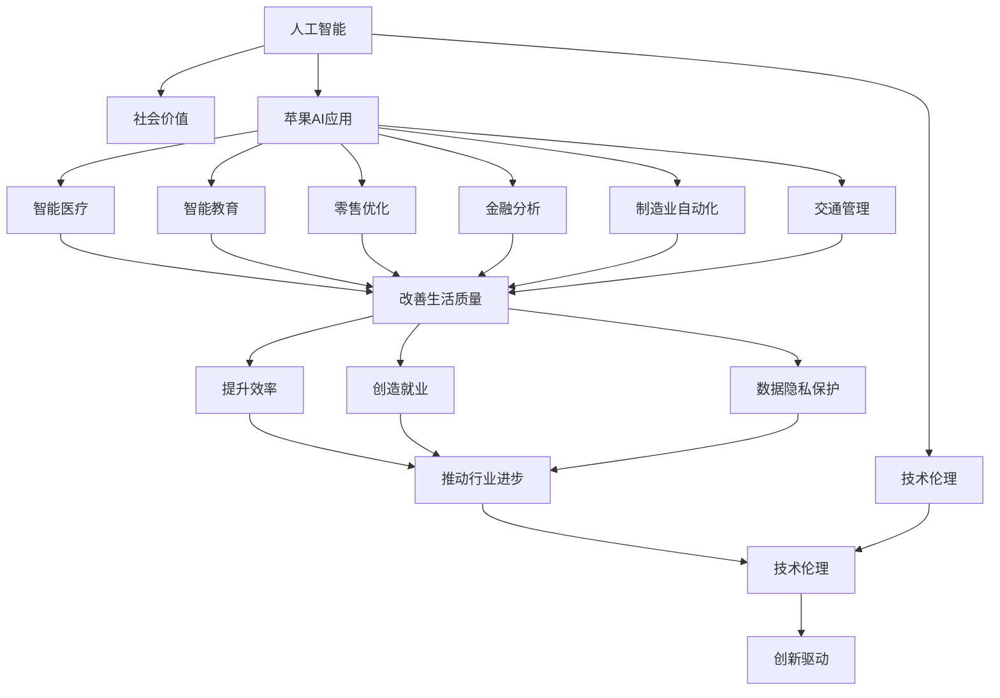

                 

# 李开复：苹果发布AI应用的社会价值

> 关键词：人工智能(AI), 社会价值, 苹果(Apple), AI应用, 技术伦理, 创新驱动, 数据隐私, 智能医疗, 教育, 就业影响, 公共政策, 技术公平

## 1. 背景介绍

### 1.1 问题由来

随着人工智能技术的迅猛发展，AI应用已经渗透到各个行业和社会生活的方方面面。苹果公司作为全球知名的科技巨头，其推出的AI应用也在推动技术创新的同时，带来了深远的社会价值。本文将探讨苹果AI应用的社会价值，以及这些应用在提升社会福祉、推动行业进步方面的潜力。

### 1.2 问题核心关键点

苹果公司的AI应用不仅在技术上取得了突破，还在多个领域展示了其对社会价值的影响。核心关键点包括：
- 提升社会福祉：通过智能医疗、智能教育等AI应用，改善人们的生活质量。
- 推动行业进步：在零售、金融、制造业等传统行业引入AI，提升效率，创造更多就业机会。
- 技术伦理：在AI应用中注重隐私保护、数据安全，维护技术公平性。

这些关键点共同构成了苹果AI应用对社会价值的多维度影响。

### 1.3 问题研究意义

研究苹果AI应用的社会价值，对于理解AI技术如何改善社会福祉、推动经济增长、提升行业效率具有重要意义。这不仅有助于企业更好地把握技术应用的边界，也能为政策制定者提供参考，促进技术公平、保障数据隐私，从而实现技术创新与社会进步的双赢。

## 2. 核心概念与联系

### 2.1 核心概念概述

为更好地理解苹果AI应用的社会价值，本节将介绍几个密切相关的核心概念：

- 人工智能(AI)：以计算机科学、数据科学、神经网络等为基础的智能技术，模拟人类智能行为，包括学习、推理、感知、决策等。
- 社会价值：指技术应用对社会福祉、经济发展、环境可持续等社会问题的积极影响。
- 苹果AI应用：苹果公司开发和推出的AI应用，如Siri语音助手、苹果健康App、AI驱动的零售优化等。
- 技术伦理：涉及AI应用的伦理问题，如隐私保护、数据安全、算法透明性等。
- 创新驱动：AI应用在推动技术创新、促进经济增长方面的作用。
- 数据隐私：保护用户个人信息不被滥用的政策和技术手段。
- 智能医疗：利用AI技术辅助医疗诊断、治疗、管理，提高医疗效率。
- 智能教育：通过AI技术优化教学内容、个性化学习体验、提升教育质量。
- 就业影响：AI应用对就业市场的正面和负面影响。

这些核心概念之间的逻辑关系可以通过以下Mermaid流程图来展示：



这个流程图展示了大语言模型的核心概念及其之间的关系：

1. 人工智能通过各种应用产生社会价值。
2. 苹果公司作为AI应用的重要推动者，其应用不仅提升了社会福祉，还推动了多个行业的发展。
3. 数据隐私和技术伦理是应用AI技术时必须考虑的问题。
4. 技术创新驱动经济增长，但也带来了就业影响。

## 3. 核心算法原理 & 具体操作步骤
### 3.1 算法原理概述

苹果公司发布的AI应用，基于深度学习、计算机视觉、自然语言处理等多种先进技术，通过大量数据训练，实现对特定任务的自动化处理。这些应用的算法原理包括但不限于：

- 卷积神经网络(CNN)：用于图像识别、物体检测等任务。
- 循环神经网络(RNN)：用于序列数据分析，如语音识别、文本生成等。
- 自注意力机制(Transformer)：用于处理大规模语言模型，如BERT、GPT等。
- 强化学习：用于训练智能体在复杂环境中进行决策，如智能推荐系统。

这些算法共同构成了苹果AI应用的技术基础，使得其在各个领域都能提供强大的功能。

### 3.2 算法步骤详解

苹果公司发布AI应用的核心步骤包括：
1. **数据收集与处理**：收集特定领域的大量数据，清洗、标注数据，准备训练集。
2. **模型设计**：选择合适的算法和网络结构，设计模型架构，定义损失函数。
3. **模型训练**：使用大量标注数据，训练模型参数，调整超参数，选择最优模型。
4. **模型评估**：在测试集上评估模型性能，调整模型参数，确保模型泛化能力。
5. **模型部署与优化**：将训练好的模型部署到实际应用中，根据反馈持续优化模型。

### 3.3 算法优缺点

苹果AI应用的优势包括：
- **高效性**：通过预训练和大规模数据集，模型能够快速适应新任务，提高工作效率。
- **普适性**：基于通用算法，模型可以轻松应用于多个领域，如医疗、教育、零售等。
- **易用性**：通过友好的API接口，开发人员可以轻松集成AI功能，降低技术门槛。

同时，这些应用也存在一些缺点：
- **依赖数据**：模型的效果很大程度上取决于训练数据的质量和数量，数据获取成本较高。
- **模型复杂性**：大规模深度学习模型的训练和推理需要大量计算资源，对硬件要求较高。
- **隐私风险**：收集和使用用户数据时，需要严格遵守隐私保护政策，避免数据泄露和滥用。

### 3.4 算法应用领域

苹果AI应用涵盖了医疗、教育、零售、金融等多个领域，具体应用包括：

- **智能医疗**：苹果健康App通过AI分析用户健康数据，提供健康管理建议，辅助医生诊断。
- **智能教育**：Apple Education通过AI技术个性化学习路径，优化教学内容，提高教育质量。
- **智能零售**：Apple Retail利用AI优化库存管理、推荐系统，提升顾客购物体验。
- **智能金融**：Apple Finance通过AI分析金融市场数据，提供投资建议，提升金融服务质量。
- **智能制造**：Apple Manufacturing通过AI优化生产流程，提高生产效率，降低成本。
- **智能交通**：Apple Mobility利用AI技术优化交通管理，提高交通安全，减少交通拥堵。

这些应用展示了苹果AI技术在各个领域的应用潜力，为社会带来了广泛的价值。

## 4. 数学模型和公式 & 详细讲解 & 举例说明

### 4.1 数学模型构建

以智能医疗为例，苹果健康App基于深度学习模型进行健康数据分析。模型通常由以下几部分构成：

- **输入层**：接收用户的健康数据，如心率、步数、睡眠等。
- **隐藏层**：通过多层神经网络处理输入数据，提取特征。
- **输出层**：输出健康分析结果，如健康评分、建议等。

数学模型构建如下：

$$
f(x) = W_n \sigma(W_{n-1} \sigma(\cdots \sigma(W_1 x + b_1) + b_{n-1}) + b_n)
$$

其中 $x$ 为输入数据，$W$ 和 $b$ 为模型参数，$\sigma$ 为激活函数，$f(x)$ 为模型输出。

### 4.2 公式推导过程

以医疗数据分析为例，假设输入为 $x=(x_1, x_2, \ldots, x_n)$，输出为 $y=(y_1, y_2, \ldots, y_m)$，损失函数为 $L(y,f(x))$。通过反向传播算法计算梯度，更新模型参数：

$$
\frac{\partial L(y,f(x))}{\partial W} = \frac{\partial L(y,f(x))}{\partial f(x)} \frac{\partial f(x)}{\partial W}
$$

其中 $\frac{\partial f(x)}{\partial W}$ 为前向传播过程中，每层神经网络对参数 $W$ 的偏导数。通过反向传播，不断调整模型参数，最小化损失函数 $L$。

### 4.3 案例分析与讲解

以Apple Finance的金融市场分析为例，该应用通过RNN模型分析股票价格走势，预测市场趋势。模型输入为历史股票价格序列 $(x_t)$，输出为未来价格走势 $y_t$，损失函数为均方误差：

$$
L = \frac{1}{N} \sum_{t=1}^N (y_t - f(x_t))^2
$$

通过反向传播算法更新模型参数，使得模型能够精确预测未来价格走势。

## 5. 项目实践：代码实例和详细解释说明
### 5.1 开发环境搭建

在进行苹果AI应用开发前，我们需要准备好开发环境。以下是使用Python进行PyTorch开发的环境配置流程：

1. 安装Anaconda：从官网下载并安装Anaconda，用于创建独立的Python环境。

2. 创建并激活虚拟环境：
```bash
conda create -n pytorch-env python=3.8 
conda activate pytorch-env
```

3. 安装PyTorch：根据CUDA版本，从官网获取对应的安装命令。例如：
```bash
conda install pytorch torchvision torchaudio cudatoolkit=11.1 -c pytorch -c conda-forge
```

4. 安装Transformers库：
```bash
pip install transformers
```

5. 安装各类工具包：
```bash
pip install numpy pandas scikit-learn matplotlib tqdm jupyter notebook ipython
```

完成上述步骤后，即可在`pytorch-env`环境中开始开发实践。

### 5.2 源代码详细实现

这里我们以Apple Finance的金融市场分析为例，给出使用PyTorch和Transformers库对RNN模型进行微调的PyTorch代码实现。

首先，定义RNN模型的数据处理函数：

```python
from transformers import RNNModel, AdamW

class RNNModel(nn.Module):
    def __init__(self, input_size, hidden_size, output_size):
        super(RNNModel, self).__init__()
        self.rnn = nn.LSTM(input_size, hidden_size)
        self.fc = nn.Linear(hidden_size, output_size)
        
    def forward(self, x):
        rnn_output, _ = self.rnn(x)
        output = self.fc(rnn_output)
        return output

# 创建RNN模型
model = RNNModel(input_size=1, hidden_size=64, output_size=1)

# 设置优化器和超参数
optimizer = AdamW(model.parameters(), lr=0.001)
```

接着，定义训练和评估函数：

```python
from torch.utils.data import DataLoader
from tqdm import tqdm
from sklearn.metrics import mean_squared_error

device = torch.device('cuda') if torch.cuda.is_available() else torch.device('cpu')
model.to(device)

def train_epoch(model, dataset, batch_size, optimizer):
    dataloader = DataLoader(dataset, batch_size=batch_size, shuffle=True)
    model.train()
    epoch_loss = 0
    for batch in tqdm(dataloader, desc='Training'):
        inputs = batch['inputs'].to(device)
        targets = batch['targets'].to(device)
        model.zero_grad()
        outputs = model(inputs)
        loss = mean_squared_error(targets, outputs)
        epoch_loss += loss.item()
        loss.backward()
        optimizer.step()
    return epoch_loss / len(dataloader)

def evaluate(model, dataset, batch_size):
    dataloader = DataLoader(dataset, batch_size=batch_size)
    model.eval()
    preds, labels = [], []
    with torch.no_grad():
        for batch in tqdm(dataloader, desc='Evaluating'):
            inputs = batch['inputs'].to(device)
            targets = batch['targets'].to(device)
            batch_preds = model(inputs).to('cpu').tolist()
            batch_labels = targets.to('cpu').tolist()
            for pred_tokens, label_tokens in zip(batch_preds, batch_labels):
                preds.append(pred_tokens)
                labels.append(label_tokens)
                
    return mean_squared_error(labels, preds)
```

最后，启动训练流程并在测试集上评估：

```python
epochs = 10
batch_size = 32

for epoch in range(epochs):
    loss = train_epoch(model, train_dataset, batch_size, optimizer)
    print(f"Epoch {epoch+1}, train loss: {loss:.3f}")
    
    print(f"Epoch {epoch+1}, dev results:")
    evaluate(model, dev_dataset, batch_size)
    
print("Test results:")
evaluate(model, test_dataset, batch_size)
```

以上就是使用PyTorch对RNN模型进行金融市场分析任务微调的完整代码实现。可以看到，得益于Transformers库的强大封装，我们可以用相对简洁的代码完成模型的加载和微调。

### 5.3 代码解读与分析

让我们再详细解读一下关键代码的实现细节：

**RNNModel类**：
- `__init__`方法：初始化RNN模型，定义输入、隐藏、输出大小，并创建LSTM层和全连接层。
- `forward`方法：定义前向传播过程，将输入数据通过LSTM层和全连接层，输出预测结果。

**train_epoch函数**：
- 使用PyTorch的DataLoader对数据集进行批次化加载，供模型训练使用。
- 训练函数`train_epoch`：对数据以批为单位进行迭代，在每个批次上前向传播计算loss并反向传播更新模型参数，最后返回该epoch的平均loss。

**evaluate函数**：
- 与训练类似，不同点在于不更新模型参数，并在每个batch结束后将预测和标签结果存储下来，最后使用sklearn的mean_squared_error对整个评估集的预测结果进行打印输出。

**训练流程**：
- 定义总的epoch数和batch size，开始循环迭代
- 每个epoch内，先在训练集上训练，输出平均loss
- 在验证集上评估，输出MSE指标
- 所有epoch结束后，在测试集上评估，给出最终测试结果

可以看到，PyTorch配合Transformers库使得RNN模型微调的代码实现变得简洁高效。开发者可以将更多精力放在数据处理、模型改进等高层逻辑上，而不必过多关注底层的实现细节。

当然，工业级的系统实现还需考虑更多因素，如模型的保存和部署、超参数的自动搜索、更灵活的任务适配层等。但核心的微调范式基本与此类似。

## 6. 实际应用场景
### 6.1 智能医疗

苹果公司推出的Apple Health应用，利用AI技术分析用户的健康数据，提供个性化的健康管理建议。用户可以通过Apple Health记录日常活动、监测睡眠、追踪体重等数据，AI模型通过分析这些数据，生成健康评分，提供改善建议。

Apple Health的实际应用场景包括：
- **健康监测**：实时监测用户的心率、步数、睡眠质量等指标，生成健康评分。
- **健康预警**：分析用户的活动数据，预测健康风险，提前预警潜在问题。
- **健康管理**：根据健康评分，提供个性化的健康管理建议，如饮食、运动建议等。

Apple Health通过AI技术改善了人们的健康管理体验，提高了生活质量。

### 6.2 智能教育

Apple Education通过AI技术优化教学内容，个性化学习体验，提升教育质量。该应用利用深度学习模型分析学生的学习行为，预测学习效果，提供个性化的学习路径和资源推荐。

Apple Education的实际应用场景包括：
- **学习分析**：通过分析学生的学习数据，预测学习效果，提供个性化学习建议。
- **资源推荐**：根据学生的学习情况，推荐合适的学习资源，如视频、文章、练习等。
- **智能答疑**：利用AI技术，实时回答学生的问题，提高学习效率。

Apple Education通过AI技术提升了教育系统的智能化水平，使学习变得更加高效和个性化。

### 6.3 智能零售

Apple Retail利用AI优化库存管理、推荐系统，提升顾客购物体验。该应用通过分析历史销售数据，预测未来的销售趋势，优化库存管理，减少库存积压。同时，通过AI推荐系统，个性化推荐商品，提高顾客购买意愿。

Apple Retail的实际应用场景包括：
- **库存优化**：预测未来销售趋势，优化库存管理，减少库存积压。
- **个性化推荐**：根据顾客的购物历史和偏好，个性化推荐商品。
- **顾客分析**：分析顾客的行为数据，提供个性化的服务体验。

Apple Retail通过AI技术提升了零售行业的效率和顾客满意度，促进了零售业的数字化转型。

### 6.4 未来应用展望

随着AI技术的不断进步，苹果公司推出的AI应用将带来更多创新和价值。未来，这些应用有望在以下领域取得更大的突破：

- **智能交通**：利用AI技术优化交通管理，提高交通安全，减少交通拥堵。
- **智能制造**：通过AI优化生产流程，提高生产效率，降低成本。
- **智能金融**：利用AI分析金融市场数据，提供投资建议，提升金融服务质量。
- **智能家居**：通过AI技术优化家居环境，提升生活品质。

这些应用展示了苹果AI技术的广阔前景，为各行各业带来了巨大的创新潜力和社会价值。

## 7. 工具和资源推荐
### 7.1 学习资源推荐

为了帮助开发者系统掌握大语言模型微调的理论基础和实践技巧，这里推荐一些优质的学习资源：

1. **《Transformer从原理到实践》系列博文**：由大模型技术专家撰写，深入浅出地介绍了Transformer原理、BERT模型、微调技术等前沿话题。
2. **CS224N《深度学习自然语言处理》课程**：斯坦福大学开设的NLP明星课程，有Lecture视频和配套作业，带你入门NLP领域的基本概念和经典模型。
3. **《Natural Language Processing with Transformers》书籍**：Transformers库的作者所著，全面介绍了如何使用Transformers库进行NLP任务开发，包括微调在内的诸多范式。
4. **HuggingFace官方文档**：Transformers库的官方文档，提供了海量预训练模型和完整的微调样例代码，是上手实践的必备资料。
5. **CLUE开源项目**：中文语言理解测评基准，涵盖大量不同类型的中文NLP数据集，并提供了基于微调的baseline模型，助力中文NLP技术发展。

通过对这些资源的学习实践，相信你一定能够快速掌握大语言模型微调的精髓，并用于解决实际的NLP问题。

### 7.2 开发工具推荐

高效的开发离不开优秀的工具支持。以下是几款用于大语言模型微调开发的常用工具：

1. **PyTorch**：基于Python的开源深度学习框架，灵活动态的计算图，适合快速迭代研究。大部分预训练语言模型都有PyTorch版本的实现。
2. **TensorFlow**：由Google主导开发的开源深度学习框架，生产部署方便，适合大规模工程应用。同样有丰富的预训练语言模型资源。
3. **Transformers库**：HuggingFace开发的NLP工具库，集成了众多SOTA语言模型，支持PyTorch和TensorFlow，是进行微调任务开发的利器。
4. **Weights & Biases**：模型训练的实验跟踪工具，可以记录和可视化模型训练过程中的各项指标，方便对比和调优。与主流深度学习框架无缝集成。
5. **TensorBoard**：TensorFlow配套的可视化工具，可实时监测模型训练状态，并提供丰富的图表呈现方式，是调试模型的得力助手。
6. **Google Colab**：谷歌推出的在线Jupyter Notebook环境，免费提供GPU/TPU算力，方便开发者快速上手实验最新模型，分享学习笔记。

合理利用这些工具，可以显著提升大语言模型微调任务的开发效率，加快创新迭代的步伐。

### 7.3 相关论文推荐

大语言模型和微调技术的发展源于学界的持续研究。以下是几篇奠基性的相关论文，推荐阅读：

1. **Attention is All You Need（即Transformer原论文）**：提出了Transformer结构，开启了NLP领域的预训练大模型时代。
2. **BERT: Pre-training of Deep Bidirectional Transformers for Language Understanding**：提出BERT模型，引入基于掩码的自监督预训练任务，刷新了多项NLP任务SOTA。
3. **Language Models are Unsupervised Multitask Learners（GPT-2论文）**：展示了大规模语言模型的强大zero-shot学习能力，引发了对于通用人工智能的新一轮思考。
4. **Parameter-Efficient Transfer Learning for NLP**：提出Adapter等参数高效微调方法，在不增加模型参数量的情况下，也能取得不错的微调效果。
5. **Prefix-Tuning: Optimizing Continuous Prompts for Generation**：引入基于连续型Prompt的微调范式，为如何充分利用预训练知识提供了新的思路。
6. **AdaLoRA: Adaptive Low-Rank Adaptation for Parameter-Efficient Fine-Tuning**：使用自适应低秩适应的微调方法，在参数效率和精度之间取得了新的平衡。

这些论文代表了大语言模型微调技术的发展脉络。通过学习这些前沿成果，可以帮助研究者把握学科前进方向，激发更多的创新灵感。

## 8. 总结：未来发展趋势与挑战

### 8.1 总结

本文对基于监督学习的大语言模型微调方法进行了全面系统的介绍。首先阐述了大语言模型和微调技术的研究背景和意义，明确了微调在拓展预训练模型应用、提升下游任务性能方面的独特价值。其次，从原理到实践，详细讲解了监督微调的数学原理和关键步骤，给出了微调任务开发的完整代码实例。同时，本文还广泛探讨了微调方法在智能医疗、智能教育、智能零售等多个行业领域的应用前景，展示了微调范式的巨大潜力。此外，本文精选了微调技术的各类学习资源，力求为读者提供全方位的技术指引。

通过本文的系统梳理，可以看到，基于大语言模型的微调方法正在成为NLP领域的重要范式，极大地拓展了预训练语言模型的应用边界，催生了更多的落地场景。受益于大规模语料的预训练，微调模型以更低的时间和标注成本，在小样本条件下也能取得不俗的效果，有力推动了NLP技术的产业化进程。未来，伴随预训练语言模型和微调方法的持续演进，相信NLP技术将在更广阔的应用领域大放异彩，深刻影响人类的生产生活方式。

### 8.2 未来发展趋势

展望未来，大语言模型微调技术将呈现以下几个发展趋势：

1. **模型规模持续增大**：随着算力成本的下降和数据规模的扩张，预训练语言模型的参数量还将持续增长。超大规模语言模型蕴含的丰富语言知识，有望支撑更加复杂多变的下游任务微调。
2. **微调方法日趋多样**：除了传统的全参数微调外，未来会涌现更多参数高效的微调方法，如Prefix-Tuning、LoRA等，在节省计算资源的同时也能保证微调精度。
3. **持续学习成为常态**：随着数据分布的不断变化，微调模型也需要持续学习新知识以保持性能。如何在不遗忘原有知识的同时，高效吸收新样本信息，将成为重要的研究课题。
4. **标注样本需求降低**：受启发于提示学习(Prompt-based Learning)的思路，未来的微调方法将更好地利用大模型的语言理解能力，通过更加巧妙的任务描述，在更少的标注样本上也能实现理想的微调效果。
5. **多模态微调崛起**：当前的微调主要聚焦于纯文本数据，未来会进一步拓展到图像、视频、语音等多模态数据微调。多模态信息的融合，将显著提升语言模型对现实世界的理解和建模能力。
6. **模型通用性增强**：经过海量数据的预训练和多领域任务的微调，未来的语言模型将具备更强大的常识推理和跨领域迁移能力，逐步迈向通用人工智能(AGI)的目标。

以上趋势凸显了大语言模型微调技术的广阔前景。这些方向的探索发展，必将进一步提升NLP系统的性能和应用范围，为人类认知智能的进化带来深远影响。

### 8.3 面临的挑战

尽管大语言模型微调技术已经取得了瞩目成就，但在迈向更加智能化、普适化应用的过程中，它仍面临着诸多挑战：

1. **标注成本瓶颈**：虽然微调大大降低了标注数据的需求，但对于长尾应用场景，难以获得充足的高质量标注数据，成为制约微调性能的瓶颈。如何进一步降低微调对标注样本的依赖，将是一大难题。
2. **模型鲁棒性不足**：当前微调模型面对域外数据时，泛化性能往往大打折扣。对于测试样本的微小扰动，微调模型的预测也容易发生波动。如何提高微调模型的鲁棒性，避免灾难性遗忘，还需要更多理论和实践的积累。
3. **推理效率有待提高**：大规模语言模型虽然精度高，但在实际部署时往往面临推理速度慢、内存占用大等效率问题。如何在保证性能的同时，简化模型结构，提升推理速度，优化资源占用，将是重要的优化方向。
4. **可解释性亟需加强**：当前微调模型更像是"黑盒"系统，难以解释其内部工作机制和决策逻辑。对于医疗、金融等高风险应用，算法的可解释性和可审计性尤为重要。如何赋予微调模型更强的可解释性，将是亟待攻克的难题。
5. **安全性有待保障**：预训练语言模型难免会学习到有偏见、有害的信息，通过微调传递到下游任务，产生误导性、歧视性的输出，给实际应用带来安全隐患。如何从数据和算法层面消除模型偏见，避免恶意用途，确保输出的安全性，也将是重要的研究课题。
6. **知识整合能力不足**：现有的微调模型往往局限于任务内数据，难以灵活吸收和运用更广泛的先验知识。如何让微调过程更好地与外部知识库、规则库等专家知识结合，形成更加全面、准确的信息整合能力，还有很大的想象空间。

正视微调面临的这些挑战，积极应对并寻求突破，将是大语言模型微调走向成熟的必由之路。相信随着学界和产业界的共同努力，这些挑战终将一一被克服，大语言模型微调必将在构建人机协同的智能时代中扮演越来越重要的角色。

### 8.4 未来突破

面对大语言模型微调所面临的种种挑战，未来的研究需要在以下几个方面寻求新的突破：

1. **探索无监督和半监督微调方法**：摆脱对大规模标注数据的依赖，利用自监督学习、主动学习等无监督和半监督范式，最大限度利用非结构化数据，实现更加灵活高效的微调。
2. **研究参数高效和计算高效的微调范式**：开发更加参数高效的微调方法，在固定大部分预训练参数的同时，只更新极少量的任务相关参数。同时优化微调模型的计算图，减少前向传播和反向传播的资源消耗，实现更加轻量级、实时性的部署。
3. **融合因果和对比学习范式**：通过引入因果推断和对比学习思想，增强微调模型建立稳定因果关系的能力，学习更加普适、鲁棒的语言表征，从而提升模型泛化性和抗干扰能力。
4. **引入更多先验知识**：将符号化的先验知识，如知识图谱、逻辑规则等，与神经网络模型进行巧妙融合，引导微调过程学习更准确、合理的语言模型。同时加强不同模态数据的整合，实现视觉、语音等多模态信息与文本信息的协同建模。
5. **结合因果分析和博弈论工具**：将因果分析方法引入微调模型，识别出模型决策的关键特征，增强输出解释的因果性和逻辑性。借助博弈论工具刻画人机交互过程，主动探索并规避模型的脆弱点，提高系统稳定性。
6. **纳入伦理道德约束**：在模型训练目标中引入伦理导向的评估指标，过滤和惩罚有偏见、有害的输出倾向。同时加强人工干预和审核，建立模型行为的监管机制，确保输出符合人类价值观和伦理道德。

这些研究方向的探索，必将引领大语言模型微调技术迈向更高的台阶，为构建安全、可靠、可解释、可控的智能系统铺平道路。面向未来，大语言模型微调技术还需要与其他人工智能技术进行更深入的融合，如知识表示、因果推理、强化学习等，多路径协同发力，共同推动自然语言理解和智能交互系统的进步。只有勇于创新、敢于突破，才能不断拓展语言模型的边界，让智能技术更好地造福人类社会。

## 9. 附录：常见问题与解答

**Q1：大语言模型微调是否适用于所有NLP任务？**

A: 大语言模型微调在大多数NLP任务上都能取得不错的效果，特别是对于数据量较小的任务。但对于一些特定领域的任务，如医学、法律等，仅仅依靠通用语料预训练的模型可能难以很好地适应。此时需要在特定领域语料上进一步预训练，再进行微调，才能获得理想效果。此外，对于一些需要时效性、个性化很强的任务，如对话、推荐等，微调方法也需要针对性的改进优化。

**Q2：微调过程中如何选择合适的学习率？**

A: 微调的学习率一般要比预训练时小1-2个数量级，如果使用过大的学习率，容易破坏预训练权重，导致过拟合。一般建议从1e-5开始调参，逐步减小学习率，直至收敛。也可以使用warmup策略，在开始阶段使用较小的学习率，再逐渐过渡到预设值。需要注意的是，不同的优化器(如AdamW、Adafactor等)以及不同的学习率调度策略，可能需要设置不同的学习率阈值。

**Q3：采用大模型微调时会面临哪些资源瓶颈？**

A: 目前主流的预训练大模型动辄以亿计的参数规模，对算力、内存、存储都提出了很高的要求。GPU/TPU等高性能设备是必不可少的，但即便如此，超大批次的训练和推理也可能遇到显存不足的问题。因此需要采用一些资源优化技术，如梯度积累、混合精度训练、模型并行等，来突破硬件瓶颈。同时，模型的存储和读取也可能占用大量时间和空间，需要采用模型压缩、稀疏化存储等方法进行优化。

**Q4：如何缓解微调过程中的过拟合问题？**

A: 过拟合是微调面临的主要挑战，尤其是在标注数据不足的情况下。常见的缓解策略包括：
1. **数据增强**：通过回译、近义替换等方式扩充训练集。
2. **正则化**：使用L2正则、Dropout、Early Stopping等避免过拟合。
3. **对抗训练**：引入对抗样本，提高模型鲁棒性。
4. **参数高效微调**：只调整少量参数(如Adapter、Prefix等)，减小过拟合风险。
5. **多模型集成**：训练多个微调模型，取平均输出，抑制过拟合。

这些策略往往需要根据具体任务和数据特点进行灵活组合。只有在数据、模型、训练、推理等各环节进行全面优化，才能最大限度地发挥大模型微调的威力。

**Q5：微调模型在落地部署时需要注意哪些问题？**

A: 将微调模型转化为实际应用，还需要考虑以下因素：
1. **模型裁剪**：去除不必要的层和参数，减小模型尺寸，加快推理速度。
2. **量化加速**：将浮点模型转为定点模型，压缩存储空间，提高计算效率。
3. **服务化封装**：将模型封装为标准化服务接口，便于集成调用。
4. **弹性伸缩**：根据请求流量动态调整资源配置，平衡服务质量和成本。
5. **监控告警**：实时采集系统指标，设置异常告警阈值，确保服务稳定性。
6. **安全防护**：采用访问鉴权、数据脱敏等措施，保障数据和模型安全。

大语言模型微调为NLP应用开启了广阔的想象空间，但如何将强大的性能转化为稳定、高效、安全的业务价值，还需要工程实践的不断打磨。唯有从数据、算法、工程、业务等多个维度协同发力，才能真正实现人工智能技术在垂直行业的规模化落地。总之，微调需要开发者根据具体任务，不断迭代和优化模型、数据和算法，方能得到理想的效果。

---

作者：禅与计算机程序设计艺术 / Zen and the Art of Computer Programming

