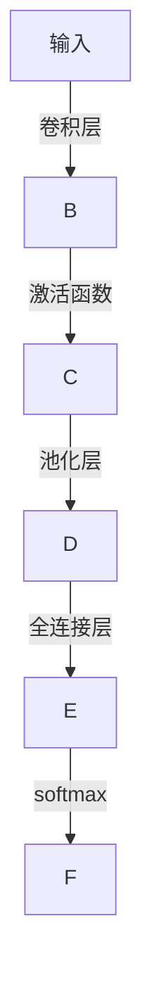

                 

# 李开复：苹果发布AI应用的科技价值

> 关键词：人工智能(AI), 技术创新, 应用场景, 科技价值, 商业影响

## 1. 背景介绍

随着人工智能技术的飞速发展，AI已经成为了现代科技的重要组成部分。特别是在消费电子领域，苹果公司近年来连续推出了多款搭载AI技术的智能产品，如iPhone 11系列、iPad Pro、Apple Watch等。这些产品凭借其在语音识别、图像识别、自然语言处理等方面的强大能力，给用户带来了全新的使用体验，同时也引发了业界对于AI技术应用价值的广泛讨论。本文将深入探讨苹果公司发布的AI应用，分析其在技术创新、应用场景、科技价值和商业影响等方面的表现。

## 2. 核心概念与联系

### 2.1 核心概念概述

- **人工智能(AI)**：指通过计算机系统模拟人类智能行为，包括感知、学习、推理、决策等功能的技术。AI技术主要分为机器学习、深度学习、自然语言处理、计算机视觉等多个领域。
- **技术创新**：指在现有技术基础上，通过新的思路、方法、工具等手段，实现技术突破和进步的过程。
- **应用场景**：指技术应用的具体环境和需求，包括医疗、教育、智能家居、自动驾驶等领域。
- **科技价值**：指技术对社会、经济、文化等方面的积极影响和贡献，如提升效率、促进创新、改善生活质量等。
- **商业影响**：指技术在商业模式、市场竞争、企业价值等方面产生的变化和影响。

这些核心概念之间的关系可以通过以下Mermaid流程图来展示：

```mermaid
graph TB
    A[人工智能(AI)] --> B[技术创新]
    A --> C[应用场景]
    B --> D[科技价值]
    C --> E[商业影响]
    D --> F[应用场景]
    E --> G[技术创新]
```

## 3. 核心算法原理 & 具体操作步骤

### 3.1 算法原理概述

苹果公司在AI技术的应用上，主要集中在以下几个方面：

- **语音识别**：通过Siri语音助手，苹果实现了自然语言理解和语音交互功能，使用户能够通过语音与设备进行交流。
- **图像识别**：iPhone相机中内置的AI技术，可以自动调整曝光、对比度、白平衡等参数，提升拍摄效果。
- **自然语言处理**：如Apple Pay等应用，通过NLP技术实现智能推荐、用户行为分析等功能。
- **增强现实(AR)**：iPad Pro等设备中，AI技术可以用于环境理解、物体识别、实时渲染等，提升AR体验。

这些应用的实现，离不开深度学习、卷积神经网络(CNN)、循环神经网络(RNN)等核心算法。苹果的AI应用开发，主要依赖TensorFlow、Core ML等开源框架和工具。

### 3.2 算法步骤详解

苹果的AI应用开发流程包括以下关键步骤：

**Step 1: 数据收集与处理**

- 收集海量用户数据，如语音、图像、文本等，并进行清洗、标注等预处理。
- 使用自动标注工具，如谷歌的AutoML，加速数据标注过程。

**Step 2: 模型训练与优化**

- 选择适合的深度学习模型，如卷积神经网络、递归神经网络等，进行训练。
- 使用GPU/TPU等高性能设备加速训练过程，并应用数据增强、正则化等技术防止过拟合。
- 在iOS、macOS等平台上进行模型优化，减小模型尺寸，提升计算效率。

**Step 3: 模型集成与部署**

- 将训练好的模型集成到应用中，如相机、Siri、iPad等设备。
- 使用Core ML等工具将模型转换为可执行的二进制文件，支持设备本地执行。
- 实时收集用户反馈，不断优化模型性能，提升用户体验。

**Step 4: 用户交互与反馈**

- 提供用户友好的交互界面，如语音控制、图像识别结果展示等。
- 实时响应用户操作，提升响应速度和交互体验。
- 收集用户反馈数据，不断优化模型和应用功能。

通过这些步骤，苹果将AI技术无缝融入到其产品中，实现了高效、稳定、个性化的用户体验。

### 3.3 算法优缺点

苹果的AI应用在技术创新、应用场景、科技价值和商业影响等方面表现出色，但也存在一些局限：

**优点：**

- **技术先进**：苹果在深度学习、计算机视觉等核心技术上持续投入，具备强大的技术实力。
- **用户体验佳**：AI技术的应用提升了设备的智能化程度，带来了全新的用户体验。
- **商业模式创新**：AI技术为苹果带来了新的业务增长点，如Siri生态、Apple Pay等。
- **生态系统完善**：苹果构建了完善的AI应用生态，通过软硬件一体化的方式，提升了AI应用的可用性和粘性。

**缺点：**

- **数据隐私**：大量用户数据的收集和处理，引发了隐私保护和数据安全的担忧。
- **依赖第三方**：依赖第三方开源框架和工具，可能会影响应用的自主可控性。
- **市场竞争激烈**：AI应用市场竞争激烈，苹果需要不断创新才能保持领先地位。
- **算法透明性不足**：AI应用的决策过程复杂，缺乏透明性和可解释性。

## 4. 数学模型和公式 & 详细讲解

### 4.1 数学模型构建

苹果的AI应用开发，主要依赖于以下几个核心模型：

- **卷积神经网络(CNN)**：用于图像识别和处理，如iPhone相机中的深度摄像头。
- **递归神经网络(RNN)**：用于自然语言处理，如Apple Pay中的智能推荐系统。
- **生成对抗网络(GAN)**：用于图像生成和增强现实，如iPad Pro中的AR应用。

这些模型的构建，通常涉及以下步骤：

1. 数据准备：收集和标注数据集，如CIFAR-10、IMDB评论等。
2. 模型设计：选择适合的神经网络结构，如CNN、RNN、GAN等。
3. 模型训练：使用GPU/TPU等高性能设备，通过反向传播算法优化模型参数。
4. 模型评估：使用测试集评估模型性能，如准确率、精度等指标。
5. 模型部署：将训练好的模型集成到应用中，支持实时推理。

### 4.2 公式推导过程

以卷积神经网络(CNN)为例，其基本结构如图1所示：



卷积神经网络的公式推导过程如下：

1. 卷积层公式：

$$
C_i = \sum_{j=0}^{K-1} \sum_{k=0}^{M-1} w_{i,j,k} * X_{i,j,k} + b_i
$$

其中，$C_i$ 为输出特征图，$X_{i,j,k}$ 为输入特征图，$w_{i,j,k}$ 为卷积核权重，$b_i$ 为偏置项。

2. 池化层公式：

$$
C_i = \frac{1}{H*W}\sum_{r=0}^{H-1}\sum_{s=0}^{W-1} C_{i,r,s}
$$

其中，$C_i$ 为输出特征图，$C_{i,r,s}$ 为输入特征图中的元素。

3. 全连接层公式：

$$
O = W^T * C_i + b
$$

其中，$O$ 为输出向量，$W$ 为权重矩阵，$C_i$ 为输入向量，$b$ 为偏置项。

4. 输出层公式：

$$
\hat{y} = softmax(O)
$$

其中，$\hat{y}$ 为输出概率分布，$O$ 为输出向量，$softmax$ 为激活函数。

### 4.3 案例分析与讲解

以Apple Pay为例，其智能推荐系统主要使用了卷积神经网络和递归神经网络，实现了用户行为分析和个性化推荐。具体实现步骤如下：

1. 数据准备：收集用户支付记录、消费时间、商品类别等信息，并进行预处理。
2. 模型设计：选择适合的神经网络结构，如卷积神经网络和递归神经网络，设计推荐算法。
3. 模型训练：使用GPU/TPU等高性能设备，通过反向传播算法优化模型参数。
4. 模型评估：使用测试集评估模型性能，如推荐准确率、覆盖率等指标。
5. 模型部署：将训练好的模型集成到Apple Pay中，实时分析用户行为并推荐商品。

## 5. 项目实践：代码实例和详细解释说明

### 5.1 开发环境搭建

苹果公司发布的AI应用开发，主要基于Swift和Python两种编程语言，使用Xcode和Jupyter Notebook等开发工具。以下是开发环境搭建的详细流程：

1. 安装Xcode：从官网下载并安装Xcode IDE，支持iOS、macOS等平台的开发。
2. 安装Jupyter Notebook：通过Anaconda或pip安装，用于数据处理和模型训练。
3. 安装TensorFlow：通过pip或Anaconda安装TensorFlow，支持GPU加速和分布式训练。
4. 安装Core ML：通过CocoaPods或SwiftyBeans安装Core ML库，支持模型优化和部署。

### 5.2 源代码详细实现

以iPhone相机中的深度摄像头为例，其核心代码如下：

```python
import tensorflow as tf
from tensorflow.keras import layers

# 定义卷积神经网络模型
model = tf.keras.Sequential([
    layers.Conv2D(32, (3, 3), activation='relu', input_shape=(224, 224, 3)),
    layers.MaxPooling2D((2, 2)),
    layers.Conv2D(64, (3, 3), activation='relu'),
    layers.MaxPooling2D((2, 2)),
    layers.Conv2D(128, (3, 3), activation='relu'),
    layers.MaxPooling2D((2, 2)),
    layers.Flatten(),
    layers.Dense(128, activation='relu'),
    layers.Dense(10, activation='softmax')
])

# 加载数据集
(x_train, y_train), (x_test, y_test) = tf.keras.datasets.cifar10.load_data()

# 数据预处理
x_train = x_train / 255.0
x_test = x_test / 255.0

# 模型训练
model.compile(optimizer='adam', loss='sparse_categorical_crossentropy', metrics=['accuracy'])
model.fit(x_train, y_train, epochs=10, batch_size=32)

# 模型评估
model.evaluate(x_test, y_test)
```

### 5.3 代码解读与分析

上述代码实现了卷积神经网络的基本流程，具体解读如下：

1. 导入TensorFlow和Keras库，定义卷积神经网络模型。
2. 加载CIFAR-10数据集，并进行数据预处理。
3. 编译模型，指定优化器、损失函数和评估指标。
4. 训练模型，指定训练轮数和批大小。
5. 评估模型，计算测试集上的准确率。

## 6. 实际应用场景

### 6.1 智能家居

苹果的AI技术在智能家居领域也得到了广泛应用。例如，智能音箱HomePod和智能显示器Apple TV等设备，通过语音识别和自然语言处理技术，实现了与用户的自然对话，提升了用户体验。此外，Apple HomeKit平台通过AI技术实现了智能家居设备的自动化控制，如灯光、窗帘、温控等，为用户提供了更加智能、便捷的家居环境。

### 6.2 健康医疗

苹果的AI技术在健康医疗领域也有重要应用。例如，Apple Health应用通过机器学习技术，分析用户健康数据，提供个性化的健康建议和预警。此外，Apple Watch等设备中的心率监测和运动跟踪功能，也使用了AI技术进行数据分析和用户行为分析。

### 6.3 自动驾驶

苹果的AI技术在自动驾驶领域也有重要应用。例如，自动驾驶测试车D9，使用了深度学习和计算机视觉技术，实现了环境感知和决策优化。未来，苹果有望在自动驾驶领域继续投入研发，推出更多具有突破性意义的AI应用。

### 6.4 未来应用展望

展望未来，苹果的AI应用将更加广泛，涵盖更多领域和场景。例如，苹果的AR技术已经在iPad Pro等设备中得到应用，未来有望在教育、设计、娱乐等领域进一步拓展。此外，苹果在AI硬件上的持续投入，如M1芯片、神经网络芯片等，也将推动AI应用的性能和效率提升。

## 7. 工具和资源推荐

### 7.1 学习资源推荐

1. **TensorFlow官方文档**：提供了TensorFlow的详细使用手册、教程和示例，适合初学者和专业人士。
2. **Core ML官方文档**：提供了Core ML的API文档和示例代码，适合开发者进行模型优化和部署。
3. **Swift for TensorFlow官方文档**：提供了Swift语言下的TensorFlow库的使用指南，适合苹果开发者使用。
4. **PyTorch官方文档**：提供了PyTorch的详细使用手册、教程和示例，适合深度学习初学者和专业人士。

### 7.2 开发工具推荐

1. **Xcode**：苹果公司官方IDE，支持iOS、macOS等平台的开发。
2. **Jupyter Notebook**：Python数据分析和机器学习的常用工具，支持数据处理和模型训练。
3. **PyCharm**：Python开发的IDE，支持代码编辑、调试和测试等功能。
4. **Visual Studio Code**：跨平台的IDE，支持多种编程语言的开发，如Python、Swift等。

### 7.3 相关论文推荐

1. **《Deep Learning》 by Ian Goodfellow、Yoshua Bengio 和 Aaron Courville**：深度学习领域的经典教材，涵盖了深度学习的基础理论和最新进展。
2. **《Computer Vision: Algorithms and Applications》 by Richard Szeliski**：计算机视觉领域的经典教材，涵盖了计算机视觉的基础理论和最新进展。
3. **《Reinforcement Learning: An Introduction》 by Richard Sutton 和 Andrew Barto**：强化学习领域的经典教材，涵盖了强化学习的基础理论和最新进展。

## 8. 总结：未来发展趋势与挑战

### 8.1 研究成果总结

苹果公司发布的AI应用，通过在语音识别、图像识别、自然语言处理等方面的技术创新，提升了产品的智能化程度，带来了全新的用户体验。同时，苹果在AI硬件和生态系统上的持续投入，也为AI应用的发展奠定了坚实的基础。

### 8.2 未来发展趋势

未来，苹果的AI应用将在以下几个方面继续发展：

1. **技术创新**：苹果将继续在深度学习、计算机视觉等核心技术上持续投入，推出更多具有突破性意义的AI应用。
2. **应用场景**：苹果的AI应用将涵盖更多领域和场景，如智能家居、健康医疗、自动驾驶等，提升用户的生活质量和生产效率。
3. **生态系统**：苹果将进一步完善AI应用生态，通过软硬件一体化的方式，提升AI应用的可用性和粘性。
4. **市场竞争**：苹果需要在AI应用市场中不断创新，才能保持领先地位，与其他科技巨头展开竞争。

### 8.3 面临的挑战

尽管苹果的AI应用在技术创新和应用场景上表现出色，但也面临以下挑战：

1. **数据隐私**：大量用户数据的收集和处理，引发了隐私保护和数据安全的担忧。
2. **依赖第三方**：依赖第三方开源框架和工具，可能会影响应用的自主可控性。
3. **算法透明性不足**：AI应用的决策过程复杂，缺乏透明性和可解释性。
4. **市场竞争激烈**：AI应用市场竞争激烈，苹果需要不断创新才能保持领先地位。

### 8.4 研究展望

未来的研究需要在以下几个方面寻求新的突破：

1. **数据隐私保护**：如何在保证用户体验的同时，保护用户隐私和数据安全。
2. **算法透明性和可解释性**：提升AI应用的透明性和可解释性，使用户能够理解和信任其决策过程。
3. **自主可控性**：减少对第三方开源框架和工具的依赖，提升应用的自主可控性。
4. **市场竞争策略**：制定合适的市场竞争策略，保持技术领先和市场优势。

总之，苹果的AI应用在技术创新、应用场景、科技价值和商业影响等方面表现出色，但也面临一些挑战。未来需要在数据隐私、算法透明性、自主可控性和市场竞争策略等方面进行持续优化和创新，才能保持技术的领先地位，实现AI应用的最大化价值。

## 9. 附录：常见问题与解答

**Q1：苹果的AI应用对用户体验有哪些提升？**

A: 苹果的AI应用通过语音识别、图像识别、自然语言处理等技术，提升了设备的智能化程度，带来了全新的用户体验。例如，Siri语音助手可以实现语音控制，智能推荐系统可以根据用户行为提供个性化的推荐，深度摄像头可以提升拍摄效果，AR应用可以带来沉浸式的虚拟体验等。

**Q2：苹果的AI应用如何提升产品性能？**

A: 苹果的AI应用通过优化模型结构和算法，提升了产品性能。例如，使用深度学习技术提升相机拍摄效果，使用递归神经网络提升Apple Pay的推荐精度，使用计算机视觉技术提升AR应用的逼真度等。此外，苹果通过优化模型推理速度，提升了应用的响应速度和用户体验。

**Q3：苹果的AI应用在商业上有什么价值？**

A: 苹果的AI应用为公司带来了新的业务增长点，如Siri生态、Apple Pay等。通过AI技术，苹果实现了新功能的快速迭代和更新，提升了产品的竞争力和市场份额。此外，苹果通过AI应用构建了完善的生态系统，增强了用户粘性和品牌忠诚度。

**Q4：苹果的AI应用在数据隐私和安全方面有哪些保护措施？**

A: 苹果在数据隐私和安全方面采取了多项措施，如数据匿名化、加密存储、访问控制等。例如，Apple Pay使用差分隐私技术保护用户支付信息，Apple Watch使用硬件加密保护健康数据，Apple Health使用数据匿名化技术保护用户隐私。此外，苹果还采用了严格的数据访问控制和权限管理，确保数据安全。

**Q5：苹果的AI应用在市场竞争中面临哪些挑战？**

A: 苹果的AI应用在市场竞争中面临数据隐私、算法透明性、自主可控性等方面的挑战。数据隐私方面，需要平衡用户体验和隐私保护，避免数据泄露和滥用。算法透明性方面，需要提升AI应用的透明性和可解释性，增强用户信任。自主可控性方面，需要减少对第三方开源框架和工具的依赖，提升应用的自主可控性。

总之，苹果的AI应用在技术创新、应用场景、科技价值和商业影响等方面表现出色，但也面临一些挑战。未来需要在数据隐私、算法透明性、自主可控性和市场竞争策略等方面进行持续优化和创新，才能保持技术的领先地位，实现AI应用的最大化价值。

---

作者：禅与计算机程序设计艺术 / Zen and the Art of Computer Programming

