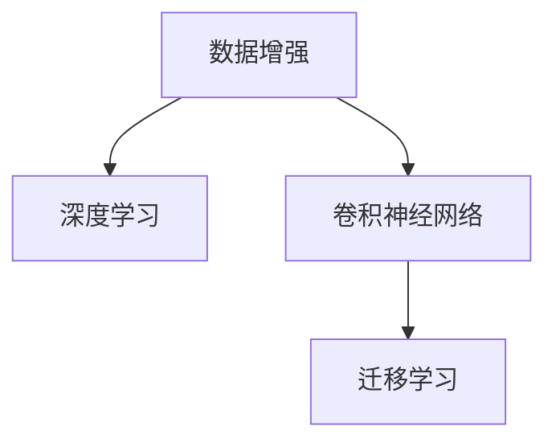

                 

# 李飞飞与ImageNet的故事

在AI的历史长河中，有一位女性科学家，她以其独特的研究视角和不懈的探索精神，推动了计算机视觉的巨大进步。李飞飞，一位来自中国的AI先驱，以其在ImageNet上的开创性工作，为全世界的计算机视觉研究打开了新的大门。本文将带您走进李飞飞与ImageNet的故事，深入探索这项工作的原理、实现细节及其对未来的深远影响。

## 1. 背景介绍

### 1.1 李飞飞及其成就

李飞飞，博士毕业于美国斯坦福大学，她的研究方向包括计算机视觉、人工智能和机器学习。在她的职业生涯中，她不仅开创了多个计算机视觉领域的里程碑，还创立了ImageNet，这个数据集极大地推动了计算机视觉技术的发展，使机器学习领域取得了革命性的进展。

### 1.2 ImageNet的诞生与重要性

ImageNet是一个大规模的图像数据集，包含数百万张带有标签的高分辨率图片。它涵盖了1000个不同的物体类别，是计算机视觉研究者们最为常用和信赖的数据集之一。ImageNet的创立，为深度学习中的视觉任务（如图像分类、目标检测、语义分割等）提供了丰富的训练数据，极大地推动了计算机视觉技术的发展。

## 2. 核心概念与联系

### 2.1 核心概念概述

为更好地理解李飞飞与ImageNet的故事，本节将介绍几个密切相关的核心概念：

- **数据增强(Data Augmentation)**：通过对训练数据进行各种变换（如旋转、翻转、裁剪等），以扩充数据集的多样性，提高模型的泛化能力。
- **深度学习(Deep Learning)**：一种基于神经网络的机器学习方法，通过多层非线性变换，从数据中自动提取特征，用于分类、预测等任务。
- **卷积神经网络(Convolutional Neural Networks, CNNs)**：一种专门用于处理图像数据的深度学习模型，通过卷积层、池化层等结构，提取图像的局部特征。
- **迁移学习(Transfer Learning)**：将一个领域学到的知识，迁移到另一个相关领域的应用中，以减少从头训练的需求，提高模型训练的效率和性能。

这些概念之间的逻辑关系可以通过以下Mermaid流程图来展示：



这个流程图展示了大规模图像数据集对深度学习的影响过程：

1. 通过数据增强扩充数据集的多样性。
2. 深度学习利用CNNs等模型，从数据中提取特征。
3. 迁移学习使知识从一个领域迁移到另一个领域。

## 3. 核心算法原理 & 具体操作步骤

### 3.1 算法原理概述

ImageNet的训练过程基于深度学习，特别是卷积神经网络（CNNs）。在训练过程中，使用大规模数据集（ImageNet），通过反向传播算法更新网络参数，以最小化预测与真实标签之间的误差。最终目标是通过训练得到一个新的神经网络，能够高效准确地对图像进行分类。

### 3.2 算法步骤详解

ImageNet的训练过程主要分为以下几个步骤：

1. **数据准备**：收集和预处理ImageNet数据集。包括数据清洗、标注、数据增强等。
2. **模型选择**：选择适当的卷积神经网络模型作为初始化模型，如LeNet、AlexNet、VGG、ResNet等。
3. **损失函数选择**：通常使用交叉熵损失函数来衡量模型预测与真实标签之间的差距。
4. **优化器选择**：常用的优化器包括SGD、Adam等，设置学习率、批大小、迭代轮数等。
5. **训练流程**：
    - 加载数据集并进行批处理。
    - 前向传播计算损失函数。
    - 反向传播更新模型参数。
    - 周期性在验证集上评估模型性能。
    - 重复上述步骤直至满足预设的迭代轮数或Early Stopping条件。

### 3.3 算法优缺点

ImageNet的数据集和训练方法带来了以下优点：

- **大规模数据**：ImageNet包含数百万张图片，丰富的数据集能够帮助模型更好地学习特征，提高泛化能力。
- **高质量标注**：ImageNet的标注数据经过严格审核，标注质量高，有助于提高模型的准确性。
- **迁移学习**：ImageNet训练得到的模型可以作为迁移学习的基础，可以迁移到其他领域。

同时，它也存在一些缺点：

- **训练时间长**：大规模数据集和复杂模型导致训练时间长，需要大量的计算资源。
- **标注成本高**：高质量的标注数据需要大量的人力物力，成本较高。
- **模型复杂度高**：复杂的模型结构增加了理解和调试的难度。

### 3.4 算法应用领域

ImageNet的训练方法和数据集在计算机视觉领域得到了广泛应用，具体包括：

- **图像分类**：如识别图像中的物体类别，并进行分类。
- **目标检测**：在图像中识别出物体的位置，并进行分类。
- **语义分割**：将图像分割成不同区域，每个区域代表不同的语义。
- **姿态估计**：在图像中估计物体的姿态信息。

此外，ImageNet的训练方法和数据集也对其他领域产生了深远影响，如自动驾驶、医疗影像分析等。

## 4. 数学模型和公式 & 详细讲解 & 举例说明

### 4.1 数学模型构建

ImageNet的训练模型通常使用卷积神经网络（CNNs），其基本结构包括卷积层、池化层和全连接层。以下是CNNs的基本结构：

$$
f(x) = W^4 \sigma(W^3 \sigma(W^2 \sigma(W^1 x) + b^1) + b^2) + b^3
$$

其中 $x$ 为输入数据，$W$ 为卷积核，$b$ 为偏置项，$\sigma$ 为激活函数，$\sigma$ 通常使用ReLU函数。

### 4.2 公式推导过程

以卷积层为例，其基本公式为：

$$
f(x) = \max(0, W*x + b)
$$

其中 $W$ 为卷积核，$x$ 为输入数据，$b$ 为偏置项，$\max(0, \cdot)$ 为ReLU激活函数。

对于池化层，通常使用最大池化（Max Pooling）或平均池化（Average Pooling），公式为：

$$
f(x) = \max(\frac{f(x[i:i+w, j:j+h])}{w*h})
$$

其中 $x[i:i+w, j:j+h]$ 表示池化窗口内的数据，$w$ 和 $h$ 分别为窗口的宽和高。

### 4.3 案例分析与讲解

以AlexNet为例，AlexNet包含5个卷积层、3个全连接层，最终输出1000个类别的概率。其模型结构如图：

```
                             (5x5)
              (5x5)                    (3x3)
(5x5)             (3x3)      (3x3)      (3x3)
     (5x5)            (3x3)      (3x3)      (3x3)
         (3x3)          (3x3)      (3x3)      (3x3)
             (3x3)          (3x3)      (3x3)
                 (3x3)          (3x3)
                     3x3
```

AlexNet在ImageNet数据集上进行了训练，最终在ImageNet 2012竞赛中取得了显著的性能提升。

## 5. 项目实践：代码实例和详细解释说明

### 5.1 开发环境搭建

在实践ImageNet训练时，我们需要安装TensorFlow或PyTorch等深度学习框架。以下是安装TensorFlow的命令：

```bash
pip install tensorflow
```

### 5.2 源代码详细实现

以下是一个简单的ImageNet分类器的代码实现：

```python
import tensorflow as tf
from tensorflow.keras import layers, models

# 定义模型结构
model = models.Sequential([
    layers.Conv2D(64, (3, 3), activation='relu', input_shape=(224, 224, 3)),
    layers.MaxPooling2D((2, 2)),
    layers.Conv2D(128, (3, 3), activation='relu'),
    layers.MaxPooling2D((2, 2)),
    layers.Conv2D(256, (3, 3), activation='relu'),
    layers.MaxPooling2D((2, 2)),
    layers.Conv2D(256, (3, 3), activation='relu'),
    layers.MaxPooling2D((2, 2)),
    layers.Conv2D(256, (3, 3), activation='relu'),
    layers.MaxPooling2D((2, 2)),
    layers.Flatten(),
    layers.Dense(1000, activation='softmax')
])

# 编译模型
model.compile(optimizer='adam', loss='categorical_crossentropy', metrics=['accuracy'])

# 训练模型
model.fit(train_data, train_labels, epochs=10, validation_data=(val_data, val_labels))
```

### 5.3 代码解读与分析

- **定义模型结构**：使用Sequential模型，定义了5个卷积层和2个全连接层。
- **编译模型**：选择Adam优化器和交叉熵损失函数，训练过程中使用准确率作为评价指标。
- **训练模型**：使用fit函数进行模型训练，指定训练数据、标签和训练轮数。

### 5.4 运行结果展示

训练完成后，可以使用以下代码评估模型性能：

```python
test_loss, test_acc = model.evaluate(test_data, test_labels)
print('Test accuracy:', test_acc)
```

## 6. 实际应用场景

### 6.1 图像分类

ImageNet分类器可以广泛应用于图像分类任务，如识别图片中的物体类别。例如，在医疗影像分析中，可以通过训练模型识别不同疾病的影像，帮助医生进行诊断。

### 6.2 目标检测

目标检测是计算机视觉中一个重要的任务，ImageNet模型也可以用于目标检测。例如，在自动驾驶中，可以训练模型检测道路上的车辆、行人等，帮助车辆做出相应的决策。

### 6.3 语义分割

语义分割是将图像分割成不同区域，每个区域代表不同的语义。例如，在医学影像分析中，可以训练模型分割肿瘤区域，帮助医生更准确地诊断病情。

## 7. 工具和资源推荐

### 7.1 学习资源推荐

为了更好地掌握ImageNet的训练方法和原理，以下是一些推荐的学习资源：

- **CS231n：卷积神经网络课程**：斯坦福大学开设的计算机视觉课程，涵盖了深度学习的基础和ImageNet的训练方法。
- **《深度学习》书籍**：Ian Goodfellow等人所著，是深度学习领域的经典教材，详细介绍了卷积神经网络和ImageNet的训练方法。
- **TensorFlow官方文档**：提供了详细的API文档和示例代码，是学习TensorFlow的重要资源。

### 7.2 开发工具推荐

在开发ImageNet训练模型时，以下工具是非常有用的：

- **Jupyter Notebook**：轻量级的交互式编程环境，适合进行实验和调试。
- **Google Colab**：谷歌提供的云平台，免费提供GPU/TPU算力，适合进行大规模深度学习实验。
- **GitHub**：代码托管平台，可以方便地进行版本控制和协作开发。

### 7.3 相关论文推荐

以下是几篇ImageNet训练方法的经典论文，推荐阅读：

- **ImageNet Classification with Deep Convolutional Neural Networks**：AlexNet的训练方法，详细介绍了ImageNet的训练过程。
- **Very Deep Convolutional Networks for Large-Scale Image Recognition**：VGGNet的训练方法，提出了更深的卷积神经网络结构。
- **Rethinking the Inception Architecture for Computer Vision**：InceptionNet的训练方法，引入了1x1卷积核来提高模型效率。
- **Identity Mappings in Deep Residual Networks**：ResNet的训练方法，提出了残差连接（Residual Connections）来解决梯度消失问题。

## 8. 总结：未来发展趋势与挑战

### 8.1 总结

本文对ImageNet的训练方法和应用进行了全面系统的介绍。李飞飞和她的团队通过在ImageNet上训练大规模卷积神经网络，极大地推动了计算机视觉技术的发展，并催生了迁移学习、数据增强等重要技术。通过本文的系统梳理，可以看到ImageNet在计算机视觉领域的深远影响。

### 8.2 未来发展趋势

展望未来，ImageNet和其训练方法将在以下几个方向进一步发展：

1. **大规模数据集**：随着计算资源的增加，未来可能会出现更大的数据集，进一步提升模型的泛化能力。
2. **迁移学习**：迁移学习将在更多领域得到应用，如医疗影像、自动驾驶等，推动技术在不同领域的落地。
3. **迁移学习**：迁移学习将在更多领域得到应用，如医疗影像、自动驾驶等，推动技术在不同领域的落地。
4. **数据增强**：数据增强技术将继续被优化，以进一步提升模型的泛化能力。
5. **模型架构**：更高效、更轻量级的模型结构将不断涌现，降低计算资源的需求。
6. **模型压缩**：通过模型压缩技术，减小模型体积，提高模型的部署效率。

以上趋势凸显了ImageNet和其训练方法的广阔前景。这些方向的探索发展，必将进一步提升计算机视觉系统的性能和应用范围，为人类社会带来更多的便利和创新。

### 8.3 面临的挑战

尽管ImageNet和其训练方法已经取得了巨大的成功，但在迈向更加智能化、普适化应用的过程中，它仍面临着诸多挑战：

1. **标注数据获取**：大规模标注数据的获取成本高，难以覆盖所有场景。
2. **模型可解释性**：深度学习模型通常被视为"黑盒"，难以解释其内部工作机制。
3. **计算资源消耗**：大规模模型的训练和推理需要大量的计算资源，难以普及。
4. **数据隐私**：大规模数据集的隐私保护问题需要重视。
5. **伦理道德**：模型的伦理道德问题，如偏见、歧视等，需要进一步研究和解决。

### 8.4 研究展望

面对ImageNet和其训练方法面临的这些挑战，未来的研究需要在以下几个方面寻求新的突破：

1. **无监督学习**：探索无监督学习范式，摆脱对大规模标注数据的依赖，提高模型的鲁棒性和泛化能力。
2. **模型压缩**：开发更高效、更轻量级的模型压缩技术，降低计算资源的需求。
3. **可解释性增强**：引入可解释性技术，增强模型的透明度，提高模型的可信度。
4. **数据隐私保护**：开发隐私保护技术，保障数据隐私。
5. **模型公平性**：研究模型公平性，减少偏见和歧视，确保模型公平性。

这些研究方向的探索，必将推动ImageNet和其训练方法进一步发展，为构建智能、普适、可解释的计算机视觉系统铺平道路。

## 9. 附录：常见问题与解答

**Q1：ImageNet数据集的大小和质量对训练有什么影响？**

A: ImageNet数据集的大小和质量对训练有重要影响。大规模数据集能够帮助模型更好地学习特征，提高泛化能力。同时，高质量的标注数据有助于提高模型的准确性。然而，数据集的大小和质量也带来了挑战，如训练时间长、标注成本高。

**Q2：ImageNet训练中的数据增强有哪些方法？**

A: 数据增强通常包括以下几种方法：
1. **随机裁剪（Random Cropping）**：随机对图片进行裁剪，扩大数据集的多样性。
2. **随机翻转（Random Flipping）**：随机水平或垂直翻转图片，增加数据集的多样性。
3. **随机旋转（Random Rotation）**：随机旋转图片，增加数据集的多样性。
4. **随机缩放（Random Scaling）**：随机缩放图片，增加数据集的多样性。

这些数据增强方法可以在训练过程中反复应用，以扩充数据集的多样性。

**Q3：为什么ImageNet训练需要大量的计算资源？**

A: ImageNet数据集非常大，包含数百万张图片，每个图片分辨率高，训练一个深度学习模型需要大量的计算资源。同时，卷积神经网络的结构复杂，计算量大，也需要大量计算资源进行训练和推理。

**Q4：ImageNet在深度学习中的意义是什么？**

A: ImageNet在深度学习中具有重要意义，它提供了大规模的标注数据和高质量的标注数据集，推动了深度学习技术的发展。ImageNet数据集中的图片类别丰富，涵盖了不同领域的对象，帮助研究人员训练出了性能更强的深度学习模型。同时，ImageNet也推动了迁移学习、数据增强等技术的发展，成为计算机视觉领域的重要里程碑。

**Q5：ImageNet对未来计算机视觉的发展有什么影响？**

A: ImageNet对未来计算机视觉的发展有深远影响。通过在ImageNet上训练深度学习模型，研究人员得到了高精度的图像分类、目标检测、语义分割等算法，推动了计算机视觉技术的应用。ImageNet的训练方法和数据集也为自动驾驶、医疗影像分析等领域的深度学习应用提供了重要基础，推动了这些领域的创新和发展。

---

作者：禅与计算机程序设计艺术 / Zen and the Art of Computer Programming

