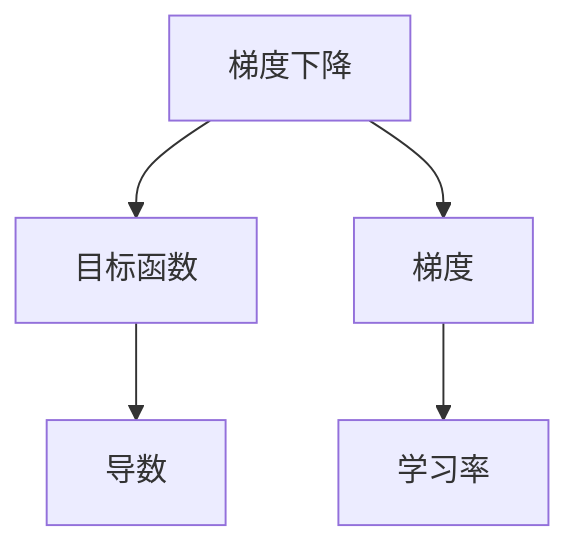

                 

## 1. 背景介绍

在深度学习和机器学习领域，梯度下降(GD)是最基础和最常用的优化算法之一。它不仅用于训练深度神经网络，也被广泛应用于各种优化问题中。理解梯度下降的原理和应用，对于深入掌握深度学习技术具有重要意义。本文将详细阐述梯度下降的核心理念、算法步骤、优缺点以及应用领域，并通过实际案例进一步展示其使用效果。

## 2. 核心概念与联系

### 2.1 核心概念概述

为更好地理解梯度下降，本节将介绍几个密切相关的核心概念：

- 梯度下降(Gradient Descent)：一种基于梯度的优化算法，用于求解目标函数的极小值。通过不断调整参数，使得目标函数值逐渐减小，从而找到最优解。

- 目标函数(Objective Function)：表示需要最小化的性能指标，如损失函数、代价函数等。深度学习中常用的目标函数包括交叉熵损失、均方误差损失等。

- 梯度(Gradient)：目标函数关于模型参数的偏导数，表示参数变化对函数值的影响。

- 导数(Derivative)：函数的瞬时变化率，用于描述函数在某一点的切线斜率。导数提供了函数在局部变化趋势的信息，是梯度下降的核心。

- 损失函数(Loss Function)：用于衡量模型预测输出与真实标签之间的差异。梯度下降的目标是最小化损失函数，从而提升模型的预测精度。

- 学习率(Learning Rate)：用于控制每次参数更新的步长。学习率过大会导致参数震荡甚至发散，过小则收敛速度慢。

这些核心概念之间的逻辑关系可以通过以下Mermaid流程图来展示：



这个流程图展示了几项关键概念及其之间的关系：

1. 梯度下降通过不断调整模型参数，使得目标函数值逐渐减小。
2. 目标函数是待优化的性能指标，通常使用损失函数表示。
3. 梯度是目标函数关于模型参数的偏导数，描述了参数变化对函数值的影响。
4. 导数是函数在某一点的瞬时变化率，提供了局部变化趋势的信息。
5. 学习率控制每次参数更新的步长，影响梯度下降的收敛速度。

## 3. 核心算法原理 & 具体操作步骤

### 3.1 算法原理概述

梯度下降算法通过计算目标函数关于模型参数的梯度，反向传播调整参数，使得目标函数值逐渐减小，从而找到最优解。其基本步骤如下：

1. 初始化模型参数，通常为随机初始化。
2. 计算目标函数关于模型参数的梯度。
3. 根据梯度更新模型参数。
4. 重复上述步骤直至满足预设的收敛条件。

梯度下降的核心在于如何更新模型参数，使得目标函数值不断减小。一般来说，有两种主要的更新策略：批量梯度下降(Batch Gradient Descent, BGD)和随机梯度下降(Stochastic Gradient Descent, SGD)。

### 3.2 算法步骤详解

#### 批量梯度下降(Batch Gradient Descent, BGD)

批量梯度下降是一种经典的优化算法，每次更新时使用全部样本计算梯度，更新参数。其步骤如下：

1. 随机初始化模型参数 $\theta_0$。
2. 使用全部训练样本 $D=\{(x_i,y_i)\}_{i=1}^N$，计算目标函数关于模型参数的梯度 $\nabla_{\theta}J(\theta)$。
3. 根据梯度更新模型参数 $\theta_{t+1} = \theta_t - \eta \nabla_{\theta}J(\theta_t)$，其中 $\eta$ 为学习率。
4. 重复步骤2和3，直至满足预设的收敛条件，如达到最大迭代次数或目标函数值变化不大。

批量梯度下降的优点是更新步长稳定，收敛速度较快。但由于每次更新需要遍历全部样本，计算量大，且当数据量较大时，更新过程较慢。

#### 随机梯度下降(Stochastic Gradient Descent, SGD)

随机梯度下降是一种轻量级的优化算法，每次更新时只使用一个样本计算梯度，更新参数。其步骤如下：

1. 随机初始化模型参数 $\theta_0$。
2. 从训练数据中随机选择一个样本 $(x_i,y_i)$，计算目标函数关于模型参数的梯度 $\nabla_{\theta}J(\theta_i)$。
3. 根据梯度更新模型参数 $\theta_{t+1} = \theta_t - \eta \nabla_{\theta}J(\theta_i)$。
4. 重复步骤2和3，直至满足预设的收敛条件，如达到最大迭代次数或目标函数值变化不大。

随机梯度下降的优点是计算量小，收敛速度快。但由于每次更新只使用一个样本，更新方向不稳定，且收敛路径可能跳跃。

### 3.3 算法优缺点

梯度下降算法具有以下优点：

1. 简单易懂。梯度下降的原理直观易懂，易于实现和理解。
2. 收敛稳定。当目标函数具有凸性时，梯度下降算法可以稳定收敛到全局最优解。
3. 可调性强。通过调整学习率，可以控制收敛速度和稳定性。

同时，梯度下降也存在一些局限性：

1. 计算量大。批量梯度下降需要计算全部样本的梯度，计算量大，收敛速度慢。
2. 更新不稳定。随机梯度下降每次更新只使用一个样本，更新方向不稳定。
3. 学习率敏感。学习率的选择需要谨慎，过大会导致参数震荡甚至发散，过小则收敛速度慢。
4. 局部最优。当目标函数具有非凸性时，梯度下降可能收敛到局部最优解。

尽管存在这些局限性，梯度下降仍然是深度学习中最常用和最基本的优化算法。未来相关研究的重点在于如何改进梯度下降的性能和稳定性，如采用自适应学习率、批量随机梯度下降等方法。

### 3.4 算法应用领域

梯度下降算法在深度学习和机器学习领域有着广泛的应用，主要包括以下几个方面：

1. 深度神经网络训练：梯度下降是训练深度神经网络的基础，通过反向传播计算梯度，不断调整模型参数，使得损失函数最小化。

2. 线性回归和逻辑回归：梯度下降算法可以用于线性回归和逻辑回归模型的参数优化，通过最小化预测误差，得到最优的模型参数。

3. 支持向量机：梯度下降算法可以用于支持向量机的对偶问题求解，通过最小化合页损失函数，得到最优的模型参数。

4. 核方法：梯度下降算法可以用于核方法的参数优化，通过最小化核损失函数，得到最优的核参数。

5. 非负矩阵分解：梯度下降算法可以用于非负矩阵分解问题的求解，通过最小化矩阵乘积误差，得到最优的矩阵分解参数。

这些应用领域展示了梯度下降算法的强大适应性和广泛应用性，为深度学习和机器学习提供了坚实的理论基础。

## 4. 数学模型和公式 & 详细讲解

### 4.1 数学模型构建

在梯度下降算法中，目标函数 $J(\theta)$ 通常表示为模型参数 $\theta$ 的函数，如损失函数 $L(\theta)$。梯度下降的目标是最小化目标函数 $J(\theta)$，即求解：

$$
\min_{\theta} J(\theta)
$$

其中 $\nabla_{\theta}J(\theta)$ 表示目标函数关于模型参数 $\theta$ 的梯度，可以通过链式法则和反向传播算法计算得到。

### 4.2 公式推导过程

以线性回归模型为例，假设模型参数为 $\theta = (w,b)$，目标函数为均方误差损失函数：

$$
L(\theta) = \frac{1}{2N}\sum_{i=1}^N (y_i - w x_i - b)^2
$$

其中 $y_i$ 表示样本的真实标签，$x_i$ 表示样本的特征向量，$w$ 和 $b$ 表示模型参数。目标函数的最小化问题可以表示为：

$$
\min_{w,b} L(w,b)
$$

对目标函数 $L(w,b)$ 关于 $w$ 和 $b$ 求偏导数，得到梯度：

$$
\nabla_{w}L(w,b) = \frac{1}{N}\sum_{i=1}^N (y_i - wx_i - b)x_i
$$

$$
\nabla_{b}L(w,b) = \frac{1}{N}\sum_{i=1}^N (y_i - wx_i - b)
$$

根据梯度下降算法，每次更新模型参数的公式为：

$$
w_{t+1} = w_t - \eta \nabla_{w}L(w_t,b_t)
$$

$$
b_{t+1} = b_t - \eta \nabla_{b}L(w_t,b_t)
$$

其中 $\eta$ 为学习率。

### 4.3 案例分析与讲解

以下以线性回归模型为例，展示梯度下降算法的实际应用。

假设有一组样本数据 $(x_i,y_i)$，其中 $x_i$ 为样本特征，$y_i$ 为样本标签。目标函数为均方误差损失函数：

$$
L(\theta) = \frac{1}{2N}\sum_{i=1}^N (y_i - wx_i - b)^2
$$

其中 $\theta = (w,b)$ 为模型参数。梯度下降算法步骤如下：

1. 随机初始化模型参数 $\theta_0 = (w_0,b_0)$。
2. 对于每个样本 $(x_i,y_i)$，计算梯度：

$$
\nabla_{w}L(\theta) = \frac{1}{N}\sum_{i=1}^N (y_i - wx_i - b)x_i
$$

$$
\nabla_{b}L(\theta) = \frac{1}{N}\sum_{i=1}^N (y_i - wx_i - b)
$$

3. 根据梯度更新模型参数：

$$
w_{t+1} = w_t - \eta \nabla_{w}L(w_t,b_t)
$$

$$
b_{t+1} = b_t - \eta \nabla_{b}L(w_t,b_t)
$$

4. 重复步骤2和3，直至满足预设的收敛条件，如达到最大迭代次数或目标函数值变化不大。

使用PyTorch实现梯度下降算法的代码如下：

```python
import torch
import torch.nn as nn
import torch.optim as optim

# 定义线性回归模型
class LinearRegression(nn.Module):
    def __init__(self, input_dim, output_dim):
        super(LinearRegression, self).__init__()
        self.linear = nn.Linear(input_dim, output_dim)
    
    def forward(self, x):
        return self.linear(x)

# 准备数据
x = torch.tensor([[1.0, 2.0, 3.0], [4.0, 5.0, 6.0]], dtype=torch.float32)
y = torch.tensor([2.0, 4.0], dtype=torch.float32)

# 定义模型和优化器
model = LinearRegression(input_dim=2, output_dim=1)
optimizer = optim.SGD(model.parameters(), lr=0.01)

# 训练模型
for epoch in range(100):
    y_pred = model(x)
    loss = (y_pred - y).pow(2).mean()
    optimizer.zero_grad()
    loss.backward()
    optimizer.step()
    print(f"Epoch {epoch+1}, loss: {loss.item():.4f}")
```

在上述代码中，定义了一个简单的线性回归模型，并使用随机梯度下降算法进行训练。在每个epoch中，计算模型的预测值与真实标签之间的均方误差，使用SGD优化器进行梯度更新。

## 5. 项目实践：代码实例和详细解释说明

### 5.1 开发环境搭建

在进行梯度下降实践前，我们需要准备好开发环境。以下是使用Python进行PyTorch开发的环境配置流程：

1. 安装Anaconda：从官网下载并安装Anaconda，用于创建独立的Python环境。

2. 创建并激活虚拟环境：
```bash
conda create -n pytorch-env python=3.8 
conda activate pytorch-env
```

3. 安装PyTorch：根据CUDA版本，从官网获取对应的安装命令。例如：
```bash
conda install pytorch torchvision torchaudio cudatoolkit=11.1 -c pytorch -c conda-forge
```

4. 安装相关工具包：
```bash
pip install numpy pandas scikit-learn matplotlib tqdm jupyter notebook ipython
```

完成上述步骤后，即可在`pytorch-env`环境中开始梯度下降实践。

### 5.2 源代码详细实现

下面我们以线性回归为例，给出使用PyTorch实现梯度下降算法的完整代码实现。

```python
import torch
import torch.nn as nn
import torch.optim as optim

# 定义线性回归模型
class LinearRegression(nn.Module):
    def __init__(self, input_dim, output_dim):
        super(LinearRegression, self).__init__()
        self.linear = nn.Linear(input_dim, output_dim)
    
    def forward(self, x):
        return self.linear(x)

# 准备数据
x = torch.tensor([[1.0, 2.0, 3.0], [4.0, 5.0, 6.0]], dtype=torch.float32)
y = torch.tensor([2.0, 4.0], dtype=torch.float32)

# 定义模型和优化器
model = LinearRegression(input_dim=2, output_dim=1)
optimizer = optim.SGD(model.parameters(), lr=0.01)

# 训练模型
for epoch in range(100):
    y_pred = model(x)
    loss = (y_pred - y).pow(2).mean()
    optimizer.zero_grad()
    loss.backward()
    optimizer.step()
    print(f"Epoch {epoch+1}, loss: {loss.item():.4f}")
```

在上述代码中，定义了一个简单的线性回归模型，并使用随机梯度下降算法进行训练。在每个epoch中，计算模型的预测值与真实标签之间的均方误差，使用SGD优化器进行梯度更新。

### 5.3 代码解读与分析

让我们再详细解读一下关键代码的实现细节：

**LinearRegression类**：
- `__init__`方法：初始化线性回归模型的权重和偏置。
- `forward`方法：前向传播，计算模型输出。

**数据准备**：
- `x`和`y`分别表示样本的特征和标签，使用`torch.tensor`创建张量。

**模型和优化器**：
- `model`为定义好的线性回归模型，使用SGD优化器进行优化。

**训练循环**：
- 每个epoch中，先计算模型的预测值`y_pred`，再计算预测值与真实标签之间的均方误差`loss`。
- 使用`optimizer.zero_grad()`清除之前计算的梯度，再调用`loss.backward()`反向传播计算梯度。
- 使用`optimizer.step()`更新模型参数。

可以看到，PyTorch提供了方便的API，使得梯度下降算法的实现变得简洁高效。开发者可以专注于模型设计和算法调参，而不必过多关注底层实现细节。

## 6. 实际应用场景

### 6.1 机器学习算法优化

梯度下降算法在机器学习领域有着广泛的应用，如线性回归、逻辑回归、支持向量机等。在实际应用中，通过对损失函数进行微调，优化模型参数，可以获得更好的性能。例如，在金融风险评估中，通过最小化违约概率预测误差，可以构建更准确的信用评分模型。

### 6.2 深度神经网络训练

梯度下降是训练深度神经网络的基础算法。通过反向传播计算梯度，不断调整模型参数，可以最小化损失函数，提升模型性能。例如，在图像分类任务中，通过最小化交叉熵损失，可以训练出具有高准确率的卷积神经网络。

### 6.3 强化学习

梯度下降算法也可以应用于强化学习中。在强化学习中，目标函数通常表示为奖励函数，梯度下降算法可以用于优化策略参数，使得模型获得更高的期望奖励。例如，在机器人控制任务中，通过最小化行动成本，可以训练出更优的控制策略。

### 6.4 未来应用展望

随着梯度下降算法的研究不断深入，其在深度学习和机器学习中的应用将更加广泛。未来，梯度下降算法可能会结合自适应学习率、批量随机梯度下降等技术，进一步提升优化效果。同时，梯度下降算法的应用也将拓展到更多领域，如自然语言处理、计算机视觉、机器人控制等，为人工智能技术的发展注入新的动力。

## 7. 工具和资源推荐

### 7.1 学习资源推荐

为了帮助开发者系统掌握梯度下降算法，这里推荐一些优质的学习资源：

1. 《Deep Learning》书籍：Ian Goodfellow等著，全面介绍了深度学习算法和理论，包括梯度下降算法。

2. CS231n《Convolutional Neural Networks for Visual Recognition》课程：斯坦福大学开设的计算机视觉课程，讲解了卷积神经网络的训练过程，包括梯度下降算法。

3. CS294-112《Machine Learning》课程：伯克利大学开设的机器学习课程，讲解了梯度下降算法及其变种，如随机梯度下降、批量随机梯度下降等。

4. PyTorch官方文档：提供了丰富的梯度下降算法样例代码和解释，是学习和实践的重要资源。

5. Coursera《Machine Learning》课程：由斯坦福大学Andrew Ng教授主讲，讲解了梯度下降算法及其变种，并提供了Python代码实现。

通过对这些资源的学习实践，相信你一定能够深入理解梯度下降算法，并用于解决实际的机器学习和深度学习问题。

### 7.2 开发工具推荐

高效的开发离不开优秀的工具支持。以下是几款用于梯度下降开发的常用工具：

1. PyTorch：基于Python的开源深度学习框架，灵活动态的计算图，适合快速迭代研究。支持梯度下降算法及其变种，如SGD、Adam等。

2. TensorFlow：由Google主导开发的开源深度学习框架，生产部署方便，适合大规模工程应用。支持梯度下降算法及其变种，如SGD、Adam等。

3. Scikit-learn：基于Python的机器学习库，提供了多种梯度下降算法实现，如SGDClassifier、SGDRegressor等。

4. Statsmodels：Python的统计模型库，提供了多种线性回归模型实现，如OLS、Lasso、Ridge等，并支持梯度下降算法。

5. Jupyter Notebook：交互式开发环境，支持Python代码的运行和调试，便于进行模型训练和实验。

6. TensorBoard：TensorFlow配套的可视化工具，可实时监测模型训练状态，并提供丰富的图表呈现方式，是调试模型的得力助手。

合理利用这些工具，可以显著提升梯度下降任务的开发效率，加快创新迭代的步伐。

### 7.3 相关论文推荐

梯度下降算法的研究源于学界的持续研究。以下是几篇奠基性的相关论文，推荐阅读：

1. Gradient Descent Methods for Machine Learning：Sutskever等著，综述了梯度下降算法及其变种的性能和应用，是梯度下降算法研究的重要文献。

2. The Effects of Noise and Feedback in Perceptron Learning：Rosenblatt著，提出了感知机算法，奠定了梯度下降算法的基础。

3. Robust Stochastic Gradient Descent Algorithms：Rakhlin等著，提出了一系列改进的梯度下降算法，如AdaGrad、RMSprop等，显著提升了优化效果。

4. Stochastic Gradient Descent Tricks：Goodfellow等著，介绍了一些梯度下降算法的优化技巧，如学习率衰减、批量随机梯度下降等。

5. Momentum: A Novel Learning Rate Adaptation Algorithm：Hinton等著，提出了动量优化算法，有效缓解了梯度下降中的震荡问题。

这些论文代表了大梯度下降算法的发展脉络。通过学习这些前沿成果，可以帮助研究者把握学科前进方向，激发更多的创新灵感。

## 8. 总结：未来发展趋势与挑战

### 8.1 总结

本文对梯度下降算法进行了全面系统的介绍。首先阐述了梯度下降算法的核心理念和应用场景，明确了其在深度学习和机器学习中的重要地位。其次，从原理到实践，详细讲解了梯度下降算法的数学模型和关键步骤，并通过实际案例展示了其使用效果。同时，本文还介绍了梯度下降算法的优缺点和应用领域，提供了丰富的学习资源和开发工具。

通过本文的系统梳理，可以看到，梯度下降算法在深度学习和机器学习中具有广泛的应用和强大的性能，是优化算法的重要基础。未来，随着深度学习技术的不断发展，梯度下降算法也将不断被优化和改进，以适应更加复杂和多样的优化问题。

### 8.2 未来发展趋势

展望未来，梯度下降算法将呈现以下几个发展趋势：

1. 自适应学习率：通过自适应调整学习率，避免过拟合和收敛速度慢的问题，提升梯度下降算法的稳定性和收敛速度。

2. 批量随机梯度下降：结合批量梯度下降和随机梯度下降的优点，提升优化效果。

3. 优化器组合：结合多种优化器算法，如SGD、Adam、Momentum等，提升优化效果。

4. 异步优化：通过分布式计算和异步更新，提升优化速度和资源利用率。

5. 多任务优化：通过同时优化多个任务，提升优化效率和模型性能。

6. 混合精度训练：使用混合精度训练技术，减少内存消耗和计算时间，提升训练速度。

以上趋势凸显了梯度下降算法在深度学习和机器学习中的重要地位和广阔前景。这些方向的探索发展，必将进一步提升梯度下降算法的性能和稳定性，推动人工智能技术的不断发展。

### 8.3 面临的挑战

尽管梯度下降算法已经取得了瞩目成就，但在迈向更加智能化、普适化应用的过程中，它仍面临诸多挑战：

1. 收敛速度慢：当目标函数具有非凸性时，梯度下降算法可能收敛到局部最优解，而非全局最优解。

2. 学习率敏感：学习率的选择需要谨慎，过大会导致参数震荡甚至发散，过小则收敛速度慢。

3. 过拟合问题：梯度下降算法在处理过拟合问题上存在一定的局限性，特别是在数据量较小的情况下。

4. 模型复杂度高：深度学习模型通常具有较高的复杂度，梯度下降算法需要处理大量参数，计算量大。

5. 模型训练时间长：深度学习模型训练时间较长，特别是在大规模数据集和复杂模型的情况下。

尽管存在这些挑战，梯度下降算法仍然是深度学习和机器学习中最常用和最基本的优化算法。未来相关研究的重点在于如何改进梯度下降的性能和稳定性，如采用自适应学习率、批量随机梯度下降等方法。

### 8.4 研究展望

面对梯度下降算法所面临的种种挑战，未来的研究需要在以下几个方面寻求新的突破：

1. 探索无监督和半监督梯度下降算法：摆脱对大规模标注数据的依赖，利用自监督学习、主动学习等无监督和半监督范式，最大限度利用非结构化数据，实现更加灵活高效的优化。

2. 研究参数高效和计算高效的梯度下降范式：开发更加参数高效的梯度下降方法，在固定大部分预训练参数的情况下，只更新极少量的任务相关参数。同时优化梯度下降模型的计算图，减少前向传播和反向传播的资源消耗，实现更加轻量级、实时性的部署。

3. 引入更多先验知识：将符号化的先验知识，如知识图谱、逻辑规则等，与梯度下降模型进行巧妙融合，引导梯度下降过程学习更准确、合理的模型参数。同时加强不同模态数据的整合，实现视觉、语音等多模态信息与文本信息的协同建模。

4. 纳入伦理道德约束：在模型训练目标中引入伦理导向的评估指标，过滤和惩罚有偏见、有害的输出倾向。同时加强人工干预和审核，建立模型行为的监管机制，确保输出符合人类价值观和伦理道德。

这些研究方向的探索，必将引领梯度下降算法技术迈向更高的台阶，为构建安全、可靠、可解释、可控的智能系统铺平道路。面向未来，梯度下降算法还需要与其他人工智能技术进行更深入的融合，如知识表示、因果推理、强化学习等，多路径协同发力，共同推动人工智能技术的进步。只有勇于创新、敢于突破，才能不断拓展梯度下降算法的边界，让智能技术更好地造福人类社会。

## 9. 附录：常见问题与解答

**Q1：什么是梯度下降算法？**

A: 梯度下降算法是一种基于梯度的优化算法，用于求解目标函数的极小值。通过不断调整参数，使得目标函数值逐渐减小，从而找到最优解。

**Q2：梯度下降算法有哪些变种？**

A: 梯度下降算法的主要变种包括批量梯度下降(Batch Gradient Descent, BGD)、随机梯度下降(Stochastic Gradient Descent, SGD)和批量随机梯度下降(Mini-Batch Gradient Descent, MBGD)等。

**Q3：学习率的选择有哪些策略？**

A: 学习率的选择需要谨慎，常用策略包括固定学习率、学习率衰减和自适应学习率等。

**Q4：如何缓解梯度下降中的震荡问题？**

A: 通过引入动量优化算法、自适应学习率等技术，可以有效缓解梯度下降中的震荡问题。

**Q5：梯度下降算法在实际应用中有哪些优势？**

A: 梯度下降算法具有简单易懂、收敛稳定等优势，是深度学习和机器学习中最常用和最基本的优化算法。

---

作者：禅与计算机程序设计艺术 / Zen and the Art of Computer Programming

