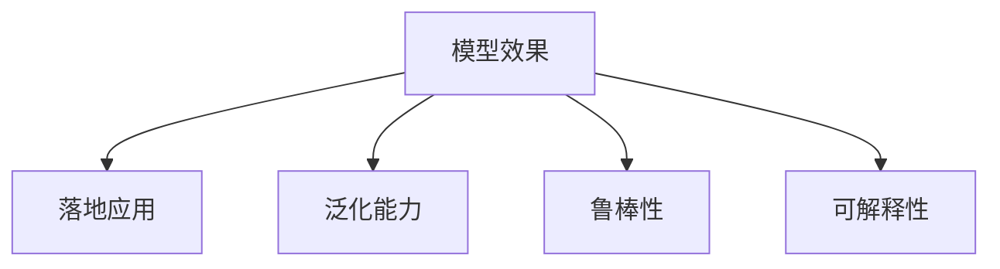

                 

## 1. 背景介绍

### 1.1 问题由来
在人工智能(AI)的浪潮席卷科技领域的同时，如何让AI落地应用成为了一个亟待解决的问题。AI的落地不仅仅是实现一些简单功能，更是要通过技术创新和行业结合，解决实际问题，产生可衡量的商业价值和社会效益。然而，众多AI技术在实验室中表现优异，但一旦脱离实验室环境，进入现实世界，其效果往往大打折扣，甚至难以实现预期目标。究其原因，一方面是由于技术本身的局限性，如模型的健壮性、可解释性不足等；另一方面，是由于模型的应用场景需要深入理解行业需求，现有模型并不能完全适配各种复杂的现实问题。

### 1.2 问题核心关键点
模型效果是AI落地的核心关键点，涉及模型性能、泛化能力、鲁棒性、可解释性等多个方面。具体来说，模型需要在以下几方面表现出色，才能被真正落地应用：

1. **准确性和精度**：模型需要对真实数据有较好的预测能力，即准确率、召回率、F1分数等指标要满足业务需求。
2. **泛化能力**：模型在未见过的数据上同样能够表现出色，即具备良好的泛化能力。
3. **鲁棒性**：模型对输入数据的噪声、异常值等扰动不敏感，即具有较好的鲁棒性。
4. **可解释性**：模型的决策过程可被理解，即具备良好的可解释性。
5. **效率**：模型在实际应用中需要具备高效性，即推理速度快，内存占用低。

本文将系统性地介绍如何通过模型效果的优化，提升AI技术的落地能力，并展望未来AI技术的演进趋势。

## 2. 核心概念与联系

### 2.1 核心概念概述

为更好地理解模型效果在AI落地中的作用，本节将介绍几个关键概念及其相互联系：

- **模型效果**：指模型在特定任务上的性能指标，如准确率、召回率、F1分数等，是衡量AI模型价值的核心指标。
- **落地应用**：将AI技术应用于具体业务场景，产生实际价值的过程。
- **泛化能力**：模型在新数据上的表现能力，即模型的泛化能力越强，越能在不同的数据分布上保持稳定。
- **鲁棒性**：模型对输入数据的扰动、噪声等不敏感，即鲁棒性越强，模型越稳定。
- **可解释性**：模型能够提供直观、易于理解的解释，便于调试和改进。

这些概念通过以下Mermaid流程图来展示：



这个流程图展示了模型效果与落地应用、泛化能力、鲁棒性、可解释性之间的关系：

1. 模型效果是AI落地的核心，是评价模型价值的主要依据。
2. 泛化能力、鲁棒性和可解释性是提升模型效果的重要保障。
3. 只有具备了上述三个方面的能力，模型才能真正落地应用，产生商业和社会价值。

## 3. 核心算法原理 & 具体操作步骤
### 3.1 算法原理概述

模型效果的优化主要涉及两个方面的算法原理：

1. **模型训练优化**：通过选择合适的优化算法、超参数设置，提高模型的泛化能力和鲁棒性，降低模型的过拟合风险。
2. **模型评估和调优**：通过合理的评估指标和调优方法，提高模型的准确性和可解释性。

以下将详细介绍这两种优化方法。

### 3.2 算法步骤详解

#### 3.2.1 模型训练优化

**Step 1: 选择合适的优化算法**
- **随机梯度下降(SGD)**：基础优化算法，简单易实现，适用于大规模数据。
- **Adam**：结合动量优化和梯度自适应调整，收敛速度快，适用于大多数任务。
- **Adagrad**：自适应学习率，适用于稀疏数据，但对长尾样本表现不佳。
- **RMSprop**：结合动量优化和自适应学习率，适用于非平稳目标函数。

**Step 2: 设置合适的超参数**
- **学习率**：控制模型参数的更新速度，过小易陷入局部最优，过大易过拟合。
- **批大小**：控制每次更新使用的样本数量，影响训练速度和模型泛化能力。
- **正则化**：通过L1、L2正则、Dropout等技术，防止模型过拟合。

**Step 3: 数据预处理**
- **数据增强**：通过对数据进行旋转、缩放、平移等操作，扩充训练集，提高模型的泛化能力。
- **标准化**：对数据进行标准化，加速收敛。

**Step 4: 模型微调**
- **冻结部分层**：只微调部分层，减少参数更新量。
- **梯度累积**：通过多次更新，减少单次更新的梯度噪声，加速收敛。
- **参数剪枝**：去除冗余参数，提高模型效率。

**Step 5: 评估和调优**
- **交叉验证**：通过交叉验证，评估模型的泛化能力。
- **学习曲线**：绘制学习曲线，评估模型的收敛情况。
- **超参数调优**：通过网格搜索、贝叶斯优化等方法，找到最优超参数组合。

#### 3.2.2 模型评估和调优

**Step 1: 选择合适的评估指标**
- **准确率**：分类任务中最常用的指标。
- **召回率**：关注模型对正例的覆盖率。
- **F1分数**：综合准确率和召回率的指标。
- **ROC曲线**：评估模型在不同阈值下的性能表现。
- **混淆矩阵**：直观展示模型在不同类别上的预测表现。

**Step 2: 评估模型**
- **训练集评估**：通过训练集评估模型的性能，避免过拟合。
- **验证集评估**：通过验证集评估模型的泛化能力。
- **测试集评估**：通过测试集评估模型的最终表现。

**Step 3: 调优方法**
- **超参数调优**：通过网格搜索、随机搜索等方法，找到最优超参数。
- **模型融合**：通过集成多个模型，提高模型的泛化能力。
- **对抗训练**：通过引入对抗样本，提高模型的鲁棒性。
- **模型蒸馏**：通过知识蒸馏，将大模型知识迁移到小模型。

### 3.3 算法优缺点

**3.3.1 模型训练优化**

**优点**：
- 能够提升模型的泛化能力和鲁棒性。
- 通过选择合适的超参数和训练技巧，能够有效避免过拟合。
- 适用于大多数机器学习任务，具有广泛的适用性。

**缺点**：
- 需要大量的标注数据和计算资源。
- 模型优化过程复杂，需要细致的实验设计。
- 模型的复杂度增加，可能带来更高的存储和推理开销。

**3.3.2 模型评估和调优**

**优点**：
- 能够提升模型的准确性和可解释性。
- 通过多种评估指标和调优方法，能够更全面地提升模型效果。
- 适用于大多数机器学习任务，具有广泛的适用性。

**缺点**：
- 需要大量的时间进行评估和调优。
- 评估和调优过程复杂，需要细致的实验设计。
- 需要更多的计算资源和存储资源。

### 3.4 算法应用领域

模型效果的优化方法在众多领域中得到了广泛应用，以下是几个典型应用领域：

1. **金融风控**：通过优化模型效果，提升对风险的预测能力，降低金融损失。
2. **医疗诊断**：通过优化模型效果，提高诊断的准确性和可靠性。
3. **自动驾驶**：通过优化模型效果，提高自动驾驶系统的安全性和可靠性。
4. **自然语言处理(NLP)**：通过优化模型效果，提高语言理解和生成的准确性和可解释性。
5. **智能推荐**：通过优化模型效果，提高推荐系统的精准度和用户满意度。

除了上述几个领域外，模型效果的优化方法还在更多场景中得到了应用，如城市管理、智慧教育、智能制造等，为各行各业带来了新的发展机遇。

## 4. 数学模型和公式 & 详细讲解 & 举例说明

### 4.1 数学模型构建

在模型效果优化的过程中，常见的数学模型包括损失函数、正则化项、评估指标等。

**4.1.1 损失函数**

损失函数是模型优化过程中的核心，通常包含两部分：
- **数据损失**：衡量模型预测值与真实值之间的差异。
- **正则化项**：防止模型过拟合。

常用的损失函数包括：
- **交叉熵损失**：适用于分类任务。
- **均方误差损失**：适用于回归任务。
- **KL散度损失**：衡量两个概率分布之间的差异。

**4.1.2 正则化项**

正则化项主要用于防止模型过拟合，常用的正则化项包括：
- **L1正则化**：惩罚模型的稀疏性。
- **L2正则化**：惩罚模型的权重平方和。
- **Dropout**：随机丢弃部分神经元，防止过拟合。

### 4.2 公式推导过程

以分类任务为例，通过逻辑回归模型推导损失函数和正则化项的公式。

假设模型输入为 $x$，输出为 $\hat{y}$，真实标签为 $y$，模型参数为 $\theta$，则逻辑回归模型的预测结果为 $\hat{y} = \sigma(\theta^Tx)$，其中 $\sigma$ 为sigmoid函数。

**交叉熵损失函数**：
$$
\ell(\hat{y}, y) = -(y\log \hat{y} + (1-y)\log(1-\hat{y}))
$$

**L2正则化项**：
$$
\Omega(\theta) = \frac{\lambda}{2}\sum_{i=1}^n \theta_i^2
$$

**损失函数**：
$$
\mathcal{L}(\theta) = \frac{1}{N}\sum_{i=1}^N \ell(\hat{y}_i, y_i) + \alpha\Omega(\theta)
$$

其中 $\lambda$ 为正则化系数，$\alpha$ 为正则化强度。

### 4.3 案例分析与讲解

**案例1: 金融风控**

在金融风控领域，通过优化模型效果，提升对风险的预测能力，降低金融损失。

假设模型输入为 $x$（用户的历史交易记录），输出为 $\hat{y}$（用户是否存在风险），真实标签为 $y$（用户是否存在风险），则模型可以采用逻辑回归模型，并通过交叉熵损失和L2正则化项进行优化。

**案例2: 医疗诊断**

在医疗诊断领域，通过优化模型效果，提高诊断的准确性和可靠性。

假设模型输入为 $x$（患者的症状描述），输出为 $\hat{y}$（疾病的诊断结果），真实标签为 $y$（疾病的真实诊断结果），则模型可以采用卷积神经网络(CNN)，并通过交叉熵损失和Dropout正则化项进行优化。

## 5. 项目实践：代码实例和详细解释说明

### 5.1 开发环境搭建

在进行模型效果优化实践前，需要先准备好开发环境。以下是使用Python进行TensorFlow开发的环境配置流程：

1. 安装Anaconda：从官网下载并安装Anaconda，用于创建独立的Python环境。

2. 创建并激活虚拟环境：
```bash
conda create -n tensorflow-env python=3.8 
conda activate tensorflow-env
```

3. 安装TensorFlow：
```bash
conda install tensorflow
```

4. 安装各类工具包：
```bash
pip install numpy pandas scikit-learn matplotlib tqdm jupyter notebook ipython
```

完成上述步骤后，即可在`tensorflow-env`环境中开始模型效果优化实践。

### 5.2 源代码详细实现

以下以TensorFlow框架为例，给出使用神经网络对金融风控任务进行模型效果优化的PyTorch代码实现。

首先，定义模型：

```python
import tensorflow as tf

# 定义逻辑回归模型
class LogisticRegression(tf.keras.Model):
    def __init__(self, input_dim):
        super(LogisticRegression, self).__init__()
        self.dense1 = tf.keras.layers.Dense(64, activation='relu')
        self.dense2 = tf.keras.layers.Dense(1, activation='sigmoid')
    
    def call(self, x):
        x = self.dense1(x)
        x = self.dense2(x)
        return x

# 创建模型
model = LogisticRegression(input_dim=10)
```

然后，定义损失函数和优化器：

```python
# 定义交叉熵损失函数
loss_fn = tf.keras.losses.BinaryCrossentropy()

# 定义Adam优化器
optimizer = tf.keras.optimizers.Adam(learning_rate=0.001)

# 定义L2正则化项
regularizer = tf.keras.regularizers.l2(0.001)
```

接着，定义训练和评估函数：

```python
# 定义训练函数
@tf.function
def train_step(x, y):
    with tf.GradientTape() as tape:
        logits = model(x)
        loss_value = loss_fn(y, logits)
        reg_loss = tf.reduce_sum(model.losses)
        loss = loss_value + reg_loss
    grads = tape.gradient(loss, model.trainable_variables)
    optimizer.apply_gradients(zip(grads, model.trainable_variables))
    return loss_value, reg_loss, loss

# 定义评估函数
def evaluate(model, x_test, y_test):
    y_pred = model(x_test)
    loss = loss_fn(y_test, y_pred)
    accuracy = tf.reduce_mean(tf.cast(tf.round(y_pred) == y_test, tf.float32))
    return loss, accuracy
```

最后，启动训练流程并在测试集上评估：

```python
epochs = 10
batch_size = 64

# 训练模型
for epoch in range(epochs):
    loss_value, reg_loss, total_loss = train_step(x_train, y_train)
    print(f"Epoch {epoch+1}, loss: {total_loss.numpy():.4f}, reg_loss: {reg_loss.numpy():.4f}")
    
    # 评估模型
    loss, accuracy = evaluate(model, x_test, y_test)
    print(f"Epoch {epoch+1}, test loss: {loss.numpy():.4f}, test accuracy: {accuracy.numpy():.4f}")
    
print("模型训练完成")
```

以上就是使用TensorFlow框架对金融风控任务进行模型效果优化的完整代码实现。可以看到，TensorFlow提供了丰富的API和工具，可以方便地实现模型训练和评估。

### 5.3 代码解读与分析

让我们再详细解读一下关键代码的实现细节：

**LogisticRegression类**：
- `__init__`方法：初始化模型结构，包含两个全连接层。
- `call`方法：前向传播，计算模型输出。

**损失函数和优化器**：
- `loss_fn`：定义交叉熵损失函数。
- `optimizer`：定义Adam优化器，学习率为0.001。
- `regularizer`：定义L2正则化项，正则化系数为0.001。

**训练函数`train_step`**：
- 使用梯度带回propagation求导，计算损失函数和正则化项。
- 计算梯度，使用优化器更新模型参数。
- 返回损失值、正则化损失和总损失。

**评估函数`evaluate`**：
- 通过模型输出计算预测结果和损失值。
- 计算准确率。
- 返回损失值和准确率。

**训练流程**：
- 定义总的epoch数和batch size，开始循环迭代。
- 每个epoch内，在训练集上进行训练，输出损失值和正则化损失。
- 在验证集上评估模型，输出损失值和准确率。
- 所有epoch结束后，在测试集上评估模型，输出损失值和准确率。

可以看到，TensorFlow提供了丰富的API和工具，可以方便地实现模型训练和评估。开发者可以将更多精力放在数据处理、模型改进等高层逻辑上，而不必过多关注底层的实现细节。

当然，工业级的系统实现还需考虑更多因素，如模型的保存和部署、超参数的自动搜索、更灵活的任务适配层等。但核心的模型效果优化逻辑基本与此类似。

## 6. 实际应用场景

### 6.1 金融风控

在金融领域，通过优化模型效果，可以有效降低金融风险，保护投资者利益。

**应用场景**：
- **信用评估**：通过优化模型效果，评估客户的信用风险，决定是否放贷。
- **欺诈检测**：通过优化模型效果，检测交易中的异常行为，及时发现和预防欺诈。
- **风险预警**：通过优化模型效果，提前预警市场风险，帮助投资者规避损失。

**技术实现**：
- 收集历史交易数据，提取特征。
- 将数据分为训练集、验证集和测试集。
- 构建逻辑回归或神经网络模型，并通过交叉熵损失和正则化项进行优化。
- 在测试集上评估模型效果，并根据结果调整模型参数。

### 6.2 医疗诊断

在医疗领域，通过优化模型效果，可以提升诊断的准确性和可靠性，减少误诊风险。

**应用场景**：
- **疾病诊断**：通过优化模型效果，快速准确地诊断疾病。
- **治疗方案推荐**：通过优化模型效果，推荐合适的治疗方案。
- **健康管理**：通过优化模型效果，提供个性化的健康管理建议。

**技术实现**：
- 收集患者的症状数据，提取特征。
- 将数据分为训练集、验证集和测试集。
- 构建卷积神经网络或递归神经网络模型，并通过交叉熵损失和Dropout正则化项进行优化。
- 在测试集上评估模型效果，并根据结果调整模型参数。

### 6.3 智能推荐

在推荐系统领域，通过优化模型效果，可以提高推荐的精准度和用户满意度。

**应用场景**：
- **商品推荐**：通过优化模型效果，推荐用户可能感兴趣的商品。
- **内容推荐**：通过优化模型效果，推荐用户可能感兴趣的内容。
- **用户画像**：通过优化模型效果，构建用户画像，提升推荐质量。

**技术实现**：
- 收集用户行为数据，提取特征。
- 将数据分为训练集、验证集和测试集。
- 构建神经网络模型，并通过交叉熵损失和L2正则化项进行优化。
- 在测试集上评估模型效果，并根据结果调整模型参数。

## 7. 工具和资源推荐

### 7.1 学习资源推荐

为了帮助开发者系统掌握模型效果优化的理论基础和实践技巧，这里推荐一些优质的学习资源：

1. 《机器学习实战》书籍：深入浅出地介绍了机器学习的基础理论和常见算法，适合入门学习。
2. CS231n《深度学习计算机视觉》课程：斯坦福大学开设的计算机视觉课程，涵盖深度学习在视觉任务中的应用，包括模型优化。
3. 《深度学习》书籍：深度学习领域的经典教材，涵盖了神经网络的优化算法、正则化技术等。
4. Kaggle平台：提供大量的数据集和竞赛项目，可以实践模型效果优化技术。
5. PyTorch官方文档：提供了详细的API和示例代码，适合实践学习。

通过对这些资源的学习实践，相信你一定能够快速掌握模型效果优化的精髓，并用于解决实际的机器学习问题。

### 7.2 开发工具推荐

高效的开发离不开优秀的工具支持。以下是几款用于模型效果优化开发的常用工具：

1. PyTorch：基于Python的开源深度学习框架，灵活动态的计算图，适合快速迭代研究。支持多种优化算法和正则化技术。

2. TensorFlow：由Google主导开发的开源深度学习框架，生产部署方便，适合大规模工程应用。提供丰富的API和优化器。

3. Weights & Biases：模型训练的实验跟踪工具，可以记录和可视化模型训练过程中的各项指标，方便对比和调优。与主流深度学习框架无缝集成。

4. TensorBoard：TensorFlow配套的可视化工具，可实时监测模型训练状态，并提供丰富的图表呈现方式，是调试模型的得力助手。

5. Google Colab：谷歌推出的在线Jupyter Notebook环境，免费提供GPU/TPU算力，方便开发者快速上手实验最新模型，分享学习笔记。

合理利用这些工具，可以显著提升模型效果优化的开发效率，加快创新迭代的步伐。

### 7.3 相关论文推荐

模型效果优化的研究源于学界的持续研究。以下是几篇奠基性的相关论文，推荐阅读：

1. AdaGrad: An Adaptive Learning Rate Method（AdaGrad算法）：介绍了一种自适应学习率的优化算法，可用于加速模型训练。

2. Dropout: A Simple Way to Prevent Neural Networks from Overfitting（Dropout技术）：介绍了Dropout技术，通过随机丢弃神经元，防止过拟合。

3. Batch Normalization: Accelerating Deep Network Training by Reducing Internal Covariate Shift（批量归一化技术）：介绍了批量归一化技术，加速深度网络的训练。

4. Self-Normalizing Neural Networks（自归一化神经网络）：介绍了一种新的神经网络结构，能够更好地处理输入数据的变化。

5. BERT: Pre-training of Deep Bidirectional Transformers for Language Understanding（BERT模型）：提出BERT模型，通过预训练和微调，提升了NLP任务的性能。

这些论文代表了大模型效果优化的发展脉络。通过学习这些前沿成果，可以帮助研究者把握学科前进方向，激发更多的创新灵感。

## 8. 总结：未来发展趋势与挑战

### 8.1 总结

本文对模型效果的优化进行了全面系统的介绍。首先阐述了模型效果在AI落地中的核心地位，明确了模型效果优化的重要性。其次，从原理到实践，详细讲解了模型训练优化和模型评估调优的算法原理和操作步骤，给出了模型效果优化的完整代码实例。同时，本文还广泛探讨了模型效果优化在金融风控、医疗诊断、智能推荐等多个领域的应用前景，展示了模型效果优化的巨大潜力。此外，本文精选了模型效果优化的各类学习资源，力求为读者提供全方位的技术指引。

通过本文的系统梳理，可以看到，模型效果优化是大模型落地应用的关键，是衡量模型价值的主要指标。未来，伴随模型效果的不断提升，AI技术的落地应用将更为广泛和深入。

### 8.2 未来发展趋势

展望未来，模型效果的优化将呈现以下几个发展趋势：

1. **自动化模型调优**：通过自动化调参和超参数优化技术，减少人工干预，提高模型训练效率。
2. **多任务学习**：通过多任务学习，将多个任务联合优化，提升模型的泛化能力和鲁棒性。
3. **分布式训练**：通过分布式训练，加速大规模模型的训练，降低计算成本。
4. **混合精度训练**：通过混合精度训练，提高模型训练的稳定性和收敛速度。
5. **知识蒸馏**：通过知识蒸馏，将大模型知识迁移到小模型，提升小模型的效果。
6. **自监督学习**：通过自监督学习，利用无标签数据进行模型训练，减少对标注数据的依赖。

以上趋势凸显了模型效果优化的广阔前景。这些方向的探索发展，必将进一步提升AI技术的落地能力，为各行各业带来新的发展机遇。

### 8.3 面临的挑战

尽管模型效果优化已经取得了瞩目成就，但在迈向更加智能化、普适化应用的过程中，它仍面临诸多挑战：

1. **数据质量瓶颈**：模型训练需要高质量的数据，但数据采集和标注成本高昂，限制了模型的泛化能力。
2. **计算资源限制**：大规模模型的训练和推理需要高性能硬件支持，如GPU、TPU等，硬件成本较高。
3. **模型复杂度问题**：大规模模型的复杂度较高，推理速度慢，内存占用大，影响实际应用。
4. **模型解释性不足**：模型通常是"黑盒"系统，难以解释其内部工作机制和决策逻辑，影响可信度。
5. **鲁棒性问题**：模型在面对异常数据和噪声时，容易发生误判，影响稳定性。

正视模型效果优化面临的这些挑战，积极应对并寻求突破，将是大模型效果优化的重要方向。相信随着学界和产业界的共同努力，这些挑战终将一一被克服，大模型效果优化必将在构建人机协同的智能时代中扮演越来越重要的角色。

### 8.4 研究展望

面对模型效果优化的挑战，未来的研究需要在以下几个方面寻求新的突破：

1. **模型压缩和优化**：开发更加高效、轻量级的模型结构，减少计算和存储开销。
2. **自动化调参技术**：开发自动化调参技术，减少人工干预，提高模型训练效率。
3. **分布式训练**：通过分布式训练，加速大规模模型的训练，降低计算成本。
4. **自监督学习**：通过自监督学习，利用无标签数据进行模型训练，减少对标注数据的依赖。
5. **知识蒸馏**：通过知识蒸馏，将大模型知识迁移到小模型，提升小模型的效果。
6. **混合精度训练**：通过混合精度训练，提高模型训练的稳定性和收敛速度。

这些研究方向的前沿技术，必将引领模型效果优化的演进方向，为构建安全、可靠、可解释、可控的智能系统铺平道路。面向未来，模型效果优化技术还需要与其他AI技术进行更深入的融合，如知识表示、因果推理、强化学习等，多路径协同发力，共同推动AI技术的发展和落地。只有勇于创新、敢于突破，才能不断拓展AI技术的应用边界，让AI技术更好地服务于社会和人类。

## 9. 附录：常见问题与解答

**Q1: 如何评估模型的泛化能力？**

A: 评估模型的泛化能力通常采用以下方法：
- **交叉验证**：将数据集划分为训练集、验证集和测试集，通过交叉验证评估模型在未见过的数据上的表现。
- **留出法**：将数据集划分为训练集和测试集，通过留出法评估模型在未见过的数据上的表现。
- **自助法**：从原始数据集中有放回地抽取样本，构建训练集和测试集，通过自助法评估模型在未见过的数据上的表现。

**Q2: 如何缓解模型过拟合？**

A: 缓解模型过拟合的方法包括：
- **数据增强**：通过旋转、缩放、平移等操作扩充训练集。
- **正则化**：通过L1、L2正则、Dropout等技术防止过拟合。
- **对抗训练**：通过引入对抗样本，提高模型鲁棒性。
- **早停法**：当验证集上的性能不再提升时，停止训练，防止过拟合。
- **模型简化**：通过减少模型复杂度，降低过拟合风险。

**Q3: 模型效果优化的过程是否需要大量计算资源？**

A: 模型效果优化的过程确实需要大量计算资源，尤其是在大规模模型训练和调参过程中。但随着分布式计算和GPU/TPU等高性能设备的普及，优化过程的计算资源瓶颈正在逐步被解决。未来，随着量子计算和混合精度训练等新技术的发展，模型效果优化的计算成本将进一步降低。

**Q4: 如何提高模型的可解释性？**

A: 提高模型可解释性的方法包括：
- **可视化技术**：通过可视化技术展示模型的内部结构和决策路径。
- **特征重要性分析**：通过特征重要性分析，找出模型决策的关键特征。
- **规则集成**：通过规则集成，将符号化的先验知识与模型融合，增强可解释性。
- **对抗样本分析**：通过对抗样本分析，找出模型决策中的脆弱点。

通过以上问题的解答，相信你一定对模型效果的优化有了更深刻的理解。模型效果的优化是大模型落地应用的关键，也是衡量AI技术价值的重要指标。只有不断优化模型效果，才能实现AI技术的广泛应用，带来实实在在的价值。

