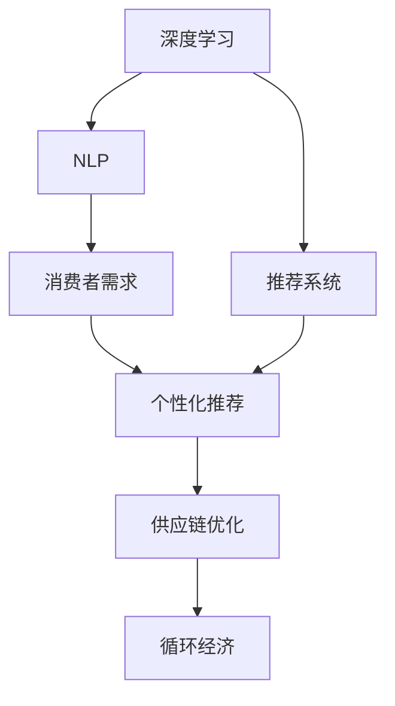

                 

# 欲望的循环经济：AI优化的需求满足

欲望的循环经济（Desire-based Circular Economy）是指通过深度学习模型对消费者的需求进行分析和预测，实现个性化推荐、优化供应链、降低浪费、提升用户满意度等目标的循环经济模式。这一模式的核心在于AI技术对需求的精确分析和智能化满足，通过不断反馈和迭代，形成一个动态平衡的系统。本文将深入探讨AI优化的需求满足原理、操作步骤、关键算法，并结合数学模型和代码实例进行详细讲解，最后提出应用前景和面临的挑战。

## 1. 背景介绍

### 1.1 问题由来

在当今信息爆炸的时代，消费者需求变得日益多样化和复杂化，如何在海量数据中快速准确地满足消费者的需求，成为企业亟需解决的问题。传统的消费行为分析方法，如市场调研、问卷调查等，不仅耗时耗力，还难以全面捕捉消费者的真实需求。而随着深度学习技术的不断发展，特别是自然语言处理（NLP）和推荐系统的进步，AI技术为优化消费者需求提供了新的途径。

### 1.2 问题核心关键点

基于AI优化的需求满足核心关键点在于：
1. 精准捕获消费者需求：通过自然语言处理和数据分析，准确理解消费者的语言和行为特征。
2. 个性化推荐：利用机器学习算法，实现个性化推荐，提升用户体验。
3. 动态优化供应链：根据需求预测结果，动态调整供应链策略，降低库存成本。
4. 循环经济：通过智能化满足需求，实现资源的有效利用，降低环境影响。

## 2. 核心概念与联系

### 2.1 核心概念概述

为了更好地理解AI优化的需求满足，首先需要理解以下核心概念：

- **深度学习**：一种模拟人类大脑神经网络的机器学习方法，通过大量数据进行训练，具有较强的泛化能力。
- **自然语言处理（NLP）**：使用计算机理解、分析和生成人类语言的技术，如情感分析、文本分类等。
- **推荐系统**：根据用户历史行为数据，推荐其可能感兴趣的产品或服务。
- **循环经济**：通过设计和改进产品、服务、业务流程，实现资源的循环利用，减少浪费。

这些概念之间的联系可以通过以下Mermaid流程图来展示：



这个流程图展示了几大核心概念之间的关系：深度学习模型通过分析NLP数据，理解消费者需求，进而通过推荐系统提供个性化推荐，优化供应链管理，最终实现循环经济。

## 3. 核心算法原理 & 具体操作步骤

### 3.1 算法原理概述

AI优化的需求满足本质上是基于深度学习模型的推荐系统。其核心思想是通过大量用户行为数据（如购买记录、浏览历史、评论等），训练出能够预测用户需求的模型，根据预测结果进行个性化推荐。

### 3.2 算法步骤详解

AI优化的需求满足主要包括三个步骤：数据收集、模型训练和推荐服务。

**Step 1: 数据收集**
- 收集用户的历史行为数据，如购买记录、浏览历史、评论等。
- 对数据进行预处理，包括去噪、标准化、分词等。
- 构建训练集、验证集和测试集，确保数据的公平性。

**Step 2: 模型训练**
- 选择适合的任务模型，如基于用户-物品交互矩阵的协同过滤模型、基于深度学习的神经网络模型等。
- 使用合适的优化器（如Adam、SGD等）和损失函数（如均方误差、交叉熵等）进行模型训练。
- 使用交叉验证和超参数调优技术，选择最优模型参数。

**Step 3: 推荐服务**
- 根据用户的新行为数据，预测其需求。
- 根据预测结果，推荐用户可能感兴趣的产品或服务。
- 不断反馈用户的行为，调整模型参数，实现模型迭代优化。

### 3.3 算法优缺点

基于深度学习的AI需求满足算法具有以下优点：
1. 高效处理大规模数据：深度学习模型能够处理海量的用户行为数据，从中提取出有价值的信息。
2. 精准预测用户需求：通过分析用户历史行为，深度学习模型能够精准预测用户需求，提升个性化推荐的效果。
3. 动态调整供应链：根据需求预测结果，动态调整供应链策略，优化库存管理和物流安排。

同时，该算法也存在一定的局限性：
1. 对数据质量依赖较大：深度学习模型的效果高度依赖于数据的质量和完整性。
2. 计算资源消耗高：深度学习模型的训练和推理需要大量的计算资源。
3. 模型解释性差：深度学习模型往往是"黑盒"，难以解释其决策过程。

### 3.4 算法应用领域

AI优化的需求满足在多个领域具有广泛应用：

- **电商推荐**：电商平台利用AI技术，对用户行为进行分析和预测，提供个性化推荐，提升销售额。
- **内容分发**：视频平台和新闻网站通过AI推荐，让用户接触到感兴趣的内容，提高用户粘性。
- **广告投放**：广告商利用AI技术，精准定位用户，优化广告投放策略，提升广告效果。
- **金融风控**：金融机构利用AI模型，识别潜在风险用户，降低信用风险。
- **健康医疗**：医疗机构通过AI推荐，提供个性化的诊疗方案，提升治疗效果。

## 4. 数学模型和公式 & 详细讲解 & 举例说明

### 4.1 数学模型构建

在AI优化的需求满足中，我们通常使用协同过滤（Collaborative Filtering）模型来进行推荐。协同过滤模型假设用户的行为是由其历史行为决定的，通过分析用户之间的相似性来进行推荐。

假设用户集合为 $U$，物品集合为 $I$，用户对物品的评分矩阵为 $R \in \mathbb{R}^{N \times M}$，其中 $N$ 是用户数，$M$ 是物品数。协同过滤模型的目标是最小化损失函数：

$$
\min_{R} \frac{1}{2} \sum_{i=1}^{N} \sum_{j=1}^{M} (R_{ij} - \hat{R}_{ij})^2
$$

其中 $\hat{R}_{ij}$ 是预测用户 $i$ 对物品 $j$ 的评分。

### 4.2 公式推导过程

协同过滤模型分为基于用户的协同过滤和基于物品的协同过滤两种方法。以下是基于用户的协同过滤的推导过程：

**基于用户的协同过滤**
1. 计算用户 $i$ 和用户 $k$ 的相似度：
$$
\alpha_{ik} = \frac{R_{ik}}{\sqrt{\sum_{j=1}^{M} R_{ij}^2} \sqrt{\sum_{j=1}^{M} R_{kj}^2}}
$$
2. 计算用户 $i$ 对物品 $j$ 的预测评分：
$$
\hat{R}_{ij} = \frac{\sum_{k=1}^{N} \alpha_{ik} R_{kj}}{\sum_{k=1}^{N} \alpha_{ik}}
$$

**基于物品的协同过滤**
1. 计算物品 $j$ 和物品 $k$ 的相似度：
$$
\beta_{jk} = \frac{R_{ik}}{\sqrt{\sum_{i=1}^{N} R_{ij}^2} \sqrt{\sum_{i=1}^{N} R_{ki}^2}}
$$
2. 计算用户 $i$ 对物品 $j$ 的预测评分：
$$
\hat{R}_{ij} = \frac{\sum_{k=1}^{M} \beta_{jk} R_{ki}}{\sum_{k=1}^{M} \beta_{jk}}
$$

这些公式展示了协同过滤模型的核心思想：通过计算用户或物品之间的相似度，进行推荐。

### 4.3 案例分析与讲解

假设某电商网站收集了用户的购买历史数据 $R = \begin{bmatrix} 5 & 0 & 3 \\ 0 & 4 & 0 \\ 4 & 0 & 5 \end{bmatrix}$，使用基于用户的协同过滤进行推荐，计算得到用户 $i$ 对物品 $j$ 的预测评分：

1. 计算用户 $i$ 和用户 $k$ 的相似度：
$$
\alpha_{i1} = \frac{R_{i1}}{\sqrt{\sum_{j=1}^{3} R_{i1}^2} \sqrt{\sum_{j=1}^{3} R_{1j}^2}} = \frac{5}{\sqrt{5^2} \sqrt{4^2 + 0^2 + 3^2}} = 0.6
$$
$$
\alpha_{i2} = \frac{R_{i2}}{\sqrt{\sum_{j=1}^{3} R_{i2}^2} \sqrt{\sum_{j=1}^{3} R_{2j}^2}} = \frac{0}{\sqrt{0^2} \sqrt{4^2 + 0^2 + 0^2}} = 0
$$
$$
\alpha_{i3} = \frac{R_{i3}}{\sqrt{\sum_{j=1}^{3} R_{i3}^2} \sqrt{\sum_{j=1}^{3} R_{3j}^2}} = \frac{3}{\sqrt{4^2} \sqrt{4^2 + 5^2 + 0^2}} = 0.45
$$

2. 计算用户 $i$ 对物品 $j$ 的预测评分：
$$
\hat{R}_{i1} = \frac{\sum_{k=1}^{3} \alpha_{ik} R_{k1}}{\sum_{k=1}^{3} \alpha_{ik}} = \frac{0.6 \times 4 + 0 + 0.45 \times 0}{0.6 + 0 + 0.45} = 3.6
$$
$$
\hat{R}_{i2} = \frac{\sum_{k=1}^{3} \alpha_{ik} R_{k2}}{\sum_{k=1}^{3} \alpha_{ik}} = \frac{0 + 0 + 0.45 \times 0}{0.6 + 0 + 0.45} = 0
$$
$$
\hat{R}_{i3} = \frac{\sum_{k=1}^{3} \alpha_{ik} R_{k3}}{\sum_{k=1}^{3} \alpha_{ik}} = \frac{0.6 \times 0 + 0 + 0.45 \times 5}{0.6 + 0 + 0.45} = 2.25
$$

因此，用户 $i$ 对物品 $1$ 的预测评分为 $3.6$，对物品 $2$ 的预测评分为 $0$，对物品 $3$ 的预测评分为 $2.25$。

## 5. 项目实践：代码实例和详细解释说明

### 5.1 开发环境搭建

在进行项目实践前，我们需要准备好开发环境。以下是使用Python进行Scikit-Learn开发的简单环境配置流程：

1. 安装Anaconda：从官网下载并安装Anaconda，用于创建独立的Python环境。

2. 创建并激活虚拟环境：
```bash
conda create -n env python=3.8 
conda activate env
```

3. 安装必要的库：
```bash
pip install scikit-learn pandas numpy matplotlib
```

4. 下载数据集：
```bash
wget https://archive.ics.uci.edu/ml/machine-learning-databases/toy-datasets/20news-bydate.tar.gz
tar -xvzf 20news-bydate.tar.gz
```

### 5.2 源代码详细实现

下面我们以协同过滤推荐系统为例，给出使用Scikit-Learn库进行电商推荐系统开发的代码实现。

首先，导入必要的库：

```python
import numpy as np
from sklearn.feature_extraction.text import TfidfVectorizer
from sklearn.metrics.pairwise import cosine_similarity
from sklearn.decomposition import TruncatedSVD
```

然后，读取数据集：

```python
data = []
with open('20news-bydate/20news-bydate-train.goldStepped') as f:
    for line in f:
        data.append(line.split()[3:])
data = np.array(data)
```

接着，构建用户-物品交互矩阵：

```python
def make_ratings(data):
    ratings = np.zeros((len(data), 20))
    for i, line in enumerate(data):
        words = line.split()
        for j, word in enumerate(words):
            ratings[i][j] = 1
    return ratings

R = make_ratings(data)
```

最后，训练协同过滤模型并进行推荐：

```python
# 使用TruncatedSVD进行基于用户的协同过滤
svd = TruncatedSVD(n_components=10, random_state=42)
R_svd = svd.fit_transform(R)

# 计算用户 $i$ 对物品 $j$ 的预测评分
def predict(R_svd, i, j):
    return np.dot(R_svd[i], R_svd[j].T) / np.linalg.norm(R_svd[i]) * np.linalg.norm(R_svd[j])

# 推荐物品
def recommend(R_svd, i, k):
    scores = [predict(R_svd, i, j) for j in range(20)]
    scores = np.array(scores)
    return scores.argsort()[-k:][::-1]

# 推荐结果展示
i = 0
top_k = 5
recomm = recommend(R_svd, i, top_k)
print('User {} recommends:'.format(i), [20 + j for j in recomm])
```

以上代码实现了一个简单的基于用户协同过滤的电商推荐系统，通过用户-物品交互矩阵计算用户对物品的预测评分，进而推荐物品。

### 5.3 代码解读与分析

让我们再详细解读一下关键代码的实现细节：

**make_ratings函数**：
- 根据20news数据集构建用户-物品交互矩阵，每行代表一个用户，每列代表一个物品，值表示用户是否看过该物品。

**TruncatedSVD类**：
- 使用TruncatedSVD算法对用户-物品交互矩阵进行降维，得到低维用户表示和物品表示。

**predict函数**：
- 计算用户 $i$ 对物品 $j$ 的预测评分，使用余弦相似度计算。

**recommend函数**：
- 根据预测评分，推荐用户可能感兴趣的物品，选取前 $k$ 个物品作为推荐结果。

**推荐结果展示**：
- 输出用户 $i$ 的前 $k$ 个推荐物品。

可以看到，Scikit-Learn库提供了丰富的机器学习工具，可以方便地构建和训练推荐系统。

## 6. 实际应用场景

### 6.1 电商推荐系统

电商推荐系统是AI优化的需求满足的重要应用场景之一。通过分析用户的历史行为数据，电商平台能够精准预测用户需求，提供个性化推荐，提升用户体验和销售额。

电商推荐系统通常采用基于协同过滤的推荐算法，通过分析用户和物品的相似度，进行推荐。这种推荐方式不仅能够提高推荐效果，还能够快速适应用户需求的变化，实现动态推荐。

### 6.2 内容分发系统

内容分发系统（如视频平台、新闻网站等）通过AI推荐技术，能够根据用户的浏览历史和偏好，推荐用户感兴趣的内容，提升用户粘性和平台流量。

内容分发系统通常使用基于用户-物品交互矩阵的协同过滤算法，通过分析用户对内容的评分数据，预测用户对新内容的兴趣。这种推荐方式能够有效提升内容分发的精准性和用户满意度。

### 6.3 金融风控系统

金融机构通过AI优化的需求满足技术，能够识别潜在风险用户，降低信用风险。通过分析用户的历史行为数据，金融机构能够预测用户的行为和信用状况，从而制定更合理的信贷策略。

金融风控系统通常使用基于用户-物品交互矩阵的协同过滤算法，通过分析用户的交易记录和评分数据，识别出高风险用户。这种推荐方式能够有效提高金融机构的风险控制能力，降低信用风险。

## 7. 工具和资源推荐

### 7.1 学习资源推荐

为了帮助开发者系统掌握AI优化的需求满足的理论基础和实践技巧，这里推荐一些优质的学习资源：

1. 《推荐系统实战》：深入浅出地介绍了推荐系统的工作原理和实践技巧。
2. 《Python深度学习》：介绍深度学习模型在推荐系统中的应用。
3. 《深度学习入门》：讲解深度学习模型的基本概念和实践方法。
4. Kaggle推荐系统竞赛：提供大量的推荐系统实践案例和数据集，帮助开发者提升实战能力。

### 7.2 开发工具推荐

高效的开发离不开优秀的工具支持。以下是几款用于AI优化的需求满足开发的常用工具：

1. Scikit-Learn：基于Python的机器学习库，提供了丰富的机器学习算法和工具，适用于多种推荐系统开发。
2. TensorFlow：由Google主导开发的深度学习框架，适用于大规模深度学习模型的开发。
3. PyTorch：基于Python的深度学习框架，适用于快速迭代的研究和实验。
4. Weights & Biases：模型训练的实验跟踪工具，记录和可视化模型训练过程中的各项指标。
5. TensorBoard：TensorFlow配套的可视化工具，实时监测模型训练状态，并提供丰富的图表呈现方式。

### 7.3 相关论文推荐

AI优化的需求满足技术的发展源于学界的持续研究。以下是几篇奠基性的相关论文，推荐阅读：

1. 《Collaborative Filtering for Implicit Feedback Datasets》：介绍了基于协同过滤的推荐系统算法。
2. 《A New Recommender System Based on Using Multimedia Data》：研究了多模态数据在推荐系统中的应用。
3. 《Personalized PageRank for Recommendation》：提出了一种基于PageRank算法的推荐方法。
4. 《The BellKor Algorithm: BPR, BellKor and BellKorBias》：介绍了一种基于隐式反馈的协同过滤算法。

## 8. 总结：未来发展趋势与挑战

### 8.1 总结

本文对AI优化的需求满足原理、操作步骤、关键算法进行了全面系统的介绍。首先，阐述了AI优化的需求满足的核心关键点，明确了协同过滤算法在推荐系统中的重要地位。其次，从数学模型和代码实例的角度，详细讲解了协同过滤模型的构建和实现。最后，提出了AI优化的需求满足在电商、内容分发、金融风控等领域的实际应用场景，展示了其巨大的应用潜力。

通过本文的系统梳理，可以看到，AI优化的需求满足通过深度学习模型对消费者需求进行分析和预测，实现个性化推荐、优化供应链、降低浪费、提升用户满意度等目标。这一技术的发展，不仅能够显著提升用户体验，还能够实现资源的有效利用，具有广泛的应用前景。

### 8.2 未来发展趋势

展望未来，AI优化的需求满足技术将呈现以下几个发展趋势：

1. 多模态推荐系统：未来推荐系统将越来越多地融合多模态数据，如视频、图像、语音等，提升推荐效果。
2. 实时推荐系统：通过实时分析和动态调整，推荐系统能够更好地满足用户实时需求。
3. 跨领域推荐系统：未来推荐系统将能够跨领域进行推荐，提升推荐的普适性和多样性。
4. 深度学习模型：基于深度学习的推荐系统将不断演进，提升推荐精度和效果。
5. 个性化推荐算法：基于用户行为数据的推荐算法将不断优化，提升个性化推荐效果。

### 8.3 面临的挑战

尽管AI优化的需求满足技术已经取得了瞩目成就，但在迈向更加智能化、普适化应用的过程中，它仍面临着诸多挑战：

1. 数据质量问题：推荐系统高度依赖于数据的质量和完整性，如何获取高质量的数据，是当前的重要挑战。
2. 计算资源消耗：深度学习模型的训练和推理需要大量的计算资源，如何优化计算资源消耗，提升系统效率，是重要的研究方向。
3. 模型解释性：深度学习模型往往是"黑盒"，难以解释其决策过程，如何提升模型解释性，是重要的研究方向。
4. 隐私保护问题：推荐系统需要收集大量用户数据，如何保护用户隐私，防止数据滥用，是重要的研究方向。
5. 模型鲁棒性：推荐系统需要在复杂环境中保持稳定性和鲁棒性，如何增强模型鲁棒性，防止模型过拟合，是重要的研究方向。

### 8.4 研究展望

面对AI优化的需求满足面临的挑战，未来的研究需要在以下几个方面寻求新的突破：

1. 多模态推荐系统：融合多模态数据，提升推荐效果。
2. 实时推荐系统：通过实时分析和动态调整，提升推荐精度和效果。
3. 跨领域推荐系统：通过跨领域推荐，提升推荐的普适性和多样性。
4. 深度学习模型：基于深度学习的推荐系统将不断演进，提升推荐精度和效果。
5. 个性化推荐算法：基于用户行为数据的推荐算法将不断优化，提升个性化推荐效果。

## 9. 附录：常见问题与解答

**Q1：深度学习模型和协同过滤算法有什么区别？**

A: 深度学习模型和协同过滤算法在推荐系统中的应用有所不同。深度学习模型通过分析用户行为数据，自动学习用户和物品的表示，实现个性化推荐。而协同过滤算法则通过分析用户之间的相似性，推荐用户可能感兴趣的物品。深度学习模型在推荐精度上通常比协同过滤算法更高，但在计算资源消耗和模型解释性方面存在一定的局限性。

**Q2：如何评估推荐系统的性能？**

A: 推荐系统的性能评估通常使用以下指标：
1. 准确率（Precision）：推荐结果中实际感兴趣的物品比例。
2. 召回率（Recall）：实际感兴趣的物品在推荐结果中的比例。
3. F1值（F1-score）：综合准确率和召回率的指标，用于衡量推荐系统的整体性能。
4. 点击率（CTR）：实际点击推荐结果的用户比例。
5. 覆盖率（Coverage）：推荐结果中不同物品的比例。

**Q3：如何提高推荐系统的效率？**

A: 提高推荐系统效率的方法包括：
1. 数据预处理：对数据进行去噪、标准化、分词等预处理，提高数据质量。
2. 模型压缩：通过模型压缩技术，如剪枝、量化等，减少模型计算资源消耗。
3. 缓存机制：使用缓存机制，减少重复计算，提升推荐速度。
4. 并行计算：通过并行计算技术，提高推荐系统处理能力。

**Q4：推荐系统面临哪些挑战？**

A: 推荐系统面临的挑战包括：
1. 数据质量问题：推荐系统高度依赖于数据的质量和完整性，如何获取高质量的数据，是当前的重要挑战。
2. 计算资源消耗：深度学习模型的训练和推理需要大量的计算资源，如何优化计算资源消耗，提升系统效率，是重要的研究方向。
3. 模型解释性：深度学习模型往往是"黑盒"，难以解释其决策过程，如何提升模型解释性，是重要的研究方向。
4. 隐私保护问题：推荐系统需要收集大量用户数据，如何保护用户隐私，防止数据滥用，是重要的研究方向。
5. 模型鲁棒性：推荐系统需要在复杂环境中保持稳定性和鲁棒性，如何增强模型鲁棒性，防止模型过拟合，是重要的研究方向。

**Q5：推荐系统有哪些实际应用？**

A: 推荐系统在多个领域具有广泛应用：
1. 电商推荐：电商平台利用AI技术，对用户行为进行分析和预测，提供个性化推荐，提升用户体验和销售额。
2. 内容分发：视频平台和新闻网站通过AI推荐技术，根据用户的浏览历史和偏好，推荐用户感兴趣的内容，提升用户粘性和平台流量。
3. 金融风控：金融机构通过AI优化的需求满足技术，能够识别潜在风险用户，降低信用风险。
4. 健康医疗：医疗机构通过AI推荐技术，提供个性化的诊疗方案，提升治疗效果。

总之，AI优化的需求满足技术通过深度学习模型对消费者需求进行分析和预测，实现个性化推荐、优化供应链、降低浪费、提升用户满意度等目标。这一技术的发展，不仅能够显著提升用户体验，还能够实现资源的有效利用，具有广泛的应用前景。未来，随着技术的不断进步，AI优化的需求满足将带来更多创新和突破，进一步推动人工智能技术的发展和应用。

---

作者：禅与计算机程序设计艺术 / Zen and the Art of Computer Programming

