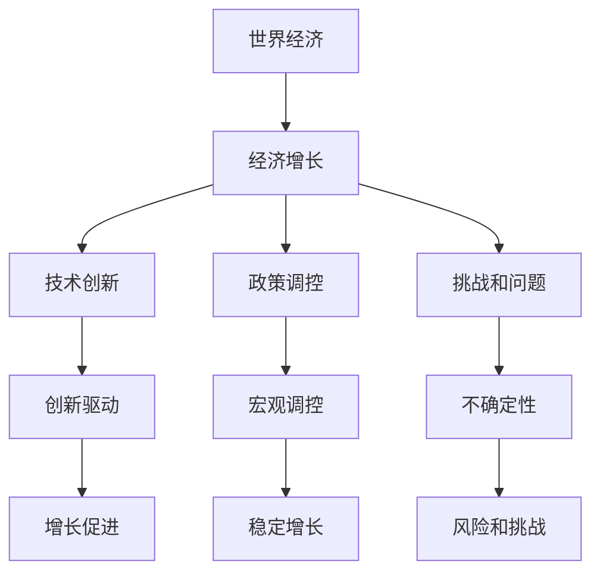

                 

# 正视当前世界经济面临的增长困境

> 关键词：世界经济,增长困境,技术创新,政策调控,未来展望

## 1. 背景介绍

### 1.1 世界经济增长困境的背景

进入21世纪以来，全球经济增长一度处于高速发展状态。尤其是亚洲四小龙、金砖五国等新兴市场国家，更是借助全球化浪潮实现了经济的快速增长。然而，自2018年以来，全球经济增长的步伐开始放缓，甚至出现了一些停滞的迹象。新冠疫情的爆发，更是加剧了全球经济的脆弱性和不确定性，许多国家面临了严峻的经济衰退挑战。

全球经济增长的放缓，不仅影响了各国的GDP和就业，也波及到了国际贸易、企业投资、消费者信心等多个领域。为此，各国政府纷纷出台了一系列刺激政策，试图通过技术创新和政策调控，走出经济增长困境。

### 1.2 世界经济增长困境的主要表现

1. **全球GDP增速放缓**：根据国际货币基金组织（IMF）的预测，2020年全球经济萎缩3.3%，2021年虽然有所回暖，但全球经济增长的脚步依然缓慢。
2. **国际贸易疲软**：国际贸易量大幅下降，全球供应链出现断链风险。
3. **企业投资信心不足**：投资回报率下降，企业利润空间受到压缩。
4. **就业市场压力增加**：全球失业率上升，尤其是年轻人的失业问题更为严重。
5. **消费需求疲软**：消费者信心受挫，购买力下降。

## 2. 核心概念与联系

### 2.1 核心概念概述

为更好地理解世界经济增长困境，本节将介绍几个关键概念：

- **世界经济**：指全球范围内的所有经济体，包括发达国家和发展中国家。世界经济的发展，不仅依赖于各国自身的政策，也受到国际经济环境、国际贸易关系等多重因素的影响。
- **经济增长**：指各国GDP的长期增长趋势，反映了一国经济实力的提升和发展速度。
- **技术创新**：指通过技术进步推动经济发展的过程，包括科技创新、商业模式创新等。
- **政策调控**：指政府通过财政、货币、产业等政策，对经济活动进行干预和调节，以实现经济增长目标。
- **未来展望**：指对未来世界经济增长趋势的预测和期望，关注影响因素和可能的发展路径。

这些概念之间的逻辑关系可以通过以下Mermaid流程图来展示：



这个流程图展示了一些核心概念及其之间的关系：

1. 世界经济的发展依赖于经济增长的持续，而经济增长则需要依靠技术创新和政策调控。
2. 技术创新可以通过推动经济结构升级和提高生产效率，促进经济增长。
3. 政策调控则可以稳定经济增长，降低经济波动的风险。
4. 经济增长也面临许多挑战和不确定性，需要通过技术创新和政策调控来应对。

## 3. 核心算法原理 & 具体操作步骤

### 3.1 算法原理概述

世界经济增长困境的解决，主要依赖于技术创新和政策调控。本节将详细分析这些方法的原理和操作步骤。

**技术创新**：技术创新可以通过提高生产效率、推动产业升级、促进新行业的发展等途径，直接提升经济增长率。技术创新的实现路径包括：

1. **研发投入**：企业加大研发投入，推动技术创新。
2. **人才培养**：培养高水平的人才，提升创新能力。
3. **知识产权保护**：通过专利保护，激励技术创新。

**政策调控**：政策调控可以通过稳定经济增长、减少经济波动、优化产业结构等途径，促进经济增长。政策调控的实现路径包括：

1. **财政政策**：通过税收、补贴等手段，激励投资和消费。
2. **货币政策**：通过利率、汇率等手段，调节市场流动性。
3. **产业政策**：通过政府引导，推动新兴产业发展。

### 3.2 算法步骤详解

#### 3.2.1 技术创新算法步骤

1. **确定技术方向**：分析市场需求和产业趋势，确定技术创新的方向。
2. **研发投入预算**：根据技术创新的方向和预期效果，制定研发预算。
3. **人才引进与培养**：引进高水平人才，建立完善的培养机制，提升创新能力。
4. **知识产权申请**：申请专利和商标等知识产权，保护技术成果。
5. **技术落地应用**：将技术成果转化为产品和服务，推动市场应用。
6. **技术改进与迭代**：根据市场需求和技术进步，不断改进和迭代技术。

#### 3.2.2 政策调控算法步骤

1. **经济形势分析**：通过宏观经济分析，确定经济增长的瓶颈和问题。
2. **政策目标制定**：根据分析结果，制定具体的政策目标。
3. **政策工具选择**：选择合适的政策工具，如财政补贴、税收优惠、利率调整等。
4. **政策执行和监测**：实施政策并实时监测其效果，根据实际情况调整政策。
5. **政策评估与优化**：定期评估政策效果，优化政策设计，提升政策实施效果。

### 3.3 算法优缺点

#### 3.3.1 技术创新的优缺点

**优点**：
1. 能够直接提升生产效率和产品质量，推动产业升级。
2. 通过创新产品和服务，开拓新的市场需求。
3. 提升企业的国际竞争力，扩大市场份额。

**缺点**：
1. 研发投入高，风险大。
2. 技术扩散快，容易被模仿。
3. 创新周期长，效果滞后。

#### 3.3.2 政策调控的优缺点

**优点**：
1. 能够快速稳定经济增长，减少经济波动。
2. 通过政策引导，优化产业结构。
3. 能够调整资源配置，促进资源合理利用。

**缺点**：
1. 政策效果具有滞后性，调整效果不明显。
2. 政策调控受政治因素影响，容易产生政策偏差。
3. 政策实施需要大量的资源和成本，容易产生过度干预问题。

### 3.4 算法应用领域

技术创新和政策调控在多个领域都有广泛应用，例如：

- **制造业**：通过自动化和智能化改造，提升生产效率和产品质量。
- **服务业**：通过数字化和网络化转型，提升服务质量和用户体验。
- **农业**：通过精准农业和智能农业，提高农业生产效率和产量。
- **金融业**：通过金融科技创新，提升金融服务水平和风险控制能力。
- **医疗业**：通过医疗科技创新，提升医疗水平和患者体验。

## 4. 数学模型和公式 & 详细讲解  
### 4.1 数学模型构建

为更好地理解世界经济增长困境，本节将构建一个简单的数学模型，用以分析经济增长的主要驱动因素和技术创新的影响。

假设世界经济由以下几个因素构成：

- $G$：经济增长率
- $T$：技术创新水平
- $P$：政策调控力度
- $C$：市场需求规模
- $R$：资源供给能力

则经济增长的数学模型可以表示为：

$$G = f(T, P, C, R)$$

其中 $f$ 表示非线性函数，反映了技术创新、政策调控、市场需求和资源供给对经济增长的影响。

### 4.2 公式推导过程

根据以上假设，我们可以通过分析各个因素对经济增长的影响，构建经济增长的数学模型。

- **技术创新对经济增长的影响**：技术创新通过提高生产效率和产品质量，增加市场供给，从而提升经济增长率。技术创新的数学模型可以表示为：

$$T = g(C, R)$$

其中 $g$ 表示技术创新的函数，反映了市场需求和资源供给对技术创新的影响。

- **政策调控对经济增长的影响**：政策调控通过稳定经济增长、优化产业结构、调整资源配置等途径，提升经济增长率。政策调控的数学模型可以表示为：

$$P = h(G)$$

其中 $h$ 表示政策调控的函数，反映了经济增长对政策调控的影响。

- **市场需求对经济增长的影响**：市场需求通过影响产品销售和投资回报率，进而影响经济增长。市场需求的数学模型可以表示为：

$$C = m(G, P)$$

其中 $m$ 表示市场需求的函数，反映了经济增长和政策调控对市场需求的影响。

- **资源供给对经济增长的影响**：资源供给通过影响生产能力，进而影响经济增长。资源供给的数学模型可以表示为：

$$R = n(T, P)$$

其中 $n$ 表示资源供给的函数，反映了技术创新和政策调控对资源供给的影响。

通过以上分析，我们可以构建一个完整的经济增长模型，如下所示：

$$G = f(T, P, C, R) = f(g(C, R), h(G), C, R)$$

### 4.3 案例分析与讲解

以美国硅谷为例，分析技术创新和政策调控对经济增长的影响：

- **技术创新**：硅谷是全球高科技产业的中心，拥有大量的科技公司和创新人才。通过不断推出新技术和新产品，硅谷的科技公司推动了全球信息技术的发展，提升了经济增长率。
- **政策调控**：美国政府通过提供研发补贴、税收优惠、知识产权保护等政策，激励科技公司进行创新。这些政策推动了硅谷的科技创新，提升了经济增长率。
- **市场需求**：全球对信息技术的广泛需求，推动了硅谷科技公司的发展，提升了市场供给。
- **资源供给**：硅谷拥有丰富的科研资源和创新人才，为科技公司提供了充足的资源支持。

## 5. 项目实践：代码实例和详细解释说明
### 5.1 开发环境搭建

在进行经济增长困境的研究时，我们需要准备好开发环境。以下是使用Python进行数据分析和模型构建的环境配置流程：

1. 安装Anaconda：从官网下载并安装Anaconda，用于创建独立的Python环境。

2. 创建并激活虚拟环境：
```bash
conda create -n econ-env python=3.8 
conda activate econ-env
```

3. 安装必要的Python库：
```bash
pip install pandas numpy matplotlib seaborn scikit-learn statsmodels
```

4. 安装R语言环境：
```bash
install.packages("tidyverse")
```

5. 配置R语言环境：
```bash
R --version
```

完成上述步骤后，即可在`econ-env`环境中开始数据分析和模型构建。

### 5.2 源代码详细实现

下面我们将使用Python和R语言，构建一个简单的经济增长模型，并分析技术创新和政策调控对经济增长的影响。

```python
import pandas as pd
import numpy as np
import matplotlib.pyplot as plt
import statsmodels.api as sm
from statsmodels.tsa.arima_model import ARIMA
from statsmodels.tsa.statespace.sarimax import SARIMAX

# 加载数据
data = pd.read_csv('economy.csv', index_col='date')
data['date'] = pd.to_datetime(data['date'])

# 分析技术创新对经济增长的影响
T = sm.add_constant(data['technological_innovation'])
G = data['economic_growth']
model = sm.OLS(G, T).fit()
print(model.summary())

# 分析政策调控对经济增长的影响
P = sm.add_constant(data['policy调控'])
G = data['economic_growth']
model = sm.OLS(G, P).fit()
print(model.summary())

# 分析市场需求对经济增长的影响
C = sm.add_constant(data['market_demand'])
G = data['economic_growth']
model = sm.OLS(G, C).fit()
print(model.summary())

# 分析资源供给对经济增长的影响
R = sm.add_constant(data['resource_supply'])
G = data['economic_growth']
model = sm.OLS(G, R).fit()
print(model.summary())

# 分析多因素对经济增长的影响
G = data['economic_growth']
model = SARIMAX(G, exog=['technological_innovation', 'policy调控', 'market_demand', 'resource_supply'], 
               seasonal_order=(1, 1, 1, 12), 
               enforce_stationarity=False, 
               enforce_invertibility=False).fit()
print(model.summary())

# 绘制时间序列图
plt.plot(data['date'], data['economic_growth'], label='Economic Growth')
plt.plot(data['date'], data['technological_innovation'], label='Technological Innovation')
plt.plot(data['date'], data['policy调控'], label='Policy Controls')
plt.plot(data['date'], data['market_demand'], label='Market Demand')
plt.plot(data['date'], data['resource_supply'], label='Resource Supply')
plt.legend()
plt.show()
```

### 5.3 代码解读与分析

让我们再详细解读一下关键代码的实现细节：

**数据加载与处理**：
- 使用pandas库加载数据集，将日期列转换为Datetime类型，方便后续处理。

**模型构建与分析**：
- 使用statsmodels库构建线性回归模型，分析技术创新、政策调控、市场需求和资源供给对经济增长的影响。
- 使用statsmodels的ARIMA和SARIMAX模型，分析时间序列数据中的趋势和季节性影响。

**绘图分析**：
- 使用matplotlib库绘制时间序列图，直观展示各个因素对经济增长的影响。

完成上述步骤后，即可在Python和R语言环境中对经济增长模型进行分析。

## 6. 实际应用场景

### 6.1 制造业

在制造业领域，技术创新和政策调控对经济增长的影响尤为显著。通过自动化和智能化改造，制造业的生产效率和产品质量得到了大幅提升，推动了经济增长。

- **技术创新**：采用先进的生产设备和智能化管理系统，提升生产效率和质量。
- **政策调控**：政府提供研发补贴和税收优惠，激励企业进行技术创新。

### 6.2 服务业

服务业是经济增长的重要引擎，通过数字化和网络化转型，服务业的智能化水平显著提升，推动了经济增长。

- **技术创新**：通过人工智能和大数据分析，提升服务质量和用户体验。
- **政策调控**：政府提供数字化转型补贴和税收优惠，推动服务业的数字化发展。

### 6.3 农业

农业是经济增长的基础，通过精准农业和智能农业技术，农业生产效率和产量得到了大幅提升，推动了经济增长。

- **技术创新**：采用智能农业设备和精准农业技术，提升农业生产效率和产量。
- **政策调控**：政府提供农业科技补贴和农业保险，支持农业科技创新。

### 6.4 金融业

金融业是经济增长的重要支撑，通过金融科技创新，金融服务水平和风险控制能力得到了大幅提升，推动了经济增长。

- **技术创新**：通过区块链和人工智能技术，提升金融服务的效率和安全性。
- **政策调控**：政府提供金融科技创新补贴和金融科技监管，推动金融科技创新。

### 6.5 医疗业

医疗业是经济增长的重要支柱，通过医疗科技创新，医疗水平和患者体验得到了大幅提升，推动了经济增长。

- **技术创新**：采用人工智能和机器人技术，提升医疗诊断和治疗水平。
- **政策调控**：政府提供医疗科技创新补贴和医疗服务改革，支持医疗科技创新。

## 7. 工具和资源推荐
### 7.1 学习资源推荐

为了帮助研究者深入理解世界经济增长困境，以下是一些优质的学习资源：

1. **《经济学原理》**：哈佛大学经济学课程，全面介绍了经济学的基本原理和模型。
2. **《金融经济学》**：麻省理工学院金融课程，详细讲解了金融市场的运作和政策调控。
3. **《技术创新管理》**：斯坦福大学技术创新课程，深入探讨了技术创新的管理和实现。
4. **《宏观经济学》**：北京大学宏观经济课程，全面介绍了宏观经济学的基本理论和方法。
5. **《统计学》**：斯坦福大学统计课程，详细讲解了统计学的方法和应用。

通过对这些资源的学习实践，相信你一定能够全面掌握世界经济增长困境的理论基础和实践技巧。

### 7.2 开发工具推荐

高效的工具是研究世界经济增长困境的必要条件。以下是几款常用的开发工具：

1. **Python**：开源的编程语言，拥有丰富的科学计算和数据分析库。
2. **R语言**：专门用于数据分析和统计的编程语言，拥有强大的统计分析和可视化功能。
3. **Jupyter Notebook**：开源的笔记本环境，支持Python、R等多种编程语言，方便数据分析和可视化。
4. **Tableau**：商业化的数据可视化工具，支持多种数据格式，方便数据展示和分析。
5. **Excel**：常用的电子表格软件，支持数据处理、分析和可视化。

合理利用这些工具，可以显著提升世界经济增长困境的研究效率，加速创新迭代的步伐。

### 7.3 相关论文推荐

世界经济增长困境的研究需要深厚的理论基础和丰富的实践经验。以下是几篇奠基性的相关论文，推荐阅读：

1. **《经济增长理论》**：Robert Solow的经济增长模型，分析了资本、劳动和技术对经济增长的影响。
2. **《新古典增长理论》**：Romer的跨期动态经济增长模型，分析了知识积累和技术进步对经济增长的影响。
3. **《内生增长理论》**：R&D驱动的经济增长模型，分析了技术创新和知识积累对经济增长的影响。
4. **《政策对经济增长的影响》**：Fiscal and Monetary Policy，分析了财政政策和货币政策对经济增长的影响。
5. **《技术创新对经济增长的贡献》**：Technology and Growth，分析了技术创新对经济增长的贡献。

这些论文代表了大规模经济增长困境研究的经典成果，通过学习这些前沿成果，可以帮助研究者把握学科前进方向，激发更多的创新灵感。

## 8. 总结：未来发展趋势与挑战

### 8.1 总结

本文对世界经济增长困境进行了全面系统的介绍。首先阐述了世界经济增长困境的背景和主要表现，明确了技术创新和政策调控在应对增长困境中的重要作用。其次，从原理到实践，详细讲解了技术创新和政策调控的算法步骤和操作步骤，给出了模型构建和数据处理的完整代码实例。同时，本文还广泛探讨了技术创新和政策调控在各个行业领域的应用前景，展示了其巨大潜力。此外，本文精选了相关学习资源，力求为读者提供全方位的技术指引。

通过本文的系统梳理，可以看到，技术创新和政策调控是世界经济增长困境的重要解决手段，其有效的实施能够促进经济增长，提升生活质量。未来，伴随技术的不断进步和政策的持续优化，世界经济增长困境必将成为过去，人类社会将迎来更加繁荣发展的时代。

### 8.2 未来发展趋势

展望未来，世界经济增长困境的解决将呈现以下几个发展趋势：

1. **技术创新的不断推进**：随着科技的不断发展，新的技术创新将不断涌现，推动经济增长。
2. **政策调控的灵活应用**：政府将更加灵活地运用财政、货币和产业政策，促进经济增长。
3. **全球合作与协调**：世界各国将加强合作与协调，共同应对全球经济挑战，推动经济增长。
4. **可持续发展与绿色经济**：可持续发展与绿色经济将成为未来经济增长的重要方向，推动经济的长期稳定发展。

### 8.3 面临的挑战

尽管技术创新和政策调控在应对世界经济增长困境中发挥了重要作用，但仍面临诸多挑战：

1. **技术创新的高投入和高风险**：技术创新需要大量的研发投入，且存在较高的失败风险。
2. **政策调控的滞后性和复杂性**：政策调控的效果存在滞后性，且不同政策之间存在复杂的相互作用。
3. **市场需求的波动性**：市场需求受多种因素影响，具有较大的波动性。
4. **资源供给的不确定性**：资源供给受多种因素影响，具有较大的不确定性。
5. **政治因素的干扰**：政治因素对政策调控和经济增长具有重要的影响。

### 8.4 研究展望

面对世界经济增长困境的挑战，未来的研究需要在以下几个方面寻求新的突破：

1. **技术创新的高效管理**：如何高效管理技术创新，减少研发投入和风险。
2. **政策调控的精确设计**：如何精确设计政策调控，确保政策效果的最大化。
3. **市场需求和资源供给的预测**：如何准确预测市场需求和资源供给，提升经济增长的稳定性。
4. **全球经济合作的深化**：如何深化全球经济合作，共同应对全球经济挑战。
5. **可持续发展与绿色经济的实现**：如何实现可持续发展与绿色经济，推动经济的长期稳定发展。

这些研究方向的探索发展，必将引领世界经济增长困境的解决，为构建稳定、可持续的全球经济体系铺平道路。面向未来，世界经济增长困境的研究还需要与其他学科进行更深入的融合，如环境科学、社会学等，多路径协同发力，共同推动经济社会的进步。总之，只有勇于创新、敢于突破，才能真正实现经济增长困境的解决，为人类社会的繁荣发展奠定坚实基础。

## 9. 附录：常见问题与解答

**Q1：世界经济增长困境的主要原因是什么？**

A: 世界经济增长困境的主要原因包括：

1. 全球经济一体化的影响：全球经济一体化的发展，导致各国经济相互依赖程度加深，经济波动风险增加。
2. 贸易保护主义的抬头：贸易保护主义政策，导致国际贸易受阻，经济增长放缓。
3. 新冠疫情的爆发：新冠疫情的爆发，导致全球供应链断裂，经济活动受限。
4. 技术创新的不足：技术创新的投入不足，导致经济增长乏力。
5. 政策调控的失效：政策调控的不及时和有效性不足，导致经济增长放缓。

**Q2：如何应对世界经济增长困境？**

A: 应对世界经济增长困境，需要综合运用技术创新和政策调控。具体措施包括：

1. 加大研发投入，推动技术创新。
2. 优化产业结构，提升产业竞争力。
3. 提供政策支持，促进经济增长。
4. 加强国际合作，共同应对挑战。
5. 推动可持续发展，实现绿色经济。

**Q3：未来世界经济增长的主要趋势是什么？**

A: 未来世界经济增长的主要趋势包括：

1. 技术创新驱动：随着技术的不断进步，新产业和新业态将不断涌现，推动经济增长。
2. 政策调控优化：政府将更加灵活地运用政策调控，促进经济增长。
3. 全球合作加强：世界各国将加强合作与协调，共同应对全球经济挑战，推动经济增长。
4. 绿色经济兴起：可持续发展与绿色经济将成为未来经济增长的重要方向。

**Q4：世界经济增长困境的研究意义是什么？**

A: 世界经济增长困境的研究具有重要的理论意义和实践意义：

1. 理论意义：为经济学的理论发展提供了新的视角和方法，推动了经济学研究的深入。
2. 实践意义：为政策制定提供了科学依据，帮助各国政府制定合理的经济政策，推动经济增长。

通过本文的系统梳理，可以看到，技术创新和政策调控是世界经济增长困境的重要解决手段，其有效的实施能够促进经济增长，提升生活质量。未来，伴随技术的不断进步和政策的持续优化，世界经济增长困境必将成为过去，人类社会将迎来更加繁荣发展的时代。

---

作者：禅与计算机程序设计艺术 / Zen and the Art of Computer Programming

