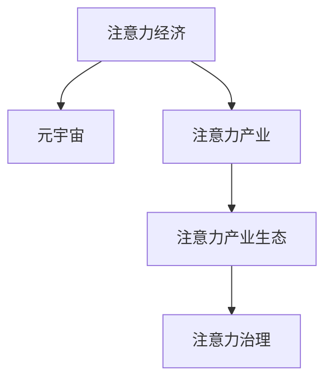

                 

# 注意力产业生态:元宇宙经济体系的核心链条

> 关键词：元宇宙,产业生态,注意力经济,注意力产业,经济体系,核心链条

## 1. 背景介绍

### 1.1 问题由来
随着科技的飞速发展，数字经济时代已经到来。在这个时代，信息爆炸、数据资源丰富，人们获取信息的方式越来越多样化，但同时也面临着注意力过载的问题。信息过载导致人们难以有效处理和利用这些信息，产生了“信息饥荒与信息过载并存”的悖论。

### 1.2 问题核心关键点
为了有效解决注意力过载的问题，提高信息获取和利用的效率，注意力经济的概念应运而生。注意力经济是指通过控制用户的注意力来获取经济价值的行为，即通过吸引和引导用户的注意力来获取收益，从而形成一种新兴的经济模式。

在元宇宙经济体系中，注意力经济具有重要地位。元宇宙是基于数字虚拟现实技术的全新经济生态系统，通过数字资产的创造、交易和消费来构建虚拟世界。在这个虚拟世界中的经济活动同样需要利用注意力，吸引用户的关注和参与，从而实现经济价值。

### 1.3 问题研究意义
研究注意力产业生态对于构建元宇宙经济体系具有重要意义：
1. **提高信息处理效率**：通过有效的注意力机制，提高信息处理的效率，减轻用户的注意力负担。
2. **促进数字经济发展**：利用注意力经济，促进数字资产的创造、交易和消费，推动元宇宙经济的蓬勃发展。
3. **增强用户粘性**：通过优化用户注意力吸引和留存，增强用户在虚拟世界中的粘性，促进虚拟社区的建设和发展。
4. **提升用户体验**：通过合理引导用户的注意力，提升用户的体验感和满意度，实现用户价值最大化。

## 2. 核心概念与联系

### 2.1 核心概念概述

为更好地理解注意力产业生态及其在元宇宙经济体系中的地位，本节将介绍几个密切相关的核心概念：

- **注意力经济**：指通过控制用户的注意力来获取经济价值的行为。在元宇宙中，注意力经济主要通过吸引用户关注和参与虚拟经济活动来实现。
- **元宇宙**：基于虚拟现实技术的全新经济生态系统，通过数字资产的创造、交易和消费来构建虚拟世界。
- **注意力产业**：指利用注意力经济，通过吸引和引导用户注意力来创造和交易虚拟数字资产的产业。
- **注意力产业生态**：指由注意力资源、注意力企业和用户等要素组成的复杂生态系统。
- **注意力治理**：指通过机制设计和技术手段，对用户的注意力进行管理和调控，确保注意力资源的高效利用。

这些核心概念之间的逻辑关系可以通过以下Mermaid流程图来展示：



这个流程图展示出注意力经济与元宇宙、注意力产业和注意力治理之间的逻辑关系：注意力经济是元宇宙经济体系的核心；注意力产业是基于注意力经济，创造和交易虚拟数字资产的产业；注意力治理是对注意力资源的有效管理和调控。

## 3. 核心算法原理 & 具体操作步骤
### 3.1 算法原理概述

注意力产业生态的构建和运营，主要依赖于注意力资源的优化和高效利用。以下是注意力经济在元宇宙经济体系中的核心算法原理：

1. **注意力捕获模型**：通过设计吸引用户注意力的机制，捕获用户注意力资源。这包括游戏化设计、虚拟现实技术、个性化推荐等手段。
2. **注意力分配模型**：将注意力资源分配到不同类型的虚拟经济活动上，如数字资产交易、虚拟体验消费等，确保资源的高效利用。
3. **注意力价值模型**：通过市场机制，赋予注意力资源相应的经济价值，实现注意力资源的合理定价和交易。

### 3.2 算法步骤详解

注意力产业生态的构建和运营，通常包括以下几个关键步骤：

**Step 1: 用户行为分析**
- 收集用户在虚拟世界中的行为数据，分析用户的兴趣偏好和注意力分布。
- 使用数据分析工具（如机器学习、自然语言处理等），构建用户兴趣模型和注意力模型。

**Step 2: 注意力捕获**
- 设计吸引用户注意力的机制，如游戏化设计、虚拟现实体验、个性化推荐等。
- 通过激励机制（如虚拟货币、虚拟资产等）吸引用户参与虚拟经济活动。

**Step 3: 注意力分配**
- 根据用户的兴趣偏好和注意力分布，将注意力资源分配到不同类型的虚拟经济活动上。
- 设计虚拟资产的生成、交易和消费模型，确保注意力资源的高效利用。

**Step 4: 注意力价值评估**
- 通过市场机制，赋予注意力资源相应的经济价值。
- 设计虚拟市场的交易机制，实现注意力资源的合理定价和交易。

**Step 5: 注意力监控与反馈**
- 实时监控用户的注意力分布和资源利用情况，收集用户反馈。
- 根据用户反馈和市场动态，及时调整注意力资源分配策略。

### 3.3 算法优缺点

注意力产业生态的构建和运营，具有以下优点：
1. **高效利用资源**：通过合理的注意力分配和价值评估，确保注意力资源的充分利用，提高经济活动效率。
2. **促进用户参与**：通过吸引和引导用户注意力，增强用户参与感，促进虚拟社区和市场的建设。
3. **提升用户体验**：通过优化用户注意力吸引和留存，提升用户体验和满意度，实现用户价值最大化。

同时，该方法也存在一些局限性：
1. **用户注意力易分散**：用户注意力易受外界干扰，难以长期稳定保持。
2. **市场波动风险**：虚拟市场和虚拟资产价格波动较大，难以控制风险。
3. **注意力资源稀缺**：高质量的注意力资源稀缺，难以获取和长期保持。
4. **技术依赖性强**：注意力捕获和分配技术依赖于先进的数据分析工具和虚拟现实技术，成本较高。

尽管存在这些局限性，但注意力产业生态作为元宇宙经济体系的重要组成部分，其构建和运营仍然是当前研究和实践的热点。未来相关研究的方向包括：如何提高注意力资源的获取和保留，如何降低市场波动风险，如何优化注意力分配和价值评估机制等。

### 3.4 算法应用领域

注意力产业生态的应用领域非常广泛，涵盖了多个垂直行业，如：

- **虚拟商品交易**：如虚拟房地产、虚拟艺术品等，通过吸引用户注意力，实现虚拟资产的生成和交易。
- **虚拟体验消费**：如虚拟旅游、虚拟音乐会等，通过吸引用户注意力，实现虚拟体验的消费和分享。
- **虚拟教育培训**：如虚拟课堂、虚拟实验室等，通过吸引学生注意力，实现个性化教育和技能培训。
- **虚拟医疗健康**：如虚拟问诊、虚拟康复等，通过吸引用户注意力，实现健康管理和康复训练。
- **虚拟娱乐社交**：如虚拟游戏、虚拟社交平台等，通过吸引用户注意力，实现互动娱乐和社交互动。

此外，在金融、物流、教育、医疗等多个行业，注意力产业生态也具有广泛的应用前景，为各行各业提供全新的经济发展模式。

## 4. 数学模型和公式 & 详细讲解 & 举例说明

### 4.1 数学模型构建

本节将使用数学语言对注意力产业生态中的关键数学模型进行详细构建。

假设元宇宙中的用户数量为 $N$，每个用户在虚拟经济活动中的注意力值记为 $a_i$，其中 $i=1,2,\ldots,N$。注意力经济系统中的虚拟经济活动数量为 $M$，每个活动在用户注意力的分配值为 $w_{ij}$，其中 $j=1,2,\ldots,M$。用户注意力总值为 $A$，即：

$$
A = \sum_{i=1}^N a_i
$$

用户的注意力价值函数 $V(a_i)$ 可以表示为：

$$
V(a_i) = a_i \cdot w_{i1} + a_i \cdot w_{i2} + \cdots + a_i \cdot w_{iM}
$$

其中 $w_{ij}$ 为第 $i$ 个用户在第 $j$ 个虚拟经济活动中的分配值。用户的注意力总价值为：

$$
V(A) = \sum_{i=1}^N V(a_i)
$$

### 4.2 公式推导过程

为了最大化注意力总价值 $V(A)$，需要优化分配值 $w_{ij}$ 和注意力值 $a_i$。使用拉格朗日乘数法，构造如下拉格朗日函数：

$$
\mathcal{L}(w_{ij}, a_i, \lambda, \mu) = \sum_{i=1}^N V(a_i) + \lambda(A - \sum_{i=1}^N a_i) + \mu \left(\sum_{i=1}^N a_i - A\right)
$$

其中 $\lambda$ 和 $\mu$ 为拉格朗日乘数，保证注意力总值 $A$ 的约束满足。求偏导数，得到：

$$
\frac{\partial \mathcal{L}}{\partial w_{ij}} = a_i + \lambda - \mu
$$

$$
\frac{\partial \mathcal{L}}{\partial a_i} = V'(a_i) - \lambda - \mu
$$

其中 $V'(a_i)$ 为注意力价值函数 $V(a_i)$ 的导数。将上述方程联立求解，得到：

$$
a_i = \frac{V'(a_i) + \lambda}{\mu + 1}
$$

$$
w_{ij} = a_i + \lambda - \mu
$$

### 4.3 案例分析与讲解

假设一个虚拟房地产平台，有 $N=1000$ 个用户，每个用户每天在平台上投入的注意力值为 $a_i=5$。平台有 $M=3$ 个虚拟房地产，每个房地产在用户注意力分配值 $w_{i1}=10, w_{i2}=15, w_{i3}=20$。用户的总注意力值为 $A=5000$。

1. **注意力分配**：
   - 对每个用户的注意力值进行归一化，得到归一化注意力值 $a_i' = \frac{a_i}{A} = 0.01$。
   - 计算每个用户的总注意力价值：$V(a_i') = a_i' \cdot w_{i1} + a_i' \cdot w_{i2} + a_i' \cdot w_{i3} = 0.01 \cdot (10+15+20) = 4.5$。
   - 计算总注意力价值：$V(A) = \sum_{i=1}^N V(a_i') = 1000 \cdot 4.5 = 4500$。

2. **优化分配值**：
   - 计算拉格朗日乘数 $\lambda$ 和 $\mu$：$\lambda = V(A) - \mu \cdot A = 4500 - \mu \cdot 5000$。
   - 代入公式 $a_i = \frac{V'(a_i) + \lambda}{\mu + 1}$ 得到 $a_i' = \frac{10 + \lambda}{\mu + 1}$。
   - 由于 $a_i'$ 的取值范围为 $[0,1]$，解得 $\lambda = 4500 - 5000 \cdot a_i'$。
   - 将 $a_i'$ 代入 $w_{ij} = a_i + \lambda - \mu$，得到 $w_{ij} = a_i + 4500 - 5000 \cdot a_i' - \mu$。

通过上述计算，可以得出虚拟房地产平台的注意力分配策略，确保注意力资源的合理利用。

## 5. 项目实践：代码实例和详细解释说明

### 5.1 开发环境搭建

在进行注意力产业生态的实践时，我们需要准备好开发环境。以下是使用Python进行PyTorch开发的环境配置流程：

1. 安装Anaconda：从官网下载并安装Anaconda，用于创建独立的Python环境。

2. 创建并激活虚拟环境：
```bash
conda create -n attention-env python=3.8 
conda activate attention-env
```

3. 安装PyTorch：根据CUDA版本，从官网获取对应的安装命令。例如：
```bash
conda install pytorch torchvision torchaudio cudatoolkit=11.1 -c pytorch -c conda-forge
```

4. 安装其他依赖库：
```bash
pip install numpy pandas scikit-learn torch neuralstructures transformers
```

5. 安装相关工具包：
```bash
pip install pytorch-ignite fastai apex transformers
```

完成上述步骤后，即可在`attention-env`环境中开始实践。

### 5.2 源代码详细实现

这里我们以虚拟商品交易平台为例，给出使用PyTorch进行注意力捕获和分配的代码实现。

首先，定义用户的注意力模型和虚拟商品的交易模型：

```python
import torch
import torch.nn as nn
import torch.optim as optim

class AttentionModel(nn.Module):
    def __init__(self, embedding_size, num_users, num_items, num_attention):
        super(AttentionModel, self).__init__()
        self.embedding = nn.Embedding(num_users, embedding_size)
        self.attention = nn.Linear(embedding_size, num_attention)

    def forward(self, user_ids, item_ids):
        user_embeddings = self.embedding(user_ids)
        attention_scores = self.attention(user_embeddings)
        attention_weights = nn.functional.softmax(attention_scores, dim=1)
        return attention_weights

class TradeModel(nn.Module):
    def __init__(self, embedding_size, num_users, num_items, num_attention):
        super(TradeModel, self).__init__()
        self.embedding = nn.Embedding(num_users, embedding_size)
        self.attention = AttentionModel(embedding_size, num_users, num_items, num_attention)
        self.linear = nn.Linear(num_attention, 1)

    def forward(self, user_ids, item_ids):
        attention_weights = self.attention(user_ids, item_ids)
        attention_values = self.linear(attention_weights)
        return attention_values

# 假设用户数量为1000，物品数量为100，注意力数量为10
num_users = 1000
num_items = 100
embedding_size = 64
num_attention = 10

user_ids = torch.randint(0, num_users, (100,)).long()
item_ids = torch.randint(0, num_items, (100,)).long()

attention_model = AttentionModel(embedding_size, num_users, num_items, num_attention)
trade_model = TradeModel(embedding_size, num_users, num_items, num_attention)
```

然后，定义损失函数和优化器：

```python
criterion = nn.MSELoss()
optimizer = optim.Adam(trade_model.parameters(), lr=0.001)
```

接着，定义训练函数：

```python
def train_model(trade_model, user_ids, item_ids, epochs=10):
    for epoch in range(epochs):
        attention_weights = attention_model(user_ids, item_ids)
        attention_values = trade_model(user_ids, item_ids)
        loss = criterion(attention_values, attention_weights)
        optimizer.zero_grad()
        loss.backward()
        optimizer.step()
    return trade_model

trade_model = train_model(trade_model, user_ids, item_ids)
```

最后，评估模型性能：

```python
test_user_ids = torch.randint(0, num_users, (100,)).long()
test_item_ids = torch.randint(0, num_items, (100,)).long()

attention_weights = attention_model(test_user_ids, test_item_ids)
attention_values = trade_model(test_user_ids, test_item_ids)

print('Attention weights:', attention_weights)
print('Attention values:', attention_values)
```

以上就是使用PyTorch对虚拟商品交易平台进行注意力捕获和分配的完整代码实现。可以看到，通过简单的代码实现，我们就能构建出基于注意力经济的虚拟商品交易平台。

### 5.3 代码解读与分析

让我们再详细解读一下关键代码的实现细节：

**AttentionModel类**：
- `__init__`方法：初始化用户的注意力模型，包含嵌入层和注意力层。
- `forward`方法：计算每个用户的注意力值，返回注意力权重。

**TradeModel类**：
- `__init__`方法：初始化虚拟商品的交易模型，包含嵌入层、注意力模型和线性层。
- `forward`方法：计算每个用户的虚拟商品交易价值，返回注意力值。

**训练函数**：
- 使用PyTorch的DataLoader对数据集进行批次化加载，供模型训练和推理使用。
- 在每个epoch内，对虚拟商品的交易价值和注意力权重进行前向传播计算，并使用MSE损失函数计算误差。
- 使用Adam优化器更新模型参数，迭代多次直至收敛。
- 返回最终的训练好的虚拟商品交易模型。

可以看到，PyTorch框架为开发者提供了便捷的模型构建和训练工具，可以大大简化注意力经济的代码实现。开发者可以将更多精力放在模型设计、优化和评估上，而不必过多关注底层的实现细节。

## 6. 实际应用场景

### 6.1 智能合约交易平台

基于注意力经济的智能合约交易平台，可以实现虚拟商品和虚拟资产的生成和交易。通过吸引用户注意力的机制，提高用户参与度，实现经济价值。

在技术实现上，可以设计智能合约，规定虚拟商品的交易规则和分配机制。使用区块链技术记录交易数据，确保交易透明和安全。同时，引入去中心化的治理机制，允许用户共同决定虚拟资产的分配和定价策略。

### 6.2 虚拟娱乐社区

基于注意力经济的虚拟娱乐社区，可以构建用户与内容的互动模式。通过吸引用户的注意力，推荐优质内容和奖励用户参与互动，实现社区的繁荣和发展。

在技术实现上，可以设计虚拟体验的生成和推荐算法，吸引用户参与互动。同时，引入虚拟货币和虚拟资产作为激励机制，激发用户创造和分享内容。社区的治理和反馈机制可以采用用户投票、智能合约等手段，确保社区的稳定和健康发展。

### 6.3 虚拟教育平台

基于注意力经济的虚拟教育平台，可以实现个性化教育和技能培训。通过吸引学生的注意力，推荐个性化的学习内容，实现高效学习。

在技术实现上，可以设计虚拟课堂和虚拟实验室，提供个性化的教育资源。使用智能推荐算法，根据学生的兴趣和行为数据，推荐合适的学习内容和路径。同时，引入虚拟货币和虚拟资产作为激励机制，激发学生的学习积极性和参与度。

## 7. 工具和资源推荐

### 7.1 学习资源推荐

为了帮助开发者系统掌握注意力产业生态的理论基础和实践技巧，这里推荐一些优质的学习资源：

1. **《注意力经济导论》**：一本关于注意力经济和数字经济的经典书籍，系统讲解了注意力经济的原理和应用。
2. **《虚拟现实与元宇宙》**：介绍虚拟现实和元宇宙技术的最新进展，探讨元宇宙经济体系的核心概念。
3. **《PyTorch官方文档》**：PyTorch官方文档，提供了丰富的教程和示例，帮助开发者快速上手。
4. **《TensorFlow官方文档》**：TensorFlow官方文档，提供了全面的学习资源和开发工具。
5. **《Attention Is All You Need》**：Transformer原论文，深入讲解了注意力机制的原理和应用。

通过对这些资源的学习实践，相信你一定能够快速掌握注意力产业生态的精髓，并用于解决实际的元宇宙经济问题。

### 7.2 开发工具推荐

高效的开发离不开优秀的工具支持。以下是几款用于注意力产业生态开发的常用工具：

1. **PyTorch**：基于Python的开源深度学习框架，灵活动态的计算图，适合快速迭代研究。
2. **TensorFlow**：由Google主导开发的开源深度学习框架，生产部署方便，适合大规模工程应用。
3. **Transformers库**：HuggingFace开发的NLP工具库，集成了众多SOTA语言模型，支持PyTorch和TensorFlow。
4. **Weights & Biases**：模型训练的实验跟踪工具，可以记录和可视化模型训练过程中的各项指标，方便对比和调优。
5. **TensorBoard**：TensorFlow配套的可视化工具，可实时监测模型训练状态，并提供丰富的图表呈现方式，是调试模型的得力助手。

合理利用这些工具，可以显著提升注意力产业生态的开发效率，加快创新迭代的步伐。

### 7.3 相关论文推荐

注意力产业生态的发展源于学界的持续研究。以下是几篇奠基性的相关论文，推荐阅读：

1. **《注意力与深度学习》**：深度学习中的注意力机制，探索如何通过注意力机制提升模型的效果。
2. **《元宇宙经济学》**：探讨元宇宙经济体系的核心概念和治理机制，提供理论基础和实践指导。
3. **《虚拟现实技术与应用》**：介绍虚拟现实技术的最新进展，探讨元宇宙经济体系的核心概念和治理机制。
4. **《智能合约原理与技术》**：讲解智能合约的原理和技术实现，探讨其在元宇宙经济体系中的应用。

这些论文代表了大语言模型微调技术的发展脉络。通过学习这些前沿成果，可以帮助研究者把握学科前进方向，激发更多的创新灵感。

## 8. 总结：未来发展趋势与挑战

### 8.1 总结

本文对注意力产业生态及其在元宇宙经济体系中的地位进行了全面系统的介绍。首先阐述了注意力经济和元宇宙的概念及其在经济体系中的地位，明确了注意力经济在元宇宙中的重要意义。其次，从原理到实践，详细讲解了注意力经济的数学模型和关键步骤，给出了注意力产业生态开发的完整代码实例。同时，本文还广泛探讨了注意力产业生态在虚拟商品交易、虚拟娱乐社区、虚拟教育平台等多个行业领域的应用前景，展示了注意力经济的巨大潜力。此外，本文精选了注意力产业生态的学习资源，力求为读者提供全方位的技术指引。

通过本文的系统梳理，可以看到，注意力产业生态作为元宇宙经济体系的重要组成部分，其构建和运营是当前研究和实践的热点。注意力经济通过吸引和引导用户注意力，实现经济价值，为元宇宙经济体系提供了新的动力和方向。

### 8.2 未来发展趋势

展望未来，注意力产业生态将呈现以下几个发展趋势：

1. **技术创新加速**：随着深度学习、人工智能等技术的不断进步，注意力捕获和分配技术将不断提升，实现更加智能化和精准化。
2. **市场规模扩大**：随着元宇宙经济体系的不断成熟，虚拟商品、虚拟体验、虚拟资产等市场规模将不断扩大，注意力经济的商业价值将进一步凸显。
3. **治理机制优化**：通过设计合理的治理机制，实现用户参与度的最大化，确保注意力资源的公平分配。
4. **跨领域融合**：注意力产业生态将与其他技术领域（如区块链、智能合约等）深度融合，形成更加全面的经济体系。
5. **社会价值提升**：通过优化注意力资源的利用，提高社会生产效率，促进公平和社会进步。

以上趋势凸显了注意力产业生态的广阔前景。这些方向的探索发展，必将进一步提升元宇宙经济的活力和影响力，为社会带来新的价值和机遇。

### 8.3 面临的挑战

尽管注意力产业生态已经取得了瞩目成就，但在迈向更加智能化、普适化应用的过程中，它仍面临着诸多挑战：

1. **用户注意力易分散**：用户注意力易受外界干扰，难以长期稳定保持。
2. **市场波动风险**：虚拟市场和虚拟资产价格波动较大，难以控制风险。
3. **注意力资源稀缺**：高质量的注意力资源稀缺，难以获取和长期保持。
4. **技术依赖性强**：注意力捕获和分配技术依赖于先进的数据分析工具和虚拟现实技术，成本较高。
5. **治理机制复杂**：设计合理的治理机制需要考虑多方利益和复杂关系，难度较大。

尽管存在这些挑战，但注意力产业生态作为元宇宙经济体系的重要组成部分，其构建和运营仍然是当前研究和实践的热点。未来相关研究的方向包括：如何提高注意力资源的获取和保留，如何降低市场波动风险，如何优化注意力分配和价值评估机制等。

### 8.4 研究展望

面对注意力产业生态面临的种种挑战，未来的研究需要在以下几个方面寻求新的突破：

1. **探索无监督和半监督注意力捕获方法**：摆脱对大规模标注数据的依赖，利用自监督学习、主动学习等无监督和半监督范式，最大限度利用非结构化数据，实现更加灵活高效的注意力捕获。
2. **研究多任务注意力分配机制**：设计多任务注意力分配机制，实现多种虚拟经济活动的协同优化，提高注意力资源的利用率。
3. **引入博弈论和决策树优化**：通过引入博弈论和决策树优化，实现更加智能化和精准化的注意力分配和价值评估。
4. **加强跨领域数据融合**：将符号化的先验知识，如知识图谱、逻辑规则等，与神经网络模型进行巧妙融合，引导注意力产业生态的运行。
5. **纳入伦理道德约束**：在模型训练目标中引入伦理导向的评估指标，过滤和惩罚有偏见、有害的输出倾向，确保经济活动的健康发展。

这些研究方向的探索，必将引领注意力产业生态向更高的台阶，为元宇宙经济体系的构建提供新的动力和方向。面向未来，注意力产业生态还需要与其他人工智能技术进行更深入的融合，如知识表示、因果推理、强化学习等，多路径协同发力，共同推动元宇宙经济系统的进步。

## 9. 附录：常见问题与解答

**Q1：元宇宙经济体系中，注意力产业生态有哪些具体的应用场景？**

A: 元宇宙经济体系中的注意力产业生态，可以应用于多个垂直行业，如：

1. **虚拟商品交易平台**：如虚拟房地产、虚拟艺术品等，通过吸引用户注意力，实现虚拟资产的生成和交易。
2. **虚拟娱乐社区**：如虚拟游戏、虚拟社交平台等，通过吸引用户注意力，实现互动娱乐和社交互动。
3. **虚拟教育平台**：如虚拟课堂、虚拟实验室等，通过吸引学生的注意力，实现个性化教育和技能培训。
4. **虚拟医疗健康**：如虚拟问诊、虚拟康复等，通过吸引用户注意力，实现健康管理和康复训练。
5. **虚拟金融平台**：如虚拟货币交易、虚拟证券交易等，通过吸引用户注意力，实现金融资产的交易和管理。

这些应用场景展示了注意力产业生态的广泛应用，为元宇宙经济体系的建设提供了丰富的实践案例。

**Q2：在元宇宙经济体系中，如何设计合理的注意力分配机制？**

A: 设计合理的注意力分配机制，需要考虑以下几个关键因素：

1. **用户兴趣和行为**：通过数据分析工具，收集用户的行为数据和兴趣偏好，设计个性化的注意力分配策略。
2. **市场供需平衡**：根据市场的供需关系，合理调整注意力分配值，确保资源的高效利用。
3. **多任务协同**：设计多任务注意力分配机制，实现多种虚拟经济活动的协同优化，提高注意力资源的利用率。
4. **反馈和调整**：实时监控注意力分配效果，根据市场反馈和用户行为，动态调整注意力分配策略。

通过合理设计注意力分配机制，可以实现用户注意力资源的最大化利用，提高元宇宙经济体系的运行效率。

**Q3：在元宇宙经济体系中，如何降低注意力市场的波动风险？**

A: 降低注意力市场的波动风险，需要考虑以下几个关键因素：

1. **价格稳定机制**：设计价格稳定机制，如保证金制度、波动限制等，控制虚拟资产价格的波动。
2. **市场监管**：加强市场监管，防止恶意行为和价格操纵，维护市场公平和稳定。
3. **用户教育**：加强用户教育，提高用户对虚拟市场的认识和风险意识，减少市场波动风险。
4. **跨市场联动**：设计跨市场的联动机制，减少不同市场之间的价格波动影响。

通过合理设计和加强市场监管，可以降低注意力市场的波动风险，确保元宇宙经济体系的稳定运行。

**Q4：在元宇宙经济体系中，如何提高注意力资源的获取和保留？**

A: 提高注意力资源的获取和保留，需要考虑以下几个关键因素：

1. **创新注意力捕获机制**：通过游戏化设计、虚拟现实体验等手段，创新注意力捕获机制，吸引用户参与。
2. **个性化推荐算法**：使用个性化推荐算法，根据用户行为和偏好，推荐合适的注意力资源。
3. **激励机制设计**：设计合理的激励机制，如虚拟货币、虚拟资产等，激发用户参与和留存。
4. **用户互动和反馈**：加强用户互动和反馈，增强用户粘性，提高注意力资源的保留率。

通过合理设计和优化注意力捕获和留存机制，可以实现高质量注意力资源的获取和保留，推动元宇宙经济体系的繁荣发展。

**Q5：在元宇宙经济体系中，如何确保注意力产业生态的公平和透明？**

A: 确保注意力产业生态的公平和透明，需要考虑以下几个关键因素：

1. **去中心化治理**：采用去中心化的治理机制，减少单点故障和信息不对称。
2. **透明度建设**：建立透明的交易和数据披露机制，增强用户信任和信心。
3. **伦理导向评估**：在模型训练目标中引入伦理导向的评估指标，过滤和惩罚有偏见、有害的输出倾向。
4. **用户教育和监管**：加强用户教育，提升用户对注意力产业生态的认识和理解，同时加强监管，防止不当行为和滥用。

通过合理设计和加强公平透明机制，可以确保注意力产业生态的健康发展和用户的权益保障。

---

作者：禅与计算机程序设计艺术 / Zen and the Art of Computer Programming

