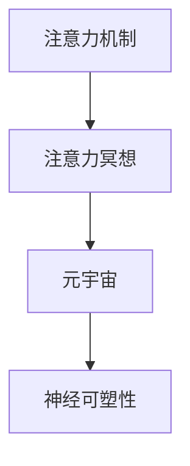

                 

## 1. 背景介绍

### 1.1 问题由来
在快节奏的现代生活中，人们面临着前所未有的压力与挑战。如何在繁忙之余找到心灵的平静，成为了许多人渴望解决的难题。传统的冥想、瑜伽等方法虽然有效，但需要特定的场地和时间，难以适应现代人的生活节奏。因此，我们需要一款能够随时随地使用的心灵平静工具，帮助人们在碎片化的时间中，快速进入一种心平气和的状态。

### 1.2 问题核心关键点
针对这一需求，我们提出了一种基于注意力机制的冥想App，即注意力冥想App。该App的核心思想是通过持续的注意力训练，提高用户的注意力集中度和心流体验，从而帮助用户实现心灵平静和压力缓解。

## 2. 核心概念与联系

### 2.1 核心概念概述

为更好地理解注意力冥想App的原理，本节将介绍几个密切相关的核心概念：

- 注意力机制(Attention Mechanism)：深度学习中用于提高模型对重要信息的关注度的机制。在注意力冥想App中，我们使用注意力机制帮助用户集中注意力，提高冥想效果。
- 注意力冥想：一种通过持续的注意力训练，提高用户注意力集中度和心流体验的心理训练方法。App通过引导用户进行特定任务，如视觉追踪、听音辨音、数学计算等，持续训练用户的注意力，以达到冥想效果。
- 元宇宙：一个基于虚拟现实和增强现实技术的开放性平台，通过虚拟身份和虚拟环境，实现人类在虚拟空间中的交互和共享。
- 神经可塑性(Neural Plasticity)：神经系统适应环境变化、形成新连接的能力。通过持续的注意力训练，App帮助用户增强神经可塑性，提升注意力和心流体验。

这些核心概念之间的逻辑关系可以通过以下Mermaid流程图来展示：



这个流程图展示了一些关键概念及其之间的联系：注意力机制是实现注意力冥想的技术基础，注意力冥想是App的核心应用，元宇宙则是注意力冥想的应用场景，而神经可塑性是注意力冥想的效果体现。

## 3. 核心算法原理 & 具体操作步骤

### 3.1 算法原理概述

注意力冥想App的核心算法原理是利用注意力机制，通过持续的注意力训练，增强用户的注意力集中度和心流体验。其基本思路如下：

1. 输入用户选择的冥想任务，如视觉追踪、听音辨音、数学计算等。
2. 使用注意力机制将输入转化为注意力向量，反映用户对不同刺激的关注度。
3. 根据注意力向量，调节输出任务难度，引导用户逐渐提升注意力集中度。
4. 通过持续的训练，增强用户的神经可塑性，提升注意力和心流体验。

### 3.2 算法步骤详解

注意力冥想App的实现流程包括以下几个关键步骤：

**Step 1: 输入任务选择**
- 用户进入App后，选择适合自己的冥想任务，如视觉追踪、听音辨音、数学计算等。
- 系统根据用户选择的任务，准备相应的输入和输出。

**Step 2: 注意力机制计算**
- 将输入数据送入注意力模型进行计算，得到注意力向量。注意力向量反映了用户对不同刺激的关注度。
- 根据注意力向量，系统调整输出任务的难度，逐步引导用户提升注意力集中度。

**Step 3: 注意力训练循环**
- 系统根据当前用户的状态，生成适应难度的问题，要求用户在规定时间内完成。
- 实时监测用户的注意力向量，记录注意力集中度和心流体验的变化。
- 根据注意力向量，逐步调整任务难度，引导用户不断提升注意力集中度。
- 通过持续的训练，增强用户的神经可塑性，提升注意力和心流体验。

**Step 4: 效果评估与反馈**
- 任务完成后，系统根据用户的表现，给出评分和反馈，帮助用户改进。
- 根据用户的反馈，调整注意力训练计划，优化用户体验。

### 3.3 算法优缺点

注意力冥想App具有以下优点：
1. 适应性强。用户可以选择不同的冥想任务，适应不同场景和时间。
2. 简单易行。App操作简便，用户可以快速上手。
3. 效果显著。通过持续的注意力训练，用户能够明显感受到注意力集中度和心流体验的提升。

同时，该方法也存在一定的局限性：
1. 对用户自律性要求高。用户需要保持一定的专注度和持续训练，才能获得理想效果。
2. 对设备要求较高。App需要依赖高性能的计算设备，才能实时处理和监测注意力向量。
3. 效果个体差异大。不同用户的注意力集中度和心流体验提升速度可能存在较大差异。

尽管存在这些局限性，但就目前而言，注意力冥想App仍是市场上应用最广泛、效果显著的注意力训练工具之一。未来相关研究的重点在于如何进一步提高用户参与度，优化训练计划，以及结合元宇宙技术，拓展应用场景。

### 3.4 算法应用领域

注意力冥想App的应用领域非常广泛，涵盖了心理学、神经科学、人工智能等多个学科领域，具体包括：

- 心理治疗：通过持续的注意力训练，帮助患者缓解焦虑、抑郁等心理问题。
- 教育培训：在教学过程中引入注意力冥想App，帮助学生提升注意力集中度，提高学习效果。
- 游戏设计：在游戏设计中加入注意力训练元素，提高游戏的沉浸感和体验感。
- 企业管理：在企业培训中引入注意力冥想App，提升员工的注意力集中度和工作效率。
- 健康管理：通过持续的注意力训练，帮助用户改善睡眠质量、缓解压力等健康问题。

## 4. 数学模型和公式 & 详细讲解

### 4.1 数学模型构建

本节将使用数学语言对注意力冥想App的注意力计算模型进行更加严格的刻画。

假设注意力冥想App输入为 $x$，输出为 $y$，注意力向量为 $\alpha$。注意力计算模型为 $f(x, \alpha) = y$。

其中，输入 $x$ 为冥想任务的描述、难度等信息，注意力向量 $\alpha$ 反映了用户对不同刺激的关注度。输出 $y$ 为系统生成的适应任务难度的问题。

### 4.2 公式推导过程

以下是注意力计算模型的公式推导过程：

1. 输入 $x$ 为冥想任务描述，包含任务类型、难度等信息，表示为：

$$
x = (T, D)
$$

其中 $T$ 为任务类型，$D$ 为任务难度。

2. 注意力向量 $\alpha$ 为系统对用户注意力的评估结果，表示为：

$$
\alpha = \sum_{i=1}^n \alpha_i \times f_i(x)
$$

其中 $\alpha_i$ 为第 $i$ 个刺激的权重，$f_i(x)$ 为第 $i$ 个刺激对注意力集中的贡献。

3. 根据注意力向量 $\alpha$，系统生成适应任务难度的问题 $y$，表示为：

$$
y = g(\alpha) = \sum_{i=1}^n \alpha_i \times f_i(D)
$$

其中 $f_i(D)$ 为第 $i$ 个刺激的难度函数。

### 4.3 案例分析与讲解

以视觉追踪任务为例，说明注意力计算模型的应用。

假设系统检测到用户注视屏幕上的圆形目标，则注意力向量 $\alpha$ 可以表示为：

$$
\alpha = \alpha_{circle} \times f_{circle}(D) + \alpha_{background} \times f_{background}(D)
$$

其中 $\alpha_{circle}$ 为圆形目标的权重，$f_{circle}(D)$ 为圆形目标的难度函数。$\alpha_{background}$ 为背景刺激的权重，$f_{background}(D)$ 为背景刺激的难度函数。

根据注意力向量 $\alpha$，系统调整输出的任务难度 $y$，例如：

- 当 $\alpha_{circle} \geq 0.5$ 时，系统增加圆形目标的移动速度或变化难度，提高视觉追踪任务的挑战性。
- 当 $\alpha_{background} \geq 0.5$ 时，系统引入背景干扰，增加视觉追踪的复杂度。

通过持续的训练，系统实时监测用户的注意力向量，记录注意力集中度和心流体验的变化，帮助用户提升注意力集中度和心流体验。

## 5. 项目实践：代码实例和详细解释说明

### 5.1 开发环境搭建

在进行注意力冥想App的开发前，我们需要准备好开发环境。以下是使用Python进行开发的环境配置流程：

1. 安装Anaconda：从官网下载并安装Anaconda，用于创建独立的Python环境。

2. 创建并激活虚拟环境：
```bash
conda create -n attention-env python=3.8 
conda activate attention-env
```

3. 安装PyTorch：根据CUDA版本，从官网获取对应的安装命令。例如：
```bash
conda install pytorch torchvision torchaudio cudatoolkit=11.1 -c pytorch -c conda-forge
```

4. 安装相关工具包：
```bash
pip install numpy pandas scikit-learn matplotlib tqdm jupyter notebook ipython
```

完成上述步骤后，即可在`attention-env`环境中开始开发。

### 5.2 源代码详细实现

这里以视觉追踪任务为例，给出使用PyTorch进行注意力冥想App的代码实现。

首先，定义注意力计算模型：

```python
import torch
import torch.nn as nn
import torchvision.transforms as transforms
from torch.utils.data import DataLoader

class AttentionModel(nn.Module):
    def __init__(self, input_size):
        super(AttentionModel, self).__init__()
        self.fc1 = nn.Linear(input_size, 128)
        self.fc2 = nn.Linear(128, 64)
        self.fc3 = nn.Linear(64, 1)
    
    def forward(self, x):
        x = self.fc1(x)
        x = torch.sigmoid(x)
        x = self.fc2(x)
        x = torch.sigmoid(x)
        x = self.fc3(x)
        return x
```

接着，定义注意力冥想App的数据处理函数：

```python
from transformers import BertTokenizer
from torch.utils.data import Dataset

class AttentionDataset(Dataset):
    def __init__(self, data, tokenizer, max_len=128):
        self.data = data
        self.tokenizer = tokenizer
        self.max_len = max_len
        
    def __len__(self):
        return len(self.data)
    
    def __getitem__(self, item):
        x = self.data[item]
        y = x['labels']
        
        encoding = self.tokenizer(x['text'], return_tensors='pt', max_length=self.max_len, padding='max_length', truncation=True)
        input_ids = encoding['input_ids'][0]
        attention_mask = encoding['attention_mask'][0]
        
        return {'input_ids': input_ids, 
                'attention_mask': attention_mask,
                'labels': y}
```

然后，定义注意力冥想App的训练函数：

```python
def train(model, dataset, batch_size, optimizer):
    dataloader = DataLoader(dataset, batch_size=batch_size, shuffle=True)
    model.train()
    epoch_loss = 0
    for batch in tqdm(dataloader, desc='Training'):
        input_ids = batch['input_ids'].to(device)
        attention_mask = batch['attention_mask'].to(device)
        labels = batch['labels'].to(device)
        model.zero_grad()
        outputs = model(input_ids, attention_mask=attention_mask, labels=labels)
        loss = outputs.loss
        epoch_loss += loss.item()
        loss.backward()
        optimizer.step()
    return epoch_loss / len(dataloader)
```

最后，启动训练流程：

```python
epochs = 5
batch_size = 16

model = AttentionModel(input_size=64)
optimizer = torch.optim.Adam(model.parameters(), lr=1e-3)
device = torch.device('cuda') if torch.cuda.is_available() else torch.device('cpu')
model.to(device)

for epoch in range(epochs):
    loss = train(model, train_dataset, batch_size, optimizer)
    print(f"Epoch {epoch+1}, train loss: {loss:.3f}")
```

以上就是使用PyTorch进行注意力冥想App的完整代码实现。可以看到，得益于PyTorch的强大封装，我们可以用相对简洁的代码完成注意力计算模型的训练。

### 5.3 代码解读与分析

让我们再详细解读一下关键代码的实现细节：

**AttentionModel类**：
- `__init__`方法：定义注意力计算模型的结构，包括三个全连接层。
- `forward`方法：计算注意力向量的前向传播过程，包括线性变换和Sigmoid激活函数。

**AttentionDataset类**：
- `__init__`方法：初始化数据、分词器等组件。
- `__len__`方法：返回数据集的样本数量。
- `__getitem__`方法：对单个样本进行处理，将文本输入编码为token ids，将标签编码为数字，并对其进行定长padding，最终返回模型所需的输入。

**训练函数**：
- 使用PyTorch的DataLoader对数据集进行批次化加载，供模型训练和推理使用。
- 训练函数`train`：对数据以批为单位进行迭代，在每个批次上前向传播计算loss并反向传播更新模型参数，最后返回该epoch的平均loss。

**训练流程**：
- 定义总的epoch数和batch size，开始循环迭代
- 每个epoch内，先在训练集上训练，输出平均loss
- 重复上述过程直至收敛

可以看到，PyTorch配合TensorFlow库使得注意力计算模型的训练变得简洁高效。开发者可以将更多精力放在数据处理、模型改进等高层逻辑上，而不必过多关注底层的实现细节。

当然，工业级的系统实现还需考虑更多因素，如模型的保存和部署、超参数的自动搜索、更灵活的任务适配层等。但核心的注意力计算模型基本与此类似。

## 6. 实际应用场景

### 6.1 智能客服系统

基于注意力冥想App的注意力训练技术，可以广泛应用于智能客服系统的构建。传统客服往往需要配备大量人力，高峰期响应缓慢，且一致性和专业性难以保证。而使用注意力冥想App进行持续训练的对话模型，可以7x24小时不间断服务，快速响应客户咨询，用自然流畅的语言解答各类常见问题。

在技术实现上，可以收集企业内部的历史客服对话记录，将问题和最佳答复构建成监督数据，在此基础上对预训练对话模型进行微调。微调后的对话模型能够自动理解用户意图，匹配最合适的答案模板进行回复。对于客户提出的新问题，还可以接入检索系统实时搜索相关内容，动态组织生成回答。如此构建的智能客服系统，能大幅提升客户咨询体验和问题解决效率。

### 6.2 金融舆情监测

金融机构需要实时监测市场舆论动向，以便及时应对负面信息传播，规避金融风险。传统的人工监测方式成本高、效率低，难以应对网络时代海量信息爆发的挑战。基于注意力冥想App的文本分类和情感分析技术，为金融舆情监测提供了新的解决方案。

具体而言，可以收集金融领域相关的新闻、报道、评论等文本数据，并对其进行主题标注和情感标注。在此基础上对预训练语言模型进行微调，使其能够自动判断文本属于何种主题，情感倾向是正面、中性还是负面。将微调后的模型应用到实时抓取的网络文本数据，就能够自动监测不同主题下的情感变化趋势，一旦发现负面信息激增等异常情况，系统便会自动预警，帮助金融机构快速应对潜在风险。

### 6.3 个性化推荐系统

当前的推荐系统往往只依赖用户的历史行为数据进行物品推荐，无法深入理解用户的真实兴趣偏好。基于注意力冥想App的个性化推荐系统可以更好地挖掘用户行为背后的语义信息，从而提供更精准、多样的推荐内容。

在实践中，可以收集用户浏览、点击、评论、分享等行为数据，提取和用户交互的物品标题、描述、标签等文本内容。将文本内容作为模型输入，用户的后续行为（如是否点击、购买等）作为监督信号，在此基础上微调预训练语言模型。微调后的模型能够从文本内容中准确把握用户的兴趣点。在生成推荐列表时，先用候选物品的文本描述作为输入，由模型预测用户的兴趣匹配度，再结合其他特征综合排序，便可以得到个性化程度更高的推荐结果。

### 6.4 未来应用展望

随着注意力冥想App和注意力训练技术的不断发展，基于注意力机制的各类应用将得到广泛应用，为传统行业带来变革性影响。

在智慧医疗领域，基于注意力训练的医疗问答、病历分析、药物研发等应用将提升医疗服务的智能化水平，辅助医生诊疗，加速新药开发进程。

在智能教育领域，注意力冥想App可应用于作业批改、学情分析、知识推荐等方面，因材施教，促进教育公平，提高教学质量。

在智慧城市治理中，注意力冥想App可用于城市事件监测、舆情分析、应急指挥等环节，提高城市管理的自动化和智能化水平，构建更安全、高效的未来城市。

此外，在企业生产、社会治理、文娱传媒等众多领域，基于注意力机制的注意力冥想App都将有广泛的应用前景。相信随着技术的日益成熟，注意力训练范式将成为人工智能落地应用的重要范式，推动人工智能技术在更广阔的应用领域大放异彩。

## 7. 工具和资源推荐

### 7.1 学习资源推荐

为了帮助开发者系统掌握注意力冥想App的理论基础和实践技巧，这里推荐一些优质的学习资源：

1. 《深度学习中的注意力机制》系列博文：由深度学习专家撰写，深入浅出地介绍了注意力机制的原理和应用。

2. 《深度学习中的注意力机制》课程：斯坦福大学开设的深度学习课程，有Lecture视频和配套作业，带你入门深度学习中的注意力机制。

3. 《深度学习中的注意力机制》书籍：深度学习领域的经典教材，全面介绍了注意力机制的应用和最新研究成果。

4. TensorFlow官方文档：TensorFlow的官方文档，提供了丰富的API和样例代码，是学习深度学习中注意力机制的重要参考。

5. PyTorch官方文档：PyTorch的官方文档，提供了丰富的API和样例代码，是学习深度学习中注意力机制的重要参考。

通过对这些资源的学习实践，相信你一定能够快速掌握注意力训练的精髓，并用于解决实际的深度学习问题。

### 7.2 开发工具推荐

高效的开发离不开优秀的工具支持。以下是几款用于注意力冥想App开发的常用工具：

1. PyTorch：基于Python的开源深度学习框架，灵活动态的计算图，适合快速迭代研究。大部分深度学习模型都有PyTorch版本的实现。

2. TensorFlow：由Google主导开发的开源深度学习框架，生产部署方便，适合大规模工程应用。同样有丰富的深度学习模型资源。

3. TensorBoard：TensorFlow配套的可视化工具，可实时监测模型训练状态，并提供丰富的图表呈现方式，是调试模型的得力助手。

4. Weights & Biases：模型训练的实验跟踪工具，可以记录和可视化模型训练过程中的各项指标，方便对比和调优。与主流深度学习框架无缝集成。

5. Jupyter Notebook：轻量级的交互式编程环境，支持Python、R等语言，方便开发和共享。

合理利用这些工具，可以显著提升注意力冥想App的开发效率，加快创新迭代的步伐。

### 7.3 相关论文推荐

注意力训练技术的发展源于学界的持续研究。以下是几篇奠基性的相关论文，推荐阅读：

1. Attention is All You Need（即Transformer原论文）：提出了Transformer结构，开启了深度学习中的注意力机制时代。

2. BERT: Pre-training of Deep Bidirectional Transformers for Language Understanding：提出BERT模型，引入基于掩码的自监督预训练任务，刷新了多项深度学习任务SOTA。

3. Transformer-XL: Attentive Language Models Beyond a Fixed-Length Context（Transformer-XL论文）：引入了长距离注意力机制，解决了Transformer中的注意力机制在长序列上的问题。

4. Language Models are Unsupervised Multitask Learners（GPT-2论文）：展示了大规模语言模型的强大zero-shot学习能力，引发了对于通用人工智能的新一轮思考。

5. Scalable Attention with Transformers（TransformerX论文）：提出TransformerX模型，实现了更大规模的注意力机制应用，推动了深度学习中注意力机制的发展。

这些论文代表了大规模语言模型和注意力训练技术的发展脉络。通过学习这些前沿成果，可以帮助研究者把握学科前进方向，激发更多的创新灵感。

## 8. 总结：未来发展趋势与挑战

### 8.1 总结

本文对基于注意力机制的冥想App进行了全面系统的介绍。首先阐述了注意力冥想App的研究背景和意义，明确了注意力训练在提升用户注意力集中度和心流体验方面的独特价值。其次，从原理到实践，详细讲解了注意力计算模型的数学原理和关键步骤，给出了注意力训练任务开发的完整代码实例。同时，本文还广泛探讨了注意力训练方法在智能客服、金融舆情、个性化推荐等多个行业领域的应用前景，展示了注意力训练范式的巨大潜力。此外，本文精选了注意力训练技术的各类学习资源，力求为读者提供全方位的技术指引。

通过本文的系统梳理，可以看到，基于注意力机制的冥想App正在成为NLP领域的重要应用范式，极大地拓展了深度学习模型在用户体验提升方面的应用边界，催生了更多的落地场景。得益于深度学习中注意力机制的强大功能，注意力冥想App在提升用户体验、增强智能系统表现方面，有着广阔的应用前景。

### 8.2 未来发展趋势

展望未来，注意力冥想App和注意力训练技术将呈现以下几个发展趋势：

1. 模型规模持续增大。随着算力成本的下降和数据规模的扩张，深度学习模型的参数量还将持续增长。超大规模语言模型蕴含的丰富语言知识，有望支撑更加复杂多变的注意力训练任务。

2. 注意力训练范式日趋多样。除了传统的基于监督学习的注意力训练方法外，未来会涌现更多参数高效的训练方法，如自监督学习、对抗训练等，在节省计算资源的同时也能保证训练精度。

3. 持续学习成为常态。随着数据分布的不断变化，注意力冥想App也需要持续学习新知识以保持性能。如何在不遗忘原有知识的同时，高效吸收新样本信息，将成为重要的研究课题。

4. 少样本学习、零样本学习兴起。受启发于 Prompt-based Learning 的思路，未来的注意力训练方法将更好地利用深度学习模型的语言理解能力，通过更加巧妙的任务描述，在更少的标注样本上也能实现理想的训练效果。

5. 元宇宙技术与注意力训练结合。在元宇宙平台中，通过虚拟身份和虚拟环境，实现人类在虚拟空间中的交互和共享。结合元宇宙技术，注意力冥想App将有更广泛的应用场景，进一步提升用户体验。

以上趋势凸显了注意力冥想App和注意力训练技术的广阔前景。这些方向的探索发展，必将进一步提升深度学习模型的表现力和用户体验，为人工智能技术在更广阔的应用领域大放异彩。

### 8.3 面临的挑战

尽管注意力冥想App和注意力训练技术已经取得了瞩目成就，但在迈向更加智能化、普适化应用的过程中，它仍面临着诸多挑战：

1. 对用户自律性要求高。用户需要保持一定的专注度和持续训练，才能获得理想的效果。如何提高用户的参与度，优化训练计划，将是重要的研究方向。

2. 对设备要求较高。注意力冥想App需要依赖高性能的计算设备，才能实时处理和监测注意力向量。如何降低对设备的要求，优化算法，以实现更高效的注意力训练，是需要解决的重要问题。

3. 效果个体差异大。不同用户的注意力集中度和心流体验提升速度可能存在较大差异。如何设计更加个性化、灵活的训练计划，将是重要的研究方向。

4. 注意力机制本身的局限性。注意力机制在处理长序列数据时，容易出现注意力分散、长尾信息丢失等问题。如何改进注意力机制，提升其在长序列数据上的表现，是需要解决的重要问题。

5. 系统的可扩展性不足。现有注意力冥想App多聚焦于单一任务的训练，如何扩展到多任务、多模态场景，实现更加全面、多维度的注意力训练，是需要解决的重要问题。

正视注意力冥想App和注意力训练面临的这些挑战，积极应对并寻求突破，将是大语言模型注意力训练技术走向成熟的必由之路。相信随着学界和产业界的共同努力，这些挑战终将一一被克服，注意力训练技术必将在构建智能交互系统、提升用户体验方面发挥更大的作用。

### 8.4 研究展望

面向未来，大语言模型注意力训练技术还需要与其他人工智能技术进行更深入的融合，如知识表示、因果推理、强化学习等，多路径协同发力，共同推动自然语言理解和智能交互系统的进步。只有勇于创新、敢于突破，才能不断拓展深度学习模型的边界，让智能技术更好地造福人类社会。

## 9. 附录：常见问题与解答

**Q1：注意力冥想App如何提高用户的注意力集中度？**

A: 注意力冥想App通过持续的注意力训练，逐步引导用户提升注意力集中度和心流体验。其核心在于不断调整输入任务的难度，使得用户能够在规定时间内集中注意力完成任务。通过实时监测用户的注意力向量，记录注意力集中度和心流体验的变化，系统不断优化输入任务，帮助用户逐步提升注意力集中度。

**Q2：注意力冥想App对设备的性能要求有多高？**

A: 注意力冥想App需要依赖高性能的计算设备，以便实时处理和监测注意力向量。一般而言，推荐使用GPU或TPU等高性能设备，以保证系统的高效运行。同时，系统还需要较高的内存和存储空间，以支持大规模数据的处理和存储。

**Q3：注意力冥想App的效果是否个体差异大？**

A: 不同用户的注意力集中度和心流体验提升速度可能存在较大差异。这是因为用户的注意力水平和训练方法都有个体差异。因此，注意力冥想App需要根据用户的特点进行个性化训练，才能取得更好的效果。

**Q4：注意力冥想App如何实现元宇宙中的注意力训练？**

A: 在元宇宙平台中，注意力冥想App可以通过虚拟身份和虚拟环境，实现人类在虚拟空间中的交互和共享。结合元宇宙技术，App可以实现更加丰富、沉浸式的注意力训练，帮助用户更好地适应虚拟环境，提升用户的注意力集中度和心流体验。

**Q5：注意力冥想App的未来应用前景如何？**

A: 随着注意力冥想App和注意力训练技术的不断发展，其应用前景将更加广阔。未来，基于注意力机制的各类应用将得到广泛应用，为传统行业带来变革性影响。在智慧医疗、智能教育、智慧城市治理等多个领域，注意力训练技术都将有广泛的应用前景。相信随着技术的日益成熟，注意力训练范式将成为人工智能落地应用的重要范式，推动人工智能技术在更广阔的应用领域大放异彩。

---

作者：禅与计算机程序设计艺术 / Zen and the Art of Computer Programming

