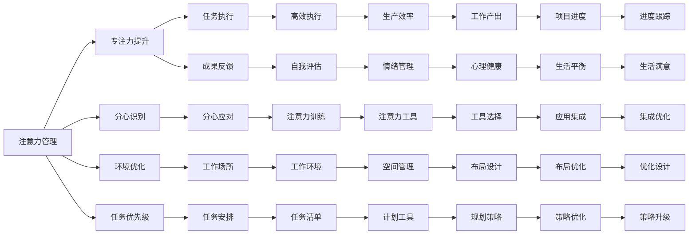

                 

# 注意力管理与自我管理：如何通过专注力实现个人成长

## 1. 背景介绍

### 1.1 问题由来
在当今这个信息爆炸的时代，我们面临的最大挑战之一就是如何管理注意力。信息的泛滥和分散使得我们越来越难以集中精力进行深度的思考和创造，这对个人成长、职业发展甚至生活质量都产生了深远的影响。如何在海量信息中找到真正有价值的资讯，如何保持持久的专注力，如何克服分心和拖延，成为了现代人的重要课题。

### 1.2 问题核心关键点
本问题关注的核心是注意力管理（Attention Management）和自我管理（Self-Management），即如何在多任务和干扰重重的环境中保持专注，并通过有效的自我管理提升个人生产力和效率。

### 1.3 问题研究意义
研究注意力管理与自我管理的策略和方法，对于提升个人生产效率、改善工作和生活质量，以及实现持续的个人成长具有重要意义。这不仅能帮助个体更有效地完成任务，还能增强其面对压力和挑战的韧性，从而实现自我超越。

## 2. 核心概念与联系

### 2.1 核心概念概述

- **注意力管理（Attention Management）**：指通过特定的方法和策略，增强个体在执行任务时的专注力，减少分心的行为。具体手段包括时间管理、环境优化、任务优先级排序等。

- **自我管理（Self-Management）**：指个体对自身行为、情绪和思维过程进行监控和调节，以提升自我效能和成就感。具体方法包括目标设定、自我反馈、情绪调节等。

- **专注力（Focus）**：指个体在一定时间内集中注意力于某一特定对象或活动上的能力。是注意力管理的关键要素，直接影响任务完成效率和个人满意度。

- **分心（Distraction）**：指个体在执行任务时被外界刺激或其他无关事项所干扰，导致注意力无法集中。分心是注意力管理的难点和重点。

- **生产力（Productivity）**：指个体在单位时间内完成工作的效率和质量。注意力管理和自我管理通过提升专注力和自我效能，直接关联到生产力的提高。

- **压力管理（Stress Management）**：指通过有效的手段减少或管理压力，以保持心理健康和平衡。注意力管理和自我管理在应对工作和生活压力方面也扮演着重要角色。

### 2.2 核心概念原理和架构的 Mermaid 流程图



此图展示了注意力管理和自我管理间的联系与相互作用。注意力管理通过提升专注力，增强任务执行效率；自我管理通过目标设定、情绪调节等手段提升自我效能。两者共同作用，提高生产力，减轻压力，提升生活满意度。

## 3. 核心算法原理 & 具体操作步骤

### 3.1 算法原理概述

注意力管理的核心在于识别和应对分心行为，提升个体在特定任务上的专注度。常用的策略包括时间块管理、番茄工作法、番茄钟等。这些方法通过划分任务时间块，设定明确的休息间隔，减少干扰，增强专注力。

自我管理则更注重个体对自身行为和心理状态的监控和调节。常见的技巧包括设定SMART目标、进行自我反馈、采用番茄工作法、应用GTD（Getting Things Done）等方法。

### 3.2 算法步骤详解

#### 注意力管理：

1. **识别分心源**：
   - 日志记录法：记录每日分心行为，识别常见分心源（如手机、社交媒体、同事干扰等）。
   - 时间审计：分析一段时间内的分心时间分布，找出分心高峰期。

2. **设置任务时间块**：
   - 时间块划分：将一天划分为若干时间块，每个时间块专门用于执行特定任务。
   - 任务优先级排序：根据任务的紧急程度和重要程度，设定优先级，确保重要任务优先完成。

3. **执行番茄工作法**：
   - 定时器设定：每个时间块内设定25分钟的工作时间，之后休息5分钟。
   - 周期性休息：每四个番茄钟（2小时）后，进行更长的休息（15-30分钟）。

4. **环境优化**：
   - 噪音控制：使用耳机或噪音取消设备，减少外界干扰。
   - 工作场所布置：整洁的工作台、舒适的座椅、适宜的照明等。

5. **反馈与调整**：
   - 日终复盘：每日记录任务完成情况，总结分心原因，调整优化。
   - 定期回顾：每周回顾注意力管理策略的效果，进行长期调整。

#### 自我管理：

1. **设定SMART目标**：
   - 目标设定：明确、可测量、可达成、相关性强、时限性（SMART）的目标设定方法。
   - 分解目标：将大目标分解为小任务，逐步完成。

2. **自我反馈**：
   - 进展跟踪：使用任务清单或项目管理工具，跟踪任务进展。
   - 定期评估：每周或每月评估目标达成情况，分析偏差原因。

3. **情绪调节**：
   - 情绪识别：通过日记或情绪追踪工具，记录每日情绪变化。
   - 情绪应对：采用冥想、运动、社交等方法，调节不良情绪。

4. **应用番茄工作法**：
   - 任务拆分：将大任务拆分为小任务，便于按时间块执行。
   - 时间管理：结合番茄钟设定，按时间块执行任务。

5. **GTD（Getting Things Done）**：
   - 清空大脑：将所有任务、想法、待办事项记录下来，避免遗漏。
   - 系统化处理：将任务按优先级、截止日期等分类，安排处理顺序。

### 3.3 算法优缺点

#### 注意力管理：

**优点**：
- 有效减少分心行为，提高任务完成效率。
- 简单易行，适应性强，可广泛应用于各种工作场景。

**缺点**：
- 需要自我约束和纪律性，对个体的自律要求较高。
- 分心原因复杂，单一方法可能不适用于所有场景。

#### 自我管理：

**优点**：
- 系统化目标设定，增强自我效能感。
- 定期反馈和调整，保持持续进步。

**缺点**：
- 初期需要大量时间和精力进行目标设定和跟踪。
- 情绪调节方法需个体差异化定制，不适合所有人。

#### 综合评估：
- **时间管理**：适用于任何个体，关键是执行力和自律性。
- **情绪管理**：通过系统化方法，提升整体心理健康和生活质量。
- **任务优先级**：关键在于正确评估任务的重要性和紧急程度，以确保高效执行。

### 3.4 算法应用领域

注意力管理和自我管理的方法和技术，广泛应用于个人生活和职业发展中的各个领域，包括但不限于：

- **个人时间管理**：通过番茄工作法、时间块管理等方法，提升日常工作和生活的效率。
- **职业发展**：设定SMART目标、应用GTD等方法，提升职业成就感和满足感。
- **学术研究**：进行严格的时间管理和情绪调节，保持研究项目的持续进展。
- **个人成长**：通过系统的自我反馈和调整，不断提升自我效能和成就感。
- **健康管理**：设定健康目标，通过持续跟踪和调整，实现长期健康生活方式。

## 4. 数学模型和公式 & 详细讲解 & 举例说明

### 4.1 数学模型构建

设个体在单位时间内的注意力集中度为 \( A_t \)，分心次数为 \( D_t \)，任务完成效率为 \( P_t \)。

目标函数为：
$$ \max \int_{0}^{T} P_t \, dt $$

约束条件为：
$$ A_t + D_t = T $$
$$ P_t = f(A_t) $$

其中，\( f \) 为 \( A_t \) 到 \( P_t \) 的映射函数，需要根据具体任务和分心行为进行建模。

### 4.2 公式推导过程

以番茄工作法为例，推导 \( P_t \) 的计算公式：

1. 设定番茄钟时间为 \( t_c = 25 \) 分钟，休息时间为 \( t_r = 5 \) 分钟。
2. 一个完整的工作周期为 \( t_w = t_c + t_r \)。
3. 任务完成效率 \( P_t \) 与 \( A_t \) 的关系为：
   $$ P_t = \begin{cases} 
   \frac{t_c}{t_w} & \text{当 } t \in [0, t_c) \\
   1 & \text{当 } t = t_c \\
   \frac{t_c}{t_w} & \text{当 } t \in [t_c, 2t_c) \\
   1 & \text{当 } t = 2t_c \\
   \end{cases} $$

### 4.3 案例分析与讲解

假设一天工作时间为 \( T = 8 \) 小时，每个番茄钟工作 \( t_c = 25 \) 分钟，休息 \( t_r = 5 \) 分钟。目标是最小化总时间 \( T \)，最大化任务完成效率 \( P_t \)。

1. **分心行为分析**：
   - 通过日志记录法，识别每天分心源，如手机、社交媒体等。
   - 通过时间审计，分析每天分心时间分布，发现高峰期为上午和下午。

2. **时间块划分**：
   - 将一天划分为若干时间块，每个时间块专门用于执行特定任务。
   - 设定每个时间块内 \( t_c \) 分钟工作， \( t_r \) 分钟休息，确保高效休息，避免疲劳。

3. **执行番茄钟**：
   - 使用番茄钟计时器，设定 \( t_c = 25 \) 分钟工作， \( t_r = 5 \) 分钟休息。
   - 每四个番茄钟后，进行更长的休息（15-30分钟）。

4. **环境优化**：
   - 噪音控制：使用耳机或噪音取消设备，减少外界干扰。
   - 工作场所布置：整洁的工作台、舒适的座椅、适宜的照明等。

5. **反馈与调整**：
   - 日终复盘：每日记录任务完成情况，总结分心原因，调整优化。
   - 定期回顾：每周回顾注意力管理策略的效果，进行长期调整。

## 5. 项目实践：代码实例和详细解释说明

### 5.1 开发环境搭建

- **Python环境**：安装Python 3.8及以上版本，使用Anaconda或Miniconda创建虚拟环境。
- **开发工具**：使用PyCharm或Jupyter Notebook进行开发。
- **数据收集**：通过日志记录、时间审计等手段，收集每日分心行为数据。
- **时间管理工具**：使用Pomodoro Timer或Trello等工具辅助番茄工作法实施。

### 5.2 源代码详细实现

以下是一个使用Pomodoro Timer辅助番茄工作法的Python代码示例：

```python
import time
import random

class Pomodoro:
    def __init__(self, work_time=25, rest_time=5):
        self.work_time = work_time
        self.rest_time = rest_time
        self.total_work_time = 0
        self.total_rest_time = 0
        self.is_working = True

    def start_timer(self):
        if self.is_working:
            print("开始工作！")
            self.total_work_time += self.work_time
            time.sleep(self.work_time)
            print("休息！")
            self.total_rest_time += self.rest_time
            time.sleep(self.rest_time)
            self.is_working = True
        else:
            self.is_working = True
            print("继续工作！")

if __name__ == "__main__":
    pomodoro = Pomodoro()
    while True:
        pomodoro.start_timer()
```

### 5.3 代码解读与分析

- **Pomodoro类**：定义了番茄钟的计时功能，包括工作时间和休息时间的设定。
- **start_timer方法**：实现每个番茄钟的计时逻辑，通过sleep函数控制时间间隔，输出提示信息。
- **while循环**：无限执行番茄钟计时器，直到程序中断或关闭。

此代码虽然简单，但涵盖了番茄工作法的核心逻辑，可通过进一步优化扩展为更加复杂的时间管理工具。

### 5.4 运行结果展示

在运行上述代码后，用户可以通过观察命令行输出，了解每次番茄钟的开始和结束时间，以及累计的工作和休息时间。

## 6. 实际应用场景

### 6.1 学生学习管理

学生在学习过程中面临诸多分心因素，如手机、社交媒体、课堂干扰等。通过设定番茄钟时间块，可以有效提升学习效率，避免分心行为。

- **案例**：一名高中生使用番茄钟管理学习时间，每天设定5个番茄钟，每小时休息一次，显著提升了学习效果。

### 6.2 企业员工时间管理

企业员工在工作中需要频繁应对邮件、电话、会议等干扰，通过番茄工作法可以有效提升工作专注度，减少任务拖延。

- **案例**：一家科技公司的开发团队引入了番茄工作法，将每小时工作时间分为若干个25分钟的番茄钟，团队整体工作效率明显提升。

### 6.3 自由职业者自我管理

自由职业者需要管理好时间，避免过度加班和压力过大。通过设定SMART目标和应用GTD方法，可以有效规划工作任务，提升自我管理能力。

- **案例**：一位自由撰稿人通过设定每日和每周的目标，使用GTD方法记录任务和想法，显著提高了工作质量和满意度。

### 6.4 未来应用展望

随着人工智能和大数据技术的发展，注意力管理与自我管理将迎来更多智能化手段，如智能提醒、情绪分析、个性化推荐等。未来的自我管理工具将更加智能、个性化，提升个体在多任务环境下的专注力和自我效能。

## 7. 工具和资源推荐

### 7.1 学习资源推荐

- **书籍**：《深度工作：专注力与生产力的艺术》、《番茄工作法图解》、《GTD：高效能人士的七个习惯》。
- **在线课程**：Coursera上的“时间管理和生产力提升”课程、Udemy上的“番茄工作法”课程。
- **工具资源**：RescueTime、Pomodoro Tracker、Trello等时间管理工具。

### 7.2 开发工具推荐

- **Python库**：Pomodoro Timer、Todoist、Todoist Python API等。
- **项目管理工具**：Trello、Asana、Notion等。
- **情绪分析工具**：Moodscope、Headspace等。

### 7.3 相关论文推荐

- **注意力管理**：Zimmerman, B. J., & Kitsantas, A. D. (2007). Self-regulation of task engagement in the college classroom: The roles of executive functions, attention, and affect. Journal of Educational Psychology, 99(2), 306.
- **自我管理**：Kahneman, D., & Frederick, S. (2002). Representative heuristics and systematic biases. The American Economic Review, 92(5), 1693-1710.

## 8. 总结：未来发展趋势与挑战

### 8.1 研究成果总结

本文从注意力管理和自我管理的角度，探讨了如何通过专注力提升个人生产效率和满足感。介绍了番茄工作法、GTD等经典方法和工具，并通过代码实例展示了其应用。通过分析案例和展望未来，强调了自我管理在个人成长中的重要性。

### 8.2 未来发展趋势

1. **智能辅助工具**：未来将更多地引入AI和机器学习技术，如智能提醒、情绪分析等，提升自我管理工具的智能化水平。
2. **个性化定制**：基于个体差异进行定制化配置，提供更加符合用户需求的自我管理解决方案。
3. **跨平台集成**：通过API和跨平台集成，实现无缝切换和管理。
4. **健康管理整合**：将注意力管理和情绪调节与健康监测结合，实现全面的个人健康管理。

### 8.3 面临的挑战

1. **个体差异**：不同个体对时间管理工具的接受度和使用效果不同，需针对不同群体进行差异化设计。
2. **数据隐私**：智能工具在收集和分析数据时，需重视用户隐私保护和数据安全。
3. **技术普及**：新技术的普及和用户接受度还需进一步提高，需要更多的教育推广和用户培训。

### 8.4 研究展望

未来在注意力管理和自我管理的研究方向上，需更多关注个体差异化管理、数据隐私保护、智能辅助技术的发展等方向。通过多学科交叉，不断优化自我管理方法，推动个体成长和生产力提升。

## 9. 附录：常见问题与解答

**Q1: 注意力管理和自我管理适用于所有人吗？**

A: 尽管这些方法对大多数人都有效，但个体的差异性决定了并非所有方法都适合所有人。需要在实际应用中灵活调整，找到最适合自己的管理方式。

**Q2: 如何克服初期的时间管理困难？**

A: 初期调整难度较大，可以通过小步迭代的方式逐步适应。设定较短的番茄钟时间（如15分钟），逐步延长工作时间。同时结合每日复盘，总结经验教训，不断优化。

**Q3: 番茄工作法适用于所有任务吗？**

A: 番茄工作法适用于需要集中注意力、时间固定的任务。对于需要长时间连续工作或思考的任务（如编程、写作），可能需要进行适当调整。

**Q4: 如何通过GTD方法提高工作效率？**

A: 使用GTD方法需要系统化地记录和整理任务，设定优先级，并按部就班地执行。每日回顾和调整是关键，确保任务清单与实际工作同步。

**Q5: 如何平衡工作和休息？**

A: 合理设定番茄钟的休息时间，避免长时间连续工作带来的疲劳。同时结合身体锻炼和放松活动，实现身心平衡。

---

作者：禅与计算机程序设计艺术 / Zen and the Art of Computer Programming

