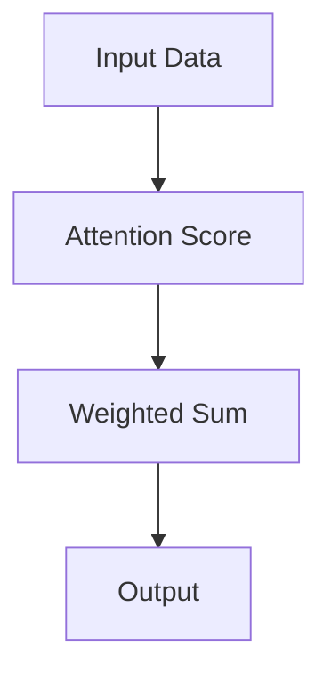

                 

## 1. 背景介绍

### 1.1 问题由来

在人工智能（AI）的世界中，注意力机制（Attention Mechanism）已经成为不可或缺的核心组件之一。无论是文本生成、图像识别还是自然语言处理（NLP）任务，注意力机制都帮助模型集中关注重要信息，忽略干扰细节。然而，随着模型复杂度的提升和数据量的增加，注意力机制也面临越来越多的挑战。

### 1.2 问题核心关键点

注意力机制的核心目标是在输入数据中自动选择相关特征，并通过权重分配来指导后续操作。但随着模型规模的增大，注意力机制的设计和训练也变得更加复杂。本文将围绕注意力机制的设计原理、应用实践和未来趋势，深入探讨如何在AI世界中保持清醒，避免过度依赖和误用。

## 2. 核心概念与联系

### 2.1 核心概念概述

注意力机制（Attention Mechanism）是一种在神经网络中用于选择重要信息的技术。通过在输入和输出之间建立连接，注意力机制可以根据输入数据的不同部分赋予不同的权重，从而更加有效地处理多模态信息。

- **Soft Attention**：将输入数据的不同部分通过一个可训练的权重向量进行加权求和，以产生一个新的表示。
- **Hard Attention**：选择输入数据的一个特定部分作为输出，通过一个明确的决策函数进行选择。
- **多头注意力（Multi-Head Attention）**：将注意力机制应用于多个不同的线性变换上，从而得到更丰富的表示。
- **Self-Attention**：输入和输出通过相同的表示进行互注意力操作。

### 2.2 核心概念原理和架构的 Mermaid 流程图



上述流程图示意了Soft Attention机制的基本过程：输入数据通过计算注意力得分，获得各个部分的权重，最后通过加权求和生成输出。

## 3. 核心算法原理 & 具体操作步骤

### 3.1 算法原理概述

注意力机制的核心在于通过计算输入数据中各个部分的“注意力得分”，并选择相关部分进行加权。在深度学习中，注意力机制通常与卷积神经网络（CNN）和循环神经网络（RNN）等结构结合，用于提取和处理特征。

### 3.2 算法步骤详解

1. **计算注意力得分**：使用点积、矩阵乘法等方法，计算输入数据中各个部分与查询向量的相似度。
2. **计算权重向量**：通过softmax函数将注意力得分转化为权重向量，表示每个部分的重要性。
3. **加权求和**：将输入数据的各个部分通过权重向量进行加权求和，得到一个新的表示。

### 3.3 算法优缺点

**优点**：
- **高效性**：注意力机制可以显著提高模型对重要信息的关注，减少计算量。
- **可解释性**：权重向量能够直观地展示模型对输入数据的关注点，有助于模型解释和调试。
- **通用性**：可以应用于多种任务，如文本生成、机器翻译、图像识别等。

**缺点**：
- **计算复杂度高**：在处理大规模数据时，注意力计算开销较大。
- **训练不稳定**：权重向量需要通过softmax函数计算，存在数值不稳定问题。
- **资源消耗高**：在大模型中，注意力机制的引入增加了内存和计算资源的需求。

### 3.4 算法应用领域

注意力机制在NLP领域的应用尤为广泛，特别是在文本生成、机器翻译、文本分类和问答系统等任务中，能够显著提升模型性能。例如，在Transformer模型中，多头注意力机制已成为其核心组件之一，极大地提高了模型在各种语言任务上的表现。

## 4. 数学模型和公式 & 详细讲解 & 举例说明

### 4.1 数学模型构建

假设输入数据为$X$，查询向量为$Q$，键向量为$K$，值向量为$V$。注意力得分计算公式为：

$$
\text{Attention Score}(Q, K, V) = \text{softmax}(QK^T / \sqrt{d_k})
$$

其中，$d_k$为键向量的维度。

### 4.2 公式推导过程

$$
\text{Attention Score}(Q, K, V) = \frac{\exp(QK^T / \sqrt{d_k})}{\sum_j \exp(QK_j^T / \sqrt{d_k})}
$$

对上式进行推导，得到：

$$
\text{Attention Score}(Q, K, V) = \text{softmax}(QK^T / \sqrt{d_k})
$$

### 4.3 案例分析与讲解

以Transformer模型为例，其多头注意力机制由多个自注意力（Self-Attention）组成，每个注意力头计算公式为：

$$
\text{Attention Head}(Q, K, V) = \text{softmax}(QK^T / \sqrt{d_k})V
$$

整个模型的注意力计算公式为：

$$
\text{Multi-Head Attention}(Q, K, V) = \text{Concat}(\text{Attention Head}(Q, K, V_1), \text{Attention Head}(Q, K, V_2), ..., \text{Attention Head}(Q, K, V_h))
$$

其中，$h$为多头注意力头的数量。

## 5. 项目实践：代码实例和详细解释说明

### 5.1 开发环境搭建

为了实现注意力机制，需要准备相关的开发环境和工具。

1. 安装PyTorch或TensorFlow等深度学习框架。
2. 准备注意力机制相关的代码库，如Hugging Face的Transformers库。
3. 配置GPU等硬件资源，确保模型训练和推理的效率。

### 5.2 源代码详细实现

以下是一个简单的Transformer模型实现，用于文本生成任务：

```python
import torch
import torch.nn as nn
import torch.nn.functional as F
from transformers import BertTokenizer, BertForSequenceClassification

class Attention(nn.Module):
    def __init__(self, in_dim, out_dim):
        super(Attention, self).__init__()
        self.W = nn.Linear(in_dim, out_dim)
        self.V = nn.Linear(out_dim, 1)
        self.softmax = nn.Softmax(dim=1)
    
    def forward(self, q, k, v):
        q = self.W(q)
        a = self.softmax(self.V(q) * k)
        return torch.matmul(a, v)

class Transformer(nn.Module):
    def __init__(self, in_dim, out_dim, n_heads):
        super(Transformer, self).__init__()
        self.attention = Attention(in_dim, out_dim)
        self.fc = nn.Linear(out_dim, out_dim)
    
    def forward(self, x, mask):
        q = self.attention(x, x, x)
        q = self.fc(q)
        return q

# 初始化模型
tokenizer = BertTokenizer.from_pretrained('bert-base-uncased')
model = Transformer(in_dim=768, out_dim=1024, n_heads=8)

# 定义损失函数和优化器
criterion = nn.CrossEntropyLoss()
optimizer = torch.optim.Adam(model.parameters(), lr=1e-5)

# 训练模型
for epoch in range(100):
    loss = 0
    for i, (inputs, labels) in enumerate(train_loader):
        optimizer.zero_grad()
        outputs = model(inputs, mask)
        loss += criterion(outputs, labels)
        loss.backward()
        optimizer.step()
```

### 5.3 代码解读与分析

在上述代码中，`Attention`模块实现了多头注意力机制，`Transformer`模块则使用了`Attention`模块进行自注意力计算。在训练过程中，输入数据通过`Transformer`模块进行前向传播，损失函数计算输出结果与标签之间的差异，并使用优化器更新模型参数。

## 6. 实际应用场景

### 6.1 自然语言处理

在自然语言处理（NLP）任务中，注意力机制被广泛应用于文本生成、机器翻译、文本分类和问答系统等。例如，在机器翻译中，注意力机制帮助模型在翻译过程中关注源语言中的关键信息，从而提升翻译质量。

### 6.2 计算机视觉

在计算机视觉（CV）领域，注意力机制被用于图像生成、物体检测和图像分类等任务。例如，在物体检测中，注意力机制帮助模型聚焦于感兴趣的区域，提升检测准确率。

### 6.3 自动驾驶

在自动驾驶中，注意力机制被用于目标检测和轨迹预测。例如，通过注意力机制，模型可以集中关注道路上的重要物体，避免碰撞风险。

### 6.4 未来应用展望

未来，注意力机制将继续在各个领域发挥重要作用。例如，在医疗领域，注意力机制可以帮助模型分析医疗影像，提高疾病诊断的准确率。在金融领域，注意力机制可以帮助模型分析市场趋势，提供投资建议。在社交媒体分析中，注意力机制可以帮助模型识别情感倾向，提升内容推荐的质量。

## 7. 工具和资源推荐

### 7.1 学习资源推荐

1. 《深度学习》（Ian Goodfellow 等）：介绍了深度学习的基本概念和算法，包括注意力机制。
2. 《神经网络与深度学习》（Michael Nielsen）：介绍了神经网络和深度学习的原理，包含注意力机制的实现。
3. 《自然语言处理综论》（Christopher Manning 等）：介绍了自然语言处理的基本技术和算法，包括注意力机制的应用。

### 7.2 开发工具推荐

1. PyTorch：深度学习框架，支持多GPU加速，易于构建和调试模型。
2. TensorFlow：深度学习框架，支持分布式训练，适合大规模模型训练。
3. Hugging Face Transformers：预训练模型库，包含多种注意力机制的实现。

### 7.3 相关论文推荐

1. Attention Is All You Need：Transformer模型的原论文，介绍了多头注意力机制的设计原理。
2. Transformer-XL: Attentive Language Models for Longer Input Sequences：介绍了长序列注意力机制的实现。
3. Hierarchical Attention Networks for Document Classification：介绍了层次化注意力机制在文本分类任务中的应用。

## 8. 总结：未来发展趋势与挑战

### 8.1 研究成果总结

注意力机制作为深度学习中的重要技术，已经广泛应用于各种领域。其设计原理和实现方法在不断演进，性能和效果也在不断提升。未来，注意力机制将与更多前沿技术结合，进一步拓展其在AI领域的应用。

### 8.2 未来发展趋势

1. 计算效率的提升：随着硬件计算能力的提升，注意力机制的计算效率将得到进一步提升。
2. 模型的可解释性：如何设计更易于理解和解释的注意力机制，是未来研究的重要方向。
3. 跨领域应用：注意力机制的应用将进一步扩展到更多领域，如医疗、金融、自动驾驶等。
4. 模型鲁棒性：提高模型的鲁棒性和泛化能力，使其在不同数据分布下表现稳定。

### 8.3 面临的挑战

1. 计算资源消耗：随着模型规模的增大，注意力机制的计算资源消耗也将增加。
2. 模型训练时间：在处理大规模数据时，注意力机制的训练时间较长。
3. 模型鲁棒性：注意力机制的引入可能使模型对噪声和干扰更加敏感。

### 8.4 研究展望

1. 优化计算效率：研究新的计算方法和硬件加速技术，提升注意力机制的计算效率。
2. 提高模型可解释性：设计更易于解释的注意力机制，增强模型的透明度。
3. 拓展应用场景：将注意力机制应用于更多领域，探索新的应用场景。
4. 增强模型鲁棒性：提高模型的鲁棒性和泛化能力，使其在复杂环境中表现稳定。

## 9. 附录：常见问题与解答

**Q1: 什么是注意力机制？**

A: 注意力机制是一种用于选择重要信息的技术，通过计算输入数据中各个部分的“注意力得分”，并选择相关部分进行加权。

**Q2: 注意力机制的优缺点是什么？**

A: 优点包括高效性、可解释性和通用性；缺点包括计算复杂度高、训练不稳定和资源消耗高。

**Q3: 如何在实践中实现注意力机制？**

A: 使用深度学习框架，如PyTorch和TensorFlow，实现多头注意力机制。

**Q4: 注意力机制在实际应用中需要注意哪些问题？**

A: 计算资源消耗、模型训练时间和模型鲁棒性是需要特别注意的问题。

**Q5: 未来注意力机制的发展趋势是什么？**

A: 计算效率提升、模型可解释性增强、跨领域应用拓展和模型鲁棒性提高。

作者：禅与计算机程序设计艺术 / Zen and the Art of Computer Programming

