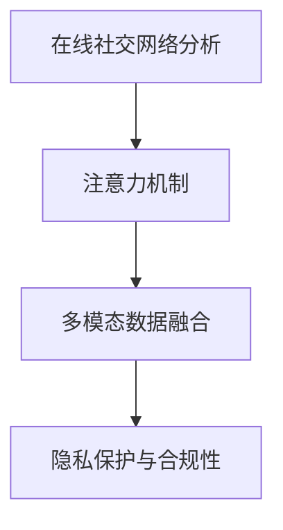

                 

## 1. 背景介绍

### 1.1 问题由来

随着互联网和社交媒体的普及，儿童面临的线上风险也在不断增加。网络欺凌、性剥削、隐私泄露等现象日益普遍，严重威胁儿童的心理健康和生理安全。传统的儿童保护措施主要依赖家长、教师和相关机构的线下干预，难以应对网络空间的复杂局面。因此，利用技术和数据手段，主动识别和干预儿童遭受线上侵害的行为，变得迫在眉睫。

### 1.2 问题核心关键点

儿童保护问题涉及多个领域，包括法律、心理、教育等。本文聚焦于技术角度，探讨如何使用注意力机制，结合在线社交网络分析，构建儿童保护的AI模型。重点关注以下几个关键点：

- 在线社交网络分析：利用机器学习和自然语言处理技术，自动发现和分析儿童在社交媒体上的互动模式，识别潜在的风险信号。
- 注意力机制：通过注意力机制筛选和提取关键特征，提升模型对风险信号的敏感性和准确性。
- 多模态数据融合：结合文本、图像、音频等多种数据，综合判断儿童是否处于风险中。
- 隐私保护与合规性：在使用AI模型保护儿童的同时，也要遵守隐私保护法律法规，确保数据使用的合规性和安全性。

### 1.3 问题研究意义

本文旨在探讨在注意力经济下，如何构建和优化儿童保护的AI模型，以实时识别和干预儿童遭受网络侵害的行为。通过技术手段，可以提升儿童保护的速度和效率，减轻家长和教师的负担，为儿童创造更加安全、健康的成长环境。

## 2. 核心概念与联系

### 2.1 核心概念概述

为更好地理解注意力机制在儿童保护中的应用，本节将介绍几个密切相关的核心概念：

- **在线社交网络分析**：指利用机器学习和自然语言处理技术，自动分析社交媒体上的用户互动行为，识别潜在的风险信号。常见方法包括情感分析、行为模式识别、异常检测等。

- **注意力机制**：一种用于提取序列数据关键特征的技术，通过动态分配权重，筛选出最相关的信息，提升模型的性能和效率。

- **多模态数据融合**：指将文本、图像、音频等多种数据源进行整合，综合判断儿童是否处于风险中，从而获得更全面的风险评估。

- **隐私保护与合规性**：指在使用AI模型保护儿童的同时，也要遵守相关的隐私保护法律法规，确保数据使用的合规性和安全性。

这些核心概念之间的逻辑关系可以通过以下Mermaid流程图来展示：



这个流程图展示了大语言模型的核心概念及其之间的关系：

1. 在线社交网络分析自动发现儿童在社交媒体上的风险信号。
2. 注意力机制通过动态筛选，提取关键特征，提升模型对风险信号的敏感性和准确性。
3. 多模态数据融合综合判断儿童是否处于风险中，获得更全面的风险评估。
4. 隐私保护与合规性确保数据使用的合规性和安全性。

这些概念共同构成了儿童保护的AI模型的基础框架，使得模型能够在复杂的网络环境中，准确识别和干预儿童遭受网络侵害的行为。

## 3. 核心算法原理 & 具体操作步骤
### 3.1 算法原理概述

本节将详细讲解基于注意力机制的儿童保护AI模型构建和优化原理。

**模型架构**：
```
Encoder-Decoder with Attention
  |
  +-------+
  |       |
  |Encoder|
  |       |
  +-------+
        /
       |
      +-------+
      |       |
      |Decoder|
      |       |
      +-------+
        |
       |       |
       |Attention|
       |         |
       +-------+
```

该模型架构包含三个主要部分：编码器(Encoder)、解码器(Decoder)和注意力机制(Attention)。

1. **编码器**：对儿童的社交网络数据进行编码，提取文本、图像、音频等多模态特征。
2. **解码器**：生成预测结果，判断儿童是否处于风险中。
3. **注意力机制**：动态分配权重，筛选关键特征。

### 3.2 算法步骤详解

以下是利用注意力机制的儿童保护AI模型构建和优化的具体操作步骤：

**Step 1: 数据预处理**
- 收集儿童在社交媒体上的互动数据，包括文本、图片、音频等。
- 清洗和标注数据，去除噪音数据和无关信息，确保数据质量。
- 划分训练集、验证集和测试集。

**Step 2: 模型构建**
- 选择适当的编码器和解码器架构。
- 设计注意力机制，定义注意力权重计算方式。
- 选择合适的优化器、学习率、批大小等超参数。

**Step 3: 训练模型**
- 对模型进行前向传播和反向传播，计算损失函数。
- 使用梯度下降等优化算法更新模型参数。
- 在验证集上评估模型性能，避免过拟合。
- 重复以上步骤直至模型收敛。

**Step 4: 模型评估与部署**
- 在测试集上评估模型性能。
- 根据评估结果调整模型参数。
- 部署模型到实际应用环境中，进行实时监测和干预。

### 3.3 算法优缺点

基于注意力机制的儿童保护AI模型具有以下优点：
- 自动化程度高：自动发现和分析风险信号，减轻人工审核负担。
- 实时性强：能够实时监测和干预，提高儿童保护的速度和效率。
- 多模态融合：结合文本、图像、音频等多模态数据，提升判断的准确性。

同时，该模型也存在一些局限性：
- 数据依赖性强：模型的效果很大程度上依赖于训练数据的数量和质量。
- 模型复杂度高：需要大量计算资源进行训练和推理。
- 模型解释性差：注意力机制在一定程度上增加了模型的复杂度，难以解释内部决策过程。

尽管如此，基于注意力机制的儿童保护AI模型在实时监测和自动化干预方面具有显著优势，仍然是大数据时代儿童保护的重要工具。

### 3.4 算法应用领域

基于注意力机制的儿童保护AI模型在多个领域都有广泛应用，例如：

- **在线教育**：自动检测学生的异常行为，及时向教师和家长发出警告。
- **网络安全**：自动识别和拦截儿童色情内容，保护儿童免受网络侵害。
- **心理健康**：自动分析儿童在社交媒体上的言论，评估其心理健康状态。
- **儿童福利**：通过数据分析，提前预警和干预儿童遭受虐待或忽视的行为。

## 4. 数学模型和公式 & 详细讲解 & 举例说明

### 4.1 数学模型构建

假设儿童社交网络数据为 $X=\{x_i\}_{i=1}^N$，其中 $x_i$ 包含文本、图像、音频等特征。模型结构如下：

```
Encoder: x_i --> h_i
Attention: h_i --> \alpha_i
Decoder: \alpha_i --> y_i
```

其中 $h_i$ 为编码器输出， $\alpha_i$ 为注意力权重， $y_i$ 为解码器输出，代表儿童是否处于风险中。

### 4.2 公式推导过程

注意力机制的核心公式为：

$$
\alpha_i = \frac{e^{s(h_i, x_i)}}{\sum_{j=1}^N e^{s(h_j, x_j)}}
$$

其中 $s(h_i, x_i)$ 为注意力函数，代表 $h_i$ 和 $x_i$ 之间的相似度。通过动态计算注意力权重 $\alpha_i$，模型可以自动选择和加权处理关键特征，提升判断的准确性。

### 4.3 案例分析与讲解

以儿童色情内容检测为例，假设模型输入为儿童社交网络中包含色情图像的帖子，输出为该帖子是否为色情内容的判断。模型可以提取图像特征 $h_i$，计算与帖子的注意力权重 $\alpha_i$，最后通过解码器生成预测结果 $y_i$。

## 5. 项目实践：代码实例和详细解释说明
### 5.1 开发环境搭建

在进行儿童保护AI模型开发前，我们需要准备好开发环境。以下是使用Python进行PyTorch开发的环境配置流程：

1. 安装Anaconda：从官网下载并安装Anaconda，用于创建独立的Python环境。

2. 创建并激活虚拟环境：
```bash
conda create -n child_protection python=3.8 
conda activate child_protection
```

3. 安装PyTorch：根据CUDA版本，从官网获取对应的安装命令。例如：
```bash
conda install pytorch torchvision torchaudio cudatoolkit=11.1 -c pytorch -c conda-forge
```

4. 安装各类工具包：
```bash
pip install numpy pandas scikit-learn matplotlib tqdm jupyter notebook ipython
```

完成上述步骤后，即可在`child_protection`环境中开始模型开发。

### 5.2 源代码详细实现

以下是使用PyTorch实现基于注意力机制的儿童色情内容检测模型的代码实现：

```python
import torch
from torch import nn
import torch.nn.functional as F

class ChildProtectionModel(nn.Module):
    def __init__(self, emb_dim=256, attention_dim=128):
        super(ChildProtectionModel, self).__init__()
        
        # 定义嵌入层，将输入特征转换为向量表示
        self.encoder = nn.Embedding(1024, emb_dim)
        
        # 定义注意力机制
        self.attention = nn.Linear(emb_dim, attention_dim)
        self.softmax = nn.Softmax(dim=1)
        
        # 定义解码器
        self.decoder = nn.Linear(attention_dim, 1)
        
    def forward(self, x):
        # 嵌入层
        x = self.encoder(x)
        
        # 注意力机制
        h = F.relu(self.attention(x))
        alpha = self.softmax(h)
        
        # 解码器
        y = self.decoder(h)
        
        return y, alpha

# 创建模型实例
model = ChildProtectionModel()
```

### 5.3 代码解读与分析

让我们再详细解读一下关键代码的实现细节：

**ChildProtectionModel类**：
- `__init__`方法：初始化模型参数，包括嵌入层、注意力机制和解码器。
- `forward`方法：定义模型前向传播过程，包括嵌入层、注意力机制和解码器。

**模型定义**：
- 嵌入层：将输入特征转换为向量表示，方便后续处理。
- 注意力机制：计算注意力权重，筛选关键特征。
- 解码器：将筛选后的特征进行分类，判断是否为色情内容。

## 6. 实际应用场景

### 6.1 在线教育

在线教育平台常常面临学生行为异常的问题。儿童保护AI模型可以自动检测学生的异常行为，及时向教师和家长发出警告，防止学生因学业压力、网络暴力等导致的问题。

在技术实现上，可以收集学生在线教育平台上的互动数据，如登录记录、课程参与度、成绩等。利用模型对学生的行为进行实时监测，一旦发现异常行为，立即向教师和家长发出预警，进行干预。

### 6.2 网络安全

网络平台常常存在儿童色情内容问题，儿童保护AI模型可以自动识别和拦截儿童色情内容，保护儿童免受网络侵害。

在技术实现上，可以收集平台上的图像、视频等数据，利用模型对图像进行色情内容检测。一旦发现色情内容，立即进行删除或屏蔽，保护儿童免受不良信息的侵害。

### 6.3 心理健康

社交媒体上的儿童常常面临心理健康的风险，儿童保护AI模型可以自动分析儿童在社交媒体上的言论，评估其心理健康状态。

在技术实现上，可以收集儿童在社交媒体上的言论，利用模型进行情感分析，判断其情绪状态是否正常。一旦发现异常情绪，立即向家长和心理咨询师发出预警，进行干预。

### 6.4 未来应用展望

随着技术的不断进步，儿童保护AI模型将在更多领域得到应用，为儿童创造更安全、健康的成长环境。

在智慧医疗领域，儿童保护AI模型可以自动分析儿童的社交网络数据，评估其心理健康状态，为医生提供辅助诊断。

在智能交通领域，儿童保护AI模型可以自动监测儿童在道路上的安全状况，提醒家长和司机注意防范。

在金融领域，儿童保护AI模型可以自动监测儿童在线交易行为，防止儿童遭受网络欺诈。

此外，在更多领域中，儿童保护AI模型也将不断拓展应用场景，为儿童提供全方位的保护。相信随着技术的不断发展，儿童保护AI模型必将成为保护儿童免受网络侵害的重要工具。

## 7. 工具和资源推荐
### 7.1 学习资源推荐

为了帮助开发者系统掌握儿童保护AI模型的理论基础和实践技巧，这里推荐一些优质的学习资源：

1. **《儿童保护AI技术》系列博文**：由儿童保护领域专家撰写，深入浅出地介绍了儿童保护AI模型的基本原理和实现方法。

2. **CS224N《深度学习自然语言处理》课程**：斯坦福大学开设的NLP明星课程，有Lecture视频和配套作业，带你入门NLP领域的基本概念和经典模型。

3. **《自然语言处理与儿童保护》书籍**：介绍NLP技术和儿童保护领域的交叉应用，涵盖儿童保护AI模型的构建和优化。

4. **ChildProtection开源项目**：儿童保护领域的开源项目，提供大量的儿童保护数据集和预训练模型，助力儿童保护技术的发展。

5. **Kaggle儿童保护竞赛**：Kaggle平台举办的儿童保护竞赛，提供丰富的数据集和模型评估指标，帮助开发者进行实践和调优。

通过对这些资源的学习实践，相信你一定能够快速掌握儿童保护AI模型的精髓，并用于解决实际的儿童保护问题。

### 7.2 开发工具推荐

高效的开发离不开优秀的工具支持。以下是几款用于儿童保护AI模型开发的常用工具：

1. **PyTorch**：基于Python的开源深度学习框架，灵活动态的计算图，适合快速迭代研究。大部分预训练语言模型都有PyTorch版本的实现。

2. **TensorFlow**：由Google主导开发的开源深度学习框架，生产部署方便，适合大规模工程应用。同样有丰富的预训练语言模型资源。

3. **ChildProtection库**：开源的儿童保护AI模型库，集成了多种模型架构和优化技术，方便开发者快速上手实践。

4. **Weights & Biases**：模型训练的实验跟踪工具，可以记录和可视化模型训练过程中的各项指标，方便对比和调优。与主流深度学习框架无缝集成。

5. **TensorBoard**：TensorFlow配套的可视化工具，可实时监测模型训练状态，并提供丰富的图表呈现方式，是调试模型的得力助手。

6. **Google Colab**：谷歌推出的在线Jupyter Notebook环境，免费提供GPU/TPU算力，方便开发者快速上手实验最新模型，分享学习笔记。

合理利用这些工具，可以显著提升儿童保护AI模型的开发效率，加快创新迭代的步伐。

### 7.3 相关论文推荐

儿童保护AI模型的发展源于学界的持续研究。以下是几篇奠基性的相关论文，推荐阅读：

1. **Child Protection through Machine Learning**：介绍机器学习在儿童保护中的应用，探讨如何通过数据挖掘和模型训练，提高儿童保护的效率和效果。

2. **Deep Learning for Child Protection**：总结了深度学习在儿童保护领域的最新进展，包括情感分析、行为模式识别等技术。

3. **Child Safety on Social Media**：探讨如何利用自然语言处理技术，自动监测儿童在社交媒体上的安全状况，预警潜在的风险。

4. **Automated Identification of Child Exploitation on Social Media**：介绍了一种基于深度学习的儿童色情内容检测模型，展示其在社交媒体平台中的应用效果。

5. **Child Protection through Multi-Modal Data Fusion**：讨论了多模态数据融合技术在儿童保护中的应用，综合利用文本、图像、音频等多种数据，提升儿童保护的准确性和实时性。

这些论文代表了大语言模型微调技术的发展脉络。通过学习这些前沿成果，可以帮助研究者把握学科前进方向，激发更多的创新灵感。

## 8. 总结：未来发展趋势与挑战

### 8.1 总结

本文对基于注意力机制的儿童保护AI模型进行了全面系统的介绍。首先阐述了儿童保护问题的背景和核心关键点，明确了注意力机制在儿童保护中的应用前景。其次，从原理到实践，详细讲解了注意力机制的数学原理和具体操作步骤，给出了模型构建的完整代码实例。同时，本文还探讨了模型在在线教育、网络安全、心理健康等多个领域的应用场景，展示了模型在儿童保护中的强大潜力。最后，本文精选了儿童保护AI模型的各类学习资源，力求为读者提供全方位的技术指引。

通过本文的系统梳理，可以看到，基于注意力机制的儿童保护AI模型在儿童保护领域具有广泛的应用前景。该模型能够自动发现和分析儿童在社交媒体上的互动模式，识别潜在的风险信号，实时监测和干预儿童遭受网络侵害的行为，从而提升儿童保护的速度和效率。未来，伴随技术的不断进步，儿童保护AI模型必将在更多领域得到应用，为儿童创造更加安全、健康的成长环境。

### 8.2 未来发展趋势

展望未来，儿童保护AI模型将呈现以下几个发展趋势：

1. **多模态融合**：利用文本、图像、音频等多种数据源，综合判断儿童是否处于风险中，提升模型的判断准确性。

2. **实时监测**：实现实时监测和干预，提高儿童保护的速度和效率，能够及时预警和干预儿童遭受网络侵害的行为。

3. **模型优化**：通过引入更多先验知识，如知识图谱、逻辑规则等，引导模型学习更准确、合理的语言模型，提升模型的泛化能力和鲁棒性。

4. **隐私保护**：在使用AI模型保护儿童的同时，也要遵守相关的隐私保护法律法规，确保数据使用的合规性和安全性。

5. **智能决策**：结合因果分析和博弈论工具，刻画人机交互过程，主动探索并规避模型的脆弱点，提高系统稳定性。

以上趋势凸显了儿童保护AI模型的广阔前景。这些方向的探索发展，必将进一步提升儿童保护的精度和效率，为儿童创造更安全、健康的成长环境。

### 8.3 面临的挑战

尽管儿童保护AI模型已经取得了瞩目成就，但在迈向更加智能化、普适化应用的过程中，它仍面临着诸多挑战：

1. **数据依赖性强**：模型的效果很大程度上依赖于训练数据的数量和质量。获取高质量标注数据的成本较高，如何利用有限的标注数据，提升模型的泛化能力，还需要更多的研究。

2. **模型鲁棒性不足**：当前模型面对域外数据时，泛化性能往往大打折扣。对于测试样本的微小扰动，模型的预测也容易发生波动。如何提高模型的鲁棒性，避免灾难性遗忘，还需要更多理论和实践的积累。

3. **推理效率有待提高**：虽然模型精度高，但在实际部署时往往面临推理速度慢、内存占用大等效率问题。如何在保证性能的同时，简化模型结构，提升推理速度，优化资源占用，将是重要的优化方向。

4. **可解释性亟需加强**：当前模型更像是"黑盒"系统，难以解释其内部工作机制和决策逻辑。对于医疗、金融等高风险应用，算法的可解释性和可审计性尤为重要。如何赋予模型更强的可解释性，将是亟待攻克的难题。

5. **安全性有待保障**：预训练语言模型难免会学习到有偏见、有害的信息，通过模型传递到下游任务，产生误导性、歧视性的输出，给实际应用带来安全隐患。如何从数据和算法层面消除模型偏见，避免恶意用途，确保输出的安全性，也将是重要的研究课题。

6. **知识整合能力不足**：现有的模型往往局限于任务内数据，难以灵活吸收和运用更广泛的先验知识。如何让模型更好地与外部知识库、规则库等专家知识结合，形成更加全面、准确的信息整合能力，还有很大的想象空间。

正视儿童保护AI模型面临的这些挑战，积极应对并寻求突破，将是大语言模型微调走向成熟的必由之路。相信随着学界和产业界的共同努力，这些挑战终将一一被克服，儿童保护AI模型必将在构建人机协同的智能时代中扮演越来越重要的角色。

### 8.4 研究展望

面对儿童保护AI模型所面临的种种挑战，未来的研究需要在以下几个方面寻求新的突破：

1. **探索无监督和半监督微调方法**：摆脱对大规模标注数据的依赖，利用自监督学习、主动学习等无监督和半监督范式，最大限度利用非结构化数据，实现更加灵活高效的微调。

2. **研究参数高效和计算高效的微调范式**：开发更加参数高效的微调方法，在固定大部分预训练参数的同时，只更新极少量的任务相关参数。同时优化微调模型的计算图，减少前向传播和反向传播的资源消耗，实现更加轻量级、实时性的部署。

3. **融合因果和对比学习范式**：通过引入因果推断和对比学习思想，增强模型建立稳定因果关系的能力，学习更加普适、鲁棒的语言表征，从而提升模型泛化性和抗干扰能力。

4. **结合因果分析和博弈论工具**：将因果分析方法引入模型，识别出模型决策的关键特征，增强输出解释的因果性和逻辑性。借助博弈论工具刻画人机交互过程，主动探索并规避模型的脆弱点，提高系统稳定性。

5. **纳入伦理道德约束**：在模型训练目标中引入伦理导向的评估指标，过滤和惩罚有偏见、有害的输出倾向。同时加强人工干预和审核，建立模型行为的监管机制，确保输出符合人类价值观和伦理道德。

这些研究方向的探索，必将引领儿童保护AI模型技术迈向更高的台阶，为儿童创造更加安全、健康的成长环境。面向未来，儿童保护AI模型还需要与其他人工智能技术进行更深入的融合，如知识表示、因果推理、强化学习等，多路径协同发力，共同推动自然语言理解和智能交互系统的进步。只有勇于创新、敢于突破，才能不断拓展语言模型的边界，让智能技术更好地造福人类社会。

## 9. 附录：常见问题与解答

**Q1：如何保证儿童保护AI模型的数据隐私？**

A: 保护儿童保护AI模型的数据隐私，需要从多个方面进行考虑：

1. **数据匿名化**：对儿童的社交网络数据进行匿名化处理，去除敏感信息，如姓名、地址等。

2. **访问控制**：严格限制数据访问权限，只有经过授权的人员才能访问和使用数据。

3. **数据加密**：对存储和传输的数据进行加密处理，防止数据泄露。

4. **数据脱敏**：对数据进行脱敏处理，去除或模糊化敏感信息。

5. **合规性审查**：定期进行合规性审查，确保数据使用的合规性。

**Q2：儿童保护AI模型在实时监测中存在哪些风险？**

A: 儿童保护AI模型在实时监测中可能面临以下风险：

1. **误报和漏报**：模型在实时监测中可能会出现误报（错误预警）和漏报（未及时预警）的情况，影响判断的准确性。

2. **模型偏见**：模型可能学习到数据中的偏见，导致对某些群体的不公平对待。

3. **对抗样本攻击**：攻击者可能构造对抗样本，使模型失效。

4. **隐私泄露**：模型可能会泄露儿童的个人信息，威胁儿童隐私安全。

5. **模型攻击**：攻击者可能通过模型攻击手段，篡改模型的输出结果，误导决策。

**Q3：如何选择适当的注意力机制？**

A: 选择合适的注意力机制需要根据具体任务和数据特点进行考虑：

1. **单注意力机制**：适用于简单的任务，如文本分类。

2. **多头注意力机制**：适用于复杂任务，如情感分析、行为模式识别。

3. **自注意力机制**：适用于多模态数据的融合，如图像、音频等。

4. **Transformer模型**：适用于大规模语言模型的构建，具有较好的泛化能力和鲁棒性。

5. **多任务学习**：将多个任务集成到一个模型中，提升模型的综合能力。

以上是选择适当注意力机制的一些基本原则，具体选择需要结合具体任务和数据特点进行权衡和优化。

---

作者：禅与计算机程序设计艺术 / Zen and the Art of Computer Programming

