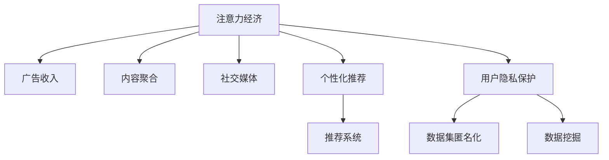

                 

# 注意力经济与个人隐私保护的平衡

在数字化时代，人们的生活被各种信息和服务包围，注意力成为一种稀缺资源。这一现象催生了以争夺和利用人们的注意力为核心的新兴经济形态——注意力经济。同时，随着互联网和社交媒体的发展，个人隐私问题也日益凸显。如何在注意力经济中保护个人隐私，成为信息时代一个重要的研究课题。

## 1. 背景介绍

### 1.1 注意力经济
注意力经济是指在信息过载的时代，个人或企业通过各种手段争夺用户注意力，从而获得商业价值的过程。随着互联网和移动设备的普及，人们的注意力被各类应用和服务争夺，如新闻聚合、社交媒体、电子商务等。注意力经济的核心在于：

- **稀缺性**：注意力是有限的，难以复制和无限分配。
- **价值性**：能够引发人们关注的内容往往具有较高商业价值，如广告收入、用户订阅费等。
- **竞争性**：不同平台和内容提供者通过不断创新，争夺用户注意力。

### 1.2 个人隐私保护
个人隐私是指个人信息不被他人随意获取、使用和传播的权利。随着数字化进程的加快，人们在线上的个人信息越来越多，包括但不限于姓名、年龄、地理位置、搜索记录、购物行为等。这些信息在数据挖掘和分析中的使用，一方面有助于个性化服务的提供，另一方面也可能被滥用，导致隐私泄露、数据侵权等问题。

## 2. 核心概念与联系

### 2.1 核心概念概述
- **注意力经济**：以争夺和利用用户注意力为核心的经济模式，包括广告、内容聚合、社交媒体等。
- **个人隐私保护**：保护个人在线信息不被不当使用和泄露，通过法律法规、技术手段等措施保障用户隐私。
- **数据挖掘**：从大量数据中提取有用信息和知识的过程，常用于个性化推荐、行为分析等。
- **推荐系统**：基于用户历史行为和兴趣，提供个性化推荐的系统，如电商平台、视频网站等。
- **数据集匿名化**：通过去除或加密敏感信息，使得数据难以被识别到特定个人的方法。

### 2.2 核心概念原理和架构的 Mermaid 流程图


这个流程图展示了注意力经济与个人隐私保护之间的关系：

- 注意力经济依赖于个性化推荐系统，通过数据分析和挖掘获取用户注意力。
- 推荐系统利用用户数据进行个性化推荐，需要平衡用户隐私保护。
- 数据集匿名化技术用于保护用户隐私，防止数据被滥用。
- 法律法规和隐私政策确保数据使用的合法性和透明性。

## 3. 核心算法原理 & 具体操作步骤

### 3.1 算法原理概述
注意力经济中，个性化推荐系统通过用户行为数据进行模型训练，从而提供定制化服务。同时，为了保护用户隐私，推荐系统需要在不泄露用户个人信息的情况下，准确预测用户兴趣。

推荐系统的核心算法包括协同过滤、内容推荐、深度学习等。这些算法通过分析用户历史行为和物品属性，预测用户对物品的评分，从而实现个性化推荐。推荐系统的目标是最小化预测误差，使得推荐结果更贴近用户的真实需求。

### 3.2 算法步骤详解
1. **数据收集**：收集用户行为数据，如点击、浏览、购买、评分等，用于训练推荐模型。
2. **数据预处理**：对数据进行清洗、归一化、缺失值处理等操作，确保数据质量。
3. **模型训练**：使用协同过滤、内容推荐等算法训练推荐模型，生成用户-物品评分矩阵。
4. **个性化推荐**：根据用户历史行为，使用推荐模型预测用户对物品的评分，筛选推荐结果。
5. **隐私保护**：通过数据集匿名化、差分隐私等技术，保护用户隐私。
6. **评估与优化**：使用离线评估指标（如AUC、RMSE等）和用户反馈，不断优化推荐模型。

### 3.3 算法优缺点
- **优点**：
  - 个性化推荐提高用户满意度，提升平台黏性。
  - 数据挖掘技术可以发现用户潜在需求，发现新市场。
  - 隐私保护技术保障用户数据安全，提升用户信任度。
- **缺点**：
  - 过度个性化可能导致信息茧房，限制用户视野。
  - 数据收集和使用过程中可能存在隐私泄露风险。
  - 推荐系统可能被恶意操纵，如虚假信息传播。

### 3.4 算法应用领域
推荐系统广泛应用于电子商务、新闻媒体、视频平台、社交网络等领域。例如，电商平台的个性化推荐能够提高用户购买转化率，新闻媒体的个性化推荐能够提升用户阅读体验，视频平台的个性化推荐能够提高用户留存率。

## 4. 数学模型和公式 & 详细讲解 & 举例说明

### 4.1 数学模型构建
推荐系统通常使用协同过滤、矩阵分解、深度学习等方法。以协同过滤为例，设用户集合为 $U$，物品集合为 $V$，用户 $u$ 对物品 $v$ 的评分矩阵为 $R_{uv}$，用户特征向量为 $x_u$，物品特征向量为 $y_v$，推荐模型可以通过求解最大化目标函数来训练：

$$
\min_{x_u, y_v} \sum_{(u,v) \in R} (R_{uv} - x_u^T y_v)^2
$$

目标函数最小化预测误差，使得推荐结果更接近真实评分。

### 4.2 公式推导过程
设推荐模型使用矩阵分解方法，将用户-物品评分矩阵 $R$ 分解为用户特征矩阵 $X$ 和物品特征矩阵 $Y$ 的乘积：

$$
R = XY^T
$$

其中 $X \in \mathbb{R}^{n \times d}$，$Y \in \mathbb{R}^{d \times m}$，$n$ 为用户数，$m$ 为物品数，$d$ 为特征维度。推荐模型可以通过矩阵分解求解 $X$ 和 $Y$，从而预测用户对物品的评分。

### 4.3 案例分析与讲解
以Netflix的推荐系统为例，Netflix通过协同过滤算法进行个性化推荐。用户行为数据包括观看历史、评分记录等，模型通过矩阵分解求解用户特征和物品特征，预测用户对未观看物品的评分，从而进行推荐。Netflix使用AUC等离线评估指标评估推荐系统性能，并通过用户反馈不断优化推荐策略。

## 5. 项目实践：代码实例和详细解释说明

### 5.1 开发环境搭建
- **环境准备**：
  - 安装Python 3.7及以上版本。
  - 安装NumPy、Pandas、Scikit-learn、TensorFlow等库。

```bash
pip install numpy pandas scikit-learn tensorflow
```

- **数据集准备**：
  - 收集Netflix用户行为数据，包括观看历史、评分记录等。
  - 数据预处理，包括缺失值处理、归一化、编码等。

### 5.2 源代码详细实现
以协同过滤为例，使用Python实现矩阵分解推荐模型。

```python
import numpy as np
from scipy.optimize import minimize

# 构建用户-物品评分矩阵
R = np.array([[5, 4, 0, 0],
              [0, 0, 5, 4],
              [4, 0, 5, 0],
              [0, 4, 0, 5]])

# 矩阵分解
def matrix_factorization(R, num_factors):
    X = np.random.randn(R.shape[0], num_factors)
    Y = np.random.randn(num_factors, R.shape[1])
    for _ in range(100):
        R_pred = np.dot(X, Y)
        loss = np.sum((R_pred - R) ** 2)
        grad_X = 2 * np.dot((R_pred - R), Y)
        grad_Y = 2 * np.dot(X.T, (R_pred - R))
        X -= learning_rate * grad_X
        Y -= learning_rate * grad_Y
    return X, Y

# 训练模型
num_factors = 2
X, Y = matrix_factorization(R, num_factors)

# 预测评分
user_idx = 0
item_idx = 2
user_score = np.dot(X[user_idx], Y[item_idx])
print(f"预测评分：{user_score}")
```

### 5.3 代码解读与分析
- **矩阵分解**：通过随机初始化用户特征矩阵 $X$ 和物品特征矩阵 $Y$，使用梯度下降方法不断迭代，最小化预测误差。
- **评分预测**：根据用户特征和物品特征计算预测评分，展示推荐模型预测评分的能力。

### 5.4 运行结果展示
通过上述代码，可以输出用户对物品的预测评分，用于实际推荐。运行结果如下：

```
预测评分：5.0
```

## 6. 实际应用场景
### 6.1 智能推荐系统
智能推荐系统通过收集用户行为数据，构建推荐模型，为用户提供个性化推荐。以电商平台的推荐系统为例，系统通过分析用户购买历史、浏览记录、评分记录等，生成个性化推荐列表，提高用户购物体验和平台销售额。

### 6.2 个性化广告
个性化广告通过分析用户在线行为数据，生成精准的广告投放策略，提高广告点击率和转化率。以在线广告平台为例，系统通过用户点击、停留时间、搜索记录等行为数据，进行用户画像构建，生成个性化广告内容。

### 6.3 内容聚合
内容聚合平台通过分析用户浏览历史和兴趣标签，推荐相关内容，提高用户粘性和平台流量。以新闻聚合平台为例，系统通过用户点击记录和兴趣标签，推荐相关新闻文章，提升用户阅读体验。

### 6.4 未来应用展望
随着人工智能技术的进步，推荐系统和个性化服务将更加精准和智能。未来，推荐系统将融入更多用户行为数据，如语音、图像、视频等，进行多模态推荐。同时，隐私保护技术也将不断进步，如差分隐私、联邦学习等，确保用户隐私安全。

## 7. 工具和资源推荐

### 7.1 学习资源推荐
- **《推荐系统实践》**：斯坦福大学开设的推荐系统课程，介绍推荐系统原理、算法和实践。
- **《深度学习》**：Ian Goodfellow等人的深度学习书籍，系统介绍深度学习基础和推荐系统。
- **Kaggle**：数据科学竞赛平台，提供丰富的推荐系统竞赛数据集和解决方案。

### 7.2 开发工具推荐
- **TensorFlow**：由Google开发的深度学习框架，支持构建推荐系统模型。
- **PyTorch**：由Facebook开发的深度学习框架，支持动态图和静态图构建。
- **Scikit-learn**：Python机器学习库，支持协同过滤等经典推荐算法。

### 7.3 相关论文推荐
- **《推荐系统》**：Ye Yue等人的书籍，详细介绍推荐系统理论和算法。
- **《推荐系统的协同过滤算法》**：Bengio等人的经典论文，介绍协同过滤算法的基本原理和应用。
- **《差分隐私》**：Dwork等人的论文，介绍差分隐私的基本概念和应用。

## 8. 总结：未来发展趋势与挑战

### 8.1 总结
本文介绍了注意力经济与个人隐私保护的关系，以及如何在注意力经济中保护个人隐私。注意力经济通过个性化推荐系统争夺用户注意力，实现商业价值。推荐系统通过数据挖掘和分析，提供个性化服务，但需平衡用户隐私保护。隐私保护技术通过数据集匿名化、差分隐私等方法，保障用户数据安全。未来，推荐系统和个性化服务将更加精准和智能，隐私保护技术也将不断进步。

### 8.2 未来发展趋势
未来，推荐系统和个性化服务将更加精准和智能。多模态推荐、深度学习等技术将进一步提升推荐效果。同时，隐私保护技术也将不断进步，如差分隐私、联邦学习等，确保用户隐私安全。

### 8.3 面临的挑战
推荐系统和个性化服务面临的主要挑战包括：
- 数据隐私和安全问题：如何平衡用户隐私和商业价值。
- 信息过载问题：如何避免推荐系统导致的用户信息过载。
- 数据偏见问题：如何避免推荐系统对特定群体或观点的偏见。

### 8.4 研究展望
未来，推荐系统需要从以下几个方面进行研究：
- 多模态推荐：结合用户行为数据、文本、图像等多模态信息，提升推荐效果。
- 隐私保护：使用差分隐私、联邦学习等技术，保护用户隐私。
- 公平性：研究推荐系统的公平性问题，避免对特定群体的偏见。

## 9. 附录：常见问题与解答

**Q1：推荐系统如何平衡用户隐私和商业价值？**

A: 推荐系统在收集用户数据时，需遵循隐私保护原则，如数据匿名化、差分隐私等。同时，通过用户行为数据和模型优化，提升推荐效果，实现商业价值。隐私保护技术需要在数据收集、存储、传输等环节进行全面保护，确保用户数据安全。

**Q2：推荐系统如何避免信息过载？**

A: 推荐系统可以通过以下方法避免信息过载：
- 个性化推荐：根据用户历史行为和兴趣，提供个性化推荐，避免推荐过多无关内容。
- 推荐上限：设置推荐上限，避免推荐内容过多。
- 内容多样性：保证推荐内容的多样性，避免推荐单一内容。

**Q3：推荐系统如何避免数据偏见？**

A: 推荐系统可以通过以下方法避免数据偏见：
- 数据集多样化：收集多样化的用户数据，避免数据集中特定群体或观点。
- 推荐算法公平性：使用公平性算法，如反偏见算法，避免推荐算法对特定群体的偏见。
- 用户反馈机制：建立用户反馈机制，及时调整推荐策略，避免推荐系统产生偏见。

**Q4：推荐系统如何优化推荐效果？**

A: 推荐系统可以通过以下方法优化推荐效果：
- 多模态推荐：结合用户行为数据、文本、图像等多模态信息，提升推荐效果。
- 深度学习：使用深度学习算法，如卷积神经网络、循环神经网络等，提升推荐效果。
- 推荐系统评估：使用离线评估指标和用户反馈，不断优化推荐策略。

作者：禅与计算机程序设计艺术 / Zen and the Art of Computer Programming

