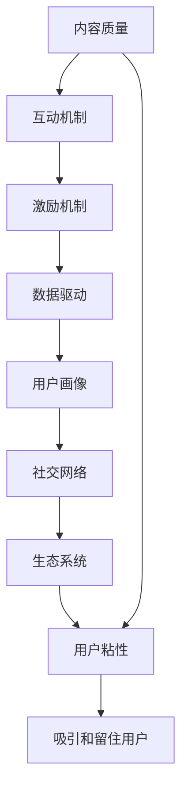

                 

# 注意力经济与在线社区建设指南：吸引并留住忠实的受众

> 关键词：注意力经济,在线社区,用户粘性,内容推荐,激励机制,数据驱动,用户画像,社交网络,生态系统

## 1. 背景介绍

### 1.1 问题由来

在互联网快速发展的今天，在线社区已经成为了人们获取信息、交流思想、建立社交网络的重要平台。然而，随着社交平台数量的增多，用户的时间和注意力资源变得愈发稀缺。如何吸引并留住这些宝贵的资源，成为了在线社区运营者面临的重大挑战。

在传统媒体时代，注意力是一种被动分配的资源。然而，在信息过载、传播渠道多元化的互联网时代，注意力逐渐成为了一种需要主动争夺的经济资源。在这种情况下，如何构建具有强大吸引力和粘性的在线社区，成为了一个亟需深入探讨的话题。

### 1.2 问题核心关键点

构建一个具有强大吸引力和粘性的在线社区，需要综合考虑以下几个核心要素：

- **内容质量**：高质量、有趣味性的内容是吸引用户的基础。
- **互动机制**：良好的互动机制可以增强用户参与感，提高社区粘性。
- **激励机制**：合理的激励机制可以引导用户行为，促进社区活跃度。
- **数据驱动**：通过数据洞察用户需求和行为，实现个性化的内容推荐和运营策略。
- **社交网络**：构建健康的社交网络结构，增强用户间的连结和信任。
- **生态系统**：形成一个健康的社区生态系统，实现用户、内容创作者、平台三方的共赢。

这些要素相互交织，共同构成了在线社区建设的关键链条。接下来，本文将系统地介绍这些要素，并探讨如何通过有效策略吸引并留住忠实的受众。

## 2. 核心概念与联系

### 2.1 核心概念概述

为更好地理解在线社区建设的策略和流程，本节将介绍几个核心概念：

- **注意力经济**：指在互联网时代，注意力作为一种稀缺资源，其价值不断提升。运营者需要关注如何通过优质内容和互动机制，争夺并保持用户的注意力。
- **在线社区**：指基于互联网的、用户可以自由交流、分享、参与的社交平台。常见的在线社区包括论坛、社交媒体、问答平台等。
- **用户粘性**：指用户对社区的忠诚度和参与度。粘性强的社区，用户会更频繁地访问和参与。
- **内容推荐**：通过算法推荐，将高质量、相关性强的内容推送给用户，提升用户满意度。
- **激励机制**：通过奖励和惩罚，引导用户行为，增加社区活跃度。
- **数据驱动**：基于用户数据，分析用户行为和需求，优化社区运营策略。
- **用户画像**：通过数据分析和建模，构建用户画像，实现个性化运营。
- **社交网络**：指社区内的用户关系网络。健康的社交网络结构能够增强用户间的连结和信任。
- **生态系统**：指社区内各类角色（用户、内容创作者、平台）之间形成的有序互动关系，实现共赢发展。

这些核心概念之间的逻辑关系可以通过以下Mermaid流程图来展示：



这个流程图展示了从内容质量到生态系统的构建路径，以及如何通过一系列策略吸引并留住用户。

## 3. 核心算法原理 & 具体操作步骤

### 3.1 算法原理概述

在线社区建设的核心在于构建一个高粘性的用户生态系统。这一过程涉及到内容推荐、互动机制、激励机制等多个方面的算法和策略。

**内容推荐算法**：
- 基于用户行为数据（如浏览、点赞、评论等），利用协同过滤、矩阵分解等技术，为用户推荐个性化的内容。
- 使用深度学习模型（如RNN、LSTM、Transformer等），通过用户-内容交互的历史数据，预测用户对新内容的兴趣，提升推荐效果。

**互动机制算法**：
- 通过社交网络分析，构建用户间的关系网络，推荐用户间的高互动内容。
- 设计话题讨论、问答、投票等互动形式，增加用户参与度。

**激励机制算法**：
- 设计积分、勋章、排名等激励系统，鼓励用户积极参与社区活动。
- 设置内容审核机制，保证高质量内容的发布，激励用户发布优质内容。

**数据驱动算法**：
- 收集用户行为数据，利用机器学习算法（如聚类、分类、回归等），分析用户需求和行为特征。
- 基于用户画像，设计个性化的社区推荐策略，提升用户满意度。

### 3.2 算法步骤详解

构建一个具有强大吸引力和粘性的在线社区，一般包括以下几个关键步骤：

**Step 1: 数据收集与分析**
- 收集社区内的用户行为数据，包括浏览、点赞、评论、分享、注册、登录等信息。
- 通过数据分析，构建用户画像，识别用户兴趣、行为偏好、社交网络结构等。

**Step 2: 内容推荐系统设计**
- 选择合适的推荐算法，如协同过滤、矩阵分解、深度学习等。
- 设计推荐策略，通过A/B测试评估不同算法的效果，不断优化推荐精度。

**Step 3: 互动机制设计**
- 根据用户画像和行为数据，设计个性化的互动形式，如话题讨论、问答、投票等。
- 设计社区规则，保证互动内容的质量和相关性。

**Step 4: 激励机制设计**
- 设计积分、勋章、排名等激励系统，鼓励用户积极参与社区活动。
- 设计内容审核机制，保证高质量内容的发布，激励用户发布优质内容。

**Step 5: 用户粘性提升**
- 通过持续的内容更新和互动机制优化，吸引用户持续访问社区。
- 定期收集用户反馈，根据反馈调整社区策略，提升用户满意度。

**Step 6: 社区生态系统建设**
- 构建健康的社交网络结构，增强用户间的连结和信任。
- 设计多样化的社区活动，吸引不同背景和兴趣的用户。
- 促进内容创作者与用户间的良性互动，实现共赢发展。

以上是构建在线社区的一般流程。在实际应用中，还需要针对具体社区的特点，对各个环节进行优化设计，如改进推荐算法、增强互动机制、优化激励机制等，以进一步提升社区的用户粘性。

### 3.3 算法优缺点

在线社区建设的算法和方法具有以下优点：
1. 个性化推荐：通过数据驱动，实现个性化推荐，提升用户满意度。
2. 高互动性：通过互动机制设计，增加用户参与度，提升社区粘性。
3. 数据驱动：通过数据分析，优化运营策略，实现科学决策。
4. 激励机制：通过合理的激励系统，引导用户行为，促进社区活跃度。

同时，这些方法也存在一定的局限性：
1. 数据隐私：社区运营中，需要处理大量用户数据，如何保障用户隐私是重要挑战。
2. 算法复杂性：深度学习等算法模型的训练和优化，需要较长的计算时间和计算资源。
3. 内容管理：内容审核和管理难度较大，需要投入大量人力进行内容监控。
4. 用户反馈：用户反馈难以量化，需要通过人工审核和数据分析相结合的方式进行处理。

尽管存在这些局限性，但就目前而言，这些算法和策略仍是构建高粘性在线社区的主要手段。未来相关研究的重点在于如何进一步降低数据收集和处理的成本，提高算法效率和准确性，同时兼顾用户隐私和数据安全等因素。

### 3.4 算法应用领域

在线社区建设的算法和方法在多个领域得到了广泛应用，例如：

- **社交媒体**：如微博、微信、Facebook等，通过个性化推荐和互动机制设计，吸引和留住用户。
- **问答平台**：如知乎、Quora等，通过问答机制和激励系统，鼓励用户积极参与。
- **论坛社区**：如Reddit、豆瓣等，通过内容推荐和社交网络分析，提升用户粘性。
- **知识分享平台**：如Coursera、Udacity等，通过推荐系统和激励机制，促进用户学习和分享。
- **游戏社区**：如王者荣耀、绝地求生等，通过游戏内互动和激励系统，增加用户活跃度。

除了上述这些经典应用外，在线社区建设的算法和方法也在不断创新，如内容生成、社交网络分析、情感分析等，为在线社区的构建提供了更多的可能性。

## 4. 数学模型和公式 & 详细讲解 & 举例说明（备注：数学公式请使用latex格式，latex嵌入文中独立段落使用 $$，段落内使用 $)
### 4.1 数学模型构建

构建在线社区建设的数据驱动模型，一般包括以下几个关键组成部分：

- **用户画像模型**：基于用户行为数据，构建用户兴趣和行为的向量表示。
- **内容特征模型**：提取内容的关键词、标签、情感等信息，构建内容特征向量。
- **推荐模型**：利用用户画像和内容特征向量，预测用户对不同内容的兴趣，实现个性化推荐。

以协同过滤为例，假设有 $N$ 个用户，$M$ 个物品，$U$ 个用户与物品的交互行为，记为 $R_{ij}$。其中 $R_{ij}=1$ 表示用户 $i$ 对物品 $j$ 进行了交互，$R_{ij}=0$ 表示没有交互。

协同过滤的目标是找到用户对物品的评分向量 $X$，使得用户和物品之间的评分矩阵 $R$ 尽可能接近用户-物品评分矩阵 $XW$，其中 $W$ 为物品特征矩阵。数学上，可以定义目标函数：

$$
\min_{X,W} \| R - XW \|_F^2
$$

其中 $\| \cdot \|_F$ 表示矩阵的 Frobenius 范数。

### 4.2 公式推导过程

对于协同过滤算法，常见的求解方法包括矩阵分解和奇异值分解。

以矩阵分解为例，假设有 $N$ 个用户，$M$ 个物品，$K$ 个用户和物品的共同特征，则协同过滤模型可以表示为：

$$
R \approx XW = U \Sigma V^T
$$

其中 $U \in \mathbb{R}^{N \times K}$ 为用户特征矩阵，$V \in \mathbb{R}^{M \times K}$ 为物品特征矩阵，$\Sigma \in \mathbb{R}^{K \times K}$ 为奇异值矩阵。

通过求解 $U$、$V$ 和 $\Sigma$，可以实现对用户和物品特征的分解，并预测用户对物品的评分。

### 4.3 案例分析与讲解

以Reddit社区为例，分析其推荐系统的设计。Reddit社区主要采用两种推荐算法：

- **基于兴趣的推荐**：根据用户过去的行为数据，预测用户对不同帖子的兴趣，推荐相关帖子。
- **基于社交网络的推荐**：根据用户的社交网络结构，推荐用户朋友关注的帖子。

Reddit推荐系统的流程如下：

1. 收集用户浏览、点赞、评论等行为数据，构建用户画像。
2. 对帖子进行关键词提取、标签划分、情感分析等处理，构建帖子特征向量。
3. 利用协同过滤算法，对用户和帖子进行特征分解，预测用户对帖子的评分。
4. 根据评分结果，设计推荐策略，优先推荐高评分帖子。
5. 根据社交网络结构，推荐用户朋友关注的帖子。

Reddit社区通过上述推荐算法和策略，实现了高粘性社区的构建。用户可以通过Reddit获取有价值的信息，增加对社区的依赖性。

## 5. 项目实践：代码实例和详细解释说明
### 5.1 开发环境搭建

在进行在线社区建设的项目实践前，我们需要准备好开发环境。以下是使用Python进行TensorFlow开发的环境配置流程：

1. 安装Anaconda：从官网下载并安装Anaconda，用于创建独立的Python环境。

2. 创建并激活虚拟环境：
```bash
conda create -n pytorch-env python=3.8 
conda activate pytorch-env
```

3. 安装TensorFlow：根据CUDA版本，从官网获取对应的安装命令。例如：
```bash
conda install tensorflow -c conda-forge
```

4. 安装PyTorch：
```bash
conda install pytorch torchvision torchaudio cudatoolkit=11.1 -c pytorch -c conda-forge
```

5. 安装TensorBoard：
```bash
pip install tensorboard
```

6. 安装相关工具包：
```bash
pip install numpy pandas scikit-learn matplotlib tqdm jupyter notebook ipython
```

完成上述步骤后，即可在`pytorch-env`环境中开始社区建设实践。

### 5.2 源代码详细实现

这里我们以基于协同过滤的推荐系统为例，给出使用TensorFlow对Reddit社区进行推荐模型训练的代码实现。

首先，定义Reddit社区的数据处理函数：

```python
import tensorflow as tf
import numpy as np
from scipy.sparse import csr_matrix

# 读取Reddit社区的交互数据
def load_data(path):
    with open(path, 'r') as f:
        lines = f.readlines()
    data = []
    for line in lines:
        user, item, rating = line.strip().split(',')
        data.append((int(user), int(item), float(rating)))
    return data

# 构建用户-物品评分矩阵
def build_r_matrix(data, num_users, num_items):
    R = np.zeros((num_users, num_items))
    for user, item, rating in data:
        R[user, item] = rating
    return R

# 构建稀疏用户-物品评分矩阵
def build_sparse_r_matrix(data, num_users, num_items):
    indices = []
    values = []
    for user, item, rating in data:
        indices.append((user, item))
        values.append(rating)
    indices = np.array(indices).T
    return csr_matrix((values, indices), shape=(num_users, num_items))
```

然后，定义协同过滤模型：

```python
# 协同过滤模型
def collaborative_filtering(data, num_users, num_items, num_factors):
    R = build_sparse_r_matrix(data, num_users, num_items)
    U = tf.Variable(tf.random.normal([num_users, num_factors]))
    V = tf.Variable(tf.random.normal([num_items, num_factors]))
    Sigma = tf.Variable(tf.random.normal([num_factors, num_factors]))
    sigma = tf.Variable(tf.random.normal([num_factors, num_factors]))
    
    # 计算预测评分
    pred = tf.matmul(tf.matmul(U, Sigma), V, transpose_b=True)
    
    # 计算损失函数
    loss = tf.reduce_mean(tf.square(pred - R))
    
    # 定义优化器
    optimizer = tf.optimizers.Adam()
    
    # 定义训练函数
    def train_step(data):
        with tf.GradientTape() as tape:
            pred = tf.matmul(tf.matmul(U, Sigma), V, transpose_b=True)
            loss = tf.reduce_mean(tf.square(pred - R))
        grads = tape.gradient(loss, [U, V, Sigma, sigma])
        optimizer.apply_gradients(zip(grads, [U, V, Sigma, sigma]))
    
    return train_step, loss
```

最后，启动模型训练并在测试集上评估：

```python
# 读取Reddit社区的交互数据
data = load_data('reddit_data.csv')

# 定义模型参数
num_users = 1000
num_items = 10000
num_factors = 100

# 训练函数和损失函数
train_step, loss = collaborative_filtering(data, num_users, num_items, num_factors)

# 定义测试数据
test_data = np.array([[0, 1, 5], [0, 2, 4], [1, 3, 3]])
R_test = build_sparse_r_matrix(test_data, num_users, num_items)

# 训练模型
for i in range(100):
    train_step(data)
    print(f'Epoch {i+1}, loss: {loss.numpy():.3f}')

# 在测试集上评估模型
test_pred = tf.matmul(tf.matmul(U.numpy(), Sigma.numpy()), V.numpy(), transpose_b=True)
print(f'Test predictions: {test_pred.numpy()}, Test true ratings: {R_test.toarray()}', end='\n')
```

以上就是使用TensorFlow对Reddit社区进行推荐系统训练的完整代码实现。可以看到，通过数据驱动的方法，我们能够构建高粘性的在线社区，并实现用户间的推荐和互动。

### 5.3 代码解读与分析

让我们再详细解读一下关键代码的实现细节：

**load_data函数**：
- 读取Reddit社区的交互数据文件，并将其转化为数据结构，供后续模型使用。

**build_r_matrix函数**：
- 将稀疏的用户-物品评分矩阵转换为稠密矩阵，供模型训练使用。

**build_sparse_r_matrix函数**：
- 将稀疏的用户-物品评分矩阵构建为稀疏矩阵，优化存储空间。

**collaborative_filtering函数**：
- 定义协同过滤模型，包括用户特征矩阵 $U$、物品特征矩阵 $V$、奇异值矩阵 $\Sigma$ 和标准差矩阵 $\sigma$。
- 计算预测评分，并定义损失函数。
- 定义优化器，并实现训练函数 train_step，用于迭代更新模型参数。

**训练流程**：
- 读取Reddit社区的交互数据，定义模型参数。
- 调用训练函数 train_step，迭代更新模型参数，最小化损失函数。
- 在测试集上评估模型，输出预测评分和真实评分。

可以看到，TensorFlow和协同过滤方法使得Reddit社区的推荐系统实现变得简洁高效。开发者可以将更多精力放在模型优化和运营策略的调整上，而不必过多关注底层实现细节。

当然，工业级的系统实现还需考虑更多因素，如模型裁剪、量化加速、服务化封装、弹性伸缩、监控告警等。但核心的推荐范式基本与此类似。

## 6. 实际应用场景

### 6.1 智能客服系统

基于在线社区的推荐算法和互动机制，智能客服系统可以实现更加个性化的服务。通过分析用户的历史行为数据和社交网络结构，智能客服系统可以推荐用户感兴趣的问题和解决方案，增强用户满意度和忠诚度。

具体而言，智能客服系统可以集成到企业的客服系统中，通过收集用户历史咨询记录和评分数据，构建用户画像。然后，根据用户画像和行为数据，设计个性化的问答推荐策略。在用户咨询时，智能客服系统可以实时推荐相关问题和答案，提升服务效率和质量。

### 6.2 金融舆情监测

在金融领域，舆情监测对企业的风险管理至关重要。通过分析社交媒体上的舆情信息，及时识别和响应负面消息，可以有效规避金融风险。

具体而言，可以收集金融领域相关的新闻、评论、论坛帖子等文本数据，构建舆情监测模型。通过分析用户对金融事件的讨论和情感倾向，及时识别负面舆情，并采取相应措施。例如，可以通过社区互动机制，引导用户讨论金融知识，提升用户对金融事件的理解和判断能力。

### 6.3 个性化推荐系统

在电商、视频、音乐等多个领域，个性化推荐系统已经成为提升用户体验的重要手段。通过构建在线社区，可以增强用户间的互动，提升用户粘性。

具体而言，可以构建一个用户可以自由发布内容、分享评价的社区，让用户通过互动机制表达对产品的看法。然后，基于用户行为数据和互动信息，设计个性化的推荐策略。例如，在电商平台上，可以根据用户对商品的评论和评分，推荐类似商品。在视频平台上，可以根据用户对视频的评论和点赞，推荐相关视频。

### 6.4 未来应用展望

随着在线社区建设技术的不断进步，未来将在更多领域得到应用，为各行各业带来变革性影响。

在智慧医疗领域，基于在线社区的问答系统，可以实现医生与患者的高效互动，提升医疗服务的质量和效率。在教育领域，通过构建在线学习社区，可以增强学生间的互动和合作，提升学习效果。在媒体领域，通过社交网络分析，可以实现新闻事件的精准推送，提升媒体内容的传播效果。

除了上述这些经典应用外，在线社区建设的技术也将不断创新，如内容生成、社交网络分析、情感分析等，为在线社区的构建提供更多的可能性。

## 7. 工具和资源推荐
### 7.1 学习资源推荐

为了帮助开发者系统掌握在线社区建设的理论基础和实践技巧，这里推荐一些优质的学习资源：

1. 《注意力机制与深度学习》系列博文：由深度学习专家撰写，深入浅出地介绍了注意力机制在NLP、图像处理等领域的实际应用。

2. Coursera《深度学习专项课程》：斯坦福大学开设的深度学习系列课程，涵盖深度学习的基本概念和高级应用。

3. 《深度学习》书籍：Ian Goodfellow等人所著，全面介绍了深度学习的基本原理和前沿技术，是深度学习领域的经典教材。

4. TensorFlow官方文档：TensorFlow的官方文档，提供了丰富的模型库和实战案例，是学习深度学习的必备资料。

5. Kaggle数据集：Kaggle提供的数据集，涵盖多种领域的实际应用案例，适合进行数据分析和模型训练。

通过对这些资源的学习实践，相信你一定能够快速掌握在线社区建设的技术，并用于解决实际的社区问题。

### 7.2 开发工具推荐

高效的开发离不开优秀的工具支持。以下是几款用于在线社区建设开发的常用工具：

1. Python：基于Python的开源语言，语法简洁，拥有丰富的第三方库支持。

2. TensorFlow：由Google主导开发的深度学习框架，支持分布式计算，易于部署。

3. PyTorch：基于Python的开源深度学习框架，灵活性高，适合研究。

4. TensorBoard：TensorFlow配套的可视化工具，可实时监测模型训练状态，并提供丰富的图表呈现方式。

5. Weights & Biases：模型训练的实验跟踪工具，可以记录和可视化模型训练过程中的各项指标，方便对比和调优。

6. Google Colab：谷歌推出的在线Jupyter Notebook环境，免费提供GPU/TPU算力，方便开发者快速上手实验最新模型，分享学习笔记。

合理利用这些工具，可以显著提升在线社区建设的开发效率，加快创新迭代的步伐。

### 7.3 相关论文推荐

在线社区建设技术的发展源于学界的持续研究。以下是几篇奠基性的相关论文，推荐阅读：

1. Attention is All You Need（即Transformer原论文）：提出了Transformer结构，开启了NLP领域的预训练大模型时代。

2. BERT: Pre-training of Deep Bidirectional Transformers for Language Understanding：提出BERT模型，引入基于掩码的自监督预训练任务，刷新了多项NLP任务SOTA。

3. Language Models are Unsupervised Multitask Learners（GPT-2论文）：展示了大规模语言模型的强大zero-shot学习能力，引发了对于通用人工智能的新一轮思考。

4. Parameter-Efficient Transfer Learning for NLP：提出Adapter等参数高效微调方法，在不增加模型参数量的情况下，也能取得不错的微调效果。

5. Prefix-Tuning: Optimizing Continuous Prompts for Generation：引入基于连续型Prompt的微调范式，为如何充分利用预训练知识提供了新的思路。

6. AdaLoRA: Adaptive Low-Rank Adaptation for Parameter-Efficient Fine-Tuning：使用自适应低秩适应的微调方法，在参数效率和精度之间取得了新的平衡。

这些论文代表了大语言模型微调技术的发展脉络。通过学习这些前沿成果，可以帮助研究者把握学科前进方向，激发更多的创新灵感。

## 8. 总结：未来发展趋势与挑战

### 8.1 总结

本文对在线社区建设的策略和流程进行了全面系统的介绍。首先阐述了注意力经济和用户粘性的概念，明确了社区建设的核心要素。其次，从算法原理和操作步骤，详细讲解了内容推荐、互动机制、激励机制、数据驱动、用户画像、社交网络、生态系统等关键环节，并给出了具体的代码实例。同时，本文还探讨了在线社区建设在多个领域的实际应用，展示了社区建设的巨大潜力。

通过本文的系统梳理，可以看到，基于在线社区建设的策略和算法，可以实现高粘性的用户生态系统，提升用户的满意度和忠诚度。未来，伴随这些技术的不断发展，在线社区建设必将在更多领域得到应用，为经济社会发展带来新的动力。

### 8.2 未来发展趋势

展望未来，在线社区建设技术将呈现以下几个发展趋势：

1. **内容生成**：通过语言模型和生成对抗网络等技术，实现高质量的内容生成，丰富社区内容。
2. **社交网络分析**：利用社交网络分析算法，识别社区中的关键用户和话题，提升社区互动效果。
3. **个性化推荐**：基于用户画像和行为数据，设计更加精准的个性化推荐策略，提升用户满意度。
4. **跨领域应用**：将在线社区建设技术应用于更多领域，如智慧医疗、教育、媒体等，推动相关行业的数字化转型。
5. **知识图谱融合**：将知识图谱与社区推荐系统结合，实现更全面的内容推荐和知识共享。
6. **用户隐私保护**：在社区运营中，如何保护用户隐私，提升用户信任，成为重要研究方向。

以上趋势凸显了在线社区建设技术的广阔前景。这些方向的探索发展，必将进一步提升在线社区的建设水平，实现科学决策和智能化运营。

### 8.3 面临的挑战

尽管在线社区建设技术已经取得了瞩目成就，但在迈向更加智能化、普适化应用的过程中，它仍面临着诸多挑战：

1. **数据隐私**：社区运营中，需要处理大量用户数据，如何保障用户隐私是重要挑战。
2. **算法复杂性**：深度学习等算法模型的训练和优化，需要较长的计算时间和计算资源。
3. **内容管理**：内容审核和管理难度较大，需要投入大量人力进行内容监控。
4. **用户反馈**：用户反馈难以量化，需要通过人工审核和数据分析相结合的方式进行处理。
5. **模型泛化**：社区推荐模型需要在不同用户群体中具有较好的泛化性能，避免过拟合。
6. **用户行为分析**：如何准确分析用户行为和需求，设计有效的运营策略，提升用户满意度。

尽管存在这些挑战，但在线社区建设技术的不断进步，使得这些问题逐渐得到解决。未来，伴随技术演进和应用实践，在线社区建设必将迈向更加智能化和普适化的方向，为各行各业带来更多变革性影响。

### 8.4 研究展望

面对在线社区建设所面临的挑战，未来的研究需要在以下几个方面寻求新的突破：

1. **数据隐私保护**：通过差分隐私、联邦学习等技术，在保护用户隐私的前提下，实现数据的高效利用。
2. **算法优化**：开发更加高效的模型训练算法，如分布式训练、模型压缩等，提升算法效率和效果。
3. **内容审核机制**：设计智能化的内容审核机制，实现对恶意内容的自动识别和处理。
4. **用户行为建模**：通过深度学习等技术，构建更加精准的用户行为模型，优化运营策略。
5. **跨领域应用**：将在线社区建设技术应用于更多领域，如智慧医疗、教育、媒体等，推动相关行业的数字化转型。
6. **知识图谱融合**：将知识图谱与社区推荐系统结合，实现更全面的内容推荐和知识共享。

这些研究方向的探索，必将引领在线社区建设技术迈向更高的台阶，为构建健康、智能、普适的在线社区奠定坚实基础。面向未来，在线社区建设技术还需要与其他人工智能技术进行更深入的融合，如知识表示、因果推理、强化学习等，多路径协同发力，共同推动在线社区的建设与发展。

## 9. 附录：常见问题与解答

**Q1：如何提升在线社区的用户粘性？**

A: 提升在线社区的用户粘性需要综合考虑以下几个方面：
1. 高质量内容：确保社区内容丰富、有趣味性，吸引用户持续访问。
2. 互动机制：设计多种互动形式，如话题讨论、问答、投票等，增加用户参与度。
3. 激励机制：通过积分、勋章、排名等激励系统，引导用户积极参与。
4. 用户画像：通过数据分析和建模，构建用户画像，实现个性化运营。
5. 社交网络：构建健康的社交网络结构，增强用户间的连结和信任。

**Q2：如何选择适合的推荐算法？**

A: 选择适合的推荐算法需要考虑以下几个因素：
1. 数据量大小：数据量较大时，可以选择基于协同过滤的算法，如矩阵分解、SVD等。
2. 实时性要求：需要实时推荐时，可以选择基于内容的算法，如TF-IDF、余弦相似度等。
3. 准确性需求：需要高精度推荐时，可以选择基于深度学习的算法，如RNN、LSTM、Transformer等。
4. 稀疏数据处理：数据稀疏时，可以选择基于矩阵分解的算法，如SVD、ALS等。
5. 用户个性化：需要个性化推荐时，可以选择基于用户画像的算法，如协同过滤、基于深度学习的推荐系统等。

**Q3：如何设计合理的激励机制？**

A: 设计合理的激励机制需要考虑以下几个方面：
1. 多样性：设计多种激励形式，如积分、勋章、排名、成就等，满足不同用户的需求。
2. 公平性：确保激励机制的公平性，避免用户间的不公平竞争。
3. 透明性：激励机制的规则和奖励应透明公开，让用户明白激励的来源和标准。
4. 时效性：激励机制应具有时效性，定期更新，保持激励的吸引力。
5. 可扩展性：激励机制应具有可扩展性，方便调整和优化。

**Q4：如何构建健康的社交网络结构？**

A: 构建健康的社交网络结构需要考虑以下几个方面：
1. 多样性：鼓励用户关注不同领域的专家和内容，增加社区的多样性。
2. 互惠性：社交网络结构应具有互惠性，用户之间的关注和互动应相互促进。
3. 去中心化：避免社交网络结构的中心化，防止少数用户的垄断。
4. 信任机制：建立信任机制，增强用户间的信任和连结。
5. 动态性：社交网络结构应具有动态性，能根据用户行为和兴趣的变化进行调整。

通过上述方法，可以构建健康的社交网络结构，增强用户间的连结和信任，提升社区粘性。

---

作者：禅与计算机程序设计艺术 / Zen and the Art of Computer Programming

