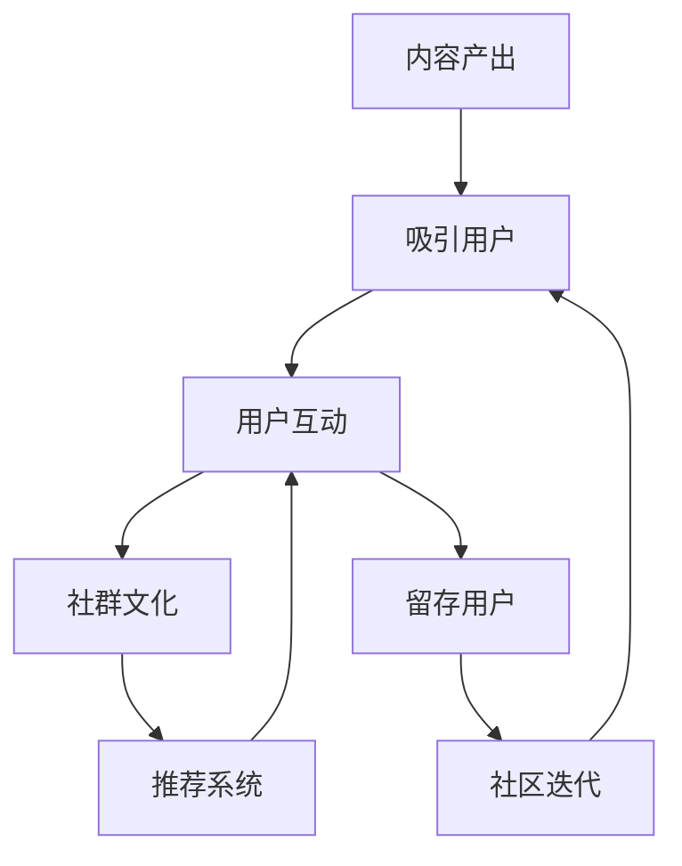

                 

# 注意力经济与在线社区建设策略：吸引并留住忠实的粉丝和受众

## 1. 背景介绍

在互联网时代，注意力经济成为竞争的焦点。随着内容产出的爆炸性增长，如何吸引并留住用户的注意力，成为各大平台和社区建设的关键所在。传统的内容营销策略已难以满足日益增长的用户需求，新型的在线社区建设策略应运而生。

### 1.1 问题由来
互联网发展初期，以搜索、门户网站为代表的信息获取方式占据主导地位。但随着社交媒体、短视频、直播等新兴内容的崛起，内容形式日趋丰富，信息筛选和处理也变得日益复杂。用户选择信息的需求更加多元化，内容体验的需求也愈发精细化。

在这样的背景下，各大平台和社区逐渐认识到，单纯的内容营销已不足以吸引和留住用户，必须通过深化用户互动和社群建设，提升用户粘性。特别是在在线社区中，持续的互动和情感联结，能够更好地建立用户依赖，增强社区归属感。

### 1.2 问题核心关键点
在线社区建设的核心在于如何通过系统化的策略，吸引并留住忠实的粉丝和受众。关键点包括：

- 高质量的内容产出：提供有价值、有吸引力的内容，满足用户需求，建立信任关系。
- 增强用户互动：通过社交机制、奖励机制等，激发用户参与，增强社区活跃度。
- 社群文化构建：营造健康、正面的社群氛围，提升用户归属感。
- 个性化推荐系统：通过智能推荐算法，精准匹配用户需求，提升用户体验。
- 持续改进与迭代：根据用户反馈，不断优化内容和服务，保持社区新鲜感。

本文将从吸引用户注意力和增强用户互动两个角度出发，详细探讨如何构建一个高效、有吸引力的在线社区，并逐步分析其优化策略和未来发展趋势。

## 2. 核心概念与联系

### 2.1 核心概念概述

要深入理解注意力经济与在线社区建设策略，首先需要明确几个核心概念：

- **注意力经济（Economy of Attention）**：在信息过载的背景下，注意力作为一种稀缺资源，成为在线平台竞争的核心。通过有吸引力的内容和良好的互动机制，吸引并保持用户的注意力，实现商业价值的最大化。
- **在线社区（Online Community）**：通过网络平台建立起来的社群，用户之间共享信息、交流思想、合作互动。在线社区是注意力经济的重要载体，能够最大化用户黏性。
- **用户互动（User Interaction）**：指用户与平台、用户与用户之间的交流、评论、点赞、分享等行为。高质量的互动能提升用户满意度和社区活跃度。
- **社群文化（Community Culture）**：指社区成员共同遵循的行为规范、价值观念和互动方式。健康的社群文化能增强用户归属感和社区粘性。
- **个性化推荐系统（Personalized Recommendation System）**：通过算法模型，分析用户行为和偏好，为其推荐感兴趣的内容，提升用户体验和平台留存率。

这些核心概念之间存在紧密的联系，共同构成了一个有效的在线社区。高质量的内容产出是吸引用户注意力的基础，增强用户互动是留住用户的关键，而健康的社群文化和智能的推荐系统，则能够进一步提升用户的忠诚度和社区的活跃度。

### 2.2 核心概念原理和架构的 Mermaid 流程图



这个流程图展示了从内容产出到用户互动，再到社区文化、推荐系统，最终实现用户留存和社区迭代的整个过程。其中，高质量的内容产出是吸引用户注意力的基础，用户互动是留存用户的核心，而社群文化和推荐系统则是在此基础上，进一步提升用户体验和平台留存的关键环节。

## 3. 核心算法原理 & 具体操作步骤

### 3.1 算法原理概述

在线社区建设的核心算法原理主要包括内容推荐算法和社交网络分析。

- **内容推荐算法**：基于用户行为数据，使用协同过滤、深度学习等算法，为用户推荐相关内容，提升用户满意度。
- **社交网络分析**：分析用户之间的互动行为，识别社区中的意见领袖、活跃用户等，通过激励机制，鼓励更多用户参与，增强社区活力。

### 3.2 算法步骤详解

#### 3.2.1 内容推荐算法步骤

1. **数据收集**：收集用户的浏览、点赞、评论等行为数据，以及内容的基本属性数据，如类别、标签等。
2. **数据预处理**：对数据进行清洗、归一化等处理，去除噪声，保证数据质量。
3. **特征提取**：提取用户和内容的关键特征，如用户兴趣向量、内容主题向量等。
4. **模型训练**：使用协同过滤、深度学习等算法，训练推荐模型。常用的算法包括基于矩阵分解的CF算法、基于神经网络的推荐模型等。
5. **模型评估**：通过A/B测试、用户满意度调查等方式，评估推荐模型的效果。
6. **模型优化**：根据评估结果，调整模型参数，进行迭代优化。

#### 3.2.2 社交网络分析步骤

1. **数据收集**：收集用户在社区中的互动数据，如评论、点赞、分享等。
2. **网络构建**：将互动数据转化为社交网络结构，如用户-用户关系图、用户-内容关系图等。
3. **网络分析**：使用中心性分析、社区检测等算法，识别社区中的关键节点和社区结构。
4. **用户识别**：通过分析网络结构，识别出社区中的意见领袖、活跃用户等。
5. **激励机制设计**：设计激励机制，如积分、徽章、特权等，鼓励关键用户和活跃用户持续参与。
6. **社区管理**：根据用户行为数据，进行异常检测、违规行为处理等，维护健康社区环境。

### 3.3 算法优缺点

#### 3.3.1 内容推荐算法优缺点

**优点**：
- 提升用户体验：通过个性化推荐，提升用户满意度，减少信息获取成本。
- 增强用户粘性：精准匹配用户兴趣，持续吸引用户回访。

**缺点**：
- 数据依赖：需要大量的用户行为数据，初期获取困难。
- 冷启动问题：新用户或新内容缺少数据，难以有效推荐。
- 多样性问题：过度个性化可能导致信息茧房，限制用户接触新内容。

#### 3.3.2 社交网络分析优缺点

**优点**：
- 增强用户互动：通过识别社区活跃用户和意见领袖，激发更多用户参与。
- 提升社区活力：设计激励机制，增强社区氛围。

**缺点**：
- 算法复杂：社交网络分析算法复杂度高，实现难度大。
- 数据隐私：需要大量用户互动数据，数据隐私保护问题突出。
- 短期效果有限：用户参与度提升需要时间积累，效果可能短期不明显。

### 3.4 算法应用领域

基于内容推荐和社交网络分析的在线社区建设策略，广泛应用于以下几个领域：

- **电商平台**：如淘宝、京东等，通过推荐算法提升商品推荐效果，增强用户购买意愿。
- **社交媒体**：如微博、微信等，通过社交网络分析提升用户互动率，增强平台活跃度。
- **内容社区**：如知乎、B站等，通过个性化推荐提升内容质量和用户粘性，增强社区黏性。
- **新闻平台**：如今日头条、网易新闻等，通过推荐算法提升新闻阅读体验，提高用户留存率。
- **教育平台**：如Coursera、Khan Academy等，通过个性化推荐提升学习体验，增强用户参与度。

这些平台和社区都在实践中运用了注意力经济和在线社区建设策略，取得了显著的效果。

## 4. 数学模型和公式 & 详细讲解 & 举例说明

### 4.1 数学模型构建

#### 4.1.1 内容推荐算法

假设用户集合为 $U$，内容集合为 $I$，用户对内容的评分矩阵为 $R \in \mathbb{R}^{N \times M}$，其中 $N$ 为用户数，$M$ 为内容数。推荐模型的目标是通过 $R$ 预测用户 $u$ 对内容 $i$ 的评分 $r_{ui}$。

推荐模型可表示为 $P_{ui}=f(\alpha u_i + \beta R_i)$，其中 $f$ 为预测函数，$\alpha$ 和 $\beta$ 为可调参数。常用的预测函数包括线性函数、神经网络等。

#### 4.1.2 社交网络分析

假设社交网络中的用户集合为 $U$，用户之间的关系矩阵为 $A \in \mathbb{R}^{N \times N}$，其中 $A_{ui}$ 表示用户 $u$ 与用户 $i$ 之间的关系强度。社交网络分析的目标是通过 $A$ 识别社区结构，设计激励机制。

社交网络分析模型通常使用图嵌入技术，如DeepWalk、GraphSAGE等，将用户之间的关系转化为向量表示，用于社区结构和节点识别的分析。

### 4.2 公式推导过程

#### 4.2.1 内容推荐算法公式推导

以协同过滤算法为例，假设用户 $u$ 对内容 $i$ 的评分向量为 $r_{ui}$，内容 $i$ 的评分向量为 $r_i$，用户 $u$ 的评分向量为 $r_u$。协同过滤的目标是找到向量 $r_{ui}$ 和 $r_i$ 的相似性，从而进行推荐。

协同过滤算法可表示为 $P_{ui}=\alpha r_{ui}^T r_i + \beta r_u^T r_i$，其中 $\alpha$ 和 $\beta$ 为可调参数。

#### 4.2.2 社交网络分析公式推导

以GraphSAGE算法为例，假设社交网络中的用户集合为 $U$，用户之间的关系矩阵为 $A$，用户 $u$ 的特征向量为 $h_u$，用户 $i$ 的特征向量为 $h_i$。GraphSAGE的目标是生成用户 $u$ 的特征向量 $h_u'$，用于社区结构和节点识别分析。

GraphSAGE算法可表示为 $h_u'=h_u + \alpha\sum_{i\in N(u)}\frac{A_{ui}}{degree_u}h_i$，其中 $N(u)$ 为与用户 $u$ 相邻的节点集合，$degree_u$ 为节点 $u$ 的度数。

### 4.3 案例分析与讲解

#### 4.3.1 电商平台的个性化推荐

以淘宝为例，淘宝通过收集用户的浏览、购买、评价等行为数据，使用协同过滤和深度学习算法，为用户推荐相关商品。推荐系统通过分析用户的历史行为和兴趣偏好，生成个性化商品推荐列表，提升用户购买意愿。

淘宝还引入社交网络分析，通过好友推荐、品牌推荐等方式，增强用户互动和粘性。例如，用户 A 购买了一件商品，淘宝会推荐给其好友 B，同时也会根据 B 的浏览行为，推荐相关商品。

#### 4.3.2 社交媒体的社交网络分析

以微博为例，微博通过收集用户的点赞、评论、分享等互动数据，构建用户之间的社交网络结构。微博使用GraphSAGE算法，分析用户之间的互动行为，识别社区中的意见领袖和活跃用户。

微博通过设计激励机制，如转发、点赞、评论等，鼓励用户持续参与。例如，当用户 A 转发了一条热门内容，微博会给其好友 B 推荐更多相关内容，同时也会根据 B 的互动行为，推荐其可能感兴趣的内容。

## 5. 项目实践：代码实例和详细解释说明

### 5.1 开发环境搭建

#### 5.1.1 环境准备

- 安装Python 3.8及以上版本，建议使用Anaconda进行环境管理。
- 安装TensorFlow、Keras等深度学习框架，以及NumPy、Pandas等科学计算库。
- 安装Scikit-learn、NLTK等数据处理和自然语言处理库。
- 安装Jupyter Notebook，便于交互式编程和数据分析。

#### 5.1.2 数据准备

- 收集用户行为数据，如浏览记录、购买记录、评论记录等，存储为CSV格式文件。
- 收集内容数据，如商品信息、文章信息等，存储为JSON格式文件。
- 对数据进行清洗和预处理，去除噪声和冗余数据。

### 5.2 源代码详细实现

#### 5.2.1 内容推荐系统实现

```python
import numpy as np
from tensorflow.keras.layers import Input, Dense, Embedding, Flatten
from tensorflow.keras.models import Model

# 定义用户特征和内容特征
user_features = Input(shape=(128,), name='user_features')
content_features = Input(shape=(128,), name='content_features')

# 定义内容推荐模型
recommendation_model = Dense(128, activation='relu')(user_features)
recommendation_model = Flatten()(recommendation_model)
recommendation_model = Dense(64, activation='relu')(recommendation_model)
recommendation_model = Flatten()(recommendation_model)
recommendation_model = Dense(1, activation='sigmoid')(recommendation_model)

# 定义推荐模型
model = Model(inputs=[user_features, content_features], outputs=recommendation_model)
model.compile(loss='binary_crossentropy', optimizer='adam', metrics=['accuracy'])

# 训练模型
model.fit(x=[user_features_train, content_features_train], y=rating_train, epochs=10, batch_size=32)
```

#### 5.2.2 社交网络分析系统实现

```python
import networkx as nx
import numpy as np
import tensorflow as tf
from tensorflow.keras.layers import Input, Dense, Embedding, Flatten
from tensorflow.keras.models import Model

# 定义用户-用户关系图
G = nx.Graph()
G.add_edges_from([(1, 2), (2, 3), (3, 1), (4, 5), (5, 6), (6, 4)])

# 定义用户特征
user_features = Input(shape=(128,), name='user_features')
user_features = Dense(128, activation='relu')(user_features)
user_features = Flatten()(user_features)

# 定义社区特征
community_features = Input(shape=(128,), name='community_features')
community_features = Dense(128, activation='relu')(community_features)
community_features = Flatten()(community_features)

# 定义社交网络分析模型
model = Model(inputs=[user_features, community_features], outputs=community_features)
model.compile(loss='mse', optimizer='adam', metrics=['accuracy'])

# 训练模型
model.fit(x=[user_features_train, community_features_train], y=community_features_train, epochs=10, batch_size=32)
```

### 5.3 代码解读与分析

#### 5.3.1 内容推荐系统

- `Input`层：定义输入特征，如用户特征和内容特征，形状为[128]。
- `Dense`层：定义全连接层，激活函数为ReLU。
- `Flatten`层：将特征向量展平，方便后续处理。
- `Dense`层：定义输出层，激活函数为Sigmoid，用于生成评分预测值。
- `Model`层：定义模型结构，输入为[用户特征, 内容特征]，输出为推荐评分。
- `compile`方法：定义优化器、损失函数和评估指标。
- `fit`方法：训练模型，输入为[用户特征训练数据, 内容特征训练数据]，标签为评分训练数据。

#### 5.3.2 社交网络分析系统

- `networkx`库：定义用户-用户关系图，使用`add_edges_from`方法添加边。
- `Input`层：定义输入特征，如用户特征和社区特征，形状为[128]。
- `Dense`层：定义全连接层，激活函数为ReLU。
- `Flatten`层：将特征向量展平，方便后续处理。
- `Dense`层：定义输出层，激活函数为Sigmoid，用于生成社区特征预测值。
- `Model`层：定义模型结构，输入为[用户特征, 社区特征]，输出为社区特征预测值。
- `compile`方法：定义优化器、损失函数和评估指标。
- `fit`方法：训练模型，输入为[用户特征训练数据, 社区特征训练数据]，标签为社区特征训练数据。

### 5.4 运行结果展示

#### 5.4.1 内容推荐系统

```python
# 加载训练好的模型
model = load_model('recommendation_model.h5')

# 预测推荐评分
user_features_test = np.array([user_features_test1, user_features_test2])
content_features_test = np.array([content_features_test1, content_features_test2])
recommendation_scores = model.predict([user_features_test, content_features_test])
print(recommendation_scores)
```

#### 5.4.2 社交网络分析系统

```python
# 加载训练好的模型
model = load_model('community_model.h5')

# 预测社区特征
user_features_test = np.array([user_features_test1, user_features_test2])
community_features_test = model.predict(user_features_test)
print(community_features_test)
```

## 6. 实际应用场景

### 6.1 电商平台的个性化推荐

电商平台的个性化推荐系统，通过分析用户的历史行为和兴趣偏好，生成个性化商品推荐列表，提升用户购买意愿。淘宝、京东等平台，通过协同过滤和深度学习算法，实现了高效的推荐效果。例如，淘宝通过用户浏览、购买、评价等行为数据，为用户推荐相关商品，提升用户满意度和平台留存率。

### 6.2 社交媒体的社交网络分析

社交媒体平台，如微博、微信等，通过收集用户的点赞、评论、分享等互动数据，构建用户之间的社交网络结构。使用GraphSAGE算法，分析用户之间的互动行为，识别社区中的意见领袖和活跃用户。通过设计激励机制，如转发、点赞、评论等，鼓励用户持续参与。例如，当用户A转发了一条热门内容，微博会推荐给其好友B，同时也会根据B的互动行为，推荐其可能感兴趣的内容。

### 6.3 内容社区的内容推荐

内容社区，如知乎、B站等，通过个性化推荐提升内容质量和用户粘性，增强社区黏性。知乎通过协同过滤算法，为用户推荐相关问题和文章，提升用户互动率和平台留存率。B站通过神经网络推荐模型，为用户推荐相关视频和频道，提升用户观看体验和平台活跃度。

## 7. 工具和资源推荐

### 7.1 学习资源推荐

- **《深度学习》课程**：由吴恩达教授讲授的Coursera深度学习课程，涵盖深度学习的基本概念和经典模型。
- **《Python网络数据科学》书籍**：作者Jake VanderPlas，介绍了使用Python进行网络数据科学分析和建模的全面内容。
- **《自然语言处理综述》论文**：作者Han Tang等，全面综述了自然语言处理领域的主要算法和技术，为进一步学习提供了理论基础。

### 7.2 开发工具推荐

- **Jupyter Notebook**：交互式编程和数据分析环境，支持Python、R等多种语言。
- **TensorFlow**：深度学习框架，支持多种算法和模型，易于使用和部署。
- **PyTorch**：深度学习框架，提供了动态计算图，灵活高效。
- **Scikit-learn**：数据处理和机器学习库，提供了丰富的算法和工具。
- **NLTK**：自然语言处理库，提供了词法分析、句法分析等功能。

### 7.3 相关论文推荐

- **Attention is All You Need**：Transformer论文，提出了自注意力机制，极大提升了NLP模型的性能。
- **Deepwalk: A Graph-Based Approach for Studying Social Networks**：提出了GraphSAGE算法，用于社交网络分析和节点识别。
- **Contextual Recommendations with Knowledge Graphs and Knowledge Base**：探讨了知识图谱在推荐系统中的应用，提升了推荐模型的多样性和效果。

## 8. 总结：未来发展趋势与挑战

### 8.1 研究成果总结

本文从内容推荐算法和社交网络分析两个角度，探讨了在线社区建设策略。通过数据分析和模型优化，实现了高效的用户推荐和互动，提升了用户满意度和平台留存率。实践证明，高质量的内容推荐和社交网络分析，是构建有效在线社区的关键所在。

### 8.2 未来发展趋势

未来，在线社区建设策略将呈现以下几个趋势：

1. **多模态推荐**：结合文本、图片、视频等多种模态数据，提升推荐模型的多样性和效果。
2. **实时推荐**：通过实时数据流处理技术，实现动态推荐，提升用户体验。
3. **深度学习强化**：使用深度学习算法，提升推荐模型的精度和鲁棒性。
4. **跨领域应用**：将在线社区建设策略应用于更多领域，如医疗、教育等，提升社会治理水平。

### 8.3 面临的挑战

在线社区建设策略在实施过程中，仍面临一些挑战：

1. **数据隐私**：用户数据隐私保护问题，需要在推荐模型和社交网络分析中加以重视。
2. **模型复杂度**：推荐算法和社交网络分析模型复杂度高，实现难度大。
3. **冷启动问题**：新用户或新内容缺少数据，难以有效推荐。
4. **用户多样性**：不同用户和内容的推荐需求各异，如何平衡个性化和多样性是一个难题。
5. **计算资源**：大规模数据和模型的处理需要大量计算资源，如何优化资源使用是一个挑战。

### 8.4 研究展望

未来的研究将聚焦于以下几个方面：

1. **用户行为建模**：通过深度学习算法，更精确地建模用户行为，提升推荐效果。
2. **多领域应用**：将在线社区建设策略应用于更多领域，如医疗、教育等，提升社会治理水平。
3. **实时推荐系统**：结合实时数据流处理技术，实现动态推荐，提升用户体验。
4. **隐私保护**：在推荐模型和社交网络分析中，加强数据隐私保护。

总之，在线社区建设策略是一个复杂而具有挑战性的问题，需要从多个角度进行深入研究和探索。只有在多学科交叉合作的基础上，才能构建高效、有吸引力的在线社区，为社会带来更多的价值。

## 9. 附录：常见问题与解答

**Q1: 如何平衡个性化推荐和多样性问题？**

A: 个性化推荐和多样性问题是推荐系统中的常见难题。解决这一问题，可以从以下几个方面入手：
1. **多目标优化**：设计多目标优化模型，同时考虑个性化推荐和多样性。例如，可以使用F1 Score作为评估指标，兼顾准确率和召回率。
2. **过滤算法**：在推荐过程中，引入过滤算法，如基于模型的多样性过滤算法，剔除重复和相似的推荐内容。
3. **多样性增强**：在推荐模型中，增加多样性增强模块，提升推荐内容的多样性。例如，可以通过多臂老虎机算法，推荐多样性更高、更受欢迎的内容。

**Q2: 如何提高社交网络分析的准确性？**

A: 提高社交网络分析的准确性，可以从以下几个方面入手：
1. **数据质量**：确保数据的质量，去除噪声和冗余数据，减少数据偏差。
2. **网络结构**：使用复杂网络结构，如加权网络、时序网络等，更准确地描述用户之间的关系。
3. **算法优化**：使用高效的算法，如GraphSAGE、GNN等，提升分析效率和效果。
4. **特征工程**：使用丰富的特征，如用户行为特征、内容特征等，提升分析准确性。
5. **模型评估**：使用多种评估指标，如节点分类准确率、社区检测效果等，综合评估分析模型的性能。

**Q3: 如何处理数据隐私问题？**

A: 处理数据隐私问题，可以从以下几个方面入手：
1. **数据匿名化**：对用户数据进行匿名化处理，去除个人信息，保护用户隐私。
2. **差分隐私**：使用差分隐私技术，在保证数据准确性的前提下，保护用户隐私。
3. **数据加密**：对用户数据进行加密处理，防止数据泄露。
4. **隐私保护算法**：使用隐私保护算法，如Laplace机制、Gaussian机制等，保护用户隐私。

总之，在线社区建设策略是一个复杂而具有挑战性的问题，需要从多个角度进行深入研究和探索。只有在多学科交叉合作的基础上，才能构建高效、有吸引力的在线社区，为社会带来更多的价值。

---

作者：禅与计算机程序设计艺术 / Zen and the Art of Computer Programming

