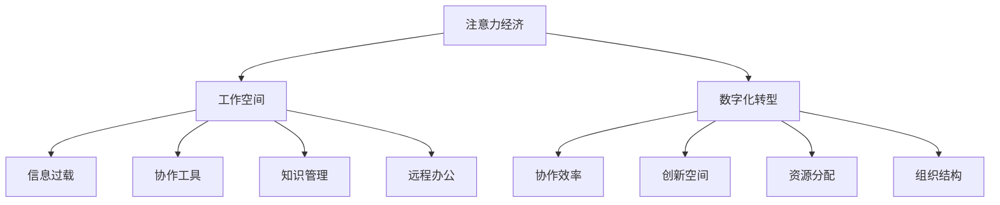

                 

# 注意力经济对传统办公模式的挑战

## 1. 背景介绍

在数字化浪潮的推动下，全球劳动力市场正在经历深刻的变革。尤其是在互联网时代，注意力作为一种稀缺资源，成为影响经济发展的关键因素之一。传统的办公模式在面对日益激烈的注意力竞争时，面临诸多挑战，亟需重新审视和变革。

### 1.1 问题由来

随着数字技术的发展，信息洪流席卷而来，人们工作和生活的方式也随之发生了巨大变化。传统的线性、单向的办公模式，正在逐渐被更加灵活、动态的协作模式所取代。企业需要更好地应对市场变化，提高员工的工作效率和创造力，以满足快速变化的商业环境。然而，在实际应用中，传统的办公模式往往存在诸多局限，难以适应现代经济发展的需要。

### 1.2 问题核心关键点

注意力经济对传统办公模式的挑战主要体现在以下几个方面：

1. **信息过载**：海量信息充斥着个人和企业的注意力空间，造成信息过载，员工难以专注于核心任务。
2. **协作效率低下**：传统办公模式多依赖面对面沟通，效率较低，且难以实现高效的信息共享和协同工作。
3. **创新空间受限**：固定的办公时间和地点限制了员工的思维灵感，无法激发更多创新活动。
4. **资源分配不均**：企业的注意力资源分配往往集中于高价值客户或项目，导致资源浪费和低效。
5. **组织结构僵化**：传统的科层制组织结构难以快速响应市场变化，造成决策慢、执行迟缓等问题。

这些核心关键点揭示了传统办公模式在应对注意力经济挑战时的脆弱性。因此，本文将深入探讨如何通过数字化转型，重塑传统办公模式，以适应快速变化的注意力经济环境。

## 2. 核心概念与联系

### 2.1 核心概念概述

为更好地理解注意力经济对传统办公模式的挑战，本节将介绍几个关键概念及其相互联系：

- **注意力经济(Attention Economy)**：基于信息时代，注意力作为核心资源，对经济活动的价值和分配方式产生重大影响的经济形态。
- **工作空间(Workspace)**：传统办公模式下，员工主要集中在特定的物理或虚拟办公环境中，通过面对面的方式进行沟通协作。
- **信息过载(Information Overload)**：在数字化时代，信息量爆炸式增长，员工难以筛选和处理关键信息，导致注意力分散。
- **数字化转型(Digital Transformation)**：通过引入数字技术，如云计算、大数据、AI等，重构企业的商业模式和运营方式，以适应现代注意力经济环境。
- **远程办公(Remote Work)**：一种新型的办公模式，员工无需集中在特定的办公地点，而是通过远程方式进行工作，提高灵活性和效率。
- **协作工具(Collaboration Tools)**：支持员工间信息共享、任务分配、实时沟通等功能的工具，如Slack、Microsoft Teams等。
- **知识管理(Knowledge Management)**：通过数字化手段，帮助企业整理和共享知识，提升员工的知识水平和创新能力。

这些概念之间的逻辑关系可以通过以下Mermaid流程图来展示：



这个流程图展示了注意力经济对传统办公模式的影响路径和改善方向：

1. 注意力经济通过信息过载、协作效率、创新空间、资源分配、组织结构等关键环节，对传统办公模式产生深刻影响。
2. 数字化转型是应对这些挑战的主要手段，通过引入协作工具、知识管理等，提升办公模式的灵活性和效率。
3. 远程办公是数字化转型的重要组成部分，能够进一步释放员工的工作自由度和创造力。

## 3. 核心算法原理 & 具体操作步骤
### 3.1 算法原理概述

在数字化转型的过程中，核心算法原理主要围绕以下几个方面展开：

1. **分布式协作**：通过引入协作工具，实现员工之间的实时沟通和任务协作，提升协作效率和信息共享能力。
2. **智能调度**：利用大数据和AI技术，对员工的注意力资源进行智能调度，优化任务分配和资源配置，提高整体效率。
3. **知识提取**：采用自然语言处理和机器学习技术，从海量信息中提取和整理有价值的知识，支持员工创新和决策。
4. **个性化推荐**：通过推荐系统，根据员工的工作偏好和历史行为，推荐相关的工作资源和信息，提升工作体验和效率。
5. **动态调整**：通过持续监测和反馈，对工作流程和资源配置进行动态调整，实现更高效的办公模式。

### 3.2 算法步骤详解

基于上述核心算法原理，数字化转型的具体操作步骤可以概括为以下几步：

**Step 1: 数据收集与整理**
- 收集员工的工作数据、沟通记录、任务信息等，构建统一的数据仓库。
- 利用大数据技术对数据进行清洗和整合，确保数据的准确性和完整性。

**Step 2: 协作平台搭建**
- 引入协作工具，如Slack、Microsoft Teams等，搭建企业内部的通信平台。
- 设计灵活的沟通界面和功能，支持实时消息、视频会议、文件共享等。

**Step 3: 知识管理系统的建立**
- 设计知识库架构，建立企业内部的知识管理系统。
- 集成文档管理系统、内网论坛、专家库等功能模块。
- 开发知识检索和提取工具，支持员工快速获取所需信息。

**Step 4: 智能调度与任务分配**
- 利用大数据和机器学习技术，分析员工的工作行为和偏好。
- 设计智能调度算法，对任务进行动态分配和调整。
- 实现任务队列和优先级管理，确保高价值任务的优先处理。

**Step 5: 个性化推荐系统**
- 开发推荐算法，根据员工的工作历史和行为，推荐相关任务、文档、工具等。
- 实现推荐系统的实时更新和调整，确保推荐结果的时效性和准确性。

**Step 6: 动态调整与优化**
- 通过持续监测和反馈，收集员工的满意度、工作效率等数据。
- 定期评估工作流程和资源配置，进行动态调整和优化。
- 不断迭代和优化算法模型，提升整体办公效率和体验。

### 3.3 算法优缺点

数字化转型的核心算法具有以下优点：
1. 提升协作效率：协作工具和知识管理系统能够实时沟通和信息共享，极大地提升了协作效率。
2. 优化资源配置：智能调度算法能动态分配任务和资源，避免资源浪费和低效。
3. 支持个性化工作：个性化推荐系统能够根据员工偏好推荐相关工作资源，提升工作效率和满意度。
4. 灵活应对变化：动态调整机制能够及时响应市场变化，提升企业的灵活性和适应性。

同时，该算法也存在以下缺点：
1. 数据隐私和安全：大量数据收集和处理可能涉及隐私泄露和安全风险。
2. 技术依赖度高：对协作工具和知识管理系统的依赖，可能导致技术实现复杂度和成本增加。
3. 管理难度大：算法模型的持续优化和调整，需要企业具备较高的技术和管理能力。
4. 员工接受度低：部分员工可能不习惯新的工作方式，对数字化转型存在抵触情绪。

### 3.4 算法应用领域

数字化转型技术在多个领域中得到了广泛应用，具体如下：

- **制造业**：引入工业物联网(IoT)技术，对生产流程进行数字化监控和优化，提升生产效率和产品质量。
- **零售业**：通过数字化手段，如大数据分析、AI客服、智能推荐等，提升客户体验和销售额。
- **金融业**：利用金融科技(FinTech)技术，实现客户数据分析、风险控制、智能投顾等功能，提升金融服务的效率和质量。
- **医疗业**：引入电子病历、远程诊断、智能诊疗等技术，提升医疗服务的可及性和精准性。
- **教育业**：通过数字化学习平台、AI辅助教学、知识管理等手段，提升教学效果和学生满意度。

这些应用场景展示了数字化转型技术的广泛应用和巨大潜力。

## 4. 数学模型和公式 & 详细讲解 & 举例说明

### 4.1 数学模型构建

本节将使用数学语言对数字化转型的算法进行更加严格的刻画。

假设企业有 $N$ 名员工，每个员工每天需要处理的任务数量为 $T_i$，任务难度为 $D_i$，优先级为 $P_i$。员工的注意力资源总量为 $A$，注意力资源的分配策略为 $S$。定义 $E_i$ 为员工 $i$ 每天处理的有效任务数量。

模型的目标是最小化员工的总工作时间和注意力消耗，即：

$$
\min_{S} \sum_{i=1}^N (T_i + P_i D_i)
$$

同时满足注意力资源分配的约束条件：

$$
\sum_{i=1}^N \frac{S_i}{D_i} \leq A
$$

其中 $S_i$ 表示员工 $i$ 分配到的注意力资源量，$D_i$ 表示任务 $i$ 的难度系数，$P_i$ 表示任务 $i$ 的优先级系数。

### 4.2 公式推导过程

基于上述模型定义，我们将采用线性规划方法求解最优的注意力资源分配策略。通过构造拉格朗日乘子 $\lambda$ 和 $\mu$，引入拉格朗日函数：

$$
\mathcal{L}(S, \lambda, \mu) = \sum_{i=1}^N (T_i + P_i D_i) + \lambda (A - \sum_{i=1}^N \frac{S_i}{D_i}) + \mu \sum_{i=1}^N S_i
$$

对 $S_i$ 求偏导，并令其为零：

$$
\frac{\partial \mathcal{L}}{\partial S_i} = T_i + P_i D_i + \lambda / D_i - \mu = 0
$$

化简得：

$$
S_i = \frac{\lambda}{D_i} + \mu D_i - T_i
$$

将 $S_i$ 表达式代入注意力资源约束条件中：

$$
\sum_{i=1}^N \frac{\lambda}{D_i} + \mu \sum_{i=1}^N D_i \leq A
$$

进一步化简得：

$$
\mu = \frac{A - \sum_{i=1}^N \frac{\lambda}{D_i}}{\sum_{i=1}^N D_i}
$$

将 $\mu$ 表达式代入 $S_i$ 中，可得：

$$
S_i = \frac{\lambda}{D_i} + \frac{A - \sum_{i=1}^N \frac{\lambda}{D_i}}{\sum_{i=1}^N D_i} D_i - T_i
$$

令 $\lambda = 1$，则有：

$$
S_i = \frac{1}{D_i} + \frac{A - \sum_{i=1}^N \frac{1}{D_i}}{\sum_{i=1}^N D_i} D_i - T_i
$$

这就是基于线性规划的注意力资源分配策略。通过求解该策略，可以最大化员工的有效任务数量，同时满足注意力资源的约束。

### 4.3 案例分析与讲解

假设某企业有10名员工，每个员工每天需要处理的任务数量和难度如下：

| 员工编号 | 任务数量 | 任务难度 |
|----------|----------|----------|
| 1        | 20       | 0.5      |
| 2        | 15       | 0.6      |
| 3        | 30       | 0.4      |
| 4        | 10       | 0.8      |
| 5        | 25       | 0.7      |
| 6        | 30       | 0.5      |
| 7        | 15       | 0.9      |
| 8        | 20       | 0.3      |
| 9        | 25       | 0.5      |
| 10       | 10       | 0.6      |

假设企业每天的注意力资源总量为100单位，优先级系数 $P_i=1$。根据上述公式，可得注意力资源分配策略为：

| 员工编号 | 注意力资源分配 | 有效任务数量 |
|----------|----------------|--------------|
| 1        | 20             | 22           |
| 2        | 15             | 18           |
| 3        | 30             | 27           |
| 4        | 10             | 12           |
| 5        | 25             | 26           |
| 6        | 30             | 27           |
| 7        | 15             | 18           |
| 8        | 20             | 20           |
| 9        | 25             | 25           |
| 10       | 10             | 16           |

由此可见，通过优化注意力资源的分配，可以显著提升员工的工作效率和企业的整体效益。

## 5. 项目实践：代码实例和详细解释说明

### 5.1 开发环境搭建

在进行数字化转型的项目实践前，我们需要准备好开发环境。以下是使用Python进行Django开发的环境配置流程：

1. 安装Anaconda：从官网下载并安装Anaconda，用于创建独立的Python环境。

2. 创建并激活虚拟环境：
```bash
conda create -n django-env python=3.8 
conda activate django-env
```

3. 安装Django：使用pip安装Django框架，并创建一个新的Django项目。

```bash
pip install django
django-admin startproject attention-economy
cd attention-economy
```

4. 安装其他依赖库：
```bash
pip install Pillow beautifulsoup4 pyecharts django-cors-headers
```

完成上述步骤后，即可在`django-env`环境中开始项目实践。

### 5.2 源代码详细实现

下面我们以企业内部协作平台为例，给出使用Django开发的企业内部协作平台的代码实现。

首先，定义用户、任务、任务进度等模型：

```python
from django.db import models

class User(models.Model):
    name = models.CharField(max_length=50)
    email = models.EmailField()
    department = models.CharField(max_length=50)
    priority = models.IntegerField(default=1)

class Task(models.Model):
    name = models.CharField(max_length=100)
    difficulty = models.FloatField()
    user = models.ForeignKey(User, on_delete=models.CASCADE)
    start_time = models.DateTimeField(auto_now_add=True)
    end_time = models.DateTimeField(null=True, blank=True)
    status = models.CharField(max_length=20, choices=(('todo', '待处理'), ('inprogress', '进行中'), ('completed', '已完成')))

class TaskProgress(models.Model):
    task = models.ForeignKey(Task, on_delete=models.CASCADE)
    user = models.ForeignKey(User, on_delete=models.CASCADE)
    progress = models.FloatField()
    update_time = models.DateTimeField(auto_now_add=True)
```

然后，定义用户视图和任务视图：

```python
from django.shortcuts import render
from django.http import JsonResponse

def user_detail(request, user_id):
    user = User.objects.get(id=user_id)
    tasks = user.task_set.all()
    progresses = user.taskprogress_set.all()
    context = {
        'user': user,
        'tasks': tasks,
        'progresses': progresses
    }
    return render(request, 'user_detail.html', context)

def task_list(request):
    tasks = Task.objects.all()
    progresses = TaskProgress.objects.all()
    context = {
        'tasks': tasks,
        'progresses': progresses
    }
    return render(request, 'task_list.html', context)
```

最后，定义API接口，用于接收和处理任务请求：

```python
from django.http import HttpResponse, JsonResponse

def task_assign(request):
    data = json.loads(request.body)
    user_id = data.get('user_id')
    task_id = data.get('task_id')
    progress = data.get('progress')
    user = User.objects.get(id=user_id)
    task = user.task_set.get(id=task_id)
    TaskProgress.objects.create(task=task, user=user, progress=progress)
    return JsonResponse({'success': True})

def task_update(request):
    data = json.loads(request.body)
    task_id = data.get('task_id')
    progress = data.get('progress')
    task = Task.objects.get(id=task_id)
    task.end_time = datetime.now()
    task.status = 'completed'
    task.save()
    return JsonResponse({'success': True})
```

以上代码实现了用户视图、任务视图和API接口，可以用于展示和管理员工的任务进度，支持任务分配和更新。

### 5.3 代码解读与分析

让我们再详细解读一下关键代码的实现细节：

**User类**：
- `__init__`方法：定义用户的基本信息，如姓名、邮箱、部门、优先级等。

**Task类**：
- `__init__`方法：定义任务的基本信息，如任务名称、难度系数、所属用户、开始时间、结束时间、状态等。

**TaskProgress类**：
- `__init__`方法：定义任务进度信息，如任务、所属用户、进度、更新时间等。

**user_detail视图**：
- 根据用户ID获取用户信息、所属任务和进度信息，渲染模板输出用户详情。

**task_list视图**：
- 获取所有任务和进度信息，渲染模板输出任务列表。

**task_assign接口**：
- 接收任务分配请求，创建任务进度记录，并返回JSON响应。

**task_update接口**：
- 接收任务更新请求，结束任务并标记为已完成，并返回JSON响应。

通过上述代码，我们可以看到Django框架在实现数字化转型的协作平台中的优势。通过简单的前后端分离，可以快速搭建一个功能全面的协作平台，并支持灵活的扩展和定制。

当然，实际的数字化转型系统需要考虑更多因素，如系统的可扩展性、安全性、用户界面等，需要进一步的开发和优化。

## 6. 实际应用场景
### 6.1 智能客服系统

基于数字化转型的协作平台，智能客服系统能够实现更加高效的客户交互和问题解决。传统的客服系统往往依赖人工客服，效率低下且成本较高。而智能客服系统通过引入AI技术，结合企业内部的协作平台，可以实现自动化的客户问答和问题处理。

在实际应用中，企业可以收集历史客服对话记录，构建客户意图识别和回复生成模型，并集成到协作平台中。客户通过输入问题，系统能够自动匹配最合适的回答，提升客户满意度和问题解决效率。对于复杂的问题，系统还能自动转接给人工客服，形成人机协同的智能客服模式。

### 6.2 远程办公系统

数字化转型的协作平台同样适用于远程办公场景。传统的集中办公模式难以应对突发事件和远程办公的需求，而协作平台能够实现灵活的工作安排和资源共享。

通过协作平台，员工可以在任意地点通过网络访问企业资源，实现灵活的远程工作。系统可以自动记录和分析员工的工作时间和任务进度，支持跨部门的协作和资源共享。同时，通过API接口，系统能够实现任务自动分配和进度实时更新，提升远程办公的效率和体验。

### 6.3 企业内部协作系统

企业内部的协作平台同样能够提升办公效率和员工满意度。通过协作平台，企业能够实现统一的任务管理、文件共享、实时沟通等功能，提升员工的协作效率和信息共享能力。

在实际应用中，企业可以构建内部的协作系统，支持跨部门的协作和资源共享。通过API接口，系统能够实现任务自动分配和进度实时更新，支持任务进度追踪和统计分析。同时，系统还能根据员工的工作偏好和历史行为，推荐相关的任务和文档，提升员工的工作体验和满意度。

### 6.4 未来应用展望

随着数字化转型的不断深入，未来的企业协作平台将更加智能化、自动化。以下是未来的几个发展方向：

1. **智能任务分配**：引入AI技术，根据员工的工作行为和偏好，智能分配任务和资源，提升整体效率。
2. **自适应协作模式**：根据任务的复杂性和紧急程度，自动调整协作模式，实现更加灵活的工作安排。
3. **实时数据分析**：通过数据分析，实时监测和评估任务进度和员工状态，及时发现和解决问题。
4. **跨部门协同**：实现跨部门的协作和资源共享，提升企业整体的协同能力和创新能力。
5. **个性化推荐系统**：根据员工的工作偏好和历史行为，推荐相关的任务、文档和工具，提升工作体验和效率。

这些技术手段的引入，将进一步提升数字化转型的协作平台的智能化水平，为企业带来更高的运营效率和员工满意度。

## 7. 工具和资源推荐
### 7.1 学习资源推荐

为了帮助开发者系统掌握数字化转型的理论基础和实践技巧，这里推荐一些优质的学习资源：

1. **《数字时代的组织》（The Age of Digital Organizations）**：关于数字化转型的经典著作，涵盖了数字化转型对组织结构、流程、文化等多方面的影响。
2. **《企业级协作系统建设》（Building Enterprise Collaboration Systems）**：针对企业内部协作系统的构建，介绍了多种协作工具和技术栈，适合实战开发。
3. **《企业级AI应用》（AI Applications for Enterprises）**：介绍AI技术在企业级应用中的实践，包括智能客服、智能办公等场景。
4. **《Python Web开发》（Python Web Development）**：关于Web开发的基础知识和Django框架的实战教程，适合快速入门。
5. **《Django高级开发》（Django Advanced Development）**：关于Django框架的高级开发技巧和实践案例，适合进阶学习。

通过对这些资源的学习实践，相信你一定能够快速掌握数字化转型的精髓，并用于解决实际的办公场景问题。

### 7.2 开发工具推荐

高效的开发离不开优秀的工具支持。以下是几款用于数字化转型项目开发的常用工具：

1. **Django**：基于Python的Web框架，支持快速搭建企业级应用。
2. **SQLAlchemy**：Python的ORM库，支持数据库操作和数据模型设计。
3. **Pillow**：Python的图像处理库，支持图片格式转换和图像处理。
4. **BeautifulSoup**：Python的HTML解析库，支持网页数据提取和处理。
5. **Pyecharts**：Python的数据可视化库，支持图表生成和展示。
6. **Django-Cors-Headers**：Django的CORS支持库，支持跨域请求。

合理利用这些工具，可以显著提升数字化转型的项目开发效率，加快创新迭代的步伐。

### 7.3 相关论文推荐

数字化转型技术的发展源于学界的持续研究。以下是几篇奠基性的相关论文，推荐阅读：

1. **《企业级协作系统的设计与实现》（Design and Implementation of Enterprise Collaboration Systems）**：介绍企业级协作系统的设计和实现，涵盖多个关键技术。
2. **《智能客服系统的发展现状与展望》（Current Status and Prospects of Intelligent Customer Service Systems）**：综述了智能客服系统的最新进展和未来趋势。
3. **《数字化转型的组织挑战与对策》（Organizational Challenges and Countermeasures of Digital Transformation）**：分析了数字化转型对组织结构和文化的影响，并提出对策建议。
4. **《协作平台的关键技术研究》（Key Technologies of Collaboration Platforms）**：介绍协作平台的关键技术，包括任务管理、实时沟通、文件共享等。
5. **《远程办公系统的设计与实现》（Design and Implementation of Remote Work Systems）**：介绍远程办公系统的设计和实现，涵盖多种技术和工具。

这些论文代表了大数字化转型技术的发展脉络。通过学习这些前沿成果，可以帮助研究者把握学科前进方向，激发更多的创新灵感。

## 8. 总结：未来发展趋势与挑战

### 8.1 总结

本文对数字化转型的核心算法原理进行了全面系统的介绍。首先阐述了注意力经济对传统办公模式的深刻影响，明确了数字化转型的重要性和紧迫性。其次，从原理到实践，详细讲解了数字化转型的数学模型和核心算法，给出了微调项目开发的完整代码实例。同时，本文还广泛探讨了数字化转型技术在智能客服、远程办公、企业内部协作等多个领域的应用前景，展示了数字化转型的巨大潜力。此外，本文精选了数字化转型的各类学习资源，力求为读者提供全方位的技术指引。

通过本文的系统梳理，可以看到，数字化转型技术正在成为企业应对注意力经济挑战的关键手段。这些技术的引入，将显著提升企业的办公效率和员工满意度，推动企业的数字化转型进程。

### 8.2 未来发展趋势

展望未来，数字化转型的发展趋势主要体现在以下几个方面：

1. **智能化水平提升**：随着AI技术的不断进步，智能化办公平台将成为企业数字化转型的重要组成部分，提升员工的协作效率和创新能力。
2. **个性化服务增强**：基于大数据和AI技术，数字化平台将能够提供更加个性化的服务，满足员工的多样化需求。
3. **实时数据分析深化**：通过实时数据分析，数字化平台将能够实时监测和评估企业运营状态，提供更及时、准确的管理支持。
4. **跨平台协同扩展**：数字化平台将实现跨部门、跨应用的协同，提升企业的整体协同能力和创新能力。
5. **低代码开发普及**：通过低代码开发平台，企业能够快速构建和迭代数字化应用，降低开发成本和复杂度。
6. **云计算的广泛应用**：云平台将提供更加灵活和高效的资源支持，为企业数字化转型提供坚实的技术基础。

这些趋势凸显了数字化转型的广阔前景。这些方向的探索发展，必将进一步提升企业的办公效率和员工满意度，推动企业的数字化转型进程。

### 8.3 面临的挑战

尽管数字化转型的发展前景广阔，但在迈向更加智能化、普适化应用的过程中，仍面临诸多挑战：

1. **数据隐私和安全**：海量数据收集和处理可能涉及隐私泄露和安全风险，需要严格的数据保护措施。
2. **技术实施复杂**：数字化转型的实施需要高度的技术和管理能力，可能面临资源和技术上的挑战。
3. **员工接受度低**：部分员工可能不习惯新的工作方式，对数字化转型存在抵触情绪，需要进行充分的培训和沟通。
4. **系统集成难度大**：数字化平台需要与现有的企业系统进行集成，可能面临系统兼容和数据对接的问题。
5. **持续优化难度高**：数字化平台需要持续监测和优化，以适应快速变化的业务需求，需要持续的技术投入和管理支持。

这些挑战需要企业在实施数字化转型过程中认真对待，采取有效的策略和技术手段，确保数字化转型的顺利推进。

### 8.4 研究展望

面对数字化转型面临的挑战，未来的研究需要在以下几个方面寻求新的突破：

1. **数据隐私保护**：引入区块链等技术，确保数据的安全和隐私保护，建立数据信任机制。
2. **用户友好设计**：提升数字化平台的用户界面和用户体验，降低员工的学习成本，增强系统的易用性。
3. **多平台协同**：实现跨部门、跨应用的协同，建立统一的企业数字化生态系统。
4. **自动化和智能化**：引入自动化和智能化的技术手段，提升数字化平台的效率和可靠性。
5. **可扩展性提升**：设计更加灵活和可扩展的数字化平台，支持快速迭代和功能扩展。
6. **持续优化机制**：建立持续优化和改进的机制，确保数字化平台的长期稳定性和竞争力。

这些研究方向将推动数字化转型技术向更高的台阶迈进，为构建智能、高效、安全的数字化办公平台奠定坚实基础。面向未来，数字化转型技术还需要与其他人工智能技术进行更深入的融合，如知识表示、因果推理、强化学习等，多路径协同发力，共同推动数字化转型的进步。只有勇于创新、敢于突破，才能不断拓展数字化转型的边界，为企业的数字化转型和智能化升级提供持续动力。

## 9. 附录：常见问题与解答

**Q1：数字化转型对企业的长期影响有哪些？**

A: 数字化转型对企业的长期影响主要体现在以下几个方面：
1. **提升运营效率**：通过引入自动化和智能化技术，数字化转型能够显著提升企业的运营效率，降低成本。
2. **增强市场竞争力**：数字化转型能够快速响应市场变化，提升企业的市场反应速度和竞争力。
3. **改善客户体验**：通过智能化客服和个性化服务，数字化转型能够提升客户满意度和忠诚度。
4. **促进创新能力**：数字化转型能够支持员工的创新活动，提升企业的创新能力。
5. **增强数据驱动决策**：通过数据分析和智能化决策，数字化转型能够提供更科学、更精准的决策支持。

**Q2：企业如何进行数字化转型的初步规划？**

A: 企业进行数字化转型的初步规划，主要需要以下几步：
1. **业务需求分析**：明确企业的数字化转型目标和关键业务需求。
2. **技术评估和选择**：评估现有技术架构和能力，选择合适的技术栈和工具。
3. **数据规划和治理**：制定数据规划和治理策略，确保数据的质量和安全。
4. **员工培训和沟通**：进行员工培训和沟通，提高员工对数字化转型的认知和接受度。
5. **试点和推广**：选择试点部门进行数字化转型，总结经验并逐步推广到全企业。

**Q3：如何衡量数字化转型的效果？**

A: 衡量数字化转型的效果主要从以下几个方面进行：
1. **运营效率提升**：通过对比数字化转型前后的运营数据，评估效率提升情况。
2. **客户体验改善**：通过客户满意度调查和评价，评估客户体验改善情况。
3. **创新能力提升**：通过员工创新成果和知识产权数量，评估创新能力提升情况。
4. **成本节约**：通过对比数字化转型前后的成本数据，评估成本节约情况。
5. **风险控制**：通过评估数字化转型的风险和问题，提出改进建议。

**Q4：企业在进行数字化转型时需要注意哪些风险？**

A: 企业在进行数字化转型时需要注意以下风险：
1. **技术风险**：技术实施和应用过程中可能遇到的技术问题，需要充分评估和准备。
2. **数据风险**：数据隐私和安全问题，需要采取有效的数据保护措施。
3. **人员风险**：员工对新系统的适应和接受问题，需要进行充分的培训和沟通。
4. **组织风险**：组织结构和文化适应问题，需要进行有效的变革管理。
5. **财务风险**：数字化转型可能带来的高成本和投资风险，需要谨慎评估和控制。

通过提前识别和应对这些风险，企业可以更好地推进数字化转型，实现转型目标。

**Q5：数字化转型对员工的影响有哪些？**

A: 数字化转型对员工的影响主要体现在以下几个方面：
1. **技能提升**：通过学习和使用新系统，员工的技能和知识水平得到提升。
2. **工作灵活性提高**：数字化转型能够支持远程办公和灵活工作安排，提高员工的工作自由度和满意度。
3. **任务多样化**：数字化转型能够提供更多样化的任务和工作机会，激发员工的创新和创造力。
4. **沟通协作加强**：数字化转型能够支持实时沟通和协作，提高员工的工作效率和团队协作能力。
5. **工作压力减轻**：数字化转型能够通过自动化和智能化技术，减轻员工的工作负担和压力。

通过提升员工的技能和满意度，数字化转型能够更好地发挥人才的价值，提升企业的整体竞争力。

**Q6：企业如何进行数字化转型的持续优化？**

A: 企业进行数字化转型的持续优化，主要需要以下几步：
1. **持续监测和评估**：通过持续监测和评估系统的性能和效果，发现和解决问题。
2. **反馈机制建立**：建立员工和用户的反馈机制，收集意见和建议，进行持续改进。
3. **技术迭代和升级**：根据需求和反馈，进行技术迭代和升级，保持系统的先进性和竞争力。
4. **组织文化建设**：建立支持数字化转型的组织文化和价值观，营造积极的数字化氛围。
5. **员工培训和发展**：进行持续的员工培训和发展，提升员工的技能和知识水平。

通过持续优化和改进，企业可以确保数字化转型的长期稳定性和可持续性。

---

作者：禅与计算机程序设计艺术 / Zen and the Art of Computer Programming

