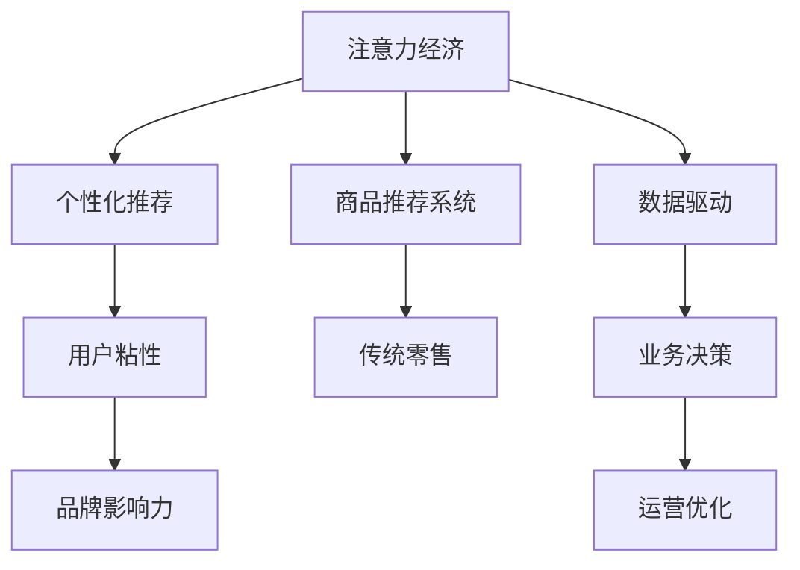

                 

# 注意力经济对传统零售业态的改造

## 1. 背景介绍

### 1.1 问题由来
随着互联网和数字技术的快速普及，注意力经济逐渐成为新的经济形态。用户注意力作为稀缺资源，成为各类企业争抢的对象。尤其在零售业，传统的以商品为中心的运营模式已经逐渐失效，如何获取、维持、利用用户注意力，成为企业关注的焦点。这一背景下，基于注意力的商业改造，即注意力经济，应运而生。

### 1.2 问题核心关键点
注意力经济，是指在数字时代，企业通过争夺用户注意力，实现商业价值转化的新经济形态。它的核心在于通过创造优质内容和个性化推荐，吸引用户关注，提升用户粘性，从而实现营销、销售等商业目标。

传统零售业态，以物理空间和库存为基础，以价格和促销为手段，以货架陈列为形式，以交易为目的。这种模式依赖于用户线下购物的频率和冲动，对用户注意力的挖掘和利用不足。而注意力经济则通过对用户在线行为数据的分析，实现商品推荐、个性化营销等功能，显著提升用户满意度和转化率。

### 1.3 问题研究意义
研究注意力经济对传统零售业态的改造，有助于理解数字时代零售业务的核心动力，发现传统零售业务中的不足和机遇，为零售企业的数字化转型提供重要参考。

## 2. 核心概念与联系

### 2.1 核心概念概述

为更好地理解注意力经济对零售业态的改造，本节将介绍几个关键概念：

- **注意力经济**：指通过争夺用户注意力实现商业价值转化的经济形态。注意力经济的核心在于利用用户注意力，提高品牌认知度和用户粘性，实现营销、销售等商业目标。

- **传统零售**：以物理空间和库存为基础，以价格和促销为手段，以货架陈列为形式，以交易为目的的零售模式。

- **个性化推荐**：基于用户行为数据，推荐符合其兴趣和需求的商品，提升用户体验和转化率。

- **商品推荐系统**：用于实现个性化推荐的智能系统，通过分析用户历史行为和偏好，推荐相关商品。

- **数据驱动**：指通过数据分析和机器学习等技术手段，驱动业务决策和运营优化，提升业务效率和效果。

- **用户粘性**：指用户对某一品牌或服务的长期关注和依赖程度，反映了品牌的影响力和用户的忠诚度。

这些概念之间的联系可以通过以下Mermaid流程图来展示：



这个流程图展示了这个概念之间的逻辑关系：

1. 注意力经济通过个性化推荐和数据驱动技术，实现对传统零售模式的改造。
2. 个性化推荐和商品推荐系统是注意力经济的核心工具，用于实现商品推荐和个性化营销。
3. 数据驱动技术提供运营优化和业务决策的支撑，提升业务效率和效果。
4. 用户粘性通过个性化推荐和数据驱动技术提升，进而增强品牌影响力和用户忠诚度。

## 3. 核心算法原理 & 具体操作步骤

### 3.1 算法原理概述

注意力经济对传统零售业态的改造，核心在于通过个性化推荐系统，实现对用户注意力的争夺和利用。其核心算法包括协同过滤、基于内容的推荐、基于用户行为的推荐等。

协同过滤算法通过分析用户历史行为和偏好，推荐相似用户喜欢的商品。基于内容的推荐算法通过分析商品属性和用户兴趣，推荐符合用户需求的商品。基于用户行为的推荐算法通过分析用户实时行为数据，实现即时推荐。

注意力经济改造的核心步骤包括：

1. 收集用户行为数据，建立用户画像。
2. 构建商品信息库，提取商品特征。
3. 设计推荐算法，实现个性化推荐。
4. 实时监测推荐效果，优化推荐模型。
5. 基于推荐效果优化业务策略，提升用户粘性和转化率。

### 3.2 算法步骤详解

以下是注意力经济改造传统零售业态的主要步骤：

**Step 1: 收集和处理数据**
- 收集用户浏览、购买、评价等行为数据，建立用户行为数据集。
- 收集商品信息，包括商品类别、属性、价格、销量等，建立商品信息库。
- 对数据进行清洗和预处理，去除异常值和噪声，确保数据质量。

**Step 2: 建立用户画像**
- 利用机器学习算法，如聚类、分类、降维等，从用户行为数据中提取用户特征，建立用户画像。
- 常见的用户画像特征包括年龄、性别、地域、购买频率、消费金额等。

**Step 3: 构建商品特征**
- 从商品信息库中提取商品属性，如品牌、类别、规格、价格等，建立商品特征向量。
- 使用文本挖掘技术，如TF-IDF、Word2Vec等，提取商品描述中的关键词，建立商品词向量。

**Step 4: 设计推荐算法**
- 选择合适的推荐算法，如协同过滤、基于内容的推荐、基于用户行为的推荐等。
- 设计推荐模型的输入和输出，确定推荐算法参数。

**Step 5: 实现个性化推荐**
- 将用户画像和商品特征输入推荐算法，计算用户对商品的兴趣度。
- 根据兴趣度排序，推荐用户最感兴趣的商品。

**Step 6: 实时监测和优化**
- 实时监测推荐效果，如点击率、转化率、用户满意度等。
- 根据监测结果调整推荐算法参数，优化推荐模型。

**Step 7: 优化业务策略**
- 根据推荐效果优化业务策略，如调整价格、优化商品陈列、改进营销活动等。
- 根据优化效果，进一步迭代和优化推荐算法。

### 3.3 算法优缺点

注意力经济改造传统零售业态的方法具有以下优点：

1. **提升用户体验**：个性化推荐能够根据用户兴趣和需求推荐商品，提升用户体验和满意度。
2. **增加用户粘性**：个性化推荐能够吸引用户持续关注，增加用户粘性和忠诚度。
3. **提高转化率**：个性化推荐能够精准推荐符合用户需求的商品，提高转化率。
4. **降低运营成本**：个性化推荐能够减少传统促销手段的投入，降低运营成本。

同时，该方法也存在以下局限性：

1. **数据依赖**：推荐算法的效果依赖于数据的丰富性和准确性，数据质量问题可能影响推荐效果。
2. **隐私风险**：用户行为数据的收集和使用可能涉及隐私问题，需要严格遵守数据隐私法规。
3. **冷启动问题**：新用户或新商品可能存在数据不足的问题，导致推荐效果不佳。
4. **个性化过度**：过度个性化可能导致用户体验泛化能力下降，对新商品不感兴趣。
5. **模型复杂度**：复杂的推荐算法可能对计算资源和模型解释性提出较高要求。

### 3.4 算法应用领域

注意力经济改造传统零售业态的方法，在电商、零售、服务业等领域已经得到了广泛的应用，具体如下：

- **电商**：通过个性化推荐系统，提高用户购物体验和转化率，提升销售额。
- **零售**：通过个性化推荐，提升用户体验，增加用户粘性，优化库存管理。
- **服务业**：通过个性化推荐，提升服务体验，增加客户满意度和忠诚度。
- **旅游业**：通过个性化推荐，提升旅游体验，增加用户预订率。
- **娱乐业**：通过个性化推荐，提升娱乐体验，增加用户留存率。

除了上述这些行业外，基于个性化推荐的注意力经济方法也在不断扩展应用领域，如医疗、金融、教育等，为这些领域带来新的商业价值。

## 4. 数学模型和公式 & 详细讲解 & 举例说明

### 4.1 数学模型构建

本节将使用数学语言对个性化推荐系统的数学模型进行更加严格的刻画。

假设用户集合为 $U=\{u_1,u_2,...,u_n\}$，商品集合为 $I=\{i_1,i_2,...,i_m\}$。用户的兴趣度表示为 $R_u \in \mathbb{R}^m$，商品的特征向量表示为 $F_i \in \mathbb{R}^d$。用户对商品 $i$ 的评分表示为 $r_{ui}$。

推荐模型 $P_i$ 定义为：

$$
P_i = \frac{R_u^T \cdot F_i}{\sqrt{R_u^T \cdot R_u} \cdot \sqrt{F_i^T \cdot F_i}}
$$

其中，$R_u$ 和 $F_i$ 分别为用户和商品的特征向量，$R_u^T \cdot R_u$ 和 $F_i^T \cdot F_i$ 分别为用户和商品的特征向量的模长。

推荐模型 $P_i$ 用于计算用户 $u$ 对商品 $i$ 的兴趣度，越高的兴趣度意味着用户越有可能选择该商品。

### 4.2 公式推导过程

以下我们以协同过滤算法为例，推导推荐模型的公式。

假设用户 $u$ 对商品 $i$ 的评分 $r_{ui}$ 未知，但已知其他用户对商品 $i$ 的评分 $r_{v_1i},r_{v_2i},...,r_{v_{ki}i}$ 和用户 $v_k$ 对商品 $j$ 的评分 $r_{v_1j},r_{v_2j},...,r_{v_{kj}j}$。

协同过滤算法通过计算用户 $u$ 和用户 $v_k$ 之间的相似度，推断用户 $u$ 对商品 $i$ 的评分。

假设用户 $u$ 和用户 $v_k$ 的相似度为 $s_{uk}$，则协同过滤推荐模型的公式为：

$$
r_{ui} = \frac{\sum_{k=1}^K s_{uk} r_{v_1i} \cdot r_{v_kj} / (\sum_{k=1}^K s_{uk} r_{v_1j})}{\sqrt{\sum_{k=1}^K (r_{v_ki} - \bar{r}_i)^2} / \sqrt{\sum_{k=1}^K (r_{v_kj} - \bar{r}_j)^2}}
$$

其中，$\bar{r}_i$ 和 $\bar{r}_j$ 分别为商品 $i$ 和 $j$ 的平均评分，$K$ 为相似用户的数量。

通过计算用户 $u$ 和用户 $v_k$ 之间的相似度，协同过滤算法能够推断用户 $u$ 对商品 $i$ 的评分，从而实现个性化推荐。

### 4.3 案例分析与讲解

以下以某电商平台为例，说明如何使用协同过滤算法进行个性化推荐：

假设电商平台收集了 10 万名用户的浏览和购买记录，以及 1 万个商品的评分数据。将这些数据用于构建协同过滤推荐模型。

**Step 1: 数据预处理**
- 对用户行为数据进行清洗和去重，去除异常值和噪声。
- 将用户和商品的评分数据进行标准化处理，确保数据质量。

**Step 2: 计算相似度**
- 利用用户和商品的评分数据，计算用户和商品之间的相似度。
- 常见的相似度计算方法包括皮尔逊相关系数、余弦相似度等。

**Step 3: 构建推荐模型**
- 根据用户 $u$ 和相似用户 $v_k$ 的评分数据，计算用户 $u$ 对商品 $i$ 的评分。
- 将计算出的评分排序，选择评分最高的商品进行推荐。

**Step 4: 实时监测和优化**
- 实时监测推荐效果，如点击率、转化率、用户满意度等。
- 根据监测结果调整相似度计算方法，优化推荐模型。

**Step 5: 优化业务策略**
- 根据推荐效果优化商品陈列和促销策略，提升用户粘性和转化率。
- 根据优化效果，进一步迭代和优化推荐算法。

以上案例展示了如何使用协同过滤算法进行个性化推荐，提升用户购物体验和电商平台销售额。

## 5. 项目实践：代码实例和详细解释说明

### 5.1 开发环境搭建

在进行个性化推荐系统开发前，我们需要准备好开发环境。以下是使用Python进行PyTorch开发的环境配置流程：

1. 安装Anaconda：从官网下载并安装Anaconda，用于创建独立的Python环境。

2. 创建并激活虚拟环境：
```bash
conda create -n pytorch-env python=3.8 
conda activate pytorch-env
```

3. 安装PyTorch：根据CUDA版本，从官网获取对应的安装命令。例如：
```bash
conda install pytorch torchvision torchaudio cudatoolkit=11.1 -c pytorch -c conda-forge
```

4. 安装相关库：
```bash
pip install pandas numpy scikit-learn tqdm jupyter notebook
```

5. 安装PyTorch推荐库：
```bash
pip install torch-embedding
```

完成上述步骤后，即可在`pytorch-env`环境中开始推荐系统开发。

### 5.2 源代码详细实现

这里我们以协同过滤算法为例，给出使用PyTorch进行个性化推荐系统开发的PyTorch代码实现。

首先，定义数据处理函数：

```python
import pandas as pd
from torch.utils.data import Dataset
import torch

class RecommendationDataset(Dataset):
    def __init__(self, data):
        self.data = data
        self.n_users = len(data['user'])
        self.n_items = len(data['item'])
        
    def __len__(self):
        return len(self.data)
    
    def __getitem__(self, index):
        user, item, rating = self.data.iloc[index, :]
        user = torch.tensor([user], dtype=torch.long)
        item = torch.tensor([item], dtype=torch.long)
        rating = torch.tensor([rating], dtype=torch.float)
        return {'user': user, 'item': item, 'rating': rating}
```

然后，定义推荐模型：

```python
import torch.nn as nn
import torch.nn.functional as F

class RecommendationModel(nn.Module):
    def __init__(self, n_users, n_items, embedding_dim):
        super(RecommendationModel, self).__init__()
        self.user_embedding = nn.Embedding(n_users, embedding_dim)
        self.item_embedding = nn.Embedding(n_items, embedding_dim)
        
    def forward(self, user, item):
        user_embedding = self.user_embedding(user)
        item_embedding = self.item_embedding(item)
        return torch.matmul(user_embedding, item_embedding.t())
```

接着，定义训练和评估函数：

```python
from torch.utils.data import DataLoader
from tqdm import tqdm

def train_epoch(model, data_loader, optimizer):
    model.train()
    for batch in data_loader:
        user = batch['user']
        item = batch['item']
        rating = batch['rating']
        prediction = model(user, item)
        loss = F.mse_loss(prediction, rating)
        optimizer.zero_grad()
        loss.backward()
        optimizer.step()
    return loss.item()

def evaluate(model, data_loader):
    model.eval()
    total_loss = 0
    for batch in data_loader:
        user = batch['user']
        item = batch['item']
        rating = batch['rating']
        prediction = model(user, item)
        loss = F.mse_loss(prediction, rating)
        total_loss += loss.item()
    return total_loss / len(data_loader)
```

最后，启动训练流程并在测试集上评估：

```python
epochs = 10
batch_size = 64
learning_rate = 0.001

model = RecommendationModel(n_users, n_items, embedding_dim)
optimizer = torch.optim.Adam(model.parameters(), lr=learning_rate)

data = pd.read_csv('data.csv')
train_dataset = RecommendationDataset(data[data['time'] < '2021-01-01'])
test_dataset = RecommendationDataset(data[data['time'] >= '2021-01-01'])

train_loader = DataLoader(train_dataset, batch_size=batch_size, shuffle=True)
test_loader = DataLoader(test_dataset, batch_size=batch_size, shuffle=False)

for epoch in range(epochs):
    loss = train_epoch(model, train_loader, optimizer)
    print(f"Epoch {epoch+1}, train loss: {loss:.4f}")
    
    print(f"Epoch {epoch+1}, test loss: {evaluate(model, test_loader):.4f}")
    
print("Training complete.")
```

以上就是使用PyTorch进行协同过滤推荐系统开发的完整代码实现。可以看到，得益于PyTorch的强大封装，我们可以用相对简洁的代码完成推荐系统的构建。

### 5.3 代码解读与分析

让我们再详细解读一下关键代码的实现细节：

**RecommendationDataset类**：
- `__init__`方法：初始化用户、商品、评分等关键组件。
- `__len__`方法：返回数据集的样本数量。
- `__getitem__`方法：对单个样本进行处理，将用户和商品转换为模型所需的嵌入向量，返回评分。

**训练和评估函数**：
- 使用PyTorch的DataLoader对数据集进行批次化加载，供模型训练和推理使用。
- 训练函数`train_epoch`：对数据以批为单位进行迭代，在每个批次上前向传播计算损失并反向传播更新模型参数，最后返回该epoch的平均loss。
- 评估函数`evaluate`：与训练类似，不同点在于不更新模型参数，并在每个batch结束后将预测和标签结果存储下来，最后使用均方误差计算平均loss。

**训练流程**：
- 定义总的epoch数和batch size，开始循环迭代
- 每个epoch内，先在训练集上训练，输出平均loss
- 在测试集上评估，输出平均loss
- 所有epoch结束后，训练完成

可以看到，PyTorch配合推荐库使得协同过滤推荐系统的代码实现变得简洁高效。开发者可以将更多精力放在数据处理、模型改进等高层逻辑上，而不必过多关注底层的实现细节。

当然，工业级的系统实现还需考虑更多因素，如模型的保存和部署、超参数的自动搜索、更灵活的任务适配层等。但核心的推荐范式基本与此类似。

## 6. 实际应用场景

### 6.1 智能电商

基于个性化推荐的注意力经济方法，在智能电商中得到了广泛应用。智能电商通过分析用户历史行为和偏好，实现精准的商品推荐，提升用户购物体验和转化率。

在技术实现上，智能电商平台收集用户浏览、点击、购买等行为数据，构建用户画像。同时收集商品信息，提取商品特征，构建商品信息库。利用协同过滤、基于内容的推荐等算法，实现个性化推荐。

智能电商平台的推荐系统通常集成在商品详情页、购物车、搜索页等位置，根据用户实时行为数据进行实时推荐。同时，通过A/B测试等方式，持续优化推荐模型和策略，提高推荐效果。

### 6.2 零售店

基于个性化推荐的注意力经济方法，在传统零售店中也有广泛应用。传统的零售店通过货架陈列和促销活动吸引顾客，但往往忽视了用户需求的多样性。而基于个性化推荐的零售店，能够根据用户兴趣和需求推荐商品，提升用户购物体验和满意度。

在技术实现上，零售店通过安装RFID、摄像头等设备，收集用户行为数据，建立用户画像。同时收集商品信息，提取商品特征，构建商品信息库。利用协同过滤、基于内容的推荐等算法，实现个性化推荐。

零售店的推荐系统通常集成在店内终端、手机APP等渠道，根据用户实时行为数据进行实时推荐。同时，通过A/B测试等方式，持续优化推荐模型和策略，提高推荐效果。

### 6.3 服务业

基于个性化推荐的注意力经济方法，在服务业中也有广泛应用。传统服务业往往依赖于员工的推荐和推销，效率低下，用户体验不佳。而基于个性化推荐的服务业，能够根据用户兴趣和需求推荐服务项目，提升用户满意度和忠诚度。

在技术实现上，服务业通过收集用户历史订单、评价等数据，建立用户画像。同时收集服务项目信息，提取服务项目特征，构建服务项目信息库。利用协同过滤、基于内容的推荐等算法，实现个性化推荐。

服务业的服务推荐系统通常集成在官网、APP等渠道，根据用户实时行为数据进行实时推荐。同时，通过A/B测试等方式，持续优化推荐模型和策略，提高推荐效果。

### 6.4 未来应用展望

随着个性化推荐技术的不断发展，基于注意力经济的商业改造也将不断拓展应用场景，为更多领域带来新的商业价值。

在智慧医疗领域，基于个性化推荐的医疗推荐系统，能够根据患者历史数据和实时症状，推荐最佳治疗方案，提高诊疗效率和效果。

在金融服务领域，基于个性化推荐的金融理财系统，能够根据用户财务状况和投资偏好，推荐最适合的投资组合，提高用户理财收益。

在教育培训领域，基于个性化推荐的在线教育平台，能够根据学生学习行为和知识掌握情况，推荐最适合的学习资源，提高学习效果和满意度。

此外，在智慧城市、旅游、娱乐等领域，基于个性化推荐的注意力经济方法也将不断扩展应用领域，为这些领域带来新的商业价值。相信随着技术的日益成熟，基于个性化推荐的注意力经济方法将成为各行各业数字化转型的重要工具。

## 7. 工具和资源推荐

### 7.1 学习资源推荐

为了帮助开发者系统掌握个性化推荐技术的理论基础和实践技巧，这里推荐一些优质的学习资源：

1. 《推荐系统》（项亮著）：全面介绍了推荐系统的基本概念、算法和应用，是入门推荐系统的经典教材。

2. 《Python推荐系统实践》（作者：Johan Schafer）：介绍了使用Python实现推荐系统的具体方法和案例，适合动手实践。

3. Coursera《Recommender Systems》课程：由斯坦福大学开设的推荐系统课程，有Lecture视频和配套作业，带你系统掌握推荐系统基本概念和技术。

4. Kaggle推荐系统竞赛：通过参与Kaggle推荐系统竞赛，实践推荐算法，积累推荐系统实践经验。

5. RecSys会议论文：推荐系统领域的顶级会议论文集，包含大量前沿研究和经典算法，适合深入学习和研究。

通过对这些资源的学习实践，相信你一定能够快速掌握个性化推荐技术的精髓，并用于解决实际的推荐问题。

### 7.2 开发工具推荐

高效的开发离不开优秀的工具支持。以下是几款用于推荐系统开发的常用工具：

1. Python：作为推荐系统开发的主流语言，Python拥有丰富的开源库和工具，如Scikit-learn、TensorFlow等。

2. PyTorch：基于Python的开源深度学习框架，灵活动态的计算图，适合快速迭代研究。

3. TensorFlow：由Google主导开发的开源深度学习框架，生产部署方便，适合大规模工程应用。

4. Jupyter Notebook：支持Python和R等多种语言的开发环境，方便开发和分享。

5. Weights & Biases：模型训练的实验跟踪工具，可以记录和可视化模型训练过程中的各项指标，方便对比和调优。

6. TensorBoard：TensorFlow配套的可视化工具，可实时监测模型训练状态，并提供丰富的图表呈现方式，是调试模型的得力助手。

合理利用这些工具，可以显著提升推荐系统开发的效率，加快创新迭代的步伐。

### 7.3 相关论文推荐

推荐系统的发展离不开学界的持续研究。以下是几篇奠基性的相关论文，推荐阅读：

1. 《协同过滤推荐系统综述》：全面总结了协同过滤推荐系统的发展历程和经典算法，适合深入了解推荐系统基本原理和技术。

2. 《基于内容的推荐系统》：介绍了一种基于内容特征的推荐系统，适合了解推荐系统的另一重要范式。

3. 《深度学习在推荐系统中的应用》：总结了深度学习在推荐系统中的应用，介绍了经典深度推荐模型和算法。

4. 《注意力机制在推荐系统中的应用》：探讨了注意力机制在推荐系统中的应用，介绍了基于注意力机制的推荐算法。

5. 《推荐系统中的序列建模》：介绍了推荐系统中的序列建模方法，如基于时序的推荐系统，适合了解推荐系统中的新范式。

这些论文代表了这个领域的最新进展，通过学习这些前沿成果，可以帮助研究者把握学科前进方向，激发更多的创新灵感。

## 8. 总结：未来发展趋势与挑战

### 8.1 总结

本文对基于个性化推荐的注意力经济对传统零售业态的改造进行了全面系统的介绍。首先阐述了个性化推荐系统在零售业态改造中的重要性和核心算法，明确了推荐系统对提升用户体验和转化率的作用。其次，从原理到实践，详细讲解了推荐系统的数学模型和算法步骤，给出了推荐系统开发的完整代码实例。同时，本文还广泛探讨了推荐系统在电商、零售、服务业等多个行业领域的应用前景，展示了推荐系统的巨大潜力。此外，本文精选了推荐系统的各类学习资源，力求为读者提供全方位的技术指引。

通过本文的系统梳理，可以看到，基于个性化推荐的注意力经济方法正在成为零售业态改造的重要手段，极大地提升了用户的购物体验和转化率，推动了零售企业的数字化转型。未来，伴随推荐算法的不断演进和技术的进一步成熟，基于个性化推荐的零售业态将迎来更多创新和突破。

### 8.2 未来发展趋势

展望未来，推荐系统的发展趋势主要体现在以下几个方面：

1. **多模态推荐**：推荐系统不再局限于文本和图片等单一模态，将更多地融合语音、视频等多元数据，实现更全面的用户画像和商品特征表示。

2. **实时推荐**：推荐系统将实现实时推荐，根据用户实时行为数据，动态调整推荐结果，提升推荐效果。

3. **跨域推荐**：推荐系统将实现跨域推荐，根据用户在不同平台和渠道的行为数据，提供更一致的推荐结果。

4. **隐私保护**：推荐系统将更加注重隐私保护，通过匿名化、差分隐私等技术手段，保护用户数据隐私。

5. **智能推荐**：推荐系统将结合自然语言处理、图像识别等人工智能技术，实现更智能化的推荐结果。

6. **社交推荐**：推荐系统将结合社交网络数据，实现基于社交关系的推荐，提升推荐效果。

这些趋势将进一步提升推荐系统的智能化和个性化水平，为更多领域带来新的商业价值。

### 8.3 面临的挑战

尽管推荐系统在零售业态改造中取得了显著成效，但在走向大规模应用的过程中，它仍面临诸多挑战：

1. **数据质量问题**：推荐系统依赖于高质量的数据，数据采集、清洗和标注过程复杂，容易出现数据噪音和偏差。

2. **冷启动问题**：新用户或新商品存在数据不足的问题，导致推荐效果不佳。

3. **算法复杂度**：复杂的推荐算法对计算资源和模型解释性提出较高要求，需要高效的数据存储和计算平台支撑。

4. **隐私保护问题**：推荐系统需要处理大量用户行为数据，可能涉及隐私问题，需要严格遵守数据隐私法规。

5. **推荐多样性问题**：推荐系统容易陷入过拟合，推荐结果多样性不足，影响用户体验。

6. **业务适配问题**：推荐系统需要根据不同业务场景进行适配，才能充分发挥其效果。

这些挑战需要我们在技术、业务、伦理等多个维度进行全面优化，才能实现推荐系统的成功应用。

### 8.4 研究展望

面对推荐系统面临的种种挑战，未来的研究需要在以下几个方面寻求新的突破：

1. **数据质量控制**：开发高效的数据采集、清洗和标注工具，确保数据质量和多样性。

2. **冷启动优化**：开发冷启动推荐算法，提升新用户和新商品的推荐效果。

3. **算法高效化**：开发高效的数据存储和计算平台，提升推荐系统的计算效率和模型解释性。

4. **隐私保护技术**：结合差分隐私、联邦学习等技术手段，保护用户数据隐私。

5. **推荐多样化**：开发多样性推荐算法，提升推荐结果的多样性和用户体验。

6. **业务适配技术**：开发业务适配工具，根据不同业务场景进行推荐系统优化。

这些研究方向的探索，必将引领推荐系统迈向更高的台阶，为更多领域带来新的商业价值。相信随着技术的日益成熟，推荐系统将在更多领域得到广泛应用，深刻影响人类的生产生活方式。

## 9. 附录：常见问题与解答

**Q1：推荐系统如何处理新商品？**

A: 推荐系统处理新商品通常采用以下几种方法：

1. 基于内容的推荐：通过提取新商品的属性特征，计算其与其他商品之间的相似度，推荐与之相似的已有商品。

2. 协同过滤推荐：利用新商品的用户评价和相似用户的评价，推断新商品的评分，从而实现推荐。

3. 混合推荐：结合多种推荐算法，综合考虑新商品的属性特征和用户行为数据，实现更全面的推荐。

通过这些方法，推荐系统可以较好地处理新商品，提升推荐效果。

**Q2：推荐系统如何处理数据冷启动问题？**

A: 推荐系统处理数据冷启动问题通常采用以下几种方法：

1. 基于内容的推荐：通过提取新用户的兴趣特征，推荐与之兴趣相似的商品。

2. 协同过滤推荐：利用新用户的相似用户的评分数据，推断新用户的评分，从而实现推荐。

3. 混合推荐：结合多种推荐算法，提升推荐系统的泛化能力，减少数据冷启动对推荐效果的影响。

4. 模型预训练：通过预训练模型，提升推荐系统对新数据和实体的适应能力。

通过这些方法，推荐系统可以有效处理数据冷启动问题，提升推荐效果。

**Q3：推荐系统如何平衡推荐效果和多样性？**

A: 推荐系统平衡推荐效果和多样性通常采用以下几种方法：

1. 多样性约束：在推荐模型中加入多样性约束，如基于负采样的方法，限制推荐结果的重复率。

2. 多目标优化：将推荐效果和多样性作为联合优化目标，通过多目标优化算法，实现两者的平衡。

3. 探索性推荐：通过引入探索性算法，如贝叶斯带臂探索算法，平衡推荐效果和多样性。

4. 人工干预：根据业务需求，对推荐结果进行人工干预，调整推荐策略，提升推荐效果和多样性。

通过这些方法，推荐系统可以有效平衡推荐效果和多样性，提升用户体验。

**Q4：推荐系统如何保护用户隐私？**

A: 推荐系统保护用户隐私通常采用以下几种方法：

1. 数据匿名化：对用户数据进行匿名化处理，保护用户隐私。

2. 差分隐私：通过差分隐私技术，在保证推荐效果的前提下，降低数据泄露风险。

3. 联邦学习：通过联邦学习技术，在本地设备上进行模型训练，保护用户数据隐私。

4. 数据加密：对用户数据进行加密处理，保护数据安全。

5. 用户授权：在使用用户数据前，获取用户授权，确保用户知情同意。

通过这些方法，推荐系统可以有效保护用户隐私，避免数据泄露风险。

**Q5：推荐系统如何处理推荐结果多样性不足的问题？**

A: 推荐系统处理推荐结果多样性不足的问题通常采用以下几种方法：

1. 多样性约束：在推荐模型中加入多样性约束，如基于负采样的方法，限制推荐结果的重复率。

2. 多目标优化：将推荐效果和多样性作为联合优化目标，通过多目标优化算法，实现两者的平衡。

3. 探索性推荐：通过引入探索性算法，如贝叶斯带臂探索算法，平衡推荐效果和多样性。

4. 人工干预：根据业务需求，对推荐结果进行人工干预，调整推荐策略，提升推荐效果和多样性。

通过这些方法，推荐系统可以有效提升推荐结果的多样性，提升用户体验。

总之，推荐系统在零售业态改造中的应用前景广阔，通过不断优化算法和改进技术，可以进一步提升用户体验和转化率，推动零售企业的数字化转型。未来，伴随推荐算法的不断演进和技术的进一步成熟，基于推荐系统的注意力经济方法将成为零售业态改造的重要手段，深刻影响人类的生产生活方式。

